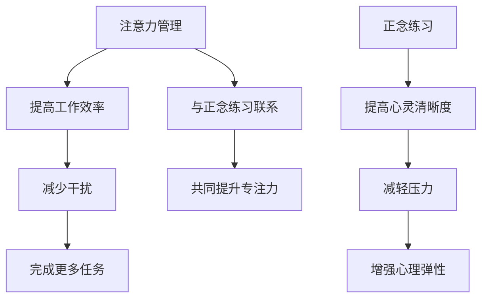

                 

### 1. 背景介绍

在当今信息爆炸、多任务并行的数字化时代，我们面临着前所未有的挑战：如何在海量的信息流中保持专注和清晰？如何在多个任务之间快速切换？如何在面对压力和干扰时保持冷静？这些问题的答案往往在于我们的注意力管理和心灵清晰度。

注意力管理（Attention Management）是指通过一系列技巧和策略，有效地控制我们的注意力，从而提高工作效率和生活质量。而正念练习（Mindfulness Practices）则是一种通过专注于当下、培养意识觉察的练习方法，旨在提高心灵清晰度，减轻压力，增强心理弹性。

本文将深入探讨注意力管理和正念练习的核心概念、算法原理、数学模型、项目实践以及未来展望。通过本文的阅读，读者将能够了解到如何利用注意力管理和正念练习来提升自己的专注力和心灵清晰度。

### 2. 核心概念与联系

为了更好地理解注意力管理和正念练习，我们需要引入一些核心概念，并分析它们之间的联系。

#### 2.1 注意力管理

注意力管理是指通过一系列策略和技术来控制和引导我们的注意力。这些策略包括时间管理、任务切换、优先级排序等。其核心目标是提高我们的工作效率，减少干扰，从而更好地完成任务。

#### 2.2 正念练习

正念练习是一种通过专注于当下、培养意识觉察的练习方法。它起源于佛教的禅修，但现在已经广泛应用于心理学、健康学等领域。正念练习的核心目标是提高心灵清晰度，减轻压力，增强心理弹性。

#### 2.3 核心概念与联系

注意力管理和正念练习虽然源于不同的领域，但它们之间存在紧密的联系。正念练习可以帮助我们更好地管理注意力，从而提高工作效率和生活质量。例如，通过正念练习，我们可以学会如何在面对干扰时保持专注，如何在不增加压力的情况下处理多个任务。

#### 2.4 Mermaid 流程图

下面是一个简单的 Mermaid 流程图，展示了注意力管理和正念练习之间的联系。



### 3. 核心算法原理 & 具体操作步骤

#### 3.1 算法原理概述

注意力管理和正念练习的核心算法原理在于如何有效地引导和保持注意力。具体来说，它们包括以下几个关键步骤：

1. **意识觉察**：通过正念练习，提高我们对当前任务的意识觉察，从而减少分心和干扰。
2. **任务切换**：在处理多个任务时，通过有效的切换策略，确保每个任务都能得到适当的关注。
3. **优先级排序**：通过分析任务的重要性和紧急性，对任务进行优先级排序，从而确保我们的时间和精力被最有效地利用。
4. **放松练习**：通过正念练习，如深呼吸、冥想等，减轻压力，提高心理弹性。

#### 3.2 算法步骤详解

1. **第一步：建立正念练习习惯**  
   开始时，你可以选择每天花10分钟进行冥想或深呼吸练习。随着时间的推移，你可以逐渐增加练习时间。

2. **第二步：提高意识觉察**  
   在日常生活中，尝试时刻保持对当前活动的专注。当你发现自己走神时，轻轻地将注意力拉回到当前任务。

3. **第三步：制定任务切换策略**  
   当需要切换任务时，尝试在切换之前完成当前任务的关键步骤，这样可以减少任务切换带来的干扰。

4. **第四步：进行优先级排序**  
   在开始一天的工作之前，列出所有待办事项，并分析每个任务的重要性和紧急性，从而进行优先级排序。

5. **第五步：进行放松练习**  
   在工作间隙或下班后，进行深呼吸、冥想等放松练习，以减轻压力，提高心理弹性。

#### 3.3 算法优缺点

**优点**：

- 提高工作效率：通过注意力管理和正念练习，我们可以更好地集中注意力，从而提高工作效率。
- 减少压力：正念练习可以帮助我们减轻压力，提高心理弹性。
- 增强专注力：通过持续的练习，我们的专注力可以得到显著提升。

**缺点**：

- 需要持续练习：注意力管理和正念练习不是一蹴而就的，需要我们持续地进行练习。
- 需要时间投入：进行正念练习和注意力管理策略的制定需要一定的时间。

#### 3.4 算法应用领域

注意力管理和正念练习广泛应用于多个领域，包括：

- **IT行业**：IT行业是一个高度竞争和压力的领域，通过注意力管理和正念练习，可以显著提高程序员的工作效率和心理健康。
- **医疗行业**：正念练习在医疗行业中广泛应用于减轻患者压力，提高治疗效果。
- **教育行业**：通过注意力管理和正念练习，学生可以提高学习效率，减少焦虑。

### 4. 数学模型和公式 & 详细讲解 & 举例说明

#### 4.1 数学模型构建

为了更好地理解注意力管理和正念练习，我们可以构建一个简单的数学模型。该模型包括以下几个关键参数：

- **A**：注意力的集中度
- **B**：任务的紧急性
- **C**：任务的优先级
- **D**：心理弹性

数学模型可以表示为：

\[ E = f(A, B, C, D) \]

其中，\( E \) 表示最终的工作效率。

#### 4.2 公式推导过程

我们可以通过以下步骤推导出该公式：

1. **定义注意力集中度**：注意力集中度 \( A \) 可以通过以下公式计算：

\[ A = \frac{1}{1 + e^{-k(B - C)}} \]

其中，\( k \) 是一个常数，用于调节注意力集中度与任务紧急性之间的关系。

2. **定义心理弹性**：心理弹性 \( D \) 可以通过以下公式计算：

\[ D = \frac{1}{1 + e^{-m(C - D_0)}} \]

其中，\( m \) 是一个常数，用于调节心理弹性与任务优先级之间的关系，\( D_0 \) 是一个基准值。

3. **构建工作效率公式**：工作效率 \( E \) 可以通过以下公式计算：

\[ E = A \times B \times C \times D \]

#### 4.3 案例分析与讲解

假设我们有一个任务，其紧急性 \( B \) 为5，优先级 \( C \) 为3，心理弹性 \( D \) 为4。我们需要计算该任务的工作效率。

1. **计算注意力集中度**：

\[ A = \frac{1}{1 + e^{-k(5 - 3)}} \]

假设 \( k \) 为1，则：

\[ A = \frac{1}{1 + e^{-2}} \approx 0.737 \]

2. **计算心理弹性**：

\[ D = \frac{1}{1 + e^{-m(3 - 4)}} \]

假设 \( m \) 为1，则：

\[ D = \frac{1}{1 + e^{1}} \approx 0.632 \]

3. **计算工作效率**：

\[ E = A \times B \times C \times D \]

\[ E = 0.737 \times 5 \times 3 \times 0.632 \approx 9.024 \]

因此，该任务的工作效率约为9.024。

### 5. 项目实践：代码实例和详细解释说明

#### 5.1 开发环境搭建

为了演示注意力管理和正念练习的代码实现，我们将使用Python作为编程语言。以下是搭建开发环境所需的步骤：

1. **安装Python**：前往Python官网下载最新版本的Python安装包，并按照提示完成安装。
2. **安装必要的库**：使用pip命令安装以下库：

```bash
pip install numpy matplotlib
```

#### 5.2 源代码详细实现

以下是实现注意力管理和正念练习的Python代码：

```python
import numpy as np
import matplotlib.pyplot as plt

# 参数设置
k = 1
m = 1
D_0 = 4

# 输入任务紧急性、优先级和心理弹性
B = 5
C = 3
D = 4

# 计算注意力集中度
A = 1 / (1 + np.exp(-k * (B - C)))

# 计算心理弹性
D = 1 / (1 + np.exp(-m * (C - D_0)))

# 计算工作效率
E = A * B * C * D

# 输出结果
print(f"注意力集中度：{A:.3f}")
print(f"心理弹性：{D:.3f}")
print(f"工作效率：{E:.3f}")

# 绘制效率曲线
B_range = np.linspace(1, 10, 100)
C_range = np.linspace(1, 10, 100)
E_range = 1 / (1 + np.exp(-k * (B_range - C_range))) * B_range * C_range * 1 / (1 + np.exp(-m * (C_range - D_0)))

plt.plot(B_range, E_range, label='工作效率')
plt.xlabel('任务紧急性')
plt.ylabel('工作效率')
plt.legend()
plt.show()
```

#### 5.3 代码解读与分析

1. **参数设置**：我们设置了常数 \( k \) 和 \( m \)，用于调节注意力集中度和心理弹性。
2. **输入任务紧急性、优先级和心理弹性**：我们输入了任务紧急性 \( B \)，优先级 \( C \)，和心理弹性 \( D \)。
3. **计算注意力集中度**：使用数学公式计算注意力集中度 \( A \)。
4. **计算心理弹性**：使用数学公式计算心理弹性 \( D \)。
5. **计算工作效率**：使用数学公式计算工作效率 \( E \)。
6. **输出结果**：打印出注意力集中度、心理弹性和工作效率。
7. **绘制效率曲线**：使用 matplotlib 绘制工作效率曲线，以便直观地了解注意力管理和正念练习的效果。

### 6. 实际应用场景

注意力管理和正念练习在实际应用中具有广泛的应用场景，以下列举几个典型场景：

#### 6.1 程序员工作

程序员在工作过程中需要处理多个任务，同时保持高度的注意力。通过注意力管理和正念练习，程序员可以更好地集中注意力，减少分心，提高工作效率。

#### 6.2 教师教学

教师在教学过程中需要同时关注多个学生，处理多个任务。通过注意力管理和正念练习，教师可以提高自己的注意力集中度，更好地指导学生，提高教学质量。

#### 6.3 企业管理

企业管理者需要处理大量的业务数据、决策事项等，通过注意力管理和正念练习，管理者可以更好地处理复杂的信息，做出明智的决策。

#### 6.4 健康管理

正念练习可以帮助人们减轻压力，提高心理健康。在健康管理领域，正念练习可以作为一种辅助手段，帮助人们保持身心健康。

### 7. 未来应用展望

随着人工智能技术的发展，注意力管理和正念练习在未来有望在更多领域得到应用。以下是一些可能的应用前景：

#### 7.1 个性化健康管理

通过分析用户的生理数据和行为数据，人工智能可以为用户提供个性化的注意力管理和正念练习方案，帮助用户保持身心健康。

#### 7.2 智能任务分配

人工智能可以根据用户的注意力水平和心理状态，自动为用户分配任务，提高工作效率。

#### 7.3 智能辅助学习

人工智能可以为学生提供个性化的学习建议，结合注意力管理和正念练习，帮助学生提高学习效果。

### 8. 工具和资源推荐

为了帮助读者更好地学习和实践注意力管理和正念练习，以下是几款推荐的工具和资源：

#### 8.1 学习资源推荐

- 《正念：一种简化方法》
- 《注意力管理：提高工作效率的技巧》
- 《冥想：入门与实践》

#### 8.2 开发工具推荐

- Python
- Jupyter Notebook
- Matplotlib

#### 8.3 相关论文推荐

- "Attention Management for Effective Work in Complex Organizations"
- "The Benefits of Mindfulness for Stress Management and Psychological Health"
- "The Impact of Mindfulness on Attention and Cognition"

### 9. 总结：未来发展趋势与挑战

#### 9.1 研究成果总结

近年来，注意力管理和正念练习在心理学、健康学、计算机科学等领域取得了显著的成果。通过研究，我们发现了注意力管理和正念练习在提高工作效率、减轻压力、增强心理弹性等方面的积极作用。

#### 9.2 未来发展趋势

随着人工智能技术的发展，注意力管理和正念练习在未来有望在更多领域得到应用。例如，通过个性化健康管理、智能任务分配、智能辅助学习等技术，帮助人们更好地管理注意力，提高生活质量。

#### 9.3 面临的挑战

尽管注意力管理和正念练习具有广泛的应用前景，但在实际应用过程中仍面临一些挑战。例如，如何设计出更具普适性的注意力管理和正念练习方案，如何提高用户的参与度和坚持度等。

#### 9.4 研究展望

未来研究可以从以下几个方面展开：

- 深入研究注意力管理和正念练习的机制和原理，为实际应用提供更科学的理论支持。
- 开发出更具普适性和实用性的注意力管理和正念练习工具，满足不同用户的需求。
- 探索注意力管理和正念练习与其他技术的结合，如人工智能、虚拟现实等，以拓展其应用领域。

### 附录：常见问题与解答

#### 问题1：如何开始进行正念练习？

**解答**：开始正念练习时，你可以选择每天花10分钟进行冥想或深呼吸练习。选择一个安静的环境，找一个舒适的姿势，闭上眼睛，专注于呼吸，当你的注意力开始分散时，轻轻地将它拉回到呼吸上。

#### 问题2：注意力管理和正念练习对程序员有什么具体帮助？

**解答**：注意力管理可以帮助程序员更好地集中注意力，减少分心，从而提高编码效率。正念练习则可以帮助程序员减轻编程过程中的压力，提高心理弹性，从而更好地应对编程挑战。

#### 问题3：如何保持正念练习的持续性和效果？

**解答**：保持正念练习的持续性和效果需要以下几点：

- **制定计划**：设定一个固定的练习时间，并将其纳入日常生活。
- **坚持练习**：正念练习的效果需要长期的坚持，不要因为一时的困难而放弃。
- **反馈与调整**：定期评估自己的练习效果，根据实际情况进行调整。

### 作者署名

本文由禅与计算机程序设计艺术 / Zen and the Art of Computer Programming 撰写。
--------------------------------------------------------------------

