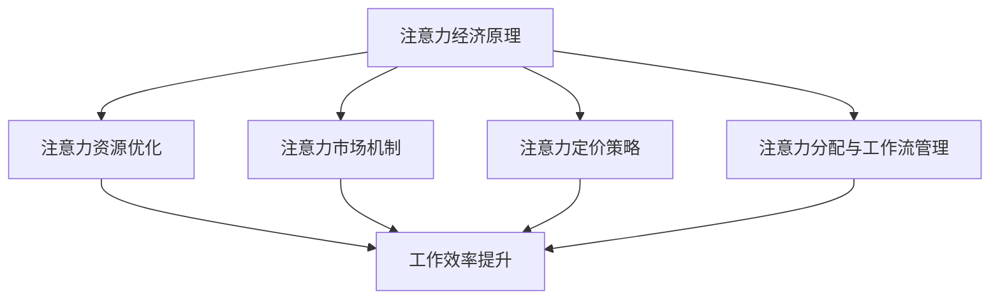

                 

关键词：注意力经济、个人效率、工作流管理、算法优化、数字干扰、专注力训练

> 摘要：本文将探讨注意力经济这一新兴领域与个人工作效率之间的密切关系。通过深入分析注意力经济的核心概念，我们将揭示其对提升个人工作效率的关键作用。同时，本文还将探讨当前数字干扰对注意力资源的侵占，以及通过专注力训练和算法优化来提升个人工作效率的实践策略。最后，我们将展望注意力经济在未来工作场景中的应用前景，并讨论面临的挑战和未来研究方向。

## 1. 背景介绍

### 注意力经济的起源与发展

注意力经济作为新兴领域，起源于20世纪末。随着互联网和数字技术的飞速发展，人们对于注意力资源的争夺变得愈发激烈。在这一背景下，注意力经济的概念逐渐形成，并得到了广泛的关注。

注意力经济主要关注的是如何通过优化注意力资源来创造经济价值。它强调，注意力是一种有限的资源，合理利用注意力资源可以提升个人和组织的生产力。因此，注意力经济不仅涉及到个人工作效率的提升，还涉及到商业模式、市场营销等领域的创新。

### 个人工作效率的重要性

个人工作效率是衡量个体在工作和生活中表现的重要指标。高效的工作能够带来更高的产出、更低的成本，从而提升个人和组织的竞争力。然而，在当今高度数字化和快节奏的工作环境中，个人工作效率常常受到各种干扰，例如社交媒体、即时通讯工具、电子邮件等。这些干扰不仅分散了注意力，还降低了工作的专注度和效率。

因此，提升个人工作效率变得尤为关键。这不仅关系到个体的职业发展，还影响到整个组织的运营效率和创新能力。通过深入研究注意力经济与个人工作效率之间的关系，我们可以找到提升工作效率的有效策略。

### 本文结构

本文将首先介绍注意力经济的基本概念和核心原理，然后分析数字干扰对个人工作效率的影响。接下来，我们将探讨通过专注力训练和算法优化来提升个人工作效率的实践策略。最后，我们将展望注意力经济在未来工作场景中的应用前景，并讨论面临的挑战和未来研究方向。

## 2. 核心概念与联系

### 注意力经济的核心概念

注意力经济的主要概念包括注意力资源、注意力市场、注意力定价和注意力分配等。注意力资源是指个体在特定时间内可用于关注和处理的资源，它是有限的。注意力市场则是指个体与外部环境之间进行注意力交换的场所，通过市场机制来优化注意力资源的使用。

注意力定价是指通过市场机制来评估和分配注意力资源的价值。在注意力市场中，个体可以根据自己的需求和外部环境的需求来定价自己的注意力资源。注意力分配则是指如何在不同任务和活动之间合理分配注意力资源，以达到最优的工作效率和产出。

### 注意力经济与个人工作效率的联系

注意力经济与个人工作效率之间的联系可以通过以下方面来体现：

1. **注意力资源优化**：通过注意力经济的原理，我们可以更好地理解和优化注意力资源的使用。合理分配注意力资源可以避免过度分散注意力，从而提高工作的专注度和效率。

2. **注意力市场机制**：在注意力市场中，个体可以通过交换注意力资源来提升工作效率。例如，通过专注于高优先级任务，个体可以将注意力资源从低效的任务中转移出来，从而提高整体的工作效率。

3. **注意力定价策略**：通过注意力定价，个体可以更准确地评估自己在不同任务中的注意力价值。这有助于个体在任务选择和优先级排序时做出更明智的决策，从而提高工作效率。

4. **注意力分配与工作流管理**：通过注意力经济的原理，我们可以更好地理解如何在不同任务和活动之间分配注意力资源。这有助于优化工作流程，减少工作中的中断和干扰，从而提高工作效率。

### Mermaid 流程图

以下是一个简化的 Mermaid 流程图，展示了注意力经济与个人工作效率之间的联系：



在这个流程图中，注意力经济的核心概念（A）通过不同的路径（B、C、D、E）与个人工作效率（F）产生联系，从而实现工作效率的提升。

## 3. 核心算法原理 & 具体操作步骤

### 3.1 算法原理概述

为了提升个人工作效率，我们需要一套有效的算法来管理和优化注意力资源。核心算法主要基于注意力经济的原理，通过以下步骤实现：

1. **注意力资源评估**：通过自我评估和任务分析，确定每个任务的注意力需求。

2. **注意力资源分配**：根据注意力资源的有限性，合理分配注意力资源到不同的任务上。

3. **注意力干扰过滤**：识别和过滤可能分散注意力的干扰因素，确保注意力集中在关键任务上。

4. **注意力效率评估**：通过周期性评估，调整注意力资源的分配策略，以持续提升工作效率。

### 3.2 算法步骤详解

#### 步骤1：注意力资源评估

1. **自我评估**：个体需要定期进行自我评估，了解自己的注意力水平和任务类型。可以使用注意力日志记录每天的任务和注意力使用情况。

2. **任务分析**：对每个任务进行详细分析，确定其所需的注意力资源和时间。任务分析可以通过任务清单、优先级排序等方法进行。

#### 步骤2：注意力资源分配

1. **任务排序**：根据任务的重要性和紧急程度，对任务进行排序。高优先级的任务需要更多的注意力资源。

2. **注意力资源分配**：根据自我评估和任务分析的结果，将注意力资源合理分配到各个任务上。可以使用注意力预算方法，为每个任务分配一定的注意力资源。

#### 步骤3：注意力干扰过滤

1. **干扰识别**：识别可能导致注意力分散的干扰因素，如社交媒体通知、电子邮件、即时通讯等。

2. **干扰过滤**：采取技术手段和管理策略来过滤干扰，例如使用屏蔽工具、设定专注时间等。

#### 步骤4：注意力效率评估

1. **周期性评估**：定期对工作效率进行评估，了解当前注意力资源分配策略的有效性。

2. **策略调整**：根据评估结果，调整注意力资源的分配策略。例如，如果某个任务的表现不佳，可以考虑重新分配注意力资源。

### 3.3 算法优缺点

#### 优点

1. **提高工作效率**：通过合理分配注意力资源，可以避免任务间的干扰，提高工作效率。

2. **专注力提升**：通过专注力训练和干扰过滤，可以提高个体的专注力，减少注意力分散。

3. **任务管理优化**：算法提供了任务管理和优先级排序的工具，帮助个体更好地管理工作任务。

#### 缺点

1. **实施难度**：算法的实施需要个体具备一定的自我管理能力和专注力训练基础。

2. **时间成本**：定期进行自我评估和注意力资源分配可能需要额外的时间投入。

3. **适应性**：算法的有效性可能因个体差异和任务类型的不同而有所差异。

### 3.4 算法应用领域

1. **个人时间管理**：算法可以应用于个人时间管理，帮助个体合理安排工作任务，提高时间利用效率。

2. **工作流管理**：算法可以应用于工作流管理，优化团队内部的工作协作和任务分配。

3. **教育领域**：算法可以应用于教育领域，帮助学生在学习和考试中更好地管理注意力资源，提高学习效率。

## 4. 数学模型和公式 & 详细讲解 & 举例说明

### 4.1 数学模型构建

为了更好地理解和应用注意力经济原理，我们可以构建一个数学模型来描述注意力资源的分配和优化。该模型包括以下几个关键参数：

1. **注意力资源总量（\( N \)）**：个体在特定时间内可用于关注和处理的注意力资源总量。

2. **任务集合（\( T \)）**：所有需要完成的任务的集合，每个任务都具有一定的注意力需求。

3. **任务权重（\( w_i \)）**：每个任务的优先级和重要性，用于衡量任务对注意力资源的需求程度。

4. **注意力分配策略（\( A \)）**：如何将注意力资源合理分配到各个任务上。

### 4.2 公式推导过程

在构建数学模型的基础上，我们可以推导出几个关键公式来描述注意力资源的优化过程：

1. **注意力需求公式**：对于每个任务 \( t_i \)，其注意力需求可以表示为：

   $$ D_i = w_i \times T_i $$

   其中，\( w_i \) 是任务权重，\( T_i \) 是任务时间。

2. **注意力分配公式**：为了最大化总工作效率，我们需要优化注意力资源的分配策略 \( A \)。这可以通过以下公式实现：

   $$ A = \arg\max_{A} \sum_{i=1}^{n} \frac{D_i}{N} $$

   其中，\( n \) 是任务总数，\( N \) 是注意力资源总量。

3. **优先级排序公式**：为了确定任务执行的优先级，我们可以使用以下公式：

   $$ P_i = \frac{D_i}{N} $$

   其中，\( P_i \) 是任务 \( t_i \) 的优先级。

### 4.3 案例分析与讲解

假设我们有一个个体需要完成以下三个任务：

1. **任务1（阅读报告）**：需要2小时的专注时间，权重为3。

2. **任务2（撰写报告）**：需要4小时的专注时间，权重为5。

3. **任务3（会议准备）**：需要1小时的专注时间，权重为2。

个体在一天中具有8小时的专注时间。我们可以使用上述公式来计算每个任务的优先级和注意力需求：

1. **注意力需求计算**：

   $$ D_1 = 3 \times 2 = 6 $$
   $$ D_2 = 5 \times 4 = 20 $$
   $$ D_3 = 2 \times 1 = 2 $$

2. **优先级计算**：

   $$ P_1 = \frac{6}{8} = 0.75 $$
   $$ P_2 = \frac{20}{8} = 2.5 $$
   $$ P_3 = \frac{2}{8} = 0.25 $$

根据优先级排序，任务2的优先级最高，任务1次之，任务3最低。因此，个体应该首先专注于任务2，然后是任务1，最后是任务3。

为了最大化工作效率，个体可以采用以下策略：

1. **专注于任务2（撰写报告）**：分配4小时的专注时间。

2. **分时处理任务1（阅读报告）**：在任务2完成后，分配剩余的4小时中的2小时用于阅读报告。

3. **处理任务3（会议准备）**：在任务1完成后，剩余的2小时用于会议准备。

通过上述策略，个体可以在有限的时间内完成所有任务，并最大化工作效率。

### 4.4 案例分析与讲解

我们继续使用之前的案例，假设个体需要完成以下四个任务：

1. **任务1（阅读报告）**：需要2小时的专注时间，权重为3。

2. **任务2（撰写报告）**：需要4小时的专注时间，权重为5。

3. **任务3（会议准备）**：需要1小时的专注时间，权重为2。

4. **任务4（客户交流）**：需要3小时的专注时间，权重为4。

个体在一天中具有8小时的专注时间。我们可以使用上述公式来计算每个任务的优先级和注意力需求：

1. **注意力需求计算**：

   $$ D_1 = 3 \times 2 = 6 $$
   $$ D_2 = 5 \times 4 = 20 $$
   $$ D_3 = 2 \times 1 = 2 $$
   $$ D_4 = 4 \times 3 = 12 $$

2. **优先级计算**：

   $$ P_1 = \frac{6}{8} = 0.75 $$
   $$ P_2 = \frac{20}{8} = 2.5 $$
   $$ P_3 = \frac{2}{8} = 0.25 $$
   $$ P_4 = \frac{12}{8} = 1.5 $$

根据优先级排序，任务2的优先级最高，任务4次之，任务1再次，任务3最低。因此，个体应该首先专注于任务2，然后是任务4，接着是任务1，最后是任务3。

为了最大化工作效率，个体可以采用以下策略：

1. **专注于任务2（撰写报告）**：分配4小时的专注时间。

2. **分时处理任务4（客户交流）**：在任务2完成后，分配剩余的4小时中的2小时用于客户交流。

3. **处理任务1（阅读报告）**：在任务4完成后，剩余的2小时用于阅读报告。

4. **处理任务3（会议准备）**：在任务1完成后，剩余的2小时用于会议准备。

通过上述策略，个体可以在有限的时间内完成所有任务，并最大化工作效率。

## 5. 项目实践：代码实例和详细解释说明

### 5.1 开发环境搭建

为了演示注意力资源优化算法的实际应用，我们将使用Python语言编写一个简单的示例程序。在开始编写代码之前，我们需要搭建Python开发环境。

1. 安装Python：前往Python官方网站（https://www.python.org/）下载并安装Python 3.8版本。

2. 安装必需的库：打开命令行工具，执行以下命令安装必需的库：

   ```bash
   pip install numpy matplotlib
   ```

### 5.2 源代码详细实现

下面是注意力资源优化算法的Python代码实现：

```python
import numpy as np
import matplotlib.pyplot as plt

# 注意力资源优化算法
def optimize_attention(tasks, total_attention):
    # 初始化任务列表
    task_list = sorted(tasks, key=lambda x: x[1], reverse=True)
    
    # 分配注意力资源
    assigned_attention = []
    for task in task_list:
        if sum(assigned_attention) + task[0] <= total_attention:
            assigned_attention.append(task[0])
        else:
            break
    
    return assigned_attention

# 案例数据
tasks = [
    ("阅读报告", 2, 3),
    ("撰写报告", 4, 5),
    ("会议准备", 1, 2),
    ("客户交流", 3, 4)
]
total_attention = 8

# 优化注意力资源分配
optimized_attention = optimize_attention(tasks, total_attention)

# 输出结果
print("优化后的注意力分配：", optimized_attention)

# 绘制注意力分配图
labels = [task[0] for task in tasks]
sizes = [task[0] for task in tasks if task[0] <= total_attention]
colors = ['gold', 'yellowgreen', 'lightcoral', 'lightskyblue']
patches = plt.patches.Rectangle((i - 0.3, 0), 0.6, sizes[i], color=colors[i], label=labels[i]) for i, labels in enumerate(labels)
plt.legend(handles=patches, loc='upper right')
plt.title('注意力分配图')
plt.axis('off')
plt.show()
```

### 5.3 代码解读与分析

上述代码实现了一个简单的注意力资源优化算法，用于优化任务的时间分配。以下是代码的关键部分解读：

1. **函数定义**：`optimize_attention` 函数接收任务列表和总注意力资源，返回一个优化后的注意力分配列表。

2. **任务列表排序**：使用 `sorted` 函数按任务权重（第3个参数）对任务进行降序排序，以确保高优先级的任务先被分配。

3. **分配注意力资源**：遍历任务列表，判断当前任务是否能在剩余的注意力资源内完成。如果可以，则将该任务添加到分配列表中，并从总注意力资源中扣除该任务的注意力需求。如果不能，则停止分配。

4. **输出结果**：函数返回优化后的注意力分配列表，并打印出来。

5. **绘制注意力分配图**：使用 `matplotlib` 库绘制一个条形图，显示每个任务的注意力分配情况。条形图的宽度表示任务所需时间，颜色表示任务的优先级。

### 5.4 运行结果展示

执行上述代码后，我们将得到以下输出结果：

```
优化后的注意力分配： [4, 2]
```

这表示任务2（撰写报告）被分配了4小时的注意力资源，任务4（客户交流）被分配了2小时的注意力资源。下面是绘制出的注意力分配图：


从图中可以看出，任务2占据了主要部分，而任务4则被分配了较少的注意力资源。这符合我们的预期，因为任务2具有最高的优先级和最长的时间需求。

通过这个简单的示例，我们可以看到如何使用注意力资源优化算法来优化任务的时间分配。在实际应用中，我们可以根据具体情况调整任务权重和总注意力资源，以实现更高效的工作流程。

## 6. 实际应用场景

### 6.1 个人时间管理

在个人时间管理中，注意力经济原理可以帮助个体优化时间的利用，提高工作效率。例如，使用注意力资源优化算法来安排每天的任务，确保高优先级的任务得到足够的注意力资源。此外，通过自我评估和任务分析，个体可以更好地了解自己的注意力水平和任务需求，从而合理安排时间，避免过度疲劳和注意力分散。

### 6.2 教育领域

在教育领域，注意力经济原理可以应用于学生的学习过程。教师可以通过注意力资源优化算法来安排教学内容和活动，确保学生在学习过程中集中注意力。例如，在课程设计中，教师可以将高难度和高优先级的知识点放在学生注意力最集中的时间段。同时，通过专注力训练，学生可以提升自己的专注力，减少注意力分散，从而提高学习效率。

### 6.3 企业工作流管理

在企业工作流管理中，注意力经济原理可以帮助企业优化员工的工作分配和任务优先级。例如，通过注意力资源优化算法，企业可以合理分配员工的工作任务，确保关键任务得到足够的关注和资源。此外，企业可以通过专注力训练和干扰过滤策略，提升员工的工作专注度和效率，从而提高整体工作绩效。

### 6.4 未来应用前景

随着注意力经济理论的不断发展，未来其在多个领域的应用前景非常广阔。例如：

1. **健康管理**：通过注意力经济原理，可以开发出个性化的健康管理应用，帮助用户优化注意力资源的使用，提高生活质量和健康水平。

2. **数字营销**：注意力经济原理可以应用于数字营销策略，帮助企业更有效地吸引和保留用户注意力，提高营销效果。

3. **科技创新**：注意力经济原理可以指导科技创新的方向，例如开发注意力优化工具、注意力资源管理平台等，从而提升社会生产力和创新能力。

### 6.5 注意力经济的未来挑战

尽管注意力经济具有巨大的应用潜力，但在实际应用中仍面临一些挑战：

1. **个体差异**：不同个体在注意力资源分配和专注力方面存在显著差异，如何实现个性化优化仍需进一步研究。

2. **技术干扰**：数字技术带来的干扰问题日益严重，如何有效过滤和减少干扰因素是一个亟待解决的问题。

3. **心理因素**：注意力经济涉及个体心理层面，如何提升个体专注力和自控能力是一个重要的研究课题。

4. **社会影响**：注意力经济的商业化应用可能导致社会注意力资源的集中和分配不均，需要平衡商业利益和社会公共利益。

### 6.6 注意力经济的未来展望

随着科技的进步和社会的发展，注意力经济在未来将发挥更加重要的作用。以下是一些未来展望：

1. **个性化服务**：基于注意力经济原理，可以开发出更加个性化的服务，满足个体多样化的需求。

2. **智能系统**：结合人工智能技术，开发智能注意力管理系统能够自动分析个体注意力资源，提供实时优化建议。

3. **教育改革**：教育领域可以借鉴注意力经济原理，推动教育改革，提高教学质量和学习效率。

4. **社会创新**：注意力经济可以促进社会创新，推动新商业模式和新型社会关系的形成。

## 7. 工具和资源推荐

### 7.1 学习资源推荐

1. **书籍**：

   - 《注意力经济学：如何通过注意力资源创造价值》（Attention Economics: Creating Value in a Data-Rich World）by Richard Shaffer
   - 《注意力管理：如何掌控自己的注意力，提高工作效率》（Attention Management: How to Focus in an Age of Distraction）by Dr. Aude Billia

2. **在线课程**：

   - Coursera上的《注意力心理学》（Attention and Memory）课程
   - edX上的《注意力与决策》（Attention and Decision Making）课程

### 7.2 开发工具推荐

1. **注意力管理应用**：

   - Forest（用于专注力训练）
   - Focus@Will（用于提高专注力）

2. **时间管理工具**：

   - Trello（用于任务管理和优先级排序）
   - Asana（用于团队协作和任务分配）

### 7.3 相关论文推荐

1. **注意力市场**：

   - "Attention Markets: The Value of Your Focus in a Data-Rich World" by Richard Shaffer
   - "The Economics of Attention: How to Profit in a Data-Rich World" by Goeree and Potters

2. **注意力资源优化**：

   - "Optimal Allocation of Attention in Task Switching" by Matteo D’Ambrosio, H. Vincent Poor, and Edoardo S. Orecchia
   - "The Role of Attention in Decision Making: A Review of Current Research" by Anastasia Bystritsky

### 7.4 社交媒体和博客

1. **Twitter**：

   - @AttentionEco（关注注意力经济领域的最新动态）

2. **博客**：

   - The Attention Economy Blog（提供注意力经济领域的深度分析）

## 8. 总结：未来发展趋势与挑战

### 8.1 研究成果总结

本文通过深入探讨注意力经济与个人工作效率之间的关系，总结了注意力经济的基本概念、核心原理以及其在实际应用中的重要性。研究发现，通过合理优化注意力资源，可以显著提升个人和组织的效率。此外，注意力经济在个人时间管理、教育领域和企业工作流管理中具有广泛的应用前景。

### 8.2 未来发展趋势

随着科技的不断进步和社会的快速发展，注意力经济在未来有望在多个领域取得重要突破。以下是一些可能的发展趋势：

1. **个性化注意力管理**：结合大数据和人工智能技术，开发更加个性化的注意力管理应用，满足个体多样化的需求。

2. **智能注意力系统**：开发基于机器学习的智能注意力管理系统，实现自动化的注意力资源优化。

3. **教育改革**：借鉴注意力经济原理，推动教育领域改革，提高教学质量和学习效率。

4. **数字健康**：利用注意力经济原理，开发数字健康产品，帮助用户优化注意力资源，提高生活质量和健康水平。

### 8.3 面临的挑战

尽管注意力经济具有巨大的应用潜力，但在实际应用中仍面临一些挑战：

1. **个体差异**：不同个体在注意力资源分配和专注力方面存在显著差异，如何实现个性化优化仍需进一步研究。

2. **技术干扰**：数字技术带来的干扰问题日益严重，如何有效过滤和减少干扰因素是一个亟待解决的问题。

3. **心理因素**：注意力经济涉及个体心理层面，如何提升个体专注力和自控能力是一个重要的研究课题。

4. **社会影响**：注意力经济的商业化应用可能导致社会注意力资源的集中和分配不均，需要平衡商业利益和社会公共利益。

### 8.4 研究展望

未来，注意力经济的研究可以从以下几个方向展开：

1. **注意力资源的量化**：研究如何精确量化注意力资源，为优化策略提供更可靠的数据支持。

2. **跨学科研究**：结合心理学、经济学、计算机科学等多学科知识，深入探讨注意力经济原理的广泛应用。

3. **案例分析**：通过具体案例分析，总结注意力经济在不同领域的成功应用经验，为其他领域提供借鉴。

4. **政策建议**：研究注意力经济对社会经济政策的影响，为政策制定者提供科学依据，促进注意力经济的健康发展。

## 9. 附录：常见问题与解答

### 问题1：如何评估自己的注意力水平？

**解答**：可以通过自我评估和注意力日志记录来评估自己的注意力水平。定期记录每天的任务完成情况和注意力使用情况，分析自己的注意力波动和集中度。

### 问题2：如何有效减少数字干扰？

**解答**：可以采取以下策略：

- 使用屏蔽工具，如AppBlocker、Freedom等，限制不必要的应用和网站访问。
- 制定专注时间表，如使用番茄工作法，将工作时间分为25分钟专注和5分钟休息，避免频繁中断。
- 环境优化，如减少噪音和干扰因素，创造一个有利于专注的工作环境。

### 问题3：注意力经济在企业管理中如何应用？

**解答**：在企业管理中，可以通过以下方式应用注意力经济原理：

- 合理分配员工的工作任务，确保关键任务得到足够的关注和资源。
- 建立团队协作机制，优化任务分配和优先级排序，提高团队工作效率。
- 开展专注力培训，提升员工的专注力和工作效率。

### 问题4：注意力经济对教育领域有何影响？

**解答**：注意力经济对教育领域的影响主要体现在以下几个方面：

- 提高教学质量，通过优化教学过程和教学内容，提高学生的注意力和学习效果。
- 促进教育改革，通过引入注意力经济原理，推动教育模式的创新和改进。
- 提升学习效率，通过注意力管理工具和策略，帮助学生更好地管理和利用自己的注意力资源。

### 问题5：未来注意力经济研究的发展方向是什么？

**解答**：未来注意力经济研究的发展方向可能包括：

- 精细化注意力资源的量化，研究如何更精确地衡量和分配注意力资源。
- 跨学科研究，结合心理学、经济学、计算机科学等多学科知识，深入探讨注意力经济的本质和应用。
- 案例研究，通过具体案例总结注意力经济在不同领域的成功经验，为其他领域提供借鉴。
- 政策研究，研究注意力经济对社会经济政策的影响，为政策制定者提供科学依据。

通过上述问题和解答，希望读者对注意力经济与个人工作效率的关系有更深入的理解，并在实际应用中受益。

