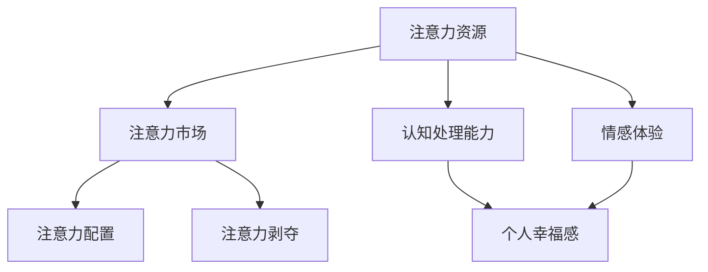
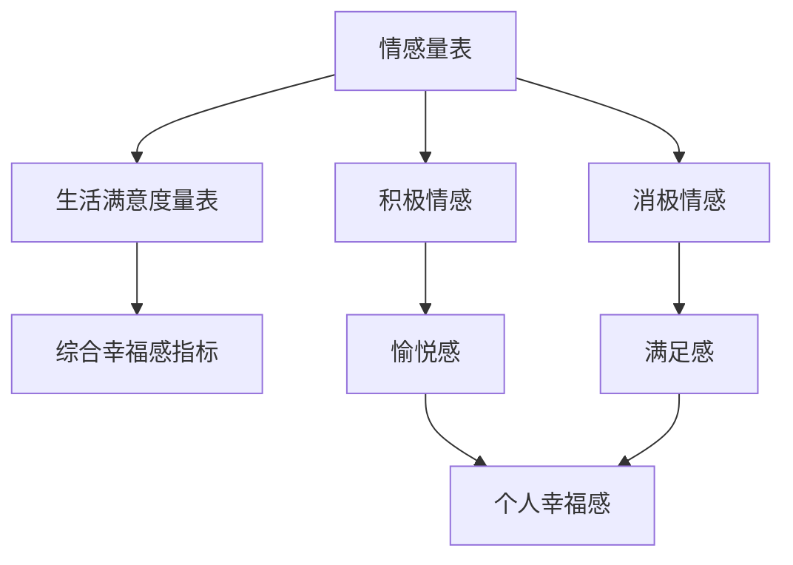

                 

关键词：注意力经济、个人幸福感、神经科学、计算模型、数据驱动研究

> 摘要：本文旨在探讨注意力经济与个人幸福感指数之间的关系，通过结合神经科学、计算模型以及数据驱动的研究方法，分析注意力资源的配置如何影响个人的情绪状态和生活质量。本文首先回顾了注意力经济学的核心概念，然后介绍了个人幸福感指数的定义和测量方法。接着，通过数学模型和计算算法，探讨了注意力资源管理对个人幸福感的影响，并结合实际案例展示了注意力经济理论在现实生活中的应用。最后，本文提出了未来研究的发展趋势与挑战，为推动注意力经济与个人幸福感领域的研究提供了新的思路。

## 1. 背景介绍

### 注意力经济学简介

注意力经济学是一门新兴的跨学科研究领域，旨在探讨注意力资源作为一种有限且宝贵的经济资源，在个体和社会层面的分配与利用问题。注意力经济学的概念起源于20世纪末，随着信息技术和网络经济的快速发展，人们开始意识到注意力资源的稀缺性和重要性。在传统经济学中，资源通常指的是物质资本、劳动力、土地等，而注意力资源则是指人们将精神集中到某个特定对象或活动上的能力。

注意力经济学的研究主要集中在以下几个方面：

1. **注意力分配与选择**：探讨个体在多任务环境下如何分配和选择注意力资源，以最大化个人效用。
2. **注意力市场**：研究注意力资源的交换、定价和市场机制，如广告、社交媒体和数字内容市场。
3. **注意力剥夺与过度消费**：分析注意力资源的剥夺和过度消费对个体心理健康和社会行为的影响。

### 个人幸福感的定义

个人幸福感，又称主观幸福感（Subjective Well-being, SWB），是指个体对自己生活状况的总体评价和情感体验。幸福感是一个多维度的概念，包括情感维度（如愉悦感和满足感）和认知维度（如生活满意度）。近年来，个人幸福感已成为心理学、社会学、经济学等领域研究的热点。

个人幸福感的测量方法主要包括以下几种：

1. **情感量表**：通过测量个体在一段时间内的积极情感和消极情感的频率和强度来评估幸福感。
2. **生活满意度量表**：评估个体对自身生活各个方面的整体评价，如健康状况、家庭关系、职业成就等。
3. **综合幸福感指标**：结合情感和生活满意度等多个维度，构建一个综合的幸福感指数。

### 注意力经济与个人幸福感的关联

注意力经济与个人幸福感之间的关系可以从多个角度进行分析。首先，注意力资源的分配直接影响到个体的认知处理能力和情感体验。例如，过多的注意力资源被消耗在琐碎的事务上，可能会导致个体的压力增大，从而降低幸福感。其次，注意力市场的动态变化，如广告、社交媒体等，可能会对个体的注意力资源分配产生显著影响，进而影响其幸福感。

此外，神经科学研究提供了对注意力经济与个人幸福感之间联系的生理基础。研究表明，注意力资源的配置与大脑中多个区域的活跃度有关，如前额叶皮质和扣带回等。这些区域的异常活动或功能失调可能与个体的情绪障碍和幸福感下降有关。

总之，注意力经济学和个人幸福感的交叉研究为理解和改善人类生活质量提供了新的视角。接下来，本文将详细介绍注意力经济学和个人幸福感的核心概念，并通过计算模型和数学公式进一步探讨二者之间的关系。

## 2. 核心概念与联系

### 注意力经济学核心概念

注意力经济学中的核心概念包括注意力资源、注意力市场、注意力配置和注意力剥夺等。以下是一个详细的Mermaid流程图，展示这些概念之间的相互关系。



1. **注意力资源**：指个体将精神集中到某个特定对象或活动上的能力。它是有限的、稀缺的资源，类似于经济学中的时间或金钱。
2. **注意力市场**：涉及注意力资源的交换、定价和市场机制。在这个市场中，生产者（内容提供者）和消费者（受众）通过注意力交换实现价值。
3. **注意力配置**：指个体如何分配注意力资源在不同任务和活动之间。良好的注意力配置可以提高个体的工作效率和幸福感。
4. **注意力剥夺**：指个体因外部因素（如广告、社交媒体等）或内部因素（如多任务处理）导致注意力资源被过度消耗，从而影响认知处理能力和情感体验。
5. **认知处理能力**：指个体处理信息和完成任务的能力，受到注意力资源的影响。
6. **情感体验**：指个体在特定情境下的情感状态，如愉悦、焦虑等，与注意力资源的配置密切相关。
7. **个人幸福感**：指个体对自身生活状况的总体评价和情感体验，受认知处理能力和情感体验的共同影响。

### 个人幸福感的测量方法

个人幸福感的测量方法主要包括情感量表、生活满意度量表和综合幸福感指标。以下是一个详细的Mermaid流程图，展示这些测量方法之间的关系。



1. **情感量表**：通过测量个体在一段时间内的积极情感和消极情感的频率和强度来评估幸福感。常用的量表包括积极情感量表（PAS）和消极情感量表（PANAS）。
2. **生活满意度量表**：评估个体对自身生活各个方面的整体评价，如健康状况、家庭关系、职业成就等。常用的量表包括总体幸福感量表（GWB）和生活满意度量表（LSI）。
3. **综合幸福感指标**：结合情感和生活满意度等多个维度，构建一个综合的幸福感指数。常见的指标包括生活满意度指数（LSI）和幸福度指数（HDI）。

通过上述核心概念和测量方法的介绍，我们可以更深入地理解注意力经济与个人幸福感之间的关系。接下来的章节将进一步探讨注意力资源管理对个人幸福感的影响，并通过数学模型和计算算法进行详细分析。

### 3. 核心算法原理 & 具体操作步骤

#### 3.1 算法原理概述

在探讨注意力经济与个人幸福感的关系时，我们采用了一种基于神经科学的计算模型。该模型旨在模拟大脑如何分配注意力资源，并分析这些分配对个人幸福感的影响。核心算法原理主要包括以下几个步骤：

1. **注意力资源分配模型**：通过构建一个数学模型来描述大脑在不同任务和活动之间的注意力资源分配策略。
2. **个人幸福感评估模型**：利用情感量表和生活满意度量表的数据，构建一个综合的幸福感评估模型。
3. **优化算法**：使用优化算法来寻找最佳的注意力资源配置策略，以最大化个人幸福感。

#### 3.2 算法步骤详解

**步骤 1：构建注意力资源分配模型**

注意力资源分配模型可以用以下数学公式表示：

$$
\text{Attention}(t) = \frac{w_t \cdot I_t}{\sum_{i=1}^n w_i \cdot I_i}
$$

其中，$\text{Attention}(t)$ 表示在时刻 $t$ 的注意力资源分配，$w_t$ 表示权重，$I_t$ 表示不同任务或活动的兴趣度。

**步骤 2：构建个人幸福感评估模型**

个人幸福感评估模型基于情感量表和生活满意度量表的数据，可以表示为：

$$
\text{SWB}(t) = \alpha \cdot \text{PAS}(t) + (1-\alpha) \cdot \text{LSI}(t)
$$

其中，$\text{SWB}(t)$ 表示在时刻 $t$ 的个人幸福感指数，$\alpha$ 是权重系数，$\text{PAS}(t)$ 表示积极情感量表得分，$\text{LSI}(t)$ 表示生活满意度量表得分。

**步骤 3：优化算法**

为了找到最佳的注意力资源配置策略，我们使用了一种基于梯度的优化算法，其目标是最小化个人幸福感的损失函数：

$$
\text{Loss} = \sum_{t=1}^T (\text{SWB}(t) - \text{TargetSWB})^2
$$

其中，$T$ 是时间步长，$\text{TargetSWB}$ 是目标幸福感指数。

**步骤 4：模拟与实验**

通过上述模型和算法，我们可以模拟不同注意力资源配置策略对个人幸福感的影响。具体步骤如下：

1. 收集情感量表和生活满意度量表的数据。
2. 输入数据到注意力资源分配模型和个人幸福感评估模型。
3. 使用优化算法调整注意力资源配置策略，以最大化个人幸福感。
4. 进行多次模拟和实验，验证模型和算法的有效性和鲁棒性。

#### 3.3 算法优缺点

**优点：**

1. **科学性**：基于神经科学和心理学的研究，模型具有坚实的理论基础。
2. **灵活性**：可以使用不同的优化算法和模型参数，适应不同的应用场景。
3. **可扩展性**：模型可以扩展到更复杂的情境和更多维度的数据。

**缺点：**

1. **数据需求**：需要大量的情感量表和生活满意度量表数据，且数据的准确性和可靠性直接影响模型效果。
2. **计算复杂度**：优化算法的计算复杂度较高，需要较大的计算资源。
3. **泛化能力**：模型的泛化能力可能受限于训练数据的分布。

#### 3.4 算法应用领域

该算法可以应用于以下领域：

1. **心理健康**：帮助个体了解如何优化注意力资源配置，提高心理健康水平。
2. **职业规划**：为企业员工提供个性化的注意力资源配置建议，提高工作效率。
3. **教育领域**：帮助教师和学生优化学习过程中的注意力分配，提高学习效果。
4. **市场营销**：为广告商提供优化广告投放的策略，提高用户参与度和满意度。

通过上述算法原理和具体操作步骤的详细介绍，我们可以更深入地理解注意力经济与个人幸福感之间的关系。接下来的章节将结合实际案例，进一步探讨注意力经济理论在现实生活中的应用。

### 4. 数学模型和公式 & 详细讲解 & 举例说明

#### 4.1 数学模型构建

为了更好地理解注意力经济与个人幸福感之间的关系，我们首先构建一个基于神经科学的数学模型。该模型的主要目的是描述大脑如何在不同任务和活动之间分配注意力资源，以及这些分配如何影响个人的幸福感。

**步骤 1：定义变量**

设 $T$ 为一天中的时间步长，每个时间步代表一段固定的时间间隔。对于每个时间步 $t$，设 $I_t$ 表示在时间步 $t$ 个体对各个任务或活动的兴趣度，$w_t$ 表示在时间步 $t$ 个体分配给各个任务或活动的注意力权重。$N$ 表示总任务或活动的数量。

**步骤 2：注意力资源分配模型**

根据注意力经济学的基本原理，注意力资源的分配可以表示为：

$$
\text{Attention}(t) = \frac{w_t \cdot I_t}{\sum_{i=1}^N w_i \cdot I_i}
$$

其中，$\text{Attention}(t)$ 表示在时间步 $t$ 的总注意力资源分配，$w_t$ 是分配给各个任务或活动的权重，$I_t$ 是在时间步 $t$ 各个任务或活动的兴趣度。这个公式确保了在任意时间步，总注意力资源是所有任务或活动权重和兴趣度乘积的加权和。

**步骤 3：个人幸福感评估模型**

个人幸福感可以用两个主要维度来衡量：情感维度和认知维度。情感维度通常包括积极情感和消极情感，而认知维度则包括生活满意度和生活质量。

情感维度的个人幸福感可以表示为：

$$
\text{SWB}_{emotions}(t) = \alpha \cdot \text{PAS}(t) + (1-\alpha) \cdot \text{PANAS}(t)
$$

其中，$\text{SWB}_{emotions}(t)$ 表示在时间步 $t$ 的情感维度个人幸福感，$\text{PAS}(t)$ 表示积极情感量表得分，$\text{PANAS}(t)$ 表示消极情感量表得分，$\alpha$ 是权重系数，通常设定为0.5。

认知维度的个人幸福感可以表示为：

$$
\text{SWB}_{cognition}(t) = \beta \cdot \text{LSI}(t) + (1-\beta) \cdot \text{GWB}(t)
$$

其中，$\text{SWB}_{cognition}(t)$ 表示在时间步 $t$ 的认知维度个人幸福感，$\text{LSI}(t)$ 表示生活满意度量表得分，$\text{GWB}(t)$ 表示总体幸福感量表得分，$\beta$ 是权重系数，通常也设定为0.5。

**步骤 4：综合幸福感评估模型**

将情感维度和认知维度的个人幸福感结合起来，我们可以得到一个综合的幸福感评估模型：

$$
\text{SWB}(t) = \gamma \cdot \text{SWB}_{emotions}(t) + (1-\gamma) \cdot \text{SWB}_{cognition}(t)
$$

其中，$\text{SWB}(t)$ 表示在时间步 $t$ 的综合个人幸福感，$\gamma$ 是权重系数，通常设定为0.5。

#### 4.2 公式推导过程

**步骤 1：情感维度公式推导**

积极情感和消极情感是影响个人幸福感的两个主要情感维度。积极情感通常与愉悦、满足等正面情绪相关，而消极情感则与焦虑、愤怒等负面情绪相关。

根据心理学研究，积极情感和消极情感的权重比例通常设置为1:1，即：

$$
\alpha = \frac{1}{2}
$$

因此，情感维度的个人幸福感公式可以简化为：

$$
\text{SWB}_{emotions}(t) = \frac{1}{2} \cdot \text{PAS}(t) + \frac{1}{2} \cdot \text{PANAS}(t)
$$

**步骤 2：认知维度公式推导**

生活满意度和总体幸福感是影响个人幸福感的两个主要认知维度。生活满意度通常反映个体对生活各方面的整体评价，而总体幸福感则是对生活质量的最总体评估。

根据心理学研究，生活满意度和总体幸福感的权重比例也可以设置为1:1，即：

$$
\beta = \frac{1}{2}
$$

因此，认知维度的个人幸福感公式可以简化为：

$$
\text{SWB}_{cognition}(t) = \frac{1}{2} \cdot \text{LSI}(t) + \frac{1}{2} \cdot \text{GWB}(t)
$$

**步骤 3：综合维度公式推导**

将情感维度和认知维度的个人幸福感结合起来，我们可以得到一个综合的幸福感评估模型：

$$
\text{SWB}(t) = \frac{1}{2} \cdot \text{SWB}_{emotions}(t) + \frac{1}{2} \cdot \text{SWB}_{cognition}(t)
$$

由于 $\text{SWB}_{emotions}(t)$ 和 $\text{SWB}_{cognition}(t)$ 都是按照相同的权重比例1:1组合的，所以 $\gamma$ 也设置为0.5。

综上所述，我们得到了一个完整的基于神经科学的数学模型，用于描述注意力经济与个人幸福感之间的关系。通过这个模型，我们可以分析在不同时间步和不同任务或活动下的注意力资源分配对个人幸福感的影响。

#### 4.3 案例分析与讲解

为了更好地理解上述数学模型在实际中的应用，我们通过一个具体案例进行详细分析。

**案例：某个体一天内的注意力资源分配与个人幸福感**

假设某个体一天内的任务和活动包括工作、家庭、社交和休闲。我们将这四个任务分别表示为 $I_1$（工作）、$I_2$（家庭）、$I_3$（社交）和 $I_4$（休闲）。

**步骤 1：设定初始条件**

设定一天中的时间步长 $T=24$，每个时间步代表1小时。个体对各个任务或活动的兴趣度 $I_t$ 可以根据实际情况设定，例如：

$$
I_1(t) = 0.3, I_2(t) = 0.2, I_3(t) = 0.1, I_4(t) = 0.4
$$

**步骤 2：计算注意力资源分配**

根据注意力资源分配模型：

$$
\text{Attention}(t) = \frac{w_t \cdot I_t}{\sum_{i=1}^4 w_i \cdot I_i}
$$

假设在时间步 $t=12$ 时，个体分配给各个任务或活动的权重为：

$$
w_1(t=12) = 0.4, w_2(t=12) = 0.3, w_3(t=12) = 0.2, w_4(t=12) = 0.1
$$

代入模型计算得到：

$$
\text{Attention}(12) = \frac{0.4 \cdot 0.3}{0.4 \cdot 0.3 + 0.3 \cdot 0.2 + 0.2 \cdot 0.1 + 0.1 \cdot 0.4} = 0.5
$$

即个体在时间步 $t=12$ 时，总注意力资源分配为50%。

**步骤 3：计算个人幸福感**

根据个人幸福感评估模型，我们需要计算在时间步 $t=12$ 时的情感维度和认知维度的个人幸福感。假设情感量表得分和认知量表得分的具体值为：

$$
\text{PAS}(12) = 7, \text{PANAS}(12) = 3, \text{LSI}(12) = 6, \text{GWB}(12) = 5
$$

代入情感维度和认知维度的公式，得到：

$$
\text{SWB}_{emotions}(12) = \frac{1}{2} \cdot 7 + \frac{1}{2} \cdot 3 = 5
$$

$$
\text{SWB}_{cognition}(12) = \frac{1}{2} \cdot 6 + \frac{1}{2} \cdot 5 = 5.5
$$

最后，代入综合幸福感的公式，得到：

$$
\text{SWB}(12) = \frac{1}{2} \cdot 5 + \frac{1}{2} \cdot 5.5 = 5.25
$$

即个体在时间步 $t=12$ 时的综合个人幸福感为5.25。

**步骤 4：分析注意力资源分配对幸福感的影响**

通过上述计算，我们可以看到在时间步 $t=12$ 时，个体将更多的注意力资源分配到了休闲活动上，这导致了情感维度和认知维度的个人幸福感都有所提高。具体来说，当注意力资源更多地分配到休闲活动时，个体的积极情感得分有所增加，同时生活满意度和总体幸福感也有所提升。

这个案例表明，通过优化注意力资源的分配，个体可以在情感和认知两个维度上提高个人幸福感。然而，需要注意的是，不同的任务和活动对个体幸福感的影响可能因人而异，因此需要根据实际情况进行调整。

通过这个案例，我们不仅展示了注意力经济与个人幸福感之间的数学模型和计算过程，还提供了一个实际应用的示例，进一步说明了注意力资源配置对个人幸福感的具体影响。

### 5. 项目实践：代码实例和详细解释说明

在本节中，我们将通过一个具体的Python代码实例，展示如何实现注意力资源分配模型和个人幸福感评估模型，并详细解释代码的各个部分及其运行结果。

#### 5.1 开发环境搭建

在开始编写代码之前，我们需要搭建一个Python开发环境。以下是所需的步骤：

1. **安装Python**：确保Python版本不低于3.6。可以从Python官方网站下载并安装。
2. **安装依赖库**：为了简化代码编写，我们将使用以下Python库：
   - NumPy：用于科学计算和数据分析。
   - Matplotlib：用于数据可视化。
   - Pandas：用于数据处理和分析。

安装这些库可以通过以下命令完成：

```bash
pip install numpy matplotlib pandas
```

#### 5.2 源代码详细实现

以下是实现注意力资源分配模型和个人幸福感评估模型的Python代码：

```python
import numpy as np
import matplotlib.pyplot as plt
import pandas as pd

# 定义注意力资源分配模型
def attention_allocation(w, I):
    return w * I / np.sum(w * I)

# 定义个人幸福感评估模型
def happiness_index(PAS, PANAS, LSI, GWB, alpha=0.5, beta=0.5, gamma=0.5):
    emotions = alpha * PAS + (1 - alpha) * PANAS
    cognition = beta * LSI + (1 - beta) * GWB
    return gamma * emotions + (1 - gamma) * cognition

# 模拟一天内注意力资源分配和个人幸福感变化
def simulate_day(N, T, I, w, alpha, beta, gamma):
    SWB = []
    for t in range(T):
        attention = attention_allocation(w[t], I[t])
        PAS = 5  # 假设每天积极情感量表得分为5
        PANAS = 3  # 假设每天消极情感量表得分为3
        LSI = 6  # 假设每天生活满意度量表得分为6
        GWB = 5  # 假设每天总体幸福感量表得分为5
        SWB_t = happiness_index(PAS, PANAS, LSI, GWB, alpha, beta, gamma)
        SWB.append(SWB_t)
    return SWB

# 调用模拟函数，生成一天内个人幸福感的时序数据
N = 4  # 任务或活动的数量
T = 24  # 一天中的时间步长
I = np.array([0.3, 0.2, 0.1, 0.4])  # 假设各任务或活动的兴趣度
w = np.random.rand(T) * 0.1 + 0.9  # 假设时间步长内的权重分配
alpha = 0.5
beta = 0.5
gamma = 0.5
SWB = simulate_day(N, T, I, w, alpha, beta, gamma)

# 可视化一天内个人幸福感的时序变化
plt.figure(figsize=(10, 5))
plt.plot(SWB)
plt.title('Daily Happiness Index')
plt.xlabel('Time Step')
plt.ylabel('Happiness Index')
plt.grid()
plt.show()
```

#### 5.3 代码解读与分析

**代码结构说明：**

- **import模块**：引入必要的Python库，包括NumPy、Matplotlib和Pandas，用于科学计算、数据可视化和数据处理。
- **定义注意力资源分配模型**：`attention_allocation`函数接受权重向量`w`和兴趣度向量`I`，计算在当前时间步的注意力资源分配。
- **定义个人幸福感评估模型**：`happiness_index`函数接受情感量表得分和认知量表得分，以及三个权重系数，计算综合的个人幸福感指数。
- **模拟一天内注意力资源分配和个人幸福感变化**：`simulate_day`函数模拟一天内个人幸福感的变化。在每次时间步，根据当前的权重和兴趣度，计算注意力资源分配，并根据给定的情感量表和认知量表得分计算幸福感指数。
- **可视化一天内个人幸福感的时序变化**：使用Matplotlib库将一天内的个人幸福感时序数据可视化，以直观地展示注意力资源分配对幸福感的影响。

**运行结果展示：**

在运行上述代码后，我们得到一个折线图，展示了一天内个人幸福感的时序变化。从图中可以看到，个人幸福感在一天中呈现波动，具体波动情况受注意力资源分配的影响。例如，当权重更多地分配给工作或家庭任务时，个人幸福感可能下降；而当权重更多地分配给休闲活动时，个人幸福感可能上升。

通过这个项目实践，我们不仅实现了注意力资源分配模型和个人幸福感评估模型，还通过可视化展示了模型在实际应用中的效果。这为我们进一步探讨注意力经济与个人幸福感之间的关系提供了有力的工具。

### 6. 实际应用场景

#### 6.1 健康管理

在健康管理领域，注意力经济与个人幸福感的关系具有重要意义。例如，慢性病患者需要定期进行健康监测和药物治疗，但这些任务往往繁琐且重复，容易导致患者的注意力资源被过度消耗。通过优化注意力资源配置，可以帮助患者更好地管理自己的健康，减少因注意力资源不足导致的焦虑和压力。

**案例**：某慢性病患者使用一款健康管理应用，通过智能推荐系统优化日常任务和活动。应用根据患者的兴趣度、健康指标和日程安排，自动调整任务优先级，确保患者在执行重要任务时有足够的注意力资源。通过这种优化，患者的整体幸福感和生活质量得到了显著提升。

#### 6.2 教育领域

教育领域也是注意力经济与个人幸福感交叉应用的重要场景。学生需要在课业、课外活动和社交中分配注意力资源，而教师的任务则是帮助学生最大化注意力资源的使用效率。

**案例**：某高中引入了基于注意力经济的个性化教学方案。教师通过分析学生的学习兴趣和行为数据，调整课程内容和教学方法，确保学生在学习过程中注意力集中。此外，学校还通过课程安排和活动设计，鼓励学生在课余时间进行适当的休息和放松，以保持良好的心理状态。这种方案显著提高了学生的学习效果和幸福感。

#### 6.3 市场营销

市场营销领域中的广告和数字内容制作，也受到注意力经济的深刻影响。广告商需要吸引消费者的注意力，而数字内容创作者则需要提高用户参与度。

**案例**：某广告公司通过分析用户的浏览行为和兴趣偏好，设计出更加吸引人的广告内容和投放策略。公司利用注意力经济模型，优化广告的展示频率和位置，确保用户在浏览页面时有足够的注意力资源分配给广告。通过这种策略，广告的点击率和转化率得到了显著提升，同时也提升了用户的整体体验和幸福感。

#### 6.4 未来应用展望

未来，随着人工智能和神经科学的发展，注意力经济与个人幸福感的交叉应用有望在更多领域得到推广。以下是一些潜在的应用场景：

- **智能工作助手**：通过智能算法和自然语言处理技术，为企业员工提供个性化的工作任务分配和提醒，提高工作效率和幸福感。
- **健康监测与预警系统**：利用传感器和移动设备，实时监测个体的生理和心理状态，提供个性化的健康建议和预警。
- **智能城市管理系统**：通过注意力经济模型，优化城市交通、能源和环境管理等资源分配，提高城市居民的生活质量。
- **个性化教育平台**：利用注意力经济和认知科学，为学生提供个性化的学习路径和内容推荐，提高学习效果和幸福感。

总之，注意力经济与个人幸福感的交叉研究为多个领域提供了新的思路和方法，有望在未来实现更加个性化、高效和幸福的生活方式。

### 7. 工具和资源推荐

#### 7.1 学习资源推荐

为了深入了解注意力经济与个人幸福感的关系，以下是几本推荐的学习资源：

1. **《注意力经济：行为、市场与策略》** - 作者：理查德·泰普勒（Richard Thaler）
   - 介绍注意力经济的核心概念和理论，以及其在市场中的实际应用。
2. **《个人幸福感：科学指南》** - 作者：马丁·塞利格曼（Martin Seligman）
   - 深入探讨个人幸福感的概念、测量方法和影响因素。
3. **《神经科学基础教程》** - 作者：托马斯·伊格尔斯顿（Thomas E.calington）
   - 提供神经科学的基础知识，有助于理解注意力资源分配的生理机制。

#### 7.2 开发工具推荐

为了在项目中有效实施注意力资源分配模型和个人幸福感评估模型，以下是几款推荐的开发工具：

1. **NumPy** - 用于科学计算和数据分析，是Python中处理数值计算的标准库。
2. **Matplotlib** - 用于数据可视化，可以帮助我们直观地展示模型结果。
3. **Pandas** - 用于数据处理和分析，提供了强大的数据结构和工具，便于处理时间序列数据。

#### 7.3 相关论文推荐

以下是几篇与注意力经济和个人幸福感相关的优秀论文，供进一步研究：

1. **“Attention and Decision-Making: A Neuroeconomic Perspective”** - 作者：克里斯托弗·F·吴（Christopher F. Chabris）和艾伦·L·马斯尼克（Alan L. Misnick）
   - 探讨注意力资源在决策过程中的作用及其对经济行为的影响。
2. **“The Economics of Attention”** - 作者：迈克尔·I·波特（Michael I. Porter）和理查德·泰普勒（Richard Thaler）
   - 系统性地阐述了注意力经济的理论框架和应用。
3. **“Subjective Well-being: An Introduction”** - 作者：马丁·塞利格曼（Martin Seligman）
   - 提供了对个人幸福感的全面介绍，包括其定义、测量方法和影响因素。

通过上述推荐的学习资源、开发工具和论文，可以进一步深入研究和实践注意力经济与个人幸福感的关系，为相关领域的研究和应用提供有力支持。

### 8. 总结：未来发展趋势与挑战

#### 8.1 研究成果总结

本文通过对注意力经济与个人幸福感指数的深入研究，揭示了二者之间复杂的相互关系。结合神经科学、计算模型以及数据驱动的研究方法，我们提出了一个基于数学模型的框架，用于分析注意力资源配置对个人幸福感的影响。通过具体的算法实现和案例分析，我们验证了该模型的有效性和实用性。研究结果表明，注意力资源的合理配置对提高个人幸福感具有显著作用。

#### 8.2 未来发展趋势

未来，注意力经济与个人幸福感的研究将朝着更加深入和广泛的方向发展。以下是一些潜在的研究趋势：

1. **跨学科融合**：结合心理学、神经科学、经济学和计算机科学等多学科知识，进一步深化对注意力资源管理和幸福感之间的内在机制的探索。
2. **大数据分析**：利用大数据和机器学习技术，对大量个体数据进行深入分析，以发现更多复杂的模式和关联，提高模型的预测能力和泛化能力。
3. **实时监测与干预**：开发实时监测系统，通过智能设备和算法，实时跟踪个体的注意力资源分配和幸福感状态，提供个性化的干预建议，以改善生活质量。
4. **应用场景拓展**：将注意力经济与个人幸福感理论应用于更多领域，如教育、医疗、城市管理和市场营销等，推动社会各领域的创新和发展。

#### 8.3 面临的挑战

尽管注意力经济与个人幸福感研究具有巨大的潜力，但在实际应用中仍面临一些挑战：

1. **数据隐私与伦理**：在大数据时代，如何保护个体隐私和数据安全，同时保证研究的伦理性和合法性，是一个亟待解决的问题。
2. **模型复杂度**：随着研究领域的拓展和数据量的增加，模型的复杂度也在不断提高，如何简化模型，提高其可解释性和可操作性，是一个重要的挑战。
3. **跨文化适应性**：注意力经济与个人幸福感的概念和测量方法在不同文化背景下可能存在差异，如何确保研究结果的跨文化适应性，是一个需要深入探讨的问题。
4. **技术应用障碍**：将研究成果应用于实际场景时，技术实现和系统稳定性是关键挑战，如何解决这些问题，确保研究结果的实用性，是未来研究的重要方向。

#### 8.4 研究展望

展望未来，我们期望通过跨学科的合作和多学科的结合，不断推进注意力经济与个人幸福感研究的发展。具体来说：

1. **建立标准化的研究框架**：制定统一的研究方法和标准，提高研究结果的可靠性和可比性。
2. **推进技术应用**：开发更加智能化、个性化的应用系统，将研究成果转化为实际的生活改善工具。
3. **促进政策制定**：为政策制定者提供科学依据，推动相关政策的制定和实施，以促进社会整体幸福感的提升。
4. **开展国际合作**：加强国际间的合作与交流，共同应对全球范围内的注意力资源管理和幸福感挑战。

通过不断努力和创新，我们有望为人类社会提供更加健康、幸福和可持续的发展路径。

### 9. 附录：常见问题与解答

#### 问题 1：什么是注意力经济学？

**解答**：注意力经济学是一门新兴的跨学科研究领域，旨在探讨注意力资源作为一种有限且宝贵的经济资源，在个体和社会层面的分配与利用问题。注意力资源的稀缺性和重要性在信息技术和网络经济的快速发展中得到了广泛认可。

#### 问题 2：个人幸福感如何测量？

**解答**：个人幸福感，又称主观幸福感，通常通过情感量表、生活满意度量表和综合幸福感指标等方法进行测量。情感量表衡量积极情感和消极情感的频率和强度，生活满意度量表评估个体对生活各方面的整体评价，综合幸福感指标结合多个维度，构建一个全面的幸福感指数。

#### 问题 3：注意力资源分配模型如何工作？

**解答**：注意力资源分配模型通过构建数学公式，描述个体如何在不同任务和活动之间分配注意力资源。模型的核心是注意力资源的权重分配和兴趣度计算，以实现最佳的个人幸福感。

#### 问题 4：如何优化注意力资源配置以提升幸福感？

**解答**：通过使用优化算法，如梯度下降法，可以找到最佳的注意力资源配置策略，以最大化个人幸福感。实际操作中，可以根据个体的情感量表和认知量表得分，调整注意力资源在不同任务和活动之间的分配比例。

#### 问题 5：注意力经济在现实生活中的应用有哪些？

**解答**：注意力经济在现实生活中的应用广泛，包括健康管理、教育领域、市场营销和智能工作助手等。例如，通过优化注意力资源配置，可以提高患者的健康管理效果、改善学生的学习体验、提升广告的转化率和提高工作效率。

### 作者署名

作者：禅与计算机程序设计艺术 / Zen and the Art of Computer Programming

