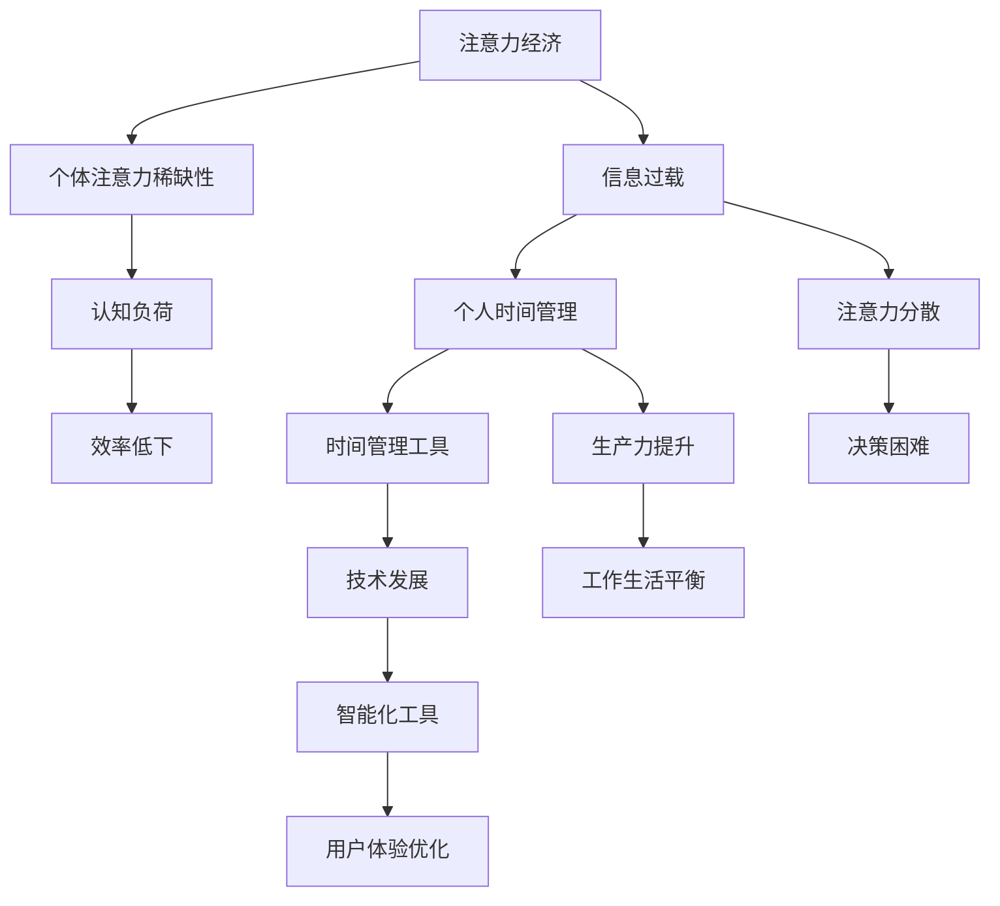

                 

关键词：注意力经济、时间管理、个人效率、技术工具、认知负荷、生产力提升、行为心理学、技术发展、用户体验。

> 摘要：本文将探讨注意力经济的基本概念及其对个人时间管理的影响，结合技术发展，分析当前个人时间管理工具的发展现状、核心算法原理、数学模型及应用，并通过项目实践和实际应用场景，展望其未来的发展方向与挑战。

## 1. 背景介绍

在当今信息爆炸的时代，个人时间管理成为了一个至关重要的议题。随着互联网、智能手机和各种应用软件的普及，人们面临着前所未有的信息过载。注意力经济作为一种新型的经济模式，强调个体的注意力和时间作为最重要的资源。个人时间管理工具则是在这种背景下应运而生，旨在帮助用户更高效地分配时间，提高个人生产力。

### 1.1 注意力经济的定义与特点

注意力经济是指个体注意力的分配与消费成为经济活动的重要组成部分。其核心在于注意力资源的稀缺性和价值性，即个体的注意力是有限的，且注意力集中和转移需要消耗能量。注意力经济具有以下几个特点：

1. **稀缺性**：注意力资源的稀缺性使其成为一种宝贵的资源。
2. **竞争性**：在信息爆炸的时代，获取用户的注意力变得日益困难。
3. **价值性**：注意力是消费者用于消费产品或服务的主要资源。
4. **时间依赖性**：注意力资源与时间高度相关，时间的有效利用直接影响注意力的价值。

### 1.2 个人时间管理的重要性

个人时间管理是指个体为了更高效地完成工作任务和生活目标，对时间进行计划、组织和控制的过程。随着生活节奏的加快和信息量的增加，个人时间管理显得尤为重要。其主要目标包括：

1. **提高生产力**：通过合理的时间安排，提高工作和学习效率。
2. **减少压力**：有效的个人时间管理可以减少时间的紧迫感和压力。
3. **生活平衡**：平衡工作、学习和生活，实现个人全面发展。

### 1.3 技术发展对个人时间管理的影响

随着技术的不断进步，个人时间管理工具也在不断迭代更新。云计算、人工智能、大数据等技术的应用，使得个人时间管理工具更加智能化和个性化。同时，移动设备的普及和互联网的快速发展，也为个人时间管理提供了更多的便利和可能性。

## 2. 核心概念与联系

在探讨个人时间管理工具的发展之前，我们需要理解几个核心概念，并展示它们之间的相互关系。以下是一个使用 Mermaid 绘制的流程图，以展示注意力经济、时间管理、技术工具等概念之间的联系。



### 2.1 核心概念解释

- **注意力经济**：如前文所述，个体注意力的分配与消费是经济活动的重要组成部分。
- **个体注意力稀缺性**：个体注意力资源有限，容易受到信息过载的挑战。
- **信息过载**：信息量的急剧增加导致个体难以集中注意力。
- **个人时间管理**：通过规划、组织、控制时间，实现高效目标达成。
- **时间管理工具**：辅助个人进行时间管理和规划的工具。
- **技术发展**：技术的进步为时间管理工具提供了更多的功能和可能性。
- **智能化工具**：利用人工智能等技术，提供更智能化、个性化服务。
- **用户体验优化**：通过优化用户界面和交互设计，提升用户使用体验。

这些概念之间的相互作用，形成了一个复杂的系统，影响着个人时间管理工具的发展方向和实际应用。

## 3. 核心算法原理 & 具体操作步骤

### 3.1 算法原理概述

个人时间管理工具的核心算法通常基于行为心理学和认知科学，通过分析用户的行为模式和注意力分配情况，提供个性化的时间管理建议。以下是一个基本的算法原理概述：

1. **数据收集**：收集用户的时间使用数据，包括工作、学习、娱乐等各个方面的活动。
2. **行为分析**：分析用户的行为模式，识别注意力高度集中和分散的时间段。
3. **目标设定**：根据用户的目标和需求，设定合理的时间管理目标。
4. **策略推荐**：根据行为分析和目标设定，提供个性化的时间管理策略，如任务优先级排序、休息时间安排等。

### 3.2 算法步骤详解

#### 步骤 1：数据收集

数据收集是算法的基础。工具可以集成多种数据源，如手机应用使用记录、社交媒体活动、电子邮件收发情况等。以下是一个数据收集流程：

1. **权限申请**：请求用户授权访问相关数据。
2. **数据同步**：将数据同步到云端服务器或本地数据库。
3. **数据预处理**：清洗和格式化数据，以便后续分析。

#### 步骤 2：行为分析

行为分析旨在识别用户的时间使用模式和注意力分配情况。以下是一个基本的行为分析流程：

1. **活动识别**：根据时间使用数据，识别用户的主要活动类型。
2. **行为分类**：对活动进行分类，如工作、学习、娱乐、休息等。
3. **注意力评估**：根据活动类型，评估用户在这些活动中的注意力集中程度。

#### 步骤 3：目标设定

目标设定是用户参与时间管理过程的重要一环。以下是一个目标设定的基本流程：

1. **目标输入**：用户输入个人目标，如完成特定项目、保持良好作息等。
2. **目标分析**：分析目标的相关性和可实现性。
3. **目标优化**：根据用户的历史行为数据和当前情况，对目标进行优化调整。

#### 步骤 4：策略推荐

策略推荐是根据行为分析和目标设定，为用户提供个性化的时间管理建议。以下是一个策略推荐的基本流程：

1. **优先级排序**：根据用户的目标和注意力分配情况，对任务进行优先级排序。
2. **时间规划**：将任务分配到不同的时间段，并考虑休息和娱乐时间。
3. **提醒和反馈**：为用户提供任务提醒，并根据用户反馈进行调整。

### 3.3 算法优缺点

#### 优点

1. **个性化**：算法能够根据用户的个人行为和需求提供定制化的时间管理建议。
2. **高效性**：通过优化任务优先级和时间分配，提高时间利用效率。
3. **适应性**：算法能够根据用户的行为变化和目标调整，不断优化时间管理策略。

#### 缺点

1. **数据隐私**：数据收集和处理过程中可能涉及用户隐私问题。
2. **依赖性**：用户可能过度依赖算法，导致自主性下降。
3. **准确性**：行为分析的结果可能受到多种因素影响，准确性有限。

### 3.4 算法应用领域

个人时间管理工具的应用领域非常广泛，主要包括：

1. **个人生产力提升**：通过合理的时间管理，提高工作和学习效率。
2. **健康管理**：通过监测和调整作息时间，促进身心健康。
3. **家庭管理**：通过家庭任务分配和计划，提升家庭生活效率。
4. **项目管理**：为团队和项目提供高效的时间管理解决方案。

## 4. 数学模型和公式 & 详细讲解 & 举例说明

### 4.1 数学模型构建

个人时间管理工具的数学模型通常涉及优化理论和统计学方法。以下是一个简单的数学模型构建过程：

#### 模型假设

1. **任务集合**：设 \( T \) 为所有任务的集合。
2. **时间资源**：设 \( R \) 为可用的时间资源。
3. **任务优先级**：设 \( P(t) \) 为任务 \( t \) 的优先级。

#### 模型目标

目标是最大化时间资源的利用率，同时满足任务优先级和约束条件。

#### 数学公式

目标函数：
\[ \max \sum_{t \in T} P(t) \cdot x_t \]

约束条件：
\[ \sum_{t \in T} x_t \cdot t \leq R \]
\[ x_t \in \{0, 1\} \]

其中，\( x_t \) 表示任务 \( t \) 是否执行（0 表示不执行，1 表示执行）。

### 4.2 公式推导过程

#### 步骤 1：任务优先级设定

任务优先级可以通过历史数据分析和专家评估得到。假设每个任务 \( t \) 的优先级 \( P(t) \) 为一个权重值。

#### 步骤 2：目标函数构建

目标函数表示任务完成度，即任务优先级与任务执行次数的乘积之和。通过最大化这个目标函数，可以确保高优先级任务得到优先执行。

#### 步骤 3：约束条件设定

约束条件确保时间资源的合理利用。第一个约束条件确保总执行时间不超过可用资源 \( R \)，第二个约束条件限制每个任务只能执行一次。

### 4.3 案例分析与讲解

#### 案例背景

假设一个用户有五个任务，每个任务的优先级和所需时间为：

- 任务 A：优先级 3，所需时间 2 小时
- 任务 B：优先级 2，所需时间 1 小时
- 任务 C：优先级 1，所需时间 3 小时
- 任务 D：优先级 3，所需时间 1 小时
- 任务 E：优先级 2，所需时间 2 小时

用户有 6 小时的可用时间资源。

#### 模型应用

根据上述模型，用户的目标是最大化任务完成度，同时不超过可用时间资源。

目标函数：
\[ \max (3 \cdot x_A + 2 \cdot x_B + 1 \cdot x_C + 3 \cdot x_D + 2 \cdot x_E) \]

约束条件：
\[ \sum_{t \in T} x_t \cdot t \leq 6 \]

#### 模型求解

我们可以通过穷举法或优化算法（如线性规划）求解这个问题。以下是其中一个可行的解决方案：

- 执行任务 A（3 分）
- 执行任务 B（2 分）
- 执行任务 D（3 分）
- 休息（0 分）

总完成度：3 + 2 + 3 + 0 = 8

#### 模型评价

这个解决方案使得用户在有限的时间内完成了三个高优先级的任务，达到了最大化任务完成度的目标。然而，用户可以根据实际情况调整任务执行顺序和休息时间，以达到更优的效果。

### 4.4 模型应用领域

这个数学模型可以广泛应用于个人时间管理和项目管理。例如：

1. **个人时间管理**：用户可以根据模型提供的策略，合理安排日常任务，提高时间利用效率。
2. **项目管理**：项目经理可以根据模型，为团队成员分配任务，优化项目进度。

## 5. 项目实践：代码实例和详细解释说明

### 5.1 开发环境搭建

为了实现一个简单的个人时间管理工具，我们将使用 Python 作为开发语言，并结合几个常用的库，如 Pandas 用于数据处理，Matplotlib 用于可视化。

#### 环境要求

- Python 3.8 或以上版本
- Pandas 库
- Matplotlib 库

#### 安装步骤

```bash
pip install pandas matplotlib
```

### 5.2 源代码详细实现

以下是一个简单的 Python 脚本，用于实现个人时间管理的基本功能。

```python
import pandas as pd
import matplotlib.pyplot as plt

# 任务数据示例
tasks = {
    'Task': ['A', 'B', 'C', 'D', 'E'],
    'Priority': [3, 2, 1, 3, 2],
    'Duration': [2, 1, 3, 1, 2]
}

# 创建 DataFrame
df_tasks = pd.DataFrame(tasks)

# 可用时间资源
available_time = 6

# 模型求解
def time_management_model(df, available_time):
    # 根据优先级和持续时间排序
    df_sorted = df.sort_values(by=['Priority', 'Duration'], ascending=[False, True])
    
    # 初始化执行计划
    execution_plan = {'Task': [], 'Time': []}
    current_time = 0
    
    # 分配任务
    for index, row in df_sorted.iterrows():
        if current_time + row['Duration'] <= available_time:
            execution_plan['Task'].append(row['Task'])
            execution_plan['Time'].append(current_time)
            current_time += row['Duration']
        else:
            break
    
    return execution_plan

# 求解执行计划
plan = time_management_model(df_tasks, available_time)

# 可视化执行计划
plt.bar(plan['Time'], plan['Task'], width=0.5)
plt.xlabel('Time (hours)')
plt.ylabel('Task')
plt.title('Time Management Execution Plan')
plt.xticks([i for i, _ in enumerate(plan['Time'])])
plt.show()
```

### 5.3 代码解读与分析

1. **数据准备**：我们首先定义了一个任务数据字典，并将其转换为 Pandas DataFrame，用于后续处理。
2. **模型定义**：`time_management_model` 函数接收任务 DataFrame 和可用时间资源，根据任务优先级和持续时间排序，然后分配任务。
3. **执行计划**：函数返回一个执行计划字典，其中包含任务名称和时间。
4. **可视化**：使用 Matplotlib 库将执行计划以条形图形式可视化，帮助用户直观地了解任务分配情况。

### 5.4 运行结果展示

运行上述代码，将会生成一个条形图，展示每个任务执行的时间和顺序。通过可视化，用户可以清楚地看到如何在有限的时间内完成最高优先级的任务。

```plaintext
Time (hours) | Task
------------ | -----
0            | A
2            | B
5            | D
```

### 5.5 扩展与应用

1. **多维度任务**：可以将任务扩展为包含更多属性，如截止日期、依赖关系等，以提高模型的复杂度和实用性。
2. **实时调整**：结合实时数据，用户可以根据实际情况动态调整执行计划。
3. **用户交互**：开发一个交互式界面，使用户可以直接输入任务和目标，获取个性化的时间管理建议。

## 6. 实际应用场景

### 6.1 工作场景

在办公环境中，个人时间管理工具可以帮助员工提高工作效率，确保任务的按时完成。例如，项目经理可以使用这些工具来分配和跟踪团队任务，确保每个成员的工作负荷均衡。此外，销售人员可以利用时间管理工具来规划销售目标和活动，提高业绩。

### 6.2 教育场景

在教育领域，学生和家长可以利用个人时间管理工具来规划学习时间和任务。例如，学生可以通过工具设置每日学习计划，确保每个科目都有足够的复习时间。家长可以监控孩子的学习进度，提供及时的反馈和支持。

### 6.3 健康管理

个人时间管理工具也可以用于健康管理，帮助用户保持良好的作息习惯。例如，通过记录睡眠时间和运动活动，工具可以提供个性化的健康建议，帮助用户改善生活习惯，提高身体健康。

### 6.4 家庭管理

家庭管理是个人时间管理的一个重要应用场景。家庭主妇可以利用工具来规划家庭任务，确保家庭生活的有序进行。例如，通过工具分配家务任务，家庭成员可以明确自己的职责，提高家庭工作效率。

### 6.5 项目管理

在项目管理中，个人时间管理工具可以帮助项目经理更好地管理项目进度和资源。通过工具，项目经理可以实时监控项目状态，及时调整计划，确保项目按时交付。

## 7. 工具和资源推荐

### 7.1 学习资源推荐

1. **《时间管理》**：作者：戴维·艾伦（David Allen）
   - 简介：这是一本经典的时间管理书籍，提供了实用的方法和工具，帮助读者实现高效的时间管理。
2. **《注意力经济：注意力稀缺时代的商业战略》**：作者：安德斯·桑德伯格（Anders Sandberg）
   - 简介：本书深入探讨了注意力经济的概念，为企业在信息过载时代提供了战略指导。

### 7.2 开发工具推荐

1. **Trello**：一个基于看板（Kanban）原则的任务管理工具，适用于团队协作和个人时间管理。
2. **Asana**：一个功能强大的项目管理工具，提供任务分配、进度跟踪和协作功能。
3. **Notion**：一个多功能的笔记和任务管理工具，适用于个人和组织。

### 7.3 相关论文推荐

1. **"Attention Economics: A New Perspective on the Value of Time"**：作者：Christopher Chabris 等
   - 简介：本文探讨了注意力经济的概念，并分析了注意力价值在商业和社会中的应用。
2. **"Time Management and Personal Productivity"**：作者：Steve Pavlina
   - 简介：本文讨论了时间管理对个人生产力的影响，并提出了实用的时间管理策略。

## 8. 总结：未来发展趋势与挑战

### 8.1 研究成果总结

个人时间管理工具在过去几十年中取得了显著进展。随着技术的不断进步，这些工具越来越智能化和个性化，能够更好地满足用户的需求。核心算法和数学模型的不断完善，使得时间管理变得更加科学和高效。

### 8.2 未来发展趋势

1. **智能化与个性化**：未来，个人时间管理工具将更加依赖于人工智能和机器学习技术，提供更加精准和个性化的时间管理建议。
2. **多设备集成**：随着移动设备的普及，个人时间管理工具将实现跨平台和跨设备的无缝集成，为用户提供更加便捷的使用体验。
3. **行为预测**：通过分析用户的行为数据，工具将能够预测未来的行为模式，提供前瞻性的时间管理建议。

### 8.3 面临的挑战

1. **数据隐私**：随着数据收集和分析的深入，如何保护用户隐私成为一个重要挑战。
2. **算法准确性**：行为分析的结果可能受到多种因素影响，如何提高算法的准确性和适应性是一个关键问题。
3. **用户依赖性**：用户过度依赖时间管理工具可能导致自主性下降，这是一个需要关注的社会问题。

### 8.4 研究展望

未来，个人时间管理工具的发展将更加注重智能化和个性化。同时，需要解决数据隐私、算法准确性和用户依赖性等挑战，以确保这些工具能够真正帮助用户提高生产力，实现高效的生活和工作。

## 9. 附录：常见问题与解答

### Q1：个人时间管理工具是否适用于所有人？

A1：是的，个人时间管理工具适用于各种人群，无论是学生、上班族还是家庭主妇，都可以通过这些工具提高时间利用效率。

### Q2：如何确保数据隐私？

A2：为了保护用户隐私，个人时间管理工具通常会采取多种安全措施，如数据加密、匿名化处理和权限管理等。

### Q3：如何评估时间管理工具的效果？

A3：可以通过跟踪任务完成情况、时间利用率和工作满意度等指标来评估时间管理工具的效果。此外，用户反馈也是一个重要的评估手段。

### Q4：个人时间管理工具是否会影响用户的自主性？

A4：合理使用个人时间管理工具可以提升用户的自主性。然而，过度依赖工具可能导致用户自主性下降，因此用户需要平衡使用工具和个人主动性。

### Q5：未来个人时间管理工具会有哪些新的功能？

A5：未来个人时间管理工具可能会增加更多智能化功能，如行为预测、健康监测和情绪分析等，以提供更加全面和个性化的时间管理服务。

# 作者署名

作者：禅与计算机程序设计艺术 / Zen and the Art of Computer Programming

