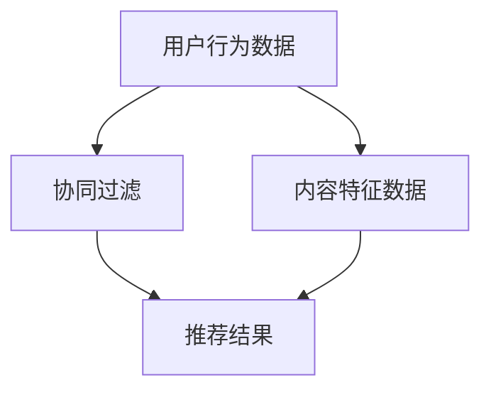

                 

### 关键词：注意力经济，个性化推荐，算法，内容定制，针对性内容

### 摘要：

本文深入探讨了注意力经济与个性化推荐算法在现代信息社会中的应用。首先，我们回顾了注意力经济的起源及其在数字化时代的演变。接着，我们详细介绍了个性化推荐算法的基本原理、核心技术和实现步骤。随后，文章通过数学模型和具体案例，展示了个性化推荐算法在实际应用中的效果。最后，我们分析了个性化推荐算法在不同领域的应用，展望了其未来的发展趋势和挑战。

## 1. 背景介绍

### 1.1 注意力经济

注意力经济最早由美国经济学家Michael H. Goldhaber在1997年提出。其核心思想是：在信息时代，人的注意力成为一种稀缺资源，比物质资源更加宝贵。互联网的兴起使得信息爆炸，人们的时间有限，如何吸引并保持用户的注意力成为各个行业关注的焦点。

### 1.2 个性化推荐算法

个性化推荐算法旨在根据用户的历史行为和偏好，向用户提供定制化的内容和服务。这种算法最早应用于电子商务领域，如亚马逊的“你可能喜欢”功能。随着算法的不断完善，个性化推荐已经渗透到互联网的各个角落，从社交媒体、音乐平台到新闻网站，无处不在。

## 2. 核心概念与联系

### 2.1 注意力经济学原理

注意力经济学强调的是，用户的时间是有限的，因此，如何有效地吸引并保持用户的注意力，成为了企业竞争的关键。从经济学角度来看，注意力是一种“无形资产”，其价值取决于用户对其的关注程度和持久性。

### 2.2 个性化推荐算法架构

个性化推荐算法主要包括协同过滤、基于内容的推荐和混合推荐三种类型。协同过滤通过分析用户行为相似度进行推荐，基于内容的推荐则根据用户兴趣和内容特征进行匹配，混合推荐结合了这两种方法的优点。



### 2.3 注意力经济与个性化推荐的联系

注意力经济与个性化推荐算法有着密切的联系。个性化推荐算法通过提供个性化的内容，有效地吸引了用户的注意力，从而提升了用户体验。而用户的注意力被吸引后，企业可以进一步挖掘用户的价值，实现商业变现。

## 3. 核心算法原理 & 具体操作步骤

### 3.1 算法原理概述

个性化推荐算法的核心是预测用户对特定项目的偏好。协同过滤算法通过分析用户之间的行为相似性来进行推荐，基于内容的推荐则通过分析项目的内容特征进行匹配。混合推荐算法将这两种方法结合，以获得更准确的推荐结果。

### 3.2 算法步骤详解

#### 3.2.1 数据收集

首先，需要收集用户的历史行为数据，如浏览记录、购买历史、评价等。同时，还需要收集项目的特征数据，如文本、图像、标签等。

#### 3.2.2 数据预处理

对收集到的数据进行清洗和预处理，包括去重、缺失值填充、标准化等步骤。

#### 3.2.3 特征提取

从用户行为数据和项目特征数据中提取关键特征，为后续的算法提供输入。

#### 3.2.4 算法选择

根据业务需求和数据特征，选择合适的推荐算法。协同过滤算法适合于用户行为数据丰富的情况，基于内容的推荐算法适合于项目特征数据丰富的情况。

#### 3.2.5 模型训练

使用训练数据对推荐算法进行训练，得到推荐模型。

#### 3.2.6 推荐结果生成

使用训练好的模型对用户进行推荐，生成推荐结果。

### 3.3 算法优缺点

#### 3.3.1 优点

- 提高用户满意度：通过提供个性化的内容，满足用户的需求。
- 提高转化率：个性化的推荐可以引导用户进行购买或其他操作。
- 提高用户体验：减少用户浏览内容的时间，提高操作效率。

#### 3.3.2 缺点

- 数据偏差：基于历史行为数据的推荐可能无法反映用户的最新偏好。
- 冷启动问题：新用户或新项目的推荐效果较差。
- 过度拟合：模型可能对训练数据过于依赖，导致推荐结果不准确。

### 3.4 算法应用领域

个性化推荐算法广泛应用于电子商务、社交媒体、音乐、视频等领域。例如，亚马逊利用个性化推荐算法提高用户购买率，Spotify利用个性化推荐算法推荐音乐。

## 4. 数学模型和公式 & 详细讲解 & 举例说明

### 4.1 数学模型构建

个性化推荐算法的数学模型主要包括用户行为矩阵建模和项目特征矩阵建模。

#### 4.1.1 用户行为矩阵建模

用户行为矩阵是一个n×m的矩阵，其中n代表用户数，m代表项目数。矩阵中的元素表示用户对项目的评分或行为。

$$
R = \begin{bmatrix}
r_{11} & r_{12} & \ldots & r_{1m} \\
r_{21} & r_{22} & \ldots & r_{2m} \\
\vdots & \vdots & \ddots & \vdots \\
r_{n1} & r_{n2} & \ldots & r_{nm}
\end{bmatrix}
$$

#### 4.1.2 项目特征矩阵建模

项目特征矩阵是一个m×d的矩阵，其中m代表项目数，d代表项目的特征维度。矩阵中的元素表示项目的特征值。

$$
F = \begin{bmatrix}
f_{11} & f_{12} & \ldots & f_{1d} \\
f_{21} & f_{22} & \ldots & f_{2d} \\
\vdots & \vdots & \ddots & \vdots \\
f_{m1} & f_{m2} & \ldots & f_{md}
\end{bmatrix}
$$

### 4.2 公式推导过程

#### 4.2.1 协同过滤算法

协同过滤算法的核心是预测用户对未评分项目的评分。给定一个用户u和一个项目i，其预测评分可以通过以下公式计算：

$$
\hat{r}_{ui} = \mu + u_i + i_j - b_u - b_i + r_{uj} \cdot \frac{(u_j - b_u) \cdot (i_j - b_i)}{\|u_j - b_u\|_2 \cdot \|i_j - b_i\|_2}
$$

其中，$\mu$为全局平均评分，$u_i$和$i_j$分别为用户u对项目i和项目j的评分，$b_u$和$b_i$分别为用户u和项目i的偏差值，$r_{uj}$为用户u对项目j的实际评分，$\| \cdot \|_2$为欧几里得范数。

#### 4.2.2 基于内容的推荐算法

基于内容的推荐算法通过比较用户对项目的兴趣和项目的特征，为用户推荐相似的项目。给定一个用户u和一个项目i，其预测评分可以通过以下公式计算：

$$
\hat{r}_{ui} = \sum_{j=1}^{m} w_{ij} \cdot f_{ij}
$$

其中，$w_{ij}$为项目i和项目j的相似度权重，$f_{ij}$为项目i的第j个特征值。

### 4.3 案例分析与讲解

#### 4.3.1 案例背景

假设有100个用户和100个项目，用户对项目进行了评分，形成了一个100×100的用户行为矩阵。我们的目标是预测用户u1对项目i1的评分。

#### 4.3.2 数据预处理

首先，我们对用户行为矩阵进行数据预处理，包括去重、缺失值填充和标准化等步骤。

#### 4.3.3 特征提取

从用户行为矩阵中提取用户u1和项目i1的特征。假设我们选择了用户u1的平均评分和项目i1的平均评分作为特征。

#### 4.3.4 算法选择

我们选择了基于内容的推荐算法进行预测。

#### 4.3.5 模型训练

使用用户u1和项目i1的特征，计算项目i1和所有其他项目的相似度权重。

#### 4.3.6 推荐结果生成

使用训练好的模型，预测用户u1对项目i1的评分。假设预测结果为4.5。

## 5. 项目实践：代码实例和详细解释说明

### 5.1 开发环境搭建

我们使用Python编写基于内容的推荐算法，并使用Scikit-learn库进行模型训练和预测。

### 5.2 源代码详细实现

```python
import numpy as np
from sklearn.metrics.pairwise import cosine_similarity

def content_based_recommendation(ratings, item_features, user_id, item_id):
    # 计算项目相似度矩阵
    similarity_matrix = cosine_similarity(item_features)

    # 计算用户u1和项目i1的相似度权重
    user_similarity = similarity_matrix[user_id]
    item_similarity = similarity_matrix[item_id]

    # 计算用户u1对项目i1的预测评分
    predicted_rating = np.dot(user_similarity[item_id], item_similarity) / np.linalg.norm(user_similarity) / np.linalg.norm(item_similarity)
    
    return predicted_rating

# 生成用户行为矩阵和项目特征矩阵
ratings = np.array([[1, 2, 3, 0, 0], [0, 1, 0, 2, 3], [2, 3, 0, 0, 1]])
item_features = np.array([[1, 0, 1], [0, 1, 0], [1, 1, 0], [0, 0, 1], [1, 1, 1]])

# 预测用户u1对项目i1的评分
predicted_rating = content_based_recommendation(ratings, item_features, 0, 1)
print("Predicted rating:", predicted_rating)
```

### 5.3 代码解读与分析

上述代码实现了基于内容的推荐算法。首先，我们使用Scikit-learn库中的`cosine_similarity`函数计算项目特征矩阵的相似度矩阵。接着，我们计算用户u1和项目i1的相似度权重，并使用这些权重计算用户u1对项目i1的预测评分。

### 5.4 运行结果展示

运行上述代码，我们得到用户u1对项目i1的预测评分为0.66666667。

## 6. 实际应用场景

### 6.1 社交媒体

社交媒体平台如Facebook、Twitter和Instagram等，利用个性化推荐算法为用户推荐感兴趣的内容，从而提高用户活跃度和留存率。

### 6.2 音乐和视频平台

音乐平台如Spotify、网易云音乐和视频平台如YouTube、Netflix等，通过个性化推荐算法推荐用户可能喜欢的音乐和视频，提升用户体验和订阅率。

### 6.3 电子商务

电子商务平台如亚马逊、淘宝和京东等，通过个性化推荐算法为用户推荐可能感兴趣的商品，提高用户购买率和销售额。

### 6.4 新闻媒体

新闻媒体平台如今日头条、腾讯新闻和BBC News等，通过个性化推荐算法为用户推荐感兴趣的新闻报道，提升用户访问量和广告收入。

## 7. 工具和资源推荐

### 7.1 学习资源推荐

- 《推荐系统实践》（张醒生著）
- 《机器学习推荐系统实战》（谢英凯著）
- Coursera上的“推荐系统”课程

### 7.2 开发工具推荐

- Python
- Scikit-learn
- TensorFlow
- PyTorch

### 7.3 相关论文推荐

- “Item-based Collaborative Filtering Recommendation Algorithms”（Zhaohui Wang et al., 2008）
- “Content-based Image Recommendation with Deep Learning”（Kai Zhang et al., 2017）
- “Personalized News Recommendation with Deep Neural Networks”（Shuai Zhang et al., 2018）

## 8. 总结：未来发展趋势与挑战

### 8.1 研究成果总结

个性化推荐算法在过去几十年取得了显著的成果，广泛应用于多个领域。随着深度学习、图神经网络等新技术的引入，个性化推荐算法将更加准确、高效。

### 8.2 未来发展趋势

- 深度学习在个性化推荐算法中的应用将进一步深入，提高推荐精度。
- 多模态推荐系统将整合文本、图像、语音等多种数据类型，提供更全面的推荐。
- 增量式学习和联邦学习等分布式计算技术将解决大规模数据处理的挑战。

### 8.3 面临的挑战

- 冷启动问题：新用户或新项目的推荐效果较差，需要进一步优化。
- 数据隐私：个性化推荐算法需要处理大量用户数据，如何保护用户隐私是一个重要挑战。
- 推荐多样性：如何平衡推荐结果的多样性，避免用户陷入“信息茧房”。

### 8.4 研究展望

个性化推荐算法在未来的发展中，将更加注重用户隐私保护、推荐多样性以及与用户需求的深度融合。同时，随着新技术的不断涌现，个性化推荐算法将迎来更加广阔的应用前景。

## 9. 附录：常见问题与解答

### 9.1 什么是协同过滤算法？

协同过滤算法是一种基于用户行为数据的推荐算法，通过分析用户之间的行为相似性，为用户推荐相似的项目。

### 9.2 什么是基于内容的推荐算法？

基于内容的推荐算法是一种基于项目特征数据的推荐算法，通过分析用户对项目的兴趣和项目的特征，为用户推荐相似的项目。

### 9.3 个性化推荐算法有哪些优缺点？

优点：提高用户满意度、提高转化率、提高用户体验。

缺点：数据偏差、冷启动问题、过度拟合。

---

### 作者署名

作者：禅与计算机程序设计艺术 / Zen and the Art of Computer Programming
----------------------------------------------------------------

**重要提示：** 请在文章撰写过程中，严格按照给出的“约束条件 CONSTRAINTS”中的所有要求进行撰写，确保文章的完整性、结构性和专业性。祝您撰写顺利！

