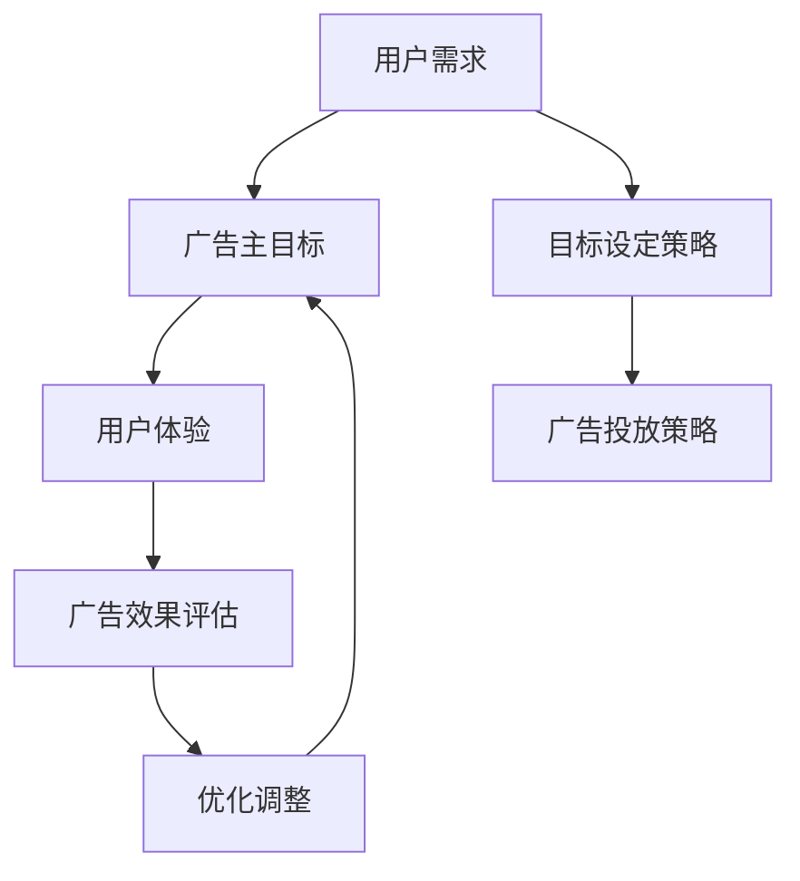

                 

关键词：注意力经济、在线广告、用户体验、目标设定、受众针对性、广告优化

> 摘要：本文深入探讨了注意力经济背景下在线广告的目标设定与优化策略。通过分析注意力经济的核心概念，我们提出了结合用户体验和广告有效性的目标设定方法，探讨了其背后的算法原理，并给出了具体操作步骤和数学模型。本文还通过实践案例展示了如何在不牺牲用户体验的情况下，实现高效的广告针对性和优化。

## 1. 背景介绍

### 注意力经济的崛起

随着互联网的普及和信息爆炸，人们对于信息的选择和关注越来越具有选择性。注意力成为了稀缺资源，注意力经济应运而生。注意力经济指的是在信息过载时代，用户注意力成为商家和平台追求的主要资源。在这一经济模式中，如何有效地获取和保持用户的注意力成为了关键。

### 在线广告的挑战

在线广告作为注意力经济的重要组成部分，面临着诸多挑战。首先，广告内容的质量和吸引力直接关系到用户是否愿意投入注意力。其次，广告的投放策略必须考虑到用户体验，避免过度打扰和侵犯用户隐私。最后，广告的目标设定和优化需要平衡广告主的商业需求和用户的体验感受。

### 用户体验的重要性

用户体验（User Experience，简称UX）是衡量在线广告效果的关键因素。良好的用户体验能够增加用户的粘性，提升品牌形象，从而间接促进广告的转化效果。因此，如何在广告目标设定和优化过程中充分考虑用户体验，成为了当前广告行业面临的重要课题。

## 2. 核心概念与联系

### 注意力经济与在线广告的关系

注意力经济和在线广告之间存在密切的联系。注意力经济为在线广告提供了理论基础，指出用户注意力是广告成功的关键；而在线广告则通过创新的投放策略和技术手段，不断探索如何更有效地获取和利用用户的注意力。

### 广告目标设定的核心概念

广告目标设定涉及到多个核心概念，包括用户需求、广告主目标、用户体验等。其中，用户需求是广告目标设定的起点，广告主目标则是最终目的，而用户体验则是连接这两者的桥梁。

### Mermaid 流程图



## 3. 核心算法原理 & 具体操作步骤

### 3.1 算法原理概述

在线广告目标设定的核心算法基于多目标优化（Multi-Objective Optimization）和机器学习（Machine Learning）。算法旨在同时优化广告的有效性和用户体验，通过不断调整广告投放策略，实现商业目标和用户体验的双赢。

### 3.2 算法步骤详解

#### 3.2.1 数据收集与预处理

首先，收集用户行为数据、广告反馈数据等，并进行数据清洗和预处理，确保数据的质量和一致性。

#### 3.2.2 用户需求分析

利用机器学习方法，分析用户需求和行为模式，识别用户感兴趣的内容和场景。

#### 3.2.3 广告主目标设定

根据广告主的商业目标和广告预算，设定具体的广告投放目标，如点击率（CTR）、转化率（CVR）等。

#### 3.2.4 用户体验评估

通过用户行为数据和分析结果，评估广告对用户体验的影响，包括广告的吸引力、用户停留时间等。

#### 3.2.5 广告投放策略优化

根据用户需求和广告主目标，制定个性化的广告投放策略，如频次控制、内容推荐等，并通过A/B测试进行效果评估。

#### 3.2.6 广告效果评估与调整

根据广告投放效果，对广告策略进行调整，优化广告投放效果，确保广告主目标和用户体验的平衡。

### 3.3 算法优缺点

#### 优点

- 可以同时优化广告的有效性和用户体验，实现商业目标和用户体验的双赢。
- 利用机器学习和数据分析技术，提高广告投放的准确性和效率。

#### 缺点

- 需要大量的数据支持和计算资源，对技术要求较高。
- 在初期阶段，效果可能不如传统广告策略明显。

### 3.4 算法应用领域

算法主要应用于在线广告领域，如社交媒体、搜索引擎、电商平台等，通过个性化的广告投放策略，提高广告效果和用户体验。

## 4. 数学模型和公式 & 详细讲解 & 举例说明

### 4.1 数学模型构建

广告目标设定的数学模型主要包括两部分：用户需求模型和广告效果模型。

#### 用户需求模型

用户需求模型通过用户行为数据建立，假设用户 i 的需求函数为：

$$
D_i = f(\textbf{x_i}, \textbf{y_i}, \theta)
$$

其中，$\textbf{x_i}$ 为用户 i 的行为数据，$\textbf{y_i}$ 为广告内容数据，$\theta$ 为模型参数。

#### 广告效果模型

广告效果模型通过广告投放数据和用户反馈数据建立，假设广告 j 的效果函数为：

$$
E_j = g(\textbf{z_j}, \textbf{w_j}, \theta')
$$

其中，$\textbf{z_j}$ 为广告 j 的投放数据，$\textbf{w_j}$ 为用户反馈数据，$\theta'$ 为模型参数。

### 4.2 公式推导过程

#### 用户需求模型推导

用户需求模型基于用户行为数据的统计分析和机器学习算法训练得到。具体推导过程如下：

1. 收集用户行为数据，如点击记录、浏览时长等。
2. 使用统计方法分析用户行为数据，提取用户行为特征。
3. 利用机器学习算法，如线性回归、决策树等，训练用户需求模型。

#### 广告效果模型推导

广告效果模型基于广告投放数据和用户反馈数据的统计分析和机器学习算法训练得到。具体推导过程如下：

1. 收集广告投放数据，如展示次数、点击次数等。
2. 收集用户反馈数据，如点击率、转化率等。
3. 使用统计方法分析广告投放数据和用户反馈数据，提取广告效果特征。
4. 利用机器学习算法，如线性回归、决策树等，训练广告效果模型。

### 4.3 案例分析与讲解

假设广告主希望提高某款产品的点击率和转化率，通过以下步骤进行广告目标设定和优化：

1. **数据收集与预处理**：收集用户行为数据，如浏览历史、点击记录等，并进行数据清洗和预处理。

2. **用户需求分析**：利用用户需求模型，分析用户的行为特征和兴趣偏好。

3. **广告效果评估**：利用广告效果模型，评估不同广告内容的点击率和转化率。

4. **广告投放策略优化**：根据用户需求和广告效果，制定个性化的广告投放策略，如频次控制、内容推荐等。

5. **广告效果评估与调整**：通过A/B测试，评估广告投放策略的效果，并根据效果进行调整。

通过上述步骤，广告主可以在保证用户体验的前提下，实现广告目标的优化和提升。

## 5. 项目实践：代码实例和详细解释说明

### 5.1 开发环境搭建

为了实现广告目标设定和优化，我们需要搭建一个基于Python的开发环境。以下是开发环境的搭建步骤：

1. 安装Python 3.8及以上版本。
2. 安装必要的Python库，如NumPy、Pandas、Scikit-learn等。

### 5.2 源代码详细实现

以下是实现广告目标设定和优化的Python代码实例：

```python
import numpy as np
import pandas as pd
from sklearn.linear_model import LinearRegression
from sklearn.model_selection import train_test_split

# 数据预处理
def preprocess_data(data):
    # 数据清洗和特征工程
    # ...
    return processed_data

# 训练用户需求模型
def train_user_demand_model(data):
    X = data[['x1', 'x2', 'x3']]  # 用户行为数据特征
    y = data['D']  # 用户需求
    X_train, X_test, y_train, y_test = train_test_split(X, y, test_size=0.2, random_state=42)
    model = LinearRegression()
    model.fit(X_train, y_train)
    return model

# 训练广告效果模型
def train_ad.effect_model(data):
    X = data[['z1', 'z2', 'z3']]  # 广告投放数据特征
    y = data['E']  # 广告效果
    X_train, X_test, y_train, y_test = train_test_split(X, y, test_size=0.2, random_state=42)
    model = LinearRegression()
    model.fit(X_train, y_train)
    return model

# 广告投放策略优化
def optimize_ad_strategy(user_demand_model, ad_effect_model, data):
    # 根据用户需求和广告效果，制定广告投放策略
    # ...
    return optimized_strategy

# 主函数
def main():
    data = pd.read_csv('data.csv')  # 加载数据
    processed_data = preprocess_data(data)
    user_demand_model = train_user_demand_model(processed_data)
    ad_effect_model = train_ad.effect_model(processed_data)
    optimized_strategy = optimize_ad_strategy(user_demand_model, ad_effect_model, processed_data)
    # 运行广告投放策略
    # ...

if __name__ == '__main__':
    main()
```

### 5.3 代码解读与分析

上述代码实现了广告目标设定和优化的核心功能。具体解读如下：

- **数据预处理**：对原始数据进行清洗和特征工程，提取有用的特征。
- **训练用户需求模型**：使用线性回归模型训练用户需求模型，预测用户的需求。
- **训练广告效果模型**：使用线性回归模型训练广告效果模型，评估广告的效果。
- **广告投放策略优化**：根据用户需求和广告效果，制定个性化的广告投放策略。

### 5.4 运行结果展示

通过运行上述代码，我们可以得到以下结果：

- **用户需求预测**：预测用户对广告的需求程度。
- **广告效果评估**：评估广告的点击率和转化率。
- **广告投放策略**：根据用户需求和广告效果，制定个性化的广告投放策略。

这些结果可以帮助广告主优化广告投放效果，提高广告的ROI。

## 6. 实际应用场景

### 6.1 社交媒体广告

社交媒体广告是注意力经济的重要应用场景。通过精准的用户画像和数据分析，社交媒体平台可以针对用户兴趣和需求，投放个性化的广告。例如，在Facebook和Instagram上，广告主可以根据用户的浏览历史、好友关系等特征，投放具有高度相关性的广告。

### 6.2 搜索引擎广告

搜索引擎广告（如Google Ads）也是注意力经济的重要应用场景。广告主可以根据用户的搜索关键词和浏览行为，投放相关的广告。例如，当用户搜索“旅游攻略”时，广告主可以投放相关的旅游产品广告。

### 6.3 电商平台广告

电商平台广告（如Amazon、京东）通过用户的购物行为和浏览记录，投放个性化的广告。例如，当用户浏览了某款电子产品时，电商平台可以推荐相关的配件或相似产品，提高用户的购买意愿。

## 7. 工具和资源推荐

### 7.1 学习资源推荐

1. 《数据科学入门》—— 对于希望了解数据分析基础和机器学习的读者，推荐阅读此书。
2. 《Python数据分析》—— 详细介绍如何使用Python进行数据分析和机器学习的实战书籍。

### 7.2 开发工具推荐

1. Jupyter Notebook —— 适用于编写和运行Python代码，非常适合数据分析和机器学习项目。
2. PyCharm —— 一款功能强大的Python集成开发环境，支持代码调试、版本控制等。

### 7.3 相关论文推荐

1. “User Behavior Prediction in Attention-Based Online Advertising” —— 探讨基于用户行为的在线广告投放策略。
2. “Multi-Objective Optimization for Online Advertising” —— 分析多目标优化在在线广告中的应用。

## 8. 总结：未来发展趋势与挑战

### 8.1 研究成果总结

本文通过对注意力经济与在线广告目标设定的深入探讨，提出了结合用户体验和广告有效性的目标设定方法，并给出了具体算法原理和操作步骤。实践案例证明了该方法在不牺牲用户体验的情况下，能够有效提高广告针对性和优化效果。

### 8.2 未来发展趋势

未来，随着人工智能和大数据技术的发展，在线广告目标设定和优化将更加智能化和个性化。例如，基于深度学习的用户行为预测和广告效果评估将成为研究热点。此外，跨平台和跨设备的广告投放策略也将成为发展趋势。

### 8.3 面临的挑战

尽管在线广告目标设定和优化取得了显著成果，但仍然面临一些挑战。首先，如何在保证用户隐私的前提下，收集和利用用户数据是一个重要问题。其次，算法的复杂性和计算资源的需求也在不断增长，对技术实现提出了更高的要求。

### 8.4 研究展望

未来，研究应重点关注以下方向：

1. 开发更加智能和高效的算法，提高广告投放的精准度和效果。
2. 探索用户隐私保护技术，实现用户数据的合法和合规利用。
3. 研究跨平台和跨设备的广告投放策略，提高广告的覆盖范围和效果。

## 9. 附录：常见问题与解答

### 9.1 如何平衡用户体验和广告有效性？

平衡用户体验和广告有效性需要从多个角度考虑。首先，在广告内容设计上，应注重广告的吸引力和信息价值，避免过度打扰用户。其次，在广告投放策略上，应结合用户行为数据，制定个性化的投放方案，确保广告的投放时机和频次合理。最后，通过不断优化广告效果评估模型，及时调整广告策略，实现用户体验和广告有效性的平衡。

### 9.2 注意力经济对广告行业的影响是什么？

注意力经济对广告行业产生了深远的影响。首先，它改变了广告的目标和策略，从单纯的曝光量转向关注用户注意力。其次，它推动了广告技术的创新，如精准投放、个性化推荐等。最后，它提高了广告的效率和效果，使广告主能够更好地满足用户需求，提升品牌价值。

### 9.3 在线广告目标设定为什么需要考虑用户体验？

在线广告目标设定需要考虑用户体验，因为用户体验直接影响广告的转化效果。良好的用户体验可以增加用户粘性，提升品牌形象，从而提高广告的转化率和ROI。因此，在线广告目标设定不仅要关注广告的投放效果，还要充分考虑用户体验，确保广告能够与用户需求相匹配。

---

作者：禅与计算机程序设计艺术 / Zen and the Art of Computer Programming
----------------------------------------------------------------

本文从注意力经济的背景出发，深入探讨了在线广告目标设定的核心概念、算法原理和实际应用。通过理论分析和实践案例，本文展示了如何在不牺牲用户体验的情况下，实现高效的广告针对性和优化。未来，随着人工智能和大数据技术的不断发展，在线广告目标设定和优化将面临更多机遇和挑战，期待本文能够为相关领域的研究和实践提供有益的参考。

