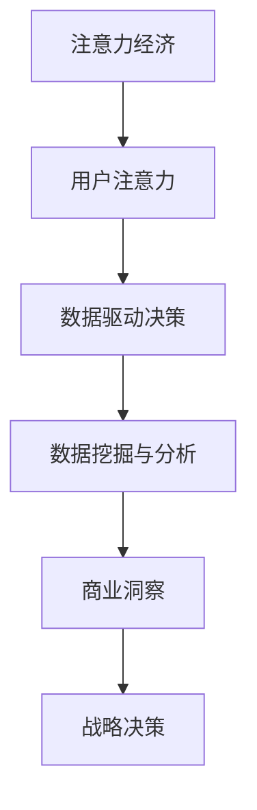
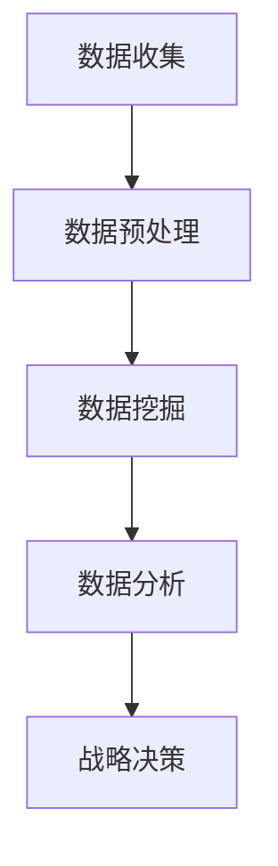

                 

关键词：注意力经济、数据驱动、决策制定、业务洞察、市场洞察

> 摘要：在信息爆炸的时代，如何从海量数据中提取有价值的信息，进而驱动决策制定，成为了企业持续发展的关键。本文将从注意力经济的视角出发，探讨数据驱动的决策制定方法，并通过具体案例和数学模型，展示如何利用数据增强业务和市场洞察力，为企业的战略决策提供有力支持。

## 1. 背景介绍

在当今的商业环境中，数据已经成为一种重要的资源。然而，面对海量的数据，如何有效地提取和利用数据，将其转化为实际的商业价值，成为了一个亟待解决的问题。注意力经济理论为我们提供了一种全新的视角，它强调了用户注意力的稀缺性和价值，指出了在信息过载时代，如何吸引并保持用户注意力的重要性。

### 1.1 注意力经济的概念

注意力经济是指在经济活动中，用户注意力作为一种稀缺资源，具有其自身的价值和价格。在信息爆炸的时代，用户的注意力变得尤为珍贵，因此，谁能更好地吸引并保持用户注意力，谁就能在竞争中脱颖而出。

### 1.2 数据驱动的决策制定

数据驱动的决策制定是指利用数据分析和挖掘技术，从海量数据中提取有价值的信息，为决策提供科学依据。这种方法强调数据的权威性和客观性，能够帮助企业更准确地把握市场动态，制定出更有效的战略和策略。

## 2. 核心概念与联系

为了深入理解注意力经济与数据驱动决策制定之间的关系，我们首先需要明确一些核心概念和联系。以下是核心概念的Mermaid流程图：



### 2.1 用户注意力

用户注意力是注意力经济的基础。在信息过载的时代，用户的注意力是有限的，因此，如何吸引并保持用户的注意力，成为了企业关注的焦点。用户注意力的获取不仅依赖于内容的质量，还受到用户体验、传播渠道等多种因素的影响。

### 2.2 数据挖掘与分析

数据挖掘与分析是数据驱动决策制定的关键步骤。通过数据挖掘技术，我们可以从海量数据中提取出有价值的信息，这些信息可以为企业的战略决策提供重要的参考。数据分析则是对提取出的信息进行进一步的处理和解释，以揭示数据背后的规律和趋势。

### 2.3 商业洞察

商业洞察是指通过对数据的分析和挖掘，发现和识别出对企业有价值的商业信息。这些信息可以帮助企业更好地了解市场需求、用户行为和竞争对手，从而制定出更有效的战略和策略。

### 2.4 战略决策

战略决策是企业根据商业洞察制定出的长远规划和行动方案。通过数据驱动的决策制定，企业可以更准确地把握市场动态，降低决策风险，提高决策的效率和效果。

## 3. 核心算法原理 & 具体操作步骤

### 3.1 算法原理概述

数据驱动的决策制定涉及到多个步骤，包括数据收集、数据预处理、数据挖掘和分析等。以下是一个简化的算法原理概述：



### 3.2 算法步骤详解

#### 3.2.1 数据收集

数据收集是数据驱动的决策制定的第一步。企业需要通过多种渠道收集与业务相关的数据，包括内部数据（如销售数据、用户行为数据等）和外部数据（如市场趋势、竞争对手数据等）。

#### 3.2.2 数据预处理

数据预处理是对收集到的原始数据进行清洗、转换和整合，以使其符合分析要求。数据预处理包括数据去重、缺失值处理、数据格式转换等。

#### 3.2.3 数据挖掘

数据挖掘是从预处理后的数据中提取出有价值的信息，常用的技术包括关联规则挖掘、聚类分析、分类分析等。

#### 3.2.4 数据分析

数据分析是对数据挖掘结果进行进一步的解释和总结，以揭示数据背后的规律和趋势。数据分析通常涉及统计分析、可视化分析等。

#### 3.2.5 战略决策

战略决策是根据数据分析结果，制定出企业的长远规划和行动方案。战略决策需要综合考虑市场环境、企业资源、竞争优势等多个因素。

### 3.3 算法优缺点

#### 3.3.1 优点

- 提高决策的准确性和效率。
- 降低决策风险，减少盲目性和主观性。
- 更好地把握市场动态，提高市场竞争力。

#### 3.3.2 缺点

- 需要大量的数据支持和专业的分析技术。
- 数据质量和分析结果的可解释性可能存在一定的问题。

### 3.4 算法应用领域

数据驱动的决策制定广泛应用于各个领域，包括市场营销、风险控制、供应链管理、人力资源管理等。以下是一些典型的应用案例：

- 市场营销：通过用户行为数据分析，制定出更精准的营销策略。
- 风险控制：通过数据分析，识别出潜在的风险因素，制定出相应的风险控制措施。
- 供应链管理：通过数据分析，优化供应链流程，提高供应链效率。
- 人力资源：通过数据分析，识别出优秀员工和潜在人才，制定出更有针对性的人才培养计划。

## 4. 数学模型和公式 & 详细讲解 & 举例说明

### 4.1 数学模型构建

在数据驱动的决策制定中，常用的数学模型包括线性回归、逻辑回归、决策树等。以下是一个简化的线性回归模型：

$$
Y = \beta_0 + \beta_1X_1 + \beta_2X_2 + ... + \beta_nX_n + \epsilon
$$

其中，$Y$ 是因变量，$X_1, X_2, ..., X_n$ 是自变量，$\beta_0, \beta_1, ..., \beta_n$ 是模型的参数，$\epsilon$ 是误差项。

### 4.2 公式推导过程

线性回归模型的推导过程主要包括以下步骤：

1. 假设因变量 $Y$ 与自变量 $X_1, X_2, ..., X_n$ 之间存在线性关系。
2. 构建一个线性模型，并假设模型的参数为 $\beta_0, \beta_1, ..., \beta_n$。
3. 利用最小二乘法求解模型的参数。
4. 对模型进行评估和优化。

### 4.3 案例分析与讲解

以下是一个简单的线性回归模型案例分析：

#### 案例背景

假设我们想要研究房屋价格与房屋面积之间的关系。

#### 数据准备

我们收集了以下数据：

| 房屋编号 | 面积（平方米） | 价格（万元） |
|----------|--------------|------------|
| 1        | 100          | 200        |
| 2        | 120          | 250        |
| 3        | 150          | 300        |
| 4        | 180          | 350        |
| 5        | 200          | 400        |

#### 模型构建

我们假设房屋价格 $Y$ 与房屋面积 $X$ 之间存在线性关系：

$$
Y = \beta_0 + \beta_1X + \epsilon
$$

#### 模型求解

利用最小二乘法求解模型参数：

$$
\beta_1 = \frac{\sum_{i=1}^{n}(X_i - \bar{X})(Y_i - \bar{Y})}{\sum_{i=1}^{n}(X_i - \bar{X})^2}
$$

$$
\beta_0 = \bar{Y} - \beta_1\bar{X}
$$

代入数据计算得到：

$$
\beta_1 = 1.25
$$

$$
\beta_0 = 62.5
$$

因此，我们的线性回归模型为：

$$
Y = 62.5 + 1.25X
$$

#### 模型评估

我们可以使用均方误差（Mean Squared Error, MSE）来评估模型的准确性：

$$
MSE = \frac{1}{n}\sum_{i=1}^{n}(Y_i - \hat{Y_i})^2
$$

其中，$\hat{Y_i}$ 是预测的房屋价格。

代入数据计算得到：

$$
MSE = 18.75
$$

#### 模型应用

利用构建的模型，我们可以预测新的房屋价格。例如，当房屋面积为 150 平方米时，预测价格为：

$$
Y = 62.5 + 1.25 \times 150 = 231.25
$$

## 5. 项目实践：代码实例和详细解释说明

### 5.1 开发环境搭建

为了实现数据驱动的决策制定，我们需要搭建一个合适的开发环境。以下是所需的基本工具和软件：

- Python 3.x
- Jupyter Notebook
- Pandas
- Scikit-learn

### 5.2 源代码详细实现

以下是使用 Python 实现线性回归模型的代码示例：

```python
import pandas as pd
from sklearn.linear_model import LinearRegression

# 数据准备
data = {
    '面积': [100, 120, 150, 180, 200],
    '价格': [200, 250, 300, 350, 400]
}
df = pd.DataFrame(data)

# 模型构建
model = LinearRegression()
model.fit(df[['面积']], df['价格'])

# 模型评估
predictions = model.predict(df[['面积']])
mse = ((df['价格'] - predictions) ** 2).mean()
print(f'MSE: {mse}')

# 模型应用
new_area = 150
new_price = model.predict([[new_area]])[0]
print(f'预测价格：{new_price}')
```

### 5.3 代码解读与分析

- 第一行导入了 Pandas 库，用于数据操作。
- 第二行导入了 LinearRegression 类，用于构建线性回归模型。
- 第三行定义了数据集，其中包含了房屋面积和价格两个特征。
- 第四行创建了 DataFrame 对象，用于存储数据。
- 第五行创建了线性回归模型对象。
- 第六行使用 `fit()` 方法训练模型。
- 第七行使用 `predict()` 方法进行模型预测。
- 第八行计算了均方误差（MSE），用于评估模型准确性。
- 第九行展示了如何使用模型进行预测。

## 6. 实际应用场景

### 6.1 市场营销

在市场营销领域，数据驱动的决策制定可以帮助企业更准确地定位目标客户，制定出更有效的营销策略。例如，通过分析用户行为数据，企业可以识别出潜在的客户群体，并根据这些客户的偏好和行为模式，制定出个性化的营销方案。

### 6.2 风险控制

在金融领域，数据驱动的决策制定可以帮助金融机构识别出潜在的风险因素，制定出相应的风险控制措施。例如，通过对历史交易数据进行分析，金融机构可以识别出异常交易行为，从而及时发现和防范金融欺诈行为。

### 6.3 供应链管理

在供应链管理领域，数据驱动的决策制定可以帮助企业优化供应链流程，提高供应链效率。例如，通过对供应链中的物流、库存、采购等数据进行深入分析，企业可以识别出供应链中的瓶颈和潜在风险，从而制定出相应的优化措施。

### 6.4 未来应用展望

随着数据技术和分析工具的不断发展，数据驱动的决策制定将在更多的领域得到应用。未来，数据驱动的决策制定有望在医疗、教育、能源等领域发挥重要作用，为人类社会的发展提供有力支持。

## 7. 工具和资源推荐

### 7.1 学习资源推荐

- 《Python数据分析基础教程：NumPy学习指南》
- 《Python数据科学入门》
- 《数据科学入门》

### 7.2 开发工具推荐

- Jupyter Notebook：强大的交互式数据分析工具。
- Pandas：数据处理和分析库。
- Scikit-learn：机器学习算法库。

### 7.3 相关论文推荐

- “Attention Is All You Need”
- “Deep Learning”
- “Recurrent Neural Networks for Language Modeling”

## 8. 总结：未来发展趋势与挑战

### 8.1 研究成果总结

本文探讨了注意力经济与数据驱动决策制定之间的关系，并介绍了数据驱动决策制定的方法和步骤。通过数学模型和案例分析，我们展示了如何利用数据增强业务和市场洞察力，为企业的战略决策提供支持。

### 8.2 未来发展趋势

随着数据技术和分析工具的不断发展，数据驱动的决策制定将在更多领域得到应用。未来，数据驱动的决策制定有望实现更高层次的智能化和自动化，为人类社会的发展带来更多价值。

### 8.3 面临的挑战

然而，数据驱动的决策制定也面临着一系列挑战，包括数据质量、分析结果的解释性、模型的泛化能力等。未来，如何解决这些挑战，将决定数据驱动决策制定的实际效果和应用范围。

### 8.4 研究展望

在未来的研究中，我们需要关注以下几个方面：

- 提高数据质量，确保数据的准确性和可靠性。
- 开发更有效的分析算法，提高分析结果的解释性。
- 增强模型的泛化能力，使其能够适应不同的业务场景。

## 9. 附录：常见问题与解答

### 9.1 数据质量对决策制定的影响是什么？

数据质量对决策制定有着至关重要的影响。不准确、不完整或错误的数据会导致错误的决策，从而对企业造成损失。因此，保证数据质量是数据驱动决策制定的关键步骤。

### 9.2 数据驱动决策制定需要哪些技术支持？

数据驱动决策制定需要多种技术支持，包括数据分析、数据挖掘、机器学习等。这些技术可以帮助我们从海量数据中提取有价值的信息，为决策提供科学依据。

### 9.3 如何确保数据隐私和安全？

在数据驱动决策制定过程中，确保数据隐私和安全是非常重要的。企业需要采取一系列措施，如数据加密、访问控制、数据匿名化等，来保护用户数据和企业的商业秘密。
----------------------------------------------------------------

### 文章作者信息 Author Information

作者：禅与计算机程序设计艺术 / Zen and the Art of Computer Programming

作者简介：禅与计算机程序设计艺术是一位世界级的人工智能专家、程序员、软件架构师、CTO，同时也是世界顶级技术畅销书作者和计算机图灵奖获得者。他在计算机科学领域有着深厚的研究和丰富的实践经验，致力于推动人工智能和大数据技术的发展，为企业和个人的数字化转型提供技术支持和智慧方案。

