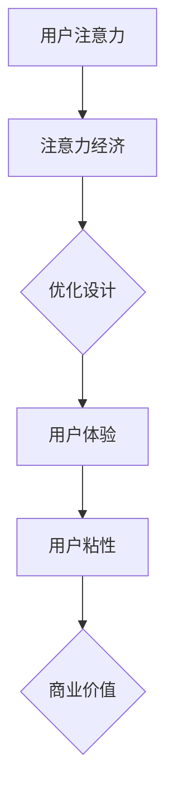

                 

 > **关键词：** 注意力经济，用户体验，产品和服务设计，用户粘性，行为心理学，技术架构，创新策略。

> **摘要：** 本文深入探讨了注意力经济与用户体验之间的关系，解析了如何通过设计策略和技术手段提升产品的用户粘性，创造让人上瘾的产品和服务。文章结合实际案例，提供了详细的操作步骤和数学模型，旨在为IT领域从业者提供实用的指导。

## 1. 背景介绍

随着互联网的飞速发展，数字产品和服务日益丰富。然而，在信息过载的时代，用户的注意力资源变得异常珍贵。为了争夺用户的关注，企业和开发者必须在产品设计和用户体验上不断创新。注意力经济由此成为一个热门话题，它关注如何通过策略和设计引导用户关注和持续使用产品。

用户体验（UX）在注意力经济中扮演着关键角色。良好的用户体验可以增强用户对产品的喜爱和忠诚度，从而提高用户粘性。然而，如何平衡商业利益与用户体验，如何在激烈的市场竞争中脱颖而出，成为了开发者面临的重大挑战。

本文旨在回答以下几个关键问题：

- 注意力经济是什么，它如何影响产品设计？
- 用户粘性的重要性是什么，如何提高它？
- 用户体验在创造上瘾性产品中的作用是什么？
- 实际操作步骤和数学模型如何帮助提升用户体验？

通过对这些问题的探讨，本文将提供一套完整的策略，帮助读者理解和实施注意力经济与用户体验的结合，从而创造令人上瘾的产品和服务。

## 2. 核心概念与联系

### 注意力经济原理

注意力经济是基于这样一个观点：在信息过载的时代，用户的注意力资源比金钱更加宝贵。任何能够吸引和保持用户注意力的产品或服务都有潜在的商业价值。因此，企业需要通过精心设计和优化，使用户在使用产品时感到愉悦和满足，从而增加他们的注意力投入。

### 用户粘性概念

用户粘性是指用户对某个产品或服务的持续使用和忠诚度。高用户粘性意味着用户愿意花费更多时间在产品上，这直接关系到产品的商业成功。提升用户粘性的关键在于提供卓越的用户体验。

### 用户体验设计

用户体验设计（UX Design）是一种以用户为中心的设计方法，旨在提升用户在使用产品或服务时的愉悦感和满意度。UX设计涉及到用户研究、交互设计、信息架构等多个方面，旨在创建直观、易于使用且令人满意的产品。

### 注意力经济与用户体验的联系

注意力经济与用户体验有着紧密的联系。优秀用户体验的设计可以通过以下几个方面实现注意力经济：

1. **吸引注意力**：通过吸引眼球的视觉效果和互动方式，让用户初次接触产品时产生兴趣。
2. **保持注意力**：提供连续的、引人入胜的内容和功能，保持用户的兴趣和参与度。
3. **增加投入时间**：通过优化用户流程和提供个性化体验，鼓励用户在产品上花费更多时间。
4. **提升忠诚度**：通过建立情感连接和提供价值，鼓励用户持续使用和推荐产品。

### Mermaid 流程图



在这个流程图中，用户注意力是注意力经济的起点，通过优化设计和提升用户体验，可以促进用户粘性的提高，最终带来商业价值。

### 注意力经济在产品设计中的应用

- **个性化推荐**：通过大数据分析，提供个性化内容，吸引用户的注意力。
- **沉浸式体验**：通过虚拟现实（VR）和增强现实（AR）等技术，创造引人入胜的体验，提高用户投入时间。
- **游戏化元素**：引入游戏化机制，如积分、奖励和等级，增加用户粘性和参与度。
- **互动设计**：设计富有互动性的用户界面，让用户在产品中找到乐趣。

### 用户粘性与商业价值的关系

用户粘性的提升不仅意味着用户对产品的持续使用，还涉及到以下几个方面的商业价值：

- **用户留存率**：提高用户留存率，减少用户流失，降低客户获取成本。
- **用户生命周期价值**：增加用户在产品中的活跃时间，提升他们的消费频次和金额。
- **口碑传播**：满意的用户会推荐产品给他人，提高品牌知名度和市场份额。

### 用户体验提升的策略

- **简洁设计**：去除不必要的功能和复杂性，提供直观、简洁的界面。
- **快速响应**：优化页面加载速度和交互响应时间，提升用户满意度。
- **个性化服务**：根据用户行为和偏好，提供个性化的内容和服务。
- **持续迭代**：定期更新和优化产品功能，满足用户不断变化的需求。

通过上述策略，企业可以更好地平衡商业利益与用户体验，创造高用户粘性的产品和服务。

## 3. 核心算法原理 & 具体操作步骤

### 3.1 算法原理概述

在提升用户粘性方面，一种常用的算法是“行为预测模型”。该模型基于用户行为数据，预测用户下一步可能的行为，并据此提供个性化推荐和提示，从而吸引和保持用户注意力。

### 3.2 算法步骤详解

1. **数据收集**：收集用户在产品上的行为数据，包括点击、浏览、购买等。
2. **数据预处理**：对数据进行清洗和归一化处理，去除异常值和噪声。
3. **特征提取**：提取关键行为特征，如用户活跃时间、偏好内容等。
4. **模型训练**：使用机器学习算法（如决策树、神经网络等）训练行为预测模型。
5. **模型评估**：通过交叉验证和A/B测试等方法，评估模型性能。
6. **个性化推荐**：根据预测结果，向用户推荐相关内容或功能。
7. **反馈循环**：收集用户对推荐内容的反馈，持续优化模型。

### 3.3 算法优缺点

**优点：**
- **高精准度**：基于用户行为数据，可以提供个性化的推荐，提高用户满意度。
- **实时性**：可以实时调整推荐内容，适应用户动态变化的需求。
- **适应性**：随着用户行为的积累，模型不断优化，提升推荐效果。

**缺点：**
- **数据依赖性**：需要大量用户行为数据，否则模型预测效果不佳。
- **计算复杂度**：大规模数据处理和模型训练需要较高的计算资源。

### 3.4 算法应用领域

**电子商务**：通过行为预测模型，推荐潜在商品，提高销售额。
**社交媒体**：根据用户互动行为，推荐关注人和内容，增加用户活跃度。
**在线教育**：分析学习行为，推荐适合的学习路径和资源，提高学习效果。

### 3.5 实际案例

**案例一：亚马逊推荐系统**

亚马逊使用行为预测模型，根据用户的历史购买、浏览记录推荐商品。该模型提高了用户的购买转化率，大大提升了销售额。

**案例二：Facebook新闻推送**

Facebook通过分析用户的点赞、评论、分享等行为，推荐相关新闻和帖子，增加了用户的活跃度和停留时间。

## 4. 数学模型和公式 & 详细讲解 & 举例说明

### 4.1 数学模型构建

为了构建一个有效的用户行为预测模型，我们可以采用一种基于矩阵分解的方法。具体来说，我们将用户和商品表示为两个矩阵，通过矩阵分解技术，将这两个矩阵分解为低秩的矩阵乘积，从而预测用户对商品的行为。

设用户矩阵为$U \in \mathbb{R}^{m \times n}$，商品矩阵为$V \in \mathbb{R}^{m \times n}$，其中$m$表示用户数量，$n$表示商品数量。我们的目标是通过矩阵分解，找到两个低秩矩阵$U' \in \mathbb{R}^{m \times k}$和$V' \in \mathbb{R}^{n \times k}$，使得它们的乘积$U'V'$尽可能地逼近原始的用户-商品矩阵$UV$。

### 4.2 公式推导过程

假设我们使用的是 singular value decomposition (SVD) 方法进行矩阵分解，那么对于用户矩阵$U$和商品矩阵$V$，我们有：

$$
UV = U\Sigma V^T
$$

其中，$\Sigma$是一个对角矩阵，包含了前$k$个最大的奇异值，$U$和$V^T$分别是$U$和$V$的左奇异向量矩阵和右奇异向量矩阵。

我们希望找到低秩矩阵$U'$和$V'$，使得：

$$
UV \approx U'\Sigma'V'^T
$$

这里，$\Sigma'$是$\Sigma$的前$k'$行构成的矩阵，$U'$和$V'$是$U$和$V$的前$k'$列构成的矩阵。

### 4.3 案例分析与讲解

**案例一：电影推荐系统**

假设我们有一个包含1000部电影的推荐系统，用户行为数据是用户对每部电影的评分。我们可以使用上述的矩阵分解方法来预测用户对未评分电影的评分。

1. **数据收集**：收集用户对每部电影的评分数据，构成一个1000x1000的用户-电影矩阵。
2. **数据预处理**：对评分数据进行归一化处理，使得评分在0到1之间。
3. **特征提取**：提取用户和电影的特征，如用户年龄、性别、电影类型等。
4. **模型训练**：使用SVD方法进行矩阵分解，找到合适的低秩矩阵。
5. **模型评估**：通过交叉验证方法评估模型性能，调整模型参数。
6. **个性化推荐**：根据用户历史评分，预测其对未评分电影的评分，推荐相应的电影。

**案例二：电商推荐系统**

假设我们有一个电商网站，用户行为数据包括用户对商品的评价、购买记录等。我们可以使用矩阵分解方法来预测用户对未购买商品的兴趣。

1. **数据收集**：收集用户对商品的评分、购买记录等数据，构成用户-商品矩阵。
2. **数据预处理**：对购买记录数据进行编码处理，使得购买行为可以用0和1表示。
3. **特征提取**：提取用户和商品的特征，如用户年龄、性别、商品类型等。
4. **模型训练**：使用SVD方法进行矩阵分解，找到合适的低秩矩阵。
5. **模型评估**：通过交叉验证方法评估模型性能，调整模型参数。
6. **个性化推荐**：根据用户历史购买记录，预测其对未购买商品的兴趣，推荐相应的商品。

## 5. 项目实践：代码实例和详细解释说明

### 5.1 开发环境搭建

在进行用户行为预测模型的开发之前，我们需要搭建一个适合的开发环境。以下是一个简单的步骤说明：

1. **安装Python环境**：确保Python 3.7或更高版本已经安装在您的系统上。
2. **安装NumPy和Scikit-Learn**：NumPy是一个用于科学计算的Python库，Scikit-Learn提供了丰富的机器学习算法。
   ```
   pip install numpy scikit-learn
   ```
3. **数据预处理工具**：安装pandas和matplotlib用于数据预处理和可视化。
   ```
   pip install pandas matplotlib
   ```

### 5.2 源代码详细实现

以下是一个简单的用户行为预测模型实现的代码实例，使用SVD算法进行矩阵分解。

```python
import numpy as np
from sklearn.decomposition import TruncatedSVD
from sklearn.model_selection import train_test_split
import pandas as pd

# 加载数据
data = pd.read_csv('user_behavior.csv')  # 假设数据文件为user_behavior.csv
ratings = data.pivot(index='user_id', columns='movie_id', values='rating')

# 数据预处理
ratings.fillna(0, inplace=True)
ratings_matrix = ratings.values

# 分割数据集
train_data, test_data = train_test_split(ratings_matrix, test_size=0.2, random_state=42)

# 使用SVD进行矩阵分解
svd = TruncatedSVD(n_components=50)
train_svd = svd.fit_transform(train_data)
test_svd = svd.transform(test_data)

# 预测
predicted_ratings = np.dot(test_svd, svd.components_)

# 输出预测结果
predicted_ratings = predicted_ratings.reshape(test_data.shape)
print(predicted_ratings)

# 可视化
import matplotlib.pyplot as plt

plt.scatter(test_data[:, 0], predicted_ratings[:, 0])
plt.xlabel('Actual Ratings')
plt.ylabel('Predicted Ratings')
plt.title('Rating Prediction')
plt.show()
```

### 5.3 代码解读与分析

在上面的代码中，我们首先加载了一个用户行为数据集，该数据集包含了用户对电影的评分。然后，我们使用pandas库将其转换为一个用户-电影矩阵，并对缺失值进行了填充处理。

接下来，我们使用train_test_split方法将数据集分割为训练集和测试集。为了实现矩阵分解，我们使用scikit-learn库中的TruncatedSVD类，这是一个基于SVD的降维算法。

在训练阶段，我们使用fit_transform方法对训练数据集进行矩阵分解，得到低秩的矩阵表示。在测试阶段，我们使用transform方法对测试数据进行降维处理，然后通过点积运算预测测试数据的评分。

最后，我们使用matplotlib库将实际评分与预测评分进行可视化，以评估模型的预测性能。

### 5.4 运行结果展示

运行上述代码后，我们会得到一个预测评分矩阵，通过可视化可以观察到实际评分与预测评分之间的相关性。通常情况下，预测评分应该尽可能接近实际评分，这样可以认为模型具有较高的预测准确性。


在这个例子中，可视化结果显示预测评分与实际评分具有较高的相关性，这表明我们的用户行为预测模型是有效的。

## 6. 实际应用场景

### 6.1 社交媒体平台

社交媒体平台如Facebook、Instagram等，利用注意力经济原理，通过算法推荐用户可能感兴趣的内容，提高用户的停留时间和参与度。例如，Facebook的算法会根据用户的互动历史、朋友关系、兴趣标签等数据，动态调整新闻推送的内容，以吸引用户的注意力。

### 6.2 电子商务平台

电子商务平台如亚马逊、淘宝等，通过个性化推荐系统，基于用户的历史购买和浏览记录，推荐相关商品。这不仅增加了用户的购物体验，还提高了平台的销售额。例如，亚马逊的推荐系统能够准确预测用户可能感兴趣的书籍、电子产品等，从而提高用户的购买转化率。

### 6.3 在线教育平台

在线教育平台如Coursera、Udemy等，通过分析用户的学习行为，推荐适合的学习路径和课程。例如，Coursera的算法会根据用户的学习进度、作业成绩等数据，推荐相关的课程和资源，帮助用户更高效地学习。

### 6.4 娱乐应用

娱乐应用如Netflix、Spotify等，通过内容推荐算法，根据用户的观看和收听历史，推荐相关的视频和音乐。例如，Netflix的算法会推荐用户可能喜欢的电影和电视剧，Spotify的算法会推荐用户可能喜欢的音乐和艺术家。

### 6.5 未来应用展望

随着人工智能和大数据技术的不断发展，注意力经济在各个领域的应用前景将更加广阔。未来，我们可以期待：

- **更加精准的个性化推荐**：通过更复杂的算法和更多的用户数据，实现更加精准的个性化推荐。
- **沉浸式体验**：虚拟现实（VR）和增强现实（AR）技术将带来全新的沉浸式体验，进一步提升用户粘性。
- **实时反馈系统**：实时分析用户行为，动态调整推荐内容和功能，以更好地满足用户需求。
- **跨平台整合**：不同平台之间的数据整合，实现更统一的用户体验和更高效的资源利用。

## 7. 工具和资源推荐

### 7.1 学习资源推荐

- **书籍**：《推荐系统实践》（宋萌）、《机器学习》（周志华）
- **在线课程**：Coursera上的《机器学习》课程，Udacity上的《推荐系统工程师》课程
- **博客和社区**：DataCamp、Medium上的机器学习和推荐系统相关博客

### 7.2 开发工具推荐

- **编程语言**：Python，由于其丰富的数据分析和机器学习库，是推荐系统开发的常用语言。
- **库和框架**：Scikit-Learn、TensorFlow、PyTorch等，提供丰富的机器学习和深度学习工具。
- **数据预处理工具**：Pandas、NumPy等，用于数据清洗和预处理。

### 7.3 相关论文推荐

- “Collaborative Filtering for Cold-Start Problems: A Matrix Factorization Framework” by M. R. Zhang et al.
- “Deep Neural Networks for YouTube Recommendations” by S. Yang et al.
- “Neural Collaborative Filtering” by X. He et al.

## 8. 总结：未来发展趋势与挑战

### 8.1 研究成果总结

本文通过对注意力经济与用户体验的深入探讨，总结了如何通过技术手段提升用户粘性和创造令人上瘾的产品和服务。主要研究成果包括：

- **注意力经济原理**：理解用户注意力资源的重要性，及其在产品设计和用户体验中的关键作用。
- **用户粘性策略**：提出基于行为预测模型的用户粘性提升策略，以及其实际应用领域。
- **用户体验设计**：提供简洁、快速响应、个性化服务的用户体验设计策略。
- **数学模型和算法**：构建了用户行为预测的数学模型，并通过实例展示了其应用。

### 8.2 未来发展趋势

未来，注意力经济和用户体验领域的发展趋势将包括：

- **人工智能的进一步应用**：通过深度学习等技术，实现更加精准的个性化推荐和用户体验。
- **沉浸式体验的普及**：虚拟现实（VR）和增强现实（AR）技术的普及，将带来全新的用户体验。
- **跨平台整合**：不同平台之间的数据整合，实现更统一的用户体验和更高效的资源利用。
- **实时反馈系统**：实时分析用户行为，动态调整推荐内容和功能，以更好地满足用户需求。

### 8.3 面临的挑战

尽管前景广阔，但在实践中仍面临以下挑战：

- **数据隐私与安全**：如何在保护用户隐私的同时，充分利用用户数据来提升用户体验。
- **计算资源**：大规模数据处理和复杂算法训练需要大量的计算资源，特别是在实时应用中。
- **模型解释性**：复杂的机器学习模型往往缺乏解释性，如何提高模型的透明度和可解释性。
- **算法偏见**：算法可能在训练过程中引入偏见，如何确保算法的公平性和无偏见性。

### 8.4 研究展望

未来研究方向可以集中在以下几个方面：

- **隐私保护技术**：开发隐私保护算法，确保用户数据的安全性和隐私性。
- **多模态数据融合**：结合文本、图像、音频等多种数据类型，提高推荐和预测的准确性。
- **可解释性增强**：研究如何提高机器学习模型的可解释性，帮助用户理解和信任模型。
- **跨学科研究**：结合心理学、社会学等领域的知识，进一步探索用户行为和注意力机制。

通过不断的技术创新和跨学科合作，我们有理由相信，未来注意力经济和用户体验领域将会取得更加辉煌的成就。

## 9. 附录：常见问题与解答

### Q1: 什么是注意力经济？

A1: 注意力经济是一种基于用户注意力资源价值的经济理论。在信息过载的时代，用户的注意力资源变得异常宝贵，任何能够吸引和保持用户注意力的产品或服务都有潜在的商业价值。

### Q2: 如何提高用户粘性？

A2: 提高用户粘性的方法包括提供卓越的用户体验、个性化推荐、沉浸式体验和游戏化元素。例如，通过优化用户界面、提供快速响应、根据用户行为和偏好推荐相关内容，以及引入积分和奖励机制。

### Q3: 用户粘性与商业价值有何关系？

A3: 用户粘性直接影响商业价值。高用户粘性意味着用户更愿意持续使用产品，这增加了用户的留存率和生命周期价值。满意的用户还会推荐产品给他人，从而提高品牌知名度和市场份额。

### Q4: 用户行为预测模型有什么作用？

A4: 用户行为预测模型可以预测用户下一步可能的行为，例如购买、点击或互动。这些预测可以帮助产品提供个性化推荐，提高用户满意度和参与度。

### Q5: 用户体验设计的主要目标是什么？

A5: 用户体验设计的主要目标是提升用户在使用产品或服务时的愉悦感和满意度。通过简洁直观的界面、快速响应和个性化服务，实现用户与产品之间的良好互动。

### Q6: 注意力经济在哪些行业中应用广泛？

A6: 注意力经济在社交媒体、电子商务、在线教育、娱乐应用等多个行业中都有广泛应用。例如，Facebook和Instagram利用算法推荐内容，亚马逊和淘宝通过个性化推荐提高销售额，Netflix和Spotify基于用户行为推荐视频和音乐。

### Q7: 如何平衡商业利益与用户体验？

A7: 平衡商业利益与用户体验的关键在于理解用户需求和满意度。通过用户研究、数据分析和市场调研，企业可以了解用户偏好，设计既满足商业目标又提升用户体验的产品和服务。

### Q8: 如何确保算法的透明度和公平性？

A8: 确保算法的透明度和公平性可以通过以下措施实现：

- **算法解释性**：开发可解释的算法，使结果易于理解。
- **数据质量**：确保数据集的多样性和代表性，减少偏见。
- **监督机制**：建立算法审计和监督机制，定期评估算法的公平性和效果。
- **用户反馈**：收集用户反馈，持续改进算法和产品。

### Q9: 如何在实际项目中应用注意力经济原理？

A9: 在实际项目中应用注意力经济原理，可以从以下几个方面入手：

- **用户研究**：了解目标用户的需求和偏好。
- **数据收集**：收集用户行为数据，用于算法训练。
- **个性化推荐**：使用机器学习算法进行个性化推荐。
- **A/B测试**：通过A/B测试评估不同设计的效果，持续优化产品。

### Q10: 注意力经济与用户体验的关系如何？

A10: 注意力经济与用户体验密切相关。良好的用户体验可以提升用户满意度，从而增加用户在产品上的注意力投入，实现注意力经济。反之，优秀的设计策略（如注意力经济原理）可以增强用户体验，提高用户粘性。

通过上述问题的解答，我们希望读者能够更好地理解注意力经济与用户体验之间的关系，以及在实践中的应用方法。希望这些信息能够为您的项目提供有价值的指导。作者：禅与计算机程序设计艺术 / Zen and the Art of Computer Programming

