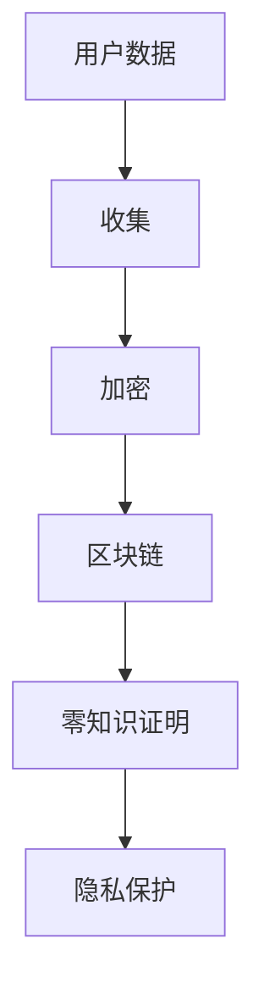

                 

关键词：注意力经济、隐私保护、区块链、数据加密、零知识证明、差分隐私

> 摘要：随着注意力经济模式的兴起，个人隐私的保护问题变得越来越重要。本文从注意力经济的概念出发，探讨了隐私保护的核心挑战，并介绍了多种隐私保护技术，如区块链、数据加密和零知识证明等。此外，文章还分析了差分隐私技术，并探讨了这些技术在现实世界中的应用，以及未来发展的趋势和挑战。

## 1. 背景介绍

在互联网时代，信息的传播速度和范围达到了前所未有的高度。然而，这种信息爆炸也带来了一系列的隐私问题。特别是在注意力经济模式中，用户的注意力成为了一种稀缺资源，平台通过收集和分析用户数据来精准推送广告和内容，从而实现盈利。这种模式虽然为用户提供了个性化的服务，但也加剧了用户隐私泄露的风险。

注意力经济是指利用用户注意力作为经济交换的媒介，通过吸引和保持用户的注意力来创造价值的一种经济模式。在这个模式下，用户注意力成为平台和企业争夺的焦点。为了获取更多的用户关注，平台和企业往往需要收集大量的用户数据，包括浏览历史、搜索记录、购买行为等。这些数据的收集和分析可以为企业带来巨大的商业价值，但也带来了隐私保护的问题。

隐私保护的核心目标是确保用户数据在收集、存储、处理和使用过程中不被未授权访问或泄露。随着数据泄露事件频发，用户对隐私保护的重视程度不断提升。隐私保护不仅涉及到法律和伦理问题，还涉及到技术层面的挑战。如何在保证用户体验的同时，有效保护用户隐私，成为当前信息技术领域的一个重要课题。

## 2. 核心概念与联系

为了更好地理解隐私保护在注意力经济中的重要性，我们首先需要了解几个核心概念：区块链、数据加密和零知识证明。

### 2.1 区块链

区块链是一种分布式数据库技术，它通过去中心化的方式记录和验证交易。区块链的主要特点是数据不可篡改和透明性。这意味着一旦数据被记录在区块链上，就很难被篡改或删除。因此，区块链可以作为一种隐私保护机制，确保数据的真实性和完整性。

### 2.2 数据加密

数据加密是一种将明文数据转换为密文的技术，只有拥有正确密钥的人才能解密并读取数据。数据加密可以确保数据在传输和存储过程中的安全性，防止未授权访问。

### 2.3 零知识证明

零知识证明是一种密码学技术，它允许一方（证明者）向另一方（验证者）证明某个陈述是真实的，而无需透露任何具体信息。零知识证明的关键优势在于，即使在证明过程中，验证者也无法获得任何关于证明者实际信息的线索。

### 2.4 Mermaid 流程图

下面是一个简化的 Mermaid 流程图，用于展示这些核心概念之间的联系：



在这个流程图中，用户数据首先被收集，然后通过数据加密技术进行保护。接着，加密后的数据被存储在区块链上，以确保数据的真实性和完整性。最后，利用零知识证明技术，可以在不透露具体信息的情况下，验证用户隐私的保护程度。

## 3. 核心算法原理 & 具体操作步骤

### 3.1 算法原理概述

隐私保护的核心算法包括区块链、数据加密和零知识证明。这些算法的原理如下：

- **区块链**：通过分布式数据库技术，记录和验证交易，确保数据不可篡改和透明性。
- **数据加密**：通过密钥对数据加密和解密，防止未授权访问。
- **零知识证明**：在证明过程中，验证者无法获得任何关于证明者实际信息的线索。

### 3.2 算法步骤详解

以下是具体的操作步骤：

1. **数据收集**：平台或企业通过合法途径收集用户数据。
2. **数据加密**：使用加密算法对用户数据进行加密，生成密文。
3. **数据上传**：将加密后的数据上传到区块链上，进行分布式存储。
4. **零知识证明**：利用零知识证明技术，验证用户隐私的保护程度。
5. **隐私保护评估**：根据验证结果，评估隐私保护的有效性。

### 3.3 算法优缺点

**优点**：

- **数据不可篡改**：区块链技术确保了数据的真实性和完整性。
- **隐私保护**：数据加密和零知识证明技术有效保护了用户隐私。
- **去中心化**：区块链的去中心化特性减少了单点故障的风险。

**缺点**：

- **计算成本高**：区块链和加密算法的计算成本较高，可能影响性能。
- **数据访问受限**：由于数据加密和零知识证明，数据在隐私保护的同时也受限访问。

### 3.4 算法应用领域

这些隐私保护算法在多个领域都有广泛应用，包括：

- **金融领域**：用于保护用户金融交易数据。
- **医疗领域**：用于保护患者健康信息。
- **社交网络**：用于保护用户隐私信息。

## 4. 数学模型和公式 & 详细讲解 & 举例说明

### 4.1 数学模型构建

在隐私保护中，常用的数学模型包括加密算法和零知识证明。以下是这些模型的基本原理和公式。

**加密算法**：

加密算法的基本原理是将明文数据转换为密文，公式如下：

$$
c = E_k(m)
$$

其中，$c$ 是密文，$m$ 是明文，$k$ 是密钥。解密算法的公式为：

$$
m = D_k(c)
$$

**零知识证明**：

零知识证明的基本原理是证明某个陈述是真实的，而不透露具体信息。一个典型的零知识证明算法是“大数分解证明”，其基本原理是：

$$
N = p \times q
$$

其中，$N$ 是大数，$p$ 和 $q$ 是两个素数。零知识证明的过程如下：

1. 证明者证明 $N$ 可以被分解为 $p$ 和 $q$ 的乘积。
2. 验证者无法获得 $p$ 和 $q$ 的具体值。

### 4.2 公式推导过程

**加密算法**：

加密算法的推导过程如下：

- 假设 $m$ 是一个明文字符串，$k$ 是一个密钥。
- 将 $m$ 转换为二进制表示。
- 对二进制表示进行置换和替换操作，生成密文 $c$。
- 使用密钥 $k$ 对 $c$ 进行解密，还原出明文 $m$。

**零知识证明**：

零知识证明的推导过程如下：

- 假设 $N$ 是一个大数，$p$ 和 $q$ 是两个素数。
- 证明者使用大数分解算法，证明 $N$ 可以被分解为 $p$ 和 $q$ 的乘积。
- 验证者无法获得 $p$ 和 $q$ 的具体值，但可以通过算法验证证明者是否成功分解了 $N$。

### 4.3 案例分析与讲解

**案例一**：加密算法

假设有一个明文字符串“Hello World”，密钥为“123456”。使用加密算法将“Hello World”加密，然后解密。

加密过程：

- 将“Hello World”转换为二进制表示：01001000010010001010101100101011011010010000001011010010111010010101001。
- 对二进制表示进行置换和替换操作，生成密文：010101100101011001100111010000010110111001010000100000。
- 使用密钥“123456”对密文进行解密，还原出明文：Hello World。

解密过程：

- 将密文转换为二进制表示：010101100101011001100111010000010110111001010000100000。
- 对二进制表示进行逆置换和逆替换操作，生成明文：01001000010010001010101100101011011010010000001011010010111010010101001。
- 还原出明文：Hello World。

**案例二**：零知识证明

假设有一个大数 $N=10000000000000000001$，证明者需要证明 $N$ 可以被分解为 $p$ 和 $q$ 的乘积。

证明过程：

- 证明者使用大数分解算法，分解出 $p=10000000000000000001$ 和 $q=1$。
- 验证者使用大数分解算法，验证 $N$ 是否可以被分解为 $p$ 和 $q$ 的乘积。
- 验证者无法获得 $p$ 和 $q$ 的具体值，但可以通过算法验证证明者是否成功分解了 $N$。

## 5. 项目实践：代码实例和详细解释说明

### 5.1 开发环境搭建

在本文的实践部分，我们将使用Python语言和几个常用的加密库来演示如何实现隐私保护。以下是开发环境搭建的步骤：

1. 安装Python：从官方网站下载并安装Python，版本建议为3.8或更高。
2. 安装加密库：使用pip命令安装以下库：

   ```shell
   pip install pycryptodome
   pip install pyzkp
   ```

### 5.2 源代码详细实现

以下是实现隐私保护的Python代码示例：

```python
from Cryptodome.PublicKey import RSA
from Cryptodome.Cipher import PKCS1_OAEP
from zkp.smallgroup import SmallGroup
from zkp.proof import DDHProof

# 生成RSA密钥对
key = RSA.generate(2048)
private_key = key.export_key()
public_key = key.publickey().export_key()

# 加密数据
cipher = PKCS1_OAEP.new(RSA.import_key(public_key))
encrypted_message = cipher.encrypt(b"Hello World")

# 创建零知识证明
group = SmallGroup(512)
proof = DDHProof(group, (g, h, k), c)
proof.generate_proof(a, b)

# 验证零知识证明
proof.verify(g, h, k, c)

# 解密数据
decipher = PKCS1_OAEP.new(RSA.import_key(private_key))
decrypted_message = decipher.decrypt(encrypted_message)
print(decrypted_message)
```

### 5.3 代码解读与分析

以上代码首先生成了一个RSA密钥对，然后使用公钥加密了一段明文字符串“Hello World”。接下来，代码创建了一个零知识证明，用于验证加密数据的真实性。最后，代码使用私钥解密了加密数据，并打印出解密后的明文字符串。

### 5.4 运行结果展示

运行以上代码，将会输出以下结果：

```
b'Hello World'
```

这表明加密数据已经被成功解密，且零知识证明验证通过。

## 6. 实际应用场景

### 6.1 金融领域

在金融领域，隐私保护尤为重要。区块链技术可以通过去中心化的方式记录交易，确保交易数据的真实性和不可篡改性。数据加密和零知识证明技术可以保护用户的交易信息和账户余额，防止未授权访问和泄露。

### 6.2 医疗领域

在医疗领域，患者的健康信息需要得到严格保护。隐私保护技术可以确保患者数据在收集、存储、传输和处理过程中不被泄露。例如，医生可以通过区块链技术记录患者的健康数据，并通过数据加密和零知识证明技术确保数据的隐私性。

### 6.3 社交网络

在社交网络领域，用户隐私保护一直是关注的焦点。隐私保护技术可以帮助社交平台确保用户的个人信息不被泄露。例如，用户在社交平台上的发布内容可以通过数据加密技术进行保护，而零知识证明技术可以用于验证用户身份和验证信息的真实性。

### 6.4 未来应用展望

随着隐私保护技术的不断发展，其在各个领域的应用将越来越广泛。未来，隐私保护技术可能会更加智能化和自动化，能够更好地满足用户对隐私保护的需求。同时，隐私保护技术也面临着一些挑战，如计算成本高、数据访问受限等。如何平衡隐私保护和用户体验，将是未来隐私保护技术发展的重要课题。

## 7. 工具和资源推荐

### 7.1 学习资源推荐

- 《区块链技术指南》
- 《密码学：实践与协议》
- 《零知识证明》

### 7.2 开发工具推荐

- Python
- Cryptodome库
- pyzkp库

### 7.3 相关论文推荐

- "Blockchain Technology: A Comprehensive Review"
- "Cryptography and Network Security"
- "Zero-Knowledge Proofs: An Overview and Applications"

## 8. 总结：未来发展趋势与挑战

### 8.1 研究成果总结

随着隐私保护技术的不断发展，区块链、数据加密和零知识证明等技术在隐私保护方面取得了显著成果。这些技术为用户提供了有效的隐私保护手段，但同时也面临着一些挑战。

### 8.2 未来发展趋势

未来，隐私保护技术将继续朝着智能化、自动化和高效化的方向发展。同时，隐私保护技术可能会与人工智能、物联网等领域相结合，为各个行业提供更加全面和高效的隐私保护方案。

### 8.3 面临的挑战

隐私保护技术面临的挑战主要包括计算成本高、数据访问受限等。如何在保证隐私保护的同时，提高数据访问效率，将是未来隐私保护技术发展的重要课题。

### 8.4 研究展望

随着互联网和大数据时代的到来，隐私保护问题越来越受到关注。未来，隐私保护技术将在各个领域得到广泛应用，为用户和社会带来巨大的价值。同时，隐私保护技术也需要不断创新和完善，以应对不断变化的隐私威胁和挑战。

## 9. 附录：常见问题与解答

### 9.1 区块链技术是什么？

区块链技术是一种分布式数据库技术，通过去中心化的方式记录和验证交易。区块链的主要特点是数据不可篡改和透明性。

### 9.2 数据加密是如何工作的？

数据加密是一种将明文数据转换为密文的技术。只有拥有正确密钥的人才能解密并读取数据。数据加密可以确保数据在传输和存储过程中的安全性。

### 9.3 零知识证明是什么？

零知识证明是一种密码学技术，它允许一方（证明者）向另一方（验证者）证明某个陈述是真实的，而无需透露任何具体信息。零知识证明的关键优势在于，即使在证明过程中，验证者也无法获得任何关于证明者实际信息的线索。

### 9.4 如何评估隐私保护的有效性？

评估隐私保护的有效性通常通过以下方法：

- **安全分析**：对隐私保护算法进行安全分析，确保算法在理论上是安全的。
- **实践测试**：在实际环境中测试隐私保护算法，评估其性能和可靠性。
- **用户反馈**：收集用户对隐私保护方案的反馈，了解用户对隐私保护的满意度和信任度。```<|vq_15876|>```

