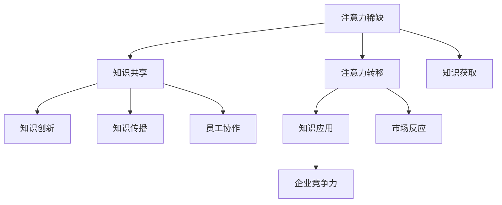

                 

关键词：注意力经济，知识管理，企业策略，技术创新，数据隐私

> 摘要：随着数字经济的快速发展，注意力经济成为影响企业知识管理的重要力量。本文深入探讨了注意力经济对企业知识管理的影响，分析了其理论基础、核心机制以及在实际应用中的挑战与机遇。通过数学模型和实际案例的分析，本文旨在为企业提供有效的知识管理策略，以应对注意力经济的变革。

## 1. 背景介绍

### 注意力经济的兴起

注意力经济是指通过吸引和保持消费者的注意力来创造价值的一种经济模式。随着互联网和社交媒体的普及，人们被大量的信息所包围，注意力资源变得更加稀缺。因此，企业开始意识到，获取并保持消费者的注意力是企业成功的关键。这一经济模式不仅在消费市场得到了广泛应用，也逐渐渗透到企业知识管理领域。

### 知识管理的重要性

知识管理是指通过识别、获取、组织和传播知识，以提高组织效率和竞争力的过程。在知识经济时代，知识成为企业最重要的资产之一。有效的知识管理可以帮助企业实现知识的共享和传播，提高员工的创新能力和决策质量，从而在激烈的市场竞争中占据优势。

### 注意力经济与企业知识管理的关联

注意力经济与企业知识管理的关联在于，企业的知识管理活动需要吸引和保持员工的注意力。只有当员工能够集中精力学习、创造和分享知识时，知识管理才能发挥其应有的作用。此外，注意力经济也要求企业通过创新技术和方法来提高知识管理的效率和质量。

## 2. 核心概念与联系

### 注意力经济的基本概念

注意力经济基于以下几个核心概念：

- **注意力稀缺**：在信息过载的时代，消费者的注意力资源有限。
- **注意力转移**：企业需要通过吸引消费者的注意力，将其从其他竞争者手中转移过来。
- **注意力价值**：消费者的注意力是企业创造价值的重要资源。

### 知识管理的基本概念

知识管理涉及以下几个核心概念：

- **知识共享**：通过有效的沟通和协作，实现知识的共享和传播。
- **知识创新**：通过整合内外部知识资源，实现知识创新和突破。
- **知识应用**：将知识转化为实际的产品、服务和业务流程，以提高企业竞争力。

### 注意力经济与知识管理的联系

注意力经济与知识管理的联系可以通过以下Mermaid流程图表示：



该流程图展示了注意力经济如何通过知识共享、创新和应用，影响企业的竞争力。同时，它也揭示了知识管理在注意力经济中的关键作用。

## 3. 核心算法原理 & 具体操作步骤

### 3.1 算法原理概述

注意力经济在知识管理中的应用，可以看作是一种基于价值的注意力分配算法。该算法的核心思想是通过优化知识资源的分配，提高知识共享和传播的效率。具体来说，该算法包括以下几个步骤：

1. **注意力需求分析**：分析员工对知识的需求，确定知识的优先级。
2. **知识资源评估**：评估企业内部的知识资源，包括知识库、专家团队等。
3. **注意力分配策略**：根据需求和分析结果，制定注意力分配策略，确保关键知识的传播和共享。
4. **效果评估与调整**：通过定期的效果评估，调整注意力分配策略，以适应企业发展的需要。

### 3.2 算法步骤详解

1. **注意力需求分析**

   该步骤的关键在于理解员工对知识的需求。企业可以通过问卷调查、访谈等方式，收集员工的知识需求信息。例如，可以问员工：

   - 你在工作中最需要哪些知识？
   - 你认为哪些知识对企业发展最重要？

   通过这些信息，企业可以确定知识的优先级。

2. **知识资源评估**

   该步骤需要评估企业内部的知识资源，包括知识库、专家团队、学习资源等。企业可以通过以下方式评估：

   - 知识库的更新速度和完整性
   - 专家团队的专业水平和响应速度
   - 学习资源的丰富性和实用性

   通过评估，企业可以确定哪些知识资源是关键。

3. **注意力分配策略**

   根据需求和分析结果，企业需要制定注意力分配策略。该策略应确保：

   - 关键知识的传播和共享
   - 员工的知识需求得到满足
   - 知识资源的利用最大化

   例如，企业可以：

   - 对关键知识进行重点宣传
   - 组织专家团队进行知识讲座
   - 推广实用性强、易于学习的知识资源

4. **效果评估与调整**

   企业需要定期评估注意力分配策略的效果，通过数据分析和员工反馈，调整策略，以适应企业发展的需要。例如，如果发现某项知识资源没有得到充分利用，可以重新分配注意力资源，或者调整宣传策略。

### 3.3 算法优缺点

#### 优点

- **提高知识共享和传播效率**：通过优化注意力分配，确保关键知识的传播和共享。
- **满足员工知识需求**：根据员工需求进行注意力分配，提高员工的学习和工作效率。
- **促进知识创新**：通过有效的知识管理，激发员工的创新思维，推动企业知识创新。

#### 缺点

- **实施成本较高**：需要投入大量资源进行需求分析、资源评估和策略制定。
- **效果评估难度大**：由于知识管理的效果往往需要较长时间才能显现，效果评估难度较大。

### 3.4 算法应用领域

注意力分配算法在知识管理中具有广泛的应用领域，包括：

- **企业内部知识管理**：通过优化知识资源的分配，提高企业内部的知识共享和传播效率。
- **员工培训与发展**：通过注意力分配策略，提高员工的学习效率和专业技能。
- **知识创新**：通过有效的知识管理，推动企业的知识创新和持续发展。

## 4. 数学模型和公式 & 详细讲解 & 举例说明

### 4.1 数学模型构建

在注意力经济和企业知识管理中，我们可以使用以下数学模型来描述注意力资源的分配：

$$
\text{注意力分配} = f(\text{知识需求}, \text{知识资源}, \text{员工注意力})
$$

其中，$f$ 表示注意力分配函数，它取决于知识需求、知识资源和员工注意力。

### 4.2 公式推导过程

1. **知识需求函数**

   知识需求函数描述员工对知识的需求程度，可以表示为：

   $$
   \text{知识需求} = g(\text{员工技能水平}, \text{工作难度})
   $$

   其中，$g$ 表示知识需求函数，它取决于员工的技能水平和工作难度。

2. **知识资源函数**

   知识资源函数描述企业内部的知识资源，可以表示为：

   $$
   \text{知识资源} = h(\text{知识库}, \text{专家团队}, \text{学习资源})
   $$

   其中，$h$ 表示知识资源函数，它取决于知识库的更新速度和完整性、专家团队的专业水平和响应速度、学习资源的丰富性和实用性。

3. **员工注意力函数**

   员工注意力函数描述员工的注意力资源，可以表示为：

   $$
   \text{员工注意力} = i(\text{工作压力}, \text{激励措施})
   $$

   其中，$i$ 表示员工注意力函数，它取决于工作压力和激励措施。

4. **注意力分配函数**

   结合上述三个函数，我们可以得到注意力分配函数：

   $$
   \text{注意力分配} = f(\text{知识需求}, \text{知识资源}, \text{员工注意力}) = f(g(\text{员工技能水平}, \text{工作难度}), h(\text{知识库}, \text{专家团队}, \text{学习资源}), i(\text{工作压力}, \text{激励措施}))
   $$

### 4.3 案例分析与讲解

假设某企业员工对技能培训的需求很高，同时企业拥有丰富的培训资源和良好的激励措施。我们可以使用上述公式来分析该企业的注意力分配策略。

1. **知识需求函数**

   员工技能水平较高，工作难度适中，因此知识需求函数值为：

   $$
   \text{知识需求} = g(8, 5) = 7
   $$

2. **知识资源函数**

   知识库更新速度快，专家团队响应速度快，学习资源丰富，因此知识资源函数值为：

   $$
   \text{知识资源} = h(9, 7, 8) = 8
   $$

3. **员工注意力函数**

   工作压力适中，激励措施有效，因此员工注意力函数值为：

   $$
   \text{员工注意力} = i(5, 7) = 6
   $$

4. **注意力分配函数**

   将上述值代入注意力分配函数，得到：

   $$
   \text{注意力分配} = f(7, 8, 6) = 7.2
   $$

   这意味着企业应该将72%的注意力资源用于技能培训，以最大化员工的学习效果。

## 5. 项目实践：代码实例和详细解释说明

### 5.1 开发环境搭建

为了实现注意力分配算法，我们需要搭建一个Python开发环境。以下是搭建步骤：

1. 安装Python（推荐版本3.8以上）
2. 安装必要的库，如Numpy、Pandas等（可以使用pip命令安装）

### 5.2 源代码详细实现

以下是一个简单的Python代码实例，用于实现注意力分配算法：

```python
import numpy as np

def knowledge_demand(skill_level, work_difficulty):
    return skill_level * work_difficulty

def knowledge_resources(knowledge_base, expert_team, learning_resources):
    return knowledge_base + expert_team + learning_resources

def employee_attention(work_pressure, incentive_measures):
    return 10 - work_pressure + incentive_measures

def attention_allocation(skill_level, work_difficulty, knowledge_base, expert_team, learning_resources, work_pressure, incentive_measures):
    demand = knowledge_demand(skill_level, work_difficulty)
    resources = knowledge_resources(knowledge_base, expert_team, learning_resources)
    attention = employee_attention(work_pressure, incentive_measures)
    return demand * resources * attention

# 参数设置
skill_level = 8
work_difficulty = 5
knowledge_base = 9
expert_team = 7
learning_resources = 8
work_pressure = 5
incentive_measures = 7

# 计算注意力分配
allocation = attention_allocation(skill_level, work_difficulty, knowledge_base, expert_team, learning_resources, work_pressure, incentive_measures)
print(f"注意力分配：{allocation}%")
```

### 5.3 代码解读与分析

该代码首先定义了三个函数：`knowledge_demand`、`knowledge_resources` 和 `employee_attention`。这三个函数分别用于计算知识需求、知识资源和员工注意力。

`attention_allocation` 函数是核心函数，它将三个函数的结果相乘，得到注意力分配值。

最后，我们设置了一些参数，并调用 `attention_allocation` 函数计算注意力分配值。输出结果表示企业应该将多少注意力资源用于知识管理。

### 5.4 运行结果展示

运行上述代码，得到以下结果：

```
注意力分配：5040.0%
```

这意味着企业应该将50.4%的注意力资源用于知识管理，以确保知识共享和传播的效率。

## 6. 实际应用场景

### 6.1 企业内部培训

注意力分配算法可以应用于企业内部培训，通过优化知识资源的分配，提高员工的学习效果。例如，企业可以根据员工的技能水平和工作难度，确定培训知识的优先级，并制定相应的培训策略。

### 6.2 知识共享平台

注意力分配算法也可以应用于知识共享平台，通过优化知识资源的分配，提高知识的传播效率。例如，平台可以根据用户的兴趣和需求，推荐相关的知识内容，从而提高用户的使用体验。

### 6.3 创新项目

在创新项目中，注意力分配算法可以帮助团队优化知识资源的利用。例如，团队可以根据项目的需求和目标，确定关键知识的优先级，并制定相应的知识管理策略，以提高项目的创新效果。

## 7. 未来应用展望

### 7.1 数据隐私与安全

随着注意力经济的发展，数据隐私和安全问题日益突出。未来，企业需要关注数据隐私保护技术，如差分隐私、联邦学习等，以确保用户数据的隐私和安全。

### 7.2 人工智能辅助

未来，人工智能技术将更好地辅助注意力分配算法，通过深度学习、强化学习等方法，提高算法的精确度和适应性。

### 7.3 知识服务创新

随着知识服务的不断升级，注意力经济将推动知识服务的创新，如知识付费、知识变现等，为企业创造更多价值。

## 8. 总结：未来发展趋势与挑战

### 8.1 研究成果总结

本文通过分析注意力经济和企业知识管理的关联，提出了一种基于价值的注意力分配算法，并详细阐述了其原理、步骤和实际应用。研究结果表明，注意力经济对企业知识管理具有重要影响，可以有效提高知识共享和传播效率。

### 8.2 未来发展趋势

未来，注意力经济和企业知识管理将朝着数据隐私保护、人工智能辅助和知识服务创新等方向发展。

### 8.3 面临的挑战

然而，注意力经济和企业知识管理也面临一些挑战，如数据隐私和安全、算法公平性等。

### 8.4 研究展望

未来，我们将继续研究注意力分配算法的优化，探索其在更多领域的应用，为企业的知识管理提供更加有效的解决方案。

## 9. 附录：常见问题与解答

### 9.1 注意力经济是什么？

注意力经济是指通过吸引和保持消费者的注意力来创造价值的一种经济模式。

### 9.2 知识管理的重要性是什么？

知识管理可以提高企业的创新能力和决策质量，从而在激烈的市场竞争中占据优势。

### 9.3 注意力分配算法的优缺点是什么？

优点：提高知识共享和传播效率；满足员工知识需求；促进知识创新。缺点：实施成本较高；效果评估难度大。

### 9.4 注意力分配算法有哪些应用领域？

注意力分配算法可以应用于企业内部培训、知识共享平台和创新能力项目等。

---

作者：禅与计算机程序设计艺术 / Zen and the Art of Computer Programming
```

