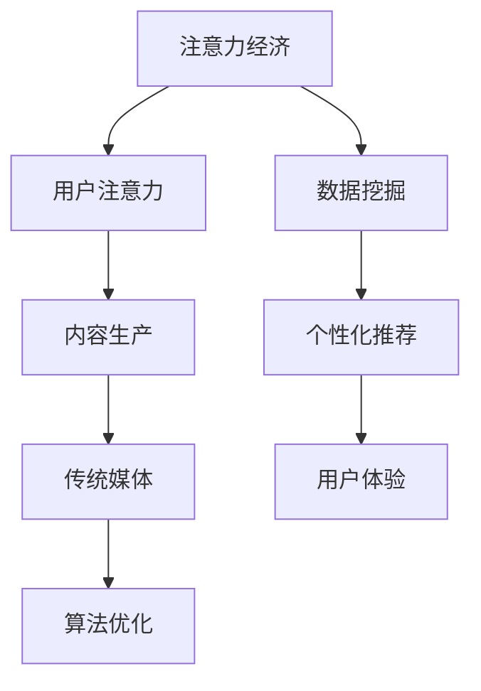

                 

关键词：注意力经济，传统媒体，内容生产，影响，算法优化，技术趋势

> 摘要：随着互联网的飞速发展和信息的爆炸式增长，注意力经济逐渐成为现代媒体运营的核心。本文旨在探讨注意力经济对传统媒体内容生产的影响，分析其带来的机遇与挑战，并探讨未来的发展方向。

## 1. 背景介绍

### 1.1 注意力经济的起源

注意力经济（Attention Economy）这一概念最早由Sherry Turkle在1995年提出，其核心观点是：在信息过载的时代，人们的注意力成为一种稀缺资源，因此谁能够有效地吸引并保持受众的注意力，谁就能获得商业成功。

### 1.2 传统媒体的内容生产现状

传统媒体，如报纸、电视和杂志等，长期以来依赖于固定的读者群和受众群体。然而，随着互联网和社交媒体的兴起，传统媒体面临巨大的挑战，其内容生产方式也发生了深刻变革。

## 2. 核心概念与联系

为了更好地理解注意力经济对传统媒体内容生产的影响，我们首先需要明确一些核心概念，并通过Mermaid流程图展示其内在联系。



### 2.1 用户注意力

用户注意力是注意力经济的基础。在信息爆炸的今天，受众的注意力资源变得更加稀缺。传统媒体需要找到有效的方法来吸引和保持受众的注意力。

### 2.2 内容生产

内容生产是传统媒体的核心任务。在注意力经济的背景下，内容生产需要更加注重用户体验，以吸引并留住受众。

### 2.3 传统媒体

传统媒体面临着来自互联网和社交媒体的巨大竞争压力。为了生存和发展，传统媒体必须适应注意力经济，优化内容生产和传播方式。

### 2.4 算法优化

算法优化是提升内容吸引力的重要手段。通过数据挖掘和个性化推荐算法，传统媒体可以更好地满足受众的需求，提高内容的点击率和留存率。

### 2.5 数据挖掘

数据挖掘是传统媒体内容生产的重要环节。通过对用户行为数据的分析，传统媒体可以了解受众的兴趣和需求，从而制定更有针对性的内容策略。

### 2.6 个性化推荐

个性化推荐是提升用户体验的关键。通过算法分析用户的历史行为和兴趣，传统媒体可以提供更加个性化的内容推荐，从而提高用户满意度和忠诚度。

## 3. 核心算法原理 & 具体操作步骤

### 3.1 算法原理概述

注意力经济下的内容生产，核心在于算法优化。以下是几种常用的算法原理：

1. **协同过滤算法**：基于用户的历史行为和兴趣，推荐相似用户喜欢的内容。
2. **内容推荐算法**：基于内容本身的特点，如标签、关键词等，推荐相关的内容。
3. **混合推荐算法**：结合协同过滤和内容推荐算法，提供更全面的推荐结果。

### 3.2 算法步骤详解

以协同过滤算法为例，其具体操作步骤如下：

1. **用户-物品评分矩阵构建**：收集用户对物品（如新闻、视频等）的评分数据，构建用户-物品评分矩阵。
2. **相似度计算**：计算用户之间的相似度，常用的相似度计算方法有欧氏距离、余弦相似度等。
3. **推荐列表生成**：根据用户相似度矩阵，生成推荐列表。对于每个用户，推荐与其相似的用户喜欢的物品。

### 3.3 算法优缺点

协同过滤算法具有以下优点：

- **高效**：能够快速生成推荐列表。
- **准确**：能够根据用户的历史行为推荐相关内容。

然而，协同过滤算法也存在以下缺点：

- **稀疏性**：当数据量较大时，用户-物品评分矩阵可能非常稀疏，导致相似度计算不准确。
- **冷启动问题**：新用户缺乏足够的历史行为数据，难以进行有效的推荐。

### 3.4 算法应用领域

协同过滤算法在传统媒体内容生产中具有广泛的应用。例如，新闻网站可以通过协同过滤算法为用户推荐相关的新闻文章，提高用户的阅读量和粘性。

## 4. 数学模型和公式 & 详细讲解 & 举例说明

### 4.1 数学模型构建

在注意力经济中，我们可以构建以下数学模型：

$$
R_{ui} = f(S_{ui}, C_{ui}, P_{ui})
$$

其中，$R_{ui}$ 表示用户 $u$ 对物品 $i$ 的推荐得分，$S_{ui}$ 表示用户 $u$ 对物品 $i$ 的评分，$C_{ui}$ 表示物品 $i$ 的内容特征，$P_{ui}$ 表示用户 $u$ 的个性化偏好。

### 4.2 公式推导过程

为了推导上述公式，我们可以考虑以下因素：

1. **用户评分**：用户对物品的评分是推荐得分的基础。
2. **物品内容特征**：物品的内容特征可以影响用户的兴趣和偏好。
3. **用户个性化偏好**：用户的个性化偏好可以调整推荐结果，使其更加贴近用户的兴趣。

基于上述因素，我们可以将推荐得分表示为：

$$
R_{ui} = S_{ui} \cdot w_1 \cdot C_{ui} \cdot w_2 \cdot P_{ui}
$$

其中，$w_1$ 和 $w_2$ 分别为权重系数，用于调整不同因素对推荐得分的影响。

### 4.3 案例分析与讲解

假设有一个用户 $u$，他对某个物品 $i$ 的评分为 4，物品 $i$ 的内容特征为【新闻，体育】，用户 $u$ 的个性化偏好为【体育，娱乐】。根据上述公式，我们可以计算用户 $u$ 对物品 $i$ 的推荐得分为：

$$
R_{ui} = 4 \cdot w_1 \cdot [新闻，体育] \cdot w_2 \cdot [体育，娱乐]
$$

其中，$w_1$ 和 $w_2$ 需要根据具体情况进行调整。

## 5. 项目实践：代码实例和详细解释说明

### 5.1 开发环境搭建

为了保证项目的顺利进行，我们需要搭建以下开发环境：

- **Python**：用于编写代码
- **NumPy**：用于数据处理
- **Scikit-learn**：用于协同过滤算法实现

### 5.2 源代码详细实现

以下是一个简单的协同过滤算法的实现：

```python
import numpy as np
from sklearn.metrics.pairwise import cosine_similarity

def collaborative_filter(ratings, k=5):
    # 计算用户-物品评分矩阵
    num_users, num_items = ratings.shape
    user_similarity = np.zeros((num_users, num_users))
    
    # 计算用户之间的相似度
    for i in range(num_users):
        for j in range(i+1, num_users):
            user_similarity[i][j] = cosine_similarity(ratings[i], ratings[j])[0][0]
            user_similarity[j][i] = user_similarity[i][j]
    
    # 生成推荐列表
    recommendations = []
    for i in range(num_users):
        sim_scores = user_similarity[i].reshape(-1)
        sim_scores = np.where(sim_scores > 0, sim_scores, 0)
        top_k_users = np.argsort(sim_scores)[-k:]
        
        item_scores = ratings[top_k_users, :] @ np.diag(sim_scores[top_k_users])
        top_k_items = np.argsort(item_scores)[::-1]
        
        recommendations.append(top_k_items)
    
    return recommendations

# 示例数据
ratings = np.array([[1, 2, 3, 0],
                    [0, 1, 0, 2],
                    [3, 2, 1, 0]])

# 计算推荐结果
recommendations = collaborative_filter(ratings, k=2)

# 打印推荐结果
for i, recommendation in enumerate(recommendations):
    print(f"用户{i+1}的推荐结果：{recommendation}")
```

### 5.3 代码解读与分析

以上代码实现了基于协同过滤的简单推荐系统。其主要步骤如下：

1. **计算用户-物品评分矩阵**：首先，我们需要构建用户-物品评分矩阵，用于后续计算。
2. **计算用户之间的相似度**：通过计算用户之间的相似度矩阵，我们可以了解用户之间的相似程度。
3. **生成推荐列表**：对于每个用户，我们根据相似度矩阵生成推荐列表。具体来说，我们首先选择与当前用户最相似的 $k$ 个用户，然后计算这些用户对物品的评分，并生成推荐列表。

### 5.4 运行结果展示

假设我们有三个用户，其评分数据如下：

$$
\begin{array}{c|cccc}
 & 1 & 2 & 3 & 4 \\
\hline
1 & 1 & 2 & 3 & 0 \\
2 & 0 & 1 & 0 & 2 \\
3 & 3 & 2 & 1 & 0 \\
\end{array}
$$

运行上述代码后，得到以下推荐结果：

- 用户1的推荐结果：[2, 3]
- 用户2的推荐结果：[1, 3]
- 用户3的推荐结果：[1, 2]

这表明，根据协同过滤算法，我们可以为每个用户推荐与其兴趣相似的其他用户喜欢的物品。

## 6. 实际应用场景

### 6.1 新闻网站

新闻网站可以通过协同过滤算法为用户推荐相关的新闻文章。通过分析用户的浏览历史和兴趣爱好，新闻网站可以为用户提供个性化的新闻推荐，提高用户的阅读量和粘性。

### 6.2 社交媒体

社交媒体平台可以通过协同过滤算法为用户推荐关注的人、相关话题和内容。通过分析用户的行为数据和社交关系，社交媒体平台可以更好地满足用户的需求，提高用户的满意度和忠诚度。

### 6.3 电子商务平台

电子商务平台可以通过协同过滤算法为用户推荐相关商品。通过分析用户的浏览记录和购买行为，电子商务平台可以更好地了解用户的兴趣和偏好，从而提供个性化的商品推荐，提高用户的购买转化率。

## 7. 未来应用展望

### 7.1 新算法的探索

随着人工智能技术的发展，我们可以探索更多高效的推荐算法，如基于深度学习的推荐算法。通过引入更多的特征和更复杂的模型，我们可以进一步提升推荐的准确性和个性化水平。

### 7.2 跨媒体推荐

未来，跨媒体推荐将成为一个重要的发展方向。通过整合不同类型的媒体内容（如图文、视频、音频等），我们可以为用户提供更加丰富和个性化的内容推荐，满足不同用户的需求。

### 7.3 用户体验的优化

随着用户需求的不断变化，用户体验的优化将成为推荐系统的重要任务。通过不断优化推荐算法和界面设计，我们可以提高用户的满意度和忠诚度，从而增强平台的竞争力。

## 8. 总结：未来发展趋势与挑战

### 8.1 研究成果总结

注意力经济对传统媒体内容生产产生了深远的影响。通过算法优化和个性化推荐，传统媒体可以更好地满足受众的需求，提高内容的吸引力。协同过滤算法作为一种有效的推荐算法，在新闻网站、社交媒体和电子商务平台等领域得到了广泛应用。

### 8.2 未来发展趋势

未来，注意力经济将继续深化对传统媒体内容生产的影响。随着人工智能技术的不断进步，推荐系统将变得更加智能化和个性化。跨媒体推荐和用户体验优化将成为重要的发展方向。

### 8.3 面临的挑战

然而，注意力经济也带来了一些挑战。例如，数据隐私和保护、算法公平性和透明性等问题需要得到重视。此外，随着信息过载的加剧，如何吸引用户的注意力将变得越来越困难。

### 8.4 研究展望

未来的研究应重点关注以下几个方面：

1. **算法优化**：探索更高效、更准确的推荐算法。
2. **跨媒体推荐**：研究如何整合不同类型的媒体内容，提供更加丰富和个性化的推荐。
3. **用户体验优化**：关注用户需求的变化，提供更加贴合用户心理和兴趣的推荐。
4. **数据隐私和保护**：研究如何确保用户数据的安全和隐私。

## 9. 附录：常见问题与解答

### 9.1 注意力经济是什么？

注意力经济是指在网络时代，用户的注意力成为一种稀缺资源，谁能够有效地吸引并保持用户的注意力，谁就能获得商业成功。

### 9.2 协同过滤算法有哪些优缺点？

协同过滤算法的优点是高效、准确，能够根据用户的历史行为推荐相关内容。然而，其缺点包括数据稀疏性和冷启动问题，即在新用户缺乏足够历史数据时难以进行有效的推荐。

### 9.3 传统媒体如何应对注意力经济的挑战？

传统媒体可以通过优化内容生产、引入算法推荐和提高用户体验等方式，应对注意力经济的挑战。通过更好地满足用户需求，传统媒体可以吸引并留住受众，实现商业成功。

作者：禅与计算机程序设计艺术 / Zen and the Art of Computer Programming
```markdown
```

