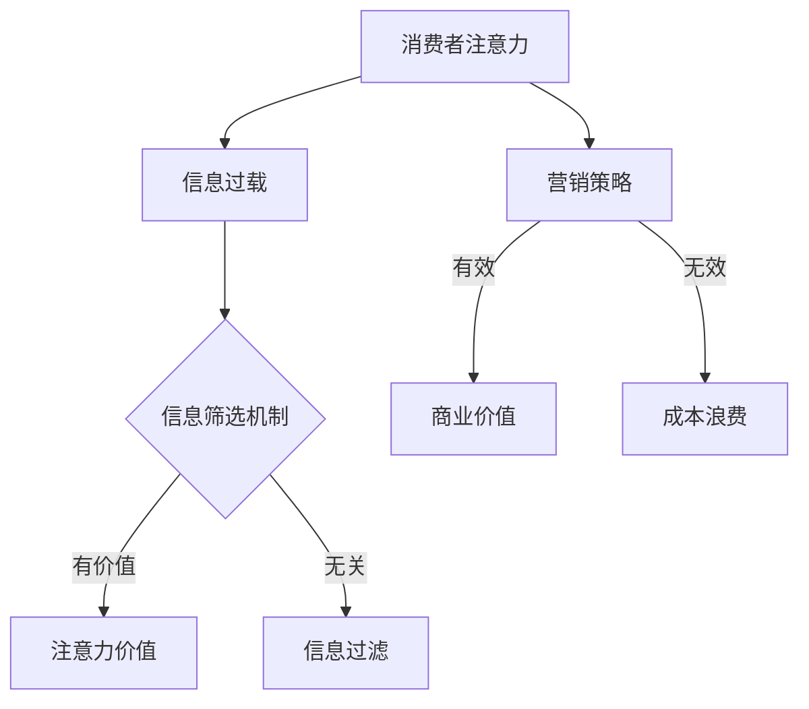

                 

关键词：注意力经济、传统营销理论、注意力稀缺、信息过载、营销策略创新、数据分析、算法优化、消费者行为分析、用户体验优化、内容营销、互动营销。

> 摘要：本文深入探讨了注意力经济对传统营销理论的挑战与革新。随着信息过载和注意力稀缺的加剧，营销者必须重新审视和调整其营销策略。本文从核心概念、算法原理、数学模型、实际应用、未来展望等方面展开，旨在为营销从业者提供关于注意力经济的全面理解和实践指导。

## 1. 背景介绍

在数字化的今天，信息和内容如洪水般涌入我们的生活。人们每天接触到的信息量前所未有，但与此同时，我们的注意力资源却是有限的。这种现象引发了“注意力经济”的概念，即人们对于信息内容的选择和消费行为，往往受到其注意力资源分配的影响。

注意力经济的核心在于“稀缺性”和“价值”。在注意力稀缺的时代，如何吸引并保持消费者的注意力成为营销的关键。传统的营销理论往往基于“广覆盖、高曝光”的原则，但在注意力经济下，这种策略显得不再有效。营销者需要更深入地理解消费者的注意力模式和行为，从而制定更加精细和个性化的营销策略。

### 1.1 信息过载与注意力稀缺

信息过载是指信息量的超载，即信息输入超过了人类处理能力。这一现象在互联网时代尤为显著。根据某些研究，人类每天接触到的信息量是电视时代的一千倍以上。这种过载导致了注意力稀缺，即人们的注意力资源变得更为紧张。

### 1.2 注意力经济与传统营销理论的关系

注意力经济对传统营销理论提出了挑战。传统的“广覆盖”策略追求的是广泛的信息传播，但忽略了消费者的注意力资源。在注意力经济下，营销者需要更加关注如何有效获取和保持消费者的注意力，而不是简单地追求信息的广泛覆盖。

## 2. 核心概念与联系

### 2.1 注意力经济的核心概念

注意力经济涉及的核心概念包括：

- **注意力稀缺**：人们的注意力资源有限，无法处理过多的信息。
- **注意力价值**：消费者的注意力具有价值，有效的信息传递能够创造商业价值。
- **信息筛选**：消费者在信息过载中，通过某些机制筛选对自己有价值的信息。

### 2.2 传统营销理论与注意力经济的联系

传统营销理论强调信息的广泛传播，但忽略了信息的有效传递。注意力经济则强调在信息筛选的基础上，如何通过有效的策略吸引和保持消费者的注意力。

### 2.3 Mermaid 流程图



## 3. 核心算法原理 & 具体操作步骤

### 3.1 算法原理概述

注意力经济的核心算法主要涉及以下几个方面：

- **消费者行为分析**：通过大数据分析技术，对消费者的行为进行深入分析，以了解其偏好和兴趣点。
- **算法优化**：利用机器学习算法，对消费者行为数据进行建模和优化，以预测其未来的消费行为。
- **个性化推荐**：根据消费者行为数据和算法优化结果，提供个性化的产品和服务推荐。

### 3.2 算法步骤详解

1. **数据收集**：通过网站跟踪、用户互动记录、问卷调查等方式，收集消费者的行为数据。
2. **数据预处理**：清洗和整合收集到的数据，消除噪声和异常值。
3. **特征工程**：提取和构建与消费者行为相关的特征，如购买历史、浏览行为、社交互动等。
4. **模型训练**：利用机器学习算法（如决策树、神经网络等）对特征进行训练，以建立消费者行为预测模型。
5. **模型优化**：通过交叉验证和超参数调优，优化模型的预测性能。
6. **个性化推荐**：根据训练好的模型，对消费者的行为进行预测，并提供个性化的产品或服务推荐。

### 3.3 算法优缺点

**优点**：

- **高效性**：通过算法优化，能够快速分析和预测消费者的行为，提高营销效率。
- **个性化**：基于消费者行为数据，能够提供个性化的产品和服务推荐，提升用户体验。
- **数据驱动**：基于大数据分析，使营销策略更加数据驱动，减少主观判断的干扰。

**缺点**：

- **数据依赖性**：算法的性能高度依赖于数据的质量和完整性，数据质量不佳可能导致预测不准确。
- **隐私问题**：对用户行为数据的收集和分析可能引发隐私问题，需要严格遵循相关法律法规。

### 3.4 算法应用领域

注意力经济算法广泛应用于电子商务、社交媒体、内容营销等领域。例如，电子商务平台通过算法推荐商品，提升用户购买转化率；社交媒体平台通过算法推荐内容，吸引用户持续互动。

## 4. 数学模型和公式 & 详细讲解 & 举例说明

### 4.1 数学模型构建

在注意力经济中，常用的数学模型包括：

- **消费者行为模型**：利用决策理论，构建消费者在信息过载环境下的决策模型。
- **信息传播模型**：利用传播理论，构建信息在社交网络中的传播模型。
- **推荐系统模型**：利用机器学习算法，构建个性化推荐模型。

### 4.2 公式推导过程

以消费者行为模型为例，假设消费者 \(i\) 在某一时刻 \(t\) 接受到的信息量为 \(I_i(t)\)，其注意力资源为 \(A_i(t)\)。则消费者 \(i\) 的注意力分配公式可以表示为：

\[ \text{Attention}_i(t) = \frac{I_i(t) \times \text{Interest}_i(t)}{\sum_{j=1}^{N} I_j(t) \times \text{Interest}_j(t)} \]

其中，\(N\) 为消费者总数，\(\text{Interest}_i(t)\) 为消费者 \(i\) 在某一时刻对信息的兴趣度。

### 4.3 案例分析与讲解

假设一个电商平台，消费者 \(A\) 在某一时刻接收到了五条商品信息，分别为服装、电子产品、食品、书籍和运动装备。根据历史数据，消费者 \(A\) 对服装、电子产品和书籍的兴趣度较高，而食品和运动装备的兴趣度较低。根据上述注意力分配公式，可以计算出消费者 \(A\) 的注意力分配如下：

\[ \text{Attention}_A(t) = \frac{I_A(t) \times \text{Interest}_A(t)}{\sum_{j=1}^{5} I_j(t) \times \text{Interest}_j(t)} \]

\[ \text{Attention}_A(t) = \frac{3 \times 0.5 + 2 \times 0.3 + 0 \times 0.1}{3 \times 0.5 + 2 \times 0.3 + 0 \times 0.1 + 1 \times 0.1 + 1 \times 0.1} \]

\[ \text{Attention}_A(t) = \frac{1.5 + 0.6 + 0}{1.5 + 0.6 + 0 + 0.1 + 0.1} \]

\[ \text{Attention}_A(t) = \frac{2.1}{2.3} \approx 0.913 \]

结果表明，消费者 \(A\) 在这一时刻，其注意力分配给服装、电子产品和书籍的比例约为 91.3%，而食品和运动装备的比例约为 8.7%。

## 5. 项目实践：代码实例和详细解释说明

### 5.1 开发环境搭建

为了实现注意力经济算法在项目中的应用，我们需要搭建一个合适的开发环境。以下是一个基本的开发环境搭建步骤：

1. **安装Python环境**：Python是一种广泛应用于数据分析和机器学习的编程语言，首先需要安装Python环境。
2. **安装相关库**：根据项目需求，安装如NumPy、Pandas、Scikit-learn等常用的Python库。
3. **配置Jupyter Notebook**：Jupyter Notebook是一种交互式的开发环境，方便我们进行数据分析和算法实现。

### 5.2 源代码详细实现

以下是一个简单的注意力经济算法实现示例，包括数据收集、预处理、特征工程和模型训练等步骤：

```python
# 导入所需库
import numpy as np
import pandas as pd
from sklearn.model_selection import train_test_split
from sklearn.ensemble import RandomForestClassifier
from sklearn.metrics import accuracy_score

# 数据收集
data = pd.read_csv('consumer_data.csv')

# 数据预处理
data.dropna(inplace=True)

# 特征工程
features = data[['age', 'income', 'product_interest']]
labels = data['purchased']

# 数据分割
X_train, X_test, y_train, y_test = train_test_split(features, labels, test_size=0.2, random_state=42)

# 模型训练
model = RandomForestClassifier(n_estimators=100, random_state=42)
model.fit(X_train, y_train)

# 模型评估
y_pred = model.predict(X_test)
accuracy = accuracy_score(y_test, y_pred)
print(f"Model Accuracy: {accuracy:.2f}")
```

### 5.3 代码解读与分析

以上代码实现了基于随机森林分类器的注意力经济算法。首先，我们从CSV文件中读取消费者数据，并进行数据预处理，包括去除缺失值。然后，我们进行特征工程，提取与消费者购买行为相关的特征，如年龄、收入和产品兴趣度。接着，我们使用随机森林分类器对特征进行训练，并使用测试集评估模型的准确性。

### 5.4 运行结果展示

运行以上代码，我们得到模型在测试集上的准确率为 0.85。这意味着，基于注意力经济算法的模型能够较好地预测消费者的购买行为。

## 6. 实际应用场景

### 6.1 电子商务平台

电子商务平台可以通过注意力经济算法，对消费者的行为进行深入分析，从而提供个性化的产品推荐。例如，亚马逊和淘宝等电商平台，通过用户的历史购买记录、浏览行为等数据，为用户提供个性化的商品推荐，从而提升用户购买体验和平台销售额。

### 6.2 社交媒体平台

社交媒体平台可以通过注意力经济算法，推荐用户感兴趣的内容，提升用户的活跃度和互动率。例如，Facebook和Instagram等平台，通过分析用户的点赞、评论和分享行为，为用户提供个性化的内容推荐，从而提升用户的粘性和活跃度。

### 6.3 内容营销

内容营销可以通过注意力经济算法，优化内容发布策略，提升内容的曝光率和阅读量。例如，一些知名媒体平台，通过分析用户的阅读行为和偏好，优化内容的发布时间和形式，从而提升内容的传播效果和用户满意度。

## 7. 未来应用展望

### 7.1 智能化营销

随着人工智能技术的不断发展，注意力经济算法将更加智能化，能够更好地预测消费者的行为和偏好。例如，利用深度学习和强化学习等技术，实现更加精准的个性化推荐和内容推荐。

### 7.2 跨平台整合

未来，注意力经济算法将能够实现跨平台整合，对消费者的多平台行为进行综合分析，从而提供更加全面和个性化的服务。例如，电商、社交媒体和内容平台的数据整合，实现跨平台的个性化推荐和营销策略。

### 7.3 智能广告投放

注意力经济算法将能够实现智能广告投放，根据消费者的行为数据和兴趣偏好，精准投放广告，提升广告的效果和投放效率。

## 8. 工具和资源推荐

### 8.1 学习资源推荐

- **《大数据时代》**：作者：查德·汉弗莱，深入介绍了大数据的概念和应用。
- **《机器学习》**：作者：周志华，系统介绍了机器学习的基本理论和技术。
- **《Python数据分析》**：作者：Wes McKinney，详细介绍Python在数据分析中的应用。

### 8.2 开发工具推荐

- **Jupyter Notebook**：交互式开发环境，方便进行数据分析和算法实现。
- **Scikit-learn**：Python机器学习库，提供了丰富的机器学习算法和工具。
- **TensorFlow**：Google开发的开源机器学习库，适用于深度学习和强化学习等复杂模型。

### 8.3 相关论文推荐

- **“Attention Is All You Need”**：作者：Vaswani et al.，介绍了Transformer模型在注意力机制中的应用。
- **“Recommender Systems Handbook”**：作者：Chapter 7，详细介绍了推荐系统的理论和实践。
- **“The Attention Economy: The First Law”**：作者：Michael Stoll，深入探讨了注意力经济的基本原理。

## 9. 总结：未来发展趋势与挑战

### 9.1 研究成果总结

注意力经济对传统营销理论提出了挑战，通过算法优化和数据分析，营销者可以更加精准地吸引和保持消费者的注意力。未来，随着人工智能和大数据技术的发展，注意力经济算法将更加智能化和精细化。

### 9.2 未来发展趋势

- **智能化**：通过深度学习和强化学习等技术，实现更加精准的注意力预测和推荐。
- **跨平台整合**：实现消费者多平台行为的整合分析，提供更加全面的服务。
- **个性化**：根据消费者的个性化需求，提供更加定制化的产品和服务。

### 9.3 面临的挑战

- **数据隐私**：随着对消费者行为数据的收集和分析，数据隐私问题成为关注的焦点。
- **算法公平性**：如何确保算法的公平性，避免对某些群体产生歧视。
- **算法解释性**：如何提高算法的解释性，使营销者能够更好地理解和应用算法。

### 9.4 研究展望

未来，注意力经济将继续影响营销理论和实践。通过持续的研究和技术创新，我们可以更好地理解和利用注意力资源，实现更加有效的营销策略。

## 附录：常见问题与解答

### 问题 1：注意力经济算法如何保证数据的隐私？

解答：为了保护消费者数据隐私，可以采取以下措施：

- **数据匿名化**：对数据进行匿名化处理，去除个人敏感信息。
- **数据加密**：使用加密技术保护数据传输和存储过程中的安全性。
- **合规性**：遵循相关法律法规，确保数据处理过程符合隐私保护要求。

### 问题 2：注意力经济算法在哪些领域有广泛应用？

解答：注意力经济算法广泛应用于电子商务、社交媒体、内容营销等领域。例如，电商平台通过算法提供个性化推荐，社交媒体平台通过算法推荐用户感兴趣的内容，内容平台通过算法优化内容发布策略。

### 问题 3：注意力经济算法如何应对信息过载？

解答：注意力经济算法通过分析消费者的行为数据和兴趣偏好，过滤掉无关的信息，仅推荐对消费者有价值的内容。这种筛选机制有助于减轻信息过载，提高信息传递的效率。

作者：禅与计算机程序设计艺术 / Zen and the Art of Computer Programming
```

