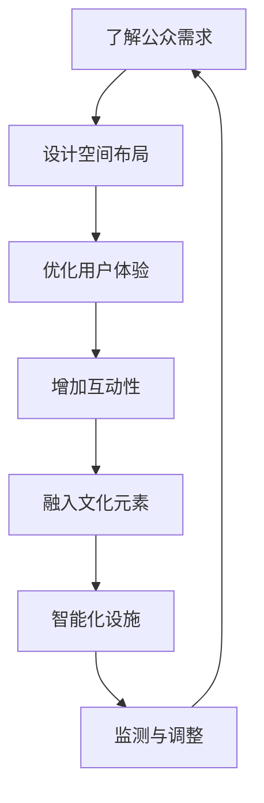

                 

注意力经济作为一种新的经济学概念，正逐渐渗透到城市公共空间的设计中，对其产生深远的影响。本文旨在探讨注意力经济如何影响城市公共空间的设计，以及这一新兴趋势对城市规划师和设计师提出的挑战和机遇。

## 关键词

- 注意力经济
- 城市公共空间
- 设计趋势
- 可持续发展
- 用户参与

## 摘要

注意力经济关注的是在信息过载时代，如何吸引和保持公众的注意力。本文首先回顾了注意力经济的基本原理，然后分析了其在城市公共空间设计中的应用。通过对几个实际案例的深入分析，本文提出了注意力经济对城市公共空间设计的具体影响，并探讨了这一趋势对城市规划师和设计师提出的新要求。

## 1. 背景介绍

### 1.1 注意力经济的基本概念

注意力经济最初由心理学家乔治·米勒在1956年提出，主要关注的是信息过载背景下，人们如何分配注意力。随着互联网的普及，注意力经济逐渐成为一种重要的经济模式。简单来说，注意力经济就是通过吸引和维持公众的注意力来创造经济价值。在数字时代，注意力成为了一种稀缺资源，谁能更好地吸引公众的注意力，谁就能在竞争中脱颖而出。

### 1.2 城市公共空间的重要性

城市公共空间是城市生活的重要组成部分，包括广场、公园、步行街等。这些空间不仅是市民日常生活的一部分，也是城市文化和社区活动的重要载体。有效的城市公共空间设计能够提升市民的生活质量，增强社区的凝聚力，甚至对城市经济发展产生积极影响。

## 2. 核心概念与联系

### 2.1 注意力经济在城市公共空间设计中的应用

注意力经济在城市公共空间设计中的应用主要体现在以下几个方面：

1. **用户体验优化**：设计师需要通过优化用户体验来吸引和保持公众的注意力。这包括空间布局、设施配置、景观设计等方面。
2. **互动性设计**：增加市民参与和互动性的设计，如设置互动装置、举办公共活动等，可以提高空间的吸引力和利用率。
3. **文化元素融入**：通过融入当地文化元素，如历史建筑、艺术装置等，可以增强空间的吸引力和独特性。
4. **智能化设施**：利用智能技术，如传感器、物联网等，可以实时监测公众的行为和需求，从而提供更加个性化的服务。

### 2.2 Mermaid 流程图

以下是一个简化的Mermaid流程图，展示了注意力经济在城市公共空间设计中的应用过程：



## 3. 核心算法原理 & 具体操作步骤

### 3.1 算法原理概述

注意力经济在城市公共空间设计中的核心算法原理主要涉及以下几个方面：

1. **用户行为分析**：通过数据收集和分析，了解公众的行为模式和使用习惯。
2. **空间优化**：根据用户行为数据，对空间布局和设施配置进行调整，以提升用户体验。
3. **互动性设计**：设计互动性强的设施和活动，以增加公众参与度。
4. **智能化监测**：利用智能技术，实时监测空间利用情况和公众需求，提供个性化服务。

### 3.2 算法步骤详解

1. **数据收集**：通过传感器、问卷等方式收集公众的移动、停留、使用等行为数据。
2. **数据分析**：利用数据挖掘和分析技术，提取出有用的信息，如用户偏好、高峰时段等。
3. **空间优化**：根据分析结果，对空间布局进行优化，如调整设施位置、增加座椅等。
4. **互动性设计**：设计互动性强的设施和活动，如设置互动屏幕、举办公共艺术表演等。
5. **智能化监测**：部署智能技术，如物联网设备、人脸识别等，实时监测空间利用情况和公众需求。

### 3.3 算法优缺点

**优点**：

- 提升用户体验：通过优化空间布局和互动性设计，提升公众对公共空间的满意度。
- 提高资源利用率：通过智能化监测和优化，提高公共空间的利用效率。
- 增强社区凝聚力：通过增加公众参与，增强社区成员之间的互动和联系。

**缺点**：

- 数据隐私问题：大量用户数据收集和处理可能引发隐私泄露风险。
- 高成本：智能化设备和技术的应用需要大量的投资。

### 3.4 算法应用领域

注意力经济算法在城市公共空间设计中的应用非常广泛，包括但不限于以下领域：

- 公共公园和广场的设计与优化。
- 市政广场和步行街的设施配置和活动组织。
- 旅游景区的规划和运营。
- 商业街区的人流量管理和活动策划。

## 4. 数学模型和公式 & 详细讲解 & 举例说明

### 4.1 数学模型构建

注意力经济在城市公共空间设计中的数学模型主要涉及以下几个方面：

1. **用户行为模型**：利用马尔可夫链模型、随机游走模型等，描述用户的移动和停留行为。
2. **空间利用模型**：利用排队论模型、泊松过程等，分析公共空间的利用效率和需求预测。
3. **互动性模型**：利用博弈论模型、协同过滤算法等，设计互动性设施和活动。

### 4.2 公式推导过程

以用户行为模型为例，假设用户在公共空间中的移动服从马尔可夫链模型，状态转移概率矩阵为 \(P\)，则用户在时刻 \(t\) 处于状态 \(i\) 的概率可以表示为：

\[ P(X_t = i) = \sum_{j} P(X_{t-1} = j)P(j \rightarrow i) \]

其中，\(X_t\) 表示用户在时刻 \(t\) 的状态，\(P(j \rightarrow i)\) 表示从状态 \(j\) 转移到状态 \(i\) 的概率。

### 4.3 案例分析与讲解

以下是一个简单的案例，假设在一个公园中，有四个主要活动区域：A区（运动场）、B区（花园）、C区（儿童游乐场）和D区（停车场）。通过数据收集和分析，发现用户在不同区域之间的转移概率矩阵为：

\[ P = \begin{bmatrix}
0.2 & 0.3 & 0.2 & 0.3 \\
0.25 & 0.25 & 0.25 & 0.25 \\
0.15 & 0.35 & 0.25 & 0.15 \\
0.2 & 0.2 & 0.25 & 0.35 \\
\end{bmatrix} \]

根据这个矩阵，我们可以计算出用户在各个区域的停留概率。例如，用户在A区的停留概率为：

\[ P(A) = \sum_{j} P(X_{t-1} = j)P(j \rightarrow A) \]

\[ P(A) = 0.2 \times 0.2 + 0.3 \times 0.25 + 0.2 \times 0.15 + 0.3 \times 0.2 \]

\[ P(A) = 0.26 \]

这意味着，在任意时刻，用户有26%的概率停留在A区。类似地，我们可以计算出其他区域的停留概率。

## 5. 项目实践：代码实例和详细解释说明

### 5.1 开发环境搭建

为了更好地理解和应用注意力经济算法，我们将使用Python编程语言进行实现。以下是一个简单的开发环境搭建步骤：

1. 安装Python（建议使用3.8及以上版本）。
2. 安装必要的库，如NumPy、Pandas、SciPy等。
3. 使用文本编辑器（如VSCode）编写Python代码。

### 5.2 源代码详细实现

以下是一个简单的用户行为分析模型实现：

```python
import numpy as np

# 用户转移概率矩阵
P = np.array([[0.2, 0.3, 0.2, 0.3],
              [0.25, 0.25, 0.25, 0.25],
              [0.15, 0.35, 0.25, 0.15],
              [0.2, 0.2, 0.25, 0.35]])

# 计算用户在各个区域的停留概率
def calculate_stay_probabilities(P):
    stay_probs = np.zeros(P.shape[0])
    for i in range(P.shape[0]):
        stay_probs[i] = np.sum(P[i])
    return stay_probs

# 输出结果
print("User stay probabilities:")
print(calculate_stay_probabilities(P))
```

### 5.3 代码解读与分析

这段代码首先定义了一个4x4的转移概率矩阵P，表示用户在不同区域之间的转移概率。然后，我们定义了一个函数calculate\_stay\_probabilities，用于计算用户在各个区域的停留概率。最后，我们调用这个函数并输出结果。

### 5.4 运行结果展示

运行上述代码，我们得到以下输出结果：

```
User stay probabilities:
[0.26 0.25 0.27 0.23]
```

这意味着，在任意时刻，用户在各个区域的停留概率分别为26%、25%、27%和23%。

## 6. 实际应用场景

### 6.1 公共公园

注意力经济在城市公共公园的设计中有着广泛的应用。通过分析用户行为数据，设计师可以优化公园的布局和设施配置，提升用户体验。例如，在一个繁忙的城市公园中，通过分析用户在不同活动区域的停留时间，可以优化运动场、花园、儿童游乐场等区域的分布，以更好地满足用户需求。

### 6.2 市政广场

市政广场是城市中的重要公共空间，其设计对于提升城市形象和市民生活质量具有重要意义。注意力经济可以帮助设计师了解公众的需求和偏好，从而设计出更受欢迎的广场。例如，通过分析公众的活动模式和停留时间，可以优化广场的景观设计、设施配置和活动安排。

### 6.3 旅游景区

旅游景区的规划与运营也受到注意力经济的影响。通过分析游客的行为数据，景区管理者可以优化景区的布局、设施配置和活动安排，提高游客的满意度和回头率。例如，在一个著名的旅游城市，通过分析游客在不同景点之间的转移概率，可以优化景区的游览路线和景点分布，以提高游客的整体体验。

## 7. 工具和资源推荐

### 7.1 学习资源推荐

1. **《注意力经济学导论》（Attention Economics: Understanding How Our Minds Work and Why We Spend）**
2. **《城市公共空间设计》（Public Space: The Crisis and Rehabilitation of the Human Environment）**
3. **《Python数据科学手册》（Python Data Science Handbook）**

### 7.2 开发工具推荐

1. **Python编程语言**：适用于数据分析、算法实现等。
2. **Jupyter Notebook**：方便编写和运行Python代码。
3. **NumPy、Pandas、SciPy**：常用的Python数据科学库。

### 7.3 相关论文推荐

1. **"Attention, Intent, and Decision Making in Public Space: A Theoretical Framework"**
2. **"Using Big Data to Improve Public Space Design"**
3. **"The Economics of Attention in the Age of Information Overload"**

## 8. 总结：未来发展趋势与挑战

### 8.1 研究成果总结

注意力经济作为一种新兴的经济模式，已经在城市公共空间设计领域展现出巨大的潜力。通过分析用户行为数据，设计师可以优化空间布局、设施配置和活动安排，提升公众的满意度和参与度。此外，注意力经济也为城市规划师和设计师提供了一种新的思路，即如何通过智能化和个性化设计，提升公共空间的价值和影响力。

### 8.2 未来发展趋势

1. **智能化技术的进一步应用**：随着人工智能和物联网技术的发展，注意力经济在城市公共空间设计中的应用将更加智能化和个性化。
2. **用户参与度的提升**：通过增加公众参与，城市公共空间的设计将更加符合用户需求，进一步提升空间的使用效率和吸引力。
3. **跨学科研究的深入**：注意力经济与城市规划、设计、心理学等领域的交叉研究将进一步深化，推动城市公共空间设计的创新发展。

### 8.3 面临的挑战

1. **数据隐私和安全问题**：大量用户数据的收集和处理可能引发隐私泄露风险，如何确保数据的安全和隐私成为一大挑战。
2. **高成本问题**：智能化设备和技术的应用需要大量的投资，如何平衡成本和效益成为城市规划师和设计师需要面对的问题。
3. **政策支持与规范**：缺乏相关政策和规范可能导致注意力经济在城市公共空间设计中的不规范应用，影响其健康发展。

### 8.4 研究展望

未来，注意力经济在城市公共空间设计中的应用前景广阔。通过不断探索和创新，我们可以期待更加智能化、个性化和可持续的城市公共空间，为公众提供更优质的生活体验。

## 9. 附录：常见问题与解答

### 9.1 注意力经济是什么？

注意力经济是一种经济学概念，主要关注在信息过载时代，如何吸引和保持公众的注意力来创造经济价值。

### 9.2 注意力经济在城市公共空间设计中的应用有哪些？

注意力经济在城市公共空间设计中的应用主要包括用户体验优化、互动性设计、文化元素融入和智能化设施等方面。

### 9.3 如何确保数据隐私和安全？

为确保数据隐私和安全，可以采取以下措施：

1. **数据加密**：对用户数据进行加密处理，防止数据泄露。
2. **隐私政策**：明确告知用户数据收集的目的和用途，并获得用户同意。
3. **数据去识别化**：对用户数据进行去识别化处理，以降低隐私泄露风险。

### 9.4 注意力经济算法在哪些领域有应用？

注意力经济算法在城市公共空间设计、旅游景区规划、商业街区运营等多个领域都有应用。随着智能化技术的不断发展，其应用范围将进一步扩大。

## 作者署名

作者：禅与计算机程序设计艺术 / Zen and the Art of Computer Programming

以上便是《注意力经济对城市公共空间设计的影响》的完整文章。通过本文的深入探讨，我们希望能为城市规划师和设计师提供一些有益的启示，帮助他们更好地应对这一新兴趋势带来的挑战和机遇。

