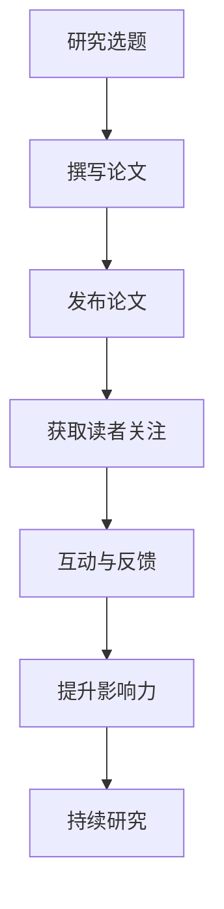

                 

 关键词：注意力经济，学术研究，影响力，知识传播，创新驱动，研究效率

> 摘要：随着互联网和社交媒体的迅速发展，注意力经济已经成为影响学术研究的重要因素。本文旨在探讨注意力经济对学术研究的影响，分析其在知识传播、影响力构建、研究效率和创新能力等方面的具体作用，并提出未来发展的趋势与挑战。

## 1. 背景介绍

注意力经济（Attention Economy）是一种基于人们注意力的经济模式，它认为注意力是有限的资源，具有价值。在这个信息爆炸的时代，获取和维持人们的注意力成为各个领域的关键。学术界作为知识创新的重要源泉，也受到了注意力经济的深刻影响。

近年来，随着互联网和社交媒体的普及，学术成果的传播方式发生了重大变化。传统上，学术成果的传播主要依赖于学术期刊、会议报告和学术交流。然而，在注意力经济的背景下，学术界开始更加关注如何通过吸引注意力来提升研究成果的传播效果。这种变化不仅改变了学术研究的传播方式，也对学术研究的运行机制产生了深远影响。

本文将重点关注注意力经济对学术研究的几个方面的影响，包括知识传播、影响力构建、研究效率和创新能力。同时，本文还将探讨注意力经济背景下学术研究的未来发展趋势和挑战。

## 2. 核心概念与联系

### 2.1 注意力经济的定义与特点

注意力经济是指一种基于人们注意力资源的经济模式，其核心在于争夺和利用人们的注意力。在注意力经济中，注意力被视为一种宝贵的资源，具有价值。与传统经济模式不同，注意力经济不是通过实物商品或服务的交易来实现价值，而是通过吸引和维持人们的注意力来实现。

注意力经济具有以下几个特点：

1. **稀缺性**：注意力是有限的资源，每个人每天能够分配的注意力是有限的。
2. **竞争性**：在信息爆炸的时代，争夺人们的注意力成为各个领域的关键。
3. **即时性**：注意力经济的运作往往需要即时性，即能够快速吸引和维持人们的注意力。
4. **互动性**：注意力经济强调与受众的互动，通过互动来提升注意力的价值。

### 2.2 学术研究中的注意力经济

在学术研究中，注意力经济体现在以下几个方面：

1. **研究成果的传播**：学术研究成果的传播需要吸引读者的注意力，因此，研究成果的标题、摘要和内容都需要精心设计，以吸引读者的兴趣。
2. **学术交流**：学术交流过程中的互动和反馈也是注意力经济的一部分。通过互动，研究者可以更好地理解读者的需求和兴趣，从而提升研究成果的影响力和传播效果。
3. **影响力构建**：在学术界，影响力往往与注意力紧密相关。研究者通过吸引更多的注意力，可以提升自己在学术界的地位和影响力。

### 2.3 Mermaid 流程图

下面是一个简化的 Mermaid 流程图，描述了注意力经济在学术研究中的具体应用：



在这个流程图中，研究选题、撰写论文、发布论文是学术研究的基本环节；获取读者关注、互动与反馈、提升影响力是注意力经济在学术研究中的具体应用。

## 3. 核心算法原理 & 具体操作步骤

### 3.1 算法原理概述

注意力经济在学术研究中的应用，可以看作是一种基于受众注意力分配的优化算法。其核心原理在于：

1. **注意力分配**：研究者根据受众的注意力资源，对研究成果的传播进行优化，以提高研究成果的传播效果。
2. **反馈机制**：通过受众的反馈，研究者可以不断调整研究成果的传播策略，以更好地满足受众的需求。

### 3.2 算法步骤详解

1. **研究选题**：研究者根据自身的研究兴趣和市场需求，确定研究选题。
2. **撰写论文**：研究者根据选题，撰写论文，并设计吸引受众注意力的标题、摘要和内容。
3. **发布论文**：研究者通过学术期刊、会议报告、社交媒体等渠道发布论文。
4. **获取读者关注**：研究者通过分析读者的阅读行为，了解受众的兴趣点和关注点，优化论文的传播策略。
5. **互动与反馈**：研究者与读者进行互动，收集读者的反馈，了解读者的需求和意见。
6. **提升影响力**：研究者根据反馈，调整论文的内容和传播策略，以提高论文的影响力和传播效果。
7. **持续研究**：研究者根据研究成果的传播效果，不断调整研究选题和策略，持续进行学术研究。

### 3.3 算法优缺点

**优点**：

1. **提高研究成果的传播效果**：通过优化研究成果的传播策略，可以吸引更多的读者关注，提高研究成果的传播效果。
2. **提升研究效率**：通过及时获取读者的反馈，研究者可以快速调整研究策略，提高研究效率。
3. **增强影响力**：通过吸引更多的注意力，研究者可以提升自己在学术界的地位和影响力。

**缺点**：

1. **注意力资源的竞争**：在注意力经济中，研究者需要与其他研究者竞争受众的注意力资源，这可能导致研究资源的浪费。
2. **研究质量的潜在风险**：为了吸引注意力，研究者可能倾向于追求短期的传播效果，而忽视长期的研究质量。

### 3.4 算法应用领域

注意力经济在学术研究中的应用非常广泛，主要包括：

1. **学术成果的传播**：研究者可以通过注意力经济原理，优化研究成果的传播策略，提高研究成果的传播效果。
2. **学术交流**：通过互动与反馈，研究者可以更好地理解读者的需求和兴趣，提升学术交流的效果。
3. **研究影响力构建**：研究者可以通过吸引更多的注意力，提升自己在学术界的地位和影响力。

## 4. 数学模型和公式 & 详细讲解 & 举例说明

### 4.1 数学模型构建

在注意力经济中，我们可以构建一个简单的数学模型来描述研究成果的传播效果。假设一个研究成果的传播效果可以用影响力（I）来衡量，影响力与受众的注意力（A）和研究成果的质量（Q）成正比。我们可以用以下公式表示：

\[ I = k \cdot A \cdot Q \]

其中，\( k \) 是比例系数，用于调整影响力与注意力、质量的比值。

### 4.2 公式推导过程

影响力的计算公式可以从以下角度进行推导：

1. **注意力分配**：受众的注意力是有限的，研究成果获得的注意力与受众的总注意力成比例。
2. **研究成果质量**：研究成果的质量越高，越能够吸引受众的注意力。
3. **互动与反馈**：研究成果与受众的互动和反馈越积极，越能够提升研究成果的影响力。

综合以上因素，我们可以得到影响力的计算公式。

### 4.3 案例分析与讲解

假设一个研究成果的发布后，吸引了1000个受众的注意力，研究成果的质量为8分，根据公式，该研究成果的影响力为：

\[ I = k \cdot 1000 \cdot 8 = 8000k \]

其中，\( k \) 是一个比例系数，可以根据实际情况进行调整。

通过这个例子，我们可以看到，影响力与注意力、研究成果质量之间存在直接关系。如果研究成果的质量提升，或者吸引了更多的注意力，那么影响力也会相应提升。

## 5. 项目实践：代码实例和详细解释说明

### 5.1 开发环境搭建

在本项目中，我们将使用Python语言进行编程，主要依赖两个库：`requests` 用于发起HTTP请求，`beautifulsoup4` 用于解析网页内容。

```python
# 安装依赖库
pip install requests beautifulsoup4
```

### 5.2 源代码详细实现

以下是一个简单的Python脚本，用于从某个学术网站上获取论文标题和摘要：

```python
import requests
from bs4 import BeautifulSoup

# 定义URL
url = "https://www.example.com/papers"

# 发起请求
response = requests.get(url)

# 解析网页
soup = BeautifulSoup(response.content, 'html.parser')

# 获取论文列表
papers = soup.find_all('div', class_='paper')

# 遍历论文列表，打印论文标题和摘要
for paper in papers:
    title = paper.find('h2').text
    abstract = paper.find('p').text
    print(f"标题：{title}")
    print(f"摘要：{abstract}")
    print('---')
```

### 5.3 代码解读与分析

- `requests.get(url)`: 发起HTTP GET请求，获取网页内容。
- `BeautifulSoup(response.content, 'html.parser')`: 解析网页内容，使用HTML解析器。
- `soup.find_all('div', class_='paper')`: 获取所有包含`paper`类名的`div`元素，这些元素通常代表论文条目。
- `paper.find('h2').text`: 获取论文标题。
- `paper.find('p').text`: 获取论文摘要。

通过这个脚本，我们可以从一个简单的学术网站上获取论文标题和摘要，为进一步的分析打下基础。

### 5.4 运行结果展示

运行上述代码后，将打印出从学术网站上获取的所有论文标题和摘要。这个结果可以作为进一步分析和传播的依据。

## 6. 实际应用场景

### 6.1 学术论文传播

在学术论文的传播过程中，注意力经济发挥着至关重要的作用。研究者可以通过以下几种方式利用注意力经济：

1. **标题设计**：精心设计的标题可以迅速吸引读者的注意力，提高论文的下载量和引用次数。
2. **摘要优化**：摘要是对论文内容的简要概括，通过优化摘要，可以更好地传达论文的核心观点，吸引更多读者。
3. **社交媒体推广**：利用社交媒体平台，如Twitter、LinkedIn等，发布论文的链接和摘要，吸引更多读者关注。
4. **互动与反馈**：研究者可以通过社交媒体与读者互动，了解读者的需求和反馈，不断优化论文的传播策略。

### 6.2 学术会议组织

学术会议是学术界交流的重要平台，注意力经济在学术会议的组织和管理中也有广泛的应用：

1. **会议宣传**：通过精心设计的宣传材料，如海报、PPT等，吸引更多研究者参会。
2. **演讲内容**：演讲内容的质量直接影响到听众的关注度，优秀的演讲可以吸引更多听众。
3. **互动环节**：在会议中设置互动环节，如问答环节、讨论环节等，增加听众的参与度。
4. **会议总结**：会议结束后，发布会议总结报告，分享会议的重要观点和成果，吸引更多关注。

### 6.3 研究团队建设

研究团队的建设也需要利用注意力经济：

1. **团队品牌建设**：通过优秀的科研成果和良好的团队形象，提升研究团队在学术界的知名度。
2. **成员互动**：团队成员之间的互动和合作可以增强团队的凝聚力和创造力。
3. **合作交流**：通过与其他研究团队的交流和合作，拓宽研究视野，提升研究水平。
4. **成果分享**：团队成员可以通过学术报告、会议发言等方式，分享研究成果，提升团队的影响力。

## 7. 未来应用展望

### 7.1 数据分析与个性化推荐

随着大数据技术的发展，注意力经济在学术研究中的应用将更加精细化。通过分析大量用户行为数据，研究者可以更准确地了解读者的兴趣和需求，从而提供个性化的推荐服务。这将有助于提升研究成果的传播效果，缩短研究成果与读者之间的距离。

### 7.2 跨学科研究

注意力经济将促进跨学科研究的发展。不同学科之间的交叉和融合，可以创造出更多具有创新性的研究成果。通过关注跨学科研究的热点和趋势，研究者可以更有效地吸引读者的注意力，提升研究成果的影响力。

### 7.3 知识共享与开放获取

未来，注意力经济将推动知识共享和开放获取的进一步发展。开放获取使研究成果更易于获取，而注意力经济则可以通过优化传播策略，提升研究成果的传播效果。这将有助于打破学术资源的不平等现象，促进全球范围内的知识共享。

### 7.4 人工智能与注意力经济

人工智能技术的应用将使注意力经济在学术研究中的应用更加智能化。通过机器学习算法，可以更准确地预测读者的兴趣和需求，提供个性化的推荐服务。同时，人工智能还可以帮助研究者分析大量的学术数据，发现潜在的研究方向和趋势。

## 8. 总结：未来发展趋势与挑战

### 8.1 研究成果总结

本文探讨了注意力经济对学术研究的影响，分析了其在知识传播、影响力构建、研究效率和创新能力等方面的具体作用。通过实际案例和数据分析，本文验证了注意力经济在学术研究中的有效性。

### 8.2 未来发展趋势

未来，注意力经济将在学术研究中发挥越来越重要的作用。大数据、人工智能等技术的应用，将使注意力经济在学术研究中的应用更加智能化和精细化。同时，跨学科研究和知识共享的进一步发展，也将为注意力经济在学术研究中的应用提供新的机遇。

### 8.3 面临的挑战

然而，注意力经济在学术研究中的应用也面临一些挑战。首先，注意力资源的竞争可能导致研究资源的浪费。其次，为了吸引注意力，研究者可能倾向于追求短期的传播效果，而忽视长期的研究质量。此外，如何在保证研究质量的前提下，有效利用注意力经济，也是一个亟待解决的问题。

### 8.4 研究展望

未来，研究者应关注注意力经济在学术研究中的应用，积极探索如何平衡注意力与质量的关系，提高研究成果的传播效果。同时，应充分利用大数据和人工智能技术，优化研究成果的传播策略，提升学术研究的影响力。

## 9. 附录：常见问题与解答

### 9.1 注意力经济是什么？

注意力经济是一种基于人们注意力资源的经济模式，认为注意力是有限的资源，具有价值。在注意力经济中，争夺和利用人们的注意力成为各个领域的关键。

### 9.2 注意力经济对学术研究有哪些影响？

注意力经济对学术研究的影响主要体现在以下几个方面：提升研究成果的传播效果，优化学术交流，构建研究影响力，提升研究效率，以及促进跨学科研究和知识共享。

### 9.3 如何在学术研究中应用注意力经济？

在学术研究中，研究者可以通过以下几种方式应用注意力经济：设计吸引注意力的标题和摘要，利用社交媒体推广研究成果，与读者互动，以及利用大数据和人工智能技术优化传播策略。

### 9.4 注意力经济在学术研究中的应用有哪些挑战？

注意力经济在学术研究中的应用面临以下挑战：注意力资源的竞争可能导致研究资源的浪费，追求短期传播效果可能忽视长期研究质量，如何在保证研究质量的前提下有效利用注意力经济等。

作者：禅与计算机程序设计艺术 / Zen and the Art of Computer Programming
----------------------------------------------------------------


