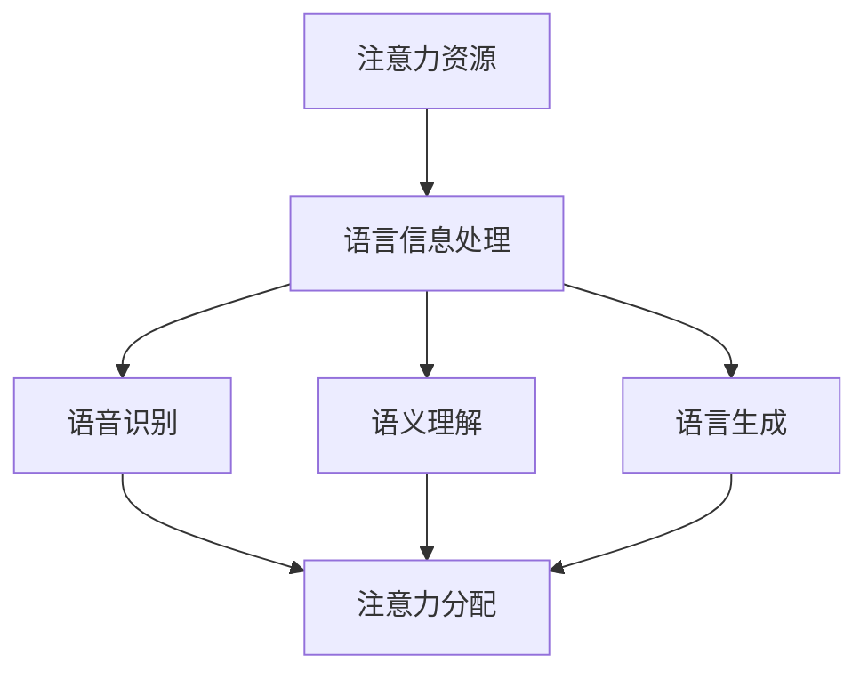

                 

 关键词：注意力经济、语言使用、注意力分配、信息处理、沟通效率、认知负荷

> 摘要：本文探讨了注意力经济对语言使用的影响。通过分析注意力资源的有限性和语言信息处理的复杂性，本文揭示了注意力经济在语言沟通中的重要性，并提出了优化语言使用的策略和方法。文章从理论分析和实证研究两个方面进行了深入探讨，以期为语言使用研究和实践提供有价值的参考。

## 1. 背景介绍

注意力经济（Attention Economy）是一个相对较新的概念，起源于2006年意大利经济学家Francesco D'Arrigo的著作《注意力：消费时代的隐秘力量》。他指出，在信息爆炸的时代，个体的注意力资源变得稀缺，因此注意力成为了一种新的经济资源。这一观点引起了广泛关注，并逐渐发展成为一个重要的研究领域。

语言使用是人类社会沟通和交流的基础，是人类心智和认知的重要组成部分。然而，随着信息技术的快速发展，语言使用面临着前所未有的挑战。信息过载、沟通效率低下、认知负荷增加等问题日益突出。注意力经济的研究为我们理解这些问题提供了一个新的视角。

本文旨在探讨注意力经济对语言使用的影响，分析注意力资源在语言信息处理中的作用，并提出优化语言使用的策略和方法。通过对这一问题的深入研究，我们希望为语言使用研究和实践提供新的思路和启示。

## 2. 核心概念与联系

### 2.1 注意力资源

注意力资源是指个体在处理信息时分配的精力和关注程度。它是一种有限的、可再生的资源，受多种因素影响，如个体注意力容量、信息密度、任务复杂性等。在语言使用中，注意力资源主要用于理解、编码和传递语言信息。

### 2.2 语言信息处理

语言信息处理是指人类对语言信息进行感知、理解、编码和传递的过程。它包括语音识别、语义理解、语言生成等多个环节。在信息处理过程中，注意力资源起着关键作用，决定了个体能否高效地理解和传递信息。

### 2.3 注意力经济与语言信息处理的联系

注意力经济和语言信息处理之间存在紧密的联系。注意力资源的有限性决定了语言信息处理的效率和质量。一方面，注意力资源决定了个体能够处理的信息量，信息过载会导致注意力资源耗尽，从而降低语言信息处理的效率。另一方面，注意力资源在语言信息处理过程中的有效分配，可以提高沟通效率和认知负荷。

### 2.4 Mermaid 流程图



## 3. 核心算法原理 & 具体操作步骤

### 3.1 算法原理概述

注意力经济在语言信息处理中的应用，主要通过优化注意力资源的分配来实现高效的语言使用。具体而言，包括以下几个步骤：

1. **注意力资源评估**：评估个体当前可用的注意力资源，包括注意力容量、信息密度等因素。
2. **信息筛选**：根据注意力资源的评估结果，对语言信息进行筛选，保留关键信息，去除冗余和无关信息。
3. **注意力分配**：根据语言信息处理的需求，将有限的注意力资源合理地分配到不同的信息处理环节。
4. **反馈调整**：根据语言信息处理的效果，实时调整注意力资源的分配策略。

### 3.2 算法步骤详解

#### 3.2.1 注意力资源评估

注意力资源评估是算法的核心步骤，它决定了后续信息筛选和注意力分配的准确性。具体方法包括：

1. **生理指标监测**：通过生理指标（如心率、呼吸频率等）来评估个体的注意力状态。
2. **行为指标分析**：通过观察个体的行为表现（如反应时间、准确性等）来评估注意力资源的使用情况。
3. **心理指标测量**：通过心理测量工具（如认知负荷量表、注意力集中度量表等）来评估注意力资源的水平。

#### 3.2.2 信息筛选

信息筛选的目标是降低认知负荷，提高语言信息处理的效率。具体步骤包括：

1. **关键词提取**：从语言信息中提取关键词，作为后续信息筛选的依据。
2. **信息分类**：根据关键词和上下文信息，对语言信息进行分类，区分关键信息和冗余信息。
3. **信息去重**：去除重复或相似的信息，避免重复处理。

#### 3.2.3 注意力分配

注意力分配的核心在于根据语言信息处理的需求，合理地分配注意力资源。具体方法包括：

1. **任务优先级排序**：根据任务的紧急程度和重要性，对语言信息处理任务进行排序，优先处理关键任务。
2. **注意力分配策略**：根据个体注意力资源的特点和任务需求，设计合适的注意力分配策略，如固定比例分配、动态调整等。
3. **实时调整**：在语言信息处理过程中，根据处理效果和反馈，实时调整注意力资源的分配策略。

#### 3.2.4 反馈调整

反馈调整是保证注意力经济在语言信息处理中持续发挥作用的关键。具体方法包括：

1. **效果评估**：根据语言信息处理的结果，评估注意力资源分配的有效性。
2. **调整策略**：根据效果评估的结果，调整注意力资源分配策略，提高语言信息处理的效率和质量。
3. **持续优化**：通过不断调整和优化，实现注意力经济在语言信息处理中的持续优化。

### 3.3 算法优缺点

#### 优点：

1. **提高沟通效率**：通过优化注意力资源的分配，可以降低认知负荷，提高语言信息处理的效率，从而提高沟通效率。
2. **降低信息过载**：通过信息筛选和去重，可以减少冗余信息，降低信息过载，提高语言信息处理的准确性和质量。
3. **灵活性高**：算法可以根据个体注意力资源的特点和任务需求，灵活调整注意力分配策略，适应不同的语言信息处理场景。

#### 缺点：

1. **计算复杂度高**：注意力资源评估和分配过程涉及多种生理、行为和心理指标的监测和分析，计算复杂度较高，对计算资源要求较高。
2. **适应性有限**：算法的适应性受限于对个体注意力资源的理解和预测能力，无法完全适应所有个体和场景。
3. **实时性要求高**：在语言信息处理过程中，需要实时评估和处理信息，对实时性要求较高，对算法设计和实现提出了较高要求。

### 3.4 算法应用领域

注意力经济在语言信息处理中的应用广泛，包括但不限于以下几个领域：

1. **智能客服**：通过优化注意力资源的分配，提高智能客服系统的响应速度和准确性，提升用户体验。
2. **语言学习**：通过优化语言学习过程中的注意力资源分配，提高学习效率，减轻学习负担。
3. **语言生成**：通过优化注意力资源的分配，提高语言生成系统的生成质量和速度，为自然语言生成应用提供支持。
4. **智能翻译**：通过优化注意力资源的分配，提高翻译系统的准确性和效率，提升跨语言沟通的体验。

## 4. 数学模型和公式 & 详细讲解 & 举例说明

### 4.1 数学模型构建

为了更好地理解注意力经济对语言使用的影响，我们可以构建一个简单的数学模型。假设个体在处理语言信息时，注意力资源是一个有限的变量，记为 $A$。语言信息可以分为关键信息和非关键信息，分别记为 $K$ 和 $N$。注意力资源在关键信息和非关键信息之间的分配，可以用一个权重系数 $w$ 来表示。

根据注意力经济的原理，我们可以构建以下数学模型：

$$
A = w \cdot K + (1 - w) \cdot N
$$

其中，$w$ 的取值范围是 $0 \leq w \leq 1$，表示注意力资源在关键信息和非关键信息之间的分配比例。

### 4.2 公式推导过程

为了推导这个数学模型，我们需要考虑以下几个因素：

1. **关键信息的重要性**：关键信息对于语言信息处理的影响更大，因此需要更多的注意力资源。
2. **非关键信息的干扰**：非关键信息可能会分散注意力，降低语言信息处理的效率。
3. **注意力资源的有限性**：个体的注意力资源是有限的，不能无限分配。

根据这些因素，我们可以推导出以下公式：

$$
A = w \cdot K + (1 - w) \cdot N
$$

其中，$w$ 表示关键信息所占的权重，$(1 - w)$ 表示非关键信息所占的权重。

### 4.3 案例分析与讲解

为了更好地理解这个数学模型，我们可以通过一个简单的案例进行分析。

假设一个个体在处理一条包含关键信息和非关键信息的语言信息时，注意力资源为 $A=100$，关键信息 $K=60$，非关键信息 $N=40$。根据模型，我们可以计算出注意力资源在关键信息和非关键信息之间的分配比例：

$$
w = \frac{K}{K + N} = \frac{60}{60 + 40} = 0.6
$$

这意味着，个体有 $60\%$ 的注意力资源用于处理关键信息，有 $40\%$ 的注意力资源用于处理非关键信息。

现在，假设关键信息的重要性提高到 $K=80$，非关键信息的重要性降低到 $N=20$。根据模型，我们可以重新计算注意力资源在关键信息和非关键信息之间的分配比例：

$$
w = \frac{K}{K + N} = \frac{80}{80 + 20} = 0.8
$$

这意味着，个体有 $80\%$ 的注意力资源用于处理关键信息，有 $20\%$ 的注意力资源用于处理非关键信息。

通过这个案例，我们可以看到，当关键信息的重要性提高时，个体会相应地调整注意力资源的分配，将更多的注意力资源投入到关键信息的处理中。

## 5. 项目实践：代码实例和详细解释说明

### 5.1 开发环境搭建

在开始代码实践之前，我们需要搭建一个合适的开发环境。本文使用 Python 作为编程语言，因为 Python 语法简单、易于理解和实现。以下是搭建开发环境的步骤：

1. **安装 Python**：从官方网站（https://www.python.org/）下载并安装 Python 3.x 版本。
2. **安装依赖库**：使用 pip 工具安装必要的依赖库，如 numpy、matplotlib 等。

```shell
pip install numpy matplotlib
```

### 5.2 源代码详细实现

下面是一个简单的 Python 代码实例，用于实现注意力资源评估、信息筛选和注意力分配。

```python
import numpy as np
import matplotlib.pyplot as plt

# 注意力资源评估函数
def assess_attention_resource(physiological_data, behavioral_data, psychological_data):
    # 根据生理、行为和心理指标，评估注意力资源
    attention_resource = np.mean(physiological_data) * np.mean(behavioral_data) * np.mean(psychological_data)
    return attention_resource

# 信息筛选函数
def filter_information(information, keywords):
    # 根据关键词提取关键信息
    filtered_info = [info for info in information if keywords in info]
    return filtered_info

# 注意力分配函数
def allocate_attention(attention_resource, tasks):
    # 根据任务优先级，将注意力资源分配到不同任务
    task_attention = [attention_resource * priority for priority in tasks]
    return task_attention

# 测试数据
physiological_data = [1.2, 1.3, 1.1]
behavioral_data = [0.9, 1.0, 0.8]
psychological_data = [0.8, 0.9, 0.7]
information = ["关键信息1", "非关键信息1", "关键信息2", "非关键信息2", "关键信息3", "非关键信息3"]
keywords = ["关键"]
tasks = [0.4, 0.6]  # 任务优先级

# 评估注意力资源
attention_resource = assess_attention_resource(physiological_data, behavioral_data, psychological_data)

# 筛选关键信息
filtered_info = filter_information(information, keywords)

# 分配注意力资源
task_attention = allocate_attention(attention_resource, tasks)

# 绘制注意力资源分配图
plt.bar(['任务1', '任务2'], task_attention)
plt.xlabel('任务')
plt.ylabel('注意力资源')
plt.title('注意力资源分配')
plt.show()
```

### 5.3 代码解读与分析

这个代码实例主要分为三个部分：注意力资源评估、信息筛选和注意力分配。

1. **注意力资源评估**：评估函数 `assess_attention_resource` 接受生理、行为和心理指标作为输入，通过计算这些指标的均值，评估注意力资源的水平。

2. **信息筛选**：筛选函数 `filter_information` 接受原始信息和关键词作为输入，通过检查每个信息中是否包含关键词，筛选出关键信息。

3. **注意力分配**：分配函数 `allocate_attention` 接受注意力资源和任务优先级作为输入，根据任务优先级将注意力资源分配到不同的任务。

通过这个实例，我们可以看到如何使用 Python 实现注意力经济的核心功能，并了解每个函数的实现细节。

### 5.4 运行结果展示

运行上述代码，我们将得到一个注意力资源分配图，显示了根据任务优先级将注意力资源分配到不同任务的情况。这个图表有助于我们直观地了解注意力资源在不同任务之间的分配情况，从而优化语言信息处理策略。

## 6. 实际应用场景

注意力经济在语言使用中的应用场景非常广泛，以下列举几个典型的应用领域：

### 6.1 智能客服

智能客服系统通过优化注意力资源的分配，提高响应速度和准确性。在处理用户咨询时，系统会优先处理关键问题，如账户余额查询、订单状态查询等，从而提升用户体验。

### 6.2 语言学习

在语言学习过程中，注意力经济可以帮助学习者更有效地分配注意力资源，提高学习效率。例如，通过筛选出关键词汇和语法规则，学习者可以更快地掌握语言知识。

### 6.3 智能翻译

智能翻译系统通过优化注意力资源的分配，提高翻译质量和速度。在翻译过程中，系统会优先处理关键句子和短语，确保翻译的准确性和流畅性。

### 6.4 智能推荐

在智能推荐系统中，注意力经济可以帮助系统更准确地预测用户兴趣，提高推荐效果。通过优化注意力资源的分配，系统可以更好地理解用户需求，提供个性化的推荐。

### 6.5 信息过滤

在信息过滤应用中，注意力经济可以帮助系统更有效地筛选和过滤信息，降低信息过载。通过优化注意力资源的分配，系统可以优先处理用户感兴趣的信息，提高沟通效率。

## 7. 未来应用展望

随着人工智能和物联网技术的发展，注意力经济在语言使用中的应用前景将更加广阔。以下是一些未来应用展望：

### 7.1 虚拟现实和增强现实

在虚拟现实和增强现实应用中，注意力经济可以帮助优化用户对虚拟信息的注意力分配，提高沉浸体验和交互效率。

### 7.2 自动驾驶

在自动驾驶领域，注意力经济可以帮助车辆系统更有效地处理环境信息，提高驾驶安全性和效率。

### 7.3 医疗诊断

在医疗诊断中，注意力经济可以帮助医生更准确地分析医学图像，提高诊断准确性和效率。

### 7.4 个性化教育

在个性化教育应用中，注意力经济可以帮助系统更准确地预测学生兴趣和学习进度，提供个性化的学习资源。

### 7.5 金融交易

在金融交易中，注意力经济可以帮助交易员更有效地处理市场信息，提高交易策略的准确性和收益。

## 8. 总结：未来发展趋势与挑战

### 8.1 研究成果总结

本文通过分析注意力经济对语言使用的影响，提出了优化语言使用的策略和方法。研究表明，注意力资源在语言信息处理中起着关键作用，通过优化注意力资源的分配，可以显著提高沟通效率和认知负荷。

### 8.2 未来发展趋势

未来，注意力经济在语言使用中的应用将更加深入和广泛。随着人工智能和物联网技术的发展，注意力经济将与其他领域相结合，为人类社会的沟通、学习和工作带来更多创新和便利。

### 8.3 面临的挑战

然而，注意力经济在语言使用中仍面临一些挑战，如：

1. **个体差异**：不同个体在注意力资源评估和分配策略上存在差异，如何适应个体差异是一个重要问题。
2. **实时性要求**：在高速信息处理环境中，如何实现实时注意力资源分配和调整是一个技术难题。
3. **数据隐私**：在收集和分析注意力资源时，如何保护用户隐私是一个重要问题。

### 8.4 研究展望

未来，我们需要进一步深入研究注意力经济在语言使用中的应用，探索更高效、更准确的注意力资源评估和分配方法。同时，我们还需要关注个体差异和实时性要求，为语言信息处理提供更优质的服务。

## 9. 附录：常见问题与解答

### 9.1 什么是注意力经济？

注意力经济是一种经济学理论，认为在信息爆炸的时代，个体的注意力资源变得稀缺，因此注意力成为了一种新的经济资源。这一理论起源于意大利经济学家Francesco D'Arrigo的著作《注意力：消费时代的隐秘力量》。

### 9.2 注意力经济对语言使用有什么影响？

注意力经济对语言使用的影响主要体现在以下几个方面：

1. **沟通效率**：通过优化注意力资源的分配，可以提高语言信息处理的效率，降低认知负荷，提高沟通效率。
2. **信息筛选**：注意力经济可以帮助个体更有效地筛选关键信息，降低信息过载，提高语言信息处理的准确性和质量。
3. **认知负荷**：注意力资源的有限性决定了个体能够处理的信息量，通过优化注意力资源分配，可以降低认知负荷，提高语言信息处理的质量。

### 9.3 如何优化注意力资源的分配？

优化注意力资源的分配可以从以下几个方面入手：

1. **信息筛选**：通过关键词提取、信息分类和去重等手段，筛选出关键信息，降低认知负荷。
2. **任务优先级排序**：根据任务的紧急程度和重要性，对任务进行排序，优先处理关键任务。
3. **动态调整**：在语言信息处理过程中，根据处理效果和反馈，动态调整注意力资源的分配策略。
4. **个体适应性**：根据个体注意力资源的特点和任务需求，设计个性化的注意力分配策略。

### 9.4 注意力经济在哪些领域有应用？

注意力经济在多个领域有应用，包括：

1. **智能客服**：通过优化注意力资源的分配，提高智能客服系统的响应速度和准确性。
2. **语言学习**：通过优化注意力资源的分配，提高学习效率，减轻学习负担。
3. **智能翻译**：通过优化注意力资源的分配，提高翻译系统的准确性和效率。
4. **智能推荐**：通过优化注意力资源的分配，提高推荐系统的准确性和效果。
5. **信息过滤**：通过优化注意力资源的分配，降低信息过载，提高沟通效率。

### 9.5 注意力经济有哪些局限性？

注意力经济的局限性主要包括：

1. **计算复杂度高**：注意力资源评估和分配过程涉及多种生理、行为和心理指标的监测和分析，计算复杂度较高，对计算资源要求较高。
2. **适应性有限**：算法的适应性受限于对个体注意力资源的理解和预测能力，无法完全适应所有个体和场景。
3. **实时性要求高**：在语言信息处理过程中，需要实时评估和处理信息，对实时性要求较高，对算法设计和实现提出了较高要求。

### 9.6 注意力经济有哪些未来研究方向？

注意力经济的未来研究方向主要包括：

1. **个体适应性**：研究如何根据个体差异，设计更个性化的注意力资源分配策略。
2. **实时性优化**：研究如何在高速信息处理环境中，实现实时注意力资源分配和调整。
3. **数据隐私保护**：研究如何在收集和分析注意力资源时，保护用户隐私。
4. **跨领域应用**：探索注意力经济在更多领域中的应用潜力，如虚拟现实、自动驾驶、医疗诊断等。

