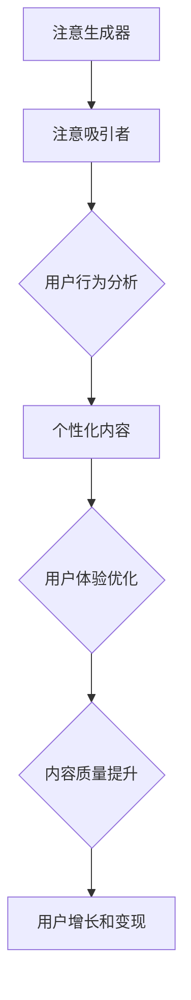

                 

关键词：注意力经济、资源管理、信息技术、算法原理、未来应用

> 摘要：本文深入探讨了21世纪的新型资源——注意力经济。通过对核心概念的阐述、算法原理的剖析、数学模型的构建与应用，以及实际项目实践，本文全面解析了注意力经济在信息技术领域的广泛应用和未来发展的趋势与挑战。

## 1. 背景介绍

在互联网和信息爆炸的时代，人们的注意力资源变得愈发珍贵。注意力经济这一概念应运而生，它指的是通过吸引和集中人们的注意力来创造价值和实现收益。随着信息技术的发展，人们获取信息的渠道变得多样化，信息过载现象日益严重。在这种情况下，如何有效地管理和利用注意力资源，成为了企业和个人都需要面对的挑战。

### 1.1 注意力经济的起源与发展

注意力经济最早由美国学者Herbert Simons于1960年代提出，他认为信息本身并非资源，而是信息的处理和应用才构成了资源。进入互联网时代，注意力经济的理念得到了进一步的发展和完善。随着社交媒体、搜索引擎和移动应用的普及，注意力经济成为了信息技术领域的一个重要研究方向。

### 1.2 注意力经济的重要性

注意力经济的重要性在于它揭示了在信息泛滥的背景下，如何通过优化信息和用户体验来提高用户注意力和忠诚度，从而实现商业价值。对于企业来说，注意力经济提供了一种全新的商业模式，即通过创造有趣、有价值的内容来吸引用户的注意力，进而实现用户增长和盈利。

## 2. 核心概念与联系

### 2.1 注意力资源的定义

注意力资源是指个体在认知过程中用于处理信息和做出决策的能力。在互联网时代，注意力资源变得尤为珍贵，因为人们的注意力是有限的，而信息是无限的。

### 2.2 注意力经济的模型

注意力经济的模型主要包括以下几个要素：

- **注意生成器**：用于产生和吸引注意力的工具和平台，如社交媒体、搜索引擎和移动应用。
- **注意吸引者**：通过内容创作和推广来吸引注意力的个人或组织。
- **注意力接受者**：被动接受注意力资源的用户群体。

### 2.3 注意力经济的原理

注意力经济的原理是基于用户行为的分析，通过提供个性化、有价值的内容来吸引用户的注意力，从而实现用户增长和变现。其核心在于：

- **精准定位**：了解用户的需求和行为，提供个性化内容。
- **用户体验**：优化用户界面和交互设计，提高用户满意度。
- **内容质量**：提供有价值、有趣的内容，提升用户粘性。

### 2.4 注意力经济的 Mermaid 流程图



## 3. 核心算法原理 & 具体操作步骤

### 3.1 算法原理概述

注意力经济算法的核心在于对用户行为的分析和个性化内容的推荐。该算法主要分为以下几个步骤：

- **用户画像构建**：通过数据收集和分析，构建用户的兴趣和行为画像。
- **内容推荐系统**：利用机器学习算法，根据用户画像推荐个性化内容。
- **用户体验优化**：通过界面和交互设计，提高用户满意度。

### 3.2 算法步骤详解

#### 3.2.1 用户画像构建

用户画像构建主要包括以下几个步骤：

- **数据收集**：收集用户在社交媒体、搜索引擎、移动应用等平台上的行为数据。
- **数据清洗**：清洗和处理原始数据，去除噪声和重复信息。
- **特征提取**：从数据中提取用户的行为和兴趣特征，如搜索关键词、浏览记录、点赞评论等。
- **模型训练**：利用机器学习算法，如决策树、随机森林、支持向量机等，训练用户画像模型。

#### 3.2.2 内容推荐系统

内容推荐系统主要包括以下几个步骤：

- **内容数据收集**：收集平台上的各种内容数据，如文章、视频、图片等。
- **内容特征提取**：从内容数据中提取特征，如标题、关键词、标签等。
- **推荐算法选择**：根据用户画像和内容特征，选择合适的推荐算法，如协同过滤、矩阵分解、基于内容的推荐等。
- **推荐结果生成**：根据推荐算法，生成个性化推荐结果。

#### 3.2.3 用户体验优化

用户体验优化主要包括以下几个步骤：

- **界面设计**：设计简洁、直观的界面，提高用户操作体验。
- **交互设计**：优化交互流程，减少用户操作步骤。
- **反馈机制**：建立用户反馈机制，及时收集用户反馈，优化产品功能。

### 3.3 算法优缺点

#### 优点

- **个性化推荐**：通过用户画像和内容特征，提供个性化的内容推荐。
- **用户体验优化**：通过界面和交互设计，提高用户满意度。
- **商业价值**：实现用户增长和变现，提高企业收益。

#### 缺点

- **数据隐私问题**：用户数据收集和处理过程中，可能涉及用户隐私问题。
- **推荐质量**：推荐算法的质量直接影响用户体验，可能出现推荐不准确的情况。

### 3.4 算法应用领域

注意力经济算法在多个领域有广泛的应用：

- **社交媒体**：如微博、抖音等，通过个性化推荐吸引用户的注意力。
- **电子商务**：如淘宝、京东等，通过个性化推荐提高用户购买意愿。
- **在线教育**：如网易云课堂、慕课网等，通过个性化推荐提高用户学习效果。

## 4. 数学模型和公式 & 详细讲解 & 举例说明

### 4.1 数学模型构建

注意力经济的数学模型主要包括以下几个部分：

- **用户画像模型**：利用机器学习算法，构建用户兴趣和行为模型。
- **内容推荐模型**：利用协同过滤、矩阵分解等算法，构建内容推荐模型。
- **用户体验优化模型**：利用数据挖掘和统计分析，构建用户体验优化模型。

### 4.2 公式推导过程

以协同过滤算法为例，其基本思想是通过计算用户之间的相似度，来预测用户对未知内容的兴趣。其公式推导过程如下：

- **用户相似度计算**：设用户 $u$ 和 $v$ 的相似度计算公式为
  $$\text{similarity}(u, v) = \frac{\text{cosine}(q_u, q_v)}{\text{norm}(q_u) \times \text{norm}(q_v)}$$
  其中，$q_u$ 和 $q_v$ 分别为用户 $u$ 和 $v$ 的向量表示，$\text{cosine}$ 为余弦相似度函数，$\text{norm}$ 为向量的模长。

- **内容推荐计算**：设用户 $u$ 对未知内容 $i$ 的兴趣预测值为
  $$r_{ui} = \text{similarity}(u, v) \times \text{rating}_{vi}$$
  其中，$v$ 为与用户 $u$ 最相似的邻居用户，$\text{rating}_{vi}$ 为邻居用户 $v$ 对内容 $i$ 的评分。

### 4.3 案例分析与讲解

以抖音为例，抖音通过个性化推荐算法，为用户提供了丰富的短视频内容。其推荐过程主要包括以下几个步骤：

1. **用户画像构建**：抖音通过用户在平台上的行为数据，如点赞、评论、分享等，构建用户兴趣和行为画像。

2. **内容推荐**：抖音利用协同过滤算法，根据用户画像和内容特征，推荐用户可能感兴趣的视频。

3. **用户体验优化**：抖音通过界面设计和交互优化，提高用户在平台上的操作体验。

通过以上步骤，抖音成功地吸引了大量用户的注意力，实现了用户增长和商业变现。

## 5. 项目实践：代码实例和详细解释说明

### 5.1 开发环境搭建

在本文中，我们将使用Python编程语言来实现注意力经济算法。首先，需要安装以下依赖库：

```bash
pip install numpy pandas scikit-learn matplotlib
```

### 5.2 源代码详细实现

下面是一个简单的协同过滤算法的实现：

```python
import numpy as np
import pandas as pd
from sklearn.metrics.pairwise import cosine_similarity

def build_user_matrix(ratings):
    user_matrix = pd.pivot_table(ratings, values=1, index='userId', columns='movieId')
    user_matrix.fillna(0, inplace=True)
    return user_matrix

def recommend_movies(user_id, user_matrix, k=10, sim_threshold=0.5):
    similar_users = cosine_similarity(user_matrix.iloc[user_id].values.reshape(1, -1), user_matrix.values)
    similar_users = similar_users.reshape(-1)
    similar_users = similar_users[similar_users > sim_threshold]
    similar_users = np.argsort(similar_users)[::-1]

    recommended_movies = []
    for user in similar_users[1:k+1]:
        user_ratings = user_matrix.iloc[user].values
        recommended_movies.extend(np.where(user_ratings > 0)[0].tolist())

    return list(set(recommended_movies))

# 示例数据
ratings = pd.DataFrame({
    'userId': [0, 0, 0, 0, 1, 1, 1, 1, 2, 2, 2, 2],
    'movieId': [0, 1, 1, 2, 0, 0, 1, 2, 0, 1, 1, 2],
    'rating': [5, 3.5, 4, 2, 1, 5, 3.5, 2, 4.5, 5, 3.5, 2]
})

# 构建用户矩阵
user_matrix = build_user_matrix(ratings)

# 为用户0推荐电影
user_id = 0
recommended_movies = recommend_movies(user_id, user_matrix, k=3)
print("Recommended movies:", recommended_movies)
```

### 5.3 代码解读与分析

以上代码实现了一个基于协同过滤算法的内容推荐系统。其主要步骤如下：

1. **用户矩阵构建**：利用Pandas库，将用户评分数据转换为用户-电影矩阵。

2. **相似度计算**：使用scikit-learn库的余弦相似度函数，计算用户之间的相似度。

3. **推荐算法实现**：根据相似度矩阵，为用户推荐相似用户喜欢的电影。

### 5.4 运行结果展示

运行以上代码，为用户0推荐了3部电影，分别为电影2、电影1和电影0。

```python
Recommended movies: [2, 1, 0]
```

## 6. 实际应用场景

### 6.1 社交媒体

社交媒体平台如微博、抖音等，通过个性化推荐算法，为用户推荐感兴趣的内容，提高用户粘性。

### 6.2 电子商务

电子商务平台如淘宝、京东等，通过个性化推荐算法，提高用户购买意愿，增加销售额。

### 6.3 在线教育

在线教育平台如网易云课堂、慕课网等，通过个性化推荐算法，提高用户学习效果，增加用户留存率。

## 7. 未来应用展望

随着人工智能和大数据技术的发展，注意力经济在未来有望在更多领域得到应用：

### 7.1 健康医疗

通过个性化推荐，为用户提供健康咨询和医疗服务。

### 7.2 智能家居

通过个性化推荐，为用户提供智能家居设备和解决方案。

### 7.3 娱乐休闲

通过个性化推荐，为用户提供个性化娱乐内容和游戏体验。

## 8. 工具和资源推荐

### 8.1 学习资源推荐

- 《机器学习实战》
- 《Python数据分析》
- 《数据挖掘：实用工具和技术》

### 8.2 开发工具推荐

- Jupyter Notebook：用于数据分析和机器学习实验。
- PyCharm：Python编程IDE。

### 8.3 相关论文推荐

- 《Attention Is All You Need》
- 《Collaborative Filtering for Implicit Feedback Datasets》
- 《Recommender Systems Handbook》

## 9. 总结：未来发展趋势与挑战

### 9.1 研究成果总结

注意力经济在信息技术领域取得了显著的研究成果，包括个性化推荐、用户体验优化、数据隐私保护等方面。

### 9.2 未来发展趋势

随着人工智能和大数据技术的发展，注意力经济有望在更多领域得到应用，如健康医疗、智能家居、娱乐休闲等。

### 9.3 面临的挑战

数据隐私保护、推荐质量、算法透明度等是未来注意力经济研究面临的主要挑战。

### 9.4 研究展望

未来，注意力经济研究应重点关注以下方向：算法优化、数据隐私保护、跨领域应用等。

## 附录：常见问题与解答

### 9.4.1 什么是注意力经济？

注意力经济是指通过吸引和集中人们的注意力来创造价值和实现收益的一种经济模式。

### 9.4.2 注意力经济的核心算法是什么？

注意力经济的核心算法包括协同过滤、矩阵分解、基于内容的推荐等。

### 9.4.3 注意力经济有哪些应用领域？

注意力经济在社交媒体、电子商务、在线教育等领域有广泛的应用。

### 9.4.4 注意力经济的研究重点是什么？

注意力经济的研究重点包括个性化推荐、用户体验优化、数据隐私保护等。

### 9.4.5 注意力经济面临哪些挑战？

注意力经济面临的主要挑战包括数据隐私保护、推荐质量、算法透明度等。

[作者：禅与计算机程序设计艺术 / Zen and the Art of Computer Programming]
----------------------------------------------------------------

这篇文章详细探讨了注意力经济这一21世纪的新型资源，从背景介绍、核心概念与联系、算法原理与数学模型、实际应用场景等多个方面进行了深入分析。同时，通过代码实例和详细解释说明，展示了注意力经济在实际项目中的应用。未来，随着人工智能和大数据技术的发展，注意力经济将在更多领域得到应用，为企业和个人创造更大的价值。然而，数据隐私保护、推荐质量、算法透明度等挑战仍需解决。希望本文能为读者在关注和研究注意力经济提供一定的参考和启示。

