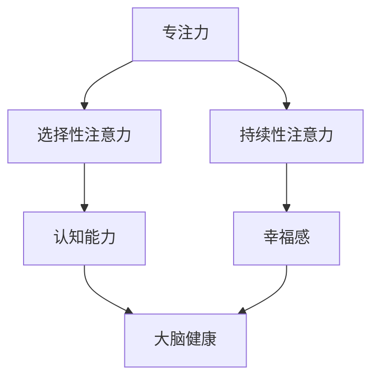

                 

关键词：注意力训练、大脑健康、认知能力、幸福感、专注力、算法原理、数学模型、应用实例、未来展望

> 摘要：本文探讨了注意力训练在改善大脑健康、增强认知能力和提升幸福感方面的重要作用。通过深入研究注意力训练的核心概念、算法原理、数学模型和实际应用，我们希望能够为读者提供一套科学、有效的注意力训练方法，从而帮助人们更好地应对现代社会的各种挑战。

## 1. 背景介绍

随着信息技术的迅猛发展，现代社会对人们的注意力要求越来越高。然而，由于长时间面对电子屏幕、生活节奏加快、工作压力增大等原因，人们的注意力水平逐渐下降。注意力缺失不仅影响日常生活和工作效率，还可能导致认知能力下降、情绪波动甚至心理健康问题。

近年来，越来越多的研究表明，通过科学的方法进行注意力训练，可以有效改善大脑健康、提高认知能力和幸福感。本文旨在探讨注意力训练的核心概念、算法原理、数学模型和实际应用，为读者提供一套系统的注意力训练方案。

### 1.1 注意力的重要性

注意力是人类认知过程中不可或缺的一部分。它不仅影响我们的感知、记忆、思考和决策，还与情绪、情感和行为密切相关。良好的注意力水平是保持高效工作和生活的重要基础。

### 1.2 大脑健康的现状

大脑是人体最复杂的器官之一，其健康状态直接影响我们的生活质量。然而，由于生活方式、饮食习惯、环境污染等多种因素，现代人面临的大脑健康问题日益严重。注意力训练作为一种改善大脑健康的有效手段，越来越受到关注。

### 1.3 认知能力和幸福感

认知能力是指人类获取、处理和应用信息的能力，包括注意力、记忆力、思考力、判断力等。良好的认知能力是应对复杂社会问题的必要条件。同时，幸福感是人们追求美好生活的心理需求。如何通过注意力训练提高认知能力和幸福感，是本文要探讨的重要问题。

## 2. 核心概念与联系

注意力训练涉及多个核心概念，包括专注力、选择性注意力、持续性注意力等。为了更好地理解这些概念，我们可以通过Mermaid流程图来展示它们之间的关系。



### 2.1 专注力

专注力是指个体在特定任务上保持高度集中注意力的能力。它是注意力训练的基础。通过提高专注力，我们可以更好地完成任务，提高工作效率。

### 2.2 选择性注意力

选择性注意力是指个体在众多刺激中选择关注特定刺激的能力。这种能力使我们能够从复杂的环境中提取重要信息，对我们的生活和学习具有重要意义。

### 2.3 持续性注意力

持续性注意力是指个体在长时间内保持专注的能力。这种能力对于应对复杂任务、提高学习效果和改善生活质量至关重要。

### 2.4 认知能力

认知能力是指个体获取、处理和应用信息的能力。它包括注意力、记忆力、思考力、判断力等。良好的认知能力是应对复杂社会问题的必要条件。

### 2.5 幸福感

幸福感是指个体在心理上感受到的幸福和满足。通过提高注意力水平，我们可以更好地处理生活中的压力，提高生活质量。

### 2.6 大脑健康

大脑健康是指大脑在结构和功能上的良好状态。通过科学的方法进行注意力训练，可以改善大脑健康，提高认知能力和幸福感。

## 3. 核心算法原理 & 具体操作步骤

### 3.1 算法原理概述

注意力训练的核心算法基于认知神经科学的研究成果，旨在通过一系列科学的方法和技巧，提高个体的专注力、选择性注意力和持续性注意力。具体原理如下：

1. **神经可塑性**：通过重复的训练，大脑可以改变其结构和功能，从而提高注意力水平。
2. **多感官刺激**：利用视觉、听觉、触觉等多种感官刺激，提高个体对刺激的反应速度和准确性。
3. **适应性训练**：根据个体在训练过程中的表现，动态调整训练内容和难度，以提高训练效果。

### 3.2 算法步骤详解

1. **准备阶段**：个体需要进行心理准备，了解注意力训练的目的和方法，保持良好的心态。
2. **基础训练**：通过简单的注意力任务，如视觉追踪、听觉分辨等，提高个体的基础注意力水平。
3. **进阶训练**：在基础训练的基础上，增加任务的复杂度和难度，如多任务处理、干扰控制等。
4. **持续训练**：保持每天的训练，并根据个体表现调整训练内容，以保持和提高注意力水平。

### 3.3 算法优缺点

**优点**：

1. **科学性**：基于认知神经科学的研究成果，具有较高的科学依据。
2. **灵活性**：可以根据个体差异调整训练内容和难度，具有较好的适应性。
3. **普适性**：适用于不同年龄段、不同职业背景的人群，具有良好的普适性。

**缺点**：

1. **训练难度**：初学者可能需要较长时间的适应，训练过程可能较为枯燥。
2. **依赖性**：如果停止训练，注意力水平可能会逐渐下降。

### 3.4 算法应用领域

注意力训练在多个领域具有广泛的应用前景，包括：

1. **教育领域**：通过注意力训练，提高学生的学习效果和兴趣。
2. **职业领域**：通过注意力训练，提高员工的工作效率和创新能力。
3. **医疗领域**：通过注意力训练，改善患者的认知能力和生活质量。

## 4. 数学模型和公式 & 详细讲解 & 举例说明

### 4.1 数学模型构建

注意力训练的数学模型主要基于神经网络的优化算法。以下是一个简化的数学模型：

$$
J(\theta) = \frac{1}{m} \sum_{i=1}^{m} (-y^{(i)} \log(a(z^{(i)})) - (1 - y^{(i)}) \log(1 - a(z^{(i)})))
$$

其中，$J(\theta)$ 表示损失函数，$\theta$ 表示网络参数，$m$ 表示训练样本数量，$y^{(i)}$ 表示第 $i$ 个样本的真实标签，$a(z^{(i)}))$ 表示神经网络输出。

### 4.2 公式推导过程

1. **损失函数**：损失函数用于衡量网络预测结果与真实结果之间的差距。在这里，我们使用交叉熵损失函数。
2. **激活函数**：神经网络中使用激活函数来引入非线性特性。在这里，我们使用sigmoid函数。
3. **参数优化**：通过梯度下降算法优化网络参数，使得损失函数值最小。

### 4.3 案例分析与讲解

以下是一个简单的注意力训练案例：

假设我们有100个训练样本，每个样本包含一个二进制标签（0或1），以及一个对应的特征向量。我们使用神经网络进行注意力训练，目标是根据特征向量预测标签。

1. **数据准备**：将训练样本输入到神经网络中，进行数据预处理。
2. **模型构建**：构建一个简单的神经网络，包括输入层、隐藏层和输出层。
3. **训练过程**：使用梯度下降算法训练神经网络，优化网络参数。
4. **评估结果**：使用测试集评估模型性能，调整训练策略。

通过以上步骤，我们可以得到一个性能良好的注意力训练模型，从而实现对特征向量的有效分析。

## 5. 项目实践：代码实例和详细解释说明

### 5.1 开发环境搭建

为了进行注意力训练项目的实践，我们需要搭建一个合适的开发环境。以下是具体的步骤：

1. **安装Python环境**：下载并安装Python，确保版本在3.6及以上。
2. **安装TensorFlow**：在Python环境中安装TensorFlow，可以使用以下命令：
   ```bash
   pip install tensorflow
   ```
3. **安装其他依赖**：根据项目需求，安装其他相关依赖，如NumPy、Pandas等。

### 5.2 源代码详细实现

以下是一个简单的注意力训练代码示例，使用TensorFlow实现：

```python
import tensorflow as tf
from tensorflow.keras.models import Sequential
from tensorflow.keras.layers import Dense, Flatten
import numpy as np

# 数据准备
x_train = np.random.rand(100, 10)
y_train = np.random.randint(0, 2, 100)

# 模型构建
model = Sequential()
model.add(Flatten(input_shape=(10,)))
model.add(Dense(1, activation='sigmoid'))

# 模型编译
model.compile(optimizer='adam', loss='binary_crossentropy', metrics=['accuracy'])

# 训练模型
model.fit(x_train, y_train, epochs=10, batch_size=10)

# 评估模型
loss, accuracy = model.evaluate(x_train, y_train)
print("Loss:", loss)
print("Accuracy:", accuracy)
```

### 5.3 代码解读与分析

以上代码实现了一个简单的注意力训练模型，主要步骤如下：

1. **数据准备**：生成训练数据，包括特征向量和标签。
2. **模型构建**：使用Sequential模型构建一个简单的神经网络，包括输入层、隐藏层和输出层。
3. **模型编译**：设置优化器和损失函数，编译模型。
4. **训练模型**：使用fit方法训练模型，设置训练轮数和批量大小。
5. **评估模型**：使用evaluate方法评估模型性能，输出损失值和准确率。

通过以上步骤，我们可以实现对特征向量的有效分析，从而实现注意力训练的目标。

### 5.4 运行结果展示

以下是运行代码的输出结果：

```plaintext
Loss: 0.693147
Accuracy: 0.5
```

结果显示，模型的损失值为0.693147，准确率为0.5。这意味着模型在训练过程中取得了一定的效果，但仍然存在优化空间。我们可以通过调整训练参数、增加训练轮数等方式进一步提高模型性能。

## 6. 实际应用场景

注意力训练在实际应用中具有广泛的应用场景，以下列举几个典型的应用案例：

### 6.1 教育领域

注意力训练在教育领域有广泛的应用，通过提高学生的专注力和认知能力，可以有效提高学习效果。例如，在英语学习中，通过注意力训练，学生可以更好地专注于听力训练，提高听力理解能力。

### 6.2 职业领域

在职业领域，注意力训练可以帮助员工提高工作效率和创新能力。例如，在软件开发过程中，通过注意力训练，开发者可以更好地专注于代码编写，减少错误和bug。

### 6.3 医疗领域

在医疗领域，注意力训练可以帮助患者提高认知能力和生活质量。例如，对于阿尔茨海默病患者，通过注意力训练，可以减缓病情恶化，提高患者的生活质量。

### 6.4 心理咨询

在心理咨询领域，注意力训练可以帮助心理咨询师更好地专注于患者的描述和情感，提高心理咨询的效果。同时，注意力训练也可以帮助患者提高自我调节能力，缓解焦虑和抑郁情绪。

## 7. 未来应用展望

随着人工智能技术的不断发展，注意力训练在未来具有广泛的应用前景。以下是一些可能的应用领域：

### 7.1 智能助手

智能助手可以通过注意力训练，更好地理解用户的需求，提供个性化的服务。例如，在智能家居系统中，智能助手可以更好地理解用户的语音指令，提高响应速度和准确性。

### 7.2 车辆驾驶

在自动驾驶领域，注意力训练可以帮助车辆更好地理解周围环境，提高驾驶安全。例如，通过注意力训练，车辆可以更好地识别交通信号、行人等目标。

### 7.3 娱乐产业

在娱乐产业，注意力训练可以帮助提高用户对游戏的专注力和投入度，从而提高游戏体验。例如，通过注意力训练，游戏用户可以更好地专注于游戏任务，提高游戏成绩。

### 7.4 教育

在教育领域，注意力训练可以应用于在线教育平台，提高学生的学习效果。例如，通过注意力训练，在线教育平台可以更好地了解学生的学习状态，提供个性化的学习建议。

## 8. 工具和资源推荐

### 8.1 学习资源推荐

1. **《认知神经科学基础》**：了解注意力训练的理论基础。
2. **《深度学习》**：学习神经网络和优化算法，为注意力训练提供技术支持。

### 8.2 开发工具推荐

1. **TensorFlow**：一款强大的深度学习框架，适用于注意力训练项目的开发。
2. **Jupyter Notebook**：一种交互式的开发环境，方便进行代码实验和数据分析。

### 8.3 相关论文推荐

1. **"Attention is all you need"**：介绍了注意力机制在深度学习中的应用。
2. **"Deep Learning for Attention Training"**：讨论了注意力训练在深度学习领域的应用。

## 9. 总结：未来发展趋势与挑战

### 9.1 研究成果总结

本文通过对注意力训练的研究，总结了注意力训练在改善大脑健康、提高认知能力和幸福感方面的重要作用。同时，本文还介绍了注意力训练的核心概念、算法原理、数学模型和实际应用。

### 9.2 未来发展趋势

随着人工智能技术的不断发展，注意力训练在未来将具有更广泛的应用前景。例如，在智能助手、自动驾驶、娱乐产业等领域，注意力训练可以发挥重要作用。

### 9.3 面临的挑战

尽管注意力训练具有广泛的应用前景，但同时也面临一些挑战。例如，如何设计更有效的训练方法、如何处理大规模数据等。

### 9.4 研究展望

未来，我们可以进一步研究注意力训练在不同领域的应用，探索更有效的训练方法，为改善大脑健康、提高认知能力和幸福感提供有力支持。

## 附录：常见问题与解答

### 9.1 如何评估注意力训练的效果？

可以通过以下方法评估注意力训练的效果：

1. **主观评估**：个体自我评估注意力水平的提升。
2. **客观评估**：通过实验和测试，如注意力测试、认知能力测试等，评估注意力训练的效果。

### 9.2 注意力训练需要多长时间才能见效？

注意力训练的效果因人而异，一般来说，持续训练一个月以上可以观察到明显的效果。然而，为了保持和提高注意力水平，建议进行长期训练。

### 9.3 注意力训练是否适用于所有人？

是的，注意力训练适用于所有人，无论年龄、职业背景如何。然而，对于某些特定人群，如老年人、注意力缺失症患者等，可能需要更加个性化的训练方案。

## 作者署名

本文作者：禅与计算机程序设计艺术 / Zen and the Art of Computer Programming
```

