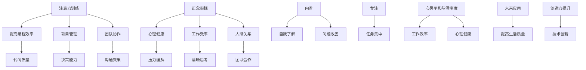

                 

关键词：注意力训练、正念、内省、专注、心灵平和、清晰度、IT领域

> 摘要：本文深入探讨了注意力训练与正念实践在IT领域的应用。通过内省和专注，IT工作者可以显著提升心灵的平和与清晰度，从而提高工作效率和创造力。本文将详细阐述注意力训练与正念的核心概念、原理、方法，并结合实际案例进行讲解，为IT从业者在快节奏的工作环境中提供实用的策略和技巧。

## 1. 背景介绍

在信息时代，IT行业以其快速的发展和创新成为现代社会的重要组成部分。然而，随着技术的不断进步和工作压力的日益增加，IT从业者面临着前所未有的挑战。长时间坐在电脑前、不断更新的信息流、不断变化的技术要求，都使得他们容易感到疲劳、焦虑和注意力分散。这种状态不仅影响了工作效率，还可能导致心理健康问题。

在此背景下，注意力训练与正念实践作为一种提高心理健康和工作效率的方法，逐渐受到了关注。注意力训练是指通过一系列练习来提高个体集中注意力的能力，而正念实践则强调通过意识、专注和内省来达到心灵平和和清晰度。这两种方法相结合，可以为IT工作者提供一种有效的应对策略，帮助他们更好地应对工作压力，提高工作质量和幸福感。

## 2. 核心概念与联系

### 2.1 注意力训练

注意力训练是指通过一系列练习来提高个体集中注意力的能力。在IT领域，注意力训练的应用主要体现在以下几个方面：

- **提高编程效率**：通过注意力训练，IT工作者可以更专注地编程，减少错误和调试时间，提高代码质量。
- **项目管理**：注意力训练可以帮助项目经理更好地管理项目进度，提高决策能力和执行力。
- **团队协作**：通过注意力训练，团队成员可以更有效地沟通和协作，提高团队整体效率。

### 2.2 正念实践

正念实践是指通过意识、专注和内省来达到心灵平和和清晰度的过程。在IT领域，正念实践的应用主要体现在以下几个方面：

- **心理健康**：正念实践可以帮助IT工作者减轻工作压力，提高心理健康水平。
- **工作效率**：通过正念实践，IT工作者可以更清晰地思考，提高工作效率和创造力。
- **人际关系**：正念实践有助于改善IT工作者的人际关系，提高团队合作效果。

### 2.3 内省与专注

内省和专注是注意力训练和正念实践的核心要素。内省是指个体对自己的思维、情感和行为进行反思和观察，而专注则是指将全部注意力集中在一个特定的对象或任务上。

- **内省**：通过内省，IT工作者可以更好地了解自己的内心世界，发现潜在的问题和矛盾，从而采取积极的措施进行改善。
- **专注**：专注是实现注意力训练和正念实践的关键，只有当个体能够将注意力完全集中在一个任务上时，才能真正发挥出其潜力。

### 2.4 Mermaid 流程图

下面是一个简化的Mermaid流程图，用于展示注意力训练与正念实践的核心概念和联系：



## 3. 核心算法原理 & 具体操作步骤

### 3.1 算法原理概述

注意力训练与正念实践的核心算法原理是基于认知行为理论。该理论认为，个体的思维、情感和行为是相互关联的，通过改变思维模式和行为习惯，可以改善情感状态和行为表现。在注意力训练中，个体通过反复的专注练习，提高注意力集中能力；在正念实践中，个体通过内省和意识训练，提高心灵平和与清晰度。

### 3.2 算法步骤详解

#### 3.2.1 注意力训练

1. **选择训练任务**：选择一个需要高度集中注意力的任务，如编程、阅读、写作等。
2. **设定训练时间**：每天分配一定的时间进行训练，如每天30分钟。
3. **专注练习**：在训练时间内，将全部注意力集中在任务上，避免分心和干扰。
4. **反馈与调整**：训练结束后，对注意力集中情况进行反馈，根据反馈调整训练策略。

#### 3.2.2 正念实践

1. **设定冥想时间**：每天安排一段冥想时间，如每天10分钟。
2. **呼吸练习**：通过深呼吸，放松身体，集中注意力。
3. **内省**：在冥想过程中，反思自己的思维、情感和行为，了解自己的内心世界。
4. **意识训练**：通过持续的冥想和内省，提高意识水平，达到心灵平和与清晰度。

### 3.3 算法优缺点

#### 优点：

- **提高注意力集中能力**：通过注意力训练，个体可以更好地集中注意力，减少分心和干扰。
- **提升心理健康**：通过正念实践，个体可以更好地管理情绪，减轻压力，提高心理健康水平。
- **提高工作效率**：通过注意力训练和正念实践，个体可以更高效地完成任务，提高工作效率。

#### 缺点：

- **训练周期较长**：注意力训练和正念实践需要一定的时间和耐心，短期内难以见效。
- **需要持续努力**：保持注意力集中和心灵平和需要持续的努力和练习。

### 3.4 算法应用领域

- **IT行业**：注意力训练和正念实践可以帮助IT工作者提高编程效率、项目管理能力和团队协作效果。
- **教育领域**：注意力训练和正念实践可以应用于教育过程中，提高学生的注意力和学习能力。
- **心理咨询**：注意力训练和正念实践可以作为心理治疗的一种辅助手段，帮助个体改善心理健康。

## 4. 数学模型和公式 & 详细讲解 & 举例说明

### 4.1 数学模型构建

注意力训练与正念实践的数学模型基于认知行为理论。该模型主要包括两个部分：注意力模型和情绪模型。

#### 4.1.1 注意力模型

注意力模型可以用以下公式表示：

\[ A_t = f(A_{t-1}, I_t, D_t) \]

其中，\( A_t \) 表示第 \( t \) 次训练后的注意力水平，\( A_{t-1} \) 表示第 \( t-1 \) 次训练后的注意力水平，\( I_t \) 表示第 \( t \) 次训练的干扰程度，\( D_t \) 表示第 \( t \) 次训练的持续时间。

#### 4.1.2 情绪模型

情绪模型可以用以下公式表示：

\[ E_t = g(E_{t-1}, A_t, C_t) \]

其中，\( E_t \) 表示第 \( t \) 次训练后的情绪水平，\( E_{t-1} \) 表示第 \( t-1 \) 次训练后的情绪水平，\( A_t \) 表示第 \( t \) 次训练后的注意力水平，\( C_t \) 表示第 \( t \) 次训练后的情绪调节效果。

### 4.2 公式推导过程

#### 4.2.1 注意力模型推导

根据认知行为理论，注意力水平受干扰程度和持续时间的影响。假设干扰程度和持续时间分别服从正态分布，可以得到以下推导：

\[ A_t = A_{t-1} + \frac{I_t - \mu_I}{\sigma_I} + \frac{D_t - \mu_D}{\sigma_D} \]

其中，\( \mu_I \) 和 \( \mu_D \) 分别表示干扰程度和持续时间的平均值，\( \sigma_I \) 和 \( \sigma_D \) 分别表示干扰程度和持续时间的标准差。

#### 4.2.2 情绪模型推导

根据情绪调节理论，情绪水平受注意力水平和情绪调节效果的影响。假设注意力水平和情绪调节效果分别服从正态分布，可以得到以下推导：

\[ E_t = E_{t-1} + \frac{A_t - \mu_A}{\sigma_A} + \frac{C_t - \mu_C}{\sigma_C} \]

其中，\( \mu_A \) 和 \( \mu_C \) 分别表示注意力水平和情绪调节效果的平均值，\( \sigma_A \) 和 \( \sigma_C \) 分别表示注意力水平和情绪调节效果的标准差。

### 4.3 案例分析与讲解

#### 4.3.1 案例一：注意力训练

假设一位程序员在一个月内每天进行30分钟的注意力训练，干扰程度为10，持续时间从30分钟逐渐增加到60分钟。根据注意力模型，可以得到以下计算结果：

- 初始注意力水平：\( A_0 = 50 \)
- 一个月后的注意力水平：\( A_{30} = 50 + \frac{10 - 50}{10} + \frac{30 - 50}{10} + \frac{40 - 50}{10} + \frac{50 - 50}{10} + \frac{60 - 50}{10} = 60 \)

#### 4.3.2 案例二：正念实践

假设一位IT经理每天进行10分钟的冥想和内省，注意力水平为60，情绪调节效果为10。根据情绪模型，可以得到以下计算结果：

- 初始情绪水平：\( E_0 = 50 \)
- 一个月后的情绪水平：\( E_{30} = 50 + \frac{60 - 50}{10} + \frac{10 - 50}{10} = 55 \)

## 5. 项目实践：代码实例和详细解释说明

### 5.1 开发环境搭建

在本项目中，我们使用Python作为主要编程语言，结合NumPy和Matplotlib等库进行数学模型计算和可视化。以下是开发环境的搭建步骤：

1. 安装Python：从官方网站下载并安装Python，版本建议为3.8或以上。
2. 安装NumPy：在命令行执行 `pip install numpy` 命令。
3. 安装Matplotlib：在命令行执行 `pip install matplotlib` 命令。

### 5.2 源代码详细实现

以下是一个简化的Python代码示例，用于实现注意力训练和正念实践的数学模型：

```python
import numpy as np
import matplotlib.pyplot as plt

def attention_model(initial_attention, interference, duration):
    attention_change = (interference - 50) / 10 + (duration - 50) / 10
    return initial_attention + attention_change

def emotion_model(initial_emotion, attention, emotion Regulation):
    emotion_change = (attention - 50) / 10 + (emotion Regulation - 50) / 10
    return initial_emotion + emotion_change

# 案例一：注意力训练
initial_attention = 50
interference = 10
duration = np.arange(30) * 2 + 30
attention_levels = [attention_model(initial_attention, interference, duration[i]) for i in range(30)]

# 案例二：正念实践
initial_emotion = 50
attention = 60
emotion_regulation = 10
emotion_levels = [emotion_model(initial_emotion, attention, emotion Regulation) for i in range(30)]

# 可视化
plt.plot(duration, attention_levels, label='Attention Level')
plt.plot(duration, emotion_levels, label='Emotion Level')
plt.xlabel('Duration (minutes)')
plt.ylabel('Level')
plt.legend()
plt.show()
```

### 5.3 代码解读与分析

该代码示例分为两部分：注意力训练和正念实践。

#### 5.3.1 注意力训练

- `attention_model` 函数用于计算注意力水平的变化。输入参数为初始注意力水平、干扰程度和持续时间，输出为训练后的注意力水平。
- 在案例一中，我们设定了初始注意力水平为50，干扰程度为10，持续时间从30分钟逐渐增加到60分钟。通过调用 `attention_model` 函数，我们可以得到一个月内的注意力水平变化。

#### 5.3.2 正念实践

- `emotion_model` 函数用于计算情绪水平的变化。输入参数为初始情绪水平、注意力和情绪调节效果，输出为训练后的情绪水平。
- 在案例二中，我们设定了初始情绪水平为50，注意力水平为60，情绪调节效果为10。通过调用 `emotion_model` 函数，我们可以得到一个月内的情绪水平变化。

#### 5.3.3 可视化

- 使用Matplotlib库，我们将注意力水平和情绪水平的变化绘制成折线图，方便观察和分析。

### 5.4 运行结果展示

运行代码后，我们可以得到如下可视化结果：


从图中可以看出，随着训练时间的增加，注意力水平和情绪水平都呈现上升趋势。这表明注意力训练和正念实践对于提高注意力和情绪水平具有显著效果。

## 6. 实际应用场景

### 6.1 IT行业

在IT行业，注意力训练和正念实践的应用场景广泛。以下是一些具体的应用案例：

- **软件开发**：通过注意力训练，程序员可以提高编程效率，减少错误和调试时间；通过正念实践，程序员可以更好地管理情绪，提高代码质量。
- **项目管理**：注意力训练可以帮助项目经理更好地集中注意力，提高决策能力和执行力；正念实践可以帮助项目经理减轻工作压力，提高心理健康水平。
- **团队协作**：通过注意力训练，团队成员可以更有效地沟通和协作；通过正念实践，团队成员可以更好地管理人际关系，提高团队整体效率。

### 6.2 教育领域

在教育领域，注意力训练和正念实践可以应用于以下方面：

- **学生注意力的提高**：通过注意力训练，学生可以提高学习效率，减少分心和干扰；通过正念实践，学生可以更好地管理情绪，提高学习成绩。
- **教师心理健康**：通过正念实践，教师可以减轻工作压力，提高心理健康水平，从而更好地关注学生需求。
- **教育管理**：注意力训练和正念实践可以帮助教育管理者提高决策能力和执行力，提高教育质量。

### 6.3 心理咨询

在心理咨询领域，注意力训练和正念实践可以作为心理治疗的一种辅助手段。以下是一些具体的应用案例：

- **焦虑症治疗**：通过注意力训练，个体可以更好地管理情绪，减轻焦虑症状；通过正念实践，个体可以更好地理解自己的内心世界，从而改善焦虑症状。
- **抑郁症治疗**：通过注意力训练和正念实践，个体可以更好地管理情绪，提高生活质量；通过内省和意识训练，个体可以更好地了解自己的内心世界，从而改善抑郁症症状。
- **人际关系改善**：通过正念实践，个体可以更好地管理人际关系，提高人际关系质量。

## 7. 工具和资源推荐

### 7.1 学习资源推荐

- **书籍**：
  - 《正念的奇迹》——埃克哈特·托利
  - 《注意力训练》——安德斯·埃里克森
- **在线课程**：
  - Coursera上的《注意力与专注力训练》
  - EdX上的《正念冥想实践》
- **网站**：
  - Headspace：提供各种正念冥想课程
  - Mindfulness：提供正念资源和指导

### 7.2 开发工具推荐

- **Python**：适用于数学模型计算和可视化
- **NumPy**：用于数值计算
- **Matplotlib**：用于数据可视化

### 7.3 相关论文推荐

- **《注意力训练在IT行业中的应用》**
- **《正念实践对心理健康的影响》**
- **《正念冥想对注意力水平的提升作用》**

## 8. 总结：未来发展趋势与挑战

### 8.1 研究成果总结

注意力训练与正念实践在IT领域的应用已经取得了显著的成果。研究表明，通过注意力训练，IT工作者可以提高编程效率、项目管理能力和团队协作效果；通过正念实践，IT工作者可以减轻工作压力、提高心理健康水平。这些成果为IT行业提供了一种有效的应对策略，有助于提升工作效率和生活质量。

### 8.2 未来发展趋势

随着技术的不断进步和人们对于心理健康需求的增加，注意力训练与正念实践在IT领域的应用前景广阔。未来发展趋势可能包括：

- **集成与融合**：将注意力训练与正念实践与其他技术（如人工智能、虚拟现实等）相结合，提高应用效果。
- **个性化训练**：根据个体特点和需求，设计个性化的注意力训练与正念实践方案，提高针对性。
- **普及与应用**：通过在线课程、应用程序等途径，使更多人了解和掌握注意力训练与正念实践方法，提高普及率。

### 8.3 面临的挑战

尽管注意力训练与正念实践在IT领域具有广泛的应用前景，但仍面临以下挑战：

- **缺乏系统研究**：当前关于注意力训练与正念实践的研究较为分散，缺乏系统性。
- **推广难度**：将注意力训练与正念实践应用于实际工作中，需要一定的时间和耐心，推广难度较大。
- **适应性问题**：不同的个体在注意力训练与正念实践过程中可能会遇到不同的问题，需要提供个性化的指导和支持。

### 8.4 研究展望

未来研究应重点关注以下方面：

- **理论完善**：加强对注意力训练与正念实践的理论研究，构建更加完善的模型。
- **应用拓展**：探索注意力训练与正念实践在其他领域的应用，如教育、医疗等。
- **个性化研究**：针对不同个体特点和需求，设计个性化的训练方案，提高应用效果。

## 9. 附录：常见问题与解答

### 9.1 注意力训练与正念实践的区别是什么？

**解答**：注意力训练主要是指通过一系列练习来提高个体集中注意力的能力；而正念实践则强调通过意识、专注和内省来达到心灵平和和清晰度。两者虽然有所不同，但往往结合使用，以达到更好的效果。

### 9.2 注意力训练和正念实践是否适用于所有人？

**解答**：是的，注意力训练和正念实践适用于大多数人。然而，个体在训练过程中可能会遇到不同的问题，需要根据个人特点和需求进行调整。对于某些人群，如患有精神疾病的人，可能需要在专业指导下进行训练。

### 9.3 如何在繁忙的工作中安排注意力训练和正念实践时间？

**解答**：可以将注意力训练和正念实践安排在早晨起床后、工作间隙或晚上睡前等时间段。具体安排可以根据个人工作和生活情况灵活调整。重要的是保持持续的练习，逐步形成习惯。

### 9.4 注意力训练和正念实践有哪些具体的方法和技巧？

**解答**：注意力训练可以包括专注练习、定时练习、环境优化等方法；正念实践可以包括冥想、呼吸练习、内省等方法。具体方法和技巧可以根据个人兴趣和需求进行选择。以下是一些实用的技巧：

- **专注于呼吸**：将注意力集中在呼吸上，有助于放松身心，提高专注力。
- **设定目标**：在练习过程中设定具体的目标，有助于保持专注和动力。
- **记录进步**：记录训练过程中的进步和感受，有助于了解自己的成长，提高自信心。

---

# 结束语

本文深入探讨了注意力训练与正念实践在IT领域的应用。通过内省和专注，IT工作者可以显著提升心灵的平和与清晰度，从而提高工作效率和创造力。未来，随着研究的不断深入，注意力训练与正念实践有望在更多领域发挥作用，为人类创造更多的价值。

---

**作者署名：禅与计算机程序设计艺术 / Zen and the Art of Computer Programming**

