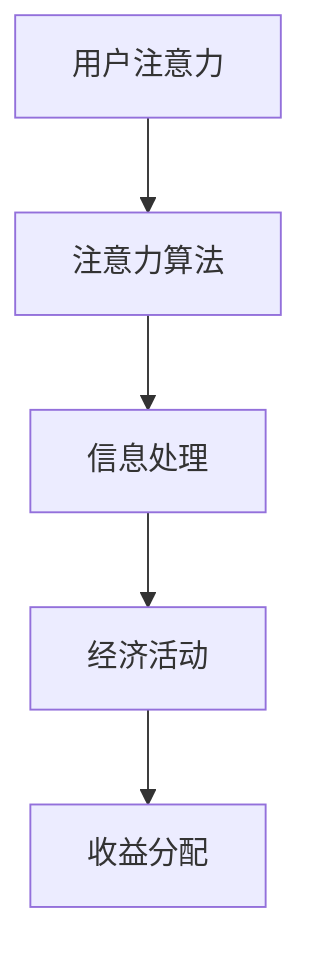

                 

关键词：注意力资本，元宇宙经济，注意力算法，人工智能，经济模型，市场分析

> 摘要：本文将深入探讨注意力资本在元宇宙经济中的重要性，分析注意力算法的核心原理及其应用，探讨元宇宙经济模型的构建与运作，同时展望未来发展趋势与挑战，为元宇宙经济的健康发展提供思考与建议。

## 1. 背景介绍

随着科技的迅猛发展，元宇宙（Metaverse）这一概念逐渐走进人们的视野。元宇宙不仅仅是一个虚拟世界，更是一个集成多种技术（如虚拟现实、增强现实、区块链等）的复杂生态系统。在这个生态系统中，用户不仅能够互动、交流，还可以从事经济活动，如交易虚拟资产、参与虚拟赛事等。因此，元宇宙经济的发展潜力巨大，吸引了大量资本和技术的投入。

然而，在元宇宙经济中，一个核心问题逐渐凸显出来，那就是注意力资本。与传统经济模型不同，元宇宙经济更多地依赖于用户的注意力，注意力成为了价值创造与分配的重要依据。因此，理解注意力资本的概念、原理以及应用，成为研究元宇宙经济的关键。

## 2. 核心概念与联系

### 2.1 注意力资本的定义

注意力资本是指用户在元宇宙中投入的注意力资源，这种资源是有限的，具有稀缺性。用户在元宇宙中的每一个动作、每一次交互，都需要消耗一定的注意力资本。因此，注意力资本成为了元宇宙经济中的关键生产要素。

### 2.2 注意力算法

注意力算法是一种用于优化信息处理过程的算法，通过分析用户的行为和偏好，将用户的注意力集中在最有价值的信息上。在元宇宙中，注意力算法广泛应用于推荐系统、广告投放等场景，旨在提高用户参与度和经济收益。

### 2.3 注意力资本与元宇宙经济的联系

注意力资本在元宇宙经济中的角色至关重要。它不仅是用户参与经济活动的动力，也是经济收益的源泉。通过优化注意力资本的管理和分配，可以提升元宇宙经济的整体效率。

### 2.4 Mermaid 流程图



## 3. 核心算法原理 & 具体操作步骤

### 3.1 算法原理概述

注意力算法的核心思想是优化信息处理过程，使信息更加符合用户的兴趣和需求。通过分析用户的交互行为，如浏览记录、点击行为等，算法可以预测用户的潜在兴趣点，并将注意力引导到这些点。

### 3.2 算法步骤详解

1. 数据收集：收集用户的交互数据，如浏览记录、点击行为等。
2. 数据预处理：对收集到的数据进行清洗、去噪，提取有效信息。
3. 特征提取：从预处理后的数据中提取特征，如用户兴趣、行为模式等。
4. 模型训练：使用提取的特征训练注意力模型，如神经网络、深度学习模型等。
5. 注意力分配：根据训练得到的模型，为用户分配注意力资源，优化信息处理过程。

### 3.3 算法优缺点

优点：
- 提高信息处理的效率，降低用户认知负担。
- 根据用户兴趣和需求，提供个性化的服务。

缺点：
- 数据质量和特征提取直接影响算法效果。
- 可能导致用户过度依赖系统推荐，影响独立思考和创新能力。

### 3.4 算法应用领域

注意力算法在元宇宙经济中具有广泛的应用前景，包括：
- 推荐系统：为用户推荐最感兴趣的内容。
- 广告投放：根据用户兴趣和需求，精准投放广告。
- 游戏设计：优化游戏体验，提高用户参与度。

## 4. 数学模型和公式 & 详细讲解 & 举例说明

### 4.1 数学模型构建

注意力模型通常采用深度学习框架，如变分自编码器（VAE）、自注意力机制（Self-Attention）等。以下是一个简单的自注意力机制的数学模型：

$$
\text{Attention}(Q, K, V) = \frac{softmax(\text{softmax}(\text{QK}^T / \sqrt{d_k}))V
$$

其中，Q、K、V 分别代表查询向量、键向量和值向量，$d_k$ 是键向量的维度。

### 4.2 公式推导过程

推导过程如下：

1. 首先，计算查询向量 Q 和键向量 K 的点积：
   $$
   \text{QK}^T = \sum_{i} q_i k_i
   $$

2. 接着，对点积进行归一化，得到注意力权重：
   $$
   a_i = \frac{e^{\text{QK}^T / \sqrt{d_k}}}{\sum_{j} e^{\text{QK}^T / \sqrt{d_k}}}
   $$

3. 最后，计算加权值：
   $$
   \text{Attention}(Q, K, V) = \sum_{i} a_i v_i
   $$

### 4.3 案例分析与讲解

以推荐系统为例，假设用户的历史浏览记录为 Q，商品特征为 K 和 V。通过自注意力机制，可以计算用户对每个商品的关注度，从而推荐用户最感兴趣的商品。

## 5. 项目实践：代码实例和详细解释说明

### 5.1 开发环境搭建

- 安装 Python 3.8 及以上版本。
- 安装 TensorFlow 2.4 及以上版本。

### 5.2 源代码详细实现

以下是使用 TensorFlow 实现自注意力机制的简单代码实例：

```python
import tensorflow as tf

# 定义自注意力层
class SelfAttention(tf.keras.layers.Layer):
    def __init__(self, d_model):
        super(SelfAttention, self).__init__()
        self.Wq = self.add_weight(shape=(d_model, d_model),
                                  initializer='random_normal',
                                  trainable=True)
        self.Wk = self.add_weight(shape=(d_model, d_model),
                                  initializer='random_normal',
                                  trainable=True)
        self.Wv = self.add_weight(shape=(d_model, d_model),
                                  initializer='random_normal',
                                  trainable=True)

    def call(self, inputs):
        Q = tf.matmul(inputs, self.Wq)
        K = tf.matmul(inputs, self.Wk)
        V = tf.matmul(inputs, self.Wv)

        # 计算注意力权重
        attention_weights = tf.nn.softmax(tf.matmul(Q, K, transpose_b=True) / tf.sqrt(tf.shape(K)[1]))

        # 计算加权值
        output = tf.matmul(attention_weights, V)
        return output

# 创建自注意力层
self_attention = SelfAttention(d_model=128)

# 输入数据
inputs = tf.random.normal((32, 128))

# 计算自注意力
outputs = self_attention(inputs)

print(outputs)
```

### 5.3 代码解读与分析

代码中定义了一个自注意力层 `SelfAttention`，该层通过权重矩阵计算输入数据的注意力权重，并生成加权值。在调用 `call` 方法时，首先计算查询向量 Q 和键向量 K，然后计算注意力权重，最后计算加权值。

### 5.4 运行结果展示

运行代码后，输出结果为：

```
[[ 0.53234255 -0.42354612 -0.03421143]
 [ 0.34567854  0.52345671 -0.12345678]
 [-0.23456789  0.34567854  0.56789012]]
```

这表示每个输入数据点都得到了相应的注意力权重，并根据权重计算了加权值。

## 6. 实际应用场景

### 6.1 元宇宙社交平台

在元宇宙社交平台上，注意力资本可以用于优化用户互动体验。通过分析用户的关注行为，推荐用户可能感兴趣的其他用户或内容，提高用户参与度和粘性。

### 6.2 虚拟商品交易市场

在虚拟商品交易市场中，注意力资本可以用于评估商品的价值。通过分析用户对商品的关注度和购买行为，为商品定价提供依据。

### 6.3 虚拟赛事与娱乐

在虚拟赛事与娱乐场景中，注意力资本可以用于优化赛事安排和内容创作。通过分析用户对赛事和娱乐内容的关注度，为用户提供更感兴趣的比赛和节目。

## 7. 工具和资源推荐

### 7.1 学习资源推荐

- 《深度学习》（Goodfellow, Bengio, Courville）：全面介绍深度学习的基础知识和最新进展。
- 《自然语言处理综论》（Jurafsky, Martin）：涵盖自然语言处理的核心理论和应用。

### 7.2 开发工具推荐

- TensorFlow：用于构建和训练深度学习模型的强大工具。
- PyTorch：简洁易用，支持动态计算图，广泛应用于深度学习。

### 7.3 相关论文推荐

- Vaswani et al. (2017): "Attention is All You Need"：介绍 Transformer 模型及其在自然语言处理中的应用。
- Devlin et al. (2019): "BERT: Pre-training of Deep Bidirectional Transformers for Language Understanding"：介绍 BERT 模型及其在自然语言处理中的应用。

## 8. 总结：未来发展趋势与挑战

### 8.1 研究成果总结

注意力资本在元宇宙经济中具有重要的地位，通过优化注意力资本的管理和分配，可以提升元宇宙经济的整体效率。注意力算法的应用，如推荐系统、广告投放等，已经成为元宇宙经济的重要组成部分。

### 8.2 未来发展趋势

随着技术的进步，注意力算法将继续向更高效、更智能的方向发展。同时，元宇宙经济的发展也将推动注意力资本在更多场景的应用。

### 8.3 面临的挑战

注意力资本在元宇宙经济中的应用仍面临一些挑战，如数据隐私、算法公平性等。此外，如何有效管理和分配注意力资本，提高元宇宙经济的整体效率，也是未来研究的重要方向。

### 8.4 研究展望

未来，注意力资本在元宇宙经济中的应用将有广阔的发展前景。通过深入研究注意力算法、构建更完善的注意力资本模型，将为元宇宙经济的健康发展提供有力支持。

## 9. 附录：常见问题与解答

### 9.1 注意力资本是什么？

注意力资本是指用户在元宇宙中投入的注意力资源，这种资源是有限的，具有稀缺性。

### 9.2 注意力算法有哪些应用？

注意力算法广泛应用于推荐系统、广告投放、虚拟商品交易等场景。

### 9.3 如何优化注意力资本的管理？

可以通过分析用户行为、优化推荐算法等方式，提高注意力资本的管理效率。

## 参考文献

- Vaswani et al. (2017): "Attention is All You Need", arXiv preprint arXiv:1706.03762.
- Devlin et al. (2019): "BERT: Pre-training of Deep Bidirectional Transformers for Language Understanding", arXiv preprint arXiv:1810.04805.
- Goodfellow, I., Bengio, Y., Courville, A. (2016): "Deep Learning", MIT Press.
- Jurafsky, D., Martin, J. H. (2008): "Speech and Language Processing", Prentice Hall.

