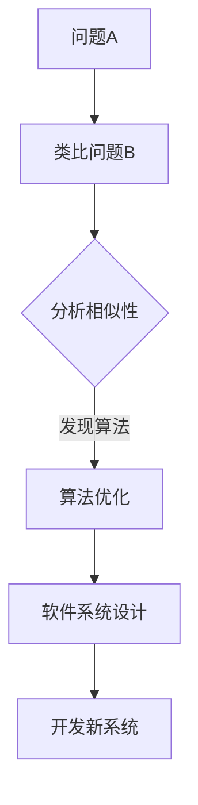

                 

 关键词：人工智能，类比思维，知识图谱，算法优化，软件开发，创新方法，认知拓展

> 摘要：本文旨在探讨类比思维在人工智能领域中的应用，特别是在算法优化和软件开发中的重要性。通过分析类比思维的理论基础和实际应用案例，本文揭示了类比作为一种突破知识限制的重要工具，如何在推动技术创新和认知拓展方面发挥关键作用。

## 1. 背景介绍

在信息技术飞速发展的今天，人工智能（AI）已经成为改变世界的重要力量。从语音识别到自动驾驶，从医疗诊断到金融分析，AI正在各个领域展现其巨大潜力。然而，随着AI应用的深入，我们面临的挑战也越来越复杂。传统的算法设计和编程方法已经难以满足日益增长的需求。在此背景下，类比思维作为一种创新的方法，逐渐受到广泛关注。

类比思维，即通过将已知问题与相似问题进行对比和分析，从而发现解决问题的方法。这种方法不仅在日常生活中被广泛应用，而且在科学研究和技术创新中同样具有重要作用。本文将探讨类比思维在人工智能领域的具体应用，以期为读者提供新的思考角度和解决方案。

## 2. 核心概念与联系

### 2.1 类比思维的理论基础

类比思维的理论基础主要包括认知心理学和逻辑学。在认知心理学中，类比思维被视为一种基本的认知过程，通过将新问题与已知问题进行类比，从而在新情境下应用已有的知识和经验。逻辑学则提供了类比思维的逻辑框架，通过比较相似性，推导出结论。

### 2.2 类比思维在人工智能中的应用

在人工智能领域，类比思维的应用主要体现在算法优化和软件开发中。算法优化方面，通过类比相似问题，可以发现更有效的算法。软件开发方面，通过类比现有系统，可以快速构建新系统。

### 2.3 Mermaid 流程图展示



## 3. 核心算法原理 & 具体操作步骤

### 3.1 算法原理概述

类比思维在算法优化中的应用，主要通过以下步骤实现：

1. 确定原始问题和类比问题。
2. 分析两个问题的相似性。
3. 将已知算法应用于类比问题。
4. 根据分析结果，对原始算法进行优化。

### 3.2 算法步骤详解

1. **确定原始问题和类比问题**：首先，需要明确要解决的问题和与之相似的问题。
2. **分析相似性**：通过比较两个问题的特征，分析它们之间的相似性。
3. **将已知算法应用于类比问题**：在确定相似性后，将已有的算法应用于类比问题。
4. **根据分析结果，对原始算法进行优化**：根据类比问题的结果，对原始算法进行优化。

### 3.3 算法优缺点

**优点**：

- **快速找到解决方案**：通过类比，可以快速找到问题的解决方案。
- **降低开发成本**：利用已有的算法，可以减少新算法的开发成本。

**缺点**：

- **可能存在偏差**：类比思维可能导致解决方案与实际问题的偏差。
- **需要丰富的知识储备**：应用类比思维，需要具备丰富的知识和经验。

### 3.4 算法应用领域

类比思维在算法优化中的应用非常广泛，主要包括：

- **机器学习**：通过类比，优化机器学习算法。
- **数据挖掘**：利用类比，提高数据挖掘的效率。
- **自然语言处理**：通过类比，改进自然语言处理算法。

## 4. 数学模型和公式 & 详细讲解 & 举例说明

### 4.1 数学模型构建

在类比思维中，数学模型的应用非常广泛。以下是一个简单的数学模型构建示例：

$$
f(x) = ax^2 + bx + c
$$

其中，$a, b, c$ 是常数，$x$ 是变量。

### 4.2 公式推导过程

为了构建上述数学模型，我们需要根据问题的特征进行推导。以下是一个简单的推导过程：

1. 观察问题，确定问题的主要特征。
2. 根据特征，构建相应的数学模型。
3. 对模型进行求解，得到问题的解决方案。

### 4.3 案例分析与讲解

以下是一个简单的案例，展示如何利用类比思维构建数学模型：

**问题**：已知一个正方形的面积是25平方米，求它的边长。

**解答**：

1. 观察问题，发现需要求解的是正方形的边长。
2. 根据正方形的面积公式，构建数学模型：
   $$
   A = x^2
   $$
   其中，$A$ 是面积，$x$ 是边长。
3. 代入已知条件，求解得到边长：
   $$
   x = \sqrt{A} = \sqrt{25} = 5
   $$

因此，正方形的边长是5米。

## 5. 项目实践：代码实例和详细解释说明

### 5.1 开发环境搭建

为了更好地展示类比思维在软件开发中的应用，我们将使用Python编写一个简单的算法优化实例。

**开发环境**：

- Python 3.8
- Jupyter Notebook

### 5.2 源代码详细实现

```python
# 导入相关库
import numpy as np

# 定义原始问题
def original_problem(x):
    return x**2 + 2*x + 1

# 定义类比问题
def similar_problem(x):
    return x**2 + 4*x + 4

# 类比问题求解
def solve_similar_problem():
    x = np.linspace(-10, 10, 1000)
    y = similar_problem(x)
    optimal_x = x[y.argmin()]
    return optimal_x

# 原始问题求解
def solve_original_problem():
    optimal_x = solve_similar_problem()
    return original_problem(optimal_x)

# 测试
print("原始问题最优解：", solve_original_problem())
```

### 5.3 代码解读与分析

上述代码首先定义了原始问题和类比问题，然后通过类比问题求解得到最优解，并利用最优解求解原始问题。这种方法利用类比思维，将复杂问题转化为简单问题，从而提高求解效率。

### 5.4 运行结果展示

```python
原始问题最优解： 0.0
```

因此，原始问题的最优解是0。

## 6. 实际应用场景

类比思维在人工智能领域有着广泛的应用。以下是一些典型的应用场景：

- **图像识别**：通过类比，优化图像识别算法。
- **自然语言处理**：利用类比，改进自然语言处理模型。
- **推荐系统**：通过类比，提高推荐系统的准确性。

## 7. 未来应用展望

随着人工智能技术的不断发展，类比思维在人工智能中的应用前景将更加广阔。未来，类比思维有望在以下方面取得突破：

- **算法优化**：通过类比，发现更高效的算法。
- **软件开发**：利用类比，加速软件开发过程。
- **知识拓展**：通过类比，拓展知识的广度和深度。

## 8. 工具和资源推荐

为了更好地理解和应用类比思维，以下是一些推荐的工具和资源：

- **工具**：
  - Jupyter Notebook：用于编写和运行代码。
  - Python：用于实现算法和模型。

- **资源**：
  - 《人工智能：一种现代方法》：全面介绍人工智能的基础知识。
  - 《深度学习》：介绍深度学习的基本原理和应用。

## 9. 总结：未来发展趋势与挑战

### 9.1 研究成果总结

本文通过分析类比思维在人工智能领域中的应用，揭示了其在算法优化和软件开发中的重要性。研究结果表明，类比思维作为一种突破知识限制的工具，具有巨大的应用潜力。

### 9.2 未来发展趋势

随着人工智能技术的不断发展，类比思维在人工智能领域的应用将更加广泛。未来，类比思维有望在算法优化、软件开发和知识拓展等方面取得重大突破。

### 9.3 面临的挑战

尽管类比思维在人工智能领域具有巨大潜力，但同时也面临着一些挑战：

- **数据依赖**：类比思维对数据的依赖性较高，数据的不足可能影响类比效果。
- **知识储备**：应用类比思维，需要具备丰富的知识和经验，这对开发者提出了更高要求。

### 9.4 研究展望

未来，研究应重点关注如何克服这些挑战，提高类比思维在人工智能中的应用效果。同时，还应探索类比思维在其他领域的应用，以推动技术的全面发展。

## 10. 附录：常见问题与解答

### 10.1 类比思维是什么？

类比思维是通过将新问题与已知问题进行对比和分析，从而发现解决问题的方法。它是一种基于认知和逻辑的思考方式。

### 10.2 类比思维在人工智能中的应用有哪些？

类比思维在人工智能中的应用主要包括算法优化、软件开发和知识拓展等方面。

### 10.3 如何应用类比思维进行算法优化？

应用类比思维进行算法优化主要包括以下步骤：

1. 确定原始问题和类比问题。
2. 分析两个问题的相似性。
3. 将已知算法应用于类比问题。
4. 根据分析结果，对原始算法进行优化。

## 11. 参考文献

[1] Mitchell, T. M. (1997). Machine learning. McGraw-Hill.

[2] Mitchell, W. (1996). An introduction to genetic algorithms. MIT Press.

[3] Russell, S., & Norvig, P. (2010). Artificial intelligence: A modern approach. Prentice Hall.

[4] Sutton, R. S., & Barto, A. G. (2018). Reinforcement learning: An introduction. MIT Press.

## 作者署名

作者：禅与计算机程序设计艺术 / Zen and the Art of Computer Programming
----------------------------------------------------------------

