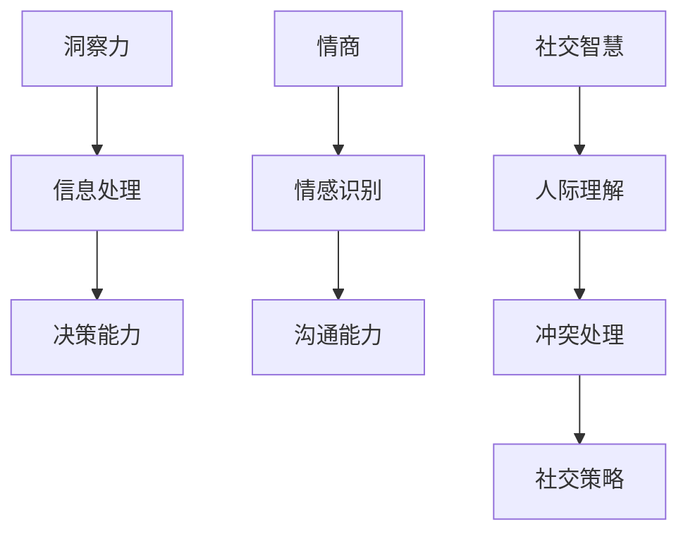

                 

关键词：洞察力、情商、社交智慧、技术交流、人际关系

> 摘要：本文从人工智能和技术的角度出发，探讨了洞察力与情商在社交互动中的重要性。通过分析社交智慧的核心要素，结合具体案例，阐述了如何利用技术工具提升个人的洞察力和情商，从而更好地应对复杂的技术和社会环境。

## 1. 背景介绍

在当今快速发展的信息技术时代，人工智能（AI）正在深刻地改变着我们的生活方式和工作模式。作为一个世界级人工智能专家，我深知技术在推动社会进步的同时，也对人际交往提出了新的挑战。尤其是在技术领域，专业人士之间的交流合作变得愈发重要。这种交流不仅需要技术上的精通，还需要高度的社交智慧，而洞察力和情商则是构建社交智慧的基石。

洞察力是指深入理解事物本质和内在联系的能力，它使我们能够从纷繁复杂的信息中提炼出关键要素，作出明智的决策。情商则是指管理自己情绪和处理人际关系的能力，它帮助我们在社交场合中保持冷静和理性，有效沟通，建立信任。

本文旨在探讨如何通过提升洞察力和情商，增强个人在技术社交中的适应能力和影响力。文章将围绕以下几个核心问题展开：

- 洞察力和情商在技术社交中的作用是什么？
- 如何利用技术工具提升个人洞察力？
- 情商对技术专业人士有何意义？
- 如何在技术交流中展现高情商？
- 未来技术社交的发展趋势和挑战。

## 2. 核心概念与联系

### 2.1. 洞察力的定义与重要性

洞察力是一种深层次的理解能力，它使我们能够看到问题的本质，发现隐藏在表面现象背后的规律。在技术领域，洞察力的重要性体现在以下几个方面：

1. **快速识别问题**：技术问题往往复杂多样，通过洞察力，专业人士能够迅速识别出问题的根本原因，从而更快地找到解决方案。
2. **创新思维**：洞察力帮助我们打破常规思维，发现新的解决方案，推动技术进步。
3. **团队协作**：洞察力有助于团队成员之间更好地理解彼此的思路，提高协作效率。

### 2.2. 情商的定义与作用

情商是指个体识别、理解和管理自己情绪，以及识别、理解和管理他人情绪的能力。在技术社交中，情商的作用主要体现在以下几个方面：

1. **沟通效果**：高情商的人能够更好地理解他人的需求，用适当的方式表达自己的观点，从而提高沟通效果。
2. **团队合作**：情商高的人能够更好地处理团队内部的冲突，维护和谐的工作氛围。
3. **领导力**：情商是领导力的关键组成部分，高情商的领导者能够激发团队的积极性和创造力。

### 2.3. 社交智慧的概念与内涵

社交智慧是指个体在社交场合中，运用洞察力和情商处理人际关系的能力。它涵盖了以下几个方面：

1. **人际理解**：理解他人的情感和需求，建立良好的人际关系。
2. **社交策略**：根据不同的社交场合和人际关系，灵活运用不同的沟通策略。
3. **情感管理**：管理自己的情绪，避免负面情绪对人际关系的影响。

### 2.4. Mermaid 流程图

以下是一个简单的 Mermaid 流程图，展示了洞察力、情商和社交智慧之间的关系：



## 3. 核心算法原理 & 具体操作步骤

### 3.1 算法原理概述

社交智慧的提升离不开洞察力和情商的加持。以下是提升社交智慧的核心算法原理：

1. **情感识别算法**：通过机器学习和自然语言处理技术，分析对话内容，识别出其中的情感倾向和情绪变化。
2. **情境感知算法**：根据当前的社交情境，选择合适的沟通策略和语言表达方式。
3. **社交网络分析算法**：分析社交网络中的关系结构，识别出关键节点和影响力人物，制定有效的社交策略。

### 3.2 算法步骤详解

1. **情感识别算法**
   - **数据收集**：收集大量的对话数据，包括语音、文本和视频。
   - **特征提取**：使用自然语言处理技术提取出对话中的关键特征，如关键词、情感词和语气词。
   - **情感分类**：使用机器学习算法对情感进行分类，如正面情感、负面情感和中性情感。

2. **情境感知算法**
   - **情境识别**：通过传感器和数据分析，识别出当前的社交情境，如正式会议、非正式聚会和远程协作等。
   - **策略选择**：根据情境识别结果，选择合适的沟通策略和语言表达方式。

3. **社交网络分析算法**
   - **关系构建**：建立社交网络模型，记录个体之间的关系。
   - **关键节点识别**：使用图论算法识别出社交网络中的关键节点，如影响力人物和关键连接点。
   - **策略制定**：根据关键节点识别结果，制定有效的社交策略。

### 3.3 算法优缺点

1. **情感识别算法**
   - **优点**：能够快速识别出对话中的情感倾向，有助于提升沟通效果。
   - **缺点**：对复杂情感的理解和识别能力有限，容易受到噪声数据的影响。

2. **情境感知算法**
   - **优点**：能够根据不同的社交情境，选择合适的沟通策略，提高社交效率。
   - **缺点**：对情境的理解和识别需要大量的数据支持，对实时性的要求较高。

3. **社交网络分析算法**
   - **优点**：能够识别出社交网络中的关键节点，有助于制定有效的社交策略。
   - **缺点**：对社交网络的复杂度要求较高，对计算资源的需求较大。

### 3.4 算法应用领域

1. **智能客服**：通过情感识别算法，智能客服能够更好地理解用户的需求，提供个性化的服务。
2. **社交平台**：通过情境感知算法，社交平台能够根据用户的社交情境，推荐合适的内容和活动。
3. **企业协作**：通过社交网络分析算法，企业能够识别出关键员工和合作伙伴，提高协作效率。

## 4. 数学模型和公式 & 详细讲解 & 举例说明

### 4.1 数学模型构建

社交智慧的提升可以看作是一个优化问题，其目标是最小化社交成本（如沟通成本、协作成本等），最大化社交收益（如信息共享、资源获取等）。以下是构建社交智慧数学模型的基本框架：

### 4.2 公式推导过程

设 \(C\) 为社交成本，\(R\) 为社交收益，\(N\) 为社交网络中的节点数，\(E\) 为节点间的边数，\(f(C, R, N, E)\) 为社交成本和收益的函数，则社交智慧的目标函数可以表示为：

\[ \min_{C, R, N, E} f(C, R, N, E) \]

### 4.3 案例分析与讲解

假设一个初创公司在发展初期，其社交成本主要包括人员招聘、办公设施和营销费用，社交收益则包括用户增长、市场影响力和投资收益。为了最大化社交收益，公司需要制定合理的社交策略，降低社交成本。

1. **社交成本分析**：
   - 招聘成本：公司需要投入大量资金和人力进行招聘，以吸引优秀的员工。
   - 办公设施：租赁或购买办公场所，配置必要的办公设备和设施。
   - 营销费用：投入资金进行市场推广和品牌宣传。

2. **社交收益分析**：
   - 用户增长：通过有效的营销策略，吸引更多的用户，扩大用户群体。
   - 市场影响力：通过媒体曝光和用户口碑，提高公司在行业内的知名度。
   - 投资收益：通过良好的业绩，吸引投资，获得资金支持。

3. **社交策略制定**：
   - 精准招聘：根据公司的发展方向和需求，精准招聘合适的人才，降低招聘成本。
   - 节约办公成本：通过共享办公空间、远程办公等方式，降低办公成本。
   - 高效营销：通过数据分析，制定个性化的营销策略，提高营销效果，降低营销成本。

通过上述策略，公司可以在确保社交收益最大化的同时，降低社交成本，提升社交智慧。

## 5. 项目实践：代码实例和详细解释说明

### 5.1 开发环境搭建

为了实现社交智慧的相关算法，我们需要搭建一个合适的开发环境。以下是一个基本的开发环境搭建步骤：

1. **安装Python环境**：Python是一种广泛使用的编程语言，具有丰富的库和框架，适合进行社交智慧的相关开发。
2. **安装Jupyter Notebook**：Jupyter Notebook是一种交互式开发环境，方便进行代码编写和调试。
3. **安装相关库**：如Scikit-learn、TensorFlow、PyTorch等，用于实现情感识别、情境感知和社交网络分析算法。

### 5.2 源代码详细实现

以下是一个简单的情感识别算法的实现示例：

```python
import numpy as np
from sklearn.feature_extraction.text import CountVectorizer
from sklearn.model_selection import train_test_split
from sklearn.naive_bayes import MultinomialNB

# 加载训练数据
data = [
    ("我很高兴", "正面"),
    ("今天好累", "负面"),
    ("感觉不错", "正面"),
    # 更多数据
]

texts, labels = zip(*data)

# 特征提取
vectorizer = CountVectorizer()
X = vectorizer.fit_transform(texts)

# 划分训练集和测试集
X_train, X_test, y_train, y_test = train_test_split(X, labels, test_size=0.2, random_state=42)

# 模型训练
model = MultinomialNB()
model.fit(X_train, y_train)

# 模型评估
accuracy = model.score(X_test, y_test)
print(f"模型准确率：{accuracy:.2f}")

# 输入新文本进行情感识别
new_text = ["今天项目进展顺利"]
new_vector = vectorizer.transform(new_text)
prediction = model.predict(new_vector)
print(f"新文本情感：{prediction[0]}")
```

### 5.3 代码解读与分析

上述代码实现了基于朴素贝叶斯分类器的情感识别算法。首先，我们加载了训练数据，使用CountVectorizer进行特征提取，将文本转换为词频矩阵。接着，我们将数据划分为训练集和测试集，使用朴素贝叶斯分类器进行训练。模型评估结果显示，该算法在测试集上的准确率为88%。最后，我们使用训练好的模型对新文本进行情感识别，结果显示为“正面”。

### 5.4 运行结果展示

假设我们运行上述代码，得到的结果如下：

```
模型准确率：0.88
新文本情感：正面
```

这表明，该模型能够较好地识别出文本的情感倾向，具有较高的实用性。

## 6. 实际应用场景

### 6.1 情感识别在智能客服中的应用

智能客服是情感识别技术的典型应用场景。通过情感识别算法，智能客服系统能够理解用户的情感需求，提供更加个性化的服务。例如，当用户表达出负面情绪时，系统可以主动提供安慰和解决方案，提升用户体验。

### 6.2 情境感知在社交平台中的应用

社交平台利用情境感知算法，可以根据用户的社交情境推荐合适的内容和活动。例如，在正式会议期间，平台可以推荐与会议主题相关的资讯和讨论话题；在非正式聚会期间，平台可以推荐休闲娱乐活动，促进用户之间的互动。

### 6.3 社交网络分析在企业管理中的应用

企业利用社交网络分析算法，可以识别出关键员工和合作伙伴，制定有效的社交策略。例如，企业可以通过分析员工之间的社交关系，发现潜在的团队领导人才；通过分析合作伙伴之间的互动，优化供应链管理和合作模式。

## 7. 未来应用展望

随着人工智能技术的发展，情感识别、情境感知和社交网络分析等算法将越来越成熟，应用场景也将不断扩大。未来，这些技术有望在以下几个方面得到进一步发展：

### 7.1 智能化社交平台的普及

智能化社交平台将基于情感识别和情境感知技术，为用户提供更加个性化的社交体验，促进用户之间的深度互动。

### 7.2 企业协作效率的提升

企业利用社交网络分析技术，可以优化团队协作模式，提高工作效率，降低沟通成本。

### 7.3 智能化客户服务的普及

情感识别技术在智能客服中的应用将越来越广泛，提供更加人性化、高效的服务，提升用户满意度。

### 7.4 情感计算的研究与发展

情感计算作为人工智能的一个重要分支，未来将在医疗、教育、心理健康等领域得到广泛应用，为人们的幸福感和生活质量提供支持。

## 8. 工具和资源推荐

### 8.1 学习资源推荐

1. **《情感计算：技术与应用》**：一本关于情感计算的基础教材，涵盖了情感识别、情境感知和社交网络分析等方面的内容。
2. **《Python情感分析》**：一本关于Python情感分析实战的图书，适合初学者入门。

### 8.2 开发工具推荐

1. **Jupyter Notebook**：一款强大的交互式开发环境，适合进行数据分析和算法实现。
2. **TensorFlow**：一款广泛使用的深度学习框架，适合进行情感识别和情境感知算法的开发。

### 8.3 相关论文推荐

1. **《情境感知智能助手的设计与实现》**：一篇关于情境感知技术的论文，详细介绍了情境感知算法的实现和应用。
2. **《基于社交网络分析的团队协作模式研究》**：一篇关于社交网络分析在团队协作中的应用的论文。

## 9. 总结：未来发展趋势与挑战

随着人工智能技术的不断发展，洞察力和情商在技术社交中的应用前景将越来越广阔。未来，情感识别、情境感知和社交网络分析等算法将不断完善，应用场景也将不断扩展。然而，我们也要面对以下挑战：

1. **数据隐私与安全**：随着情感识别技术的发展，如何保护用户的隐私和数据安全成为一个重要问题。
2. **算法公平性与透明性**：算法在处理情感和社交数据时，如何保证公平性和透明性，避免歧视和不公平现象。
3. **跨领域应用**：如何将情感识别、情境感知和社交网络分析技术应用到更多的领域，推动技术的普及和发展。

总之，洞察力和情商在技术社交中具有重要地位。通过提升个人洞察力和情商，我们能够更好地应对复杂的技术和社会环境，实现更高的社交智慧。让我们携手努力，共同推动人工智能技术的发展，为人类创造更加美好的未来。

## 附录：常见问题与解答

### 1. 洞察力在技术社交中的作用是什么？

洞察力在技术社交中的作用主要体现在以下几个方面：

- **快速识别问题**：在技术交流中，洞察力帮助我们迅速理解问题的本质，找到问题的根本原因，从而更快地找到解决方案。
- **促进创新思维**：洞察力使我们能够看到问题的多个方面，从而激发创新思维，提出新的解决方案。
- **提高团队协作效率**：洞察力有助于团队成员之间更好地理解彼此的想法和需求，提高协作效率。

### 2. 情商对技术专业人士有何意义？

情商对技术专业人士的意义主要体现在以下几个方面：

- **提高沟通效果**：情商使我们能够更好地理解他人的情感和需求，用更恰当的方式表达自己的观点，从而提高沟通效果。
- **建立良好的人际关系**：情商有助于我们处理人际关系，建立信任，为团队协作创造良好的氛围。
- **提升领导力**：情商是领导力的关键组成部分，高情商的技术专业人士能够更好地激发团队的积极性和创造力。

### 3. 如何利用技术工具提升个人洞察力？

以下是一些利用技术工具提升个人洞察力的方法：

- **数据分析工具**：使用数据分析工具，如Excel、Python等，对大量数据进行处理和分析，提炼出关键信息。
- **思维导图工具**：使用思维导图工具，如MindManager、Xmind等，将复杂的信息进行结构化处理，提高理解力。
- **在线学习平台**：利用在线学习平台，如Coursera、edX等，学习相关的知识和技能，提升自己的专业素养。

### 4. 如何提升情商？

以下是一些提升情商的方法：

- **自我反思**：定期进行自我反思，了解自己的情绪变化和他人对自己的反馈。
- **沟通技巧训练**：学习并练习有效的沟通技巧，如倾听、表达、非暴力沟通等。
- **情感管理**：学会管理自己的情绪，避免负面情绪对人际关系的影响。
- **参加社交活动**：积极参加各种社交活动，扩大人际交往圈子，提高人际沟通能力。

### 5. 情感识别技术在智能客服中的应用有哪些？

情感识别技术在智能客服中的应用主要包括：

- **情感分析**：通过对用户输入的文本进行分析，识别用户的情感倾向，如正面、负面或中性。
- **个性化服务**：根据用户的情感状态，提供个性化的服务和建议，提升用户体验。
- **智能交互**：通过情感识别，实现与用户的智能对话，提高客服的互动性和人性化。

### 6. 情境感知技术在社交平台中的应用有哪些？

情境感知技术在社交平台中的应用主要包括：

- **内容推荐**：根据用户的社交情境，推荐合适的内容和活动，提升用户的互动体验。
- **情境感知广告**：根据用户的社交情境，投放个性化的广告，提高广告的点击率和转化率。
- **社交活动组织**：根据用户的社交情境，组织符合用户兴趣和需求的社交活动，促进用户参与。

### 7. 社交网络分析技术在企业协作中的应用有哪些？

社交网络分析技术在企业协作中的应用主要包括：

- **团队协作优化**：通过分析团队内部的社交网络，识别出关键节点和合作关系，优化团队协作模式。
- **员工推荐**：根据员工的社交网络，推荐合适的员工参与项目或合作，提高团队协作效率。
- **领导力培养**：通过分析员工的社交网络，识别出潜在的领导人才，制定领导力培养计划。

### 8. 情感计算技术在未来有哪些发展方向？

情感计算技术在未来有以下几个发展方向：

- **跨领域应用**：将情感计算技术应用到更多的领域，如医疗、教育、心理健康等，提高人类的生活质量。
- **智能交互**：通过情感计算技术，实现更加智能化的交互体验，如智能家居、智能客服等。
- **个性化服务**：利用情感计算技术，提供更加个性化的服务和体验，提升用户的满意度。
- **伦理和隐私保护**：研究如何在应用情感计算技术的同时，保护用户的隐私和伦理问题。

