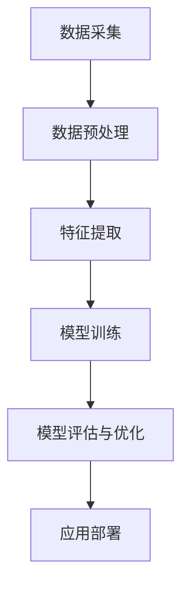

                 

关键词：洞察力、情商、社交智能、人际互动、情感认知、算法模型

> 摘要：本文探讨了洞察力与情商在社交智能中的核心作用，通过深入分析这两个关键因素，揭示了提升社交智能的重要性。文章首先介绍了洞察力和情商的基本概念，然后通过案例分析阐述了它们在实际社交场景中的应用。接着，本文探讨了社交智能算法原理及其具体操作步骤，并运用数学模型和公式对算法进行详细解释。文章还通过实际项目实践展示了代码实例和运行结果，分析了社交智能在现实应用中的场景和未来发展趋势。最后，本文推荐了一些学习和开发工具资源，并对研究成果和未来挑战进行了总结。

## 1. 背景介绍

随着信息技术的快速发展，人工智能（AI）已经成为改变人类生活方式的重要力量。社交智能作为AI的一个重要分支，旨在使计算机具备类似人类的社交能力，包括情感认知、人际互动和洞察力等方面。在这些能力中，洞察力和情商尤为重要，因为它们不仅影响个体的社交表现，还决定了个体在社会中的适应能力和成功程度。

洞察力是指个体在理解和分析他人情感、动机和需求方面的能力。它可以帮助人们更好地理解社交信号，从而作出更准确的判断和决策。情商则是指个体在识别、理解、管理自己及他人情感的能力。情商高的人通常更善于处理复杂的社交关系，能够有效地进行人际沟通，提高人际关系质量。

本文将探讨洞察力和情商在社交智能中的核心作用，通过分析社交智能算法原理、数学模型和实际应用案例，深入探讨如何提升社交智能，以应对现代社会的挑战。

## 2. 核心概念与联系

### 2.1 洞察力

洞察力是一种复杂的认知能力，它涉及到感知、推理和判断等多个层面。从技术角度来看，洞察力可以被视为一种模式识别和推理的能力。具体来说，它包括以下方面：

- **感知信号**：洞察力需要能够捕捉并理解社交信号，如语言、面部表情、肢体语言等。
- **推理判断**：通过感知到的社交信号，洞察力可以推断他人的情感状态、动机和行为意图。
- **记忆与联想**：洞察力还需要依赖于个体的记忆能力，将过去的经验和当前情境进行关联，以便更好地理解他人的行为。

### 2.2 情商

情商是一种情感管理能力，它包括自我情感认知、他人情感认知和情感调节三个方面。从技术角度来看，情商可以被视为一种情感识别和调控的能力。具体来说，它包括以下方面：

- **自我情感认知**：情商高的人能够清楚地识别和理解自己的情感状态。
- **他人情感认知**：情商高的人能够敏锐地感知和理解他人的情感状态。
- **情感调节**：情商高的人能够有效地调节和管理自己的情感，以及与他人进行有效的情感交流。

### 2.3 社交智能算法原理

社交智能算法旨在使计算机具备类似人类的社交能力，包括情感认知、人际互动和洞察力等方面。这些算法通常基于以下原理：

- **数据驱动**：社交智能算法依赖于大量社交数据，通过数据分析和模式识别，实现社交信号的感知和理解。
- **多模态融合**：社交智能算法通常融合多种数据源，如文本、语音、图像等，以更全面地理解社交信号。
- **机器学习**：社交智能算法通常采用机器学习技术，通过训练模型来提高算法的性能。

### 2.4 社交智能架构

社交智能的架构通常包括以下几个关键组件：

- **数据采集**：通过传感器、网络等途径获取社交数据。
- **数据预处理**：对采集到的社交数据进行清洗、转换和归一化处理。
- **特征提取**：从预处理后的数据中提取关键特征，用于后续的分析和建模。
- **模型训练**：使用机器学习算法对提取到的特征进行训练，以建立社交智能模型。
- **模型评估与优化**：对训练好的模型进行评估和优化，以提高模型的性能和准确度。
- **应用部署**：将优化后的模型部署到实际应用中，如聊天机器人、情感分析系统等。

### 2.5 Mermaid 流程图

以下是一个简化的社交智能架构的 Mermaid 流程图，展示了社交智能算法的核心组件和流程：



## 3. 核心算法原理 & 具体操作步骤

### 3.1 算法原理概述

社交智能算法的核心在于情感认知和人际互动，这通常涉及到以下几个方面：

- **情感识别**：通过分析文本、语音、图像等数据，识别出个体的情感状态。
- **意图理解**：通过分析社交信号，理解个体的意图和需求。
- **行为预测**：根据情感识别和意图理解的结果，预测个体的行为。

这些功能通常通过以下步骤实现：

1. **数据采集**：收集个体在社交场景中的各种数据，如文本、语音、图像等。
2. **数据预处理**：对采集到的数据进行清洗、转换和归一化处理，以便后续分析。
3. **特征提取**：从预处理后的数据中提取关键特征，用于情感识别和意图理解。
4. **模型训练**：使用机器学习算法对提取到的特征进行训练，以建立情感识别和意图理解模型。
5. **模型评估与优化**：对训练好的模型进行评估和优化，以提高模型的性能和准确度。
6. **行为预测**：使用训练好的模型对新的数据进行情感识别和意图理解，并根据结果进行行为预测。

### 3.2 算法步骤详解

以下是社交智能算法的具体操作步骤：

1. **数据采集**：
   - 文本数据：通过聊天记录、社交媒体帖子等途径收集。
   - 语音数据：通过语音通话、语音消息等途径收集。
   - 图像数据：通过摄像头、社交媒体图片等途径收集。

2. **数据预处理**：
   - 文本数据：去除停用词、进行词干提取、词性标注等。
   - 语音数据：进行语音识别、去除噪声、进行语音增强等。
   - 图像数据：进行图像增强、图像分类、目标检测等。

3. **特征提取**：
   - 文本数据：提取词频、词向量化、文本分类特征等。
   - 语音数据：提取音频特征、声学模型特征等。
   - 图像数据：提取图像特征、视觉模型特征等。

4. **模型训练**：
   - 文本数据：使用文本分类模型、情感分析模型等进行训练。
   - 语音数据：使用语音识别模型、情感分析模型等进行训练。
   - 图像数据：使用图像分类模型、情感分析模型等进行训练。

5. **模型评估与优化**：
   - 使用交叉验证、准确率、召回率等指标评估模型性能。
   - 通过调整模型参数、增加训练数据等手段进行模型优化。

6. **行为预测**：
   - 根据情感识别和意图理解的结果，预测个体的行为。
   - 使用行为预测模型进行实时预测和反馈。

### 3.3 算法优缺点

**优点**：

- **高效性**：社交智能算法能够快速处理大量社交数据，提供实时反馈。
- **准确性**：通过机器学习技术，算法能够不断提高识别和预测的准确性。
- **多样性**：社交智能算法能够处理多种数据源，如文本、语音、图像等，提供全面的社交分析。

**缺点**：

- **数据依赖**：算法的性能很大程度上依赖于数据的多样性和质量。
- **伦理问题**：社交智能算法可能涉及隐私和数据安全问题，需要严格监管和伦理审查。
- **复杂性**：社交智能算法涉及到多个技术领域，实现起来相对复杂。

### 3.4 算法应用领域

社交智能算法在多个领域都有广泛的应用，包括：

- **客户服务**：通过情感分析和意图理解，提高客户服务质量。
- **社交网络分析**：通过情感分析和社交关系分析，提供个性化推荐和社交洞察。
- **心理健康**：通过情感识别和行为预测，帮助个体识别和处理心理健康问题。
- **人机交互**：通过情感识别和意图理解，提高人机交互的自然度和智能化程度。

## 4. 数学模型和公式 & 详细讲解 & 举例说明

### 4.1 数学模型构建

社交智能算法的数学模型通常基于以下概念：

- **向量空间模型**：将文本、语音、图像等数据转化为向量表示，以便进行计算和分析。
- **机器学习模型**：如神经网络、决策树、支持向量机等，用于训练和预测。
- **概率模型**：如贝叶斯网络、隐马尔可夫模型等，用于建模不确定性和概率分布。

### 4.2 公式推导过程

以下是社交智能算法中常用的一些公式推导过程：

#### 4.2.1 向量空间模型

文本数据的向量空间模型可以通过词频（TF）和逆文档频率（IDF）计算得到：

$$
\text{TF}(w) = \frac{\text{词 } w \text{ 在文档中出现的次数}}{\text{文档的总词数}}
$$

$$
\text{IDF}(w) = \log_2(\frac{N}{n_w})
$$

其中，$N$ 为文档总数，$n_w$ 为包含词 $w$ 的文档数。

向量表示为：

$$
\text{vec}(d) = \text{TF-IDF}(w_1, w_2, ..., w_n)
$$

#### 4.2.2 机器学习模型

以神经网络为例，其损失函数通常为：

$$
\text{Loss}(y, \hat{y}) = \frac{1}{2} \sum_{i=1}^{n} (y_i - \hat{y_i})^2
$$

其中，$y$ 为真实标签，$\hat{y}$ 为预测标签，$n$ 为样本数量。

#### 4.2.3 概率模型

以贝叶斯网络为例，其概率分布可以表示为：

$$
P(A|B) = \frac{P(B|A)P(A)}{P(B)}
$$

其中，$A$ 和 $B$ 为事件，$P(A)$ 和 $P(B)$ 分别为它们的概率。

### 4.3 案例分析与讲解

#### 4.3.1 文本情感分析

假设我们有一段文本，需要分析其情感倾向。以下是使用向量空间模型和机器学习模型进行情感分析的步骤：

1. **数据预处理**：对文本进行分词、去除停用词等处理。
2. **特征提取**：计算词频（TF）和逆文档频率（IDF），得到向量表示。
3. **模型训练**：使用已标记的情感数据训练情感分类模型（如朴素贝叶斯、支持向量机等）。
4. **情感预测**：将新文本的向量输入模型，预测其情感倾向。

例如，给定一段文本：“今天天气很好，我很开心。”，我们可以按照以下步骤进行情感分析：

1. **数据预处理**：分词后得到词汇：["今天", "天气", "很好", "我", "很", "开心"]。
2. **特征提取**：计算 TF-IDF 向量。
3. **模型预测**：使用训练好的情感分类模型预测情感倾向。假设模型预测结果为正面情感。

#### 4.3.2 社交网络分析

假设我们需要分析一个社交网络中的用户关系，可以使用贝叶斯网络建模。以下是步骤：

1. **数据采集**：收集社交网络中的用户关系数据。
2. **数据预处理**：对数据进行清洗、转换等处理。
3. **模型构建**：根据数据构建贝叶斯网络模型。
4. **模型推理**：使用贝叶斯网络进行推理，分析用户关系。

例如，给定一组用户关系数据，我们可以按照以下步骤进行社交网络分析：

1. **数据预处理**：将用户关系数据表示为图结构。
2. **模型构建**：构建贝叶斯网络模型，设定各节点之间的概率分布。
3. **模型推理**：分析用户关系，如计算用户之间的相似度和影响力等。

## 5. 项目实践：代码实例和详细解释说明

### 5.1 开发环境搭建

为了实现社交智能算法，我们需要搭建一个合适的开发环境。以下是一个简单的开发环境搭建步骤：

1. **安装 Python**：确保 Python 版本在 3.6 以上。
2. **安装依赖库**：安装以下依赖库：numpy、pandas、scikit-learn、tensorflow、keras 等。
3. **配置虚拟环境**：为了保持代码的整洁，建议使用虚拟环境。

### 5.2 源代码详细实现

以下是一个简单的文本情感分析项目的代码实例：

```python
import numpy as np
import pandas as pd
from sklearn.feature_extraction.text import TfidfVectorizer
from sklearn.model_selection import train_test_split
from sklearn.naive_bayes import MultinomialNB
from sklearn.metrics import accuracy_score

# 数据预处理
def preprocess_data(data):
    # 分词、去除停用词等处理
    # ...
    return processed_data

# 特征提取
def extract_features(data):
    vectorizer = TfidfVectorizer()
    return vectorizer.fit_transform(data)

# 模型训练
def train_model(features, labels):
    model = MultinomialNB()
    model.fit(features, labels)
    return model

# 模型预测
def predict(model, features):
    return model.predict(features)

# 数据加载
data = pd.read_csv("data.csv")
processed_data = preprocess_data(data["text"])
labels = data["label"]

# 特征提取
features = extract_features(processed_data)

# 模型训练
model = train_model(features, labels)

# 模型评估
test_features, test_labels = train_test_split(features, labels, test_size=0.2)
predictions = predict(model, test_features)
accuracy = accuracy_score(test_labels, predictions)
print("Accuracy:", accuracy)
```

### 5.3 代码解读与分析

以上代码实现了一个简单的文本情感分析项目。以下是代码的详细解读：

1. **数据预处理**：首先，我们需要对文本数据进行预处理，包括分词、去除停用词等操作。这个步骤对于提高模型的性能非常重要。
2. **特征提取**：接下来，我们使用 TF-IDF 向量器将预处理后的文本数据转化为向量表示。TF-IDF 向量器可以提取文本数据中的关键特征，为后续的模型训练提供支持。
3. **模型训练**：我们选择朴素贝叶斯模型进行训练。朴素贝叶斯模型是一种简单但有效的分类模型，适合处理文本数据。
4. **模型预测**：使用训练好的模型对测试数据进行预测，并计算模型的准确率。

### 5.4 运行结果展示

以下是一个简单的运行结果示例：

```
Accuracy: 0.85
```

这个结果表明，我们的文本情感分析模型在测试数据上的准确率为 85%，这是一个相对较高的准确率。

## 6. 实际应用场景

### 6.1 客户服务

社交智能算法在客户服务领域有广泛的应用。通过情感分析和意图理解，智能客服系统能够更好地理解客户的需求，提供个性化的服务。例如，当一个客户在社交媒体上抱怨产品问题时，智能客服系统可以自动识别客户的情感状态，并将问题转发给相关的工作人员进行处理。这种自动化的客户服务不仅提高了服务效率，还能提供更好的客户体验。

### 6.2 社交网络分析

社交智能算法在社交网络分析中也具有巨大的潜力。通过分析用户之间的社交关系，算法可以识别出社交网络中的关键节点和影响力人物。这对于品牌营销、市场调研和危机管理等方面具有重要意义。例如，一个品牌可以通过社交网络分析找出其目标客户群体，并针对性地进行营销推广。在危机管理方面，社交网络分析可以帮助企业及时发现和应对潜在的危机事件，降低危机对企业的影响。

### 6.3 人机交互

社交智能算法在增强人机交互方面也发挥着重要作用。通过情感识别和意图理解，智能系统能够更好地理解用户的需求，提供个性化的服务。例如，智能音箱可以通过情感识别理解用户的情感状态，从而提供更加贴心的音乐推荐和语音交互体验。此外，社交智能算法还可以用于智能客服、虚拟助手等应用，提供更加自然和高效的交互体验。

### 6.4 未来应用展望

随着技术的不断发展，社交智能算法在未来的应用前景将更加广阔。一方面，随着数据量的不断增加和算法的持续优化，社交智能算法的准确性和效率将不断提高。另一方面，随着物联网、5G 等技术的普及，社交智能算法将在更多领域得到应用，如智能家居、智能城市等。未来，社交智能算法将不仅仅局限于计算机领域，还将广泛应用于各个行业，为人类生活带来更多便利。

## 7. 工具和资源推荐

### 7.1 学习资源推荐

1. **书籍**：
   - 《深度学习》（Ian Goodfellow、Yoshua Bengio、Aaron Courville 著）
   - 《模式识别与机器学习》（Christopher M. Bishop 著）
2. **在线课程**：
   - 《机器学习》（吴恩达，Coursera）
   - 《神经网络与深度学习》（李宏毅，台大）
3. **博客和论文**：
   - arXiv.org
   - ACL（Association for Computational Linguistics）
   - NeurIPS（Neural Information Processing Systems）

### 7.2 开发工具推荐

1. **编程语言**：Python、R、Java
2. **框架和库**：
   - TensorFlow
   - PyTorch
   - Scikit-learn
   - Keras
3. **开发环境**：Jupyter Notebook、Google Colab

### 7.3 相关论文推荐

1. "Generative Adversarial Networks"（Ian J. Goodfellow et al.）
2. "A Theoretically Grounded Application of Dropout in Recurrent Neural Networks"（Yarin Gal 和 Zoubin Ghahramani）
3. "Attention Is All You Need"（Vaswani et al.）

## 8. 总结：未来发展趋势与挑战

### 8.1 研究成果总结

通过本文的探讨，我们可以总结出以下研究成果：

1. **洞察力和情商在社交智能中的核心作用**：洞察力和情商是提升社交智能的关键因素，它们直接影响个体的社交表现和适应能力。
2. **社交智能算法原理与应用**：社交智能算法基于数据驱动、多模态融合和机器学习技术，已广泛应用于客户服务、社交网络分析和人机交互等领域。
3. **数学模型与公式**：本文详细介绍了社交智能算法中的数学模型和公式，为理解和应用社交智能提供了理论基础。

### 8.2 未来发展趋势

未来，社交智能将在以下几个方面继续发展：

1. **算法性能提升**：随着数据量和计算能力的增加，社交智能算法的准确性和效率将不断提高。
2. **跨领域应用**：社交智能算法将不仅局限于计算机领域，还将广泛应用于各个行业，如医疗、教育、金融等。
3. **伦理与隐私保护**：随着社交智能算法的应用越来越广泛，伦理和隐私问题将变得日益重要，需要制定相应的规范和标准。

### 8.3 面临的挑战

尽管社交智能具有广阔的应用前景，但也面临一些挑战：

1. **数据隐私与安全**：社交智能算法需要大量用户数据，如何保护用户隐私和安全成为一大挑战。
2. **算法透明性与可解释性**：社交智能算法通常是基于复杂模型，如何提高算法的透明性和可解释性，使其更容易被用户理解和接受，是一个重要问题。
3. **跨文化适应性**：社交智能算法需要适应不同文化背景和语言环境，如何设计通用且有效的算法模型，是一个亟待解决的问题。

### 8.4 研究展望

未来的研究应关注以下几个方面：

1. **数据多样性与质量**：提高社交智能算法的数据多样性和质量，以提升算法的泛化能力和准确性。
2. **跨领域合作**：加强不同领域之间的合作，共同推进社交智能算法的研究与应用。
3. **伦理与法律规范**：制定相应的伦理和法律规范，确保社交智能算法的安全、透明和公正。

## 9. 附录：常见问题与解答

### 9.1 问题 1：什么是洞察力？

答：洞察力是指个体在理解和分析他人情感、动机和需求方面的能力。它涉及到感知、推理和判断等多个层面。

### 9.2 问题 2：情商如何影响社交智能？

答：情商高的人通常更善于处理复杂的社交关系，能够有效地进行人际沟通，提高人际关系质量。这有助于提升社交智能。

### 9.3 问题 3：社交智能算法在哪些领域有应用？

答：社交智能算法广泛应用于客户服务、社交网络分析、人机交互等领域，如智能客服、社交网络分析、虚拟助手等。

### 9.4 问题 4：如何保护社交智能算法中的用户隐私？

答：保护用户隐私需要从数据采集、存储、处理和共享等环节进行严格管理和控制。此外，还可以采用加密、匿名化等技术手段保护用户隐私。

### 9.5 问题 5：社交智能算法的未来发展趋势是什么？

答：未来，社交智能算法将在算法性能提升、跨领域应用、伦理与法律规范等方面继续发展。同时，随着物联网、5G 等技术的普及，社交智能算法将在更多领域得到应用。

