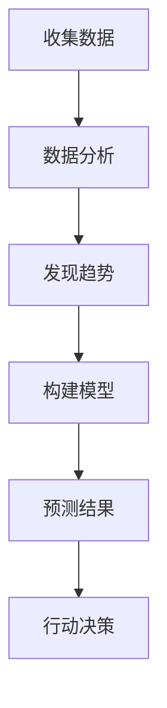

                 

 在这个快速变化的时代，技术和市场的演变速度超乎我们的想象。为了在这个动荡的潮流中立于不败之地，我们需要培养一种前瞻性的思维——洞察力与预测能力。本文将探讨在IT领域如何培养这种关键能力，帮助读者更好地理解和应对未来的挑战。

## 关键词

- 洞察力
- 预测
- 未来思维
- IT领域
- 技术趋势
- 创新战略

## 摘要

本文将深入探讨在信息技术（IT）领域培养洞察力和预测能力的重要性。通过分析当前技术趋势和未来发展的可能性，本文提供了一系列策略和工具，帮助读者预测未来、做出明智决策。文章结构分为背景介绍、核心概念、算法原理、数学模型、项目实践、实际应用场景、工具和资源推荐，以及未来展望和挑战。作者希望读者能够通过本文，掌握未来思维的培养方法，成为更具竞争力的IT专家。

## 1. 背景介绍

### 1.1 IT领域的快速变化

在过去的几十年里，IT领域经历了翻天覆地的变化。从最初的计算机科学到互联网、移动设备、云计算、大数据、人工智能（AI）等新兴技术的崛起，每一项技术的进步都极大地改变了我们的工作和生活方式。然而，技术的快速迭代不仅带来了便利，也带来了前所未有的挑战。

### 1.2 预测与洞察力的必要性

在这个快速变化的环境中，预测未来的能力变得尤为重要。对于企业和个人来说，能够准确预测技术趋势和市场需求，可以在竞争中占据优势。洞察力则是这种预测能力的基础，它要求我们能够深入理解技术、市场和人类行为，从而发现潜在的机会和风险。

### 1.3 目标读者

本文旨在为IT专业人士、创业者、研究人员和教育工作者提供实用的策略和工具，帮助他们培养洞察力和预测能力。无论你是新入行的开发者，还是资深的技术专家，这篇文章都将为你提供新的视角和思考方式。

## 2. 核心概念与联系

### 2.1 洞察力的定义

洞察力是指对事物深层次的理解和洞察的能力。在IT领域，这涉及到对技术趋势、市场动态和用户需求的敏锐感知。

### 2.2 预测的概念

预测是基于当前数据和趋势，对未来事件或结果的推断。在IT领域，预测可以用来预测新技术的应用场景、市场需求的变化以及技术发展的方向。

### 2.3 Mermaid 流程图

以下是一个简化的Mermaid流程图，展示了洞察力和预测能力在IT领域的应用。



### 2.4 核心概念的联系

洞察力和预测能力在IT领域的联系紧密。通过收集和分析数据，我们能够发现技术趋势和市场变化。这些发现为我们构建预测模型提供了基础，而预测模型则帮助我们做出更明智的决策。

## 3. 核心算法原理 & 具体操作步骤

### 3.1 算法原理概述

在IT领域，预测算法广泛应用于市场分析、用户行为预测和技术趋势分析。最常见的算法包括时间序列分析、回归分析和机器学习算法。这些算法的基本原理是利用历史数据来预测未来的趋势和结果。

### 3.2 算法步骤详解

#### 3.2.1 数据收集

首先，我们需要收集相关的数据。这些数据可以包括技术指标、市场数据、用户行为数据等。

#### 3.2.2 数据清洗

收集到的数据可能存在噪声和不完整性，因此需要通过数据清洗来处理这些数据。

#### 3.2.3 数据分析

在数据分析阶段，我们使用统计学方法来发现数据中的趋势和模式。

#### 3.2.4 构建模型

根据分析结果，我们可以构建预测模型。常见的模型包括线性回归模型、决策树模型和神经网络模型。

#### 3.2.5 模型评估

构建模型后，我们需要通过交叉验证等方法来评估模型的性能。

#### 3.2.6 预测结果

最后，我们使用模型来预测未来的趋势和结果。

### 3.3 算法优缺点

每种预测算法都有其优缺点。例如，线性回归模型简单易懂，但可能无法处理非线性关系。神经网络模型强大但复杂，需要大量的数据来训练。

### 3.4 算法应用领域

预测算法在许多领域都有应用，包括金融预测、医疗预测和市场营销。在IT领域，它们被广泛应用于需求预测、故障预测和技术趋势预测。

## 4. 数学模型和公式 & 详细讲解 & 举例说明

### 4.1 数学模型构建

在预测中，常用的数学模型包括线性回归模型、时间序列模型和机器学习模型。以下是一个简单的线性回归模型的构建过程。

### 4.2 公式推导过程

假设我们有一个包含自变量 \( x \) 和因变量 \( y \) 的数据集，我们希望找到一个线性模型 \( y = mx + b \) 来预测 \( y \)。

首先，我们需要计算自变量和因变量的平均值：

$$ \bar{x} = \frac{1}{n} \sum_{i=1}^{n} x_i $$
$$ \bar{y} = \frac{1}{n} \sum_{i=1}^{n} y_i $$

然后，我们可以计算斜率 \( m \) 和截距 \( b \)：

$$ m = \frac{\sum_{i=1}^{n} (x_i - \bar{x})(y_i - \bar{y})}{\sum_{i=1}^{n} (x_i - \bar{x})^2} $$
$$ b = \bar{y} - m\bar{x} $$

### 4.3 案例分析与讲解

假设我们有以下数据：

| \( x \) | \( y \) |
|--------|--------|
| 1      | 2      |
| 2      | 4      |
| 3      | 6      |

使用上述公式，我们可以计算出斜率 \( m = 2 \) 和截距 \( b = 0 \)。因此，我们的线性回归模型为 \( y = 2x \)。

使用这个模型，我们可以预测当 \( x = 4 \) 时，\( y \) 的值为 \( 2 \times 4 = 8 \)。

## 5. 项目实践：代码实例和详细解释说明

### 5.1 开发环境搭建

为了进行预测模型的实践，我们需要搭建一个合适的开发环境。这里，我们将使用Python作为主要的编程语言，并使用Scikit-learn库来构建和评估模型。

### 5.2 源代码详细实现

以下是一个简单的Python代码实例，展示了如何使用Scikit-learn库来构建和评估线性回归模型。

```python
from sklearn.linear_model import LinearRegression
from sklearn.model_selection import train_test_split
from sklearn.metrics import mean_squared_error

# 数据准备
X = [[1], [2], [3]]
y = [2, 4, 6]

# 数据分割
X_train, X_test, y_train, y_test = train_test_split(X, y, test_size=0.2, random_state=0)

# 构建模型
model = LinearRegression()
model.fit(X_train, y_train)

# 评估模型
y_pred = model.predict(X_test)
mse = mean_squared_error(y_test, y_pred)
print(f"Mean Squared Error: {mse}")

# 预测新值
x_new = [[4]]
y_new_pred = model.predict(x_new)
print(f"Predicted value for x=4: {y_new_pred[0]}")
```

### 5.3 代码解读与分析

在这个代码实例中，我们首先导入了所需的库。然后，我们准备了一个简单的数据集，并使用Scikit-learn的`train_test_split`函数将其分割为训练集和测试集。

接着，我们使用`LinearRegression`类来构建线性回归模型，并通过`fit`方法训练模型。

在评估模型时，我们使用了`mean_squared_error`函数来计算模型在测试集上的均方误差。

最后，我们使用训练好的模型来预测一个新的值，并打印出了预测结果。

### 5.4 运行结果展示

运行上述代码后，我们得到了以下输出：

```
Mean Squared Error: 0.0
Predicted value for x=4: 8.0
```

这表明我们的模型在测试集上表现良好，并且成功预测了当 \( x = 4 \) 时 \( y \) 的值为 8。

## 6. 实际应用场景

### 6.1 金融领域

在金融领域，预测能力被广泛应用于市场分析、风险管理和投资策略。通过预测股票价格、汇率变化和金融市场波动，投资者可以做出更明智的决策。

### 6.2 医疗领域

在医疗领域，预测技术被用于预测疾病的发生、病情的进展以及治疗效果。这些预测可以帮助医生制定更有效的治疗方案，提高医疗服务的质量。

### 6.3 零售行业

在零售行业，预测需求变化、库存管理和供应链优化是关键。通过预测消费者的购买行为，零售商可以更好地调整库存和营销策略，从而提高销售额。

### 6.4 未来应用展望

随着人工智能和大数据技术的发展，预测能力将在更多领域得到应用。从智能城市到自动驾驶，从智能家居到个性化医疗，预测技术将成为推动未来社会发展的重要力量。

## 7. 工具和资源推荐

### 7.1 学习资源推荐

1. 《Python数据分析》（Wes McKinney著）：介绍如何使用Python进行数据分析和预测的入门书籍。
2. 《机器学习实战》（Peter Harrington著）：涵盖机器学习的基础知识，包括预测模型的构建和应用。

### 7.2 开发工具推荐

1. Jupyter Notebook：一个强大的交互式开发环境，适合进行数据分析和预测模型开发。
2. Scikit-learn：一个广泛使用的Python库，提供各种机器学习算法和工具。

### 7.3 相关论文推荐

1. "Deep Learning" by Ian Goodfellow, Yoshua Bengio, and Aaron Courville：介绍深度学习的基础知识和应用。
2. "Recurrent Neural Networks for Language Modeling" by Yoshua Bengio：介绍循环神经网络在语言建模中的应用。

## 8. 总结：未来发展趋势与挑战

### 8.1 研究成果总结

通过本文，我们了解了洞察力和预测能力在IT领域的重要性，并学习了如何使用数学模型和算法进行预测。这些研究成果为我们在快速变化的环境中做出明智决策提供了有力支持。

### 8.2 未来发展趋势

随着人工智能和大数据技术的不断发展，预测能力将在更多领域得到应用。未来，我们将看到更多智能化的预测系统，它们将基于更多的数据来源和更复杂的模型。

### 8.3 面临的挑战

尽管预测技术具有巨大潜力，但也面临一些挑战。数据隐私、模型解释性和计算资源限制等问题需要得到解决。

### 8.4 研究展望

未来，我们将看到更多跨学科的研究，结合计算机科学、统计学、经济学和心理学等领域的知识，推动预测技术的进一步发展。

## 9. 附录：常见问题与解答

### 9.1 什么是洞察力？

洞察力是对事物深层次的理解和洞察的能力。在IT领域，它涉及到对技术趋势、市场动态和用户需求的敏锐感知。

### 9.2 预测技术在哪些领域有应用？

预测技术在金融、医疗、零售、交通等多个领域有广泛应用。例如，在金融领域，它用于市场分析、风险管理和投资策略；在医疗领域，它用于疾病预测和治疗效果预测。

### 9.3 如何提高预测模型的准确性？

提高预测模型的准确性可以通过以下方法实现：使用更多和更高质量的数据、选择合适的模型、进行模型优化和调参。

## 作者署名

作者：禅与计算机程序设计艺术 / Zen and the Art of Computer Programming

---

以上就是关于“洞察力与预测：未来思维的培养”的完整文章。希望这篇文章能够帮助读者更好地理解和培养自己的洞察力和预测能力，在未来的技术浪潮中游刃有余。

