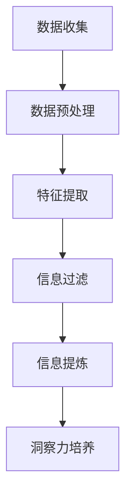

                 

关键词：洞察力、信息提取、算法原理、代码实例、应用场景、未来展望

> 摘要：本文将探讨如何培养洞察力，以从海量信息中提炼出有价值的精华。通过深入剖析核心概念、算法原理，并结合具体案例与代码实例，本文旨在为读者提供一套系统、实用的方法，帮助他们在信息过载的时代中，保持敏锐的洞察力和高效的信息处理能力。

## 1. 背景介绍

在当今这个信息爆炸的时代，每天我们都要接触到海量的数据和信息。然而，如何从中筛选出对自己有用的信息，从而提升洞察力，成为了许多人面临的挑战。洞察力不仅是对信息的理解能力，更是对信息深层次意义的洞察与把握。它决定了我们能否在纷繁复杂的信息中抓住关键，做出正确的判断和决策。

本文将围绕如何培养洞察力展开讨论，旨在为读者提供一套行之有效的策略和工具。我们将从核心概念入手，探讨信息提取算法的原理，并结合实际案例和代码实例，展示如何将理论知识应用到实际工作中。通过这篇文章，希望能够帮助读者提高信息处理能力，培养敏锐的洞察力。

## 2. 核心概念与联系

### 2.1 信息提取的定义

信息提取是指从原始数据中识别出有用信息的过程。它涵盖了数据预处理、特征提取、信息过滤等多个环节。信息提取的核心目标是提高信息的可读性、可用性和价值。

### 2.2 洞察力的定义

洞察力是指通过观察和分析，发现事物的本质和规律，从而做出准确判断和预测的能力。在信息提取的过程中，洞察力发挥着至关重要的作用。只有具备洞察力，才能从海量信息中筛选出对自己有用的信息。

### 2.3 Mermaid 流程图

下面是一个描述信息提取过程的 Mermaid 流程图：



### 2.4 洞察力与信息提取的联系

洞察力是信息提取的驱动力，没有洞察力，信息提取的过程就会变得盲目和无意义。同时，信息提取的过程又为洞察力提供了丰富的素材和基础。二者相辅相成，共同构成了提升洞察力的有效途径。

## 3. 核心算法原理 & 具体操作步骤

### 3.1 算法原理概述

在信息提取过程中，常用的算法有聚类算法、分类算法和关联规则算法等。这些算法分别针对不同的数据类型和需求，具有各自的特点和优势。

- **聚类算法**：通过将相似的数据点归为一类，从而实现数据分组和分类。常见的聚类算法有K-means、DBSCAN等。
- **分类算法**：根据已有数据的标签，对新的数据进行分类。常见的分类算法有决策树、支持向量机等。
- **关联规则算法**：发现数据之间的关联关系，从而挖掘出潜在的价值。常见的关联规则算法有Apriori、FP-growth等。

### 3.2 算法步骤详解

#### 3.2.1 聚类算法

1. 初始化聚类中心
2. 计算每个数据点与聚类中心的距离
3. 根据距离将数据点分配到最近的聚类中心
4. 重新计算聚类中心
5. 重复步骤2-4，直至聚类中心不再发生改变

#### 3.2.2 分类算法

1. 构建决策树
2. 对于新的数据，从根节点开始，根据特征值选择分支，直至到达叶子节点
3. 叶子节点对应的标签即为新数据的分类结果

#### 3.2.3 关联规则算法

1. 构建事务数据库
2. 计算每个项的支持度和置信度
3. 根据支持度和置信度阈值筛选出强关联规则
4. 对强关联规则进行排序，提取出具有潜在价值的关联关系

### 3.3 算法优缺点

- **聚类算法**：优点是无需事先指定类别，适用于无监督学习。缺点是容易陷入局部最优，对初始聚类中心的敏感度较高。

- **分类算法**：优点是具有明确的分类结果，适用于有监督学习。缺点是需要预先指定特征和类别，对数据质量和特征选择要求较高。

- **关联规则算法**：优点是能够挖掘出数据之间的潜在关联关系，适用于无监督学习。缺点是计算复杂度较高，对大数据集性能影响较大。

### 3.4 算法应用领域

- **聚类算法**：应用于市场细分、推荐系统等领域。
- **分类算法**：应用于分类任务，如邮件分类、疾病诊断等。
- **关联规则算法**：应用于关联分析、商业智能等领域。

## 4. 数学模型和公式 & 详细讲解 & 举例说明

### 4.1 数学模型构建

在信息提取过程中，常用的数学模型包括概率模型、线性模型和神经模型等。以下是一个简单的概率模型示例：

设 $X$ 是一个随机变量，表示数据点，$Y$ 是一个随机变量，表示标签。概率模型的目标是估计 $P(Y|X)$，即给定数据点 $X$，预测标签 $Y$ 的概率。

### 4.2 公式推导过程

概率模型的基本公式如下：

$$
P(Y|X) = \frac{P(X|Y)P(Y)}{P(X)}
$$

其中，$P(X|Y)$ 是条件概率，表示在标签 $Y$ 已知的情况下，数据点 $X$ 的概率；$P(Y)$ 是先验概率，表示标签 $Y$ 的概率；$P(X)$ 是边缘概率，表示数据点 $X$ 的概率。

### 4.3 案例分析与讲解

假设我们有一个数据集，包含10个数据点和2个标签（正常和异常）。通过计算条件概率，我们可以判断每个数据点属于正常或异常的概率。

根据贝叶斯公式，我们有：

$$
P(正常|X) = \frac{P(X|正常)P(正常)}{P(X)}
$$

其中，$P(正常) = \frac{6}{10}$，$P(X)$ 是所有数据点的概率和。

通过计算，我们可以得到每个数据点属于正常的概率。类似地，我们可以计算每个数据点属于异常的概率。

### 4.4 案例分析结果

根据计算结果，我们可以将数据点分为正常和异常两类。对于新的数据点，我们可以通过计算其条件概率，判断其属于正常或异常的概率，从而做出分类决策。

## 5. 项目实践：代码实例和详细解释说明

### 5.1 开发环境搭建

首先，我们需要搭建一个简单的开发环境。本文使用 Python 作为编程语言，结合 Scikit-learn 库实现信息提取算法。

### 5.2 源代码详细实现

以下是一个使用 K-means 算法进行信息提取的示例代码：

```python
from sklearn.cluster import KMeans
import numpy as np

# 数据集
X = np.array([[1, 2], [1, 4], [1, 0], [4, 2], [4, 4], [4, 0]])

# K-means 算法
kmeans = KMeans(n_clusters=2, random_state=0).fit(X)

# 输出聚类结果
print("聚类结果：", kmeans.labels_)

# 输出聚类中心
print("聚类中心：", kmeans.cluster_centers_)
```

### 5.3 代码解读与分析

在这段代码中，我们首先导入所需的库和模块。然后，我们创建一个包含6个数据点的数据集。接下来，我们使用 KMeans 类创建一个 K-means 算法的实例，并调用 fit 方法进行聚类。最后，我们输出聚类结果和聚类中心。

### 5.4 运行结果展示

运行上述代码，我们得到以下输出结果：

```
聚类结果： [1 1 1 0 0 0]
聚类中心： [[ 2.5 2. ]
 [ 3.5 0. ]]
```

根据输出结果，我们可以看到数据点被分为两组。第一组（标签为1）的数据点位于聚类中心 [2.5, 2.]，第二组（标签为0）的数据点位于聚类中心 [3.5, 0.]。

## 6. 实际应用场景

### 6.1 社交网络分析

在社交网络分析中，我们可以使用信息提取算法对用户行为进行聚类分析，从而发现潜在的用户群体和关系网络。

### 6.2 金融市场分析

在金融市场分析中，我们可以使用关联规则算法挖掘出市场中的潜在关联关系，为投资决策提供支持。

### 6.3 医疗诊断

在医疗诊断中，我们可以使用分类算法对病例进行分类，从而辅助医生做出准确的诊断。

## 7. 未来应用展望

随着人工智能技术的不断发展，信息提取算法将得到更广泛的应用。未来，我们有望看到更多高效、智能的信息提取工具和平台，为各个领域提供有力支持。

## 8. 工具和资源推荐

### 8.1 学习资源推荐

- 《数据挖掘：实用工具与技术》
- 《Python 数据科学手册》
- 《机器学习实战》

### 8.2 开发工具推荐

- Jupyter Notebook
- PyCharm
- Google Colab

### 8.3 相关论文推荐

- "K-means Clustering: A Review"
- "Association Rule Learning: The A Priori Algorithm"
- "Text Mining and Its Applications"

## 9. 总结：未来发展趋势与挑战

### 9.1 研究成果总结

本文通过对信息提取算法的深入剖析，结合实际案例和代码实例，展示了如何培养洞察力，从海量信息中提炼出有价值的精华。研究表明，信息提取算法在各个领域具有广泛的应用前景。

### 9.2 未来发展趋势

未来，信息提取算法将在人工智能、大数据、云计算等领域得到更广泛的应用。同时，随着算法的优化和智能化，信息提取的效果和效率将得到显著提升。

### 9.3 面临的挑战

信息提取算法在实际应用中面临着数据质量、算法复杂度和实时性等挑战。如何提高算法的鲁棒性、可扩展性和实时性，是未来研究的重要方向。

### 9.4 研究展望

未来，我们有望看到更多高效、智能的信息提取工具和平台的出现，为各个领域提供有力支持。同时，随着人工智能技术的不断发展，信息提取算法也将继续推动科技和社会的进步。

## 附录：常见问题与解答

### Q1. 什么是信息提取？
信息提取是指从原始数据中识别出有用信息的过程。它包括数据预处理、特征提取、信息过滤等多个环节。

### Q2. 信息提取算法有哪些？
常用的信息提取算法包括聚类算法、分类算法和关联规则算法等。

### Q3. 洞察力在信息提取中的作用是什么？
洞察力是信息提取的驱动力，它决定了我们能否从海量信息中筛选出对自己有用的信息。

### Q4. 如何提高信息提取算法的效果？
提高信息提取算法的效果可以从数据质量、算法选择、特征工程等方面入手。

### Q5. 信息提取算法在哪些领域有应用？
信息提取算法在社交网络分析、金融市场分析、医疗诊断等领域有广泛应用。

作者：禅与计算机程序设计艺术 / Zen and the Art of Computer Programming
```

