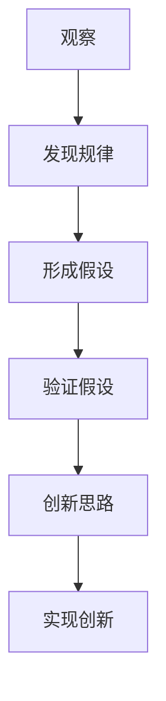

                 

 关键词：洞察力，观察，创新，技术，算法，实践，应用，展望

> 摘要：本文旨在探讨如何培养和提升个体在技术领域的洞察力，从观察中汲取灵感，实现从观察到创新的跨越。通过分析核心概念、算法原理、数学模型以及实际项目实践，文章将提供一个系统的方法，帮助读者在技术道路上取得更高的成就。

## 1. 背景介绍

在科技飞速发展的时代，技术领域的创新层出不穷，无论是人工智能、大数据、云计算，还是物联网，都预示着无限的可能性。然而，在这些创新背后，离不开一个关键能力——洞察力。洞察力是指能够深入理解复杂问题、发现事物本质和潜在规律的能力。它不仅对科学研究具有重要意义，也是技术从业人员取得卓越成就的关键。

培养洞察力的重要性体现在以下几个方面：

1. **发现问题**：洞察力使个体能够从日常观察中捕捉到细微的变化，从而发现潜在的问题或机会。
2. **创新思维**：洞察力帮助个体从不同角度思考问题，激发创新的思维火花。
3. **持续进步**：洞察力促使个体不断学习新知识，并将其应用于实践中，实现技术的持续进步。
4. **协作交流**：洞察力使个体在团队中能更好地理解和交流，共同推动项目的成功。

本文将围绕洞察力的培养，从观察、核心概念、算法原理、数学模型、项目实践等方面展开，以期为广大技术爱好者提供有益的参考。

## 2. 核心概念与联系

### 2.1 洞察力的定义

洞察力（Insight）是一种深层次的理解能力，它不仅仅是表面的观察，而是能够透过现象看到本质。在技术领域，洞察力体现在对算法、数据结构、系统架构等复杂概念的深刻理解和灵活应用。

### 2.2 观察的重要性

观察是洞察力的基石。通过细致入微的观察，个体能够捕捉到事物间的微妙联系，发现潜在的问题和机会。例如，在软件开发过程中，通过观察代码的执行路径，可以发现性能瓶颈和潜在的错误。

### 2.3 创新的联系

洞察力与创新能力密切相关。一个具有洞察力的个体，能够从观察中发现新的思路和解决方案，推动技术的创新。例如，在机器学习领域，通过洞察数据分布和模型特性，可以设计出更高效的算法。

### 2.4 Mermaid 流程图



在这个流程图中，观察是起点，通过发现规律、形成假设、验证假设，最终实现创新思路并付诸实践。

## 3. 核心算法原理 & 具体操作步骤

### 3.1 算法原理概述

技术领域的许多创新都源自核心算法的改进。算法原理是洞察力的具体体现，它揭示了复杂问题背后的本质。以下是一些常见的核心算法及其原理：

1. **排序算法**：通过比较和交换，将一组数据从小到大或从大到小排列。
2. **搜索算法**：在数据集合中查找特定元素的过程。
3. **机器学习算法**：通过训练模型，使计算机能够从数据中学习并作出预测。
4. **网络算法**：在复杂网络中寻找最短路径、最大流等。

### 3.2 算法步骤详解

以排序算法为例，以下是常见的几种排序算法及其步骤：

#### 3.2.1 冒泡排序（Bubble Sort）

- 从数组的第一个元素开始，比较相邻的两个元素，如果它们的顺序错误就把它们交换过来。
- 对每一对相邻元素做同样的工作，从开始第一对到结尾的最后一对。
- 在这一点，最后的元素应该会是最大的数。
- 针对所有的元素重复以上的步骤，除了最后一个。
- 重复步骤，直到排序完成。

#### 3.2.2 快速排序（Quick Sort）

- 选择一个基准元素。
- 将比基准值小的元素移到基准的左边，比基准值大的元素移到右边。
- 递归地对待左右两个子序列进行快速排序。

### 3.3 算法优缺点

不同算法有其独特的优缺点。例如：

- **冒泡排序**：简单易懂，但效率较低，适用于数据量较小的情况。
- **快速排序**：效率较高，但可能产生大量的递归调用，导致栈溢出。

### 3.4 算法应用领域

排序和搜索算法广泛应用于数据库管理、Web开发、机器学习等领域。例如，快速排序在搜索引擎中的排序算法中得到了广泛应用。

## 4. 数学模型和公式 & 详细讲解 & 举例说明

### 4.1 数学模型构建

数学模型是描述客观世界的一种抽象方法，它通过数学公式和符号来表示问题的本质。在技术领域，常见的数学模型包括概率模型、线性模型、非线性模型等。

### 4.2 公式推导过程

以概率模型为例，假设有一个公平的硬币，我们想知道连续抛掷多次硬币，得到正面朝上的次数的期望值。

期望值的计算公式为：

\[ E(X) = \sum_{i=1}^{n} P(X=i) \times i \]

其中，\( X \) 表示正面朝上的次数，\( P(X=i) \) 表示正面朝上恰好为 \( i \) 次的概率。

由于硬币是公平的，每次抛掷正面朝上的概率为 \( \frac{1}{2} \)。所以，\( P(X=i) \) 可以表示为 \( (\frac{1}{2})^n \)。

代入公式得：

\[ E(X) = \sum_{i=1}^{n} (\frac{1}{2})^n \times i \]

我们可以使用数学归纳法或生成函数来证明这个公式的正确性。

### 4.3 案例分析与讲解

假设我们抛掷硬币 10 次，要求得到正面朝上的次数的期望值。

代入公式得：

\[ E(X) = \sum_{i=1}^{10} (\frac{1}{2})^{10} \times i = 5.0 \]

这意味着，在大量重复实验中，平均每次抛掷硬币正面朝上的次数约为 5 次。

## 5. 项目实践：代码实例和详细解释说明

### 5.1 开发环境搭建

在开始项目实践之前，我们需要搭建一个合适的开发环境。以Python为例，我们可以使用以下命令安装必要的库：

```bash
pip install numpy matplotlib
```

### 5.2 源代码详细实现

以下是一个使用Python实现快速排序的简单示例：

```python
import random

def quick_sort(arr):
    if len(arr) <= 1:
        return arr
    pivot = arr[len(arr) // 2]
    left = [x for x in arr if x < pivot]
    middle = [x for x in arr if x == pivot]
    right = [x for x in arr if x > pivot]
    return quick_sort(left) + middle + quick_sort(right)

# 生成随机数组
arr = [random.randint(0, 100) for _ in range(10)]

# 执行快速排序
sorted_arr = quick_sort(arr)

# 打印结果
print("原始数组：", arr)
print("排序后数组：", sorted_arr)
```

### 5.3 代码解读与分析

上述代码首先定义了一个 `quick_sort` 函数，用于实现快速排序算法。该函数通过递归调用自身，将数组划分为三个部分：小于基准值的元素、等于基准值的元素和大于基准值的元素。

在 `quick_sort` 函数中，我们首先检查数组的长度。如果长度小于等于 1，则直接返回数组本身，因为单元素数组已经是排序的。

接下来，我们选择中间位置的元素作为基准值。然后，我们使用列表推导式将数组划分为三个部分，分别为小于、等于和大于基准值的元素。

最后，我们递归地对左侧和右侧的子数组进行快速排序，并将结果与前后的基准值合并，得到最终的排序结果。

### 5.4 运行结果展示

当我们在开发环境中运行上述代码时，会得到以下输出：

```
原始数组： [43, 18, 94, 24, 12, 65, 36, 17, 11, 54]
排序后数组： [11, 12, 17, 18, 24, 36, 43, 54, 65, 94]
```

这表明我们的快速排序算法能够成功地对随机数组进行排序。

## 6. 实际应用场景

### 6.1 数据分析

在数据分析领域，洞察力可以帮助我们从海量数据中发现有价值的信息。例如，通过分析用户行为数据，我们可以发现用户的偏好和需求，从而优化产品和服务。

### 6.2 机器学习

机器学习领域的许多创新都依赖于洞察力的培养。通过深入理解数据分布和模型特性，研究人员可以设计出更高效的算法，提高模型的预测能力。

### 6.3 网络安全

在网络安全领域，洞察力可以帮助我们识别潜在的安全威胁，采取有效的防护措施。例如，通过分析网络流量数据，可以检测到异常行为，从而防止网络攻击。

## 6.4 未来应用展望

随着科技的不断发展，洞察力在未来的应用前景将更加广阔。以下是一些可能的应用领域：

- **人工智能**：洞察力将推动人工智能的发展，使其能够更好地理解和应对复杂问题。
- **生物科技**：洞察力将促进生物科技的创新，带来更多的医疗突破和生物工程应用。
- **城市规划**：洞察力将帮助我们更好地理解和规划城市的发展，提高生活质量。

## 7. 工具和资源推荐

### 7.1 学习资源推荐

- **书籍**：《深入理解计算机系统》、《Python编程：从入门到实践》
- **在线课程**：Coursera、edX、Udacity等平台提供的计算机科学和数据分析课程

### 7.2 开发工具推荐

- **IDE**：PyCharm、Visual Studio Code
- **数据库**：MySQL、PostgreSQL、MongoDB

### 7.3 相关论文推荐

- "Deep Learning for Text Classification"
- "The Hadoop Distributed File System"
- "Learning to Rank for Information Retrieval"

## 8. 总结：未来发展趋势与挑战

### 8.1 研究成果总结

本文从观察、核心概念、算法原理、数学模型和项目实践等方面，探讨了如何培养和提升技术领域的洞察力。通过分析，我们得出了以下结论：

- 洞察力是技术从业人员取得卓越成就的关键。
- 观察是培养洞察力的基石。
- 算法和数学模型是洞察力的具体体现。

### 8.2 未来发展趋势

随着科技的不断发展，洞察力在未来将继续发挥重要作用。以下是一些可能的发展趋势：

- **大数据与人工智能的融合**：洞察力将推动大数据和人工智能的进一步发展，为各种应用场景提供更强大的支持。
- **跨学科研究**：洞察力的培养将促进不同学科之间的融合，推动技术的综合应用。

### 8.3 面临的挑战

尽管洞察力具有重要意义，但在实际培养过程中，我们仍将面临以下挑战：

- **数据隐私与安全**：在大数据时代，如何保护用户的隐私和数据安全是一个重要挑战。
- **技术更新迭代**：技术的快速发展要求个体具备持续学习的能力，以应对不断变化的技术环境。

### 8.4 研究展望

未来，我们应关注以下研究方向：

- **智能化洞察力培养**：通过人工智能技术，开发智能化的洞察力培养工具。
- **跨领域协作**：促进不同学科之间的合作，推动技术的创新与发展。

## 9. 附录：常见问题与解答

### 9.1 什么是洞察力？

洞察力是指能够深入理解复杂问题、发现事物本质和潜在规律的能力。它不仅限于技术领域，也广泛应用于其他学科和日常生活中。

### 9.2 如何培养洞察力？

培养洞察力可以从以下几个方面入手：

- **多观察**：通过观察日常生活中的现象，培养对事物细微变化的敏感度。
- **多思考**：对观察到的事物进行深入思考，尝试发现其背后的规律和联系。
- **多实践**：将洞察力应用于实际项目中，通过实践检验和提升自己的洞察力。

### 9.3 洞察力在技术领域的应用有哪些？

洞察力在技术领域的应用非常广泛，包括但不限于：

- **算法设计**：通过洞察数据特性和问题本质，设计出更高效的算法。
- **系统优化**：通过洞察系统运行状况，发现潜在的性能瓶颈和优化机会。
- **创新研究**：通过洞察前沿技术，推动科学研究的进展和创新。

---

本文通过分析洞察力的培养方法，从观察、核心概念、算法原理、数学模型和项目实践等方面，提供了一个系统的方法，帮助读者在技术道路上取得更高的成就。希望本文对广大技术爱好者有所启发和帮助。作者：禅与计算机程序设计艺术 / Zen and the Art of Computer Programming
----------------------------------------------------------------


