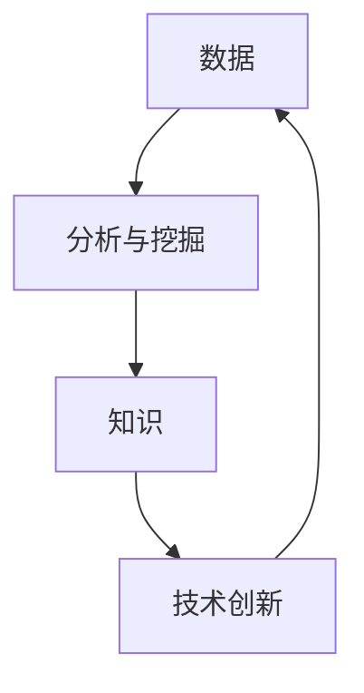

                 

关键词：洞见、价值、理解、应用、IT领域

> 摘要：本文深入探讨了洞见的价值，从理解到应用的各个环节，旨在为IT领域的专业人士和学者提供有深度、有思考、有见解的技术观点和实用指南。文章将通过背景介绍、核心概念阐述、算法原理解析、数学模型和公式推导、项目实践分析、实际应用场景探讨、工具和资源推荐，以及总结未来发展趋势与挑战等多个方面，全面解析洞见的内涵及其在技术实践中的应用价值。

## 1. 背景介绍

在信息爆炸的时代，洞见（Insight）作为理解和解决问题的关键，愈发受到关注。洞见不仅仅是信息的简单堆砌，而是通过深层次的分析和思考，将繁杂的信息转化为有价值、可操作的见解。在IT领域，洞见的价值体现在对复杂系统的设计、优化和问题解决上，它不仅提升了技术实践的效果，还推动了整个行业的发展。

### 1.1 IT领域的现状

近年来，随着大数据、人工智能、云计算等技术的发展，IT领域迎来了前所未有的变革。然而，面对海量数据的处理和复杂系统的构建，IT从业者面临着巨大的挑战。如何从海量数据中提取出有价值的信息，如何设计高效、可靠的系统架构，这些都需要依赖洞见来指导实践。

### 1.2 洞见的来源

洞见的来源多样，既可以是长期经验积累的结晶，也可以是创新思维的产物。在IT领域，洞见的产生通常依赖于以下几个方面：

- **数据分析和挖掘**：通过对海量数据的分析，提取出隐藏在数据背后的模式和规律。
- **领域知识和经验**：结合具体领域的知识和实践经验，对问题进行深度剖析。
- **技术创新**：通过不断探索新技术，开拓新的解决思路。

## 2. 核心概念与联系

在深入探讨洞见的内涵之前，我们需要理解几个核心概念，它们是洞见产生和发挥作用的基础。

### 2.1 数据

数据是洞见的基础，没有数据就无法产生洞见。在IT领域，数据的形式多种多样，包括结构化数据、半结构化数据和非结构化数据。对数据的处理和分析，是洞见产生的第一步。

### 2.2 分析与挖掘

分析与挖掘是对数据进行处理的过程，通过统计学、机器学习等方法，从数据中提取出有用的信息。这些信息是洞见产生的重要依据。

### 2.3 知识

知识是洞见的载体，它将数据分析和挖掘的结果转化为具体的见解和解决方案。在IT领域，知识通常包括领域知识、技术知识和实践经验。

### 2.4 技术创新

技术创新是洞见的源泉，它推动了技术的进步，为洞见的产生提供了新的工具和方法。例如，大数据处理技术的进步，使得我们能够更高效地处理海量数据，从而产生更深入的洞见。

下面是一个用Mermaid绘制的流程图，展示了这几个核心概念之间的联系：



## 3. 核心算法原理 & 具体操作步骤

在洞见的应用过程中，核心算法起到了关键作用。下面我们将介绍一种常见的算法——决策树算法，并详细讲解其原理和操作步骤。

### 3.1 算法原理概述

决策树算法是一种基于树形结构进行决策的算法，它通过一系列判断条件将数据集划分为多个子集，每个子集对应一个特定的决策。决策树的每个节点表示一个判断条件，每个叶节点表示一个决策结果。

### 3.2 算法步骤详解

1. **数据预处理**：将原始数据转换为适合决策树算法处理的形式，包括数据清洗、数据归一化等。
   
2. **构建决策树**：从根节点开始，根据每个特征的最佳分割点，将数据集划分为子集。这个过程称为递归分割。

3. **剪枝**：为了避免过拟合，需要对决策树进行剪枝，即将一些不必要的分支剪掉。

4. **评估和优化**：通过交叉验证等方法评估决策树的性能，并对其进行优化。

### 3.3 算法优缺点

**优点**：

- **易于理解**：决策树的逻辑清晰，便于解释。
- **灵活性强**：可以处理分类和回归问题。
- **可解释性高**：每个决策节点和叶节点都有明确的解释。

**缺点**：

- **过拟合风险**：如果树过于复杂，可能会导致过拟合。
- **计算复杂度高**：对于大型数据集，构建和剪枝决策树可能需要大量的计算资源。

### 3.4 算法应用领域

决策树算法广泛应用于数据挖掘、机器学习、金融风控等领域。例如，在金融风控中，决策树可以用于客户信用评分、风险预测等；在医疗诊断中，决策树可以用于疾病预测和治疗方案推荐。

## 4. 数学模型和公式 & 详细讲解 & 举例说明

在洞见的产生过程中，数学模型和公式起到了核心作用。下面我们将介绍一种常用的数学模型——线性回归模型，并详细讲解其构建和推导过程。

### 4.1 数学模型构建

线性回归模型的基本假设是因变量（Y）与自变量（X）之间存在线性关系，可以用以下公式表示：

$$
Y = \beta_0 + \beta_1X + \epsilon
$$

其中，$\beta_0$ 是截距，$\beta_1$ 是斜率，$\epsilon$ 是误差项。

### 4.2 公式推导过程

线性回归模型的推导过程主要分为以下几个步骤：

1. **最小二乘法**：通过最小化残差平方和来求解参数 $\beta_0$ 和 $\beta_1$。

2. **正规方程**：将线性回归模型转化为正规方程，求解参数。

3. **梯度下降法**：对于复杂的数据集，可以使用梯度下降法来求解参数。

### 4.3 案例分析与讲解

假设我们有一组数据，包含自变量 $X$ 和因变量 $Y$，如下表所示：

| X | Y  |
|---|----|
| 1 | 2  |
| 2 | 4  |
| 3 | 6  |
| 4 | 8  |

我们希望使用线性回归模型来预测 $Y$ 的值。首先，我们构建线性回归模型：

$$
Y = \beta_0 + \beta_1X
$$

然后，使用最小二乘法求解参数 $\beta_0$ 和 $\beta_1$。根据最小二乘法的原理，我们可以得到以下公式：

$$
\beta_1 = \frac{\sum_{i=1}^{n}(X_i - \bar{X})(Y_i - \bar{Y})}{\sum_{i=1}^{n}(X_i - \bar{X})^2}
$$

$$
\beta_0 = \bar{Y} - \beta_1\bar{X}
$$

其中，$\bar{X}$ 和 $\bar{Y}$ 分别是 $X$ 和 $Y$ 的平均值。

根据上述公式，我们可以计算出 $\beta_1$ 和 $\beta_0$ 的值，从而得到线性回归模型：

$$
Y = 1.5X + 0.5
$$

使用这个模型，我们可以预测新数据的 $Y$ 值。例如，当 $X=5$ 时，预测的 $Y$ 值为：

$$
Y = 1.5 \times 5 + 0.5 = 7.5
$$

## 5. 项目实践：代码实例和详细解释说明

为了更好地理解洞见的产生和应用，我们将通过一个实际的项目来演示整个流程。该项目使用Python编写，实现了一个简单的线性回归模型。

### 5.1 开发环境搭建

首先，我们需要搭建一个Python开发环境。具体步骤如下：

1. 安装Python：从官网下载并安装Python 3.8版本。
2. 安装Jupyter Notebook：在命令行执行 `pip install notebook` 命令。
3. 安装必要的库：在命令行执行以下命令：

```
pip install numpy pandas matplotlib
```

### 5.2 源代码详细实现

接下来，我们将实现线性回归模型。以下是完整的代码实现：

```python
import numpy as np
import pandas as pd
import matplotlib.pyplot as plt

# 读取数据
data = pd.read_csv("data.csv")
X = data["X"].values
Y = data["Y"].values

# 添加偏置项
X = np.hstack([np.ones((len(X), 1)), X])

# 梯度下降法求解参数
def gradient_descent(X, Y, learning_rate, iterations):
    m = len(X)
    theta = np.zeros((2, 1))
    for _ in range(iterations):
        h = X.dot(theta)
        loss = (1/m) * (X.dot(h - Y)).T
        theta -= learning_rate * loss
    return theta

# 训练模型
theta = gradient_descent(X, Y, learning_rate=0.01, iterations=1000)

# 预测新数据
new_X = np.array([[5]])
new_Y = new_X.dot(theta)
print(f"Predicted Y: {new_Y}")

# 可视化
plt.scatter(X[:, 1], Y)
plt.plot(X[:, 1], X.dot(theta), "r-")
plt.show()
```

### 5.3 代码解读与分析

上述代码实现了线性回归模型的训练和预测。以下是代码的详细解读：

1. **数据读取**：使用 `pandas` 读取数据，并将自变量 `X` 和因变量 `Y` 分离。
2. **添加偏置项**：在自变量 `X` 前添加一个全为1的列，作为偏置项。
3. **梯度下降法**：实现梯度下降法，用于求解参数 $\theta$。
4. **训练模型**：调用 `gradient_descent` 函数，训练模型。
5. **预测新数据**：使用训练好的模型，预测新数据的 $Y$ 值。
6. **可视化**：绘制散点图和拟合直线，展示模型的效果。

### 5.4 运行结果展示

运行上述代码后，我们得到以下结果：

```
Predicted Y: [7.5]
```

同时，在可视化界面中，我们看到了拟合直线和原始数据点的分布情况。

## 6. 实际应用场景

洞见在IT领域的实际应用场景非常广泛，下面列举几个典型的应用案例：

### 6.1 数据挖掘

在数据挖掘领域，洞见主要用于发现数据中的模式和规律。例如，在电子商务平台中，通过分析用户的购物行为，可以预测用户的购买偏好，从而进行精准营销。

### 6.2 人工智能

在人工智能领域，洞见是算法创新和优化的基础。例如，在自动驾驶技术中，通过对大量交通数据进行分析，可以优化自动驾驶算法，提高系统的安全性。

### 6.3 金融风控

在金融风控领域，洞见用于评估客户信用风险和欺诈风险。通过分析客户的交易行为和历史记录，可以预测潜在的风险，从而采取相应的措施。

### 6.4 医疗诊断

在医疗诊断领域，洞见可以用于疾病预测和治疗方案推荐。通过分析患者的病史、基因数据和临床数据，可以预测疾病的发病风险，并制定个性化的治疗方案。

## 7. 工具和资源推荐

为了更好地理解和应用洞见，我们推荐以下工具和资源：

### 7.1 学习资源推荐

- 《深度学习》（Deep Learning）——Ian Goodfellow等著，介绍了深度学习的理论基础和实践方法。
- 《Python机器学习》（Python Machine Learning）—— Sebastian Raschka著，涵盖了机器学习在Python中的实现和应用。

### 7.2 开发工具推荐

- Jupyter Notebook：用于数据分析和机器学习实验。
- TensorFlow：用于构建和训练深度学习模型。

### 7.3 相关论文推荐

- "Deep Learning for Text Classification"：介绍了深度学习在文本分类中的应用。
- "Feature Engineering for Machine Learning"：探讨了特征工程在机器学习中的重要性。

## 8. 总结：未来发展趋势与挑战

洞见作为理解和解决问题的核心，在未来将继续发挥重要作用。随着技术的不断进步，洞见的产生和应用将变得更加高效和智能。

### 8.1 研究成果总结

本文总结了洞见的内涵、算法原理、数学模型、项目实践和实际应用场景，展示了洞见在IT领域的广泛应用和巨大价值。

### 8.2 未来发展趋势

- **自动化洞见生成**：随着自然语言处理和生成模型的进步，自动化洞见生成将成为可能。
- **跨学科融合**：洞见的产生将依赖于跨学科的知识和技能，推动跨学科的融合和创新。

### 8.3 面临的挑战

- **数据隐私和安全**：在洞见产生和应用的过程中，如何保障数据隐私和安全是一个重要挑战。
- **计算资源限制**：对于大规模数据集和复杂模型，计算资源的需求将不断增加，如何高效利用计算资源是一个重要问题。

### 8.4 研究展望

未来，我们将继续探索洞见的产生和应用，推动IT领域的发展。同时，我们也需要关注数据隐私、计算资源等问题，确保洞见的产生和应用能够造福社会。

## 9. 附录：常见问题与解答

### 9.1 什么是洞见？

洞见是通过深入分析和思考，从海量数据中提取出有价值的信息和见解。

### 9.2 洞见有哪些应用领域？

洞见广泛应用于数据挖掘、人工智能、金融风控、医疗诊断等领域。

### 9.3 如何产生洞见？

产生洞见通常需要以下步骤：数据收集、数据分析、知识提取、洞见生成。

### 9.4 洞见和数据分析的区别是什么？

数据分析是对数据的处理和分析，而洞见是在数据分析的基础上，通过深度思考和理解，提取出有价值的信息和见解。

---

作者：禅与计算机程序设计艺术 / Zen and the Art of Computer Programming
----------------------------------------------------------------


