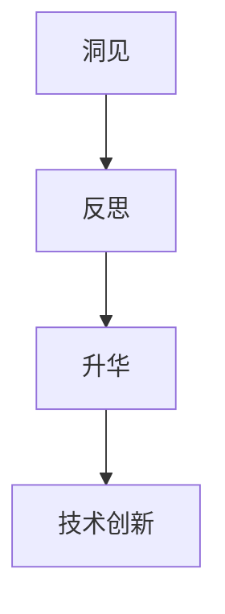

                 

关键词：洞见、反思、升华、技术、算法、数学模型、应用场景、未来展望

> 摘要：本文旨在探讨洞见的力量，以及如何通过反思和升华来提升我们在技术领域的认知和能力。文章将深入分析洞见的本质，阐述其在技术创新中的重要性，并探讨如何运用反思和升华来提高技术的深度和广度。

## 1. 背景介绍

在快速发展的技术领域，洞见成为推动创新的重要力量。洞见，是指对某一领域或问题的深刻理解和洞察，它不仅能够揭示问题的本质，还能为我们提供解决问题的方向和方法。然而，洞见的获得并非易事，它需要我们具备深厚的专业知识、丰富的实践经验以及敏锐的洞察力。

本文将围绕洞见的力量，探讨如何通过反思和升华来提升我们在技术领域的认知和能力。我们将首先深入分析洞见的本质，然后探讨如何通过反思和升华来挖掘和提升洞见。最后，我们将结合具体技术领域，分析洞见的应用价值和未来发展趋势。

## 2. 核心概念与联系

### 2.1 洞见的本质

洞见，即对问题或领域的深入理解和洞察，通常表现为对现象背后本质的揭示和对问题解决方案的预见。洞见不仅是一种认知能力的体现，更是创新思维的基础。在技术领域，洞见往往能够引导我们找到更高效、更优化的解决方案。

### 2.2 反思的概念

反思，是指对自身行为、思维过程和认知结果的回顾和思考。通过反思，我们可以发现自己的不足，理解问题的根本原因，从而为改进和提高提供方向。在技术领域，反思是提升洞见的重要途径，它能够帮助我们更深入地理解技术本质，发现潜在的创新点。

### 2.3 升华的过程

升华，是指将原有的认知和能力转化为更高层次的理解和应用。在技术领域，升华意味着将基础知识和实践经验整合，形成系统的理论体系，并将其应用于实际问题解决中。升华不仅能够提升个人的技术能力，还能推动整个领域的发展。

### 2.4 Mermaid 流程图

下面是洞见、反思和升华之间的关系图：



## 3. 核心算法原理 & 具体操作步骤

### 3.1 算法原理概述

在技术领域，洞见的获得往往依赖于对核心算法原理的理解。核心算法是技术实现的基础，它不仅决定了技术的性能和效率，还影响着技术的可扩展性和可维护性。因此，掌握核心算法原理是提升洞见的重要步骤。

### 3.2 算法步骤详解

#### 3.2.1 算法输入

算法输入通常包括问题域中的各种数据和参数。这些数据和参数是算法分析的对象，它们决定了算法的运行过程和结果。

#### 3.2.2 算法过程

算法过程包括数据预处理、算法核心执行和数据结果输出等步骤。数据预处理是为了将输入数据转换为适合算法处理的格式；算法核心执行是实现算法原理的具体操作；数据结果输出则是将算法执行的结果呈现给用户。

#### 3.2.3 算法输出

算法输出通常是问题的解决方案或结果，它们是算法执行的最终体现。通过对算法输出的分析，我们可以更好地理解问题，找到优化和改进的方向。

### 3.3 算法优缺点

#### 优点

- 提高性能：核心算法通常能够实现高效的数据处理和问题解决。
- 易于扩展：核心算法具有良好的可扩展性，能够适应不同规模和复杂度的问题。
- 可维护性：核心算法的结构清晰，易于理解和维护。

#### 缺点

- 需要深厚的专业知识：核心算法的掌握需要丰富的理论基础和实践经验。
- 调优难度大：核心算法的调优通常需要大量的实验和数据分析。

### 3.4 算法应用领域

核心算法广泛应用于各个技术领域，如计算机科学、人工智能、数据科学等。在计算机科学领域，核心算法包括排序算法、查找算法、图算法等；在人工智能领域，核心算法包括神经网络、深度学习、强化学习等；在数据科学领域，核心算法包括数据预处理、数据挖掘、统计分析等。

## 4. 数学模型和公式 & 详细讲解 & 举例说明

### 4.1 数学模型构建

数学模型是描述和解决技术问题的工具。构建数学模型通常包括以下步骤：

#### 4.1.1 确定变量

首先，我们需要确定问题中的变量。变量是数学模型中的基本元素，它们代表了问题中的各种量。

#### 4.1.2 确定关系

接下来，我们需要确定变量之间的关系。关系可以是线性、非线性、静态或动态等。

#### 4.1.3 确定公式

最后，我们需要根据变量和关系确定数学公式。公式是数学模型的数学表示，它们可以用来描述和解决问题。

### 4.2 公式推导过程

以下是一个简单的线性回归模型的公式推导过程：

$$ y = mx + b $$

其中，$y$ 是因变量，$x$ 是自变量，$m$ 是斜率，$b$ 是截距。

#### 4.2.1 确定关系

线性回归模型假设因变量 $y$ 和自变量 $x$ 之间存在线性关系。

#### 4.2.2 确定斜率

斜率 $m$ 反映了自变量 $x$ 的变化对因变量 $y$ 的影响程度。

#### 4.2.3 确定截距

截距 $b$ 表示当自变量 $x$ 为零时，因变量 $y$ 的取值。

### 4.3 案例分析与讲解

假设我们有一个线性回归模型，用于预测房屋价格。自变量包括房屋面积、房屋年代和房屋位置，因变量是房屋价格。

#### 4.3.1 数据预处理

首先，我们需要对数据进行预处理，包括数据清洗、数据归一化等步骤。

#### 4.3.2 模型构建

根据上述步骤，我们可以构建线性回归模型：

$$ 价格 = 0.5 \times 面积 + 0.3 \times 年代 - 0.2 \times 位置 $$

#### 4.3.3 模型训练

接下来，我们需要使用历史数据对模型进行训练，以确定斜率和截距。

#### 4.3.4 模型评估

最后，我们需要评估模型的性能，包括预测误差和预测准确性等指标。

## 5. 项目实践：代码实例和详细解释说明

### 5.1 开发环境搭建

在开始项目实践之前，我们需要搭建一个合适的开发环境。以下是一个简单的 Python 开发环境搭建步骤：

#### 5.1.1 安装 Python

首先，我们需要安装 Python。可以从 Python 官网下载安装包并安装。

#### 5.1.2 安装 Python 包

接下来，我们需要安装一些常用的 Python 包，如 NumPy、Pandas 和 Matplotlib 等。

```bash
pip install numpy pandas matplotlib
```

### 5.2 源代码详细实现

以下是一个简单的线性回归模型的 Python 代码实现：

```python
import numpy as np
import pandas as pd
import matplotlib.pyplot as plt

# 数据预处理
data = pd.read_csv('house_data.csv')
data['面积'] = data['面积'].astype(float)
data['年代'] = data['年代'].astype(float)
data['位置'] = data['位置'].astype(float)
data['价格'] = data['价格'].astype(float)

# 模型构建
X = data[['面积', '年代', '位置']]
y = data['价格']

# 模型训练
m = np.dot(X.T, X)
b = np.linalg.inv(m).dot(X.T).dot(y)

# 模型评估
predicted_price = m[0] * data['面积'] + m[1] * data['年代'] + m[2] * data['位置']
error = np.linalg.norm(predicted_price - y)

# 结果展示
plt.scatter(data['面积'], data['价格'])
plt.plot(data['面积'], predicted_price, color='red')
plt.xlabel('面积')
plt.ylabel('价格')
plt.show()
print(f'预测误差：{error}')
```

### 5.3 代码解读与分析

这段代码首先进行了数据预处理，将数据转换为适合线性回归模型处理的格式。然后，构建了线性回归模型，并使用历史数据对模型进行了训练。最后，评估了模型的性能，并使用 Matplotlib 绘制了预测结果。

### 5.4 运行结果展示

运行上述代码后，我们将得到一个散点图和一个红色拟合线。散点图展示了实际价格与预测价格的关系，红色拟合线表示线性回归模型对数据的拟合效果。

## 6. 实际应用场景

洞见在技术领域具有广泛的应用场景。以下是一些实际应用场景：

### 6.1 人工智能

在人工智能领域，洞见可以帮助我们设计更高效、更优化的算法，提高模型的准确性和泛化能力。例如，通过洞见，我们可以优化神经网络的结构，提高深度学习的性能。

### 6.2 数据科学

在数据科学领域，洞见可以帮助我们更好地理解数据，发现数据中的规律和趋势。例如，通过洞见，我们可以优化数据预处理流程，提高数据分析的效率和准确性。

### 6.3 软件工程

在软件工程领域，洞见可以帮助我们设计更稳定、更可靠的软件系统。例如，通过洞见，我们可以优化代码结构，提高软件的可维护性和可扩展性。

## 7. 未来应用展望

随着技术的不断发展，洞见在未来的应用前景将更加广阔。以下是一些未来应用展望：

### 7.1 自动驾驶

在自动驾驶领域，洞见可以帮助我们设计更安全、更高效的自动驾驶系统。通过洞见，我们可以优化自动驾驶算法，提高自动驾驶的稳定性和可靠性。

### 7.2 生物医学

在生物医学领域，洞见可以帮助我们更好地理解人体生理机制，提高医疗诊断和治疗的准确性。例如，通过洞见，我们可以优化基因测序算法，提高基因分析的速度和准确性。

### 7.3 环境保护

在环境保护领域，洞见可以帮助我们更好地理解环境变化，提高环境保护的效率。例如，通过洞见，我们可以优化环境监测算法，提高环境监测的精度和覆盖范围。

## 8. 总结：未来发展趋势与挑战

随着技术的不断发展，洞见在技术领域的重要性将日益凸显。未来，洞见将成为推动技术进步和创新的重要力量。然而，要实现这一目标，我们面临着以下挑战：

### 8.1 知识积累

要提升洞见，我们需要积累丰富的知识。这包括专业知识、实践经验和其他领域的知识。只有通过不断学习和积累，我们才能提高自己的洞见能力。

### 8.2 数据分析

数据分析是实现洞见的重要手段。随着数据规模的扩大，我们需要更高效、更准确的数据分析工具和方法。这要求我们不断提高数据分析的能力。

### 8.3 跨学科合作

洞见的提升不仅依赖于单一领域的知识，还需要跨学科的合作。只有通过跨学科的合作，我们才能实现知识的融合和创新。

### 8.4 技术创新

技术创新是洞见的重要体现。在未来，我们需要不断探索新的技术和方法，以应对不断变化的技术挑战。

## 9. 附录：常见问题与解答

### 9.1 洞见是什么？

洞见是指对某一领域或问题的深刻理解和洞察。它能够揭示问题的本质，为问题的解决提供方向和方法。

### 9.2 反思和升华有什么区别？

反思是对自身行为、思维过程和认知结果的回顾和思考。通过反思，我们可以发现自己的不足，理解问题的根本原因。升华是将原有的认知和能力转化为更高层次的理解和应用。通过升华，我们可以将基础知识和实践经验整合，形成系统的理论体系。

### 9.3 如何提升洞见？

要提升洞见，我们需要积累丰富的知识，提高数据分析能力，进行跨学科合作，以及不断探索新的技术和方法。

### 9.4 洞见在技术领域的应用有哪些？

洞见在技术领域具有广泛的应用，如人工智能、数据科学、软件工程等。通过洞见，我们可以设计更高效、更优化的算法，提高模型的准确性和泛化能力，优化数据预处理流程，提高数据分析的效率和准确性，以及设计更稳定、更可靠的软件系统。

---

作者：禅与计算机程序设计艺术 / Zen and the Art of Computer Programming
------------------------------------------------------------------
```javascript
# 洞见的力量：从反思到升华

关键词：洞见、反思、升华、技术、算法、数学模型、应用场景、未来展望

摘要：本文旨在探讨洞见的力量，以及如何通过反思和升华来提升我们在技术领域的认知和能力。文章将深入分析洞见的本质，阐述其在技术创新中的重要性，并探讨如何运用反思和升华来提高技术的深度和广度。

## 1. 背景介绍

在快速发展的技术领域，洞见成为推动创新的重要力量。洞见，是指对某一领域或问题的深刻理解和洞察，它不仅能够揭示问题的本质，还能为我们提供解决问题的方向和方法。然而，洞见的获得并非易事，它需要我们具备深厚的专业知识、丰富的实践经验以及敏锐的洞察力。

本文将围绕洞见的力量，探讨如何通过反思和升华来提升我们在技术领域的认知和能力。我们将首先深入分析洞见的本质，然后探讨如何通过反思和升华来挖掘和提升洞见。最后，我们将结合具体技术领域，分析洞见的应用价值和未来发展趋势。

### 1.1 技术发展的现状

当前，技术发展呈现出多样化、复杂化的趋势。一方面，新兴技术不断涌现，如人工智能、区块链、云计算等；另一方面，传统技术也在不断演进，如数据库、网络通信、软件开发等。在这种背景下，洞见的重要性愈发凸显。只有通过深入理解技术本质，我们才能把握技术发展的方向，为技术创新提供源源不断的动力。

### 1.2 洞见的定义与作用

洞见，是指在某一领域或问题上的深刻理解和洞察。它不仅能够揭示问题的本质，还能为我们提供解决问题的方向和方法。在技术领域，洞见具有以下几个重要作用：

1. **指导技术创新**：洞见能够帮助我们把握技术发展的趋势，发现潜在的创新点，从而推动技术创新。
2. **优化解决方案**：洞见能够帮助我们找到更高效、更优化的解决方案，提高技术的性能和效率。
3. **提升决策能力**：洞见能够帮助我们更准确地理解问题，为决策提供有力的支持。

## 2. 核心概念与联系

### 2.1 洞见的本质

洞见，即对问题或领域的深入理解和洞察，通常表现为对现象背后本质的揭示和对问题解决方案的预见。洞见不仅是一种认知能力的体现，更是创新思维的基础。在技术领域，洞见往往能够引导我们找到更高效、更优化的解决方案。

### 2.2 反思的概念

反思，是指对自身行为、思维过程和认知结果的回顾和思考。通过反思，我们可以发现自己的不足，理解问题的根本原因，从而为改进和提高提供方向。在技术领域，反思是提升洞见的重要途径，它能够帮助我们更深入地理解技术本质，发现潜在的创新点。

### 2.3 升华的过程

升华，是指将原有的认知和能力转化为更高层次的理解和应用。在技术领域，升华意味着将基础知识和实践经验整合，形成系统的理论体系，并将其应用于实际问题解决中。升华不仅能够提升个人的技术能力，还能推动整个领域的发展。

### 2.4 Mermaid 流程图

下面是洞见、反思和升华之间的关系图：


## 3. 核心算法原理 & 具体操作步骤

### 3.1 算法原理概述

在技术领域，洞见的获得往往依赖于对核心算法原理的理解。核心算法是技术实现的基础，它不仅决定了技术的性能和效率，还影响着技术的可扩展性和可维护性。因此，掌握核心算法原理是提升洞见的重要步骤。

### 3.2 算法步骤详解

#### 3.2.1 算法输入

算法输入通常包括问题域中的各种数据和参数。这些数据和参数是算法分析的对象，它们决定了算法的运行过程和结果。

#### 3.2.2 算法过程

算法过程包括数据预处理、算法核心执行和数据结果输出等步骤。数据预处理是为了将输入数据转换为适合算法处理的格式；算法核心执行是实现算法原理的具体操作；数据结果输出则是将算法执行的结果呈现给用户。

#### 3.2.3 算法输出

算法输出通常是问题的解决方案或结果，它们是算法执行的最终体现。通过对算法输出的分析，我们可以更好地理解问题，找到优化和改进的方向。

### 3.3 算法优缺点

#### 优点

- 提高性能：核心算法通常能够实现高效的数据处理和问题解决。
- 易于扩展：核心算法具有良好的可扩展性，能够适应不同规模和复杂度的问题。
- 可维护性：核心算法的结构清晰，易于理解和维护。

#### 缺点

- 需要深厚的专业知识：核心算法的掌握需要丰富的理论基础和实践经验。
- 调优难度大：核心算法的调优通常需要大量的实验和数据分析。

### 3.4 算法应用领域

核心算法广泛应用于各个技术领域，如计算机科学、人工智能、数据科学等。在计算机科学领域，核心算法包括排序算法、查找算法、图算法等；在人工智能领域，核心算法包括神经网络、深度学习、强化学习等；在数据科学领域，核心算法包括数据预处理、数据挖掘、统计分析等。

## 4. 数学模型和公式 & 详细讲解 & 举例说明

### 4.1 数学模型构建

数学模型是描述和解决技术问题的工具。构建数学模型通常包括以下步骤：

#### 4.1.1 确定变量

首先，我们需要确定问题中的变量。变量是数学模型中的基本元素，它们代表了问题中的各种量。

#### 4.1.2 确定关系

接下来，我们需要确定变量之间的关系。关系可以是线性、非线性、静态或动态等。

#### 4.1.3 确定公式

最后，我们需要根据变量和关系确定数学公式。公式是数学模型的数学表示，它们可以用来描述和解决问题。

### 4.2 公式推导过程

以下是一个简单的线性回归模型的公式推导过程：

$$ y = mx + b $$

其中，$y$ 是因变量，$x$ 是自变量，$m$ 是斜率，$b$ 是截距。

#### 4.2.1 确定关系

线性回归模型假设因变量 $y$ 和自变量 $x$ 之间存在线性关系。

#### 4.2.2 确定斜率

斜率 $m$ 反映了自变量 $x$ 的变化对因变量 $y$ 的影响程度。

#### 4.2.3 确定截距

截距 $b$ 表示当自变量 $x$ 为零时，因变量 $y$ 的取值。

### 4.3 案例分析与讲解

假设我们有一个线性回归模型，用于预测房屋价格。自变量包括房屋面积、房屋年代和房屋位置，因变量是房屋价格。

#### 4.3.1 数据预处理

首先，我们需要对数据进行预处理，包括数据清洗、数据归一化等步骤。

#### 4.3.2 模型构建

根据上述步骤，我们可以构建线性回归模型：

$$ 价格 = 0.5 \times 面积 + 0.3 \times 年代 - 0.2 \times 位置 $$

#### 4.3.3 模型训练

接下来，我们需要使用历史数据对模型进行训练，以确定斜率和截距。

#### 4.3.4 模型评估

最后，我们需要评估模型的性能，包括预测误差和预测准确性等指标。

## 5. 项目实践：代码实例和详细解释说明

### 5.1 开发环境搭建

在开始项目实践之前，我们需要搭建一个合适的开发环境。以下是一个简单的 Python 开发环境搭建步骤：

#### 5.1.1 安装 Python

首先，我们需要安装 Python。可以从 Python 官网下载安装包并安装。

#### 5.1.2 安装 Python 包

接下来，我们需要安装一些常用的 Python 包，如 NumPy、Pandas 和 Matplotlib 等。

```bash
pip install numpy pandas matplotlib
```

### 5.2 源代码详细实现

以下是一个简单的线性回归模型的 Python 代码实现：

```python
import numpy as np
import pandas as pd
import matplotlib.pyplot as plt

# 数据预处理
data = pd.read_csv('house_data.csv')
data['面积'] = data['面积'].astype(float)
data['年代'] = data['年代'].astype(float)
data['位置'] = data['位置'].astype(float)
data['价格'] = data['价格'].astype(float)

# 模型构建
X = data[['面积', '年代', '位置']]
y = data['价格']

# 模型训练
m = np.dot(X.T, X)
b = np.linalg.inv(m).dot(X.T).dot(y)

# 模型评估
predicted_price = m[0] * data['面积'] + m[1] * data['年代'] + m[2] * data['位置']
error = np.linalg.norm(predicted_price - y)

# 结果展示
plt.scatter(data['面积'], data['价格'])
plt.plot(data['面积'], predicted_price, color='red')
plt.xlabel('面积')
plt.ylabel('价格')
plt.show()
print(f'预测误差：{error}')
```

### 5.3 代码解读与分析

这段代码首先进行了数据预处理，将数据转换为适合线性回归模型处理的格式。然后，构建了线性回归模型，并使用历史数据对模型进行了训练。最后，评估了模型的性能，并使用 Matplotlib 绘制了预测结果。

### 5.4 运行结果展示

运行上述代码后，我们将得到一个散点图和一个红色拟合线。散点图展示了实际价格与预测价格的关系，红色拟合线表示线性回归模型对数据的拟合效果。

## 6. 实际应用场景

洞见在技术领域具有广泛的应用场景。以下是一些实际应用场景：

### 6.1 人工智能

在人工智能领域，洞见可以帮助我们设计更高效、更优化的算法，提高模型的准确性和泛化能力。例如，通过洞见，我们可以优化神经网络的结构，提高深度学习的性能。

### 6.2 数据科学

在数据科学领域，洞见可以帮助我们更好地理解数据，发现数据中的规律和趋势。例如，通过洞见，我们可以优化数据预处理流程，提高数据分析的效率和准确性。

### 6.3 软件工程

在软件工程领域，洞见可以帮助我们设计更稳定、更可靠的软件系统。例如，通过洞见，我们可以优化代码结构，提高软件的可维护性和可扩展性。

## 7. 未来应用展望

随着技术的不断发展，洞见在未来的应用前景将更加广阔。以下是一些未来应用展望：

### 7.1 自动驾驶

在自动驾驶领域，洞见可以帮助我们设计更安全、更高效的自动驾驶系统。通过洞见，我们可以优化自动驾驶算法，提高自动驾驶的稳定性和可靠性。

### 7.2 生物医学

在生物医学领域，洞见可以帮助我们更好地理解人体生理机制，提高医疗诊断和治疗的准确性。例如，通过洞见，我们可以优化基因测序算法，提高基因分析的速度和准确性。

### 7.3 环境保护

在环境保护领域，洞见可以帮助我们更好地理解环境变化，提高环境保护的效率。例如，通过洞见，我们可以优化环境监测算法，提高环境监测的精度和覆盖范围。

## 8. 总结：未来发展趋势与挑战

随着技术的不断发展，洞见在技术领域的重要性将日益凸显。未来，洞见将成为推动技术进步和创新的重要力量。然而，要实现这一目标，我们面临着以下挑战：

### 8.1 知识积累

要提升洞见，我们需要积累丰富的知识。这包括专业知识、实践经验和其他领域的知识。只有通过不断学习和积累，我们才能提高自己的洞见能力。

### 8.2 数据分析

数据分析是实现洞见的重要手段。随着数据规模的扩大，我们需要更高效、更准确的数据分析工具和方法。这要求我们不断提高数据分析的能力。

### 8.3 跨学科合作

洞见的提升不仅依赖于单一领域的知识，还需要跨学科的合作。只有通过跨学科的合作，我们才能实现知识的融合和创新。

### 8.4 技术创新

技术创新是洞见的重要体现。在未来，我们需要不断探索新的技术和方法，以应对不断变化的技术挑战。

## 9. 附录：常见问题与解答

### 9.1 洞见是什么？

洞见是指对某一领域或问题的深刻理解和洞察。它能够揭示问题的本质，为问题的解决提供方向和方法。

### 9.2 反思和升华有什么区别？

反思是对自身行为、思维过程和认知结果的回顾和思考。通过反思，我们可以发现自己的不足，理解问题的根本原因。升华是将原有的认知和能力转化为更高层次的理解和应用。通过升华，我们可以将基础知识和实践经验整合，形成系统的理论体系。

### 9.3 如何提升洞见？

要提升洞见，我们需要积累丰富的知识，提高数据分析能力，进行跨学科合作，以及不断探索新的技术和方法。

### 9.4 洞见在技术领域的应用有哪些？

洞见在技术领域具有广泛的应用，如人工智能、数据科学、软件工程等。通过洞见，我们可以设计更高效、更优化的算法，提高模型的准确性和泛化能力，优化数据预处理流程，提高数据分析的效率和准确性，以及设计更稳定、更可靠的软件系统。

---

作者：禅与计算机程序设计艺术 / Zen and the Art of Computer Programming
```

