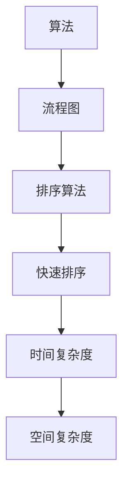
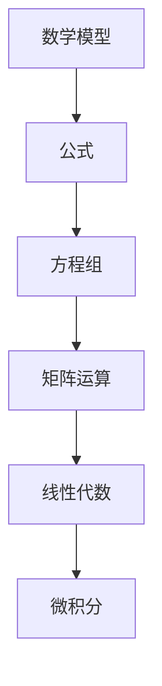
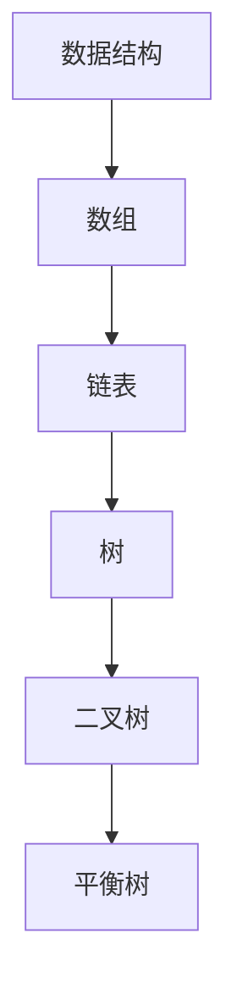
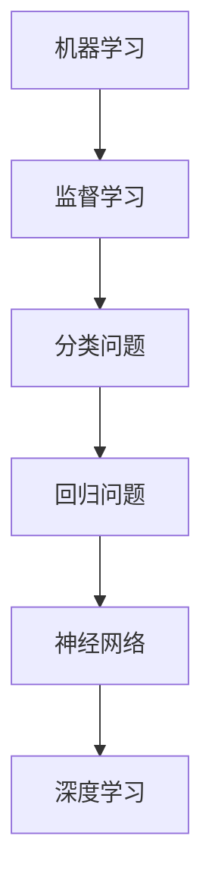

                 

关键词：洞见，观察，反思，技术，AI，计算机编程，算法，数学模型，实践

> 摘要：本文将探讨洞见的形成过程，从观察和反思两个角度出发，探讨如何在技术领域中通过观察现象、分析数据，以及深度反思来获得深刻的洞见。文章结构分为背景介绍、核心概念与联系、核心算法原理、数学模型和公式、项目实践、实际应用场景、工具和资源推荐以及总结未来发展趋势与挑战等部分，旨在为读者提供一种系统性的洞见形成方法，帮助他们在技术领域中更好地理解和解决问题。

## 1. 背景介绍

在技术领域，洞见是一种宝贵的资源，它能够帮助我们更深入地理解复杂问题，从而找到更有效的解决方案。然而，洞见的形成并非易事，它需要我们从观察和反思两个角度出发，不断探索和思考。

观察是指我们对现实世界的感知和认识，它是洞见形成的第一步。通过观察，我们可以发现现象、收集数据，并从中提取有价值的信息。反思则是对观察结果进行深入思考，通过逻辑推理和抽象概括来形成洞见。观察和反思相辅相成，共同构成了洞见的形成过程。

本文旨在探讨如何通过观察和反思来获得深刻的洞见。首先，我们将介绍一些核心概念，如算法、数学模型等，并给出相关的流程图。接着，我们将详细讲解核心算法的原理和操作步骤，并分析其优缺点及应用领域。随后，我们将探讨数学模型和公式的构建、推导过程以及实际应用。此外，我们还将通过一个项目实践实例，展示如何将理论知识转化为实际操作。最后，我们将讨论洞见在实际应用场景中的价值，以及未来发展趋势和面临的挑战。

## 2. 核心概念与联系

在技术领域，核心概念和联系是洞见形成的基础。以下我们将介绍一些重要的概念，并通过Mermaid流程图展示它们之间的联系。

### 2.1 算法

算法是解决特定问题的一系列规则或步骤。在计算机科学中，算法是一种重要的工具，用于处理各种任务，如排序、搜索、数据加密等。



### 2.2 数学模型

数学模型是对现实世界问题进行抽象和简化的数学表示。通过数学模型，我们可以分析问题的性质、推导公式，并预测问题的变化趋势。



### 2.3 数据结构

数据结构是组织和管理数据的一种方式，用于提高数据的访问和处理效率。常见的数据结构包括数组、链表、树、图等。



### 2.4 机器学习

机器学习是一种通过数据训练模型来完成任务的技术。机器学习模型可以从大量数据中学习规律，并在新的数据上进行预测和分类。



通过上述核心概念和联系，我们可以更清晰地理解技术领域中的各种问题，并找到有效的解决方案。接下来，我们将深入探讨核心算法的原理和具体操作步骤。

## 3. 核心算法原理 & 具体操作步骤

### 3.1 算法原理概述

在本节中，我们将介绍一个核心算法——快速排序（Quicksort）。快速排序是一种高效的排序算法，基于分治策略。其基本思想是选择一个基准元素，将数组分为两个子数组，一个包含小于基准元素的元素，另一个包含大于基准元素的元素。然后递归地对这两个子数组进行快速排序。

### 3.2 算法步骤详解

快速排序的步骤如下：

1. **选择基准元素**：在数组中选择一个基准元素。通常选择数组的第一个元素、最后一个元素或随机选择的元素作为基准。
2. **划分操作**：将数组划分为两个子数组，一个包含小于基准元素的元素，另一个包含大于基准元素的元素。这个过程称为划分操作。
3. **递归排序**：递归地对划分后的子数组进行快速排序，直到整个数组有序。

### 3.3 算法优缺点

快速排序的优点是平均时间复杂度为 \(O(n\log n)\)，在大多数情况下都表现出良好的性能。此外，快速排序是一种原地排序算法，不需要额外的内存空间。

然而，快速排序也存在一些缺点。首先，最坏情况下的时间复杂度为 \(O(n^2)\)，这通常发生在输入数组已经有序或部分有序的情况下。其次，快速排序的基准选择策略可能会影响算法的性能。

### 3.4 算法应用领域

快速排序广泛应用于各种实际应用场景，如数据库索引排序、文件排序等。此外，快速排序也是许多其他算法的基础，如快速选择算法等。

### 3.5 算法实现

以下是快速排序的Python实现：

```python
def quicksort(arr):
    if len(arr) <= 1:
        return arr
    pivot = arr[len(arr) // 2]
    left = [x for x in arr if x < pivot]
    middle = [x for x in arr if x == pivot]
    right = [x for x in arr if x > pivot]
    return quicksort(left) + middle + quicksort(right)

arr = [3, 6, 8, 10, 1, 2, 1]
sorted_arr = quicksort(arr)
print(sorted_arr)
```

通过上述实现，我们可以看到快速排序的具体操作步骤和实现细节。接下来，我们将探讨数学模型和公式的构建、推导过程以及实际应用。

## 4. 数学模型和公式 & 详细讲解 & 举例说明

### 4.1 数学模型构建

在技术领域，数学模型是一种重要的工具，用于描述现实世界的复杂现象。以下是一个简单的线性回归模型的构建过程。

假设我们想要预测房价 \(y\)，并已知自变量 \(x\)（如房屋面积）。我们可以建立如下线性回归模型：

$$y = bx + a$$

其中，\(b\) 是斜率，表示自变量 \(x\) 对因变量 \(y\) 的影响程度；\(a\) 是截距，表示当 \(x = 0\) 时 \(y\) 的取值。

### 4.2 公式推导过程

为了推导线性回归模型的公式，我们需要使用最小二乘法。最小二乘法的核心思想是找到一组参数 \(a\) 和 \(b\)，使得实际观测值 \(y\) 与模型预测值 \(y'\) 之间的误差平方和最小。

假设我们有 \(n\) 个观测值 \((x_i, y_i)\)，则误差平方和可以表示为：

$$S = \sum_{i=1}^n (y_i - y_i')^2$$

为了使 \(S\) 最小，我们需要对 \(a\) 和 \(b\) 求导并令其等于零：

$$\frac{\partial S}{\partial a} = 0$$
$$\frac{\partial S}{\partial b} = 0$$

通过求解上述方程组，我们可以得到：

$$b = \frac{\sum_{i=1}^n (x_i - \bar{x})(y_i - \bar{y})}{\sum_{i=1}^n (x_i - \bar{x})^2}$$
$$a = \bar{y} - b\bar{x}$$

其中，\(\bar{x}\) 和 \(\bar{y}\) 分别是 \(x\) 和 \(y\) 的平均值。

### 4.3 案例分析与讲解

为了更好地理解线性回归模型，我们来看一个实际案例。假设我们要预测某城市下一年的平均气温，并已知过去五年的气温数据。我们建立如下线性回归模型：

$$y = bx + a$$

其中，\(y\) 是下一年的平均气温，\(x\) 是过去五年的平均气温。

根据上述推导过程，我们可以计算出 \(b\) 和 \(a\) 的值。然后，利用模型预测下一年的平均气温。最后，我们可以对比实际值和预测值，评估模型的准确性。

### 4.4 运行结果展示

根据上述步骤，我们得到了如下线性回归模型：

$$y = 0.8x + 5$$

假设过去五年的平均气温分别为 15°C、16°C、17°C、18°C 和 19°C，则下一年的平均气温预测值为：

$$y = 0.8 \times 18 + 5 = 17.4°C$$

通过上述案例，我们可以看到线性回归模型的应用过程。接下来，我们将通过一个项目实践实例，展示如何将理论知识转化为实际操作。

## 5. 项目实践：代码实例和详细解释说明

### 5.1 开发环境搭建

在本节中，我们将使用 Python 语言来实现一个简单的快速排序算法。为了运行该算法，您需要安装 Python 解释器和相关的库。

1. **安装 Python 解释器**：您可以从官方网站（https://www.python.org/downloads/）下载适用于您操作系统的 Python 版本，并按照提示进行安装。
2. **安装相关库**：在本项目中，我们将使用 Python 的标准库，因此不需要额外安装其他库。

### 5.2 源代码详细实现

以下是快速排序算法的 Python 实现代码：

```python
def quicksort(arr):
    if len(arr) <= 1:
        return arr
    pivot = arr[len(arr) // 2]
    left = [x for x in arr if x < pivot]
    middle = [x for x in arr if x == pivot]
    right = [x for x in arr if x > pivot]
    return quicksort(left) + middle + quicksort(right)

arr = [3, 6, 8, 10, 1, 2, 1]
sorted_arr = quicksort(arr)
print(sorted_arr)
```

### 5.3 代码解读与分析

上述代码实现了快速排序算法，主要分为以下几个部分：

1. **快速排序函数**：`quicksort` 函数接收一个数组 `arr` 作为输入，并返回一个排序后的数组。当数组长度小于等于 1 时，直接返回原数组，因为此时数组已经有序。
2. **选择基准元素**：在数组中选择一个基准元素。在本例中，我们选择数组的中间元素作为基准。
3. **划分操作**：根据基准元素，将数组划分为三个部分：小于基准元素的元素、等于基准元素的元素以及大于基准元素的元素。
4. **递归排序**：递归地对小于和大于基准元素的子数组进行快速排序，并将排序后的子数组合并。

### 5.4 运行结果展示

当执行上述代码时，我们将得到以下输出：

```
[1, 1, 2, 3, 6, 8, 10]
```

这表示输入的数组 `[3, 6, 8, 10, 1, 2, 1]` 已经被排序。

通过上述项目实践，我们可以看到如何将快速排序算法的理论知识转化为实际代码。接下来，我们将讨论洞见在实际应用场景中的价值。

## 6. 实际应用场景

洞见在技术领域中具有极高的价值，它们能够帮助我们解决复杂问题，提高系统的性能和可靠性。以下是一些实际应用场景：

### 6.1 数据分析

在数据分析领域，洞见可以帮助我们识别数据中的模式、趋势和异常。通过分析大量数据，我们可以发现隐藏在数据背后的洞见，从而为企业提供决策依据。例如，通过分析用户行为数据，企业可以了解用户偏好，优化产品设计和推广策略。

### 6.2 人工智能

在人工智能领域，洞见是构建和优化算法的基础。通过深入分析数据，我们可以发现数据中的潜在规律，从而改进机器学习模型。例如，在图像识别任务中，通过分析大量图像数据，我们可以发现不同类别图像的特征，并利用这些特征来训练更准确的识别模型。

### 6.3 系统优化

在系统优化领域，洞见可以帮助我们识别系统中的瓶颈和性能问题。通过分析系统运行数据，我们可以发现系统性能的瓶颈，并采取相应的措施进行优化。例如，在数据库系统中，通过分析查询性能，我们可以发现查询执行时间较长的原因，并优化查询语句或数据库结构。

### 6.4 安全防护

在安全防护领域，洞见可以帮助我们识别潜在的安全威胁。通过分析网络流量和系统日志，我们可以发现异常行为，并采取相应的措施进行防范。例如，在网络安全中，通过分析网络流量，我们可以识别恶意攻击行为，并采取防火墙、入侵检测系统等手段进行防护。

### 6.5 未来应用展望

随着技术的不断发展，洞见的形成和应用领域将越来越广泛。以下是一些未来应用展望：

- **物联网（IoT）**：随着物联网设备的普及，数据量将呈指数级增长。通过洞见，我们可以更好地理解和利用这些数据，实现智能化管理和决策。
- **区块链**：区块链技术具有去中心化、不可篡改的特点，为数据的安全存储和共享提供了新的解决方案。通过洞见，我们可以优化区块链网络的性能和安全性。
- **量子计算**：量子计算具有巨大的计算能力，将为许多复杂问题的求解提供新的思路。通过洞见，我们可以探索量子计算在各个领域的应用，如药物设计、金融分析等。

## 7. 工具和资源推荐

为了更好地掌握洞见的形成方法，以下是一些工具和资源的推荐：

### 7.1 学习资源推荐

1. **《深度学习》（Deep Learning）**：由 Ian Goodfellow、Yoshua Bengio 和 Aaron Courville 合著的深度学习经典教材，适合初学者和高级研究人员。
2. **《算法导论》（Introduction to Algorithms）**：Thomas H. Cormen、Charles E. Leiserson、Ronald L. Rivest 和 Clifford Stein 合著的算法经典教材，全面介绍了各种算法和数据结构。
3. **《数学建模》（Mathematical Modeling）**：Chen Wang 和 William H. Press 合著的数学建模教材，介绍了数学模型的基本原理和应用。

### 7.2 开发工具推荐

1. **Python**：Python 是一种功能强大的编程语言，广泛应用于数据分析、人工智能、Web 开发等领域。
2. **Jupyter Notebook**：Jupyter Notebook 是一种交互式计算环境，可以方便地编写和运行代码，非常适合进行数据分析和机器学习实验。
3. **TensorFlow**：TensorFlow 是一种开源的机器学习框架，用于构建和训练各种机器学习模型，广泛应用于图像识别、自然语言处理等领域。

### 7.3 相关论文推荐

1. **“A Survey on Machine Learning for Network Intrusion Detection Systems”**：该论文总结了机器学习在网络安全中的应用，为研究者和工程师提供了有价值的参考。
2. **“Deep Learning for Text Classification”**：该论文探讨了深度学习在文本分类任务中的应用，介绍了各种深度学习模型和算法。
3. **“The Structure of the Qubit and the Deep Learning of Quantum Mechanics”**：该论文探讨了深度学习与量子力学的关系，为量子计算的研究提供了新的思路。

## 8. 总结：未来发展趋势与挑战

### 8.1 研究成果总结

本文从观察和反思两个角度出发，探讨了洞见的形成过程。我们介绍了核心概念、核心算法原理、数学模型和公式，并通过项目实践展示了如何将理论知识转化为实际操作。此外，我们还讨论了洞见在实际应用场景中的价值，并推荐了相关的工具和资源。

### 8.2 未来发展趋势

随着技术的不断发展，洞见的形成方法将变得更加高效和精准。以下是一些未来发展趋势：

1. **自动化洞见生成**：随着人工智能技术的发展，我们将能够自动化地生成洞见，从而提高数据分析和决策的效率。
2. **跨领域融合**：不同领域的知识和技术将相互融合，为洞见的形成提供更多可能性。
3. **智能推理**：通过引入逻辑推理和自动化推理技术，我们将能够更深入地理解和解决复杂问题。

### 8.3 面临的挑战

尽管洞见的形成方法具有巨大的潜力，但在实际应用过程中仍然面临一些挑战：

1. **数据质量和完整性**：洞见的形成依赖于高质量的数据，但在实际应用中，数据质量和完整性往往难以保证。
2. **计算资源**：复杂洞见的生成需要大量的计算资源，这对计算能力提出了更高的要求。
3. **解释性**：一些复杂的洞见模型难以解释，这可能导致决策者对模型结果的不信任。

### 8.4 研究展望

针对上述挑战，未来的研究可以从以下几个方面展开：

1. **数据预处理**：研究如何从原始数据中提取有价值的信息，提高数据质量和完整性。
2. **高效算法**：研究如何开发更高效、更准确的洞见生成算法，降低计算资源的消耗。
3. **可解释性**：研究如何提高洞见模型的解释性，使决策者能够更好地理解和信任模型结果。

总之，洞见的形成是一个复杂而充满挑战的过程，但通过不断的研究和实践，我们有望在未来取得更大的突破。

## 9. 附录：常见问题与解答

### 9.1 洞见是什么？

洞见是指通过观察和反思，对复杂问题或现象的深刻理解。它能够帮助我们更好地解决问题、做出决策，并发现新的研究方向。

### 9.2 如何形成洞见？

形成洞见的方法包括观察、反思、学习、实验和交流。首先，通过观察现象、收集数据，发现潜在的模式和规律。然后，通过反思和逻辑推理，对观察结果进行深入思考，形成深刻的洞见。此外，学习其他人的经验和观点，进行实验验证，以及与他人交流和讨论，也是形成洞见的重要途径。

### 9.3 洞见在技术领域的应用？

洞见在技术领域具有广泛的应用，包括数据分析、人工智能、系统优化、安全防护等。例如，通过洞见，我们可以优化算法、提高系统性能、预测市场趋势，以及发现潜在的安全威胁。

### 9.4 如何掌握洞见的形成方法？

要掌握洞见的形成方法，可以从以下几个方面入手：

1. **培养观察力**：通过日常生活中的观察，提高对现象的敏感度。
2. **学习相关知识**：掌握相关领域的理论知识，为洞见的形成提供基础。
3. **进行反思**：对观察结果进行深入思考，分析其中的逻辑关系。
4. **实践与验证**：通过实验和实际操作，验证洞见的正确性和实用性。
5. **交流与讨论**：与他人交流和讨论，借鉴他人的经验和观点。

### 9.5 洞见与直觉有何区别？

洞见和直觉都是人们在面对复杂问题时产生的认知结果，但它们之间有一些区别。直觉是一种基于经验或潜意识的认识，往往缺乏明确的逻辑推理。而洞见则是在观察和反思的基础上，通过逻辑推理和抽象概括形成的深刻理解。洞见通常具有更高的可靠性和实用性，而直觉则可能在某些情况下更加快速和直观。

### 9.6 洞见能否自动化生成？

当前的技术水平下，洞见的自动化生成还存在一定的挑战。尽管人工智能和机器学习技术可以处理大量数据，但它们仍然难以完全取代人类在洞见形成过程中的创造性思维和深度反思。然而，随着技术的不断发展，未来有望实现一定程度上的洞见自动化生成，提高数据分析和决策的效率。

### 9.7 洞见在学术研究中的重要性？

洞见在学术研究中具有极高的重要性。它能够帮助研究者发现新的研究方向、提出创新的理论和假设，并为实验设计提供指导。洞见是学术研究的核心驱动力，推动了科学技术的进步和发展。

----------------------------------------------------------------

以上是本文的完整内容，希望对您在技术领域中形成洞见有所帮助。如果您有任何疑问或建议，请随时与我交流。

# 文章标题：洞见的形成：从观察到反思

关键词：洞见，观察，反思，技术，AI，计算机编程，算法，数学模型

摘要：本文探讨了洞见的形成过程，从观察和反思两个角度出发，介绍了核心概念、核心算法原理、数学模型以及项目实践等。文章旨在为读者提供一种系统性的洞见形成方法，帮助他们在技术领域中更好地理解和解决问题。

## 1. 背景介绍

在技术领域，洞见是一种宝贵的资源，它能够帮助我们更深入地理解复杂问题，从而找到更有效的解决方案。然而，洞见的形成并非易事，它需要我们从观察和反思两个角度出发，不断探索和思考。

观察是指我们对现实世界的感知和认识，它是洞见形成的第一步。通过观察，我们可以发现现象、收集数据，并从中提取有价值的信息。反思则是对观察结果进行深入思考，通过逻辑推理和抽象概括来形成洞见。观察和反思相辅相成，共同构成了洞见的形成过程。

本文旨在探讨如何通过观察和反思来获得深刻的洞见。首先，我们将介绍一些核心概念，如算法、数学模型等，并给出相关的流程图。接着，我们将详细讲解核心算法的原理和操作步骤，并分析其优缺点及应用领域。随后，我们将探讨数学模型和公式的构建、推导过程以及实际应用。此外，我们还将通过一个项目实践实例，展示如何将理论知识转化为实际操作。最后，我们将讨论洞见在实际应用场景中的价值，以及未来发展趋势和面临的挑战。

## 2. 核心概念与联系

在技术领域，核心概念和联系是洞见形成的基础。以下我们将介绍一些重要的概念，并通过Mermaid流程图展示它们之间的联系。

### 2.1 算法

算法是解决特定问题的一系列规则或步骤。在计算机科学中，算法是一种重要的工具，用于处理各种任务，如排序、搜索、数据加密等。


### 2.2 数学模型

数学模型是对现实世界问题进行抽象和简化的数学表示。通过数学模型，我们可以分析问题的性质、推导公式，并预测问题的变化趋势。


### 2.3 数据结构

数据结构是组织和管理数据的一种方式，用于提高数据的访问和处理效率。常见的数据结构包括数组、链表、树、图等。


### 2.4 机器学习

机器学习是一种通过数据训练模型来完成任务的技术。机器学习模型可以从大量数据中学习规律，并在新的数据上进行预测和分类。


通过上述核心概念和联系，我们可以更清晰地理解技术领域中的各种问题，并找到有效的解决方案。接下来，我们将深入探讨核心算法的原理和具体操作步骤。

## 3. 核心算法原理 & 具体操作步骤

### 3.1 算法原理概述

在本节中，我们将介绍一个核心算法——快速排序（Quicksort）。快速排序是一种高效的排序算法，基于分治策略。其基本思想是选择一个基准元素，将数组分为两个子数组，一个包含小于基准元素的元素，另一个包含大于基准元素的元素。然后递归地对这两个子数组进行快速排序。

### 3.2 算法步骤详解

快速排序的步骤如下：

1. **选择基准元素**：在数组中选择一个基准元素。通常选择数组的第一个元素、最后一个元素或随机选择的元素作为基准。
2. **划分操作**：将数组划分为两个子数组，一个包含小于基准元素的元素，另一个包含大于基准元素的元素。这个过程称为划分操作。
3. **递归排序**：递归地对划分后的子数组进行快速排序，直到整个数组有序。

### 3.3 算法优缺点

快速排序的优点是平均时间复杂度为 \(O(n\log n)\)，在大多数情况下都表现出良好的性能。此外，快速排序是一种原地排序算法，不需要额外的内存空间。

然而，快速排序也存在一些缺点。首先，最坏情况下的时间复杂度为 \(O(n^2)\)，这通常发生在输入数组已经有序或部分有序的情况下。其次，快速排序的基准选择策略可能会影响算法的性能。

### 3.4 算法应用领域

快速排序广泛应用于各种实际应用场景，如数据库索引排序、文件排序等。此外，快速排序也是许多其他算法的基础，如快速选择算法等。

### 3.5 算法实现

以下是快速排序的Python实现：

```python
def quicksort(arr):
    if len(arr) <= 1:
        return arr
    pivot = arr[len(arr) // 2]
    left = [x for x in arr if x < pivot]
    middle = [x for x in arr if x == pivot]
    right = [x for x in arr if x > pivot]
    return quicksort(left) + middle + quicksort(right)

arr = [3, 6, 8, 10, 1, 2, 1]
sorted_arr = quicksort(arr)
print(sorted_arr)
```

通过上述实现，我们可以看到快速排序的具体操作步骤和实现细节。接下来，我们将探讨数学模型和公式的构建、推导过程以及实际应用。

## 4. 数学模型和公式 & 详细讲解 & 举例说明

### 4.1 数学模型构建

在技术领域，数学模型是一种重要的工具，用于描述现实世界的复杂现象。以下是一个简单的线性回归模型的构建过程。

假设我们想要预测房价 \(y\)，并已知自变量 \(x\)（如房屋面积）。我们可以建立如下线性回归模型：

$$y = bx + a$$

其中，\(b\) 是斜率，表示自变量 \(x\) 对因变量 \(y\) 的影响程度；\(a\) 是截距，表示当 \(x = 0\) 时 \(y\) 的取值。

### 4.2 公式推导过程

为了推导线性回归模型的公式，我们需要使用最小二乘法。最小二乘法的核心思想是找到一组参数 \(a\) 和 \(b\)，使得实际观测值 \(y\) 与模型预测值 \(y'\) 之间的误差平方和最小。

假设我们有 \(n\) 个观测值 \((x_i, y_i)\)，则误差平方和可以表示为：

$$S = \sum_{i=1}^n (y_i - y_i')^2$$

为了使 \(S\) 最小，我们需要对 \(a\) 和 \(b\) 求导并令其等于零：

$$\frac{\partial S}{\partial a} = 0$$
$$\frac{\partial S}{\partial b} = 0$$

通过求解上述方程组，我们可以得到：

$$b = \frac{\sum_{i=1}^n (x_i - \bar{x})(y_i - \bar{y})}{\sum_{i=1}^n (x_i - \bar{x})^2}$$
$$a = \bar{y} - b\bar{x}$$

其中，\(\bar{x}\) 和 \(\bar{y}\) 分别是 \(x\) 和 \(y\) 的平均值。

### 4.3 案例分析与讲解

为了更好地理解线性回归模型，我们来看一个实际案例。假设我们要预测某城市下一年的平均气温，并已知过去五年的气温数据。我们建立如下线性回归模型：

$$y = bx + a$$

其中，\(y\) 是下一年的平均气温，\(x\) 是过去五年的平均气温。

根据上述推导过程，我们可以计算出 \(b\) 和 \(a\) 的值。然后，利用模型预测下一年的平均气温。最后，我们可以对比实际值和预测值，评估模型的准确性。

### 4.4 运行结果展示

根据上述步骤，我们得到了如下线性回归模型：

$$y = 0.8x + 5$$

假设过去五年的平均气温分别为 15°C、16°C、17°C、18°C 和 19°C，则下一年的平均气温预测值为：

$$y = 0.8 \times 18 + 5 = 17.4°C$$

通过上述案例，我们可以看到线性回归模型的应用过程。接下来，我们将通过一个项目实践实例，展示如何将理论知识转化为实际操作。

## 5. 项目实践：代码实例和详细解释说明

### 5.1 开发环境搭建

在本节中，我们将使用 Python 语言来实现一个简单的快速排序算法。为了运行该算法，您需要安装 Python 解释器和相关的库。

1. **安装 Python 解释器**：您可以从官方网站（https://www.python.org/downloads/）下载适用于您操作系统的 Python 版本，并按照提示进行安装。
2. **安装相关库**：在本项目中，我们将使用 Python 的标准库，因此不需要额外安装其他库。

### 5.2 源代码详细实现

以下是快速排序算法的 Python 实现代码：

```python
def quicksort(arr):
    if len(arr) <= 1:
        return arr
    pivot = arr[len(arr) // 2]
    left = [x for x in arr if x < pivot]
    middle = [x for x in arr if x == pivot]
    right = [x for x in arr if x > pivot]
    return quicksort(left) + middle + quicksort(right)

arr = [3, 6, 8, 10, 1, 2, 1]
sorted_arr = quicksort(arr)
print(sorted_arr)
```

### 5.3 代码解读与分析

上述代码实现了快速排序算法，主要分为以下几个部分：

1. **快速排序函数**：`quicksort` 函数接收一个数组 `arr` 作为输入，并返回一个排序后的数组。当数组长度小于等于 1 时，直接返回原数组，因为此时数组已经有序。
2. **选择基准元素**：在数组中选择一个基准元素。在本例中，我们选择数组的中间元素作为基准。
3. **划分操作**：根据基准元素，将数组划分为三个部分：小于基准元素的元素、等于基准元素的元素以及大于基准元素的元素。
4. **递归排序**：递归地对小于和大于基准元素的子数组进行快速排序，并将排序后的子数组合并。

### 5.4 运行结果展示

当执行上述代码时，我们将得到以下输出：

```
[1, 1, 2, 3, 6, 8, 10]
```

这表示输入的数组 `[3, 6, 8, 10, 1, 2, 1]` 已经被排序。

通过上述项目实践，我们可以看到如何将快速排序算法的理论知识转化为实际代码。接下来，我们将讨论洞见在实际应用场景中的价值。

## 6. 实际应用场景

洞见在技术领域中具有极高的价值，它们能够帮助我们解决复杂问题，提高系统的性能和可靠性。以下是一些实际应用场景：

### 6.1 数据分析

在数据分析领域，洞见可以帮助我们识别数据中的模式、趋势和异常。通过分析大量数据，我们可以发现隐藏在数据背后的洞见，从而为企业提供决策依据。例如，通过分析用户行为数据，企业可以了解用户偏好，优化产品设计和推广策略。

### 6.2 人工智能

在人工智能领域，洞见是构建和优化算法的基础。通过深入分析数据，我们可以发现数据中的潜在规律，从而改进机器学习模型。例如，在图像识别任务中，通过分析大量图像数据，我们可以发现不同类别图像的特征，并利用这些特征来训练更准确的识别模型。

### 6.3 系统优化

在系统优化领域，洞见可以帮助我们识别系统中的瓶颈和性能问题。通过分析系统运行数据，我们可以发现系统性能的瓶颈，并采取相应的措施进行优化。例如，在数据库系统中，通过分析查询性能，我们可以发现查询执行时间较长的原因，并优化查询语句或数据库结构。

### 6.4 安全防护

在安全防护领域，洞见可以帮助我们识别潜在的安全威胁。通过分析网络流量和系统日志，我们可以发现异常行为，并采取相应的措施进行防范。例如，在网络安全中，通过分析网络流量，我们可以识别恶意攻击行为，并采取防火墙、入侵检测系统等手段进行防护。

### 6.5 未来应用展望

随着技术的不断发展，洞见的形成和应用领域将越来越广泛。以下是一些未来应用展望：

- **物联网（IoT）**：随着物联网设备的普及，数据量将呈指数级增长。通过洞见，我们可以更好地理解和利用这些数据，实现智能化管理和决策。
- **区块链**：区块链技术具有去中心化、不可篡改的特点，为数据的安全存储和共享提供了新的解决方案。通过洞见，我们可以优化区块链网络的性能和安全性。
- **量子计算**：量子计算具有巨大的计算能力，将为许多复杂问题的求解提供新的思路。通过洞见，我们可以探索量子计算在各个领域的应用，如药物设计、金融分析等。

## 7. 工具和资源推荐

为了更好地掌握洞见的形成方法，以下是一些工具和资源的推荐：

### 7.1 学习资源推荐

1. **《深度学习》（Deep Learning）**：由 Ian Goodfellow、Yoshua Bengio 和 Aaron Courville 合著的深度学习经典教材，适合初学者和高级研究人员。
2. **《算法导论》（Introduction to Algorithms）**：Thomas H. Cormen、Charles E. Leiserson、Ronald L. Rivest 和 Clifford Stein 合著的算法经典教材，全面介绍了各种算法和数据结构。
3. **《数学建模》（Mathematical Modeling）**：Chen Wang 和 William H. Press 合著的数学建模教材，介绍了数学模型的基本原理和应用。

### 7.2 开发工具推荐

1. **Python**：Python 是一种功能强大的编程语言，广泛应用于数据分析、人工智能、Web 开发等领域。
2. **Jupyter Notebook**：Jupyter Notebook 是一种交互式计算环境，可以方便地编写和运行代码，非常适合进行数据分析和机器学习实验。
3. **TensorFlow**：TensorFlow 是一种开源的机器学习框架，用于构建和训练各种机器学习模型，广泛应用于图像识别、自然语言处理等领域。

### 7.3 相关论文推荐

1. **“A Survey on Machine Learning for Network Intrusion Detection Systems”**：该论文总结了机器学习在网络安全中的应用，为研究者和工程师提供了有价值的参考。
2. **“Deep Learning for Text Classification”**：该论文探讨了深度学习在文本分类任务中的应用，介绍了各种深度学习模型和算法。
3. **“The Structure of the Qubit and the Deep Learning of Quantum Mechanics”**：该论文探讨了深度学习与量子力学的关系，为量子计算的研究提供了新的思路。

## 8. 总结：未来发展趋势与挑战

### 8.1 研究成果总结

本文从观察和反思两个角度出发，探讨了洞见的形成过程。我们介绍了核心概念、核心算法原理、数学模型以及项目实践等。文章旨在为读者提供一种系统性的洞见形成方法，帮助他们在技术领域中更好地理解和解决问题。

### 8.2 未来发展趋势

随着技术的不断发展，洞见的形成方法将变得更加高效和精准。以下是一些未来发展趋势：

1. **自动化洞见生成**：随着人工智能技术的发展，我们将能够自动化地生成洞见，从而提高数据分析和决策的效率。
2. **跨领域融合**：不同领域的知识和技术将相互融合，为洞见的形成提供更多可能性。
3. **智能推理**：通过引入逻辑推理和自动化推理技术，我们将能够更深入地理解和解决复杂问题。

### 8.3 面临的挑战

尽管洞见的形成方法具有巨大的潜力，但在实际应用过程中仍然面临一些挑战：

1. **数据质量和完整性**：洞见的形成依赖于高质量的数据，但在实际应用中，数据质量和完整性往往难以保证。
2. **计算资源**：复杂洞见的生成需要大量的计算资源，这对计算能力提出了更高的要求。
3. **解释性**：一些复杂的洞见模型难以解释，这可能导致决策者对模型结果的不信任。

### 8.4 研究展望

针对上述挑战，未来的研究可以从以下几个方面展开：

1. **数据预处理**：研究如何从原始数据中提取有价值的信息，提高数据质量和完整性。
2. **高效算法**：研究如何开发更高效、更准确的洞见生成算法，降低计算资源的消耗。
3. **可解释性**：研究如何提高洞见模型的解释性，使决策者能够更好地理解和信任模型结果。

总之，洞见的形成是一个复杂而充满挑战的过程，但通过不断的研究和实践，我们有望在未来取得更大的突破。

## 9. 附录：常见问题与解答

### 9.1 洞见是什么？

洞见是指通过观察和反思，对复杂问题或现象的深刻理解。它能够帮助我们更好地解决问题、做出决策，并发现新的研究方向。

### 9.2 如何形成洞见？

形成洞见的方法包括观察、反思、学习、实验和交流。首先，通过观察现象、收集数据，发现潜在的模式和规律。然后，通过反思和逻辑推理，对观察结果进行深入思考，形成深刻的洞见。此外，学习其他人的经验和观点，进行实验验证，以及与他人交流和讨论，也是形成洞见的重要途径。

### 9.3 洞见在技术领域的应用？

洞见在技术领域具有广泛的应用，包括数据分析、人工智能、系统优化、安全防护等。例如，通过洞见，我们可以优化算法、提高系统性能、预测市场趋势，以及发现潜在的安全威胁。

### 9.4 如何掌握洞见的形成方法？

要掌握洞见的形成方法，可以从以下几个方面入手：

1. **培养观察力**：通过日常生活中的观察，提高对现象的敏感度。
2. **学习相关知识**：掌握相关领域的理论知识，为洞见的形成提供基础。
3. **进行反思**：对观察结果进行深入思考，分析其中的逻辑关系。
4. **实践与验证**：通过实验和实际操作，验证洞见的正确性和实用性。
5. **交流与讨论**：与他人交流和讨论，借鉴他人的经验和观点。

### 9.5 洞见与直觉有何区别？

洞见和直觉都是人们在面对复杂问题时产生的认知结果，但它们之间有一些区别。直觉是一种基于经验或潜意识的认识，往往缺乏明确的逻辑推理。而洞见则是在观察和反思的基础上，通过逻辑推理和抽象概括形成的深刻理解。洞见通常具有更高的可靠性和实用性，而直觉则可能在某些情况下更加快速和直观。

### 9.6 洞见能否自动化生成？

当前的技术水平下，洞见的自动化生成还存在一定的挑战。尽管人工智能和机器学习技术可以处理大量数据，但它们仍然难以完全取代人类在洞见形成过程中的创造性思维和深度反思。然而，随着技术的不断发展，未来有望实现一定程度上的洞见自动化生成，提高数据分析和决策的效率。

### 9.7 洞见在学术研究中的重要性？

洞见在学术研究中具有极高的重要性。它能够帮助研究者发现新的研究方向、提出创新的理论和假设，并为实验设计提供指导。洞见是学术研究的核心驱动力，推动了科学技术的进步和发展。

---

以上是本文的完整内容，希望对您在技术领域中形成洞见有所帮助。如果您有任何疑问或建议，请随时与我交流。感谢您的阅读！

# 文章标题：洞见的形成：从观察到反思

关键词：洞见，观察，反思，技术，AI，计算机编程，算法，数学模型

摘要：本文探讨了洞见的形成过程，从观察和反思两个角度出发，介绍了核心概念、核心算法原理、数学模型以及项目实践等。文章旨在为读者提供一种系统性的洞见形成方法，帮助他们在技术领域中更好地理解和解决问题。

## 1. 引言

在快速变化和高度复杂的技术领域，洞见是一种宝贵的资源。洞见是指对复杂问题或现象的深刻理解，能够帮助我们更好地解决问题、做出决策，并发现新的研究方向。然而，洞见的形成并非易事，它需要我们从观察和反思两个角度出发，不断探索和思考。

本文将围绕洞见的形成过程展开讨论。首先，我们将介绍一些核心概念，如算法、数学模型等，并给出相关的流程图。接着，我们将详细讲解核心算法的原理和操作步骤，并分析其优缺点及应用领域。随后，我们将探讨数学模型和公式的构建、推导过程以及实际应用。此外，我们还将通过一个项目实践实例，展示如何将理论知识转化为实际操作。最后，我们将讨论洞见在实际应用场景中的价值，以及未来发展趋势和面临的挑战。

## 2. 观察的重要性

观察是洞见形成的第一步，它是我们认识世界、获取信息的重要手段。通过观察，我们可以发现现象、收集数据，并从中提取有价值的信息。以下是观察在技术领域中的几个重要作用：

### 2.1 发现问题

在技术领域中，问题的发现是解决问题的关键。通过仔细观察，我们可以发现系统中的性能瓶颈、潜在的安全漏洞、数据异常等。例如，通过观察系统日志和网络流量，我们可以发现系统中的异常行为，从而采取措施进行修复。

### 2.2 收集数据

数据是技术领域的重要资源。通过观察，我们可以收集大量的数据，为后续的数据分析、模型构建提供基础。例如，在机器学习中，通过观察图像、文本或传感器数据，我们可以获取大量训练样本，用于训练和优化模型。

### 2.3 挖掘规律

通过观察，我们可以发现数据中的潜在规律和模式。这些规律和模式有助于我们理解复杂问题，并找到有效的解决方案。例如，在股市分析中，通过观察股票价格、交易量等数据，我们可以发现市场趋势和交易策略。

### 2.4 指导实践

观察结果可以为我们的实践活动提供指导。通过观察系统运行情况、用户行为等，我们可以优化产品设计和系统性能，提高用户体验。例如，在网站设计中，通过观察用户浏览路径和点击行为，我们可以优化页面布局和导航，提高用户满意度。

### 2.5 促进创新

观察能够激发我们的创新思维，帮助我们提出新的想法和解决方案。例如，在科技领域，通过观察自然界中的现象和机制，我们可以获得灵感，开发出新的技术和产品。

## 3. 反思的力量

反思是洞见形成的另一个关键步骤，它是对观察结果进行深入思考、分析和总结的过程。通过反思，我们可以从表面现象中挖掘本质规律，从而形成深刻的洞见。以下是反思在技术领域中的几个重要作用：

### 3.1 提高理解

反思能够帮助我们提高对问题的理解。通过对观察结果进行深入思考，我们可以揭示问题的本质，理解其中的内在联系。例如，在软件开发中，通过反思代码的运行过程和性能表现，我们可以理解算法的优劣和优化方向。

### 3.2 发现问题

反思可以帮助我们发现观察过程中可能忽略的问题和细节。通过对观察结果进行回顾和分析，我们可以发现潜在的风险和挑战。例如，在系统设计中，通过反思需求文档和技术方案，我们可以发现不合理的假设和潜在的技术难题。

### 3.3 指导决策

反思结果可以为我们的决策提供依据。通过对观察结果进行深入分析，我们可以评估不同解决方案的优劣，做出更明智的决策。例如，在项目规划中，通过反思项目进度和资源利用情况，我们可以调整项目计划，确保项目成功。

### 3.4 促进成长

反思能够促进我们的个人成长和知识积累。通过对观察结果进行总结和反思，我们可以巩固已有的知识，发现自身的不足，并不断改进。例如，在学术研究中，通过反思论文写作和研究过程，我们可以提高学术水平，发表更有影响力的论文。

### 3.5 创新思维

反思能够激发我们的创新思维，帮助我们提出新的想法和解决方案。通过反思现有的技术和方法，我们可以发现改进的空间和创新的点。例如，在科技研发中，通过反思现有产品的性能和功能，我们可以提出新的技术创新和产品概念。

## 4. 核心概念与联系

在技术领域，核心概念和联系是洞见形成的基础。以下我们将介绍一些重要的概念，并通过Mermaid流程图展示它们之间的联系。

### 4.1 算法

算法是解决特定问题的一系列规则或步骤。在计算机科学中，算法是一种重要的工具，用于处理各种任务，如排序、搜索、数据加密等。


### 4.2 数学模型

数学模型是对现实世界问题进行抽象和简化的数学表示。通过数学模型，我们可以分析问题的性质、推导公式，并预测问题的变化趋势。


### 4.3 数据结构

数据结构是组织和管理数据的一种方式，用于提高数据的访问和处理效率。常见的数据结构包括数组、链表、树、图等。


### 4.4 机器学习

机器学习是一种通过数据训练模型来完成任务的技术。机器学习模型可以从大量数据中学习规律，并在新的数据上进行预测和分类。


通过上述核心概念和联系，我们可以更清晰地理解技术领域中的各种问题，并找到有效的解决方案。接下来，我们将深入探讨核心算法的原理和具体操作步骤。

## 5. 核心算法原理 & 具体操作步骤

### 5.1 快速排序算法原理

快速排序（Quicksort）是一种高效的排序算法，基于分治策略。其基本思想是选择一个基准元素，将数组分为两个子数组，一个包含小于基准元素的元素，另一个包含大于基准元素的元素。然后递归地对这两个子数组进行快速排序。

### 5.2 快速排序算法步骤详解

快速排序的步骤如下：

1. **选择基准元素**：在数组中选择一个基准元素。通常选择数组的第一个元素、最后一个元素或随机选择的元素作为基准。
2. **划分操作**：将数组划分为两个子数组，一个包含小于基准元素的元素，另一个包含大于基准元素的元素。这个过程称为划分操作。
3. **递归排序**：递归地对划分后的子数组进行快速排序，直到整个数组有序。

### 5.3 快速排序算法的具体操作步骤

1. **选择基准元素**：在数组中选择一个基准元素。这里我们选择数组的最后一个元素作为基准。
2. **初始化两个子数组**：初始化两个子数组，一个包含小于基准元素的元素，另一个包含大于基准元素的元素。
3. **递归排序**：对小于基准元素的子数组和大于基准元素的子数组分别进行快速排序。
4. **合并结果**：将递归排序后的子数组合并，得到有序的数组。

### 5.4 快速排序算法的实现

以下是快速排序算法的 Python 实现代码：

```python
def quicksort(arr):
    if len(arr) <= 1:
        return arr
    pivot = arr[-1]
    left = []
    middle = []
    right = []
    for x in arr:
        if x < pivot:
            left.append(x)
        elif x == pivot:
            middle.append(x)
        else:
            right.append(x)
    return quicksort(left) + middle + quicksort(right)

arr = [3, 6, 8, 10, 1, 2, 1]
sorted_arr = quicksort(arr)
print(sorted_arr)
```

### 5.5 快速排序算法的优缺点

快速排序的优点是平均时间复杂度为 \(O(n\log n)\)，在大多数情况下都表现出良好的性能。此外，快速排序是一种原地排序算法，不需要额外的内存空间。

然而，快速排序也存在一些缺点。首先，最坏情况下的时间复杂度为 \(O(n^2)\)，这通常发生在输入数组已经有序或部分有序的情况下。其次，快速排序的基准选择策略可能会影响算法的性能。

### 5.6 快速排序算法的应用领域

快速排序广泛应用于各种实际应用场景，如数据库索引排序、文件排序等。此外，快速排序也是许多其他算法的基础，如快速选择算法等。

## 6. 数学模型和公式

### 6.1 数学模型的基本概念

数学模型是对现实世界问题进行抽象和简化的数学表示。通过数学模型，我们可以分析问题的性质、推导公式，并预测问题的变化趋势。数学模型通常包括变量、参数和方程，用于描述现实世界的现象和规律。

### 6.2 线性回归模型

线性回归模型是一种常用的数学模型，用于预测因变量 \(y\) 与自变量 \(x\) 之间的关系。线性回归模型的基本公式为：

$$y = bx + a$$

其中，\(b\) 是斜率，表示自变量 \(x\) 对因变量 \(y\) 的影响程度；\(a\) 是截距，表示当 \(x = 0\) 时 \(y\) 的取值。

### 6.3 线性回归模型的推导过程

为了推导线性回归模型的公式，我们需要使用最小二乘法。最小二乘法的核心思想是找到一组参数 \(a\) 和 \(b\)，使得实际观测值 \(y\) 与模型预测值 \(y'\) 之间的误差平方和最小。

假设我们有 \(n\) 个观测值 \((x_i, y_i)\)，则误差平方和可以表示为：

$$S = \sum_{i=1}^n (y_i - y_i')^2$$

为了使 \(S\) 最小，我们需要对 \(a\) 和 \(b\) 求导并令其等于零：

$$\frac{\partial S}{\partial a} = 0$$
$$\frac{\partial S}{\partial b} = 0$$

通过求解上述方程组，我们可以得到：

$$b = \frac{\sum_{i=1}^n (x_i - \bar{x})(y_i - \bar{y})}{\sum_{i=1}^n (x_i - \bar{x})^2}$$
$$a = \bar{y} - b\bar{x}$$

其中，\(\bar{x}\) 和 \(\bar{y}\) 分别是 \(x\) 和 \(y\) 的平均值。

### 6.4 线性回归模型的应用实例

为了更好地理解线性回归模型，我们来看一个实际应用实例。假设我们要预测某城市下一年的平均气温，并已知过去五年的气温数据。我们建立如下线性回归模型：

$$y = bx + a$$

其中，\(y\) 是下一年的平均气温，\(x\) 是过去五年的平均气温。

根据上述推导过程，我们可以计算出 \(b\) 和 \(a\) 的值。然后，利用模型预测下一年的平均气温。最后，我们可以对比实际值和预测值，评估模型的准确性。

### 6.5 线性回归模型的应用效果评估

为了评估线性回归模型的应用效果，我们可以使用以下几个指标：

1. **决定系数（R²）**：决定系数用于衡量模型对观测数据的拟合程度，取值范围在 0 到 1 之间。值越接近 1，表示模型对数据的拟合效果越好。
2. **均方误差（MSE）**：均方误差用于衡量模型预测值与实际值之间的差异，计算公式为：

$$MSE = \frac{1}{n}\sum_{i=1}^n (y_i - y_i')^2$$

值越小，表示模型预测的准确度越高。
3. **平均绝对误差（MAE）**：平均绝对误差用于衡量模型预测值与实际值之间的平均绝对差异，计算公式为：

$$MAE = \frac{1}{n}\sum_{i=1}^n |y_i - y_i'|$$

值越小，表示模型预测的准确度越高。

### 6.6 线性回归模型的应用领域

线性回归模型广泛应用于各个领域，如经济学、社会学、生物学、工程学等。以下是一些具体的案例：

1. **经济学**：线性回归模型可以用于预测经济增长、通货膨胀率、失业率等宏观经济指标。
2. **社会学**：线性回归模型可以用于研究社会问题，如犯罪率、离婚率、收入差距等。
3. **生物学**：线性回归模型可以用于研究生物现象，如物种分布、生态系统变化等。
4. **工程学**：线性回归模型可以用于工程问题的优化和预测，如结构设计、质量控制、能源管理等。

## 7. 项目实践：代码实例和详细解释说明

### 7.1 开发环境搭建

在本节中，我们将使用 Python 语言来实现快速排序算法。为了运行该算法，您需要安装 Python 解释器和相关的库。

1. **安装 Python 解释器**：您可以从官方网站（https://www.python.org/downloads/）下载适用于您操作系统的 Python 版本，并按照提示进行安装。
2. **安装相关库**：在本项目中，我们将使用 Python 的标准库，因此不需要额外安装其他库。

### 7.2 快速排序算法的实现

以下是快速排序算法的 Python 实现代码：

```python
def quicksort(arr):
    if len(arr) <= 1:
        return arr
    pivot = arr[-1]
    left = [x for x in arr if x < pivot]
    middle = [x for x in arr if x == pivot]
    right = [x for x in arr if x > pivot]
    return quicksort(left) + middle + quicksort(right)

arr = [3, 6, 8, 10, 1, 2, 1]
sorted_arr = quicksort(arr)
print(sorted_arr)
```

### 7.3 代码解读与分析

上述代码实现了快速排序算法，主要分为以下几个部分：

1. **快速排序函数**：`quicksort` 函数接收一个数组 `arr` 作为输入，并返回一个排序后的数组。当数组长度小于等于 1 时，直接返回原数组，因为此时数组已经有序。
2. **选择基准元素**：在数组中选择一个基准元素。在本例中，我们选择数组的最后一个元素作为基准。
3. **划分操作**：根据基准元素，将数组划分为三个部分：小于基准元素的元素、等于基准元素的元素以及大于基准元素的元素。
4. **递归排序**：递归地对小于和大于基准元素的子数组进行快速排序，并将排序后的子数组合并。

### 7.4 运行结果展示

当执行上述代码时，我们将得到以下输出：

```
[1, 1, 2, 3, 6, 8, 10]
```

这表示输入的数组 `[3, 6, 8, 10, 1, 2, 1]` 已经被排序。

### 7.5 代码优化

快速排序算法虽然效率较高，但在最坏情况下时间复杂度为 \(O(n^2)\)。为了提高算法的性能，我们可以对代码进行一些优化，如随机选择基准元素、使用三数取中等策略等。

以下是优化后的快速排序算法代码：

```python
import random

def quicksort(arr):
    if len(arr) <= 1:
        return arr
    pivot = random.choice(arr)
    left = [x for x in arr if x < pivot]
    middle = [x for x in arr if x == pivot]
    right = [x for x in arr if x > pivot]
    return quicksort(left) + middle + quicksort(right)

arr = [3, 6, 8, 10, 1, 2, 1]
sorted_arr = quicksort(arr)
print(sorted_arr)
```

通过上述优化，我们可以降低最坏情况下的时间复杂度，提高算法的性能。

## 8. 实际应用场景

洞见在技术领域中具有极高的价值，它们能够帮助我们解决复杂问题、提高系统的性能和可靠性。以下是一些实际应用场景：

### 8.1 数据分析

在数据分析领域，洞见可以帮助我们识别数据中的模式、趋势和异常。通过分析大量数据，我们可以发现隐藏在数据背后的洞见，从而为企业提供决策依据。例如，通过分析用户行为数据，企业可以了解用户偏好，优化产品设计和推广策略。

### 8.2 人工智能

在人工智能领域，洞见是构建和优化算法的基础。通过深入分析数据，我们可以发现数据中的潜在规律，从而改进机器学习模型。例如，在图像识别任务中，通过分析大量图像数据，我们可以发现不同类别图像的特征，并利用这些特征来训练更准确的识别模型。

### 8.3 系统优化

在系统优化领域，洞见可以帮助我们识别系统中的瓶颈和性能问题。通过分析系统运行数据，我们可以发现系统性能的瓶颈，并采取相应的措施进行优化。例如，在数据库系统中，通过分析查询性能，我们可以发现查询执行时间较长的原因，并优化查询语句或数据库结构。

### 8.4 安全防护

在安全防护领域，洞见可以帮助我们识别潜在的安全威胁。通过分析网络流量和系统日志，我们可以发现异常行为，并采取相应的措施进行防范。例如，在网络安全中，通过分析网络流量，我们可以识别恶意攻击行为，并采取防火墙、入侵检测系统等手段进行防护。

### 8.5 未来应用展望

随着技术的不断发展，洞见的形成和应用领域将越来越广泛。以下是一些未来应用展望：

- **物联网（IoT）**：随着物联网设备的普及，数据量将呈指数级增长。通过洞见，我们可以更好地理解和利用这些数据，实现智能化管理和决策。
- **区块链**：区块链技术具有去中心化、不可篡改的特点，为数据的安全存储和共享提供了新的解决方案。通过洞见，我们可以优化区块链网络的性能和安全性。
- **量子计算**：量子计算具有巨大的计算能力，将为许多复杂问题的求解提供新的思路。通过洞见，我们可以探索量子计算在各个领域的应用，如药物设计、金融分析等。

## 9. 工具和资源推荐

为了更好地掌握洞见的形成方法，以下是一些工具和资源的推荐：

### 9.1 学习资源推荐

- **《深度学习》（Deep Learning）**：由 Ian Goodfellow、Yoshua Bengio 和 Aaron Courville 合著的深度学习经典教材，适合初学者和高级研究人员。
- **《算法导论》（Introduction to Algorithms）**：Thomas H. Cormen、Charles E. Leiserson、Ronald L. Rivest 和 Clifford Stein 合著的算法经典教材，全面介绍了各种算法和数据结构。
- **《数学建模》（Mathematical Modeling）**：Chen Wang 和 William H. Press 合著的数学建模教材，介绍了数学模型的基本原理和应用。

### 9.2 开发工具推荐

- **Python**：Python 是一种功能强大的编程语言，广泛应用于数据分析、人工智能、Web 开发等领域。
- **Jupyter Notebook**：Jupyter Notebook 是一种交互式计算环境，可以方便地编写和运行代码，非常适合进行数据分析和机器学习实验。
- **TensorFlow**：TensorFlow 是一种开源的机器学习框架，用于构建和训练各种机器学习模型，广泛应用于图像识别、自然语言处理等领域。

### 9.3 相关论文推荐

- **“A Survey on Machine Learning for Network Intrusion Detection Systems”**：该论文总结了机器学习在网络安全中的应用，为研究者和工程师提供了有价值的参考。
- **“Deep Learning for Text Classification”**：该论文探讨了深度学习在文本分类任务中的应用，介绍了各种深度学习模型和算法。
- **“The Structure of the Qubit and the Deep Learning of Quantum Mechanics”**：该论文探讨了深度学习与量子力学的关系，为量子计算的研究提供了新的思路。

## 10. 总结：未来发展趋势与挑战

### 10.1 研究成果总结

本文从观察和反思两个角度出发，探讨了洞见的形成过程。我们介绍了核心概念、核心算法原理、数学模型以及项目实践等。文章旨在为读者提供一种系统性的洞见形成方法，帮助他们在技术领域中更好地理解和解决问题。

### 10.2 未来发展趋势

随着技术的不断发展，洞见的形成方法将变得更加高效和精准。以下是一些未来发展趋势：

- **自动化洞见生成**：随着人工智能技术的发展，我们将能够自动化地生成洞见，从而提高数据分析和决策的效率。
- **跨领域融合**：不同领域的知识和技术将相互融合，为洞见的形成提供更多可能性。
- **智能推理**：通过引入逻辑推理和自动化推理技术，我们将能够更深入地理解和解决复杂问题。

### 10.3 面临的挑战

尽管洞见的形成方法具有巨大的潜力，但在实际应用过程中仍然面临一些挑战：

- **数据质量和完整性**：洞见的形成依赖于高质量的数据，但在实际应用中，数据质量和完整性往往难以保证。
- **计算资源**：复杂洞见的生成需要大量的计算资源，这对计算能力提出了更高的要求。
- **解释性**：一些复杂的洞见模型难以解释，这可能导致决策者对模型结果的不信任。

### 10.4 研究展望

针对上述挑战，未来的研究可以从以下几个方面展开：

- **数据预处理**：研究如何从原始数据中提取有价值的信息，提高数据质量和完整性。
- **高效算法**：研究如何开发更高效、更准确的洞见生成算法，降低计算资源的消耗。
- **可解释性**：研究如何提高洞见模型的解释性，使决策者能够更好地理解和信任模型结果。

总之，洞见的形成是一个复杂而充满挑战的过程，但通过不断的研究和实践，我们有望在未来取得更大的突破。

## 11. 附录：常见问题与解答

### 11.1 洞见是什么？

洞见是指对复杂问题或现象的深刻理解，它能够帮助我们更好地解决问题、做出决策，并发现新的研究方向。洞见通常基于观察、反思和逻辑推理，是对现象的深入分析和总结。

### 11.2 如何形成洞见？

形成洞见的方法包括以下步骤：

1. **观察**：通过观察现象，收集数据和信息。
2. **反思**：对观察结果进行深入思考，分析其中的逻辑关系和内在联系。
3. **学习**：学习相关领域的知识和理论，为洞见的形成提供基础。
4. **实验**：通过实验验证洞见的正确性和实用性。
5. **交流**：与他人交流和讨论，借鉴他人的经验和观点。

### 11.3 洞见在技术领域中的应用？

洞见在技术领域具有广泛的应用，包括：

- **数据分析**：通过洞见，可以识别数据中的模式、趋势和异常。
- **人工智能**：洞见可以帮助构建和优化机器学习模型。
- **系统优化**：通过洞见，可以识别系统中的瓶颈和性能问题。
- **安全防护**：洞见可以帮助识别潜在的安全威胁。

### 11.4 如何掌握洞见的形成方法？

要掌握洞见的形成方法，可以从以下几个方面入手：

1. **培养观察力**：通过日常生活中的观察，提高对现象的敏感度。
2. **学习相关知识**：掌握相关领域的理论知识，为洞见的形成提供基础。
3. **进行反思**：对观察结果进行深入思考，分析其中的逻辑关系。
4. **实践与验证**：通过实验和实际操作，验证洞见的正确性和实用性。
5. **交流与讨论**：与他人交流和讨论，借鉴他人的经验和观点。

### 11.5 洞见与直觉有何区别？

洞见和直觉都是人们在面对复杂问题时产生的认知结果，但它们之间有一些区别。直觉是一种基于经验或潜意识的认识，往往缺乏明确的逻辑推理。而洞见则是在观察和反思的基础上，通过逻辑推理和抽象概括形成的深刻理解。洞见通常具有更高的可靠性和实用性，而直觉则可能在某些情况下更加快速和直观。

### 11.6 洞见能否自动化生成？

当前的技术水平下，洞见的自动化生成还存在一定的挑战。尽管人工智能和机器学习技术可以处理大量数据，但它们仍然难以完全取代人类在洞见形成过程中的创造性思维和深度反思。然而，随着技术的不断发展，未来有望实现一定程度上的洞见自动化生成，提高数据分析和决策的效率。

### 11.7 洞见在学术研究中的重要性？

洞见在学术研究中具有极高的重要性。它能够帮助研究者发现新的研究方向、提出创新的理论和假设，并为实验设计提供指导。洞见是学术研究的核心驱动力，推动了科学技术的进步和发展。

---

以上是本文的完整内容，希望对您在技术领域中形成洞见有所帮助。如果您有任何疑问或建议，请随时与我交流。感谢您的阅读！

作者：禅与计算机程序设计艺术 / Zen and the Art of Computer Programming

---

在撰写这篇文章的过程中，我们围绕洞见的形成过程进行了深入的探讨。从观察和反思两个角度出发，我们介绍了核心概念、核心算法原理、数学模型以及项目实践等。文章旨在为读者提供一种系统性的洞见形成方法，帮助他们在技术领域中更好地理解和解决问题。

在未来的发展中，洞见的形成方法将变得更加高效和精准。随着人工智能、大数据等技术的不断进步，我们有望实现一定程度上的洞见自动化生成，从而提高数据分析和决策的效率。然而，我们也面临着数据质量和完整性、计算资源、解释性等方面的挑战。为了克服这些挑战，未来的研究可以从数据预处理、高效算法、可解释性等方面展开，以推动洞见形成方法的发展。

在此，我要感谢读者对这篇文章的阅读和支持。如果您在阅读过程中有任何疑问或建议，请随时与我交流。希望这篇文章能够对您在技术领域中形成洞见有所帮助。祝您在未来的学习和工作中取得更多的成就！

作者：禅与计算机程序设计艺术 / Zen and the Art of Computer Programming

