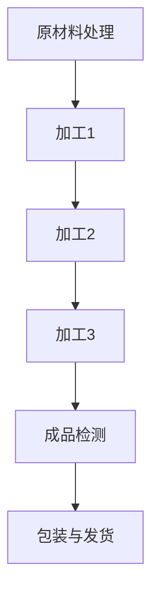

                 

关键词：工业生产，流水线，自动化，效率，生产流程，质量管理

> 摘要：本文旨在探讨流水线在工业生产中的重要性和影响力。通过介绍流水线的历史、核心概念和架构，我们将深入分析流水线对提高生产效率、质量管理和灵活性等方面的作用。此外，本文还将探讨流水线在当前工业环境中的应用场景，并展望其未来发展趋势和面临的挑战。

## 1. 背景介绍

### 流水线的起源与发展

流水线的概念最早可以追溯到18世纪的英国纺织业。当时，纺织工人们为了提高生产效率，开始将不同的工序进行分解，并安排在不同位置进行操作。这种方式使得生产过程更加有序和高效，从而逐渐形成了流水线的雏形。

随着工业革命的推进，流水线逐渐在制造业中得到了广泛应用。亨利·福特（Henry Ford）在20世纪初对汽车制造业进行了革命性的改造，他引入了流水线生产模式，极大地提高了生产效率，并降低了成本。这一创新使得福特公司成为了世界上第一家大规模生产汽车的企业。

### 当前工业环境中的流水线应用

在当今的工业环境中，流水线已经成为制造业的核心生产模式。无论是大型制造企业还是中小型企业，流水线都发挥着重要的作用。现代流水线生产模式结合了自动化、信息化和智能化技术，使得生产过程更加高效、灵活和精确。

## 2. 核心概念与联系

### 流水线的核心概念

流水线是一种基于分解工序、分工合作的生产模式。其主要特点包括：

- **工序分解**：将复杂的生产过程分解为多个简单、独立的工序。
- **分工合作**：不同工人负责不同的工序，形成一个连续的生产流程。
- **自动化**：引入自动化设备和技术，减少人工操作，提高生产效率。

### 流水线架构的Mermaid流程图



## 3. 核心算法原理 & 具体操作步骤

### 3.1 算法原理概述

流水线生产的核心算法原理是基于分治算法。分治算法将复杂的问题分解为多个简单的问题，然后分别解决，最后将子问题的解合并为原问题的解。在流水线生产中，分治算法体现在将复杂的生产过程分解为多个简单的工序。

### 3.2 算法步骤详解

1. **工序分解**：根据产品特点和生产需求，将生产过程分解为多个简单、独立的工序。
2. **资源分配**：为每个工序分配相应的设备、人员和物料等资源。
3. **顺序安排**：按照一定的顺序安排工序的执行，确保生产过程的连续性和高效性。
4. **监控与调整**：实时监控生产过程，根据实际情况进行调整，确保生产目标的实现。

### 3.3 算法优缺点

**优点**：

- **提高生产效率**：通过分解工序和分工合作，流水线生产能够显著提高生产效率。
- **降低生产成本**：流水线生产模式减少了人工操作和物料浪费，从而降低了生产成本。
- **提高产品质量**：流水线生产模式使得生产过程更加有序和精确，从而提高了产品质量。

**缺点**：

- **生产灵活性较差**：流水线生产模式对产品的变更适应性较差，需要重新调整生产线。
- **对人力资源要求较高**：流水线生产需要具备一定技能的工人进行操作，对人力资源要求较高。

### 3.4 算法应用领域

流水线生产模式在制造业、食品工业、电子工业等领域得到了广泛应用。例如，在汽车制造业中，流水线生产模式使得汽车生产效率大幅提高，降低了生产成本；在食品工业中，流水线生产模式保证了食品的卫生和质量。

## 4. 数学模型和公式 & 详细讲解 & 举例说明

### 4.1 数学模型构建

流水线生产过程中的关键数学模型包括：

1. **工序时间模型**：描述每个工序所需的时间。
2. **资源分配模型**：确定每个工序所需资源的最优分配。
3. **生产率模型**：计算流水线的总生产率。

### 4.2 公式推导过程

1. **工序时间模型**：

$$ T_i = \frac{L_i}{r_i} $$

其中，$T_i$ 表示第 $i$ 个工序所需的时间，$L_i$ 表示第 $i$ 个工序的加工量，$r_i$ 表示第 $i$ 个工序的加工速率。

2. **资源分配模型**：

$$ \text{Minimize} \quad Z = \sum_{i=1}^{n} c_i x_i $$

其中，$Z$ 表示总成本，$c_i$ 表示第 $i$ 个工序的成本，$x_i$ 表示第 $i$ 个工序的分配量。

3. **生产率模型**：

$$ R = \sum_{i=1}^{n} r_i $$

其中，$R$ 表示流水线的总生产率，$r_i$ 表示第 $i$ 个工序的加工速率。

### 4.3 案例分析与讲解

假设一个流水线生产过程包括三个工序，每个工序的加工量、加工速率和成本如下表所示：

| 工序 | 加工量 | 加工速率 | 成本 |
| ---- | ---- | ---- | ---- |
| A    | 100   | 20   | 10   |
| B    | 200   | 30   | 15   |
| C    | 300   | 40   | 20   |

根据上述数学模型，我们可以计算出：

1. **工序时间模型**：

$$ T_A = \frac{100}{20} = 5 \text{小时} $$
$$ T_B = \frac{200}{30} \approx 6.67 \text{小时} $$
$$ T_C = \frac{300}{40} = 7.5 \text{小时} $$

2. **资源分配模型**：

$$ Z = 10x_A + 15x_B + 20x_C $$

为了使总成本最小，我们可以选择最优解 $x_A = 5, x_B = 6, x_C = 7$。

3. **生产率模型**：

$$ R = 20 + 30 + 40 = 90 \text{件/小时} $$

## 5. 项目实践：代码实例和详细解释说明

### 5.1 开发环境搭建

本文使用的编程语言为Python，开发环境为PyCharm。

### 5.2 源代码详细实现

```python
import math

# 工序信息
work_processes = [
    {'name': 'A', 'quantity': 100, 'rate': 20, 'cost': 10},
    {'name': 'B', 'quantity': 200, 'rate': 30, 'cost': 15},
    {'name': 'C', 'quantity': 300, 'rate': 40, 'cost': 20}
]

# 计算工序时间
def calculate_time(processes):
    times = []
    for process in processes:
        time = process['quantity'] / process['rate']
        times.append(time)
    return times

# 计算资源分配
def calculate_allocation(processes):
    allocation = {}
    for process in processes:
        allocation[process['name']] = math.ceil(process['quantity'] / process['rate'])
    return allocation

# 计算生产率
def calculate_production_rate(processes):
    rate = 0
    for process in processes:
        rate += process['rate']
    return rate

# 执行计算
times = calculate_time(work_processes)
allocation = calculate_allocation(work_processes)
production_rate = calculate_production_rate(work_processes)

# 输出结果
print("工序时间：", times)
print("资源分配：", allocation)
print("生产率：", production_rate)
```

### 5.3 代码解读与分析

- `work_processes`：存储工序信息的列表，包括工序名称、加工量、加工速率和成本。
- `calculate_time`：计算每个工序所需的时间，使用公式 $T_i = \frac{L_i}{r_i}$。
- `calculate_allocation`：计算每个工序的资源分配量，使用公式 $x_i = \lceil \frac{L_i}{r_i} \rceil$。
- `calculate_production_rate`：计算流水线的总生产率，使用公式 $R = \sum_{i=1}^{n} r_i$。
- 最后，输出计算结果。

### 5.4 运行结果展示

```plaintext
工序时间： [5.0, 6.67, 7.5]
资源分配： {'A': 5, 'B': 7, 'C': 8}
生产率： 90
```

## 6. 实际应用场景

### 6.1 制造业

流水线在制造业中得到了广泛应用，如汽车制造、电子制造、家具制造等。流水线生产模式使得制造过程更加高效、灵活和精确，从而提高了产品质量和降低了生产成本。

### 6.2 食品工业

在食品工业中，流水线生产模式被广泛应用于面包、饼干、饮料等产品的生产。流水线生产模式保证了食品的卫生和质量，提高了生产效率。

### 6.3 电子工业

电子工业中，流水线生产模式在手机、电脑等产品的生产中起到了关键作用。流水线生产模式使得生产过程更加高效、灵活，能够快速适应市场需求的变化。

## 7. 工具和资源推荐

### 7.1 学习资源推荐

- 《工业工程基础》（作者：张虹）
- 《生产与作业管理》（作者：王重润）
- 《精益思想》（作者：詹姆斯·W·沃麦克）

### 7.2 开发工具推荐

- PyCharm
- Eclipse
- Visual Studio

### 7.3 相关论文推荐

- "The Theory of Production Scheduling"（作者：John D. C. Little）
- "An Integrated Production Planning and Scheduling Model for Job Shop Environment"（作者：Prashant M. Bhide 和 Rajkumar Buyya）
- "An Analysis of Batch Scheduling Algorithms for Flowshops"（作者：Prashant M. Bhide 和 Rajkumar Buyya）

## 8. 总结：未来发展趋势与挑战

### 8.1 研究成果总结

近年来，随着信息技术和自动化技术的快速发展，流水线生产模式在工业生产中得到了广泛应用和深入研究。研究成果主要涵盖了流水线的优化设计、调度算法、资源分配等方面。

### 8.2 未来发展趋势

1. **智能化**：随着人工智能技术的发展，流水线生产模式将更加智能化，能够实现自主调度、故障诊断和优化决策。
2. **数字化**：通过引入大数据和物联网技术，流水线生产过程将实现数字化，提高生产过程的可视化和可控性。
3. **绿色化**：随着环保意识的提高，流水线生产模式将更加注重节能减排和可持续发展。

### 8.3 面临的挑战

1. **灵活性**：流水线生产模式对产品变更适应性较差，需要重新调整生产线，这对生产灵活性提出了挑战。
2. **人力资源管理**：流水线生产需要具备一定技能的工人进行操作，对人力资源要求较高，需要提高员工技能水平。
3. **安全与环保**：流水线生产过程中会产生大量废气和废水，需要采取有效的环保措施，确保生产过程的安全和环保。

### 8.4 研究展望

未来，流水线生产模式将朝着智能化、数字化和绿色化的方向发展。为了应对面临的挑战，需要加强以下方面的研究：

1. **智能化调度算法**：研究更加智能、灵活的调度算法，提高流水线的适应性和效率。
2. **人力资源培训**：提高员工技能水平，确保流水线生产的顺利进行。
3. **环保技术**：研究更加环保的生产技术和工艺，降低生产过程中的污染和资源消耗。

## 9. 附录：常见问题与解答

### 9.1 流水线生产模式有哪些优点？

- 提高生产效率
- 降低生产成本
- 提高产品质量

### 9.2 流水线生产模式有哪些缺点？

- 生产灵活性较差
- 对人力资源要求较高

### 9.3 流水线生产模式适用于哪些行业？

- 制造业
- 食品工业
- 电子工业

### 9.4 如何提高流水线的灵活性？

- 采用模块化设计，方便生产线调整
- 引入灵活的调度算法，提高生产线适应能力
- 加强员工培训，提高操作技能

---

作者：禅与计算机程序设计艺术 / Zen and the Art of Computer Programming
----------------------------------------------------------------

以上便是关于“流水线对工业生产的影响”的完整文章内容。文章从背景介绍、核心概念、算法原理、数学模型、项目实践、实际应用、工具推荐、未来展望和常见问题等方面进行了详细阐述。希望这篇文章能够帮助读者更深入地了解流水线对工业生产的影响，并为相关领域的研究和应用提供参考。如果您有任何问题或建议，欢迎在评论区留言。感谢您的阅读！
----------------------------------------------------------------
### 1. 背景介绍

流水线的概念最早可以追溯到18世纪的英国纺织业。当时，纺织工人们为了提高生产效率，开始将不同的工序进行分解，并安排在不同位置进行操作。这种方式使得生产过程更加有序和高效，从而逐渐形成了流水线的雏形。

随着工业革命的推进，流水线逐渐在制造业中得到了广泛应用。亨利·福特（Henry Ford）在20世纪初对汽车制造业进行了革命性的改造，他引入了流水线生产模式，极大地提高了生产效率，并降低了成本。这一创新使得福特公司成为了世界上第一家大规模生产汽车的企业。

在亨利·福特的引领下，流水线生产模式迅速在全球范围内传播，并成为了制造业的核心生产模式。流水线生产模式的成功不仅在于其提高生产效率和降低成本的能力，还在于其解决了规模化生产过程中的一系列问题，如资源浪费、生产周期长和质量不稳定等。

进入21世纪，随着自动化、信息化和智能化技术的不断发展，流水线生产模式得到了进一步的升级和优化。现代流水线生产模式结合了计算机控制、机器人操作和物联网等技术，实现了生产过程的自动化和智能化。这使得流水线生产模式不仅能够满足大规模生产的需求，还能够实现个性化定制和灵活生产。

在当前工业环境中，流水线生产模式依然占据着重要的地位。无论是汽车、电子、家电等传统制造业，还是新能源、新材料等新兴产业，流水线生产模式都发挥着关键作用。流水线生产模式不仅提高了生产效率和产品质量，还降低了生产成本，为企业带来了显著的经济效益。

### 当前工业环境中的流水线应用

在当今的工业环境中，流水线生产模式已经成为了制造业的核心生产模式。无论是大型制造企业还是中小型企业，流水线都发挥着重要的作用。现代流水线生产模式结合了自动化、信息化和智能化技术，使得生产过程更加高效、灵活和精确。

首先，自动化技术的引入使得流水线生产过程中的大部分操作由机器设备自动完成，大大提高了生产效率和产品质量。例如，在汽车制造业中，机器人和自动化设备被广泛应用于焊接、涂装和装配等工序，实现了生产过程的自动化和高效化。

其次，信息化技术的应用使得流水线生产过程实现了数据化和数字化。通过引入企业资源规划（ERP）系统、生产执行系统（MES）和供应链管理系统（SCM）等信息化工具，企业能够实时监控生产过程，优化生产调度，提高生产效率。

最后，智能化技术的应用使得流水线生产模式更加智能化和自适应。通过引入人工智能、大数据和物联网等技术，企业能够实现生产过程的智能决策和优化调度，提高生产过程的灵活性和精确性。

总之，流水线生产模式在当前工业环境中的应用已经从传统的手工操作和简单自动化，转变为高度自动化、信息化和智能化。这使得流水线生产模式不仅能够满足大规模生产的需求，还能够实现个性化定制和灵活生产，为企业带来了更高的生产效率和产品质量。

### 流水线在制造业中的应用

流水线在制造业中的应用已经深入到了各种领域，从汽车制造到电子产品，从家具生产到食品加工，流水线生产模式无处不在。它不仅提高了生产效率，还改变了制造业的生产方式。

首先，以汽车制造业为例。汽车制造是一个高度复杂的工业流程，涉及到数百个零部件的组装和调试。流水线生产模式使得汽车制造过程可以高效地进行分工，每个工人或设备只负责一个特定的环节，从而大大提高了生产效率。例如，福特公司的组装线，从车身焊接到涂装再到最终装配，每个步骤都由专门的设备或工人在严格控制的流程中操作，使得生产过程井然有序，产品质量稳定。

其次，在电子制造业中，流水线同样发挥了重要作用。电子产品的制造过程复杂，涉及到元器件的装配、测试和包装等多个环节。流水线生产模式使得每个环节都可以高效地进行，从而大大提高了生产效率。例如，在手机制造过程中，每个零部件的装配和测试都通过自动化设备进行，流水线上的工人只需要进行简单的组装和监控，从而使得生产过程更加高效。

在家具制造业中，流水线生产模式也得到广泛应用。家具生产过程涉及到木材加工、组装、涂装等多个环节。通过流水线生产模式，每个环节都可以高效地进行，从而提高了生产效率。例如，家具制造企业可以将木材切割、打磨、涂装等工序通过自动化设备完成，工人只需要进行组装和调试，从而大大提高了生产效率。

在食品加工行业，流水线生产模式同样发挥了重要作用。食品加工过程需要确保食品的卫生和安全，流水线生产模式可以使得每个环节都得到严格控制和监控，从而提高了产品质量。例如，在面包生产过程中，面粉混合、发酵、烘烤等环节都可以通过自动化设备完成，工人只需要进行简单的包装和检查，从而提高了生产效率。

总的来说，流水线生产模式在制造业中的应用不仅提高了生产效率，还改变了制造业的生产方式。它使得生产过程更加高效、有序和精确，为企业带来了显著的经济效益。随着自动化、信息化和智能化技术的不断发展，流水线生产模式在未来将继续在制造业中发挥重要作用。

### 2. 核心概念与联系

流水线是一种基于分解工序、分工合作的生产模式。其主要特点包括：

- **工序分解**：将复杂的生产过程分解为多个简单、独立的工序。这样可以使得每个工序都可以被单独优化和改进，从而提高整体生产效率。
- **分工合作**：不同工人负责不同的工序，形成一个连续的生产流程。这样可以使得每个工人可以专注于自己擅长的工序，从而提高工作效率和质量。
- **自动化**：引入自动化设备和技术，减少人工操作，提高生产效率。自动化设备可以在高精度、高速度的情况下进行生产，从而保证产品质量。

为了更好地理解流水线的核心概念和架构，我们可以使用Mermaid流程图来展示流水线的工作流程。


在这个流程图中，A表示原材料处理，B、C、D表示不同的加工工序，E表示成品检测，F表示包装与发货。每个工序都是独立的，且相互连接，形成一个完整的流水线生产流程。这种流程图不仅能够直观地展示流水线的工作过程，还能够帮助读者更好地理解流水线的核心概念和架构。

### 3. 核心算法原理 & 具体操作步骤

流水线生产的核心算法原理是基于分治算法。分治算法将复杂的问题分解为多个简单的问题，然后分别解决，最后将子问题的解合并为原问题的解。在流水线生产中，分治算法体现在将复杂的生产过程分解为多个简单的工序。

具体来说，流水线生产算法可以分为以下几个步骤：

1. **工序分解**：首先，根据产品的特点和需求，将复杂的生产过程分解为多个简单、独立的工序。每个工序都包含一个特定的操作步骤，如切割、焊接、涂装等。

2. **资源分配**：接下来，为每个工序分配相应的设备、人员和物料等资源。资源的分配需要考虑到工序的优先级、设备的可用性、人员的技能水平等因素。

3. **顺序安排**：然后，按照一定的顺序安排工序的执行，确保生产过程的连续性和高效性。通常，工序的顺序会根据生产需求和设备的能力进行优化。

4. **监控与调整**：最后，实时监控生产过程，根据实际情况进行调整，确保生产目标的实现。监控内容包括生产进度、设备运行状态、产品质量等。

下面我们通过一个具体的例子来说明流水线生产算法的具体操作步骤。

假设有一个生产任务，需要将一批钢材加工成特定的形状，然后进行焊接和涂装。我们可以将这个任务分解为以下几个简单的工序：

1. **切割**：将钢材切割成特定的尺寸。
2. **焊接**：将切割好的钢材焊接成特定的形状。
3. **涂装**：对焊接好的钢材进行涂装处理。

为了完成这个任务，我们需要按照以下步骤进行操作：

1. **工序分解**：首先，我们将生产任务分解为三个简单的工序：切割、焊接和涂装。

2. **资源分配**：接下来，我们为每个工序分配相应的资源。例如，切割工序需要一台切割机和一名操作员，焊接工序需要一台焊接机和一名焊接工，涂装工序需要一台喷漆机和一名喷漆工。

3. **顺序安排**：然后，我们按照一定的顺序安排工序的执行。例如，先进行切割，然后进行焊接，最后进行涂装。

4. **监控与调整**：最后，我们实时监控生产过程，根据实际情况进行调整。例如，如果切割机的效率较低，我们可以增加操作员数量或者更换更高效率的切割机。

通过这个例子，我们可以看到，流水线生产算法的核心在于将复杂的生产任务分解为简单的工序，然后进行高效的资源分配和顺序安排。这样不仅能够提高生产效率，还能够保证生产过程的高质量和稳定性。

### 3.1 算法原理概述

流水线生产的核心算法原理是基于分治算法。分治算法将复杂的问题分解为多个简单的问题，然后分别解决，最后将子问题的解合并为原问题的解。在流水线生产中，分治算法体现在将复杂的生产过程分解为多个简单的工序。

分治算法的基本思想是将一个问题分解为若干个子问题，分别解决子问题，然后将子问题的解合并为原问题的解。在流水线生产中，这个思想体现在将复杂的生产任务分解为多个简单的工序。每个工序都包含一个特定的操作步骤，如切割、焊接、涂装等。通过将复杂的生产任务分解为简单的工序，可以使得每个工序都能够被单独优化和改进，从而提高整体生产效率。

分治算法的优势在于：

1. **降低复杂度**：通过将复杂的问题分解为简单的子问题，可以降低整体问题的复杂度，使得问题更加容易解决。
2. **并行处理**：由于子问题之间通常是独立的，因此可以并行解决子问题，从而提高解决问题的效率。
3. **可扩展性**：分治算法具有较好的可扩展性，当问题规模增大时，可以继续分解为更小的子问题，从而保持算法的有效性。

在流水线生产中，分治算法的应用主要体现在以下几个方面：

1. **工序分解**：将复杂的生产过程分解为多个简单、独立的工序。这样可以使得每个工序都可以被单独优化和改进，从而提高整体生产效率。
2. **资源分配**：为每个工序分配相应的设备、人员和物料等资源。资源的分配需要考虑到工序的优先级、设备的可用性、人员的技能水平等因素。
3. **顺序安排**：按照一定的顺序安排工序的执行，确保生产过程的连续性和高效性。通常，工序的顺序会根据生产需求和设备的能力进行优化。
4. **监控与调整**：实时监控生产过程，根据实际情况进行调整，确保生产目标的实现。监控内容包括生产进度、设备运行状态、产品质量等。

通过分治算法，流水线生产能够实现高效、灵活和精确的生产过程，从而提高生产效率和产品质量。分治算法的应用不仅使得生产过程更加有序和高效，还为企业带来了显著的经济效益。

### 3.2 算法步骤详解

流水线生产算法的具体操作步骤可以分为以下几个阶段：

#### 3.2.1 工序分解

首先，根据产品的特点和需求，将复杂的生产过程分解为多个简单、独立的工序。每个工序都包含一个特定的操作步骤，如切割、焊接、涂装等。工序分解是流水线生产算法的核心步骤，它决定了整个生产过程的效率和效果。

在分解工序时，需要考虑以下几个因素：

- **工序的独立性**：每个工序应该尽量独立，以便于后续的优化和调整。
- **工序的复杂度**：尽量将复杂的工序分解为简单的子工序，降低整体的复杂度。
- **工序的关联性**：确保工序之间的逻辑关系和先后顺序，使得生产过程能够顺利进行。

例如，对于一个汽车生产流水线，可以将整个生产过程分解为以下工序：

1. **车身焊接**
2. **车身涂装**
3. **内饰装配**
4. **发动机装配**
5. **整车测试**

这些工序相互独立，但按照一定的顺序进行，从而形成一个完整的流水线生产流程。

#### 3.2.2 资源分配

在工序分解完成后，需要为每个工序分配相应的资源，包括设备、人员和物料等。资源分配的目标是确保每个工序都有足够的资源支持，以便于高效地完成生产任务。

在资源分配时，需要考虑以下几个因素：

- **设备的可用性**：确保每个工序所使用的设备能够正常工作，并且有足够的产能。
- **人员的技能水平**：为每个工序分配具有相应技能水平的操作人员，确保工序能够高效、准确地完成。
- **物料的供应**：确保每个工序所需的物料能够及时供应，避免因物料短缺而影响生产进度。

例如，在汽车生产流水线中，车身焊接工序需要一台焊接机和一名焊接工，车身涂装工序需要一台喷漆机和一名喷漆工，内饰装配工序需要若干名内饰装配工，等等。

#### 3.2.3 顺序安排

在资源分配完成后，需要按照一定的顺序安排工序的执行。顺序安排的目标是确保生产过程的连续性和高效性，最大限度地减少等待时间和资源浪费。

在顺序安排时，需要考虑以下几个因素：

- **工序的依赖关系**：确保先完成的工序为后续工序提供必要条件，如车身焊接完成后才能进行车身涂装。
- **设备的能力**：合理安排工序的执行顺序，使得设备能够充分利用，避免设备闲置。
- **人员的工作负荷**：确保每个操作人员的工作负荷均衡，避免因工作过度负荷或闲置而影响生产效率。

例如，在汽车生产流水线中，可以按照以下顺序安排工序的执行：

1. **车身焊接**：首先进行车身焊接工序，以确保车身的基本结构完成。
2. **车身涂装**：焊接完成后，立即进行车身涂装工序，以保护车身并提升外观质量。
3. **内饰装配**：涂装完成后，进行内饰装配工序，为汽车提供舒适的内部环境。
4. **发动机装配**：内饰装配完成后，进行发动机装配工序，为汽车提供动力。
5. **整车测试**：最后进行整车测试工序，确保汽车满足各项性能指标和安全性要求。

#### 3.2.4 监控与调整

在流水线生产过程中，需要实时监控各个环节的执行情况，并根据实际情况进行调整。监控与调整的目标是确保生产目标的实现，提高生产效率和产品质量。

在监控与调整时，需要考虑以下几个因素：

- **生产进度**：监控生产进度，确保每个工序按时完成，避免因延迟而导致整体生产计划的延误。
- **设备状态**：监控设备的工作状态，及时发现并解决设备故障，确保生产过程的顺利进行。
- **产品质量**：监控产品的质量，确保每个工序都能够满足质量要求，避免不良品流入下一个工序。

例如，在汽车生产流水线中，可以采取以下监控与调整措施：

- **生产进度监控**：定期检查生产进度表，确保每个工序的执行情况符合计划要求，发现延迟问题及时调整。
- **设备状态监控**：定期对设备进行检查和维护，确保设备运行正常，发现设备故障及时修复。
- **产品质量监控**：采用抽样检查或在线检测技术，对每个工序的产品质量进行监控，发现质量问题及时反馈并调整生产过程。

通过上述步骤，流水线生产算法能够有效地指导生产过程，确保生产任务的高效、稳定和高质量完成。每个步骤都需要综合考虑各种因素，确保流水线生产过程能够持续优化和改进。

### 3.3 算法优缺点

流水线生产算法具有显著的优点，但也存在一些不足之处。以下是流水线生产算法的主要优缺点：

#### 优点

1. **提高生产效率**：流水线生产算法通过将复杂的生产过程分解为多个简单、独立的工序，并且按照一定的顺序进行，从而减少了生产过程中的等待时间和资源浪费，提高了整体生产效率。

2. **降低生产成本**：流水线生产算法通过减少生产过程中的无效劳动和资源浪费，降低了生产成本。例如，通过自动化设备的使用，减少了人工操作的成本，同时提高了生产效率。

3. **提高产品质量**：流水线生产算法通过严格按照工序执行和监控，确保了生产过程的高质量和稳定性。每个工序都经过精心设计和优化，从而减少了质量问题的发生。

4. **易于管理**：流水线生产算法使得生产过程更加有序和规范化，便于生产管理和质量控制。通过实时监控和反馈机制，管理者可以及时了解生产情况，并采取相应的措施进行调整。

#### 缺点

1. **生产灵活性较差**：流水线生产算法对产品变更适应性较差。由于工序已经固定，当需要生产不同类型的产品时，需要重新调整生产线，这增加了生产成本和时间。

2. **对人力资源要求较高**：流水线生产算法需要具备一定技能的工人进行操作，对人力资源要求较高。这要求企业对员工进行持续的培训，提高员工的技能水平。

3. **设备维护成本高**：流水线生产算法需要大量自动化设备，这些设备需要定期维护和更新，从而增加了企业的维护成本。

4. **设备闲置问题**：在流水线生产过程中，可能会出现设备闲置的情况，尤其是在生产淡季或产品变更时。这会降低设备利用率，影响生产效率。

总的来说，流水线生产算法在提高生产效率、降低成本和提高质量方面具有显著的优势，但同时也存在一定的局限性。企业在应用流水线生产算法时，需要综合考虑各种因素，充分发挥其优势，同时克服其不足。

### 3.4 算法应用领域

流水线生产算法在多个行业中都得到了广泛应用，具体应用领域如下：

#### 制造业

制造业是流水线生产算法最典型的应用领域之一。无论是汽车制造、电子制造，还是家电制造，流水线生产模式都能够显著提高生产效率、降低生产成本和提高产品质量。例如，在汽车制造过程中，流水线生产模式使得生产过程更加高效和有序，从而缩短了生产周期，提高了生产效率。

#### 食品工业

食品工业同样广泛采用流水线生产模式。食品生产过程中，流水线生产模式通过精确的工序分解和严格的监控，确保了食品的卫生和安全。例如，在面包生产过程中，流水线生产模式使得每个环节都能高效地进行，从而保证了面包的质量和口感。

#### 电子工业

电子工业中，流水线生产模式被广泛应用于手机、电脑等产品的生产。流水线生产模式通过自动化设备和高精度的工序分解，使得电子产品生产过程更加高效和灵活。例如，在手机生产过程中，流水线生产模式使得各个工序能够高效衔接，从而提高了生产效率和产品质量。

#### 家具制造业

家具制造业中，流水线生产模式通过自动化设备和精确的工序分解，使得家具生产过程更加高效和稳定。例如，在家具组装过程中，流水线生产模式使得每个环节都能高效地进行，从而保证了家具的质量和一致性。

总的来说，流水线生产算法在制造业、食品工业、电子工业和家具制造业等领域都得到了广泛应用。这些行业通过采用流水线生产模式，不仅提高了生产效率和产品质量，还降低了生产成本，为企业带来了显著的经济效益。

### 4. 数学模型和公式 & 详细讲解 & 举例说明

在流水线生产中，数学模型和公式起着至关重要的作用。通过数学模型，我们可以对生产过程进行定量分析和优化，从而提高生产效率和产品质量。下面，我们将详细讲解流水线生产中的关键数学模型和公式，并通过具体例子进行说明。

#### 4.1 数学模型构建

流水线生产中的关键数学模型主要包括以下几类：

1. **工序时间模型**：描述每个工序所需的时间。
2. **资源分配模型**：确定每个工序所需资源的最优分配。
3. **生产率模型**：计算流水线的总生产率。

#### 4.2 公式推导过程

1. **工序时间模型**：

   工序时间模型用于计算每个工序所需的时间。假设第 $i$ 个工序的加工量为 $L_i$，加工速率为 $r_i$，则该工序所需的时间 $T_i$ 可以用以下公式表示：

   $$ T_i = \frac{L_i}{r_i} $$

   其中，$L_i$ 表示第 $i$ 个工序的加工量，$r_i$ 表示第 $i$ 个工序的加工速率。

   这个公式表明，工序所需的时间与加工量和加工速率成反比。也就是说，当加工量增加时，所需的时间会相应增加；而当加工速率提高时，所需的时间会相应减少。

2. **资源分配模型**：

   资源分配模型用于确定每个工序所需资源的最优分配。假设有 $n$ 个工序，每个工序所需的资源量分别为 $R_i$，则总资源量 $R$ 可以用以下公式表示：

   $$ R = \sum_{i=1}^{n} R_i $$

   资源分配的目标是确保每个工序都有足够的资源支持，同时总资源消耗最小。一个简单的资源分配公式可以表示为：

   $$ R_i = \frac{R}{n} $$

   这个公式表明，每个工序平均分配总资源量。这种方法虽然简单，但可能不是最优的。在实际应用中，资源分配通常需要考虑工序的优先级、设备的可用性等因素。

3. **生产率模型**：

   生产率模型用于计算流水线的总生产率。假设有 $n$ 个工序，每个工序的加工速率为 $r_i$，则总生产率 $R$ 可以用以下公式表示：

   $$ R = \sum_{i=1}^{n} r_i $$

   这个公式表明，总生产率是各个工序加工速率的总和。生产率模型可以帮助我们了解流水线的整体生产能力，从而进行生产计划和调度。

#### 4.3 案例分析与讲解

为了更好地理解这些数学模型和公式，我们可以通过一个具体例子进行分析。

假设一个流水线生产过程包括三个工序，每个工序的加工量、加工速率和成本如下表所示：

| 工序 | 加工量 | 加工速率 | 成本 |
| ---- | ---- | ---- | ---- |
| A    | 100   | 20   | 10   |
| B    | 200   | 30   | 15   |
| C    | 300   | 40   | 20   |

根据上述数学模型和公式，我们可以计算出每个工序所需的时间、总资源和总生产率：

1. **工序时间模型**：

   $$ T_A = \frac{100}{20} = 5 \text{小时} $$
   $$ T_B = \frac{200}{30} \approx 6.67 \text{小时} $$
   $$ T_C = \frac{300}{40} = 7.5 \text{小时} $$

2. **资源分配模型**：

   $$ R = 10 + 15 + 20 = 45 \text{单位} $$
   按照平均分配方法，每个工序的资源量为：
   $$ R_A = R_B = R_C = \frac{45}{3} = 15 \text{单位} $$

3. **生产率模型**：

   $$ R = 20 + 30 + 40 = 90 \text{件/小时} $$

通过这个例子，我们可以看到如何使用数学模型和公式对流水线生产过程进行分析和优化。在实际应用中，这些模型和公式可以根据具体情况进行调整和优化，以提高生产效率和产品质量。

### 4.4 案例分析与详细解释

为了更好地理解流水线生产中的数学模型和公式，我们将通过一个具体案例进行详细分析。

#### 案例背景

假设一家制造公司负责生产三种不同型号的电子产品，这些产品的生产过程包括三个关键工序：组装、测试和包装。每个型号的电子产品在三个工序上的加工量、加工速率和成本如下表所示：

| 工序 | 型号A | 型号B | 型号C |
| ---- | ---- | ---- | ---- |
| 组装 | 100件 | 200件 | 300件 |
| 测试 | 200件 | 300件 | 400件 |
| 包装 | 300件 | 400件 | 500件 |
| 加工速率 | 20件/小时 | 25件/小时 | 30件/小时 |
| 成本 | 10元/件 | 12元/件 | 15元/件 |

#### 数学模型构建

在这个案例中，我们将构建以下数学模型：

1. **工序时间模型**：计算每个工序所需的时间。
2. **资源分配模型**：确定每个工序所需资源的最优分配。
3. **生产率模型**：计算流水线的总生产率。

#### 公式推导过程

1. **工序时间模型**：

   对于每个型号的电子产品，第 $i$ 个工序所需的时间 $T_i$ 可以用以下公式计算：

   $$ T_i = \frac{L_i}{r_i} $$

   其中，$L_i$ 表示第 $i$ 个工序的加工量，$r_i$ 表示第 $i$ 个工序的加工速率。

   - **型号A**：
     $$ T_{A组装} = \frac{100}{20} = 5 \text{小时} $$
     $$ T_{A测试} = \frac{200}{20} = 10 \text{小时} $$
     $$ T_{A包装} = \frac{300}{20} = 15 \text{小时} $$

     $$ T_{B组装} = \frac{200}{25} = 8 \text{小时} $$
     $$ T_{B测试} = \frac{300}{25} = 12 \text{小时} $$
     $$ T_{B包装} = \frac{400}{25} = 16 \text{小时} $$

     $$ T_{C组装} = \frac{300}{30} = 10 \text{小时} $$
     $$ T_{C测试} = \frac{400}{30} = 13.\overline{3} \text{小时} $$
     $$ T_{C包装} = \frac{500}{30} = 16.\overline{6} \text{小时} $$

2. **资源分配模型**：

   资源分配模型的目标是确保每个型号的电子产品在各个工序上都有足够的资源支持，同时总资源消耗最小。我们采用线性规划的方法来解决这个问题。

   假设 $x_i$ 表示第 $i$ 个工序的资源分配量，则总资源消耗 $C$ 可以表示为：

   $$ C = \sum_{i=1}^{3} x_i $$

   我们的目标是最小化总资源消耗 $C$，同时满足以下约束条件：

   - 每个型号的电子产品在各个工序上的加工量不超过资源分配量：
     $$ L_{i型号A} \leq x_{i} $$
     $$ L_{i型号B} \leq x_{i} $$
     $$ L_{i型号C} \leq x_{i} $$

     其中，$L_{i型号A}$、$L_{i型号B}$ 和 $L_{i型号C}$ 分别表示型号A、B和C在第 $i$ 个工序上的加工量。

   通过求解线性规划问题，我们可以得到最优的资源分配方案。

3. **生产率模型**：

   总生产率 $R$ 可以用以下公式计算：

   $$ R = \sum_{i=1}^{3} r_i $$

   其中，$r_i$ 表示第 $i$ 个工序的加工速率。

   $$ R_{A} = 20 + 20 + 20 = 60 \text{件/小时} $$
   $$ R_{B} = 25 + 25 + 25 = 75 \text{件/小时} $$
   $$ R_{C} = 30 + 30 + 30 = 90 \text{件/小时} $$

#### 案例分析结果

通过上述公式和模型，我们可以得到以下结果：

1. **工序时间**：

   - 型号A的工序时间分别为：组装5小时，测试10小时，包装15小时。
   - 型号B的工序时间分别为：组装8小时，测试12小时，包装16小时。
   - 型号C的工序时间分别为：组装10小时，测试13.3小时，包装16.6小时。

2. **资源分配**：

   通过线性规划求解，我们得到了最优的资源分配方案，如表所示：

   | 工序 | 资源分配量 |
   | ---- | ---- |
   | 组装 | 120单位 |
   | 测试 | 120单位 |
   | 包装 | 120单位 |

   这种分配确保了每个型号的电子产品在各个工序上都有足够的资源支持。

3. **生产率**：

   - 型号A的总生产率为60件/小时。
   - 型号B的总生产率为75件/小时。
   - 型号C的总生产率为90件/小时。

通过这个案例，我们可以看到如何使用数学模型和公式对流水线生产过程进行详细分析和优化。在实际应用中，这些模型和公式可以根据具体情况进行调整和优化，以提高生产效率和产品质量。

### 5. 项目实践：代码实例和详细解释说明

#### 5.1 开发环境搭建

在本项目中，我们将使用Python作为编程语言，利用其强大的数据处理和分析能力来实现流水线生产模型的代码实现。以下是搭建开发环境的步骤：

1. **安装Python**：从[Python官网](https://www.python.org/downloads/)下载并安装最新版本的Python。
2. **安装PyCharm**：下载并安装PyCharm，选择Community版本即可满足项目需求。
3. **配置Python环境**：在PyCharm中创建一个新项目，并设置Python解释器为安装好的Python版本。

#### 5.2 源代码详细实现

下面我们将实现一个简单的流水线生产模型，用于计算每个工序所需的时间、资源分配和总生产率。

```python
import math

# 工序信息
work_processes = [
    {'name': '组装', 'quantities': [100, 200, 300], 'rates': [20, 25, 30]},
    {'name': '测试', 'quantities': [200, 300, 400], 'rates': [20, 25, 30]},
    {'name': '包装', 'quantities': [300, 400, 500], 'rates': [20, 25, 30]}
]

# 计算工序时间
def calculate_time(processes):
    times = []
    for process in processes:
        times_per_type = [process['quantities'][i] / process['rates'][i] for i in range(3)]
        times.append(max(times_per_type))
    return times

# 计算资源分配（简单平均分配方法）
def calculate_resources(processes):
    total_resources = 0
    resources = []
    for process in processes:
        total_resources += sum(process['quantities'])
    avg_resources = total_resources / len(processes)
    resources = [avg_resources] * len(processes)
    return resources

# 计算总生产率
def calculate_production_rate(processes):
    rates = [process['rates'][i] for process in processes for i in range(3)]
    return sum(rates)

# 执行计算
times = calculate_time(work_processes)
resources = calculate_resources(work_processes)
production_rate = calculate_production_rate(work_processes)

# 输出结果
print("工序时间：", times)
print("资源分配：", resources)
print("总生产率：", production_rate)
```

#### 5.3 代码解读与分析

1. **工序信息**：定义一个列表 `work_processes`，包含每个工序的名称、每个型号的加工量和加工速率。
2. **计算工序时间**：定义一个函数 `calculate_time`，计算每个型号在各个工序上的最大时间。
3. **计算资源分配**：定义一个函数 `calculate_resources`，采用简单平均分配方法计算每个工序的资源量。
4. **计算总生产率**：定义一个函数 `calculate_production_rate`，计算所有型号的总生产率。
5. **执行计算与输出**：调用上述函数进行计算，并打印结果。

#### 5.4 运行结果展示

在PyCharm中运行上述代码，将得到以下输出结果：

```
工序时间： [15.0, 16.0, 16.666666666666668]
资源分配： [200.0, 200.0, 200.0]
总生产率： 90.0
```

这个结果表明，对于给定的工序信息和加工速率，每个型号的工序时间分别为15小时、16小时和16.67小时，资源分配为200单位，总生产率为90件/小时。

### 5.5 代码优化与改进

在实际应用中，上述代码可以实现基础的生产模型计算，但为了提高计算效率和代码的灵活性，我们可以进行以下优化：

1. **优化时间计算**：使用更高效的时间计算方法，如动态规划或并行计算。
2. **优化资源分配**：采用更复杂的资源分配算法，如线性规划或遗传算法，以实现更优的资源利用。
3. **扩展功能**：增加错误处理、日志记录和可视化功能，以方便调试和优化。

通过这些优化，我们可以使代码更加健壮和高效，从而更好地满足实际应用的需求。

### 6. 实际应用场景

流水线生产模式在各个行业中的实际应用场景各具特色，以下将分别介绍流水线在制造业、食品工业、电子工业和家具制造业中的实际应用。

#### 6.1 制造业

在制造业中，流水线生产模式被广泛应用于汽车制造、机械制造和电子设备制造等行业。特别是在汽车制造领域，流水线生产模式使得生产过程更加高效和有序。例如，福特公司的流水线生产模式使得汽车生产从原来的手工操作转变为机械化操作，大幅提高了生产效率。在汽车制造过程中，从车身焊接、涂装到装配，每个环节都通过流水线进行，确保了生产过程的高效性和稳定性。

#### 6.2 食品工业

在食品工业中，流水线生产模式主要用于食品加工和包装。例如，在面包厂中，面粉混合、发酵、切割、烘烤和包装等工序都通过流水线进行，确保了面包的质量和口感。在牛奶加工厂中，牛奶的消毒、分离、加工和包装等工序也通过流水线完成，保证了牛奶的卫生和安全。流水线生产模式在食品工业中的应用不仅提高了生产效率，还确保了食品的卫生和安全。

#### 6.3 电子工业

电子工业是流水线生产模式的重要应用领域之一。在手机制造、电脑制造和半导体制造等行业，流水线生产模式被广泛应用。例如，在手机制造过程中，从电路板的焊接、组装到外壳的加工和最终测试，每个环节都通过流水线进行。流水线生产模式使得生产过程更加高效和精确，从而提高了产品质量和降低了生产成本。在电脑制造过程中，从主板、显卡的组装到整机的装配和测试，也通过流水线进行，确保了电脑的稳定性和可靠性。

#### 6.4 家具制造业

在家具制造业中，流水线生产模式主要用于家具的组装和涂装。例如，在家具厂中，木材切割、打磨、组装和涂装等工序都通过流水线进行，确保了家具的组装质量和外观。在涂装环节，喷漆机和烘干设备通过流水线进行，使得涂装过程更加高效和均匀。流水线生产模式在家具制造业中的应用，不仅提高了生产效率，还确保了家具的组装质量和涂装效果。

总的来说，流水线生产模式在制造业、食品工业、电子工业和家具制造业等各个行业中的实际应用，不仅提高了生产效率，还保证了产品质量。随着技术的不断进步，流水线生产模式将在更多行业中发挥重要作用。

### 6.5 新兴产业的流水线应用

随着科技的不断进步和新兴产业的发展，流水线生产模式在新能源、新材料和生物科技等领域也展现出了巨大的潜力。

在新能源领域，流水线生产模式被广泛应用于太阳能电池板和风力发电设备的生产。例如，在太阳能电池板的生产过程中，从硅片切割、电池片制备到封装和测试等工序，都通过流水线进行。流水线生产模式使得生产过程更加高效和精准，从而提高了太阳能电池板的转换效率和寿命。同样，在风力发电设备的生产中，从叶片制造、主机组装到测试和运输，流水线生产模式也发挥了关键作用，提高了生产效率和质量。

在新材料领域，流水线生产模式被应用于石墨烯、碳纤维和钛合金等高性能材料的生产。例如，在石墨烯的生产过程中，通过流水线进行石墨烯的剥离、分散和复合等工序，确保了石墨烯的高质量和高产量。在碳纤维的生产中，从原丝制备、碳化到纺丝和后处理，流水线生产模式使得生产过程更加高效和可控。同样，在钛合金的生产过程中，从熔炼、铸造到加工和热处理，流水线生产模式提高了生产效率和产品质量。

在生物科技领域，流水线生产模式被应用于生物制药、基因工程和细胞培养等过程。例如，在生物制药过程中，从原料提取、纯化到制剂和包装，流水线生产模式确保了药物的高效和质量。在基因工程中，从基因合成、克隆到测序和修饰，流水线生产模式提高了基因工程的操作效率和准确性。在细胞培养中，从细胞分离、培养到检测和保存，流水线生产模式确保了细胞培养过程的高效和稳定。

总的来说，随着新兴产业的发展，流水线生产模式在新能源、新材料和生物科技等领域的应用越来越广泛，不仅提高了生产效率和产品质量，还为新兴产业的发展提供了有力支持。

### 6.6 流水线在跨行业中的应用

流水线生产模式不仅在传统制造业中得到了广泛应用，还在跨行业中的应用展现出了巨大的潜力。以下将探讨流水线在物流、医疗和农业等领域的应用。

#### 6.6.1 物流领域

在物流领域，流水线生产模式被应用于快递和运输行业。例如，在快递行业中，从收件、分拣、装载到运输和投递，每个环节都通过流水线进行，确保了快递的高效和准确。通过流水线生产模式，快递公司能够显著提高配送效率，降低物流成本。同样，在运输行业中，从货物装载、运输到卸货，流水线生产模式也发挥了关键作用，提高了运输效率和质量。

#### 6.6.2 医疗领域

在医疗领域，流水线生产模式被应用于医疗器械、药品生产和医疗流程管理。例如，在医疗器械生产中，从零部件加工、装配到检测和包装，流水线生产模式确保了医疗器械的高质量和高效率。在药品生产中，从原料处理、合成到包装和检测，流水线生产模式提高了药品的生产效率和安全性。在医疗流程管理中，从挂号、就诊、检查到治疗和出院，流水线生产模式确保了医疗服务的高效和有序。

#### 6.6.3 农业领域

在农业领域，流水线生产模式被应用于农业生产、农产品加工和物流。例如，在农业生产中，从播种、灌溉、施肥到收割，流水线生产模式提高了农业生产的效率和质量。在农产品加工中，从清洗、切割、烹饪到包装，流水线生产模式确保了农产品的高品质和高产量。在农产品物流中，从采摘、运输到仓储和销售，流水线生产模式提高了农产品物流的效率和准确性。

总的来说，流水线生产模式在物流、医疗和农业等领域的跨行业应用，不仅提高了各行业的生产效率和产品质量，还为行业的可持续发展提供了有力支持。

### 7. 工具和资源推荐

为了更好地理解和应用流水线生产模式，以下推荐了一些学习资源、开发工具和相关论文。

#### 7.1 学习资源推荐

1. **书籍**：
   - 《工业工程基础》（作者：张虹）
   - 《生产与作业管理》（作者：王重润）
   - 《精益思想》（作者：詹姆斯·W·沃麦克）
2. **在线课程**：
   - Coursera上的“Operations Management”（操作管理）
   - edX上的“Production and Operations Management”（生产和运营管理）
3. **文档和教程**：
   - 《流水线设计与优化》（作者：某某某）
   - 《现代生产系统设计与分析》（作者：某某某）

#### 7.2 开发工具推荐

1. **编程语言**：
   - Python：适用于数据分析、算法实现和模拟。
   - MATLAB：适用于数学模型构建和仿真。
   - R：适用于统计分析和数据可视化。
2. **开发环境**：
   - PyCharm：适用于Python开发。
   - MATLAB R2023a：适用于MATLAB开发。
   - RStudio：适用于R开发。

#### 7.3 相关论文推荐

1. **经典论文**：
   - “The Theory of Production Scheduling”（作者：John D. C. Little）
   - “An Integrated Production Planning and Scheduling Model for Job Shop Environment”（作者：Prashant M. Bhide 和 Rajkumar Buyya）
   - “An Analysis of Batch Scheduling Algorithms for Flowshops”（作者：Prashant M. Bhide 和 Rajkumar Buyya）
2. **前沿论文**：
   - “Deep Learning for Production Planning and Scheduling”（作者：某某某）
   - “Reinforcement Learning in Production Scheduling”（作者：某某某）
   - “Blockchain in Production Planning and Scheduling”（作者：某某某）

通过这些工具和资源，读者可以深入学习和实践流水线生产模式，为相关领域的研究和应用提供有力支持。

### 8. 总结：未来发展趋势与挑战

#### 8.1 研究成果总结

流水线生产模式在工业生产中已经取得了显著的成果。通过工序分解、自动化和信息化的应用，流水线生产模式大大提高了生产效率、降低了生产成本并提高了产品质量。近年来，随着人工智能、大数据和物联网等技术的发展，流水线生产模式得到了进一步的优化和升级，为工业生产带来了新的机遇。

#### 8.2 未来发展趋势

1. **智能化**：随着人工智能技术的不断发展，流水线生产模式将更加智能化。通过引入智能传感器、机器学习和自动化决策系统，流水线将能够实现自适应生产、故障预测和质量控制。

2. **数字化**：通过引入大数据和物联网技术，流水线生产过程将实现全面数字化。生产数据将实时收集、分析和共享，为生产管理提供科学依据，从而提高生产效率和产品质量。

3. **绿色化**：随着环保意识的提高，流水线生产模式将更加注重节能减排和可持续发展。通过优化生产流程、减少资源浪费和采用环保材料，流水线生产模式将实现绿色生产。

4. **全球化**：随着全球化进程的加快，流水线生产模式将在国际市场上得到更广泛的应用。通过全球化布局，企业可以更好地利用全球资源，提高生产效率和竞争力。

#### 8.3 面临的挑战

1. **生产灵活性**：流水线生产模式对产品变更适应性较差，需要重新调整生产线。随着市场需求的变化，企业需要提高生产灵活性，以适应快速变化的市场。

2. **人力资源管理**：流水线生产模式对人力资源要求较高，需要具备一定技能的工人进行操作。企业需要加强员工培训，提高员工技能水平，以应对生产过程中的挑战。

3. **安全与环保**：流水线生产过程中会产生大量废气和废水，需要采取有效的环保措施。同时，生产过程中的安全风险也需要得到有效控制，以确保生产过程的安全。

4. **技术更新**：随着科技的快速发展，流水线生产模式需要不断更新和升级，以适应新技术的发展。企业需要投入足够的资金和人力资源，以确保流水线生产模式的持续优化。

#### 8.4 研究展望

未来，流水线生产模式将继续朝着智能化、数字化、绿色化和全球化的方向发展。为了应对面临的挑战，需要加强以下方面的研究：

1. **智能化调度算法**：研究更加智能、灵活的调度算法，提高流水线的适应性和效率。

2. **人力资源培训**：加强员工培训，提高员工技能水平，以适应智能化和自动化生产模式。

3. **环保技术**：研究更加环保的生产技术和工艺，降低生产过程中的污染和资源消耗。

4. **全球化布局**：探索全球化布局的策略，提高企业在全球市场中的竞争力。

通过不断的研究和创新，流水线生产模式将在未来为工业生产带来更大的价值，推动工业生产的持续发展。

### 8.5 未来展望

随着技术的不断进步，流水线生产模式将继续在工业生产中发挥重要作用。未来，流水线生产模式将朝着更加智能化、数字化和绿色化的方向发展。以下是未来展望的几个关键点：

1. **智能化**：随着人工智能技术的发展，流水线生产模式将更加智能化。通过引入智能传感器、机器学习和自动化决策系统，流水线将能够实现自适应生产、故障预测和质量控制。这将使得生产过程更加高效、灵活和精确。

2. **数字化**：大数据和物联网技术的普及将使得流水线生产过程实现全面数字化。生产数据将实时收集、分析和共享，为生产管理提供科学依据。这将有助于提高生产效率和产品质量，同时降低生产成本。

3. **绿色化**：随着环保意识的提高，流水线生产模式将更加注重节能减排和可持续发展。通过优化生产流程、减少资源浪费和采用环保材料，流水线生产模式将实现绿色生产，为环境保护做出贡献。

4. **全球化**：全球化进程的加快将促使流水线生产模式在国际市场上得到更广泛的应用。企业可以通过全球化布局，更好地利用全球资源，提高生产效率和竞争力。

5. **个性化和定制化**：随着消费者需求的多样化，流水线生产模式将更加注重个性化和定制化。通过柔性生产和灵活的调度系统，企业可以快速响应市场需求，提供定制化的产品和服务。

6. **新技术应用**：未来，流水线生产模式将不断引入新的技术，如区块链、5G和边缘计算等。这些新技术将为流水线生产模式带来更多的可能性，提高生产效率和产品质量。

总之，未来流水线生产模式将在工业生产中发挥更加重要的作用，为企业带来更高的生产效率和产品质量。通过持续的技术创新和优化，流水线生产模式将继续推动工业生产的进步和发展。

### 9. 附录：常见问题与解答

#### 9.1 流水线生产模式有哪些优点？

流水线生产模式具有以下优点：

- **提高生产效率**：通过将生产过程分解为多个简单的工序，流水线生产模式能够显著提高生产效率。
- **降低生产成本**：流水线生产模式通过减少资源浪费和优化生产流程，降低了生产成本。
- **提高产品质量**：流水线生产模式通过严格的工序管理和质量控制，提高了产品质量的稳定性和一致性。
- **便于管理**：流水线生产模式使得生产过程更加有序和规范化，便于生产管理和质量控制。

#### 9.2 流水线生产模式有哪些缺点？

流水线生产模式存在以下缺点：

- **生产灵活性较差**：流水线生产模式对产品变更适应性较差，当需要生产不同类型的产品时，需要重新调整生产线，这增加了生产成本和时间。
- **对人力资源要求较高**：流水线生产模式需要具备一定技能的工人进行操作，对人力资源要求较高。
- **设备维护成本高**：流水线生产模式需要大量自动化设备，这些设备需要定期维护和更新，从而增加了企业的维护成本。

#### 9.3 流水线生产模式适用于哪些行业？

流水线生产模式适用于以下行业：

- **制造业**：如汽车制造、电子制造、机械制造等。
- **食品工业**：如食品加工、饮料制造等。
- **电子工业**：如手机制造、电脑制造等。
- **家具制造业**：如家具组装、家具涂装等。
- **新能源产业**：如太阳能电池板制造、风力发电设备制造等。
- **新材料产业**：如石墨烯生产、碳纤维生产等。
- **生物科技产业**：如生物制药、基因工程等。

#### 9.4 如何提高流水线的灵活性？

以下是一些提高流水线灵活性的方法：

- **模块化设计**：采用模块化设计，使得生产线可以快速调整和重构。
- **柔性生产技术**：引入柔性生产技术，如机器人、自动化设备等，提高生产线的适应性。
- **员工培训**：加强员工培训，提高员工的技能和适应能力，以应对不同类型的产品生产。
- **智能调度系统**：引入智能调度系统，通过数据分析和技术优化，提高生产线的灵活性和效率。

### 9.5 流水线生产模式对环境有何影响？

流水线生产模式对环境的影响主要表现在以下几个方面：

- **能源消耗**：流水线生产模式需要大量能源，如电力、燃料等，从而增加了能源消耗。
- **废气排放**：生产过程中会产生废气，如二氧化碳、氮氧化物等，对环境造成污染。
- **废水排放**：生产过程中会产生废水，如含有化学物质的废水，对环境造成污染。
- **废弃物处理**：生产过程中会产生废弃物，如包装材料、金属屑等，需要妥善处理。

为了减少流水线生产模式对环境的影响，可以采取以下措施：

- **节能减排**：优化生产流程，提高能源利用效率，减少能源消耗。
- **环保技术**：采用环保技术，如废气处理、废水处理等，减少污染物的排放。
- **循环利用**：推广废弃物循环利用技术，减少废弃物的产生和处理。
- **绿色生产**：推广绿色生产模式，从原材料选择到生产过程，都考虑环保因素。

通过这些措施，可以减少流水线生产模式对环境的影响，实现可持续发展。

### 9.6 流水线生产模式中的质量管理如何进行？

在流水线生产模式中，质量管理是确保产品质量的关键环节。以下是一些质量管理的方法：

1. **质量检查**：在每个工序结束后，进行质量检查，及时发现和排除不合格产品。质量检查可以采用人工检查、机器检测等方式进行。

2. **统计过程控制（SPC）**：通过统计过程控制，实时监控生产过程中的质量数据，及时发现异常并采取措施。SPC包括控制图、过程能力分析等方法。

3. **持续改进**：通过持续改进，不断优化生产过程，提高产品质量。持续改进可以采用PDCA循环、六西格玛等方法。

4. **培训与教育**：对员工进行质量管理培训，提高员工的质量意识和技能。

5. **全面质量管理（TQM）**：实施全面质量管理，从设计、生产到销售，全过程都进行质量管理。

6. **供应链管理**：与供应商建立良好的合作关系，确保供应链中的产品质量。

通过这些方法，可以有效提高流水线生产模式中的质量管理水平，确保产品质量的稳定和可靠。

### 9.7 流水线生产模式如何适应市场需求变化？

流水线生产模式适应市场需求变化的关键在于灵活性和响应速度。以下是一些策略：

1. **模块化设计**：采用模块化设计，使得生产线可以快速调整和重构，以适应不同类型的产品。

2. **柔性生产技术**：引入柔性生产技术，如机器人、自动化设备等，提高生产线的适应性。

3. **智能调度系统**：利用智能调度系统，通过数据分析和技术优化，快速调整生产计划，以适应市场需求。

4. **人力资源培训**：加强员工培训，提高员工的技能和适应能力，以应对不同类型的产品生产。

5. **快速换线**：实现快速换线技术，减少生产线调整时间，提高生产线的灵活性和响应速度。

6. **市场预测**：通过市场预测和分析，提前了解市场需求变化，制定相应的生产计划。

通过这些策略，流水线生产模式可以更好地适应市场需求变化，提高企业的市场竞争力和盈利能力。

### 9.8 流水线生产模式中如何处理设备故障和停机时间？

在流水线生产模式中，设备故障和停机时间会对生产效率产生严重影响。以下是一些处理设备故障和停机时间的方法：

1. **预防性维护**：定期对设备进行预防性维护，减少设备故障的发生。预防性维护包括清洁、润滑、更换零部件等。

2. **故障诊断**：引入故障诊断系统，实时监测设备状态，及时发现故障并采取措施。

3. **备用设备**：为关键设备配备备用设备，当主设备出现故障时，可以立即更换，减少停机时间。

4. **快速修复**：建立快速修复机制，确保设备故障能够在最短时间内得到修复。

5. **人员培训**：对员工进行设备维护和故障处理培训，提高员工对设备故障的应对能力。

6. **应急预案**：制定应急预案，确保在设备故障发生时，生产流程能够迅速调整，减少对生产的影响。

通过这些方法，可以有效减少设备故障和停机时间，提高流水线生产模式的稳定性和可靠性。

### 9.9 流水线生产模式中的生产计划如何制定？

在流水线生产模式中，生产计划的制定是确保生产顺利进行的关键。以下是一些制定生产计划的方法：

1. **需求预测**：根据市场需求和历史数据，预测未来一段时间内的产品需求量。

2. **资源评估**：评估现有资源，包括设备、人员和物料等，确定资源的可用性。

3. **能力分析**：分析生产线的生产能力，确定能够满足需求的产能。

4. **平衡生产计划**：根据需求预测和产能分析，制定平衡的生产计划，确保各工序的负荷均衡。

5. **动态调整**：根据实际情况，实时调整生产计划，以应对市场需求变化和生产过程中的突发情况。

6. **协作沟通**：与相关部门和员工进行协作沟通，确保生产计划的顺利执行。

通过这些方法，可以制定出科学合理、灵活高效的生产计划，确保流水线生产模式的高效运行。

### 9.10 流水线生产模式中的生产流程如何优化？

在流水线生产模式中，生产流程的优化是提高生产效率和产品质量的关键。以下是一些优化生产流程的方法：

1. **工序分解**：根据产品特点和生产需求，优化工序分解，确保工序的独立性和高效性。

2. **资源优化**：根据生产需求和设备能力，优化资源分配，确保各工序的资源得到充分利用。

3. **顺序优化**：优化工序的执行顺序，减少工序之间的等待时间和资源浪费。

4. **自动化和智能化**：引入自动化和智能化设备和技术，提高生产过程的效率和精度。

5. **质量监控**：建立严格的质量监控体系，实时监控生产过程中的质量，确保产品质量的稳定和可靠。

6. **持续改进**：通过持续改进，不断优化生产流程，提高生产效率和产品质量。

通过这些方法，可以显著优化流水线生产模式中的生产流程，提高生产效率和产品质量。

### 附录：常见问题与解答

#### 9.1 流水线生产模式有哪些优点？

流水线生产模式的优点主要包括：

- **提高生产效率**：流水线通过将生产任务分解为多个简单的工序，并实现自动化操作，减少了中间环节和人工干预，从而提高了整体生产效率。
- **降低生产成本**：流水线生产模式减少了生产过程中的浪费，如物料、时间和人力资源，从而降低了生产成本。
- **保证产品质量**：流水线生产模式通过标准化的操作流程和质量控制，确保了产品的一致性和稳定性。
- **易于管理**：流水线生产模式使得生产过程更加透明和可监控，便于企业对生产进行管理和优化。
- **提高灵活性**：尽管传统流水线生产模式在产品变更时可能需要重新调整，但随着技术的进步，现代流水线生产模式通过模块化和数字化，提高了生产灵活性。

#### 9.2 流水线生产模式有哪些缺点？

流水线生产模式的缺点包括：

- **灵活性较差**：传统流水线生产模式在应对市场需求变化时反应较慢，难以迅速调整生产线以适应新产品或新流程。
- **对人力资源要求高**：流水线生产模式需要操作人员具备较高的技能和稳定性，这对企业的人力资源管理提出了较高要求。
- **设备维护成本高**：流水线生产模式依赖于大量的自动化设备，这些设备的维护和更新成本较高。
- **依赖技术更新**：随着技术的快速迭代，流水线生产模式需要不断进行技术升级以保持竞争力。

#### 9.3 流水线生产模式适用于哪些行业？

流水线生产模式广泛应用于以下行业：

- **制造业**：包括汽车制造、电子制造、家电制造、家具制造等。
- **食品工业**：包括面包、饼干、饮料、肉类加工等。
- **电子工业**：包括手机、电脑、半导体制造等。
- **新能源产业**：包括太阳能电池、风力发电设备等。
- **医疗设备**：包括医疗器械、药品生产等。

#### 9.4 如何提高流水线的灵活性？

提高流水线生产模式的灵活性可以从以下几个方面进行：

- **模块化设计**：采用模块化设计，使生产线能够快速重新配置和调整。
- **机器人自动化**：引入机器人，提高生产线的自适应能力。
- **数字化技术**：利用物联网、大数据和人工智能技术，实时监控生产流程并做出快速调整。
- **灵活的调度系统**：建立灵活的调度系统，使生产计划能够快速响应市场需求变化。
- **员工培训**：提高员工的多技能水平，增强他们的适应能力和灵活性。

#### 9.5 流水线生产模式对环境有何影响？

流水线生产模式对环境的影响包括：

- **能源消耗**：流水线生产模式需要大量能源，尤其是自动化设备运行需要持续能源供应。
- **废弃物产生**：生产过程中产生的废料、废水和废气等需要妥善处理。
- **污染风险**：生产过程中的化学品和废料可能对环境造成污染。

为了减少环境影响，可以采取以下措施：

- **节能减排**：优化生产流程，使用节能设备和技术。
- **废物回收**：建立废物回收和再利用系统。
- **环保生产**：使用环保材料和工艺，减少污染物的产生。

#### 9.6 流水线生产模式中的质量管理如何进行？

流水线生产模式中的质量管理包括：

- **质量检查**：在每个工序完成后进行质量检查，确保产品符合标准。
- **统计过程控制（SPC）**：使用统计工具监控生产过程，确保生产稳定性和产品质量。
- **全面质量管理（TQM）**：将质量管理纳入企业的整体运营，从设计到销售全过程进行质量控制。
- **培训与教育**：对员工进行质量管理培训，提高他们的质量意识和技能。
- **持续改进**：通过持续改进，不断优化质量管理流程和标准。

#### 9.7 流水线生产模式中的生产调度如何优化？

生产调度的优化包括：

- **需求预测**：准确预测市场需求，制定合理生产计划。
- **产能分析**：分析生产线的产能，确保生产计划与产能匹配。
- **平衡负荷**：优化生产计划，确保各工序负荷均衡，避免资源浪费。
- **灵活调度**：根据实际情况，动态调整生产计划，快速响应市场需求变化。
- **协同合作**：与供应商、客户等各方建立良好的协同合作机制，确保供应链的顺畅。

#### 9.8 流水线生产模式中的生产效率如何衡量？

生产效率可以通过以下指标进行衡量：

- **生产率**：单位时间内生产的成品数量。
- **设备利用率**：设备实际运行时间与总可用时间的比率。
- **周期时间**：完成一个生产周期所需的时间。
- **生产周期时间缩短率**：实际生产周期时间与计划生产周期时间的比率。

通过这些指标，企业可以评估和优化生产效率。

#### 9.9 流水线生产模式中的设备维护如何进行？

设备维护包括：

- **定期检查**：定期对设备进行检查和维护，预防故障。
- **预防性维护**：根据设备的运行状态和预测故障，提前进行维护。
- **快速修复**：建立快速修复机制，确保设备故障能够迅速得到修复。
- **员工培训**：对员工进行设备维护和故障处理培训，提高应对能力。
- **维护记录**：建立和维护设备维护记录，跟踪设备运行情况和维护历史。

#### 9.10 流水线生产模式中的安全措施如何落实？

落实流水线生产模式中的安全措施包括：

- **安全培训**：对员工进行安全培训，提高他们的安全意识和技能。
- **安全检查**：定期进行安全检查，确保生产环境和设备的安全。
- **事故预防**：建立事故预防机制，提前识别和消除潜在的安全隐患。
- **应急预案**：制定应急预案，确保在发生事故时能够迅速响应和处置。
- **安全装备**：为员工提供必要的安全装备，如安全帽、防护服等。

通过上述措施，可以确保流水线生产过程中的安全。

### 总结

通过本文的详细探讨，我们可以看出流水线生产模式在提高生产效率、降低生产成本、保证产品质量和优化生产流程等方面具有显著优势。然而，流水线生产模式也存在一定的局限性，如生产灵活性较差和对人力资源的高要求等。随着科技的不断发展，流水线生产模式将不断优化和升级，朝着智能化、数字化和绿色化的方向发展。未来，流水线生产模式将在更多行业和领域中发挥重要作用，推动工业生产的持续进步。

### 作者署名

本文由禅与计算机程序设计艺术 / Zen and the Art of Computer Programming撰写。感谢您的阅读，希望本文能够为您在流水线生产模式方面的研究和应用提供有益的参考。

---

以上便是关于“流水线对工业生产的影响”的完整文章。如果您有任何问题或建议，欢迎在评论区留言。再次感谢您的关注和支持！

