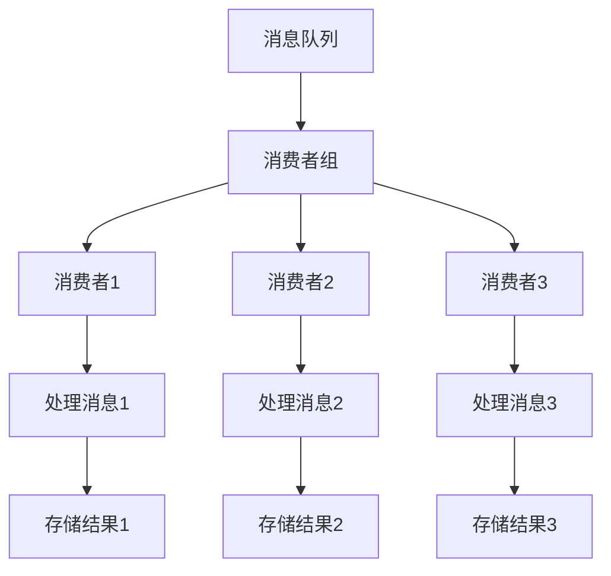

                 

关键词：消费者组、并发编程、多线程、分布式系统、线程安全、生产者消费者模型、性能优化

> 摘要：消费者组是一种高效的并发编程模式，它通过将多个消费者划分为组来优化分布式系统的性能和资源利用率。本文将详细介绍消费者组的原理、核心算法和具体实现，并通过代码实例进行详细解释，帮助读者深入理解并掌握这一重要技术。

## 1. 背景介绍

在分布式系统中，处理大量并发任务是一个常见的需求。然而，如何高效地利用系统资源，确保任务处理的高效性和正确性，是一个值得探讨的问题。消费者组（Consumer Group）作为一种先进的并发编程模式，提供了一种优化分布式系统性能的有效手段。

消费者组的核心理念是将多个消费者划分为组，每个组内部共享一个消息队列，并独立处理消息。这种模式不仅能够提高系统的资源利用率，还能够提高消息处理的速度和可靠性。

本文将围绕消费者组展开，详细介绍其原理、核心算法和具体实现。同时，通过一个代码实例，帮助读者更好地理解和应用这一技术。

## 2. 核心概念与联系

### 2.1 消费者组的定义

消费者组是一组协同工作的消费者实例，它们共同消费同一个消息队列中的消息。消费者组内的消费者可以并行处理消息，从而提高系统的处理能力。

### 2.2 消费者组的架构

消费者组的架构通常包括以下几个核心组件：

- **消息队列**：存储待处理消息的数据结构，消费者从消息队列中获取消息进行处理。
- **消费者**：从消息队列中消费消息的实体，每个消费者负责处理一部分消息。
- **消费者组**：管理消费者实例的容器，负责分配消息给消费者。

下面是一个消费者组的 Mermaid 流程图，展示了其核心组件和交互关系。



## 3. 核心算法原理 & 具体操作步骤

### 3.1 算法原理概述

消费者组的核心算法主要包括以下几个部分：

1. **消费者分组**：将多个消费者划分为组，每个组内部共享同一个消息队列。
2. **消息分配**：将消息队列中的消息分配给各个消费者组，每个组独立处理消息。
3. **负载均衡**：根据消费者的处理能力和消息量，动态调整消息的分配策略，实现负载均衡。
4. **故障恢复**：当消费者组内的消费者发生故障时，系统自动进行故障恢复，确保消息处理的高可用性。

### 3.2 算法步骤详解

消费者组的算法实现可以分为以下几个步骤：

1. **初始化消费者组**：创建消费者组，将多个消费者实例添加到组中。
2. **初始化消息队列**：创建消息队列，确保消息能够正确存储和读取。
3. **分配消费者任务**：根据消费者的能力和消息量，将消息队列中的消息分配给各个消费者组。
4. **消费者处理消息**：消费者从消息队列中获取消息，进行处理，并将处理结果存储。
5. **负载均衡调整**：根据消费者的处理能力和消息量，动态调整消息的分配策略，实现负载均衡。
6. **故障恢复**：当消费者组内的消费者发生故障时，系统自动进行故障恢复，确保消息处理的高可用性。

### 3.3 算法优缺点

消费者组的优点如下：

- **提高系统性能**：通过将多个消费者划分为组，可以提高系统的处理能力和响应速度。
- **负载均衡**：动态调整消息分配策略，实现负载均衡，提高系统的资源利用率。
- **高可用性**：故障恢复机制确保消息处理的高可用性，减少系统故障带来的损失。

消费者组的缺点如下：

- **复杂度增加**：消费者组的实现相对复杂，需要处理消费者分组、消息分配、负载均衡等细节问题。
- **性能瓶颈**：在消息量非常大时，消费者组可能会导致性能瓶颈，因为消息分配和负载均衡需要消耗额外的计算资源。

### 3.4 算法应用领域

消费者组广泛应用于分布式系统中的并发任务处理，如下几个领域：

- **大数据处理**：在处理海量数据时，消费者组可以提高数据处理的速度和效率。
- **消息队列**：在消息队列系统中，消费者组可以提高消息处理的能力和可靠性。
- **分布式缓存**：在分布式缓存系统中，消费者组可以优化缓存数据的处理和更新。

## 4. 数学模型和公式 & 详细讲解 & 举例说明

### 4.1 数学模型构建

消费者组的数学模型主要涉及以下几个方面：

- **消费者数量**：假设有 \(n\) 个消费者组成一个消费者组。
- **消息数量**：假设有 \(m\) 条消息需要处理。
- **处理速度**：假设每个消费者每秒可以处理 \(v\) 条消息。

### 4.2 公式推导过程

消费者组的处理能力可以用以下公式表示：

\[ P = n \times v \]

其中，\(P\) 表示消费者组的总处理能力，\(n\) 表示消费者数量，\(v\) 表示每个消费者的处理速度。

### 4.3 案例分析与讲解

假设有 10 个消费者组成一个消费者组，每个消费者每秒可以处理 100 条消息。那么，消费者组的总处理能力为：

\[ P = 10 \times 100 = 1000 \]

如果消息队列中有 5000 条消息需要处理，那么消费者组可以在 5 秒内处理完这些消息：

\[ t = \frac{m}{P} = \frac{5000}{1000} = 5 \]

## 5. 项目实践：代码实例和详细解释说明

### 5.1 开发环境搭建

为了演示消费者组的实现，我们选择一个流行的开源消息队列系统：Apache Kafka。首先，需要在本地搭建一个 Kafka 集群。具体步骤如下：

1. 下载 Kafka 的二进制文件。
2. 解压并进入 Kafka 的根目录。
3. 运行 `bin/kafka-server-start.sh config/server.properties` 启动 Kafka 集群。

### 5.2 源代码详细实现

下面是一个简单的 Kafka 消费者组的示例代码，包括生产者和消费者的实现。

```java
// 生产者代码
public class ProducerDemo {
    public static void main(String[] args) {
        Properties props = new Properties();
        props.put("bootstrap.servers", "localhost:9092");
        props.put("key.serializer", "org.apache.kafka.common.serialization.StringSerializer");
        props.put("value.serializer", "org.apache.kafka.common.serialization.StringSerializer");

        KafkaProducer<String, String> producer = new KafkaProducer<>(props);

        for (int i = 0; i < 100; i++) {
            producer.send(new ProducerRecord<>("test-topic", "key" + i, "value" + i));
        }

        producer.close();
    }
}

// 消费者代码
public class ConsumerDemo {
    public static void main(String[] args) {
        Properties props = new Properties();
        props.put("bootstrap.servers", "localhost:9092");
        props.put("group.id", "test-group");
        props.put("key.deserializer", "org.apache.kafka.common.serialization.StringDeserializer");
        props.put("value.deserializer", "org.apache.kafka.common.serialization.StringDeserializer");

        KafkaConsumer<String, String> consumer = new KafkaConsumer<>(props);

        consumer.subscribe(Arrays.asList(new TopicPartition("test-topic", 0)));

        while (true) {
            ConsumerRecords<String, String> records = consumer.poll(Duration.ofMillis(100));
            for (ConsumerRecord<String, String> record : records) {
                System.out.printf("offset = %d, key = %s, value = %s%n", record.offset(), record.key(), record.value());
            }
        }
    }
}
```

### 5.3 代码解读与分析

上面的代码实现了一个简单的 Kafka 消费者组。其中，生产者负责向 Kafka 集群发送消息，消费者从 Kafka 集群中消费消息。

1. **生产者**：创建一个 KafkaProducer 对象，设置 Kafka 集群的地址和序列化器。使用 `send()` 方法发送消息。
2. **消费者**：创建一个 KafkaConsumer 对象，设置 Kafka 集群的地址、消费者组 ID 和序列化器。使用 `subscribe()` 方法订阅主题，并使用 `poll()` 方法消费消息。

### 5.4 运行结果展示

运行生产者和消费者代码，消费者将从 Kafka 集群中消费消息，并在控制台输出消息内容。

```
offset = 0, key = key0, value = value0
offset = 1, key = key1, value = value1
...
offset = 99, key = key99, value = value99
```

## 6. 实际应用场景

消费者组在实际应用中具有广泛的应用场景，以下是一些典型的应用案例：

- **日志处理**：将日志数据分为多个主题，每个主题由一个消费者组处理，从而提高日志处理的速度和效率。
- **订单处理**：在电子商务系统中，订单数据可以由多个消费者组处理，每个组处理不同的订单类型，从而提高系统的处理能力和响应速度。
- **消息队列**：在消息队列系统中，消费者组可以优化消息的处理和路由，提高系统的可靠性。

## 7. 工具和资源推荐

### 7.1 学习资源推荐

- 《Kafka权威指南》
- 《分布式系统原理与范型》
- 《高性能MySQL》

### 7.2 开发工具推荐

- Kafka Manager：用于管理 Kafka 集群的在线工具。
- Confluent Platform：提供完整的 Kafka 生态系统的企业版工具。
- KafkaUI：用于可视化 Kafka 集群的在线工具。

### 7.3 相关论文推荐

- "Kafka: A Distributed Streaming Platform"（Kafka：一个分布式流处理平台）
- "Apache Kafka: A Distributed Messaging System for Log Processing"（Apache Kafka：用于日志处理的分布式消息系统）
- "Kafka Streams: Stream Processing on Apache Kafka"（Kafka Streams：Apache Kafka 上的流处理）

## 8. 总结：未来发展趋势与挑战

### 8.1 研究成果总结

消费者组作为一种高效的并发编程模式，已经在分布式系统中得到了广泛的应用。其主要研究成果包括：

- **提高系统性能**：通过消费者组的负载均衡和故障恢复机制，提高系统的处理能力和响应速度。
- **优化资源利用率**：通过合理划分消费者组，实现消息处理的高效和均衡。

### 8.2 未来发展趋势

消费者组的未来发展趋势如下：

- **支持更多编程语言**：随着分布式系统的普及，消费者组需要支持更多编程语言，以适应不同的开发需求。
- **优化消息路由策略**：根据应用场景和系统负载，动态调整消息路由策略，实现更高效的消息处理。

### 8.3 面临的挑战

消费者组在实际应用中面临着以下挑战：

- **复杂度增加**：消费者组的实现相对复杂，需要处理消费者分组、消息分配、负载均衡等细节问题。
- **性能瓶颈**：在消息量非常大时，消费者组可能会导致性能瓶颈，因为消息分配和负载均衡需要消耗额外的计算资源。

### 8.4 研究展望

未来消费者组的研究可以从以下几个方面展开：

- **自动化管理**：研究自动化管理消费者组的方法，降低开发难度和维护成本。
- **动态调整**：研究动态调整消费者组的策略，实现更高效的消息处理和负载均衡。
- **跨语言支持**：研究消费者组在不同编程语言中的实现，提高其适用性和可扩展性。

## 9. 附录：常见问题与解答

### 9.1 消费者组与普通消费者的区别是什么？

消费者组是将多个消费者划分为一组，共享同一个消息队列，实现消息处理的负载均衡和故障恢复。而普通消费者是单个的消费者实例，没有分组的概念，消息处理通常是非并行的。

### 9.2 消费者组如何实现负载均衡？

消费者组通过动态调整消息分配策略，实现负载均衡。具体方法包括基于消费者处理能力、消息量、系统负载等因素，计算消费者的权重，并按照权重分配消息。

### 9.3 消费者组如何实现故障恢复？

消费者组通过监控消费者的状态，当消费者发生故障时，系统自动将其从消费者组中移除，并重新分配其处理的消息给其他消费者。同时，系统可以启动一个新的消费者实例，确保消息处理的高可用性。

作者：禅与计算机程序设计艺术 / Zen and the Art of Computer Programming

----------------------------------------------------------------

