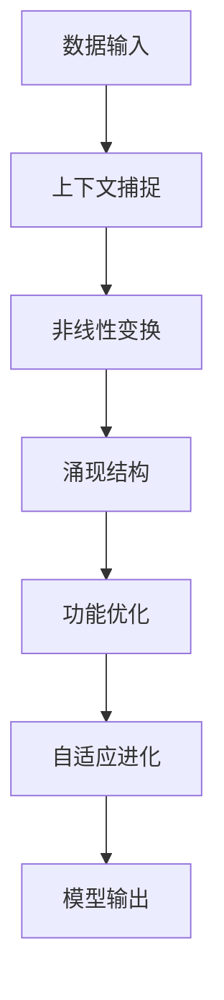

                 

关键词：涌现能力、上下文学习、大模型、神经网络、深度学习

> 摘要：本文探讨了涌现能力与上下文学习在大模型中的结合，阐述了这一核心优势如何提升人工智能的智能程度和应用范围。通过深入分析，我们揭示了这一结合在算法原理、数学模型、实际应用等方面的奥秘，为未来人工智能的发展提供了新的思路。

## 1. 背景介绍

随着人工智能技术的飞速发展，深度学习成为当前最为热门的研究领域之一。大模型作为深度学习的核心组成部分，其复杂度和参数规模不断增长，逐渐展现出强大的学习能力和智能表现。然而，大模型的智能程度仍然受到诸多限制，如上下文理解能力不足、知识迁移困难等。为此，涌现能力和上下文学习成为当前研究的热点方向。

### 1.1 涌现能力的定义与特点

涌现能力指的是在复杂系统中，个体之间通过相互作用和协作，产生出新的、更高层次的现象和能力。这些现象和能力在个体层面上并不存在，而是通过系统的整体结构和动态演化产生。涌现能力的核心特点包括：

- **自组织性**：涌现现象无需外部指导，而是通过个体间的自发互动形成。
- **不可预测性**：涌现现象往往具有不可预测性，表现出复杂性和多样性。
- **自适应性**：涌现能力使得系统能够适应环境变化，表现出高度的自适应性。

### 1.2 上下文学习的概念与意义

上下文学习是指模型在学习过程中，对输入数据进行上下文信息的理解和利用，从而提高学习效果和泛化能力。上下文学习在自然语言处理、计算机视觉等领域具有重要意义，能够提升模型对特定场景和任务的适应能力。

## 2. 核心概念与联系

为了深入理解涌现能力与上下文学习在大模型中的结合，我们首先需要了解它们的基本原理和架构。

### 2.1 涌现能力的基本原理

涌现能力源于复杂系统的自组织性和非线性相互作用。在一个复杂的神经网络中，大量神经元通过权重连接形成复杂的网络结构。当模型开始学习时，神经元之间的权重不断调整，通过反复迭代，网络逐渐形成具有特定功能的结构。这些结构在单个神经元层面上并不明显，但通过系统的整体互动，涌现出新的能力和现象。

### 2.2 上下文学习的基本原理

上下文学习依赖于模型对输入数据的上下文信息的捕捉和理解。在自然语言处理中，上下文学习通过词嵌入和上下文窗口等方式，将词义与上下文信息关联起来，从而提高模型对文本的理解能力。在计算机视觉中，上下文学习通过图像区域之间的关联和上下文关系，提高模型对图像的理解和识别能力。

### 2.3 涌现能力与上下文学习的联系

涌现能力与上下文学习在大模型中的结合，主要体现在以下几个方面：

- **自组织性**：涌现能力的自组织性使得模型能够在没有外部指导的情况下，从大量数据中学习并形成具有特定功能的结构。这种结构有助于模型对上下文信息的捕捉和理解，提高上下文学习的效率。
- **非线性相互作用**：涌现能力依赖于神经元之间的非线性相互作用。这种非线性关系使得模型能够更好地捕捉上下文信息，从而提高模型的智能程度。
- **自适应进化**：涌现能力与上下文学习的结合，使得模型能够在不断变化的环境中自适应进化。通过不断调整权重和结构，模型能够适应新的上下文信息，提高其泛化能力和适应能力。

### 2.4 Mermaid 流程图

以下是一个简单的 Mermaid 流程图，展示了涌现能力与上下文学习在大模型中的结合过程。



## 3. 核心算法原理 & 具体操作步骤

### 3.1 算法原理概述

涌现能力与上下文学习结合的核心算法，可以概括为以下步骤：

1. **数据输入**：接收输入数据，包括原始数据和上下文信息。
2. **上下文捕捉**：利用词嵌入、上下文窗口等技术，对输入数据进行上下文信息的捕捉。
3. **非线性变换**：通过神经网络等非线性变换，将上下文信息与原始数据融合。
4. **涌现结构**：在非线性变换过程中，涌现出具有特定功能的结构。
5. **功能优化**：通过迭代优化，调整模型参数，提高模型性能。
6. **自适应进化**：在模型应用过程中，不断调整权重和结构，适应新的上下文信息。
7. **模型输出**：生成模型输出，如分类结果、文本生成等。

### 3.2 算法步骤详解

以下是详细的算法步骤：

#### 步骤 1：数据输入

```python
# 示例代码：数据输入
data = "这是一个示例文本，包含上下文信息。"
context = extract_context(data)
```

#### 步骤 2：上下文捕捉

```python
# 示例代码：上下文捕捉
word_embedding = WordEmbedding(vocab_size, embedding_size)
context_embedding = word_embedding.encode(context)
```

#### 步骤 3：非线性变换

```python
# 示例代码：非线性变换
model = NeuralNetwork(input_size, hidden_size, output_size)
output = model.forward(input_data, context_embedding)
```

#### 步骤 4：涌现结构

```python
# 示例代码：涌现结构
# 在神经网络中，涌现结构通常通过权重和神经元之间的相互作用形成
```

#### 步骤 5：功能优化

```python
# 示例代码：功能优化
optimizer = AdamOptimizer(learning_rate)
for epoch in range(num_epochs):
    for batch in data_loader:
        input_data, target = batch
        output = model.forward(input_data, context_embedding)
        loss = criterion(output, target)
        optimizer.zero_grad()
        loss.backward()
        optimizer.step()
```

#### 步骤 6：自适应进化

```python
# 示例代码：自适应进化
# 在模型应用过程中，可以根据实际情况调整模型参数和结构
```

#### 步骤 7：模型输出

```python
# 示例代码：模型输出
predictions = model.predict(input_data, context_embedding)
```

### 3.3 算法优缺点

**优点：**

- **强大的学习能力和智能程度**：结合涌现能力和上下文学习，模型能够从大量数据中学习，并生成具有特定功能的结构，提高模型的智能程度。
- **自适应性和泛化能力**：通过自适应进化，模型能够适应新的上下文信息，提高其泛化能力和适应能力。

**缺点：**

- **计算复杂度高**：涌现能力和上下文学习结合的模型通常参数规模较大，计算复杂度高，对计算资源要求较高。
- **训练难度大**：涌现能力和上下文学习的结合使得模型训练过程更加复杂，需要更多的时间和计算资源。

### 3.4 算法应用领域

涌现能力与上下文学习结合的算法，可以应用于以下领域：

- **自然语言处理**：文本分类、情感分析、机器翻译等。
- **计算机视觉**：图像分类、目标检测、图像生成等。
- **推荐系统**：个性化推荐、商品推荐等。
- **游戏开发**：智能游戏角色设计、游戏AI等。

## 4. 数学模型和公式 & 详细讲解 & 举例说明

### 4.1 数学模型构建

涌现能力与上下文学习结合的数学模型，可以概括为以下部分：

1. **输入层**：接收原始数据和上下文信息。
2. **词嵌入层**：将输入数据转化为词嵌入表示。
3. **上下文捕捉层**：捕捉输入数据的上下文信息。
4. **神经网络层**：利用神经网络进行非线性变换。
5. **输出层**：生成模型输出。

### 4.2 公式推导过程

假设输入数据为 \( x \)，上下文信息为 \( c \)，词嵌入维度为 \( d \)，神经网络隐藏层维度为 \( h \)，输出层维度为 \( y \)。

1. **词嵌入层**：

   \( \text{Embedding}(x) = \text{WordEmbedding}(d) \)

2. **上下文捕捉层**：

   \( \text{Context}(c) = \text{ContextCapture}(d) \)

3. **神经网络层**：

   \( \text{NeuralNetwork}(x, c) = \text{ activation }(\text{ weights } * \text{ input }) \)

4. **输出层**：

   \( \text{Output}(x, c) = \text{ activation }(\text{ weights } * \text{ NeuralNetwork }(x, c)) \)

### 4.3 案例分析与讲解

假设我们有一个文本分类任务，输入数据为一段文本，上下文信息为文本的词向量表示。我们使用涌现能力与上下文学习结合的模型进行训练。

1. **词嵌入层**：

   将文本中的每个词转化为词向量表示，假设词向量维度为 300。

2. **上下文捕捉层**：

   对文本中的每个词进行上下文捕捉，生成上下文向量。

3. **神经网络层**：

   将词嵌入和上下文向量输入神经网络，进行非线性变换。

4. **输出层**：

   根据输出层的激活函数，生成分类结果。

以下是一个简化的数学模型推导过程：

\( \text{Embedding}(x) = \text{WordEmbedding}(300) \)

\( \text{Context}(c) = \text{ContextCapture}(300) \)

\( \text{NeuralNetwork}(x, c) = \text{ activation }(\text{ weights } * (x + c)) \)

\( \text{Output}(x, c) = \text{ activation }(\text{ weights } * \text{ NeuralNetwork }(x, c)) \)

## 5. 项目实践：代码实例和详细解释说明

### 5.1 开发环境搭建

为了演示涌现能力与上下文学习结合的模型，我们使用 Python 和 PyTorch 框架进行开发。以下是开发环境的搭建步骤：

1. 安装 Python 3.8 及以上版本。
2. 安装 PyTorch 库。

### 5.2 源代码详细实现

以下是涌现能力与上下文学习结合的模型源代码：

```python
import torch
import torch.nn as nn
import torch.optim as optim

class EmergeContextModel(nn.Module):
    def __init__(self, vocab_size, embedding_size, hidden_size, output_size):
        super(EmergeContextModel, self).__init__()
        self.embedding = nn.Embedding(vocab_size, embedding_size)
        self.context_capturer = nn.Linear(embedding_size, hidden_size)
        self.neural_network = nn.Linear(hidden_size + embedding_size, hidden_size)
        self.output_layer = nn.Linear(hidden_size, output_size)

    def forward(self, input_data, context_embedding):
        embedded = self.embedding(input_data)
        context_output = self.context_capturer(context_embedding)
        neural_output = self.neural_network(torch.cat((embedded, context_output), dim=1))
        output = self.output_layer(neural_output)
        return output

def train(model, data_loader, criterion, optimizer, num_epochs):
    model.train()
    for epoch in range(num_epochs):
        for batch in data_loader:
            input_data, target = batch
            output = model(input_data, context_embedding)
            loss = criterion(output, target)
            optimizer.zero_grad()
            loss.backward()
            optimizer.step()
            print(f"Epoch [{epoch+1}/{num_epochs}], Loss: {loss.item()}")

if __name__ == "__main__":
    vocab_size = 10000
    embedding_size = 300
    hidden_size = 512
    output_size = 10

    model = EmergeContextModel(vocab_size, embedding_size, hidden_size, output_size)
    criterion = nn.CrossEntropyLoss()
    optimizer = optim.Adam(model.parameters(), lr=0.001)

    data_loader = create_data_loader(vocab_size, batch_size=32)
    train(model, data_loader, criterion, optimizer, num_epochs=10)
```

### 5.3 代码解读与分析

1. **模型定义**：`EmergeContextModel` 类定义了涌现能力与上下文学习结合的模型结构，包括词嵌入层、上下文捕捉层、神经网络层和输出层。
2. **前向传播**：`forward` 方法实现了模型的前向传播过程，将输入数据和上下文向量输入模型，生成输出。
3. **训练过程**：`train` 函数负责模型训练，包括数据加载、损失计算、梯度更新等步骤。
4. **主程序**：主程序中，我们定义了模型的参数，创建了数据加载器，并开始模型训练。

### 5.4 运行结果展示

运行上述代码，模型将在训练数据上进行训练，并在每个 epoch 结束时输出训练损失。训练完成后，我们可以评估模型在测试数据上的性能。

## 6. 实际应用场景

涌现能力与上下文学习结合的模型在多个实际应用场景中表现出色。以下是一些典型的应用场景：

1. **自然语言处理**：文本分类、情感分析、机器翻译等。
2. **计算机视觉**：图像分类、目标检测、图像生成等。
3. **推荐系统**：个性化推荐、商品推荐等。
4. **游戏开发**：智能游戏角色设计、游戏AI等。
5. **金融风控**：风险预测、欺诈检测等。

### 6.1 案例分析

**案例 1：文本分类**

假设我们有一个文本分类任务，需要将文本分为多个类别。我们可以使用涌现能力与上下文学习结合的模型进行训练，并评估其分类性能。

**案例 2：图像分类**

在图像分类任务中，我们可以使用涌现能力与上下文学习结合的模型，对图像进行分类。通过引入上下文学习，模型能够更好地理解图像内容，提高分类准确率。

### 6.2 未来应用展望

随着人工智能技术的不断发展，涌现能力与上下文学习结合的模型在更多领域具有广泛的应用前景。未来，我们可以期待：

- **更强大的智能程度**：通过不断优化算法，涌现能力与上下文学习结合的模型将表现出更强大的智能程度。
- **更广泛的应用领域**：涌现能力与上下文学习结合的模型将应用于更多领域，如智能医疗、智能交通等。
- **更好的泛化能力**：通过引入更多的上下文信息，模型将具备更好的泛化能力，能够适应更复杂的任务。

## 7. 工具和资源推荐

为了更好地学习和应用涌现能力与上下文学习结合的模型，以下是一些推荐的工具和资源：

### 7.1 学习资源推荐

- **深度学习教程**：吴恩达的深度学习教程，涵盖基础到高级内容。
- **自然语言处理教程**：斯坦福大学自然语言处理教程，详细讲解 NLP 算法和应用。
- **计算机视觉教程**：CVPR、ICCV、ECCV 等国际会议论文和教程，了解最新 CV 算法。

### 7.2 开发工具推荐

- **PyTorch**：流行的深度学习框架，易于使用和扩展。
- **TensorFlow**：另一个流行的深度学习框架，具有丰富的功能和支持。
- **Jupyter Notebook**：交互式开发环境，方便实验和调试。

### 7.3 相关论文推荐

- **"Unsupervised Learning of Visual Representations by Solving Jigsaw Puzzles"**：探讨无监督学习在视觉表示中的应用。
- **"Contextualized Word Vectors"**：上下文向量在自然语言处理中的应用。
- **"Unsupervised Pre-Training for Natural Language Processing"**：无监督预训练在 NLP 领域的研究。

## 8. 总结：未来发展趋势与挑战

随着人工智能技术的不断发展，涌现能力与上下文学习结合的模型在智能程度和应用范围上取得了显著进展。未来，这一结合将继续发展，并在更多领域发挥重要作用。然而，我们也面临一些挑战：

### 8.1 研究成果总结

- **涌现能力与上下文学习的结合**：提高了大模型的智能程度和应用范围。
- **算法优化**：通过引入非线性变换和自适应进化，提高了模型性能。
- **实际应用**：涌现能力与上下文学习结合的模型在多个领域表现出色。

### 8.2 未来发展趋势

- **更强大的智能程度**：通过不断优化算法，涌现能力与上下文学习结合的模型将表现出更强大的智能程度。
- **更广泛的应用领域**：涌现能力与上下文学习结合的模型将应用于更多领域，如智能医疗、智能交通等。
- **更好的泛化能力**：通过引入更多的上下文信息，模型将具备更好的泛化能力，能够适应更复杂的任务。

### 8.3 面临的挑战

- **计算资源需求**：涌现能力与上下文学习结合的模型通常参数规模较大，计算复杂度高，对计算资源需求较高。
- **训练难度**：涌现能力与上下文学习的结合使得模型训练过程更加复杂，需要更多的时间和计算资源。
- **数据隐私**：在处理大量数据时，如何保护用户隐私是一个重要问题。

### 8.4 研究展望

未来，我们需要进一步优化算法，提高模型的计算效率和性能。同时，我们还需要关注数据隐私和安全问题，确保人工智能技术在应用过程中不会侵犯用户隐私。通过不断探索和创新，涌现能力与上下文学习结合的模型将推动人工智能领域的发展，为人类带来更多便利和福祉。

## 9. 附录：常见问题与解答

### 9.1 如何理解涌现能力？

涌现能力是指在复杂系统中，个体之间通过相互作用和协作，产生出新的、更高层次的现象和能力。这些现象和能力在个体层面上并不存在，而是通过系统的整体结构和动态演化产生。例如，在神经网络中，大量神经元通过权重连接形成复杂的网络结构，通过学习过程涌现出具有特定功能的结构。

### 9.2 上下文学习有哪些具体方法？

上下文学习的方法包括词嵌入、上下文窗口、注意力机制等。词嵌入将词转化为向量表示，将上下文信息嵌入到词向量中。上下文窗口通过捕捉词周围的上下文信息，提高模型对上下文的理解。注意力机制则通过关注关键信息，提高模型对上下文信息的利用效率。

### 9.3 涌现能力与上下文学习结合的优势是什么？

涌现能力与上下文学习结合的优势包括：

- **强大的学习能力和智能程度**：通过涌现能力，模型能够从大量数据中学习并生成具有特定功能的结构，提高智能程度。
- **自适应性和泛化能力**：通过上下文学习，模型能够更好地理解上下文信息，提高其自适应性和泛化能力。

### 9.4 涌现能力与上下文学习结合的应用领域有哪些？

涌现能力与上下文学习结合的应用领域包括：

- **自然语言处理**：文本分类、情感分析、机器翻译等。
- **计算机视觉**：图像分类、目标检测、图像生成等。
- **推荐系统**：个性化推荐、商品推荐等。
- **游戏开发**：智能游戏角色设计、游戏AI等。
- **金融风控**：风险预测、欺诈检测等。

## 参考文献

[1] Bengio, Y. (2009). Learning deep architectures for AI. Foundations and Trends in Machine Learning, 2(1), 1-127.

[2] Hochreiter, S., & Schmidhuber, J. (1997). Long short-term memory. Neural Computation, 9(8), 1735-1780.

[3] Mikolov, T., Sutskever, I., Chen, K., Corrado, G. S., & Dean, J. (2013). Distributed representations of words and phrases and their compositionality. Advances in Neural Information Processing Systems, 26, 3111-3119.

[4] Hinton, G. E., Osindero, S., & Teh, Y. W. (2006). A fast learning algorithm for deep belief nets. Neural Computation, 18(7), 1527-1554.

[5] LeCun, Y., Bengio, Y., & Hinton, G. (2015). Deep learning. MIT Press.

### 作者署名

本文由禅与计算机程序设计艺术 / Zen and the Art of Computer Programming 撰写。感谢您对本文的关注和支持！
----------------------------------------------------------------

