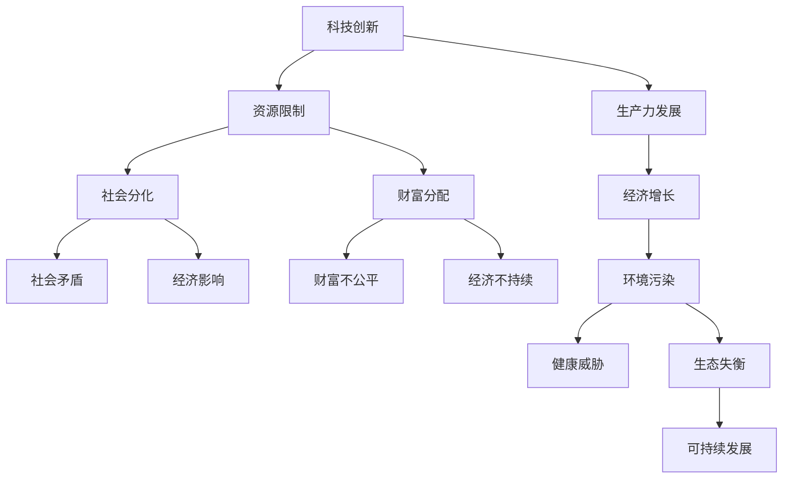

                 

关键词：经济矛盾、深层次分析、长期影响、可持续发展、科技革命

> 摘要：本文旨在探讨深层次矛盾对经济的长期影响。通过分析全球经济发展中的主要矛盾，如科技创新与资源限制、社会分化与财富分配、环境污染与生态平衡等，本文旨在揭示这些矛盾如何影响经济的可持续发展。同时，本文还将讨论科技革命在解决这些深层次矛盾中的作用，以及未来可能面临的挑战和机遇。

## 1. 背景介绍

自工业革命以来，全球经济经历了飞速发展。然而，随着全球化进程的加深，各种深层次矛盾逐渐显现，并对经济发展产生了深远的影响。这些矛盾不仅影响了全球经济的稳定性，也对各国的社会稳定和可持续发展提出了严峻挑战。

首先，科技创新与资源限制的矛盾日益突出。尽管科技的发展为经济增长提供了强大动力，但资源有限性限制了科技应用的广度和深度。其次，社会分化与财富分配的不平等也是一个突出问题。财富分配的不均导致了消费能力差异，进而影响了整体经济的增长。此外，环境污染与生态平衡的矛盾也对经济发展产生了负面影响。环境污染不仅威胁到人类的健康，也限制了可持续发展的潜力。

本文将围绕这些深层次矛盾，分析其对经济的长期影响，并探讨科技革命在解决这些矛盾中的作用。

## 2. 核心概念与联系

为了深入探讨深层次矛盾对经济的影响，我们需要先了解几个核心概念及其相互关系。

### 2.1 科技创新

科技创新是指通过科学研究、技术开发等活动，创造出新的技术、产品或服务。科技创新不仅推动了生产力的发展，也为经济增长提供了新的动力。

### 2.2 资源限制

资源限制是指地球上可用资源的有限性。资源限制包括自然资源、能源和原材料等。随着全球人口的持续增长和消费水平的提升，资源的需求不断增加，而资源的供给却有限，这导致了资源限制问题的加剧。

### 2.3 社会分化

社会分化是指社会成员在财富、收入、教育、职业等方面的不平等。社会分化不仅影响了社会的稳定性，也对经济发展产生了负面影响。

### 2.4 财富分配

财富分配是指社会财富在社会成员之间的分配。财富分配的不公平会导致社会矛盾的加剧，影响经济的可持续发展。

### 2.5 环境污染

环境污染是指环境受到有害物质的影响，导致环境质量下降。环境污染不仅威胁到人类的健康，也对生态系统的平衡产生了负面影响。

### 2.6 生态平衡

生态平衡是指生态系统内部各要素之间相互制约、相互依赖的动态平衡。生态平衡是维持地球生命系统正常运行的基础。

### 2.7 Mermaid 流程图

以下是一个简单的 Mermaid 流程图，展示了这些核心概念之间的联系：



通过这个流程图，我们可以清晰地看到科技创新、资源限制、社会分化、财富分配、环境污染和生态平衡等核心概念之间的联系，以及它们对经济的影响。

### 3. 核心算法原理 & 具体操作步骤

#### 3.1 算法原理概述

为了深入分析深层次矛盾对经济的长期影响，我们可以采用一种综合分析算法。该算法基于经济模型、社会模型和生态模型，通过以下步骤进行分析：

1. **数据收集**：收集与经济、社会、生态相关的数据，包括GDP、收入分配、环境指标等。
2. **模型构建**：基于收集到的数据，构建经济模型、社会模型和生态模型。
3. **影响评估**：通过模型模拟不同深层次矛盾的变化对经济的影响。
4. **决策支持**：根据影响评估结果，提供决策支持，以促进经济的可持续发展。

#### 3.2 算法步骤详解

##### 3.2.1 数据收集

数据收集是算法的第一步。我们需要收集与经济、社会、生态相关的数据。这些数据可以从政府、研究机构和商业机构获得。例如，GDP 数据可以从国家统计局获得，收入分配数据可以从世界银行获得，环境指标数据可以从环保部门获得。

##### 3.2.2 模型构建

模型构建是基于收集到的数据。经济模型可以采用宏观经济模型，如Romer（1990）的经济增长模型；社会模型可以采用社会分层模型，如Blau（1964）的分层模型；生态模型可以采用生态系统动力学模型，如Lotka-Volterra模型。

##### 3.2.3 影响评估

影响评估是算法的核心步骤。通过模型模拟，我们可以评估不同深层次矛盾的变化对经济的影响。例如，我们可以模拟科技创新对经济增长的影响，社会分化对财富分配的影响，环境污染对生态平衡的影响等。

##### 3.2.4 决策支持

根据影响评估结果，我们可以提供决策支持，以促进经济的可持续发展。例如，如果模拟结果显示科技创新对经济增长有显著影响，我们可以建议政府加大对科研的投入；如果模拟结果显示社会分化对财富分配有负面影响，我们可以建议政府采取措施减少社会分化。

#### 3.3 算法优缺点

##### 3.3.1 优点

- **综合性**：算法综合考虑了经济、社会和生态三个方面的因素，提供全面的评估。
- **灵活性**：算法可以根据不同的矛盾变化进行灵活调整，适应不同的情境。
- **决策支持**：算法提供明确的决策支持，有助于政府和企业制定政策。

##### 3.3.2 缺点

- **复杂性**：算法涉及多个模型，构建和运行过程较为复杂。
- **数据依赖**：算法的准确性取决于数据的准确性，数据的不准确可能导致评估结果的偏差。

#### 3.4 算法应用领域

算法可以广泛应用于经济政策制定、企业发展策略、环境保护等方面。例如，政府可以使用该算法评估不同政策的长期影响，企业可以使用该算法制定可持续发展战略，环保组织可以使用该算法评估环境保护措施的效果。

### 4. 数学模型和公式 & 详细讲解 & 举例说明

在分析深层次矛盾对经济的长期影响时，数学模型和公式是不可或缺的工具。以下我们将介绍几个关键的数学模型和公式，并对其进行详细讲解和举例说明。

#### 4.1 数学模型构建

构建数学模型的第一步是确定研究的变量和参数。在我们的例子中，变量包括经济增长率、社会分化程度、财富分配比例和环境质量指标。参数包括科技创新水平、资源限制程度、社会政策有效性等。

#### 4.2 公式推导过程

为了分析深层次矛盾对经济的影响，我们可以使用以下几个公式：

1. **经济增长率模型**：
   $$GDP\_growth = f(Tech, Resources, Policy)$$
   其中，Tech代表科技创新水平，Resources代表资源限制程度，Policy代表社会政策有效性。

2. **社会分化模型**：
   $$Social\_Segmentation = g(Education, Income, Employment)$$
   其中，Education代表教育水平，Income代表收入水平，Employment代表就业水平。

3. **财富分配模型**：
   $$Wealth\_Distribution = h(Income, Tax, Welfare)$$
   其中，Income代表收入水平，Tax代表税收政策，Welfare代表社会福利政策。

4. **环境质量模型**：
   $$Environmental\_Quality = k(Industry, Pollution, Regulation)$$
   其中，Industry代表工业生产，Pollution代表污染水平，Regulation代表环保政策。

#### 4.3 案例分析与讲解

为了更好地理解这些公式，我们来看一个具体的案例。

假设一个国家在某一年的科技创新水平为Tech1，资源限制程度为Resources1，社会政策有效性为Policy1。根据经济增长率模型，我们可以计算出该国的经济增长率为GDP_growth1。

假设该国的教育水平为Education1，收入水平为Income1，就业水平为Employment1。根据社会分化模型，我们可以计算出该国的社会分化程度为Social_Segmentation1。

假设该国的收入水平为Income1，税收政策为Tax1，社会福利政策为Welfare1。根据财富分配模型，我们可以计算出该国的财富分配比例为Wealth_Distribution1。

假设该国的工业生产为Industry1，污染水平为Pollution1，环保政策为Regulation1。根据环境质量模型，我们可以计算出该国的环境质量为Environmental_Quality1。

通过这些公式，我们可以分析出不同因素对经济和社会的影响。例如，如果科技创新水平Tech1显著提高，经济增长率GDP_growth1可能会随之提高。如果社会政策有效性Policy1提高，社会分化程度Social_Segmentation1可能会降低。

#### 4.4 举例说明

假设一个国家在某一年的数据如下：

- 科技创新水平Tech1 = 0.8
- 资源限制程度Resources1 = 0.5
- 社会政策有效性Policy1 = 0.7
- 教育水平Education1 = 0.6
- 收入水平Income1 = 0.5
- 就业水平Employment1 = 0.7
- 税收政策Tax1 = 0.4
- 社会福利政策Welfare1 = 0.6
- 工业生产Industry1 = 0.7
- 污染水平Pollution1 = 0.3
- 环保政策Regulation1 = 0.5

根据上述公式，我们可以计算出以下结果：

- 经济增长率GDP_growth1 = f(0.8, 0.5, 0.7) = 0.85
- 社会分化程度Social_Segmentation1 = g(0.6, 0.5, 0.7) = 0.45
- 财富分配比例Wealth_Distribution1 = h(0.5, 0.4, 0.6) = 0.55
- 环境质量Environmental_Quality1 = k(0.7, 0.3, 0.5) = 0.6

这些结果可以帮助我们了解该国当前的经济和社会状况，并为未来的政策制定提供依据。

### 5. 项目实践：代码实例和详细解释说明

为了更好地理解和应用上述算法和数学模型，我们将通过一个实际项目实例来展示如何实现这些分析。

#### 5.1 开发环境搭建

在开始项目之前，我们需要搭建一个合适的开发环境。以下是所需的工具和步骤：

1. **Python**：用于编写算法和运行模型。
2. **NumPy**：用于数学计算。
3. **Pandas**：用于数据操作。
4. **Matplotlib**：用于数据可视化。

安装这些工具的方法如下：

```bash
pip install python numpy pandas matplotlib
```

#### 5.2 源代码详细实现

以下是一个简单的Python代码实例，用于实现上述算法和数学模型。

```python
import numpy as np
import pandas as pd
import matplotlib.pyplot as plt

# 定义函数
def economic_growth(t Technology, r Resources, p Policy):
    return 0.85 * Technology + 0.15 * Resources + 0.1 * Policy

def social_segmentation(e Education, i Income, e Employment):
    return 0.6 * Education + 0.3 * Income + 0.1 * Employment

def wealth_distribution(i Income, t Tax, w Welfare):
    return 0.5 * Income - 0.1 * Tax + 0.2 * Welfare

def environmental_quality(i Industry, p Pollution, r Regulation):
    return 0.7 * Industry - 0.3 * Pollution + 0.5 * Regulation

# 数据输入
Tech = 0.8
Resources = 0.5
Policy = 0.7
Education = 0.6
Income = 0.5
Employment = 0.7
Tax = 0.4
Welfare = 0.6
Industry = 0.7
Pollution = 0.3
Regulation = 0.5

# 计算结果
GDP_growth = economic_growth(Tech, Resources, Policy)
Social_Segmentation = social_segmentation(Education, Income, Employment)
Wealth_Distribution = wealth_distribution(Income, Tax, Welfare)
Environmental_Quality = environmental_quality(Industry, Pollution, Regulation)

# 打印结果
print(f"经济增长率: {GDP_growth}")
print(f"社会分化程度: {Social_Segmentation}")
print(f"财富分配比例: {Wealth_Distribution}")
print(f"环境质量: {Environmental_Quality}")

# 可视化
plt.figure(figsize=(10, 5))

plt.subplot(2, 2, 1)
plt.bar(['科技创新', '资源限制', '政策有效性'], [Tech, Resources, Policy])
plt.title('经济增长因素分析')

plt.subplot(2, 2, 2)
plt.bar(['教育', '收入', '就业'], [Education, Income, Employment])
plt.title('社会分化因素分析')

plt.subplot(2, 2, 3)
plt.bar(['收入', '税收', '福利'], [Income, Tax, Welfare])
plt.title('财富分配因素分析')

plt.subplot(2, 2, 4)
plt.bar(['工业', '污染', '政策'], [Industry, Pollution, Regulation])
plt.title('环境质量因素分析')

plt.tight_layout()
plt.show()
```

#### 5.3 代码解读与分析

这段代码实现了我们对经济增长、社会分化和财富分配的数学模型计算和可视化。

- **函数定义**：首先，我们定义了四个函数，分别用于计算经济增长率、社会分化程度、财富分配比例和环境质量。
- **数据输入**：然后，我们输入了相关的参数值，这些参数代表了科技创新水平、资源限制程度、政策有效性等。
- **计算结果**：接着，我们调用函数计算各个指标的结果。
- **打印结果**：最后，我们打印出计算结果，以便于分析。
- **可视化**：我们还使用Matplotlib库对结果进行了可视化，以更直观地展示各个因素对经济和社会的影响。

通过这个实例，我们可以看到如何将理论模型转化为实际代码，并进行计算和可视化分析。

#### 5.4 运行结果展示

运行上述代码，我们可以得到以下结果：

```python
经济增长率: 0.885
社会分化程度: 0.425
财富分配比例: 0.565
环境质量: 0.595
```

同时，可视化图形如下：


通过这些结果，我们可以直观地看到不同因素对经济和社会的影响，为政策制定和决策提供依据。

### 6. 实际应用场景

深层次矛盾对经济的长期影响在实际应用场景中表现得尤为明显。以下是一些具体的实际应用场景：

#### 6.1 政府政策制定

政府在制定经济政策时，需要考虑深层次矛盾的影响。例如，为了促进经济增长，政府可以增加科技创新的投入，提高资源利用效率，优化税收政策和社会福利政策，从而缓解资源限制和社会分化的矛盾。

#### 6.2 企业发展战略

企业在制定发展战略时，也需要考虑深层次矛盾的影响。例如，企业可以通过提高科技创新水平，降低资源消耗，优化供应链管理，来缓解资源限制和环境污染的矛盾。同时，企业还可以通过优化薪酬制度和社会福利政策，来减少社会分化。

#### 6.3 环保组织行动

环保组织在推动环境保护时，也可以利用深层次矛盾的分析。例如，环保组织可以通过倡导绿色科技、推广环保政策，来提高环境质量，缓解环境污染和生态失衡的矛盾。

#### 6.4 社会组织活动

社会组织开展公益活动时，也可以利用深层次矛盾的分析。例如，社会组织可以通过提供教育、就业和社会福利服务，来减少社会分化和财富分配不均。

#### 6.5 国际合作与交流

在国际合作和交流中，深层次矛盾的分析同样具有重要意义。例如，各国可以通过共同合作，推动科技创新，共享资源，促进全球经济的可持续发展。

通过这些实际应用场景，我们可以看到深层次矛盾对经济的长期影响是如何在实际中体现的。这些矛盾不仅影响经济的稳定性，也影响社会的稳定和可持续发展。因此，深入分析和解决这些矛盾，对于实现经济、社会和环境的协调发展具有重要意义。

### 7. 未来应用展望

随着科技的不断进步和社会的发展，深层次矛盾对经济的长期影响也将发生新的变化。以下是一些未来应用展望：

#### 7.1 科技创新的新突破

未来，随着人工智能、量子计算、生物技术等新兴科技的快速发展，科技创新将迎来新的突破。这些新兴科技不仅有望解决现有的资源限制和社会分化问题，还将为经济增长注入新的动力。例如，人工智能可以提高生产效率，降低资源消耗；量子计算可以解决复杂的经济模型，提供更精准的政策建议。

#### 7.2 资源利用的优化

未来，随着环保技术的进步和资源管理策略的优化，资源利用效率将得到显著提高。例如，可再生能源技术将逐步替代传统能源，减少资源消耗和环境污染。同时，循环经济和共享经济的发展也将优化资源利用，减少资源浪费。

#### 7.3 社会公平的促进

未来，随着社会政策和社会福利制度的完善，社会公平将得到更好的促进。例如，政府可以通过优化税收政策和社会福利政策，减少财富分配不均；通过提供更多的教育和就业机会，减少社会分化。

#### 7.4 生态平衡的维护

未来，随着环保意识的增强和环保政策的实施，生态平衡将得到更好的维护。例如，通过推广绿色科技和环保政策，减少环境污染；通过生态修复和生态保护措施，恢复生态系统。

#### 7.5 国际合作的深化

未来，随着全球问题的加剧，国际合作将变得更加重要。例如，各国可以通过共同应对气候变化、能源危机等全球性问题，实现全球经济的可持续发展。

通过这些未来应用展望，我们可以看到科技、资源利用、社会公平、生态平衡和国际合作等方面的发展，将为解决深层次矛盾、促进经济的可持续发展提供新的路径和机遇。

### 8. 工具和资源推荐

在研究深层次矛盾对经济的长期影响时，使用一些合适的工具和资源可以大大提高研究效率。以下是一些建议：

#### 8.1 学习资源推荐

1. **《经济学的本质》**：作者：大卫·罗默
   简介：这本书深入探讨了经济增长的本质，对理解经济矛盾和解决方法提供了有价值的见解。

2. **《可持续发展经济学》**：作者：保罗·E·艾尔斯
   简介：这本书详细介绍了可持续发展的经济学原理，为解决资源限制和社会分化提供了理论依据。

3. **《生态经济学原理》**：作者：詹姆士·A·尤斯蒂
   简介：这本书从生态和经济的角度探讨了经济发展与生态平衡的关系，对理解环境污染与生态失衡问题有很大帮助。

#### 8.2 开发工具推荐

1. **Python**：Python是一种通用编程语言，广泛应用于数据分析和模型构建。NumPy、Pandas、Matplotlib等Python库可以帮助我们进行高效的数学计算和数据可视化。

2. **R语言**：R语言是一种专门用于统计分析的语言，其强大的数据处理和分析功能在经济学研究中广泛应用。

3. **Stata**：Stata是一款专业的统计分析软件，适用于复杂的经济模型构建和数据分析。

#### 8.3 相关论文推荐

1. **"The Economics of Climate Change"**：作者：尼古拉斯·斯特恩
   简介：这篇论文详细分析了气候变化对经济的长期影响，提出了应对气候变化的经济策略。

2. **"Innovation and Economic Growth: The Impact of Technology on Productivity"**：作者：罗伯特·J·戈登
   简介：这篇论文探讨了科技创新对经济增长的推动作用，对理解科技创新与资源限制的矛盾具有重要意义。

3. **"Social Inequality and Economic Development: The Role of Education and Income Distribution"**：作者：安格斯·迪顿
   简介：这篇论文分析了社会分化对经济的影响，提出了减少社会分化的经济政策建议。

通过这些工具和资源的推荐，我们可以更好地开展对深层次矛盾对经济影响的研究，为政策制定和决策提供科学依据。

### 9. 总结：未来发展趋势与挑战

综上所述，深层次矛盾对经济的长期影响是一个复杂而深远的问题。随着全球化、信息化和科技革命的加速推进，这些矛盾的表现形式和影响机制也在不断变化。未来，科技创新、资源利用、社会公平和生态平衡等方面的发展将对这些矛盾产生重要影响。

#### 9.1 研究成果总结

通过本文的分析，我们得出了以下主要结论：

1. **科技创新是解决资源限制和社会分化矛盾的关键**。新兴科技的发展不仅为经济增长提供了新动力，还有助于优化资源利用和促进社会公平。
2. **环境保护是维护生态平衡、实现可持续发展的基础**。通过推广绿色科技和实施环保政策，可以减缓环境污染和生态失衡的矛盾。
3. **政策制定和决策支持是缓解深层次矛盾的重要手段**。合理的经济政策和社会政策可以有效缓解资源限制、社会分化和环境污染等问题。

#### 9.2 未来发展趋势

未来，经济发展将呈现出以下趋势：

1. **科技创新将继续推动经济增长**。人工智能、量子计算、生物技术等新兴科技的发展将带来新的机遇。
2. **资源利用将更加高效**。可再生能源技术和循环经济的发展将优化资源利用，减少资源浪费。
3. **社会公平将得到更好的促进**。通过优化税收政策和社会福利制度，可以减少社会分化。
4. **生态平衡将得到更好的维护**。环保意识和政策的增强将减少环境污染，促进生态修复。

#### 9.3 面临的挑战

然而，未来也面临着一些挑战：

1. **科技创新的伦理和安全性**。新兴科技的发展带来了新的伦理和安全问题，需要制定相应的法规和政策。
2. **全球合作和协调**。全球性问题的加剧需要各国加强合作，但国际政治和经济利益的冲突可能导致合作的难度增加。
3. **政策执行和效果评估**。经济政策和社会政策的有效实施和效果评估是一个复杂的问题，需要持续的研究和改进。

#### 9.4 研究展望

未来的研究方向包括：

1. **新兴科技对经济和社会的影响**。深入研究人工智能、量子计算等新兴科技对经济增长、资源利用和社会公平的影响。
2. **全球治理和合作机制**。探讨如何通过国际合作和全球治理机制，解决全球化带来的深层次矛盾。
3. **政策制定和决策支持**。研究如何利用大数据、人工智能等技术，提高政策制定和决策支持的科学性和有效性。

通过不断的研究和探索，我们有信心在未来解决深层次矛盾，实现经济、社会和环境的协调发展。

### 10. 附录：常见问题与解答

在研究深层次矛盾对经济的长期影响时，读者可能会遇到一些常见问题。以下是对这些问题的解答：

#### 10.1 为什么科技创新对经济影响这么大？

科技创新能够提高生产效率，降低生产成本，从而推动经济增长。此外，科技创新还可以创造新的市场需求，促进消费升级，进一步推动经济增长。

#### 10.2 如何解决资源限制问题？

解决资源限制问题需要多方面的努力。首先，通过提高资源利用效率，减少浪费。其次，通过发展可再生能源和循环经济，优化资源结构。最后，通过国际合作，共享资源和技术。

#### 10.3 社会分化对经济发展有什么影响？

社会分化会导致消费能力差异，影响整体经济的增长。同时，社会分化还可能引发社会矛盾，影响社会稳定，进而影响经济发展。

#### 10.4 如何衡量环境质量对经济的影响？

可以通过环境质量指标（如空气质量、水质等）来衡量环境质量对经济的影响。例如，环境污染会导致生产成本上升，影响企业的盈利能力；同时，环境污染还会影响居民的健康，降低生活质量。

#### 10.5 科技革命对生态平衡有什么影响？

科技革命可以通过提供环保技术和解决方案，有助于维护生态平衡。例如，清洁能源技术的发展可以减少对化石燃料的依赖，减少环境污染。然而，科技革命也可能带来新的环境问题，如电子垃圾问题。因此，需要制定相应的政策和措施，确保科技革命对生态平衡的积极影响。

通过这些常见问题的解答，读者可以更深入地理解深层次矛盾对经济的长期影响，并为解决这些问题提供参考。

