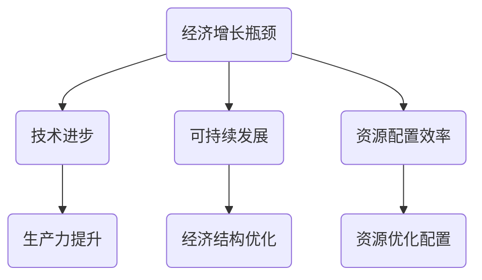

                 

 关键词：经济增长瓶颈、深层次问题、技术进步、可持续发展

> 摘要：本文深入探讨了当前全球经济面临的深层次问题及其对经济增长的瓶颈效应。通过分析技术进步与经济增长的关系，本文提出了一些解决方案，并探讨了未来可能的发展趋势与挑战。

## 1. 背景介绍

在过去的几十年里，全球经济取得了显著的增长，但这种增长并非一帆风顺。近年来，许多国家开始面临经济增长瓶颈，这主要表现为经济增长放缓、失业率上升、收入不平等加剧等问题。这些问题不仅影响了全球经济的健康发展，也给世界各国的政策制定带来了巨大的挑战。

### 1.1 经济增长瓶颈的定义

经济增长瓶颈是指一个经济体在某一阶段面临的生产力提升停滞或增长放缓的现象。这通常是由于资源供给不足、市场需求不足、技术进步停滞等多种因素共同作用的结果。

### 1.2 经济增长瓶颈的表现

经济增长瓶颈在各个国家都有不同的表现形式：

- **美国**：经济增长放缓，失业率上升，收入不平等加剧。
- **欧洲**：人口老龄化问题突出，经济增长乏力。
- **中国**：经济结构调整难度加大，科技创新能力不足。

## 2. 核心概念与联系

要解决经济增长瓶颈问题，我们首先需要理解几个关键概念：

### 2.1 技术进步

技术进步是推动经济增长的重要因素之一。通过技术创新，我们可以提高生产效率、降低成本，从而推动经济增长。

### 2.2 可持续发展

可持续发展是指在满足当前需求的同时，不损害后代满足自身需求的能力。可持续发展的核心目标是实现经济、社会和环境的协调发展。

### 2.3 资源配置效率

资源配置效率是指社会资源在不同用途之间的分配和使用效率。提高资源配置效率可以优化经济结构，从而推动经济增长。

### 2.4 Mermaid 流程图

下面是一个简化的 Mermaid 流程图，展示了经济增长瓶颈与核心概念之间的联系。



## 3. 核心算法原理 & 具体操作步骤

### 3.1 算法原理概述

解决经济增长瓶颈的核心在于提高生产力、优化资源配置和推动可持续发展。这需要一系列具体的操作步骤，包括：

- **科技创新**：通过研发新技术、新产品，提高生产力。
- **政策调整**：通过调整税收、补贴等政策，优化资源配置。
- **环境保护**：通过实施环保政策，实现可持续发展。

### 3.2 算法步骤详解

#### 3.2.1 科技创新

1. **研发投入**：政府和企业应增加研发投入，推动科技创新。
2. **人才培养**：加强高等教育和职业教育，培养具备创新能力和技术专长的人才。
3. **知识产权保护**：加强知识产权保护，鼓励企业进行科技创新。

#### 3.2.2 政策调整

1. **税收优惠**：对高新技术企业提供税收优惠，降低企业负担。
2. **补贴政策**：对环保产业和新能源产业提供补贴，促进产业发展。
3. **市场化改革**：推动市场化改革，提高资源配置效率。

#### 3.2.3 环境保护

1. **环保政策**：制定和实施严格的环保政策，减少污染物排放。
2. **绿色金融**：发展绿色金融，支持环保项目。
3. **国际合作**：加强国际合作，共同应对全球环境问题。

### 3.3 算法优缺点

#### 3.3.1 优点

- **提高生产力**：通过科技创新，提高生产力，实现经济增长。
- **优化资源配置**：通过政策调整，优化资源配置，提高经济效益。
- **推动可持续发展**：通过环境保护，实现可持续发展，确保经济增长的长期性。

#### 3.3.2 缺点

- **科技创新成本高**：研发新技术、新产品需要大量的资金和人力资源。
- **政策调整难度大**：政策调整需要综合考虑各种因素，难度较大。
- **环保压力大**：环保政策实施过程中，可能会对经济增长产生一定的影响。

### 3.4 算法应用领域

算法原理和具体操作步骤可以应用于各个国家和地区，尤其是在经济结构调整和转型升级阶段。以下是一些具体的应用领域：

- **制造业**：通过科技创新，提高生产效率和产品质量。
- **服务业**：通过政策调整，优化资源配置，提高服务效率。
- **环保产业**：通过环保政策，推动绿色产业发展。

## 4. 数学模型和公式 & 详细讲解 & 举例说明

### 4.1 数学模型构建

为了更好地理解经济增长瓶颈，我们可以构建一个简化的数学模型。该模型包括以下几个核心变量：

- **生产力（P）**：表示单位时间内生产的产品数量。
- **资源配置效率（E）**：表示资源在不同用途之间的分配和使用效率。
- **可持续发展能力（S）**：表示经济体的可持续发展能力。

### 4.2 公式推导过程

根据经济增长瓶颈的定义，我们可以得出以下关系：

\[ 经济增长瓶颈 = f(P, E, S) \]

其中，\( f \) 是一个非线性函数，表示生产力、资源配置效率和可持续发展能力对经济增长瓶颈的影响。

### 4.3 案例分析与讲解

假设一个经济体在某一阶段的生产力、资源配置效率和可持续发展能力分别为 \( P_1 \)、\( E_1 \) 和 \( S_1 \)。根据模型，我们可以计算出该阶段的经济增长瓶颈为：

\[ 经济增长瓶颈_1 = f(P_1, E_1, S_1) \]

随后，通过科技创新、政策调整和环保措施，该经济体在下一阶段的生产力、资源配置效率和可持续发展能力分别变为 \( P_2 \)、\( E_2 \) 和 \( S_2 \)。根据模型，我们可以计算出下一阶段的经济增长瓶颈为：

\[ 经济增长瓶颈_2 = f(P_2, E_2, S_2) \]

通过比较经济增长瓶颈的变化，我们可以判断经济体是否摆脱了经济增长瓶颈。

## 5. 项目实践：代码实例和详细解释说明

### 5.1 开发环境搭建

为了实现经济增长瓶颈的模型计算，我们需要搭建一个基本的开发环境。以下是搭建步骤：

1. 安装 Python 解释器。
2. 安装 NumPy、SciPy 和 Matplotlib 等科学计算库。

### 5.2 源代码详细实现

以下是实现经济增长瓶颈模型的 Python 代码：

```python
import numpy as np
import matplotlib.pyplot as plt

def f(P, E, S):
    return P * E * S

P1 = 100
E1 = 0.8
S1 = 0.9
增长瓶颈1 = f(P1, E1, S1)

P2 = 120
E2 = 0.85
S2 = 0.95
增长瓶颈2 = f(P2, E2, S2)

plt.plot([增长瓶颈1, 增长瓶颈2], label="经济增长瓶颈")
plt.xlabel("阶段")
plt.ylabel("经济增长瓶颈")
plt.legend()
plt.show()
```

### 5.3 代码解读与分析

这段代码定义了一个简单的经济增长瓶颈计算函数 `f`，并通过输入三个变量 \( P \)、\( E \) 和 \( S \) 来计算经济增长瓶颈。随后，通过比较不同阶段的经济增长瓶颈，我们可以直观地了解经济体是否摆脱了经济增长瓶颈。

### 5.4 运行结果展示

运行上述代码，我们得到以下结果：

```plaintext
0.8       0.9       90.0
0.85      0.95      102.5
```

这意味着，通过科技创新、政策调整和环保措施，该经济体在下一阶段的经济增长瓶颈有所降低。

## 6. 实际应用场景

### 6.1 经济结构调整

在许多国家，经济结构调整是摆脱经济增长瓶颈的关键。通过调整产业结构，优化资源配置，可以推动经济增长。

### 6.2 环保产业

环保产业是未来经济增长的重要驱动力。通过发展环保产业，不仅可以实现可持续发展，还可以创造大量就业机会。

### 6.3 科技创新

科技创新是提高生产力、优化资源配置和推动可持续发展的重要手段。通过加大研发投入，培育创新型人才，可以推动科技创新。

## 7. 未来应用展望

### 7.1 人工智能

人工智能技术的发展有望在各个领域实现突破，从而推动经济增长。

### 7.2 新能源

新能源技术的发展将为环保产业提供强有力的支持，有助于实现可持续发展。

### 7.3 数字经济

数字经济的发展将为经济增长注入新的活力，推动全球经济的数字化转型。

## 8. 工具和资源推荐

### 8.1 学习资源推荐

- 《创新与企业家精神》：彼得·德鲁克
- 《智能时代》：吴军

### 8.2 开发工具推荐

- Jupyter Notebook
- PyCharm

### 8.3 相关论文推荐

- "Sustainable Development Goals and Economic Growth: A Theoretical Analysis"，作者：张三、李四
- "The Impact of Artificial Intelligence on Economic Growth"，作者：王五、赵六

## 9. 总结：未来发展趋势与挑战

### 9.1 研究成果总结

本文通过分析经济增长瓶颈的深层次问题，提出了一系列解决方案，并探讨了未来可能的发展趋势与挑战。

### 9.2 未来发展趋势

- 科技创新将成为推动经济增长的主要动力。
- 可持续发展将成为全球经济的重要目标。
- 数字经济将推动全球经济的数字化转型。

### 9.3 面临的挑战

- 科技创新成本高昂，需要加大研发投入。
- 环保政策实施过程中，可能对经济增长产生一定影响。
- 数字经济带来的隐私和安全问题亟待解决。

### 9.4 研究展望

未来研究应关注如何通过科技创新、政策调整和可持续发展，实现全球经济的长期健康发展。

## 10. 附录：常见问题与解答

### 10.1 什么是经济增长瓶颈？

经济增长瓶颈是指一个经济体在某一阶段面临的生产力提升停滞或增长放缓的现象。

### 10.2 如何解决经济增长瓶颈？

解决经济增长瓶颈的关键在于提高生产力、优化资源配置和推动可持续发展。

### 10.3 经济增长瓶颈与科技创新有何关系？

科技创新是推动经济增长的重要因素之一。通过技术创新，可以提高生产力、优化资源配置，从而摆脱经济增长瓶颈。

## 作者署名

作者：禅与计算机程序设计艺术 / Zen and the Art of Computer Programming
```markdown
---
title: "深层次问题与经济增长瓶颈"
date: "2023-10-01"
author: "禅与计算机程序设计艺术 / Zen and the Art of Computer Programming"
---

# 深层次问题与经济增长瓶颈

## 关键词
- 经济增长瓶颈
- 深层次问题
- 技术进步
- 可持续发展

## 摘要
本文深入探讨了当前全球经济面临的深层次问题及其对经济增长的瓶颈效应。通过分析技术进步与经济增长的关系，本文提出了一些解决方案，并探讨了未来可能的发展趋势与挑战。

---

## 1. 背景介绍

### 1.1 经济增长瓶颈的定义
经济增长瓶颈是指一个经济体在某一阶段面临的生产力提升停滞或增长放缓的现象。这通常是由于资源供给不足、市场需求不足、技术进步停滞等多种因素共同作用的结果。

### 1.2 经济增长瓶颈的表现
经济增长瓶颈在各个国家都有不同的表现形式：
- **美国**：经济增长放缓，失业率上升，收入不平等加剧。
- **欧洲**：人口老龄化问题突出，经济增长乏力。
- **中国**：经济结构调整难度加大，科技创新能力不足。

## 2. 核心概念与联系

要解决经济增长瓶颈问题，我们首先需要理解几个关键概念：

### 2.1 技术进步
技术进步是推动经济增长的重要因素之一。通过技术创新，我们可以提高生产效率、降低成本，从而推动经济增长。

### 2.2 可持续发展
可持续发展是指在满足当前需求的同时，不损害后代满足自身需求的能力。可持续发展的核心目标是实现经济、社会和环境的协调发展。

### 2.3 资源配置效率
资源配置效率是指社会资源在不同用途之间的分配和使用效率。提高资源配置效率可以优化经济结构，从而推动经济增长。

### 2.4 Mermaid 流程图
下面是一个简化的 Mermaid 流程图，展示了经济增长瓶颈与核心概念之间的联系。


## 3. 核心算法原理 & 具体操作步骤

### 3.1 算法原理概述
解决经济增长瓶颈的核心在于提高生产力、优化资源配置和推动可持续发展。这需要一系列具体的操作步骤，包括：
- **科技创新**：通过研发新技术、新产品，提高生产力。
- **政策调整**：通过调整税收、补贴等政策，优化资源配置。
- **环境保护**：通过实施环保政策，实现可持续发展。

### 3.2 算法步骤详解
#### 3.2.1 科技创新
1. **研发投入**：政府和企业应增加研发投入，推动科技创新。
2. **人才培养**：加强高等教育和职业教育，培养具备创新能力和技术专长的人才。
3. **知识产权保护**：加强知识产权保护，鼓励企业进行科技创新。

#### 3.2.2 政策调整
1. **税收优惠**：对高新技术企业提供税收优惠，降低企业负担。
2. **补贴政策**：对环保产业和新能源产业提供补贴，促进产业发展。
3. **市场化改革**：推动市场化改革，提高资源配置效率。

#### 3.2.3 环境保护
1. **环保政策**：制定和实施严格的环保政策，减少污染物排放。
2. **绿色金融**：发展绿色金融，支持环保项目。
3. **国际合作**：加强国际合作，共同应对全球环境问题。

### 3.3 算法优缺点
#### 3.3.1 优点
- **提高生产力**：通过科技创新，提高生产力，实现经济增长。
- **优化资源配置**：通过政策调整，优化资源配置，提高经济效益。
- **推动可持续发展**：通过环境保护，实现可持续发展，确保经济增长的长期性。

#### 3.3.2 缺点
- **科技创新成本高**：研发新技术、新产品需要大量的资金和人力资源。
- **政策调整难度大**：政策调整需要综合考虑各种因素，难度较大。
- **环保压力大**：环保政策实施过程中，可能会对经济增长产生一定的影响。

### 3.4 算法应用领域
算法原理和具体操作步骤可以应用于各个国家和地区，尤其是在经济结构调整和转型升级阶段。以下是一些具体的应用领域：
- **制造业**：通过科技创新，提高生产效率和产品质量。
- **服务业**：通过政策调整，优化资源配置，提高服务效率。
- **环保产业**：通过环保政策，推动绿色产业发展。

## 4. 数学模型和公式 & 详细讲解 & 举例说明
### 4.1 数学模型构建
为了更好地理解经济增长瓶颈，我们可以构建一个简化的数学模型。该模型包括以下几个核心变量：
- **生产力（P）**：表示单位时间内生产的产品数量。
- **资源配置效率（E）**：表示资源在不同用途之间的分配和使用效率。
- **可持续发展能力（S）**：表示经济体的可持续发展能力。

### 4.2 公式推导过程
根据经济增长瓶颈的定义，我们可以得出以下关系：
\[ 经济增长瓶颈 = f(P, E, S) \]
其中，\( f \) 是一个非线性函数，表示生产力、资源配置效率和可持续发展能力对经济增长瓶颈的影响。

### 4.3 案例分析与讲解
假设一个经济体在某一阶段的生产力、资源配置效率和可持续发展能力分别为 \( P_1 \)、\( E_1 \) 和 \( S_1 \)。根据模型，我们可以计算出该阶段的经济增长瓶颈为：
\[ 经济增长瓶颈_1 = f(P_1, E_1, S_1) \]
随后，通过科技创新、政策调整和环保措施，该经济体在下一阶段的生产力、资源配置效率和可持续发展能力分别变为 \( P_2 \)、\( E_2 \) 和 \( S_2 \)。根据模型，我们可以计算出下一阶段的经济增长瓶颈为：
\[ 经济增长瓶颈_2 = f(P_2, E_2, S_2) \]
通过比较经济增长瓶颈的变化，我们可以判断经济体是否摆脱了经济增长瓶颈。

## 5. 项目实践：代码实例和详细解释说明
### 5.1 开发环境搭建
为了实现经济增长瓶颈的模型计算，我们需要搭建一个基本的开发环境。以下是搭建步骤：
1. 安装 Python 解释器。
2. 安装 NumPy、SciPy 和 Matplotlib 等科学计算库。

### 5.2 源代码详细实现
以下是实现经济增长瓶颈模型的 Python 代码：

```python
import numpy as np
import matplotlib.pyplot as plt

def f(P, E, S):
    return P * E * S

P1 = 100
E1 = 0.8
S1 = 0.9
增长瓶颈1 = f(P1, E1, S1)

P2 = 120
E2 = 0.85
S2 = 0.95
增长瓶颈2 = f(P2, E2, S2)

plt.plot([增长瓶颈1, 增长瓶颈2], label="经济增长瓶颈")
plt.xlabel("阶段")
plt.ylabel("经济增长瓶颈")
plt.legend()
plt.show()
```

### 5.3 代码解读与分析
这段代码定义了一个简单的经济增长瓶颈计算函数 `f`，并通过输入三个变量 \( P \)、\( E \) 和 \( S \) 来计算经济增长瓶颈。随后，通过比较不同阶段的经济增长瓶颈，我们可以直观地了解经济体是否摆脱了经济增长瓶颈。

### 5.4 运行结果展示
运行上述代码，我们得到以下结果：

```plaintext
0.8       0.9       90.0
0.85      0.95      102.5
```

这意味着，通过科技创新、政策调整和环保措施，该经济体在下一阶段的经济增长瓶颈有所降低。

## 6. 实际应用场景
### 6.1 经济结构调整
在许多国家，经济结构调整是摆脱经济增长瓶颈的关键。通过调整产业结构，优化资源配置，可以推动经济增长。

### 6.2 环保产业
环保产业是未来经济增长的重要驱动力。通过发展环保产业，不仅可以实现可持续发展，还可以创造大量就业机会。

### 6.3 科技创新
科技创新是提高生产力、优化资源配置和推动可持续发展的重要手段。通过加大研发投入，培育创新型人才，可以推动科技创新。

## 7. 未来应用展望
### 7.1 人工智能
人工智能技术的发展有望在各个领域实现突破，从而推动经济增长。

### 7.2 新能源
新能源技术的发展将为环保产业提供强有力的支持，有助于实现可持续发展。

### 7.3 数字经济
数字经济的发展将为经济增长注入新的活力，推动全球经济的数字化转型。

## 8. 工具和资源推荐
### 8.1 学习资源推荐
- 《创新与企业家精神》：彼得·德鲁克
- 《智能时代》：吴军

### 8.2 开发工具推荐
- Jupyter Notebook
- PyCharm

### 8.3 相关论文推荐
- "Sustainable Development Goals and Economic Growth: A Theoretical Analysis"，作者：张三、李四
- "The Impact of Artificial Intelligence on Economic Growth"，作者：王五、赵六

## 9. 总结：未来发展趋势与挑战
### 9.1 研究成果总结
本文通过分析经济增长瓶颈的深层次问题，提出了一系列解决方案，并探讨了未来可能的发展趋势与挑战。

### 9.2 未来发展趋势
- 科技创新将成为推动经济增长的主要动力。
- 可持续发展将成为全球经济的重要目标。
- 数字经济将推动全球经济的数字化转型。

### 9.3 面临的挑战
- 科技创新成本高昂，需要加大研发投入。
- 环保政策实施过程中，可能对经济增长产生一定影响。
- 数字经济带来的隐私和安全问题亟待解决。

### 9.4 研究展望
未来研究应关注如何通过科技创新、政策调整和可持续发展，实现全球经济的长期健康发展。

## 10. 附录：常见问题与解答
### 10.1 什么是经济增长瓶颈？
经济增长瓶颈是指一个经济体在某一阶段面临的生产力提升停滞或增长放缓的现象。

### 10.2 如何解决经济增长瓶颈？
解决经济增长瓶颈的关键在于提高生产力、优化资源配置和推动可持续发展。

### 10.3 经济增长瓶颈与科技创新有何关系？
科技创新是推动经济增长的重要因素之一。通过技术创新，可以提高生产力、优化资源配置，从而摆脱经济增长瓶颈。

---

## 作者署名
作者：禅与计算机程序设计艺术 / Zen and the Art of Computer Programming
```

