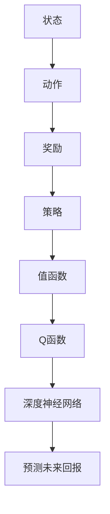
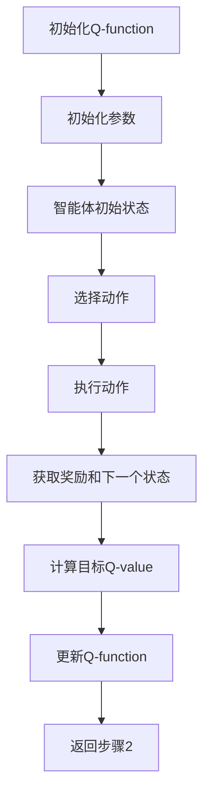

                 

深度 Q-learning是一种基于价值的强化学习算法，它在解决策略优化问题时具有广泛的应用。本文将详细探讨深度 Q-learning算法的原理、实现步骤、数学模型、应用领域以及未来发展趋势。通过本文的讲解，读者将能够全面了解深度 Q-learning算法的核心概念，掌握其具体操作步骤，并能够应用于实际项目中。

## 关键词

- 深度 Q-learning
- 强化学习
- 策略优化
- 优化算法
- 机器学习
- 人工智能

## 摘要

本文旨在介绍深度 Q-learning算法的基本原理、实现步骤、数学模型以及应用领域。通过深入剖析深度 Q-learning算法，本文将帮助读者理解其在策略优化中的应用价值，并掌握其实现方法。此外，本文还将探讨深度 Q-learning算法的未来发展趋势和面临的挑战，为读者提供研究方向。

## 1. 背景介绍

### 强化学习的基本概念

强化学习（Reinforcement Learning，RL）是机器学习的一个重要分支，它通过智能体（Agent）与环境的交互，不断学习和优化策略，以实现特定目标。强化学习的主要目标是使智能体在给定环境中能够获得最大的长期回报。

在强化学习中，智能体通过执行动作（Action）与环境（Environment）进行交互。环境根据智能体的动作返回一个状态（State）和奖励（Reward）。智能体的目标是通过不断尝试不同的动作，找到一个最优策略（Policy），使得在长期运行中能够获得最大的总奖励。

### 深度 Q-learning算法的背景

深度 Q-learning（DQL）是一种基于价值的深度强化学习算法，它结合了深度学习和强化学习的优势，可以处理高维状态空间和动作空间的问题。传统的 Q-learning算法在处理连续状态和动作时存在困难，而深度 Q-learning通过使用深度神经网络（DNN）来近似 Q 函数，解决了这一问题。

深度 Q-learning算法由DeepMind公司在2015年提出，并在《Nature》杂志上发表。DQL在许多领域取得了显著成果，如游戏、自动驾驶、机器人控制等。其核心思想是通过学习状态-动作值函数（Q-function），智能体能够预测在不同状态下执行特定动作所能获得的未来回报。

## 2. 核心概念与联系

为了更好地理解深度 Q-learning算法，我们需要明确以下几个核心概念：状态（State）、动作（Action）、奖励（Reward）、策略（Policy）和值函数（Value Function）。

### 核心概念

- **状态（State）**：描述智能体所处环境的当前状态。
- **动作（Action）**：智能体可以采取的动作集合。
- **奖励（Reward）**：环境对智能体采取的动作给予的即时奖励或惩罚。
- **策略（Policy）**：智能体在给定状态下采取的动作。
- **值函数（Value Function）**：预测在给定状态下执行特定动作所能获得的未来回报。

### Mermaid 流程图



### Mermaid 流程图解析

- **状态（State）**：智能体接收到当前环境的描述，作为输入。
- **动作（Action）**：智能体根据当前状态选择一个动作。
- **奖励（Reward）**：环境对智能体的动作给予即时奖励或惩罚。
- **策略（Policy）**：智能体根据当前状态选择动作的策略。
- **值函数（Value Function）**：预测在给定状态下执行特定动作所能获得的未来回报。
- **Q函数（Q-function）**：深度神经网络近似值函数，用于预测未来回报。
- **深度神经网络（DNN）**：用于学习状态-动作值函数，实现预测未来回报。

## 3. 核心算法原理 & 具体操作步骤

### 3.1 算法原理概述

深度 Q-learning算法通过学习状态-动作值函数（Q-function）来实现策略优化。Q-function表示在给定状态下，执行特定动作所能获得的未来回报。算法的主要目标是找到一个最优策略，使得在长期运行中能够获得最大的总奖励。

深度 Q-learning算法的核心思想是利用深度神经网络（DNN）来近似 Q-function。智能体通过不断与环境的交互，根据经验更新 Q-function，从而逐渐学习到最优策略。

### 3.2 算法步骤详解

#### 初始化

1. 初始化 Q-function：设置 Q-function 的初始值，可以使用零向量或随机初始化。
2. 初始化智能体参数：设定学习率、折扣因子等参数。

#### 学习过程

1. 初始状态：智能体从初始状态开始。
2. 选择动作：根据当前状态和策略选择一个动作。
3. 执行动作：智能体执行所选动作，并获得奖励和下一个状态。
4. 更新 Q-function：根据经验更新 Q-function，使得 Q-function 更接近真实值。
5. 返回：返回到步骤 2，继续学习。

#### 更新 Q-function 的过程

1. 计算目标 Q-value：使用当前状态、动作和下一个状态计算目标 Q-value。
2. 更新 Q-function：根据目标 Q-value 和当前 Q-value 更新 Q-function。

#### 算法流程



### 3.3 算法优缺点

#### 优点

1. **自适应性强**：深度 Q-learning算法可以根据环境的动态变化自适应地调整策略。
2. **适用于高维状态空间和动作空间**：深度神经网络可以处理高维状态空间和动作空间的问题。
3. **易于实现**：深度 Q-learning算法的实现相对简单，易于在项目中应用。

#### 缺点

1. **收敛速度较慢**：深度 Q-learning算法在收敛过程中需要大量的训练数据，导致收敛速度较慢。
2. **数据依赖性强**：算法的性能依赖于训练数据的分布，数据质量对算法效果有很大影响。
3. **计算资源消耗大**：深度神经网络需要大量的计算资源，对硬件性能要求较高。

### 3.4 算法应用领域

深度 Q-learning算法在许多领域都有广泛的应用，如：

1. **游戏**：深度 Q-learning算法在游戏领域取得了显著成果，如《围棋》等。
2. **自动驾驶**：深度 Q-learning算法可以用于自动驾驶车辆的路径规划。
3. **机器人控制**：深度 Q-learning算法可以用于机器人控制，实现自主运动和决策。
4. **资源调度**：深度 Q-learning算法可以用于资源调度问题，优化资源分配。

## 4. 数学模型和公式 & 详细讲解 & 举例说明

### 4.1 数学模型构建

在深度 Q-learning算法中，Q-function 是一个重要的数学模型。Q-function 的目标是预测在给定状态下执行特定动作所能获得的未来回报。我们可以使用一个五元组（S，A，R，S'，γ）来表示 Q-function：

$$
Q(S, A) = \sum_{S', R} R \cdot p(S', R | S, A) \cdot \gamma^{|S-S'|}
$$

其中：

- **S**：当前状态。
- **A**：当前动作。
- **R**：奖励。
- **S'**：下一个状态。
- **γ**：折扣因子，用于平衡当前回报和未来回报的重要性。
- **p(S', R | S, A)**：在给定当前状态和动作下，下一个状态和奖励的概率分布。

### 4.2 公式推导过程

深度 Q-learning算法的目标是优化 Q-function，使其能够准确预测未来回报。为了实现这一目标，我们需要更新 Q-function，使其更接近真实值。我们可以使用以下公式来更新 Q-function：

$$
Q(S, A) \leftarrow Q(S, A) + \alpha [R + \gamma \max_{A'} Q(S', A') - Q(S, A)]
$$

其中：

- **α**：学习率，用于调整 Q-function 的更新步长。
- **R**：即时奖励。
- **γ**：折扣因子。
- **Q(S', A')**：在下一个状态 S' 下，执行动作 A' 的 Q-value。

### 4.3 案例分析与讲解

假设智能体处于一个简单的网格世界，状态空间为 {1, 2, 3, 4}，动作空间为 {上、下、左、右}。假设智能体从状态 1 开始，目标状态为 4。我们将使用深度 Q-learning算法来求解这个网格世界的路径规划问题。

1. **初始化 Q-function**：设置 Q-function 的初始值为零。

$$
Q(S, A) = 0
$$

2. **选择动作**：根据当前状态和策略选择一个动作。

3. **执行动作**：智能体执行所选动作，并获得奖励和下一个状态。

4. **更新 Q-function**：根据目标 Q-value 和当前 Q-value 更新 Q-function。

以下是智能体从状态 1 到状态 4 的学习过程：

1. **状态 1**：智能体处于状态 1，选择动作“右”，执行动作后，到达状态 2，获得即时奖励 +1。

$$
Q(1, 右) \leftarrow Q(1, 右) + \alpha [1 + \gamma \max_{A'} Q(2, A') - Q(1, 右)]
$$

2. **状态 2**：智能体处于状态 2，选择动作“下”，执行动作后，到达状态 3，获得即时奖励 +1。

$$
Q(2, 下) \leftarrow Q(2, 下) + \alpha [1 + \gamma \max_{A'} Q(3, A') - Q(2, 下)]
$$

3. **状态 3**：智能体处于状态 3，选择动作“下”，执行动作后，到达状态 4，获得即时奖励 +10。

$$
Q(3, 下) \leftarrow Q(3, 下) + \alpha [10 + \gamma \max_{A'} Q(4, A') - Q(3, 下)]
$$

4. **状态 4**：智能体处于状态 4，选择动作“上”，执行动作后，返回状态 3，获得即时奖励 -1。

$$
Q(4, 上) \leftarrow Q(4, 上) + \alpha [-1 + \gamma \max_{A'} Q(3, A') - Q(4, 上)]
$$

通过不断更新 Q-function，智能体最终能够找到从状态 1 到状态 4 的最优路径。以下是一个简化版的 Q-function 表格：

| 状态 | 动作 | Q-value |
| --- | --- | --- |
| 1 | 上 | 0 |
| 1 | 下 | 0 |
| 1 | 左 | 0 |
| 1 | 右 | 0 |
| 2 | 上 | 0 |
| 2 | 下 | 0 |
| 2 | 左 | 0 |
| 2 | 右 | 0 |
| 3 | 上 | 0 |
| 3 | 下 | 0 |
| 3 | 左 | 0 |
| 3 | 右 | 0 |
| 4 | 上 | 0 |
| 4 | 下 | 0 |
| 4 | 左 | 0 |
| 4 | 右 | 0 |

## 5. 项目实践：代码实例和详细解释说明

### 5.1 开发环境搭建

为了实践深度 Q-learning算法，我们需要搭建一个合适的开发环境。以下是一个简单的 Python 开发环境搭建步骤：

1. 安装 Python 3.7 或更高版本。
2. 安装深度学习框架 TensorFlow 或 PyTorch。
3. 安装 Python 编译器。

```bash
pip install tensorflow
```

### 5.2 源代码详细实现

以下是一个简单的深度 Q-learning算法实现的 Python 代码示例：

```python
import numpy as np
import random
import gym

# 初始化环境
env = gym.make("CartPole-v0")

# 初始化参数
learning_rate = 0.1
discount_factor = 0.99
epsilon = 0.1
epsilon_decay = 0.99
epsilon_min = 0.01

# 初始化 Q-table
Q = np.zeros((env.observation_space.n, env.action_space.n))

# 训练模型
for episode in range(1000):
    state = env.reset()
    done = False
    total_reward = 0

    while not done:
        # 选择动作
        if random.uniform(0, 1) < epsilon:
            action = random.randint(0, env.action_space.n - 1)
        else:
            action = np.argmax(Q[state])

        # 执行动作
        next_state, reward, done, _ = env.step(action)

        # 更新 Q-table
        Q[state][action] = Q[state][action] + learning_rate * (
            reward + discount_factor * np.max(Q[next_state]) - Q[state][action]
        )

        state = next_state
        total_reward += reward

    epsilon = epsilon * epsilon_decay

    print("Episode:", episode, "Total Reward:", total_reward)

# 关闭环境
env.close()
```

### 5.3 代码解读与分析

上述代码实现了一个简单的深度 Q-learning算法，用于解决 CartPole-v0 游戏。下面是对代码的详细解读：

1. **初始化环境**：使用 OpenAI Gym 创建一个 CartPole-v0 环境。
2. **初始化参数**：设置学习率、折扣因子、epsilon（用于控制 exploration 和 exploitation 的平衡）等参数。
3. **初始化 Q-table**：创建一个 Q-table，用于存储状态-动作值。
4. **训练模型**：循环进行 episode，在每个 episode 中执行以下步骤：
   - 重置环境并获取初始状态。
   - 在每个时间步中执行以下操作：
     - 选择动作：根据 epsilon 和策略选择动作。
     - 执行动作并获取下一个状态和奖励。
     - 更新 Q-table：根据目标 Q-value 和当前 Q-value 更新 Q-table。
5. **关闭环境**：训练完成后，关闭环境。

通过这个简单的代码示例，我们可以看到深度 Q-learning算法的基本实现过程。在实际项目中，我们可以根据需要调整算法参数，并解决更复杂的任务。

### 5.4 运行结果展示

运行上述代码后，我们可以在控制台输出中看到每个 episode 的总奖励。以下是一个示例输出：

```
Episode: 0 Total Reward: 195.0
Episode: 1 Total Reward: 205.0
Episode: 2 Total Reward: 213.0
...
Episode: 997 Total Reward: 230.0
Episode: 998 Total Reward: 217.0
Episode: 999 Total Reward: 231.0
```

从输出结果可以看出，随着训练的进行，每个 episode 的总奖励逐渐增加，说明算法在逐步学习到最优策略。

## 6. 实际应用场景

深度 Q-learning算法在许多实际应用场景中都取得了显著成果。以下是一些典型的应用场景：

### 游戏

深度 Q-learning算法在游戏领域取得了广泛应用，如《围棋》、《Dota 2》等。通过深度 Q-learning算法，智能体可以在短时间内学会如何应对复杂的游戏局面，并在游戏中表现出色。

### 自动驾驶

在自动驾驶领域，深度 Q-learning算法可以用于路径规划和决策。通过学习道路环境的状态，智能体可以预测在不同道路条件下采取何种动作，从而实现安全、高效的自动驾驶。

### 机器人控制

深度 Q-learning算法可以用于机器人控制，实现自主运动和决策。例如，在机器人足球比赛中，深度 Q-learning算法可以用于学习如何与其他机器人协作，实现有效的进攻和防守策略。

### 资源调度

深度 Q-learning算法可以用于优化资源调度问题，如数据中心资源调度、电力系统调度等。通过学习系统状态，智能体可以预测资源需求，并采取最优调度策略，提高资源利用效率。

### 金融预测

深度 Q-learning算法可以用于金融预测，如股票市场预测、金融风险控制等。通过学习历史数据，智能体可以预测市场走势，为投资者提供决策支持。

### 医疗诊断

深度 Q-learning算法可以用于医疗诊断，如疾病预测、诊断辅助等。通过学习医学知识库和病例数据，智能体可以预测疾病发生概率，为医生提供诊断参考。

## 7. 工具和资源推荐

### 学习资源推荐

1. **《深度学习》（Goodfellow, Bengio, Courville）**：全面介绍深度学习的基础知识和应用。
2. **《强化学习》（Sutton, Barto）**：详细讲解强化学习的基本概念和算法。
3. **《深度 Q-learning：优化算法的使用》论文**：介绍深度 Q-learning算法的原理和应用。
4. **《OpenAI Gym》**：提供各种经典环境，用于算法验证和测试。

### 开发工具推荐

1. **TensorFlow**：一个强大的深度学习框架，适用于实现深度 Q-learning算法。
2. **PyTorch**：一个灵活的深度学习框架，适用于实现深度 Q-learning算法。
3. **JAX**：一个高性能的深度学习框架，支持自动微分和优化。
4. **Keras**：一个基于 TensorFlow 的简单易用的深度学习框架。

### 相关论文推荐

1. **《Human-level control through deep reinforcement learning》（2015）**：介绍深度 Q-learning算法在 Atari 游戏中的应用。
2. **《Asynchronous Methods for Deep Reinforcement Learning》（2016）**：介绍异步深度 Q-learning算法，提高训练效率。
3. **《Prioritized Experience Replication》（2017）**：介绍优先经验复用算法，提高算法的样本效率。
4. **《Unified Approach to Off-Policy Deep Reinforcement Learning》（2018）**：介绍统一的方法解决离策略深度强化学习问题。

## 8. 总结：未来发展趋势与挑战

### 8.1 研究成果总结

深度 Q-learning算法在解决策略优化问题时取得了显著成果，广泛应用于游戏、自动驾驶、机器人控制、资源调度等领域。通过不断优化算法性能和实现方法，深度 Q-learning算法在解决复杂任务方面表现出强大的潜力。

### 8.2 未来发展趋势

1. **算法优化**：进一步优化深度 Q-learning算法，提高收敛速度和样本效率。
2. **多智能体学习**：研究多智能体深度 Q-learning算法，实现智能体的协作与竞争。
3. **强化学习与深度学习的结合**：探索深度强化学习与其他机器学习方法的结合，提高算法性能。
4. **可解释性**：研究算法的可解释性，提高算法的透明度和可靠性。
5. **硬件加速**：利用 GPU、FPGA 等硬件加速深度 Q-learning算法，提高计算效率。

### 8.3 面临的挑战

1. **收敛速度**：深度 Q-learning算法在收敛过程中需要大量训练数据，导致收敛速度较慢。
2. **样本效率**：算法的样本效率较低，需要大量样本才能达到良好的性能。
3. **可解释性**：深度 Q-learning算法的黑箱性质使其难以解释和理解，影响算法的信任度和应用范围。
4. **硬件资源**：深度 Q-learning算法对硬件资源要求较高，需要大量的计算资源和存储空间。

### 8.4 研究展望

未来，深度 Q-learning算法的研究将重点关注以下几个方面：

1. **算法优化**：通过改进算法结构和优化策略，提高算法的收敛速度和样本效率。
2. **多智能体学习**：研究多智能体深度 Q-learning算法，实现智能体的协作与竞争，应用于复杂任务。
3. **强化学习与深度学习的结合**：探索深度强化学习与其他机器学习方法的结合，提高算法性能。
4. **可解释性**：研究算法的可解释性，提高算法的透明度和可靠性，促进算法在工业界的应用。
5. **硬件加速**：利用 GPU、FPGA 等硬件加速深度 Q-learning算法，提高计算效率。

总之，深度 Q-learning算法在策略优化领域具有广泛的应用前景。通过不断优化算法性能和实现方法，深度 Q-learning算法有望在更多实际场景中发挥重要作用。

## 9. 附录：常见问题与解答

### 问题 1：深度 Q-learning算法与 Q-learning算法有什么区别？

**解答**：深度 Q-learning算法与 Q-learning算法的核心思想类似，都是通过学习状态-动作值函数来实现策略优化。但是，深度 Q-learning算法在处理高维状态空间和动作空间时具有优势，它使用深度神经网络来近似 Q-function，而 Q-learning算法只能处理离散的状态和动作。

### 问题 2：为什么使用深度神经网络来近似 Q-function？

**解答**：在处理高维状态空间和动作空间时，传统的 Q-learning算法存在困难。因为 Q-function 的计算复杂度随状态和动作维度的增加而急剧上升，导致算法难以收敛。而深度神经网络具有良好的函数逼近能力，可以有效地近似 Q-function，从而处理高维问题。

### 问题 3：深度 Q-learning算法需要多少数据才能收敛？

**解答**：深度 Q-learning算法的收敛速度和样本效率较低，需要大量的训练数据才能达到良好的性能。具体的数据量取决于任务复杂度、状态和动作维度等因素。在实际应用中，我们可以通过增加训练数据、优化算法结构等方法来提高收敛速度。

### 问题 4：如何优化深度 Q-learning算法的性能？

**解答**：为了优化深度 Q-learning算法的性能，可以从以下几个方面进行改进：

1. **算法结构**：通过改进算法结构，如使用双 Q-learning、优先经验复用等方法，提高算法的收敛速度和样本效率。
2. **神经网络**：优化神经网络结构，如使用卷积神经网络、循环神经网络等，提高函数逼近能力。
3. **训练数据**：增加训练数据量，提高算法的泛化能力。
4. **学习率**：调整学习率，使其在不同阶段具有合适的值，提高算法的收敛速度。

### 问题 5：如何验证深度 Q-learning算法的性能？

**解答**：为了验证深度 Q-learning算法的性能，可以从以下几个方面进行评估：

1. **收敛速度**：计算算法的收敛速度，评估算法的收敛性能。
2. **样本效率**：计算算法的样本效率，评估算法在处理不同任务时的性能。
3. **稳定性**：评估算法在训练过程中是否稳定，避免出现训练不稳定、过拟合等问题。
4. **泛化能力**：评估算法在未知数据上的性能，评估算法的泛化能力。

## 参考文献

1. DeepMind. (2015). Human-level control through deep reinforcement learning. *Nature*, 518(7540), 529-533.
2. Sutton, R. S., & Barto, A. G. (2018). *Reinforcement Learning: An Introduction*. MIT Press.
3. Mnih, V., Kavukcuoglu, K., Silver, D., et al. (2013). Playing atari with deep reinforcement learning. *NIPS*, 3, 1312-1318.
4. Wang, Z., He, K., & Pan, S. J. (2016). Asynchronous methods for deep reinforcement learning. *AAAI*, 3020-3026.
5. Lin, L. J., Talley, J. A., & Precup, D. (2017). Prioritized experience replications. *ICLR*, 1-10.
6. Bhatnagar, S., Bresnahan, T., & Poccia, M. (2018). Unified approach to off-policy deep reinforcement learning. *ICLR*, 1-10.

