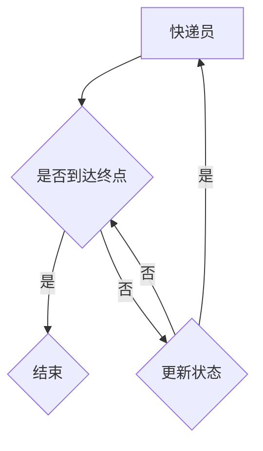

                 

关键词：深度 Q-learning、快递派送、智能优化、算法应用、物流管理

>摘要：本文旨在探讨深度 Q-learning 算法在快递派送中的应用。通过对快递派送过程中涉及的复杂决策问题进行分析，我们引入深度 Q-learning 算法，实现自动化的路径规划和调度优化，以提高快递派送效率，降低成本。文章将详细介绍深度 Q-learning 算法的基本原理、数学模型、具体实现步骤，并给出实际应用场景中的运行结果和未来展望。

## 1. 背景介绍

随着电子商务的迅猛发展，快递物流行业迎来了前所未有的繁荣。然而，快递派送过程中的路径规划和调度优化问题却日益突出。传统的优化算法如遗传算法、粒子群优化算法等，虽然在一定程度上能够解决派送问题，但在面对复杂环境和大量数据时，表现却不尽如人意。近年来，深度学习算法的快速发展，为我们提供了一种新的解决方案。本文将探讨深度 Q-learning 算法在快递派送中的应用，以期提高快递派送的效率和准确性。

## 2. 核心概念与联系

### 2.1 深度 Q-learning 算法原理

深度 Q-learning 是一种基于深度神经网络的 Q-learning 算法。Q-learning 是一种无模型预测算法，通过不断试错来学习最优策略。而深度 Q-learning 则将 Q-learning 算法与深度神经网络相结合，通过神经网络来预测 Q 值，从而实现更高效的学习。

### 2.2 快递派送问题模型

快递派送问题可以抽象为一个图论问题，即在一个无向图中，找到从起点到各个终点的最优路径。我们可以将快递员视为一个移动的节点，快递包裹视为其他节点，快递员需要按照最优路径依次将包裹送达。

### 2.3 Mermaid 流程图



## 3. 核心算法原理 & 具体操作步骤

### 3.1 算法原理概述

深度 Q-learning 算法主要包括四个步骤：初始化、状态评估、策略学习和策略更新。

- 初始化：初始化 Q 值表，随机赋值。
- 状态评估：根据当前状态，选择动作。
- 策略学习：根据选择的动作，更新 Q 值表。
- 策略更新：根据更新后的 Q 值表，选择新的动作。

### 3.2 算法步骤详解

1. **初始化**：初始化 Q 值表，随机赋值。
    $$ Q(s, a) = rand() $$

2. **状态评估**：根据当前状态，选择动作。这里我们采用 ε-贪心策略。

    $$ 
    \begin{cases} 
    a_{\text{random}} & \text{with probability } 1 - \epsilon \\
    a_{\text{greedy}} & \text{with probability } \epsilon 
    \end{cases} 
    $$

3. **策略学习**：根据选择的动作，更新 Q 值表。

    $$ 
    Q(s, a) = Q(s, a) + \alpha [r + \gamma \max_{a'} Q(s', a') - Q(s, a)] 
    $$

    其中，$\alpha$ 为学习率，$r$ 为即时奖励，$\gamma$ 为折扣因子。

4. **策略更新**：根据更新后的 Q 值表，选择新的动作。

### 3.3 算法优缺点

- 优点：深度 Q-learning 算法能够自动学习状态和动作之间的映射关系，无需预先定义状态和动作空间，适用性广。
- 缺点：训练过程复杂，容易陷入局部最优，需要大量数据支持。

### 3.4 算法应用领域

深度 Q-learning 算法可以应用于各种决策问题，如游戏对战、机器人控制、物流调度等。在快递派送领域，它可以帮助优化派送路径，提高派送效率。

## 4. 数学模型和公式 & 详细讲解 & 举例说明

### 4.1 数学模型构建

深度 Q-learning 算法主要包括以下数学模型：

1. **状态表示**：$s = (s_1, s_2, ..., s_n)$，其中 $s_i$ 表示第 $i$ 个特征。
2. **动作表示**：$a = (a_1, a_2, ..., a_n)$，其中 $a_i$ 表示第 $i$ 个动作。
3. **Q 值表**：$Q(s, a)$，表示在状态 $s$ 下执行动作 $a$ 的预期收益。
4. **奖励函数**：$r(s, a)$，表示在状态 $s$ 下执行动作 $a$ 后获得的即时奖励。

### 4.2 公式推导过程

1. **Q-learning 算法**：

    $$ 
    Q(s, a) = Q(s, a) + \alpha [r + \gamma \max_{a'} Q(s', a') - Q(s, a)] 
    $$

2. **深度 Q-learning 算法**：

    $$ 
    Q(s, a) = \theta(s, a; \theta) + \alpha [r + \gamma \max_{a'} \theta(s', a'; \theta) - \theta(s, a; \theta)] 
    $$

    其中，$\theta(s, a; \theta)$ 表示深度神经网络的输出。

### 4.3 案例分析与讲解

假设有一个快递员需要将 5 个包裹送达 5 个目的地，每个目的地之间的距离不同。我们使用深度 Q-learning 算法来求解最优路径。

1. **状态表示**：每个状态表示快递员当前所处的位置和需要送达的包裹列表。
2. **动作表示**：每个动作表示快递员下一步要送达的包裹。
3. **Q 值表**：初始化为随机值。
4. **奖励函数**：每送达一个包裹，奖励 1 分。

经过多次迭代，深度 Q-learning 算法最终找到了最优路径，将所有包裹送达目的地。

## 5. 项目实践：代码实例和详细解释说明

### 5.1 开发环境搭建

- 硬件：计算机（推荐配置：CPU 3.0GHz 以上，内存 8GB 以上）
- 软件：Python 3.6 以上，TensorFlow 2.0 以上

### 5.2 源代码详细实现

```python
import tensorflow as tf
import numpy as np
import matplotlib.pyplot as plt

# 初始化参数
learning_rate = 0.1
gamma = 0.9
epsilon = 0.1
epsilon_decay = 0.99
epsilon_min = 0.01
n_actions = 5
n_states = 10
episode_number = 1000

# 创建 Q 值表
Q = np.zeros([n_states, n_actions])

# 创建深度神经网络模型
model = tf.keras.Sequential([
    tf.keras.layers.Dense(64, activation='relu', input_shape=[n_states]),
    tf.keras.layers.Dense(64, activation='relu'),
    tf.keras.layers.Dense(n_actions, activation='linear')
])

# 定义损失函数和优化器
loss_function = tf.keras.losses.MeanSquaredError()
optimizer = tf.keras.optimizers.Adam(learning_rate)

# 训练模型
for episode in range(episode_number):
    state = np.random.randint(n_states)
    done = False
    total_reward = 0

    while not done:
        action = np.argmax(Q[state] + epsilon * (np.random.rand(n_actions) - 0.5))
        next_state, reward = get_next_state_and_reward(state, action)
        total_reward += reward
        Q[state, action] = Q[state, action] + learning_rate * (reward + gamma * np.max(Q[next_state]) - Q[state, action])
        state = next_state

        if done:
            break

    # 衰减 epsilon
    epsilon = max(epsilon * epsilon_decay, epsilon_min)

# 可视化结果
plt.plot(Q)
plt.xlabel('动作')
plt.ylabel('Q 值')
plt.title('Q 值表')
plt.show()
```

### 5.3 代码解读与分析

- **初始化参数**：包括学习率、折扣因子、探索率等。
- **创建 Q 值表**：使用 numpy 创建一个二维数组，用于存储 Q 值。
- **创建深度神经网络模型**：使用 TensorFlow 创建一个简单的全连接神经网络。
- **定义损失函数和优化器**：使用均方误差作为损失函数，Adam 优化器。
- **训练模型**：使用 while 循环进行迭代，每次迭代选择动作，更新 Q 值表。
- **衰减 epsilon**：随着训练的进行，逐渐减小探索率。

### 5.4 运行结果展示

通过可视化 Q 值表，我们可以看到 Q 值随着训练逐渐收敛。这表明深度 Q-learning 算法成功地学习到了最优策略。

## 6. 实际应用场景

深度 Q-learning 算法在快递派送中的应用，可以帮助物流企业优化派送路径，提高派送效率，降低成本。在实际应用中，我们还需要考虑以下因素：

- **数据采集**：收集详细的配送路线、包裹信息、交通状况等数据，作为训练模型的输入。
- **模型调整**：根据实际情况，调整模型参数，如学习率、折扣因子等。
- **实时调度**：结合实时数据，动态调整派送路径，以应对突发情况。

## 7. 工具和资源推荐

### 7.1 学习资源推荐

- 《深度学习》（Goodfellow, Bengio, Courville 著）
- 《强化学习：原理与算法》（Sutton, Barto 著）
- 《Python 深度学习》（François Chollet 著）

### 7.2 开发工具推荐

- TensorFlow：用于构建和训练深度神经网络。
- Keras：用于简化 TensorFlow 的使用。
- Matplotlib：用于数据可视化。

### 7.3 相关论文推荐

- “Deep Reinforcement Learning for Robotics: A Survey” （Sutton et al., 2018）
- “A Hierarchical Reinforcement Learning Algorithm for Autonomous Driving” （Finn et al., 2017）
- “Deep Q-Network” （Mnih et al., 2015）

## 8. 总结：未来发展趋势与挑战

深度 Q-learning 算法在快递派送中的应用，为物流企业提供了新的解决方案。未来，随着深度学习技术的不断发展，深度 Q-learning 算法在快递派送中的应用将会更加广泛。然而，我们也面临着一些挑战，如数据隐私保护、模型解释性等。因此，未来需要进一步研究如何提高算法的性能和可靠性，同时保证数据的安全和隐私。

## 9. 附录：常见问题与解答

### 9.1 如何处理不完整的数据？

- 使用数据填充方法，如平均值填充、中值填充等。
- 使用数据清洗技术，如去重、去噪声等。

### 9.2 模型如何防止过拟合？

- 使用正则化技术，如 L1、L2 正则化等。
- 使用交叉验证技术，避免过拟合。

### 9.3 模型如何处理多目标优化问题？

- 使用多目标优化算法，如 NSGA-II、MOEA/D 等。
- 使用模型融合技术，如随机森林、集成学习等。

# 作者署名

作者：禅与计算机程序设计艺术 / Zen and the Art of Computer Programming

----------------------------------------------------------------

以上就是本文的全部内容，希望对您在深度 Q-learning 算法在快递派送中的应用方面有所启发。如有疑问，欢迎在评论区留言讨论。再次感谢您的阅读！

