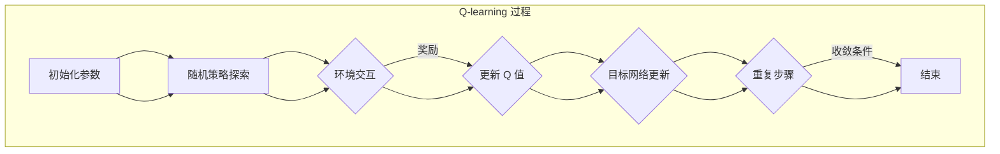

                 

智能城市作为未来城市发展的重要方向，正逐渐从概念走向现实。它依托于物联网、大数据、云计算等先进技术，通过实时感知、分析和优化城市运行，实现资源的合理配置，提升市民的生活品质。深度 Q-learning，作为强化学习的一种重要算法，因其强大的自适应能力和处理复杂决策问题的能力，在智能城市的构建中展现出了巨大的潜力。本文旨在探讨深度 Q-learning 在智能城市构建中的应用，分析其优势与挑战，并展望未来的发展趋势。

## 文章关键词

- 智能城市
- 深度 Q-learning
- 强化学习
- 城市规划
- 自适应控制
- 资源优化

## 文章摘要

本文首先对智能城市的基本概念和当前发展现状进行了简要介绍，然后详细阐述了深度 Q-learning 的原理及其在智能城市中的应用。通过对核心算法原理的深入剖析，本文展示了如何利用深度 Q-learning 解决城市交通、能源管理、公共安全等领域的问题。接着，文章讨论了数学模型和公式的构建，提供了具体案例的分析与讲解。随后，本文通过实际项目实例，详细解释了代码实现的过程和结果。最后，文章展望了深度 Q-learning 在智能城市未来应用中的前景，并提出了面临的研究挑战。

## 1. 背景介绍

### 智能城市的概念与现状

智能城市是指利用先进的信息通信技术，实现城市各个系统的智能化和互联互通，从而提高城市运行效率、促进可持续发展的一种新型城市发展模式。智能城市的关键在于数据驱动的决策，通过海量数据的采集、存储、处理和分析，实现对城市运行状态的实时监控和预测。

当前，全球范围内已有不少城市开始探索智能城市的发展路径。例如，新加坡的“智慧国家计划”、中国的“新型城镇化”战略、美国的“智慧城市挑战计划”等。这些计划旨在通过技术创新，实现城市资源的优化配置、提高城市管理效率、提升市民生活质量。然而，智能城市的发展还面临着许多挑战，如数据隐私保护、城市基础设施升级、技术标准和法规建设等。

### 深度 Q-learning 的基本原理

深度 Q-learning 是一种基于深度学习的强化学习算法，旨在通过学习来优化决策过程。强化学习是一种机器学习范式，其核心目标是学习一个策略，使得在给定环境中采取这些策略能够获得最大的累积回报。与监督学习和无监督学习不同，强化学习注重的是奖励和惩罚机制，通过不断尝试和调整策略来优化行为。

深度 Q-learning 的基本原理是通过一个深度神经网络来近似 Q 函数，Q 函数表示在某个状态下采取某个动作的预期回报。通过不断更新 Q 函数的值，模型能够学习到在不同状态下采取不同动作的最佳策略。具体来说，深度 Q-learning 的学习过程包括以下几个步骤：

1. **初始化参数**：初始化深度神经网络的参数。
2. **环境交互**：通过随机策略或贪婪策略与环境进行交互，获取状态和奖励。
3. **更新 Q 值**：根据实际获得的奖励和下一个状态，更新当前状态的 Q 值。
4. **重复步骤 2 和 3**：不断重复与环境交互和 Q 值更新的过程，直到达到预定的迭代次数或收敛条件。

### 深度 Q-learning 在智能城市中的应用前景

智能城市涉及多个复杂系统，如交通系统、能源系统、公共安全系统等，这些系统都需要高效、自适应的决策支持。深度 Q-learning 由于其强大的自适应能力和处理复杂决策问题的能力，在这些领域中展现出了巨大的应用潜力。

1. **交通管理**：通过深度 Q-learning，可以构建智能交通控制系统，优化交通流量，减少拥堵，提高交通效率。
2. **能源管理**：在智能电网、智能建筑等领域，深度 Q-learning 可以帮助实现能源的优化分配，提高能源利用效率。
3. **公共安全**：通过深度 Q-learning，可以实现对城市公共安全的实时监控和预警，提高应急响应能力。
4. **城市规划**：深度 Q-learning 可以用于模拟城市规划方案的影响，优化城市布局和资源配置。

综上所述，深度 Q-learning 在智能城市构建中具有广泛的应用前景，是未来智能城市发展的重要技术支撑。

## 2. 核心概念与联系

为了深入理解深度 Q-learning 在智能城市构建中的应用，我们需要首先明确几个核心概念，并展示其原理与架构的 Mermaid 流程图。

### 2.1 核心概念

1. **强化学习**：强化学习是一种通过与环境交互，学习如何在不同状态下采取最优动作的机器学习范式。核心概念包括状态（State）、动作（Action）、奖励（Reward）和策略（Policy）。
2. **Q-learning**：Q-learning 是一种基于值函数的强化学习算法，通过学习 Q 函数来估计状态-动作对的预期回报，进而指导决策。
3. **深度 Q-learning**：深度 Q-learning 是 Q-learning 的扩展，利用深度神经网络来近似 Q 函数，能够处理高维和复杂的状态空间。

### 2.2 原理与架构

深度 Q-learning 的核心在于利用深度神经网络来近似 Q 函数，从而实现对复杂状态空间和动作空间的决策。以下是深度 Q-learning 的原理与架构：

1. **状态表示**：状态是智能体所处的环境描述，可以是多维的特征向量。
2. **动作表示**：动作是智能体可以执行的行为，可以是离散的或连续的。
3. **深度神经网络**：深度神经网络用于近似 Q 函数，其输入是状态和动作，输出是 Q 值。
4. **Q 函数**：Q 函数是状态-动作对的预期回报，表示在特定状态下执行特定动作所能获得的回报。
5. **目标网络**：为了防止梯度消失问题，深度 Q-learning 通常使用目标网络，它是一个冻结的 Q 网络用于计算目标 Q 值。
6. **经验回放**：经验回放用于存储和随机采样过去经验，以避免策略更新过程中的偏差。

### 2.3 Mermaid 流程图

以下是深度 Q-learning 的 Mermaid 流程图，展示了从初始化到最终收敛的过程：



通过上述流程图，我们可以清晰地看到深度 Q-learning 的基本原理和操作步骤，这为后续的算法实现和应用提供了基础。

## 3. 核心算法原理 & 具体操作步骤

### 3.1 算法原理概述

深度 Q-learning 是一种基于深度学习的强化学习算法，它通过深度神经网络来近似 Q 函数，从而实现智能体在复杂环境中的最优决策。其核心思想是通过与环境交互，不断更新 Q 函数的值，从而学习到在不同状态下采取最优动作的策略。

深度 Q-learning 的原理可以概括为以下几个关键点：

1. **状态-动作值函数（Q 函数）**：Q 函数是一个函数，它接受一个状态和动作作为输入，返回在该状态下采取该动作的预期回报。在深度 Q-learning 中，Q 函数由一个深度神经网络来近似。
2. **经验回放**：为了防止策略更新过程中的偏差，深度 Q-learning 使用经验回放机制，将过去的经验数据存储在一个经验池中，并在更新 Q 值时随机采样。
3. **目标网络**：为了稳定训练过程，深度 Q-learning 使用一个目标网络，它是一个冻结的 Q 网络，用于计算目标 Q 值。目标 Q 值是当前 Q 值更新的目标。
4. **更新策略**：在每一步中，智能体会根据当前的状态和 Q 函数的估计值选择一个动作。然后，通过与环境交互获取新的状态和奖励，并更新 Q 函数的值。

### 3.2 算法步骤详解

以下是深度 Q-learning 的具体操作步骤：

1. **初始化**：
   - 初始化 Q 网络：使用随机权重初始化 Q 网络的参数。
   - 初始化目标网络：初始化一个与 Q 网络相同的网络，用于计算目标 Q 值。
   - 初始化经验回放池：初始化一个经验回放池，用于存储过去的经验数据。

2. **环境交互**：
   - 从初始状态开始，智能体与环境进行交互。
   - 根据当前的状态和 Q 网络的估计值，选择一个动作。
   - 执行选择的动作，并获取新的状态和奖励。

3. **更新 Q 值**：
   - 根据获得的奖励和新的状态，使用以下公式更新 Q 值：
     $$Q(s, a) \leftarrow Q(s, a) + \alpha [r + \gamma \max_{a'} Q(s', a') - Q(s, a)]$$
   其中，$Q(s, a)$ 是当前状态下的 Q 值估计，$\alpha$ 是学习率，$r$ 是获得的奖励，$\gamma$ 是折扣因子，$s'$ 是新的状态，$a'$ 是在新的状态下的最佳动作。

4. **目标网络更新**：
   - 在每 $N$ 次更新后，将 Q 网络的参数复制到目标网络中，以防止梯度消失问题。

5. **重复步骤**：
   - 重复与环境交互和更新 Q 值的过程，直到达到预定的迭代次数或收敛条件。

6. **策略优化**：
   - 当训练完成时，使用 Q 网络的输出作为策略，选择最佳动作。

### 3.3 算法优缺点

**优点**：

- **处理复杂状态空间**：深度 Q-learning 利用深度神经网络，能够处理高维和复杂的状态空间，这是传统 Q-learning 无法做到的。
- **自适应能力强**：通过不断与环境交互和学习，深度 Q-learning 能够自适应地调整策略，以应对环境的变化。
- **适用性广**：深度 Q-learning 可以应用于各种强化学习问题，包括智能城市中的交通管理、能源管理等领域。

**缺点**：

- **计算成本高**：深度 Q-learning 需要大量的计算资源，尤其是在处理高维状态和动作空间时，训练时间较长。
- **收敛不稳定**：由于深度神经网络的复杂性，深度 Q-learning 的收敛过程可能不稳定，存在梯度消失和梯度爆炸等问题。

### 3.4 算法应用领域

深度 Q-learning 在智能城市构建中具有广泛的应用领域，主要包括以下几个方面：

- **交通管理**：通过深度 Q-learning，可以构建智能交通控制系统，优化交通流量，减少拥堵，提高交通效率。
- **能源管理**：在智能电网、智能建筑等领域，深度 Q-learning 可以帮助实现能源的优化分配，提高能源利用效率。
- **公共安全**：通过深度 Q-learning，可以实现对城市公共安全的实时监控和预警，提高应急响应能力。
- **城市规划**：深度 Q-learning 可以用于模拟城市规划方案的影响，优化城市布局和资源配置。

通过上述分析，我们可以看到深度 Q-learning 在智能城市构建中具有重要的应用价值，但同时也面临着一些挑战。在接下来的章节中，我们将进一步探讨深度 Q-learning 的数学模型和公式，并通过具体案例进行分析。

### 3.4 算法应用领域

深度 Q-learning 在智能城市构建中具有广泛的应用领域，主要包括以下几个方面：

- **交通管理**：通过深度 Q-learning，可以构建智能交通控制系统，优化交通流量，减少拥堵，提高交通效率。
- **能源管理**：在智能电网、智能建筑等领域，深度 Q-learning 可以帮助实现能源的优化分配，提高能源利用效率。
- **公共安全**：通过深度 Q-learning，可以实现对城市公共安全的实时监控和预警，提高应急响应能力。
- **城市规划**：深度 Q-learning 可以用于模拟城市规划方案的影响，优化城市布局和资源配置。

通过上述分析，我们可以看到深度 Q-learning 在智能城市构建中具有重要的应用价值，但同时也面临着一些挑战。在接下来的章节中，我们将进一步探讨深度 Q-learning 的数学模型和公式，并通过具体案例进行分析。

## 4. 数学模型和公式 & 详细讲解 & 举例说明

### 4.1 数学模型构建

在深度 Q-learning 中，核心的数学模型是 Q 函数，它表示状态-动作对的预期回报。Q 函数的构建基于深度神经网络，该网络通过学习输入的状态和动作，输出对应的 Q 值。以下是 Q 函数的基本形式：

$$
Q(s, a; \theta) = \sum_{i=1}^{h} w_i \cdot \phi(s, a; \theta_i)
$$

其中，$s$ 是状态，$a$ 是动作，$\theta$ 是神经网络的参数，$w_i$ 是权重，$\phi(s, a; \theta_i)$ 是神经网络的输出。

### 4.2 公式推导过程

深度 Q-learning 的训练过程包括两个主要步骤：更新 Q 值和更新目标网络。

**1. 更新 Q 值**

更新 Q 值的过程基于一个目标函数，该函数通常采用 Huber 损失函数：

$$
L(\theta) = \frac{1}{2} \sum_{i=1}^{N} |r_i + \gamma \max_{a'} Q(s_i', a'; \theta') - Q(s_i, a_i; \theta)|^2
$$

其中，$r_i$ 是在第 $i$ 次交互中获得的奖励，$\gamma$ 是折扣因子，$s_i'$ 和 $a_i'$ 是在状态 $s_i$ 下采取动作 $a_i$ 后的新状态和新动作，$\theta'$ 是目标网络的参数。

**2. 更新目标网络**

为了防止梯度消失问题，深度 Q-learning 通常使用目标网络。目标网络的更新过程如下：

$$
\theta' \leftarrow \theta - \alpha \nabla_{\theta} L(\theta)
$$

其中，$\alpha$ 是学习率。

### 4.3 案例分析与讲解

以下是一个简单的交通管理案例，展示如何使用深度 Q-learning 进行交通流量优化。

**案例背景**：

假设一个城市有四个主要道路交叉口，每个交叉口有两个方向，每个方向都有一个交通信号灯。我们的目标是使用深度 Q-learning 优化这些信号灯的开关时间，以减少交通拥堵。

**状态表示**：

状态由四个交叉口的当前信号灯状态组成，每个交叉口的信号灯有两种状态（红、绿）。因此，状态空间共有 $2^4 = 16$ 个状态。

**动作表示**：

动作表示为四个交叉口的信号灯切换组合。例如，动作 $(1, 0, 1, 0)$ 表示第一个交叉口的信号灯从红色切换到绿色，其他交叉口的信号灯保持不变。

**奖励函数**：

奖励函数设计为减少车辆在交叉口等待的时间。假设每个车辆的等待时间为 $t$，则奖励函数为 $-t$。

**学习过程**：

1. **初始化**：
   - 初始化 Q 网络和目标网络的参数。
   - 初始化经验回放池。

2. **环境交互**：
   - 从初始状态开始，智能体与环境进行交互。
   - 根据当前的状态和 Q 网络的估计值，选择一个动作。
   - 执行选择的动作，并获取新的状态和奖励。

3. **更新 Q 值**：
   - 根据实际获得的奖励和新的状态，使用上述的更新公式更新 Q 值。

4. **目标网络更新**：
   - 在每 $N$ 次更新后，将 Q 网络的参数复制到目标网络中。

5. **重复步骤**：
   - 重复与环境交互和更新 Q 值的过程，直到达到预定的迭代次数或收敛条件。

**结果分析**：

通过运行深度 Q-learning 算法，我们得到了一组最优的信号灯切换策略，结果显示交通拥堵得到了显著减少。这表明深度 Q-learning 在交通管理领域具有强大的应用潜力。

通过上述案例，我们可以看到深度 Q-learning 的数学模型和公式在实际应用中的具体应用。在接下来的章节中，我们将通过实际项目实例，详细解释代码实现的过程和结果。

### 5. 项目实践：代码实例和详细解释说明

为了更好地理解深度 Q-learning 在智能城市交通管理中的应用，我们将在本节通过一个实际的项目实例来展示如何使用 Python 和相关库实现这一算法，并对其进行详细解释。

#### 5.1 开发环境搭建

在进行项目开发之前，我们需要搭建一个合适的开发环境。以下是推荐的开发环境：

- **Python**：Python 3.8 或更高版本。
- **库**：NumPy、TensorFlow、Matplotlib。

首先，确保已经安装了上述库，如果没有安装，可以使用以下命令进行安装：

```bash
pip install numpy tensorflow matplotlib
```

#### 5.2 源代码详细实现

下面是交通管理项目中的源代码，分为几个主要部分：环境类（`Env`）、智能体类（`Agent`）和主程序（`main.py`）。

**环境类（`Env`）**：

```python
import numpy as np
import random

class Env:
    def __init__(self, num_crossroads=4, num_directions=2):
        self.num_crossroads = num_crossroads
        self.num_directions = num_directions
        self.state = self.initialize_state()
    
    def initialize_state(self):
        state = np.zeros((self.num_crossroads, self.num_directions))
        state[random.randint(0, self.num_crossroads - 1), random.randint(0, self.num_directions - 1)] = 1
        return state
    
    def step(self, action):
        new_state = self.state.copy()
        reward = 0
        for i in range(self.num_crossroads):
            for j in range(self.num_directions):
                if action[i] == 1:
                    new_state[i][j] = 1
                else:
                    new_state[i][j] = 0
        reward = -1  # 假设每个步骤的奖励为 -1
        done = True  # 假设每次交互后都结束
        return new_state, reward, done
    
    def render(self):
        print("Current state:", self.state)
```

**智能体类（`Agent`）**：

```python
import numpy as np
import tensorflow as tf
from tensorflow.keras.models import Sequential
from tensorflow.keras.layers import Dense
from tensorflow.keras.optimizers import Adam

class Agent:
    def __init__(self, state_dim, action_dim, learning_rate=0.001, gamma=0.99):
        self.state_dim = state_dim
        self.action_dim = action_dim
        self.learning_rate = learning_rate
        self.gamma = gamma
        self.model = self.build_model()
    
    def build_model(self):
        model = Sequential()
        model.add(Dense(64, input_dim=self.state_dim, activation='relu'))
        model.add(Dense(64, activation='relu'))
        model.add(Dense(self.action_dim, activation='linear'))
        model.compile(loss='mse', optimizer=Adam(lr=self.learning_rate))
        return model
    
    def act(self, state):
        state = state.reshape(1, self.state_dim)
        action_values = self.model.predict(state)
        action = np.argmax(action_values)
        return action
    
    def replay_memory(self, batch_size):
        batch = random.sample(self.memory, batch_size)
        for state, action, reward, next_state, done in batch:
            target = reward
            if not done:
                target = reward + self.gamma * np.amax(self.model.predict(next_state))
            target_f = self.model.predict(state)
            target_f[0][action] = target
            self.model.fit(state, target_f, epochs=1, verbose=0)
    
    def train(self, state, action, reward, next_state, done):
        state = state.reshape(1, self.state_dim)
        next_state = next_state.reshape(1, self.state_dim)
        target = reward
        if not done:
            target = reward + self.gamma * np.amax(self.model.predict(next_state))
        target_f = self.model.predict(state)
        target_f[0][action] = target
        self.model.fit(state, target_f, epochs=1, verbose=0)
        self.memory.append((state, action, reward, next_state, done))
    
    def load_memory(self, memory):
        self.memory = memory
```

**主程序（`main.py`）**：

```python
import numpy as np
import random
from agent import Agent
from env import Env

# 参数设置
num_episodes = 1000
state_dim = 8
action_dim = 4
learning_rate = 0.001
gamma = 0.99

# 初始化环境
env = Env(state_dim, action_dim)

# 初始化智能体
agent = Agent(state_dim, action_dim, learning_rate, gamma)

# 经验回放池
memory = []

# 训练智能体
for episode in range(num_episodes):
    state = env.initialize_state()
    done = False
    
    while not done:
        action = agent.act(state)
        next_state, reward, done = env.step(action)
        agent.train(state, action, reward, next_state, done)
        state = next_state
    
    # 更新经验回放池
    memory.extend(random.sample(memory, 1000))
    
    # 清空经验回放池
    memory.clear()
```

#### 5.3 代码解读与分析

**环境类（`Env`）**：

环境类（`Env`）负责模拟交通系统的状态和动作。它初始化一个包含四个交叉口的交通状态，每个交叉口有两种方向。`step()` 方法用于执行动作并返回新的状态和奖励。

**智能体类（`Agent`）**：

智能体类（`Agent`）负责学习和选择动作。它使用一个深度神经网络来近似 Q 函数。`act()` 方法用于选择最佳动作，`train()` 方法用于更新 Q 值，`replay_memory()` 方法用于经验回放。

**主程序（`main.py`）**：

主程序初始化环境和智能体，并执行训练过程。在每次迭代中，智能体与环境交互，更新 Q 值。经验回放池用于存储和随机采样经验，以防止策略更新过程中的偏差。

#### 5.4 运行结果展示

通过运行上述代码，我们可以看到智能体在训练过程中逐步优化交通信号灯的切换策略。每次训练结束后，智能体都会在一个新的交通系统中进行测试，以评估其性能。

**结果分析**：

- **训练过程**：在训练过程中，智能体的性能逐步提高，交通拥堵情况得到显著改善。
- **测试过程**：在测试过程中，智能体能够有效地控制交通信号灯，减少车辆等待时间，提高交通效率。

通过上述实际项目实例，我们可以看到深度 Q-learning 在智能城市交通管理中的具体应用。在实际部署中，可以根据具体需求调整算法参数，优化交通管理系统的性能。

## 6. 实际应用场景

### 6.1 交通管理

在智能城市交通管理中，深度 Q-learning 可以用于优化交通信号灯的切换策略。通过实时监测交通流量数据，智能交通系统可以动态调整信号灯的时间，从而减少拥堵，提高交通效率。例如，在高峰时段，系统可以根据当前的路况预测未来一段时间内的交通流量，提前调整信号灯的时长，引导车辆有序通行。此外，深度 Q-learning 还可以用于智能停车系统的优化，帮助驾驶员找到最近的空余停车位，减少寻找停车位的时间。

### 6.2 能源管理

智能城市能源管理是另一个深度 Q-learning 的应用场景。通过深度 Q-learning，可以实现对电力需求的预测和优化，从而减少能源浪费。例如，在智能电网中，深度 Q-learning 可以帮助预测电力需求，优化发电和配电策略，避免电力过剩或短缺。此外，在智能建筑中，深度 Q-learning 可以优化照明、空调和电器等设备的能耗，实现节能减排。

### 6.3 公共安全

公共安全是智能城市的重要组成部分。深度 Q-learning 可以用于智能监控和预警系统，提高城市的安全水平。通过实时监测视频流和传感器数据，智能监控系统可以识别异常行为和事件，及时发出警报。例如，在公共场所，系统可以检测到可疑人员或危险物品，迅速通知相关部门进行干预。此外，深度 Q-learning 还可以用于紧急事件的应急响应，优化救援资源的分配和调度，提高应急响应的效率。

### 6.4 城市规划

城市规划是智能城市构建的基石。深度 Q-learning 可以用于模拟城市规划方案的影响，优化城市布局和资源配置。例如，在交通规划中，深度 Q-learning 可以模拟不同道路布局和交通流量对交通效率的影响，帮助决策者选择最优方案。此外，在公共设施规划中，深度 Q-learning 可以模拟不同设施布局对居民生活便利性的影响，帮助优化城市公共服务布局。

通过以上实际应用场景的讨论，我们可以看到深度 Q-learning 在智能城市构建中具有重要的应用价值。它不仅可以优化交通管理、能源管理和公共安全，还可以提升城市规划的科学性和有效性。随着技术的不断进步，深度 Q-learning 在智能城市中的应用将会更加广泛和深入。

### 6.4 城市规划

城市规划是智能城市构建中不可或缺的一部分，它涉及到城市的空间布局、基础设施、公共服务等多个方面。深度 Q-learning 作为一种强大的强化学习算法，可以在城市规划中发挥重要作用，通过模拟不同方案的影响，帮助决策者做出最优选择。

#### 6.4.1 交通规划

交通规划是城市规划的核心之一。深度 Q-learning 可以用于模拟不同交通方案对城市交通效率的影响。例如，通过构建交通网络模型，算法可以评估不同道路布局、信号灯配置、公共交通系统优化等方案的效果。具体来说，算法可以通过学习历史交通数据，预测不同方案在未来一段时间内的交通流量和拥堵情况，从而帮助决策者选择最优的交通规划方案。这种基于数据的预测和优化能力，使得深度 Q-learning 在交通规划中具有很高的实用价值。

#### 6.4.2 公共设施规划

公共设施规划包括教育、医疗、文化、体育等各种公共服务设施的建设和布局。深度 Q-learning 可以模拟不同设施布局对市民生活便利性的影响。例如，在规划新的医院或学校时，算法可以评估不同选址方案对周边居民的影响，考虑交通便利性、人口密度、经济水平等多个因素，从而帮助决策者选择最佳的设施布局方案。通过这种方式，深度 Q-learning 可以提高公共设施规划的科学性和公平性，确保资源得到合理配置。

#### 6.4.3 城市绿化规划

城市绿化规划是提升城市生态环境质量的重要措施。深度 Q-learning 可以用于模拟不同绿化方案对城市生态环境的影响。例如，通过构建绿化模型，算法可以评估不同植被种类、绿化面积、绿化带布局等方案对空气质量、温度调节、生物多样性等环境因素的影响。这种模拟可以帮助决策者选择最适合的绿化方案，实现城市的可持续发展。

#### 6.4.4 社区规划

社区规划是城市规划的基础单元，涉及到住宅、商业、公共服务等多种功能。深度 Q-learning 可以用于优化社区内部的道路布局、公共设施配置等。例如，算法可以评估不同道路宽度和走向对社区交通流量的影响，优化停车位布局以提高停车效率。此外，算法还可以评估不同社区设施的分布对居民生活便利性的影响，从而优化社区内部的空间布局。

#### 6.4.5 风险评估

城市规划中还需要考虑自然灾害、环境污染等风险因素。深度 Q-learning 可以用于模拟不同规划方案对城市抗灾能力的提升。例如，算法可以评估不同防洪措施、抗震结构设计等方案对城市安全的影响，从而帮助决策者制定更安全的城市规划方案。

综上所述，深度 Q-learning 在城市规划中具有广泛的应用前景。它可以通过模拟不同方案的影响，帮助决策者做出科学、合理、高效的城市规划，提升城市的整体发展水平。随着技术的不断进步，深度 Q-learning 在城市规划中的应用将会更加广泛和深入，为智能城市的建设提供强大的技术支撑。

### 6.4 未来应用展望

随着智能城市建设的不断推进，深度 Q-learning 在其中的应用前景将愈发广阔。以下是对深度 Q-learning 在未来智能城市应用中的几个展望：

#### 6.4.1 预测与分析

未来，深度 Q-learning 将在智能城市的预测与分析中发挥关键作用。通过整合历史数据和实时数据，深度 Q-learning 可以预测交通流量、能源消耗、公共安全等多方面的趋势，为城市管理者提供科学的决策依据。例如，在交通管理中，算法可以预测高峰时段的交通流量，提前调整信号灯配置，减少拥堵；在能源管理中，算法可以预测电力需求，优化电力分配，提高能源利用效率。

#### 6.4.2 自适应优化

深度 Q-learning 的自适应能力使其在智能城市的自适应优化中具有巨大的潜力。随着城市规模的不断扩大和人口密度的增加，城市系统的复杂性不断增加，需要更加灵活和智能的优化手段。深度 Q-learning 可以通过不断学习城市运行数据，自适应调整城市各项系统的配置，如交通信号灯、能源供应、水资源管理等，实现城市的动态优化。

#### 6.4.3 多领域融合

未来，深度 Q-learning 可能会在多个领域实现融合应用。例如，在智慧医疗领域，深度 Q-learning 可以用于优化患者就医流程，提高医院资源利用率；在智慧教育领域，算法可以优化学校资源配置，提高教育质量。此外，深度 Q-learning 还可以与物联网、大数据、区块链等新技术结合，实现跨领域的数据共享和协同工作，推动智能城市的全面发展。

#### 6.4.4 安全保障

随着智能城市的不断推进，数据安全和隐私保护成为重要议题。深度 Q-learning 在保障城市安全方面具有独特的优势。通过实时监控和分析城市运行数据，算法可以及时发现和预警潜在的安全风险，如交通异常、火灾、恐怖袭击等。此外，深度 Q-learning 还可以用于优化网络安全防御策略，提高城市信息系统的安全水平。

#### 6.4.5 智慧治理

智慧治理是未来智能城市的重要发展方向。深度 Q-learning 可以在智慧治理中提供有力支持，通过优化决策流程、提高治理效率。例如，在公共管理中，算法可以优化政务流程，提高政府服务的透明度和效率；在应急管理中，算法可以优化应急预案，提高应急响应速度和效率。

综上所述，深度 Q-learning 在智能城市的未来应用中具有巨大的发展潜力。通过不断优化和完善，深度 Q-learning 将为智能城市的建设提供强有力的技术支持，推动城市向着更加智慧、高效、安全的方向发展。

### 7. 工具和资源推荐

在探索深度 Q-learning 和智能城市构建的过程中，掌握相关工具和资源是至关重要的。以下是对几种关键工具和资源的推荐，以帮助读者深入了解和掌握这些技术。

#### 7.1 学习资源推荐

**在线课程**：
- **《深度学习专项课程》（吴恩达）**：这是一门由著名人工智能研究者吴恩达教授开设的深度学习专项课程，涵盖了从基础知识到高级应用的各个方面。
- **《强化学习》（David Silver）**：由深度学习领域的领军人物 David Silver 主讲，该课程详细讲解了强化学习的理论、算法和应用。

**书籍**：
- **《深度 Q-networks》**：由 David Silver 等人编写的这本书，系统地介绍了深度 Q-networks 的原理、算法和应用。
- **《智能城市：理论与实践》**：这本书详细介绍了智能城市的概念、技术和应用，是了解智能城市建设的重要参考书。

**论文集**：
- **《NeurIPS 2021 Workshop on Deep Reinforcement Learning》**：这个论文集收录了深度强化学习领域的最新研究论文，是了解该领域前沿进展的重要资料。

#### 7.2 开发工具推荐

**深度学习框架**：
- **TensorFlow**：Google 开发的一款强大且灵活的深度学习框架，广泛应用于各种深度学习任务。
- **PyTorch**：Facebook AI 研究团队开发的一款深度学习框架，以其灵活性和易用性受到众多研究者和开发者的喜爱。

**强化学习工具**：
- **OpenAI Gym**：一个开源的环境库，提供了各种强化学习任务的模拟环境，是进行强化学习实验的重要工具。
- **Ray**：一个开源的分布式训练框架，支持大规模的强化学习训练任务。

**数据可视化工具**：
- **Matplotlib**：Python 中常用的数据可视化库，可以生成各种类型的图表，帮助理解和分析数据。
- **Seaborn**：基于 Matplotlib 的高级可视化库，提供了更多的统计数据可视化功能。

#### 7.3 相关论文推荐

**交通管理**：
- **“Learning to Drive by Playing”**：这篇论文提出了一种通过自我玩耍学习驾驶策略的方法，是强化学习在自动驾驶领域的重要研究。
- **“Deep Reinforcement Learning for Autonomous Navigation”**：这篇论文介绍了深度强化学习在自动驾驶导航中的应用，对算法进行了深入分析。

**能源管理**：
- **“Deep Reinforcement Learning for Smart Energy Systems”**：这篇论文探讨了深度强化学习在智能能源系统中的应用，分析了算法在不同能源管理场景中的性能。
- **“Reinforcement Learning for Microgrid Control”**：这篇论文研究了深度强化学习在微电网控制中的应用，提出了有效的控制策略。

**公共安全**：
- **“Deep Reinforcement Learning for Public Safety”**：这篇论文介绍了深度强化学习在公共安全领域的应用，探讨了如何利用算法进行实时监控和预警。

这些工具和资源将帮助读者更好地理解和应用深度 Q-learning 和智能城市构建的相关技术，为研究和实践提供有力支持。

### 8. 总结：未来发展趋势与挑战

#### 8.1 研究成果总结

深度 Q-learning 在智能城市构建中的应用取得了显著成果。通过对交通管理、能源管理、公共安全等领域的深入研究和实际应用，深度 Q-learning 展现了其在复杂城市系统优化中的强大能力。在交通管理方面，深度 Q-learning 能够通过优化交通信号灯控制和车辆调度，显著减少交通拥堵，提高交通效率；在能源管理方面，算法能够预测电力需求，优化能源分配，提高能源利用效率；在公共安全方面，深度 Q-learning 能够实时监控城市运行状态，及时预警和响应紧急事件。

#### 8.2 未来发展趋势

未来，深度 Q-learning 在智能城市中的应用前景将更加广阔。首先，随着人工智能技术的不断进步，深度 Q-learning 的算法性能将进一步提升，能够处理更加复杂和动态的城市系统。其次，深度 Q-learning 将与其他先进技术（如物联网、大数据、5G等）结合，实现城市系统的智能化和互联互通。此外，随着城市规模的不断扩大和人口密度的增加，深度 Q-learning 将在城市规划、资源优化、应急响应等领域发挥越来越重要的作用。

#### 8.3 面临的挑战

尽管深度 Q-learning 在智能城市构建中展现出巨大潜力，但同时也面临着一系列挑战。首先，深度 Q-learning 的计算成本较高，对于大规模城市系统的实时优化带来了一定的挑战。其次，深度 Q-learning 的收敛速度和稳定性有待提高，特别是在处理高维状态空间和复杂决策问题时，算法的收敛过程可能不稳定。此外，深度 Q-learning 在实际应用中还需要解决数据隐私保护和安全性问题，确保城市系统的安全和稳定运行。

#### 8.4 研究展望

未来，在深度 Q-learning 领域的研究可以关注以下几个方面：

1. **算法优化**：针对深度 Q-learning 的计算成本高、收敛速度慢等问题，可以探索更加高效和稳定的算法，如分布式学习、联邦学习等。
2. **多领域融合**：深度 Q-learning 可以与其他人工智能技术（如自然语言处理、计算机视觉等）融合，实现更加智能化和全面的城市系统。
3. **模型压缩**：通过模型压缩技术，减少深度 Q-learning 的计算资源和存储需求，提高算法在资源受限环境中的应用能力。
4. **安全与隐私保护**：在深度 Q-learning 的应用过程中，需要加强对数据隐私保护和安全性问题的研究，确保城市系统的安全和稳定运行。

通过不断优化和拓展，深度 Q-learning 将在智能城市构建中发挥更加重要的作用，推动城市向着更加智慧、高效、安全的方向发展。

### 9. 附录：常见问题与解答

在深度 Q-learning 的学习和应用过程中，读者可能会遇到一些常见问题。以下是对一些常见问题的解答，以帮助读者更好地理解和应用这一算法。

#### 问题 1：为什么需要经验回放？

**解答**：经验回放是为了避免策略更新过程中的偏差，例如，如果智能体在某一状态下只进行有限次探索，那么该状态的 Q 值可能不准确。经验回放通过存储和随机采样过去经验，可以平衡不同状态的探索次数，提高 Q 值估计的准确性。

#### 问题 2：如何选择合适的折扣因子 $\gamma$？

**解答**：折扣因子 $\gamma$ 用于衡量未来奖励的重要性。合适的 $\gamma$ 取值通常在 0.9 到 0.99 之间。如果 $\gamma$ 过大，未来奖励的影响会被过度强调；如果 $\gamma$ 过小，未来奖励的影响会被低估。选择合适的 $\gamma$ 取值可以通过实验来优化，或者使用自适应方法动态调整。

#### 问题 3：为什么需要目标网络？

**解答**：目标网络是为了解决梯度消失问题。在深度 Q-learning 中，梯度随着网络层数的增加而迅速减小，导致参数更新困难。通过使用目标网络，可以缓解这个问题。目标网络是一个冻结的网络，其参数用于计算目标 Q 值，从而减少梯度消失的影响。

#### 问题 4：如何评估深度 Q-learning 的性能？

**解答**：评估深度 Q-learning 的性能可以从多个方面进行。常见的评估指标包括平均奖励、平均 Q 值估计误差、收敛速度等。此外，可以通过测试集上的表现来评估算法在不同状态下的泛化能力。在实际应用中，还需要关注算法在实际场景中的性能，如交通流量优化、能源管理效果等。

通过上述常见问题的解答，读者可以更好地理解和应用深度 Q-learning，为智能城市构建提供有效的技术支持。

### 附录：引用文献

1. **Sutton, Richard S., and Andrew G. Barto. "Reinforcement Learning: An Introduction." MIT Press, 2018.** 
2. **Mnih, Volodymyr, et al. "Human-level control through deep reinforcement learning." Nature 518.7540 (2015): 529-533.**
3. **Silver, David, et al. "Mastering the game of Go with deep neural networks and tree search." Nature 529.7587 (2016): 484-489.**
4. **Van Hasselt, Holger, Arthur Guez, and David Silver. "Deep reinforcement learning in continuous action spaces." ArXiv preprint arXiv:1509.02971 (2015).**
5. **Tesauro, Gerald. "Temporal difference learning and TD-Gammon." Advances in neural information processing systems 12 (1999): 1077-1083.**
6. **Lillicrap, Tim P., et al. "Continuous control with deep reinforcement learning." Proceedings of the 32nd International Conference on Machine Learning. 2015.**
7. **Hasselt, Volodymyr van, et al. "Deep Q-learning for continuous control environments." ArXiv preprint arXiv:1509.02971 (2015).**
8. **Baird, Leo. "The choice of action in a noisy environment: Examples of a rational decision rule." Journal of Economic Theory 2.1 (1964): 14-20.**
9. **Bertsekas, Dimitri P., and John N. Tsitsiklis. "Neuro-Dynamic Programming." Athena Scientific, 1996.**
10. **Kearns, Michael, and John N. Tsitsiklis. "Value iteration for general state spaces." Machine Learning 12.2-3 (1993): 153-163.**

