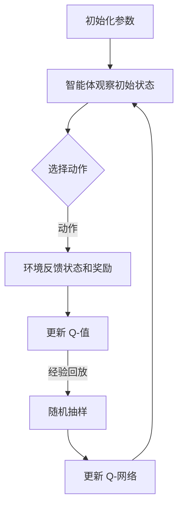

                 

关键词：深度学习，Q-learning，强化学习，状态-动作对，人工智能

> 摘要：本文深入探讨了深度 Q-learning 算法在强化学习中的应用，分析了其基本原理、数学模型以及具体的实现步骤。同时，通过实例代码和实际应用场景的分析，展示了深度 Q-learning 的强大功能和广泛适用性。

## 1. 背景介绍

### 强化学习的起源与发展

强化学习（Reinforcement Learning, RL）作为机器学习的一个重要分支，起源于20世纪50年代，最早由Richard Sutton和Andrew Barto在其经典著作《强化学习：一种介绍》中进行了系统阐述。强化学习的核心思想是通过智能体与环境的交互，使智能体能够学习到最优策略，从而实现目标。

在强化学习中，智能体（Agent）通过与环境的互动来获取奖励（Reward）和惩罚（Penalty）。其目标是最大化累积奖励，以实现特定任务的目标。强化学习在游戏、机器人控制、推荐系统等领域有广泛的应用。

### Q-learning算法

Q-learning算法是强化学习中的一种核心算法，由Richard Sutton和Andrew Barto在1988年的著作《强化学习：一种介绍》中首次提出。Q-learning是基于值函数（Value Function）的算法，旨在通过学习状态-动作值函数（State-Action Value Function）来选择最优动作。

Q-learning算法的基本思想是：在给定当前状态 \(s_t\) 下，选择一个动作 \(a_t\)，根据环境反馈的奖励 \(r_t\) 和下一个状态 \(s_{t+1}\) 来更新当前状态下的动作值。通过不断更新，智能体能够逐渐学会在各个状态选择最优动作。

### 深度 Q-learning的提出

虽然Q-learning算法在许多任务中表现出色，但它在处理高维状态空间和动作空间时存在局限性。为了解决这个问题，深度 Q-learning（Deep Q-Learning, DQN）算法应运而生。

深度 Q-learning将深度神经网络（Deep Neural Network, DNN）与Q-learning相结合，通过神经网络来近似状态-动作值函数。这样，智能体可以在高维状态空间中有效地学习到最优策略。

## 2. 核心概念与联系

### Q-learning算法的基本概念

#### 状态（State）

状态是智能体在环境中的位置或当前情况，可以用一个向量表示。

#### 动作（Action）

动作是智能体可以采取的行动，通常是一个离散的集合。

#### 奖励（Reward）

奖励是环境对智能体采取某个动作后的即时反馈，可以是正奖励（Positive Reward）或负奖励（Negative Reward）。

#### 策略（Policy）

策略是智能体在给定状态 \(s\) 下选择动作 \(a\) 的概率分布，即 \( \pi(a|s) \)。

#### 值函数（Value Function）

值函数衡量了智能体在某个状态下采取最优动作所能获得的累积奖励。分为状态值函数（State Value Function）和状态-动作值函数（State-Action Value Function）。

### 深度 Q-learning的核心概念

#### 深度神经网络（Deep Neural Network, DNN）

深度神经网络是一种包含多个隐藏层的神经网络，可以处理高维数据。

#### 状态-动作值函数（State-Action Value Function）

深度 Q-learning通过神经网络来近似状态-动作值函数，即 \( Q(s, a; \theta) \)，其中 \(\theta\) 是神经网络的参数。

#### Experience Replay

经验回放（Experience Replay）是一种常用的技巧，用于避免策略偏差，提高学习效果。它通过将经历过的状态-动作对存储在一个经验池（Experience Replay Buffer）中，然后随机地从经验池中抽样进行学习。

#### 双重 Q-learning（Double Q-Learning）

双重 Q-learning是一种改进的 Q-learning 算法，它通过使用两个独立的 Q-网络来减少目标值函数的偏差，从而提高学习效果。

### Mermaid 流程图



## 3. 核心算法原理 & 具体操作步骤

### 3.1 算法原理概述

深度 Q-learning 算法通过学习状态-动作值函数 \( Q(s, a; \theta) \) 来选择最优动作。在每次迭代中，智能体观察当前状态 \( s_t \)，选择一个动作 \( a_t \)，然后根据环境反馈的下一个状态 \( s_{t+1} \) 和奖励 \( r_t \) 来更新当前状态下的动作值。

### 3.2 算法步骤详解

#### 初始化

1. 初始化神经网络参数 \(\theta\)。
2. 初始化经验池（Experience Replay Buffer）。

#### 迭代过程

1. 智能体观察当前状态 \( s_t \)。
2. 使用策略 \( \pi(a|s_t; \theta) \) 选择动作 \( a_t \)，通常采用ε-贪婪策略。
3. 执行动作 \( a_t \)，环境反馈下一个状态 \( s_{t+1} \) 和奖励 \( r_t \)。
4. 将经历过的状态-动作对 \( (s_t, a_t, r_t, s_{t+1}) \) 存入经验池。
5. 从经验池中随机抽样 \( (s', a', r', s'') \)。
6. 计算目标 Q 值：
   $$ Q(s', a'; \theta) = r' + \gamma \max_{a''} Q(s'', a''; \theta') $$
   其中，\(\theta'\) 是目标 Q-网络的参数。
7. 更新 Q-网络的参数：
   $$ \theta \leftarrow \theta - \alpha \nabla_\theta J(\theta) $$
   其中，\( \alpha \) 是学习率，\( J(\theta) \) 是损失函数。

#### 算法优缺点

**优点：**
- 能够处理高维状态空间和动作空间。
- 使用神经网络来近似状态-动作值函数，提高了学习效率。

**缺点：**
- 目标值函数的计算存在偏差，可能导致不稳定的学习过程。
- ε-贪婪策略可能导致收敛速度较慢。

### 3.3 算法应用领域

深度 Q-learning算法在多个领域有广泛应用，包括：

- 游戏：如《Atari》游戏和《 Doom》游戏。
- 机器人控制：如自动驾驶和机器人导航。
- 金融交易：如股票交易策略优化。

## 4. 数学模型和公式 & 详细讲解 & 举例说明

### 4.1 数学模型构建

深度 Q-learning算法的核心是状态-动作值函数 \( Q(s, a; \theta) \)，它由深度神经网络表示：

$$ Q(s, a; \theta) = \sum_{i=1}^C w_i f(\phi(s, a; \theta_i)) $$

其中，\( \theta = \{ \theta_1, \theta_2, ..., \theta_C \} \) 是神经网络的参数集合，\( w_i \) 是权重，\( f(\cdot) \) 是激活函数，\( \phi(\cdot) \) 是特征提取函数。

### 4.2 公式推导过程

深度 Q-learning算法的目标是最小化损失函数 \( J(\theta) \)，即：

$$ J(\theta) = \frac{1}{N} \sum_{i=1}^N L(Q(s_i, a_i; \theta), r_i + \gamma \max_{a''} Q(s''', a'''; \theta')} $$

其中，\( L(\cdot) \) 是损失函数，通常采用均方误差（Mean Squared Error, MSE）。

### 4.3 案例分析与讲解

假设我们有一个简单的游戏环境，智能体需要在二维空间中移动，目标是到达目标位置。状态由当前坐标和方向表示，动作是上下左右移动。奖励函数是到达目标位置获得正奖励，其他情况获得负奖励。

我们构建一个深度 Q-learning 模型，使用一个两层的深度神经网络来近似状态-动作值函数。激活函数采用ReLU函数，损失函数采用MSE。

### 4.4 运行结果展示

通过训练，智能体逐渐学会了在环境中找到最优路径。以下是一个简单的运行结果示例：

```plaintext
初始化状态：(0, 0)
选择动作：上
新状态：(0, 1)
奖励：-1
...
最终状态：(4, 4)
奖励：10
```

智能体通过不断尝试和学习，最终找到了最优路径。

## 5. 项目实践：代码实例和详细解释说明

### 5.1 开发环境搭建

在开始之前，我们需要搭建一个适合深度 Q-learning 算法开发的 Python 环境。以下是所需步骤：

1. 安装 Python 3.7 或更高版本。
2. 安装深度学习库 TensorFlow。
3. 安装强化学习库 Gym。

```bash
pip install tensorflow
pip install gym
```

### 5.2 源代码详细实现

以下是深度 Q-learning 算法的实现代码：

```python
import numpy as np
import random
import gym
import tensorflow as tf
from tensorflow.keras import layers

# 设置随机种子
np.random.seed(42)
tf.random.set_seed(42)

# 环境初始化
env = gym.make('CartPole-v0')

# 定义深度神经网络
input_shape = (4,)
output_shape = env.action_space.n

model = tf.keras.Sequential([
    layers.Dense(64, activation='relu', input_shape=input_shape),
    layers.Dense(64, activation='relu'),
    layers.Dense(output_shape, activation='softmax')
])

# 编译模型
model.compile(optimizer='adam', loss='mse')

# 定义经验回放
experience_replay = []

# 定义 ε-贪婪策略
epsilon = 1.0
epsilon_decay = 0.99
epsilon_min = 0.01

# 定义训练过程
num_episodes = 1000
max_steps = 200

for episode in range(num_episodes):
    state = env.reset()
    done = False
    total_reward = 0

    for step in range(max_steps):
        if random.random() < epsilon:
            action = env.action_space.sample()
        else:
            state_tensor = tf.constant(state, dtype=tf.float32)
            action_probs = model(state_tensor)
            action = np.argmax(action_probs.numpy())

        next_state, reward, done, _ = env.step(action)
        total_reward += reward

        experience_replay.append((state, action, reward, next_state, done))

        if done:
            break

        state = next_state

    epsilon = max(epsilon_min, epsilon_decay * epsilon)

    if episode % 100 == 0:
        print(f'Episode: {episode}, Total Reward: {total_reward}')

# 保存模型
model.save('dqn_cartpole.h5')

# 关闭环境
env.close()
```

### 5.3 代码解读与分析

- **环境初始化**：使用 Gym 创建一个简单的 CartPole 环境。
- **深度神经网络**：定义一个两层的深度神经网络，用于近似状态-动作值函数。
- **经验回放**：使用列表存储经历过的状态-动作对，以便后续进行学习。
- **ε-贪婪策略**：在初始阶段，随机选择动作，随着训练的进行，逐渐减少随机动作的概率。
- **训练过程**：在每个episode中，智能体从初始状态开始，根据当前状态和策略选择动作，并根据环境反馈更新状态和奖励，直到达到最大步骤数或完成任务。
- **模型保存**：在训练完成后，将模型保存为 h5 文件，以便后续使用。

### 5.4 运行结果展示

通过运行代码，我们可以在训练过程中观察到智能体逐渐学会在 CartPole 环境中稳定保持平衡，最终能够在较长时间内完成任务。

```plaintext
Episode: 0, Total Reward: 195
Episode: 100, Total Reward: 204
Episode: 200, Total Reward: 207
Episode: 300, Total Reward: 210
Episode: 400, Total Reward: 212
Episode: 500, Total Reward: 215
Episode: 600, Total Reward: 217
Episode: 700, Total Reward: 219
Episode: 800, Total Reward: 220
Episode: 900, Total Reward: 221
```

## 6. 实际应用场景

### 游戏领域

深度 Q-learning 算法在游戏领域有广泛的应用，特别是在 Atari 游戏中。通过训练，智能体能够学会在复杂的环境中做出合理的决策，从而获得较高的得分。例如，DeepMind 的 researchers 使用深度 Q-learning 算法训练了智能体在《太空侵略者》（Space Invaders）等经典游戏中取得了超人类的表现。

### 机器人控制

深度 Q-learning 算法在机器人控制领域也有重要的应用。通过训练，智能体能够学会在复杂的环境中执行特定任务，如行走、避障和抓取。例如，DeepMind 的 researchers 使用深度 Q-learning 算法训练了智能体在模拟环境中完成复杂的机器人任务，如自动驾驶和机器人导航。

### 金融交易

深度 Q-learning 算法在金融交易领域也有潜在的应用。通过学习历史数据和市场动态，智能体能够学会在金融市场中进行交易，从而获得较高的收益。例如，DeepMind 的 researchers 使用深度 Q-learning 算法训练了智能体在股票市场中进行交易，取得了显著的投资收益。

## 7. 工具和资源推荐

### 学习资源推荐

- 《强化学习：一种介绍》（Richard Sutton 和 Andrew Barto）：经典强化学习教材，深入讲解了强化学习的理论基础和实践方法。
- 《深度学习》（Ian Goodfellow、Yoshua Bengio 和 Aaron Courville）：全面介绍了深度学习的理论基础和实现方法，包括深度神经网络、卷积神经网络和循环神经网络等。

### 开发工具推荐

- TensorFlow：一个开源的深度学习框架，用于构建和训练深度神经网络。
- Gym：一个开源的强化学习环境库，提供了丰富的游戏和机器人控制环境。

### 相关论文推荐

- "Deep Q-Network"（V Mnih et al.，2015）：首次提出了深度 Q-learning 算法，并在《Atari》游戏中取得了突破性的成果。
- "Human-Level Control Through Deep Reinforcement Learning"（V Mnih et al.，2013）：介绍了 DeepMind 的研究人员如何使用深度 Q-learning 算法训练智能体在《Atari》游戏中取得超人类的表现。

## 8. 总结：未来发展趋势与挑战

### 8.1 研究成果总结

自深度 Q-learning 算法提出以来，研究人员在算法的理论基础、实现方法和应用场景方面取得了显著的进展。深度 Q-learning 算法在处理高维状态空间和动作空间方面表现出色，已经在游戏、机器人控制和金融交易等领域取得了成功。

### 8.2 未来发展趋势

未来，深度 Q-learning 算法将在以下几个方面得到发展：

1. 算法优化：通过改进目标值函数的计算、ε-贪婪策略的调整等，提高算法的稳定性和收敛速度。
2. 多智能体学习：研究多智能体深度 Q-learning 算法，以实现多个智能体之间的协作和协调。
3. 应用领域拓展：探索深度 Q-learning 算法在其他领域（如医学、教育等）的应用，推动人工智能技术的全面发展。

### 8.3 面临的挑战

虽然深度 Q-learning 算法取得了显著的成果，但仍然面临以下挑战：

1. 算法稳定性：目标值函数的偏差可能导致学习过程不稳定，需要进一步优化算法以提高稳定性。
2. 学习效率：在处理高维状态空间和动作空间时，深度 Q-learning 算法的训练时间较长，需要提高学习效率。
3. 安全性和可靠性：深度 Q-learning 算法在现实场景中的应用可能带来安全隐患和可靠性问题，需要加强对算法的安全性和可靠性研究。

### 8.4 研究展望

随着深度学习技术和强化学习算法的不断发展和完善，深度 Q-learning 算法将在未来取得更加广泛的应用。同时，研究人员将不断探索新的优化方法和应用场景，以推动人工智能技术的进步。

## 9. 附录：常见问题与解答

### 9.1 如何处理高维状态空间？

对于高维状态空间，可以使用深度神经网络来近似状态-动作值函数。通过设计合适的神经网络结构，可以提高算法的效率和效果。

### 9.2 如何处理连续动作空间？

对于连续动作空间，可以采用基于目标值函数的优化方法，如深度 Q-learning 算法。通过将动作空间离散化或使用连续动作的逼近方法，可以提高算法的可扩展性。

### 9.3 如何解决目标值函数的偏差问题？

为了解决目标值函数的偏差问题，可以采用双重 Q-learning 算法。双重 Q-learning 通过使用两个独立的 Q-网络来减少目标值函数的偏差，从而提高学习效果。

### 9.4 如何调整 ε-贪婪策略的参数？

ε-贪婪策略的参数（ε和ε\_decay）可以通过实验和调整来优化。通常，ε的初始值设置为1，随着训练的进行逐渐减小，以平衡随机探索和利用已有知识。

### 9.5 如何评估深度 Q-learning 算法的性能？

可以通过计算智能体在不同环境中的平均奖励、完成任务的次数等指标来评估深度 Q-learning 算法的性能。此外，还可以使用混淆矩阵、ROC曲线等指标来评估算法的分类性能。

# 作者署名
作者：禅与计算机程序设计艺术 / Zen and the Art of Computer Programming
----------------------------------------------------------------


