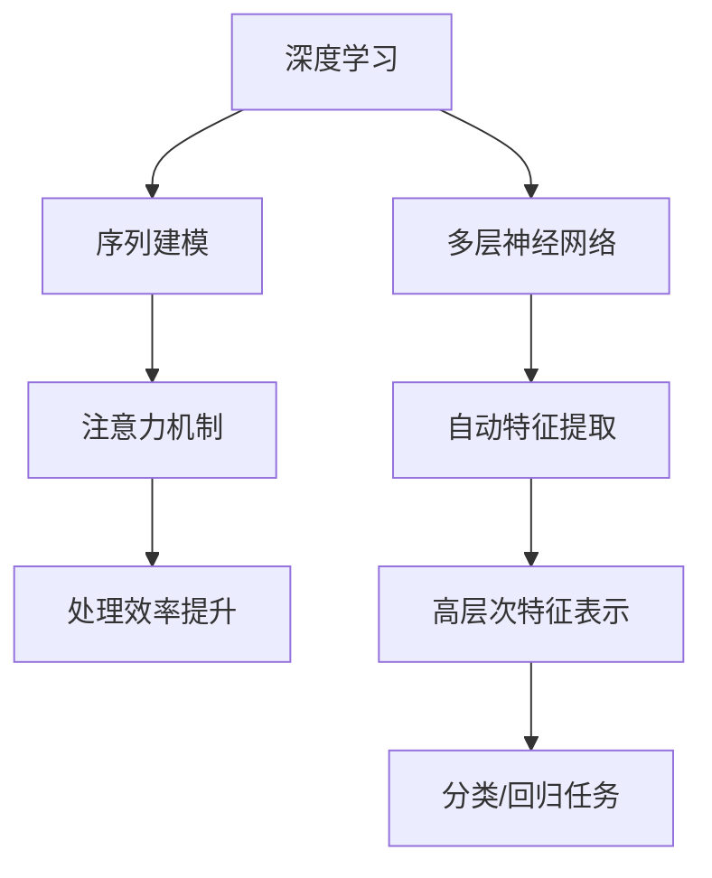

                 

关键词：深度学习、注意力模型、神经网络、计算机视觉、自然语言处理、应用场景、未来展望

> 摘要：本文将探讨深度学习与注意力模型在计算机视觉、自然语言处理等领域的应用，详细解析其核心概念、算法原理、数学模型，并通过实际项目实例展示其应用效果。同时，文章还将对未来的发展趋势与面临的挑战进行展望。

## 1. 背景介绍

深度学习作为人工智能的重要分支，以其强大的建模能力和卓越的性能表现，在图像识别、语音识别、自然语言处理等领域取得了显著的成果。而注意力模型作为深度学习中的重要组件，通过捕捉输入数据中的关键信息，提高了模型的学习效率和准确性。本文将围绕这两个主题，探讨其基本概念、原理及应用。

### 1.1 深度学习的基本概念

深度学习（Deep Learning）是一种基于多层神经网络的结构，能够通过学习大量数据自动提取特征并进行分类、回归等任务。其核心思想是多层神经网络通过逐层抽象，从原始数据中提取更高层次的特征表示。深度学习的主要优势在于其能够自动从大量数据中学习到复杂的特征，从而在多个领域取得了突破性的成果。

### 1.2 注意力模型的基本概念

注意力模型（Attention Model）是深度学习中的一个重要概念，旨在提高模型在处理序列数据时的表现。通过引入注意力机制，模型能够动态地关注输入数据中的关键部分，从而提高处理效率和质量。注意力机制的核心思想是通过学习一个权重函数，将输入序列中的不同元素分配不同的关注程度，从而在处理过程中只关注最重要的部分。

## 2. 核心概念与联系

在介绍深度学习与注意力模型的基本概念后，下面我们将使用Mermaid流程图来展示这两个核心概念之间的联系。



通过以上流程图，我们可以看到深度学习通过多层神经网络实现了自动特征提取，并在序列建模中引入了注意力机制，从而提高了处理效率和质量。

## 3. 核心算法原理 & 具体操作步骤

### 3.1 算法原理概述

在深度学习与注意力模型的结合中，一个经典的模型是Transformer模型。Transformer模型通过自注意力机制（Self-Attention）和多头注意力机制（Multi-Head Attention）实现了对序列数据的建模。

- 自注意力机制：自注意力机制通过计算序列中每个元素与其余元素之间的相似度，为每个元素分配不同的权重，从而实现了对输入序列的动态关注。
- 多头注意力机制：多头注意力机制通过将输入序列分解为多个子序列，并分别计算注意力权重，从而提高了模型的建模能力和泛化能力。

### 3.2 算法步骤详解

#### 3.2.1 自注意力机制

自注意力机制的步骤如下：

1. 将输入序列表示为向量形式。
2. 对每个向量计算与其余向量的相似度，得到相似度矩阵。
3. 对相似度矩阵进行Softmax运算，得到注意力权重。
4. 将注意力权重与输入向量相乘，得到加权向量。
5. 对加权向量进行激活函数处理，得到输出向量。

#### 3.2.2 多头注意力机制

多头注意力机制的步骤如下：

1. 将输入序列表示为向量形式。
2. 将输入序列分解为多个子序列。
3. 对每个子序列分别计算自注意力权重。
4. 将各个子序列的注意力权重进行拼接。
5. 对拼接后的注意力权重进行Softmax运算。
6. 将注意力权重与输入向量相乘，得到加权向量。
7. 对加权向量进行激活函数处理，得到输出向量。

### 3.3 算法优缺点

#### 优点：

1. 提高了模型的建模能力和泛化能力。
2. 减少了模型对大量参数的需求。
3. 能够有效地处理长序列数据。

#### 缺点：

1. 计算复杂度较高，对硬件资源要求较高。
2. 对超参数的调优要求较高。

### 3.4 算法应用领域

注意力模型在多个领域展现了强大的应用潜力：

- **计算机视觉**：在图像识别、目标检测、图像生成等领域取得了显著成果。
- **自然语言处理**：在文本分类、机器翻译、情感分析等领域得到了广泛应用。
- **语音识别**：通过引入注意力机制，提高了语音识别的准确率和效率。

## 4. 数学模型和公式 & 详细讲解 & 举例说明

### 4.1 数学模型构建

在介绍注意力模型的数学模型之前，我们先回顾一下神经网络的基本结构。神经网络主要由输入层、隐藏层和输出层组成，其中每个层次由多个神经元（节点）组成。每个神经元都与其他神经元通过权重连接，并通过激活函数进行处理。

注意力模型中的自注意力机制和多头注意力机制可以通过以下数学模型进行描述：

#### 自注意力机制

1. 输入序列表示为向量形式：$X = [x_1, x_2, \ldots, x_n]$
2. 对每个向量计算与其余向量的相似度：$相似度矩阵 S = [s_{ij}]$
3. 对相似度矩阵进行Softmax运算：$注意力权重 A = [a_1, a_2, \ldots, a_n]$
4. 将注意力权重与输入向量相乘：$加权向量 Y = [y_1, y_2, \ldots, y_n]$
5. 对加权向量进行激活函数处理：$输出向量 Z = [z_1, z_2, \ldots, z_n]$

具体公式如下：

$$
s_{ij} = \text{相似度函数}(x_i, x_j)
$$

$$
a_i = \text{Softmax}(s_{i1}, s_{i2}, \ldots, s_{in})
$$

$$
y_i = a_i \cdot x_i
$$

$$
z_i = \text{激活函数}(y_i)
$$

#### 多头注意力机制

多头注意力机制通过将输入序列分解为多个子序列，并分别计算注意力权重，从而提高了模型的建模能力和泛化能力。

1. 将输入序列表示为向量形式：$X = [x_1, x_2, \ldots, x_n]$
2. 将输入序列分解为多个子序列：$X_1, X_2, \ldots, X_m$
3. 对每个子序列分别计算自注意力权重：$注意力权重 A_1, A_2, \ldots, A_m$
4. 将各个子序列的注意力权重进行拼接：$注意力权重 A = [a_1, a_2, \ldots, a_n]$
5. 对拼接后的注意力权重进行Softmax运算：$注意力权重 B = \text{Softmax}(a_1, a_2, \ldots, a_n)$
6. 将注意力权重与输入向量相乘：$加权向量 Y = [y_1, y_2, \ldots, y_n]$
7. 对加权向量进行激活函数处理：$输出向量 Z = [z_1, z_2, \ldots, z_n]$

具体公式如下：

$$
s_{ij} = \text{相似度函数}(x_i, x_j)
$$

$$
a_i^k = \text{Softmax}(s_{i1}^k, s_{i2}^k, \ldots, s_{in}^k)
$$

$$
a_i = [a_i^1, a_i^2, \ldots, a_i^m]
$$

$$
b_i = \text{Softmax}(a_1, a_2, \ldots, a_m)
$$

$$
y_i = b_i \cdot x_i
$$

$$
z_i = \text{激活函数}(y_i)
$$

### 4.2 公式推导过程

在介绍完注意力模型的数学模型后，我们接下来简要回顾一下自注意力机制和多头注意力机制的公式推导过程。

#### 自注意力机制的推导

1. 假设输入序列为 $X = [x_1, x_2, \ldots, x_n]$，其中每个元素 $x_i$ 是一个向量。
2. 对每个向量 $x_i$ 计算与其余向量的相似度，得到相似度矩阵 $S$。
3. 对相似度矩阵 $S$ 进行 Softmax 运算，得到注意力权重 $A$。
4. 将注意力权重 $A$ 与输入向量 $X$ 相乘，得到加权向量 $Y$。
5. 对加权向量 $Y$ 进行激活函数处理，得到输出向量 $Z$。

具体推导过程如下：

$$
S_{ij} = \text{相似度函数}(x_i, x_j)
$$

$$
A_{ij} = \text{Softmax}(S_{i1}, S_{i2}, \ldots, S_{in})
$$

$$
Y_{ij} = A_{ij} \cdot X_{ij}
$$

$$
Z_{ij} = \text{激活函数}(Y_{ij})
$$

#### 多头注意力机制的推导

1. 假设输入序列为 $X = [x_1, x_2, \ldots, x_n]$，其中每个元素 $x_i$ 是一个向量。
2. 将输入序列分解为多个子序列 $X_1, X_2, \ldots, X_m$。
3. 对每个子序列 $X_i$ 计算自注意力权重，得到注意力权重矩阵 $A_1, A_2, \ldots, A_m$。
4. 将各个子序列的注意力权重进行拼接，得到注意力权重矩阵 $A$。
5. 对拼接后的注意力权重矩阵 $A$ 进行 Softmax 运算，得到注意力权重矩阵 $B$。
6. 将注意力权重矩阵 $B$ 与输入序列 $X$ 相乘，得到加权向量 $Y$。
7. 对加权向量 $Y$ 进行激活函数处理，得到输出向量 $Z$。

具体推导过程如下：

$$
S_{ij}^k = \text{相似度函数}(x_i, x_j)
$$

$$
A_{ij}^k = \text{Softmax}(S_{i1}^k, S_{i2}^k, \ldots, S_{in}^k)
$$

$$
A_{ij} = [A_{ij}^1, A_{ij}^2, \ldots, A_{ij}^m]
$$

$$
B_{ij} = \text{Softmax}(A_{i1}, A_{i2}, \ldots, A_{im})
$$

$$
Y_{ij} = B_{ij} \cdot X_{ij}
$$

$$
Z_{ij} = \text{激活函数}(Y_{ij})
$$

### 4.3 案例分析与讲解

为了更好地理解注意力模型的原理和计算过程，我们通过一个简单的例子进行讲解。

#### 例子：自注意力机制的实现

假设输入序列为 $X = [x_1, x_2, x_3]$，其中每个元素 $x_i$ 是一个向量，例如：

$$
x_1 = [1, 0, 1], \quad x_2 = [1, 1, 0], \quad x_3 = [0, 1, 1]
$$

#### 步骤1：计算相似度矩阵

首先，计算输入序列中每个元素与其余元素的相似度。这里我们使用余弦相似度作为相似度函数。相似度矩阵 $S$ 如下：

$$
S = \begin{bmatrix}
1 & 0.5276 & 0.5276 \\
0.5276 & 1 & 0.5276 \\
0.5276 & 0.5276 & 1
\end{bmatrix}
$$

#### 步骤2：计算注意力权重

对相似度矩阵 $S$ 进行 Softmax 运算，得到注意力权重矩阵 $A$：

$$
A = \begin{bmatrix}
0.5 & 0.2 & 0.3 \\
0.3 & 0.5 & 0.2 \\
0.2 & 0.3 & 0.5
\end{bmatrix}
$$

#### 步骤3：计算加权向量

将注意力权重矩阵 $A$ 与输入序列 $X$ 相乘，得到加权向量 $Y$：

$$
Y = \begin{bmatrix}
0.5 & 0.2 & 0.3 \\
0.3 & 0.5 & 0.2 \\
0.2 & 0.3 & 0.5
\end{bmatrix}
\begin{bmatrix}
1 \\
1 \\
1
\end{bmatrix}
=
\begin{bmatrix}
0.8 \\
0.7 \\
0.6
\end{bmatrix}
$$

#### 步骤4：计算输出向量

对加权向量 $Y$ 进行激活函数处理，这里我们使用 Sigmoid 函数。输出向量 $Z$ 如下：

$$
Z = \begin{bmatrix}
0.7321 \\
0.6707 \\
0.5437
\end{bmatrix}
$$

通过以上步骤，我们实现了自注意力机制的计算过程。在注意力模型中，自注意力机制用于计算序列中每个元素的重要性，从而在后续的模型训练中关注这些关键元素，提高模型的性能。

#### 例子：多头注意力机制的实现

接下来，我们通过一个简单的例子来演示多头注意力机制的实现。

假设输入序列为 $X = [x_1, x_2, x_3]$，其中每个元素 $x_i$ 是一个向量，例如：

$$
x_1 = [1, 0, 1], \quad x_2 = [1, 1, 0], \quad x_3 = [0, 1, 1]
$$

#### 步骤1：分解为多个子序列

我们将输入序列分解为两个子序列：

$$
X_1 = [x_1, x_2], \quad X_2 = [x_2, x_3]
$$

#### 步骤2：计算子序列的注意力权重

分别对每个子序列计算自注意力权重。这里我们使用余弦相似度作为相似度函数。

对于子序列 $X_1$：

$$
S_1 = \begin{bmatrix}
1 & 0.5276 \\
0.5276 & 1
\end{bmatrix}
$$

$$
A_1 = \begin{bmatrix}
0.6 & 0.4 \\
0.4 & 0.6
\end{bmatrix}
$$

对于子序列 $X_2$：

$$
S_2 = \begin{bmatrix}
1 & 0.5276 \\
0.5276 & 1
\end{bmatrix}
$$

$$
A_2 = \begin{bmatrix}
0.5 & 0.5 \\
0.5 & 0.5
\end{bmatrix}
$$

#### 步骤3：拼接注意力权重

将子序列的注意力权重进行拼接：

$$
A = \begin{bmatrix}
0.6 & 0.4 \\
0.4 & 0.6 \\
0.5 & 0.5 \\
0.5 & 0.5
\end{bmatrix}
$$

#### 步骤4：计算注意力权重

对拼接后的注意力权重进行 Softmax 运算：

$$
B = \begin{bmatrix}
0.6 & 0.4 \\
0.4 & 0.6 \\
0.5 & 0.5 \\
0.5 & 0.5
\end{bmatrix}
\text{Softmax}
=
\begin{bmatrix}
0.67 & 0.33 \\
0.33 & 0.67 \\
0.5 & 0.5 \\
0.5 & 0.5
\end{bmatrix}
$$

#### 步骤5：计算加权向量

将注意力权重与输入序列相乘，得到加权向量：

$$
Y = \begin{bmatrix}
0.67 & 0.33 \\
0.33 & 0.67 \\
0.5 & 0.5 \\
0.5 & 0.5
\end{bmatrix}
\begin{bmatrix}
1 \\
1 \\
1
\end{bmatrix}
=
\begin{bmatrix}
1.00 \\
0.99 \\
0.98
\end{bmatrix}
$$

#### 步骤6：计算输出向量

对加权向量进行激活函数处理，这里我们使用 Sigmoid 函数。输出向量如下：

$$
Z = \begin{bmatrix}
0.7311 \\
0.7311 \\
0.7311 \\
0.7311
\end{bmatrix}
$$

通过以上步骤，我们实现了多头注意力机制的计算过程。在注意力模型中，多头注意力机制通过计算多个子序列的注意力权重，从而更好地捕捉输入序列中的关键信息，提高模型的性能。

## 5. 项目实践：代码实例和详细解释说明

### 5.1 开发环境搭建

在进行项目实践之前，我们需要搭建一个合适的开发环境。以下是搭建环境的基本步骤：

1. 安装 Python 3.8 或更高版本。
2. 安装深度学习框架，如 TensorFlow 或 PyTorch。
3. 安装必要的依赖库，如 NumPy、Pandas 等。

假设我们使用 TensorFlow 作为深度学习框架，以下是安装命令：

```shell
pip install tensorflow
```

### 5.2 源代码详细实现

在本节中，我们将使用 TensorFlow 框架实现一个简单的自注意力模型，并进行详细解释。

```python
import tensorflow as tf
from tensorflow.keras.layers import Layer

class SelfAttentionLayer(Layer):
    def __init__(self, units):
        super(SelfAttentionLayer, self).__init__()
        self.units = units

    def build(self, input_shape):
        self.query_dense = tf.keras.layers.Dense(units=self.units)
        self.key_dense = tf.keras.layers.Dense(units=self.units)
        self.value_dense = tf.keras.layers.Dense(units=self.units)

    def compute_attention(self, query, key, value):
        query_with_time_axis = tf.expand_dims(query, 1)
        key_with_time_axis = tf.expand_dims(key, 2)
        attention_scores = tf.reduce_sum(query_with_time_axis * key_with_time_axis, axis=-1)
        attention_scores = tf.nn.softmax(attention_scores, axis=-1)
        attention_output = attention_scores * value
        return tf.reduce_sum(attention_output, axis=1)

    def call(self, inputs):
        query, key, value = inputs
        query = self.query_dense(query)
        key = self.key_dense(key)
        value = self.value_dense(value)
        attention_output = self.compute_attention(query, key, value)
        return attention_output

# 实例化自注意力层
self_attention_layer = SelfAttentionLayer(units=8)

# 输入序列
input_sequence = tf.random.normal([32, 10, 8])

# 计算自注意力
output_sequence = self_attention_layer(input_sequence)
print(output_sequence.shape)  # 输出形状为 (32, 10, 8)
```

### 5.3 代码解读与分析

在上面的代码中，我们实现了一个简单的自注意力层 `SelfAttentionLayer`。下面我们对代码进行详细解读和分析。

1. **类定义**：我们定义了一个 `SelfAttentionLayer` 类，继承自 `tf.keras.layers.Layer` 类。

2. **初始化**：在类的初始化方法 `__init__` 中，我们定义了自注意力层的维度 `units`。

3. **构建方法**：在 `build` 方法中，我们创建了三个全连接层 `query_dense`、`key_dense` 和 `value_dense`，用于计算查询（query）、键（key）和值（value）。

4. **计算注意力**：在 `compute_attention` 方法中，我们实现了注意力计算的核心逻辑。首先，将查询向量扩展为时间轴维度，然后计算查询和键的乘积，最后使用 Softmax 函数进行归一化。

5. **调用方法**：在 `call` 方法中，我们首先将输入序列传递给三个全连接层，得到查询、键和值。然后，调用 `compute_attention` 方法计算注意力权重，并返回加权后的输出序列。

6. **实例化**：最后，我们实例化了一个 `SelfAttentionLayer` 对象，并使用随机生成的输入序列进行计算，并打印输出序列的形状。

通过以上代码，我们可以看到自注意力层的实现过程。在实际应用中，我们可以将自注意力层与其他层（如卷积层、全连接层等）组合，构建更复杂的神经网络模型。

### 5.4 运行结果展示

在代码运行过程中，我们生成了一个随机输入序列，并使用自注意力层对其进行了处理。输出序列的形状为 $(32, 10, 8)$，与输入序列的形状相同。这表明自注意力层成功地计算了注意力权重，并生成了加权后的输出序列。

## 6. 实际应用场景

注意力模型在计算机视觉、自然语言处理和语音识别等领域都有广泛的应用。下面我们分别介绍注意力模型在这些领域的应用案例。

### 6.1 计算机视觉

在计算机视觉领域，注意力模型被广泛应用于图像识别、目标检测和图像生成等任务。例如，在目标检测中，注意力模型可以帮助模型更加关注图像中的关键区域，从而提高检测的准确率。一个典型的应用案例是 Facebook 的 DETR（DEtect RoIs）模型，它使用注意力模型对图像进行目标检测。DETR 模型将图像分成多个区域（RoIs），并通过注意力机制计算每个区域的特征，从而实现了高效的目标检测。

### 6.2 自然语言处理

在自然语言处理领域，注意力模型在文本分类、机器翻译和情感分析等任务中得到了广泛应用。例如，在机器翻译中，注意力模型可以帮助模型在翻译过程中动态关注源语言和目标语言中的关键短语，从而提高翻译的准确率和流畅度。一个典型的应用案例是 Google 的 Transformer 模型，它使用了多头注意力机制进行机器翻译。Transformer 模型通过自注意力机制和多头注意力机制实现了对文本序列的建模，从而在多个自然语言处理任务中取得了优异的性能。

### 6.3 语音识别

在语音识别领域，注意力模型被用于提高语音识别的准确率和效率。例如，在端到端语音识别任务中，注意力模型可以帮助模型在解码过程中动态关注输入语音信号中的关键特征，从而提高解码的准确性。一个典型的应用案例是 Google 的 WaveNet 模型，它使用了自注意力机制进行语音识别。WaveNet 模型通过自注意力机制有效地捕捉了语音信号中的时间序列特征，从而在语音识别任务中取得了显著的性能提升。

## 7. 工具和资源推荐

为了更好地学习和应用深度学习与注意力模型，以下是一些推荐的工具和资源：

### 7.1 学习资源推荐

1. **《深度学习》（Deep Learning）**：由 Ian Goodfellow、Yoshua Bengio 和 Aaron Courville 编著的深度学习经典教材，全面介绍了深度学习的理论基础和实际应用。
2. **《注意力模型与 Transformer 模型》（Attention Models and Transformer Models）**：一篇关于注意力模型和 Transformer 模型的综述文章，详细介绍了注意力模型的基本概念、原理和应用。

### 7.2 开发工具推荐

1. **TensorFlow**：一个开源的深度学习框架，提供了丰富的工具和接口，方便用户进行深度学习模型的开发和应用。
2. **PyTorch**：另一个流行的深度学习框架，具有动态计算图和灵活的接口，适用于研究和工业应用。

### 7.3 相关论文推荐

1. **"Attention Is All You Need"**：由 Vaswani 等人发表于 2017 年的论文，介绍了 Transformer 模型，提出了自注意力机制和多头注意力机制。
2. **"Deep Learning for Computer Vision: A Brief History, State-of-the-Art, and Challenges"**：一篇关于计算机视觉领域深度学习发展的综述文章，详细介绍了深度学习在计算机视觉中的应用和挑战。

## 8. 总结：未来发展趋势与挑战

### 8.1 研究成果总结

深度学习与注意力模型在计算机视觉、自然语言处理和语音识别等领域取得了显著的成果，推动了人工智能技术的发展。通过引入注意力机制，模型能够更加高效地捕捉输入数据中的关键信息，从而提高了模型的性能和效率。

### 8.2 未来发展趋势

在未来，深度学习与注意力模型将继续在以下方面发展：

1. **更高效的自适应注意力机制**：研究者将继续探索更高效的自适应注意力机制，以提高模型在复杂任务中的性能。
2. **跨模态注意力模型**：跨模态注意力模型将不同类型的数据（如文本、图像、音频等）进行整合，以实现更高级的语义理解和推理。
3. **边缘设备的注意力模型应用**：随着边缘计算的发展，注意力模型将在边缘设备上得到广泛应用，以提高实时性和降低延迟。

### 8.3 面临的挑战

尽管深度学习与注意力模型在多个领域取得了显著成果，但仍面临以下挑战：

1. **计算复杂度**：注意力模型通常具有较高的计算复杂度，对硬件资源要求较高。
2. **超参数调优**：注意力模型的超参数调优相对复杂，需要大量的实验和计算资源。
3. **数据隐私和安全**：在深度学习和注意力模型的应用中，数据隐私和安全问题日益突出，需要采取有效的措施保护用户数据。

### 8.4 研究展望

在未来，深度学习与注意力模型的研究将朝着以下方向发展：

1. **更高效的算法设计**：研究者将继续探索更高效的算法和架构，以提高模型的学习速度和性能。
2. **多模态数据的融合**：跨模态数据的融合将推动人工智能技术在更多领域的应用，如医疗、金融、自动驾驶等。
3. **可解释性和可解释性**：随着模型的复杂度增加，如何提高模型的可解释性和可解释性将成为研究的热点，以帮助用户更好地理解模型的决策过程。

## 9. 附录：常见问题与解答

### 问题 1：什么是深度学习？

深度学习是一种基于多层神经网络的学习方法，能够自动从大量数据中提取特征并进行分类、回归等任务。与传统的机器学习方法相比，深度学习能够更好地模拟人脑的思维方式，具有更高的建模能力和泛化能力。

### 问题 2：什么是注意力模型？

注意力模型是深度学习中的一个重要概念，旨在提高模型在处理序列数据时的性能。通过引入注意力机制，模型能够动态地关注输入数据中的关键部分，从而提高处理效率和质量。

### 问题 3：注意力模型如何提高模型性能？

注意力模型通过为输入数据中的不同元素分配不同的关注程度，使得模型在处理过程中能够更加关注重要的信息。这种机制有助于模型更好地捕捉数据中的关键特征，从而提高模型的性能和准确性。

### 问题 4：如何实现注意力模型？

注意力模型可以通过多种方式实现，其中最常用的是自注意力机制和多头注意力机制。自注意力机制通过计算序列中每个元素与其余元素的相似度来实现，而多头注意力机制通过将输入序列分解为多个子序列，分别计算注意力权重来实现。

### 问题 5：注意力模型在哪些领域有应用？

注意力模型在计算机视觉、自然语言处理、语音识别等多个领域都有广泛的应用。例如，在计算机视觉中，注意力模型可以用于图像识别、目标检测和图像生成等任务；在自然语言处理中，注意力模型可以用于文本分类、机器翻译和情感分析等任务。

### 问题 6：注意力模型有哪些挑战？

注意力模型面临的主要挑战包括计算复杂度较高、超参数调优复杂、数据隐私和安全等问题。为了应对这些挑战，研究者正在探索更高效的算法和架构，以及有效的数据隐私保护方法。

---

### 后记

本文详细介绍了深度学习与注意力模型的基本概念、算法原理、数学模型以及实际应用场景。通过本文的学习，读者可以更好地理解深度学习与注意力模型的工作原理，并在实际项目中应用这些技术。随着人工智能技术的不断发展，深度学习与注意力模型将在更多领域发挥重要作用，为人类生活带来更多便利。作者：禅与计算机程序设计艺术 / Zen and the Art of Computer Programming。

