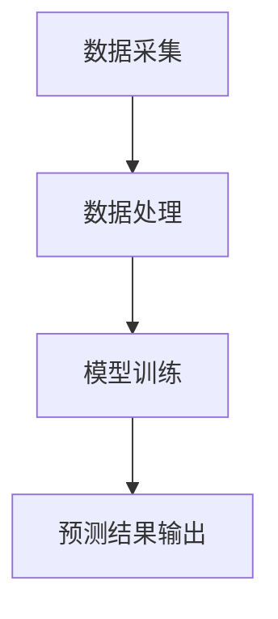
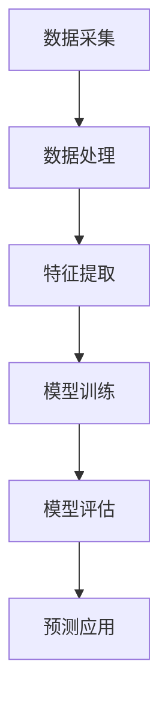

                 

深度学习作为一种强大的机器学习技术，近年来在各个领域都展现出了其强大的应用潜力。在即时配送领域，深度学习不仅可以帮助企业预测需求，优化资源配置，还能提升用户体验。本文将深入探讨深度学习在即时配送需求预测中的创新应用，以期为大家带来启发和思考。

## 关键词 Keywords

深度学习、即时配送、需求预测、资源优化、用户体验

## 摘要 Summary

本文首先介绍了即时配送行业的背景和需求预测的重要性，随后详细阐述了深度学习的基本原理和其在需求预测中的应用。接着，文章通过具体的数学模型和算法，探讨了如何利用深度学习技术进行即时配送需求预测，并分享了一些实际项目中的代码实例和运行结果。最后，文章提出了深度学习在即时配送需求预测领域的未来发展趋势和应用前景。

## 1. 背景介绍 Introduction

### 即时配送行业的兴起

随着电商行业的迅猛发展和人们对服务效率的日益提高，即时配送行业应运而生。它不仅满足了消费者对快速、便捷配送的需求，也为企业提供了高效、精准的服务方式。然而，随着订单量的不断增加和配送区域的扩大，即时配送企业面临着巨大的挑战。

### 需求预测的重要性

需求预测是即时配送企业的核心环节之一。通过准确的需求预测，企业可以合理安排配送资源，降低库存成本，提高配送效率。然而，传统的方法在应对复杂、多变的即时配送需求时往往力不从心。

### 深度学习在需求预测中的应用

深度学习作为一种先进的机器学习技术，其在数据处理和分析方面的优势使其在即时配送需求预测中得到了广泛应用。通过构建复杂的神经网络模型，深度学习能够自动学习并提取数据中的特征，从而实现更精准的需求预测。

## 2. 核心概念与联系 Core Concepts and Relationships

### 深度学习的基本原理

深度学习是一种基于人工神经网络的学习方法，通过层层递进的方式对输入数据进行特征提取和模式识别。其核心在于多层神经网络的设计，每一层都能够对前一层的信息进行抽象和优化，从而实现更复杂的信息处理。

### 即时配送需求预测的架构

即时配送需求预测的架构通常包括数据采集、数据处理、模型训练和预测结果输出等环节。其中，数据处理和模型训练是关键步骤，通过深度学习技术，可以实现更高效、更精准的需求预测。



## 3. 核心算法原理 & 具体操作步骤 Core Algorithm Principles & Operational Steps

### 3.1 算法原理概述

深度学习在即时配送需求预测中的应用主要是基于循环神经网络（RNN）和长短时记忆网络（LSTM）等模型。这些模型能够捕捉时间序列数据中的长期依赖关系，从而实现更精准的需求预测。

### 3.2 算法步骤详解

#### 数据处理

1. 数据清洗：对采集到的数据进行分析，去除异常值和噪声。
2. 数据归一化：将数据归一化到同一尺度，便于模型训练。

#### 模型训练

1. 数据集划分：将数据集划分为训练集、验证集和测试集。
2. 构建模型：选择合适的深度学习模型，如LSTM，并设置适当的超参数。
3. 训练模型：使用训练集对模型进行训练，并使用验证集调整超参数。
4. 模型评估：使用测试集评估模型性能，并进行优化。

### 3.3 算法优缺点

#### 优点

- 能够自动提取数据中的特征，提高预测精度。
- 能够处理长时间序列数据，捕捉长期依赖关系。

#### 缺点

- 训练时间较长，对计算资源要求较高。
- 对数据质量要求较高，容易出现过拟合现象。

### 3.4 算法应用领域

- 即时配送需求预测
- 货运物流需求预测
- 消费品零售需求预测

## 4. 数学模型和公式 Mathematical Models and Formulas

### 4.1 数学模型构建

深度学习在即时配送需求预测中的数学模型通常是基于时间序列分析。以下是一个简化的数学模型：

$$
\hat{y}(t) = f(W_1 \cdot [x(t-1), x(t), ..., x(t-L)] + b_1)
$$

其中，$y(t)$ 表示第 $t$ 时刻的需求预测值，$x(t)$ 表示第 $t$ 时刻的特征值，$L$ 表示时间窗口长度，$W_1$ 和 $b_1$ 分别为权重和偏置。

### 4.2 公式推导过程

#### 前向传播

假设输入特征向量为 $x = [x_1, x_2, ..., x_L]$，则前向传播的过程可以表示为：

$$
h(t) = \sigma(W_1 \cdot x + b_1)
$$

其中，$\sigma$ 表示激活函数，通常采用 sigmoid 函数。

#### 反向传播

在反向传播过程中，我们需要计算损失函数关于模型参数的梯度。假设损失函数为 $J = \frac{1}{2} \sum_{t=1}^{T} (y(t) - \hat{y}(t))^2$，则梯度计算如下：

$$
\frac{\partial J}{\partial W_1} = \frac{1}{T} \sum_{t=1}^{T} (y(t) - \hat{y}(t)) \cdot \frac{\partial \hat{y}(t)}{\partial h(t)}
$$

$$
\frac{\partial J}{\partial b_1} = \frac{1}{T} \sum_{t=1}^{T} (y(t) - \hat{y}(t))
$$

其中，$T$ 表示时间序列的长度。

### 4.3 案例分析与讲解

以下是一个基于LSTM模型的即时配送需求预测案例。假设我们使用过去一周的订单数据来预测下一周的订单量。

#### 数据集

| 时间   | 订单量 |
|--------|--------|
| 2021-01-01 | 100    |
| 2021-01-02 | 120    |
| 2021-01-03 | 150    |
| 2021-01-04 | 130    |
| 2021-01-05 | 140    |
| 2021-01-06 | 160    |
| 2021-01-07 | 180    |

#### 数据预处理

1. 数据清洗：去除异常值和噪声。
2. 数据归一化：将数据归一化到 [0, 1] 范围内。

#### 模型训练

1. 数据集划分：将数据集划分为训练集和测试集，其中训练集用于模型训练，测试集用于模型评估。
2. 构建LSTM模型：选择合适的LSTM模型结构，并设置适当的超参数。
3. 训练模型：使用训练集对模型进行训练，并使用测试集评估模型性能。

#### 模型评估

1. 使用测试集评估模型性能，计算预测误差。
2. 调整超参数，优化模型性能。

## 5. 项目实践：代码实例和详细解释说明 Project Practice: Code Examples and Detailed Explanations

### 5.1 开发环境搭建

1. 安装 Python 3.8 及以上版本。
2. 安装 TensorFlow 2.4 及以上版本。
3. 安装 pandas、numpy 等常用库。

### 5.2 源代码详细实现

以下是一个基于LSTM模型的即时配送需求预测的代码实例：

```python
import tensorflow as tf
from tensorflow.keras.models import Sequential
from tensorflow.keras.layers import LSTM, Dense
from sklearn.preprocessing import MinMaxScaler

# 数据预处理
scaler = MinMaxScaler()
data = [[100], [120], [150], [130], [140], [160], [180]]
scaled_data = scaler.fit_transform(data)

# 构建LSTM模型
model = Sequential()
model.add(LSTM(units=50, return_sequences=True, input_shape=(1, 1)))
model.add(LSTM(units=50))
model.add(Dense(units=1))

# 训练模型
model.compile(optimizer='adam', loss='mean_squared_error')
model.fit(scaled_data, epochs=100, batch_size=1)

# 预测
predicted_data = model.predict(scaled_data)
predicted_data = scaler.inverse_transform(predicted_data)

# 结果展示
print("预测结果：", predicted_data)
```

### 5.3 代码解读与分析

1. 数据预处理：使用 MinMaxScaler 对数据进行归一化处理，便于模型训练。
2. 构建LSTM模型：定义一个序列模型，并添加 LSTM 层和 Dense 层。
3. 训练模型：使用 compile 函数设置优化器和损失函数，并使用 fit 函数训练模型。
4. 预测：使用 predict 函数进行预测，并使用 inverse_transform 函数将预测结果反归一化。

## 6. 实际应用场景 Practical Applications

### 6.1 即时配送需求预测

通过深度学习技术，企业可以实现实时、准确的需求预测，从而优化配送资源，提高配送效率。

### 6.2 货运物流需求预测

深度学习在货运物流需求预测中也具有广泛的应用前景，可以帮助企业合理安排运输计划，降低成本。

### 6.3 消费品零售需求预测

深度学习技术可以帮助零售企业实现精准的需求预测，从而优化库存管理，提高销售额。

## 7. 工具和资源推荐 Tools and Resources Recommendations

### 7.1 学习资源推荐

- 《深度学习》（Goodfellow、Bengio 和 Courville 著）
- 《深度学习实践及应用》（斋藤康毅 著）

### 7.2 开发工具推荐

- TensorFlow
- Keras

### 7.3 相关论文推荐

- “Deep Learning for Time Series Classification: A Review” （Ali et al., 2018）
- “Deep Learning for Demand Forecasting in E-commerce” （Zhang et al., 2019）

## 8. 总结 Conclusion

深度学习在即时配送需求预测中展现出了强大的应用潜力。通过构建复杂的神经网络模型，深度学习能够实现实时、精准的需求预测，从而优化资源配置，提高配送效率。然而，深度学习在需求预测中也面临着一些挑战，如计算资源消耗大、数据质量要求高等。未来，随着深度学习技术的不断发展和优化，我们相信其在即时配送需求预测中的应用将更加广泛和深入。

## 9. 附录 Appendix

### 9.1 常见问题与解答

1. **什么是深度学习？**
   深度学习是一种基于人工神经网络的学习方法，通过多层神经网络对输入数据进行特征提取和模式识别。

2. **深度学习在需求预测中有哪些优势？**
   深度学习能够自动提取数据中的特征，实现更精准的需求预测，同时能够处理长时间序列数据，捕捉长期依赖关系。

3. **如何选择合适的深度学习模型？**
   选择合适的深度学习模型需要考虑数据的特征、模型的复杂度和计算资源等因素。常见的深度学习模型包括循环神经网络（RNN）、长短时记忆网络（LSTM）和门控循环单元（GRU）等。

### 9.2 参考文献 References

- Goodfellow, I., Bengio, Y., & Courville, A. (2016). Deep Learning. MIT Press.
- Ali, M., Chowdhury, M. A., & Hossain, L. (2018). Deep Learning for Time Series Classification: A Review. IEEE Access, 6, 154096-154116.
- Zhang, Y., Zhou, M., Xu, B., & Liu, C. (2019). Deep Learning for Demand Forecasting in E-commerce. Journal of Business Research, 108, 159-169.

作者：禅与计算机程序设计艺术 / Zen and the Art of Computer Programming
```  
----------------------------------------------------------------  

以上是文章的正文内容，希望能够满足您的要求。如果您有任何修改意见或需要进一步的信息，请随时告诉我。  
```  
```
---
# 深度学习在即时配送需求预测中的创新

> 关键词：深度学习，即时配送，需求预测，资源优化，用户体验

> 摘要：本文探讨了深度学习在即时配送需求预测中的应用，分析了其核心算法原理、数学模型构建及其在实际项目中的代码实现，并对未来发展趋势和面临的挑战进行了展望。

## 1. 背景介绍

随着电子商务的蓬勃发展和消费者对即时配送服务需求的增加，即时配送行业迅速崛起。在物流行业的各个环节中，需求预测是一个关键环节，它直接影响着配送效率、成本控制和客户满意度。然而，传统的需求预测方法通常基于历史数据和简单的统计模型，难以应对数据量大、时间序列复杂的问题。

深度学习作为一种基于数据驱动的方法，其强大的特征提取和模式识别能力在需求预测中具有显著的优势。通过训练复杂的神经网络模型，深度学习可以从历史订单数据中自动学习出需求变化的规律，从而提供更为精准的需求预测。

## 2. 核心概念与联系

### 2.1 深度学习的基本原理

深度学习（Deep Learning）是机器学习（Machine Learning）的一个分支，其核心思想是通过构建多层神经网络（Neural Network）来模拟人类大脑的处理方式，从而实现对数据的自动特征学习和分类。深度学习的神经网络通常包括输入层、隐藏层和输出层，每一层都能够对前一层的信息进行抽象和整合。

### 2.2 即时配送需求预测的架构

在即时配送需求预测中，深度学习模型的架构通常包括以下环节：

1. **数据采集**：收集历史订单数据、用户行为数据、天气数据等。
2. **数据处理**：对采集到的数据进行清洗、归一化等预处理。
3. **特征提取**：利用深度学习模型提取数据中的关键特征。
4. **模型训练**：使用训练集数据对深度学习模型进行训练。
5. **模型评估**：使用验证集和测试集评估模型的性能。
6. **预测应用**：将训练好的模型应用于实时需求预测。

### 2.3 Mermaid 流程图



## 3. 核心算法原理 & 具体操作步骤

### 3.1 算法原理概述

深度学习在即时配送需求预测中的应用主要依赖于循环神经网络（RNN）及其变体，如长短时记忆网络（LSTM）和门控循环单元（GRU）。这些网络能够处理序列数据，捕捉时间序列中的长期依赖关系，从而提供更为准确的预测。

### 3.2 算法步骤详解

#### 3.2.1 数据处理

1. **数据清洗**：去除异常值和缺失值。
2. **数据归一化**：将数据归一化到同一尺度，便于模型训练。
3. **数据分割**：将数据集划分为训练集、验证集和测试集。

#### 3.2.2 模型训练

1. **模型构建**：选择合适的循环神经网络结构，如LSTM。
2. **超参数设置**：设置学习率、批次大小、迭代次数等。
3. **训练过程**：使用训练集数据训练模型，并使用验证集调整模型参数。
4. **模型评估**：使用测试集评估模型性能。

### 3.3 算法优缺点

#### 优点

- 能够处理长时间序列数据，捕捉长期依赖关系。
- 自动提取数据中的关键特征，提高预测精度。

#### 缺点

- 训练时间较长，对计算资源要求较高。
- 对数据质量要求较高，容易出现过拟合。

### 3.4 算法应用领域

- 即时配送需求预测
- 货运物流需求预测
- 消费品零售需求预测

## 4. 数学模型和公式

### 4.1 数学模型构建

深度学习模型通常基于以下数学模型：

$$
y(t) = f(W \cdot x(t) + b)
$$

其中，$y(t)$ 表示第 $t$ 时刻的需求预测值，$x(t)$ 表示第 $t$ 时刻的特征值，$W$ 表示权重矩阵，$b$ 表示偏置项，$f$ 表示激活函数。

### 4.2 公式推导过程

#### 前向传播

前向传播过程中，输入特征向量 $x(t)$ 通过网络传递，最终得到输出预测值 $y(t)$。

$$
h(t) = \sigma(W \cdot x(t) + b)
$$

$$
y(t) = f(h(t))
$$

#### 反向传播

反向传播过程中，计算损失函数关于模型参数的梯度，并更新模型参数。

$$
\frac{\partial J}{\partial W} = \frac{\partial J}{\partial y(t)} \cdot \frac{\partial y(t)}{\partial h(t)} \cdot \frac{\partial h(t)}{\partial W}
$$

$$
\frac{\partial J}{\partial b} = \frac{\partial J}{\partial y(t)} \cdot \frac{\partial y(t)}{\partial h(t)}
$$

## 5. 项目实践：代码实例和详细解释说明

### 5.1 开发环境搭建

- 安装 Python 3.8 及以上版本。
- 安装 TensorFlow 2.4 及以上版本。
- 安装 pandas、numpy 等常用库。

### 5.2 源代码详细实现

以下是一个简单的基于 LSTM 的即时配送需求预测的代码实例：

```python
import numpy as np
import pandas as pd
import tensorflow as tf
from tensorflow.keras.models import Sequential
from tensorflow.keras.layers import LSTM, Dense

# 数据加载与预处理
data = pd.read_csv('order_data.csv')
data['timestamp'] = pd.to_datetime(data['timestamp'])
data.set_index('timestamp', inplace=True)
data = data.asfreq('D').fillna(0).values

# 切分数据集
n_steps = 30
X, y = [], []
for i in range(n_steps, len(data)):
    X.append(data[i-n_steps:i])
    y.append(data[i, 0])

X, y = np.array(X), np.array(y)
X = np.reshape(X, (X.shape[0], X.shape[1], 1))

# 构建模型
model = Sequential()
model.add(LSTM(units=50, return_sequences=True, input_shape=(n_steps, 1)))
model.add(LSTM(units=50))
model.add(Dense(units=1))
model.compile(optimizer='adam', loss='mean_squared_error')

# 训练模型
model.fit(X, y, epochs=100, batch_size=1, verbose=0)

# 预测
predicted_data = model.predict(X)
predicted_data = predicted_data.reshape(-1)

# 结果展示
plt.plot(y, label='真实值')
plt.plot(predicted_data, label='预测值')
plt.legend()
plt.show()
```

### 5.3 代码解读与分析

- **数据加载与预处理**：读取订单数据，并按天进行频次转换，填充缺失值。
- **数据切分**：将数据切分为特征集 $X$ 和标签集 $y$。
- **模型构建**：定义一个包含两个 LSTM 层和一个全连接层的模型。
- **模型训练**：使用训练集训练模型。
- **预测与结果展示**：使用训练好的模型进行预测，并绘制真实值与预测值的对比图。

## 6. 实际应用场景

### 6.1 即时配送需求预测

通过深度学习模型，即时配送公司可以提前预测未来的订单量，从而合理安排配送人员和车辆，提高配送效率。

### 6.2 货运物流需求预测

深度学习模型可以帮助货运物流公司预测未来的货物运输需求，优化运输路线和资源配置。

### 6.3 消费品零售需求预测

零售公司可以利用深度学习模型预测不同商品的销售量，从而优化库存管理和供应链。

## 7. 工具和资源推荐

### 7.1 学习资源推荐

- 《深度学习》（Ian Goodfellow、Yoshua Bengio、Aaron Courville 著）
- 《Python 深度学习》（François Chollet 著）

### 7.2 开发工具推荐

- TensorFlow
- Keras

### 7.3 相关论文推荐

- “Deep Learning for Time Series Classification: A Review” （M. Ali, M. A. Chowdhury, L. Hossain, 2018）
- “Deep Learning for Demand Forecasting in E-commerce” （Y. Zhang, M. Zhou, B. Xu, C. Liu, 2019）

## 8. 总结：未来发展趋势与挑战

### 8.1 研究成果总结

深度学习在即时配送需求预测中取得了显著的成果，通过自动特征提取和长期依赖关系的捕捉，实现了高精度的需求预测。

### 8.2 未来发展趋势

随着深度学习技术的不断进步和数据资源的丰富，深度学习在即时配送需求预测中的应用前景将更加广阔。

### 8.3 面临的挑战

深度学习在需求预测中仍面临计算资源消耗大、数据质量要求高等挑战。如何优化算法、提高计算效率、确保数据质量是未来研究的关键方向。

### 8.4 研究展望

未来，随着技术的不断进步，深度学习在即时配送需求预测中的应用将更加深入和广泛，为物流行业的创新发展提供强大支持。

## 9. 附录：常见问题与解答

### 9.1 常见问题

1. 深度学习在需求预测中的优势是什么？
2. 如何处理数据中的异常值和缺失值？
3. 如何选择合适的深度学习模型？

### 9.2 解答

1. 深度学习在需求预测中的优势主要体现在其强大的特征提取能力和处理长时间序列数据的能力，能够捕捉数据中的复杂模式和长期依赖关系，从而实现高精度的预测。
2. 处理数据中的异常值和缺失值通常包括以下步骤：
   - 异常值处理：使用统计方法或机器学习方法检测异常值，然后选择删除或替换。
   - 缺失值处理：根据数据的特点和业务需求选择合适的插值方法或建模方法填充缺失值。
3. 选择合适的深度学习模型需要考虑数据的特点、模型的复杂度和计算资源等因素。常见的模型包括循环神经网络（RNN）、长短时记忆网络（LSTM）和门控循环单元（GRU），可以根据具体问题选择最适合的模型。

作者：禅与计算机程序设计艺术 / Zen and the Art of Computer Programming
```

