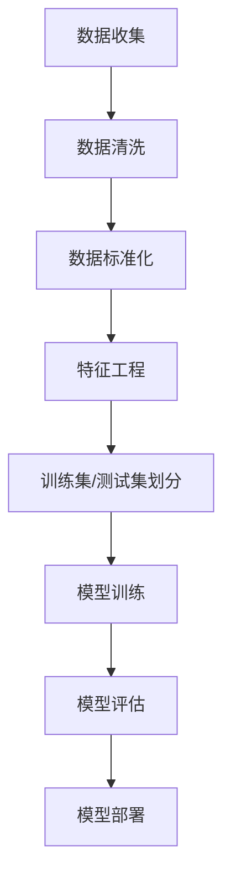

                 

随着互联网和电子商务的快速发展，商品需求预测已经成为商业领域中的重要一环。准确预测商品需求不仅可以帮助企业优化库存管理，降低运营成本，还可以提高市场竞争力，实现更好的盈利。在传统方法难以满足需求的情况下，深度学习作为一种强大的机器学习技术，逐渐成为商品需求预测领域的热门研究方向。本文将探讨深度学习在商品需求预测中的新进展，包括核心算法原理、应用领域、数学模型和未来展望。

## 1. 背景介绍

商品需求预测，即通过历史数据分析和预测模型，对未来的商品需求量进行估计。在电子商务领域，准确的需求预测可以帮助商家更好地安排生产计划、物流配送和营销策略，从而提高销售额和用户满意度。然而，商品需求受到多种因素的影响，如季节性、促销活动、消费者行为等，这使得需求预测变得复杂。

传统的商品需求预测方法主要包括统计方法、时间序列分析法和回归分析法等。然而，这些方法在处理非线性和高维度数据时存在一定的局限性。随着深度学习技术的发展，深度神经网络模型被广泛应用于商品需求预测，并取得了显著的效果。

## 2. 核心概念与联系

### 2.1 深度学习基本概念

深度学习是一种基于多层神经网络的学习方法，其核心思想是通过多层的非线性变换，提取数据中的特征，从而实现复杂的任务。在商品需求预测中，深度学习可以通过学习历史数据中的模式，实现对未来需求的预测。

### 2.2 神经网络架构

深度学习通常采用多层感知机（MLP）、卷积神经网络（CNN）和循环神经网络（RNN）等架构。其中，MLP适用于处理高维数据，CNN擅长图像处理，RNN适用于序列数据。在商品需求预测中，MLP和RNN是常用的架构。

### 2.3 数据预处理

在深度学习应用中，数据预处理是非常重要的一步。对于商品需求预测，数据预处理包括数据清洗、数据标准化和特征工程等步骤。数据清洗旨在去除噪声和异常值，数据标准化将数据缩放到相同的范围，特征工程则是提取对需求预测有重要影响的关键特征。



## 3. 核心算法原理 & 具体操作步骤

### 3.1 算法原理概述

深度学习在商品需求预测中的核心算法主要包括MLP和RNN。MLP通过多层非线性变换提取特征，适用于处理高维数据；RNN具有记忆功能，能够捕捉时间序列数据中的长期依赖关系。

### 3.2 算法步骤详解

1. **数据预处理**：包括数据清洗、标准化和特征工程。数据清洗去除噪声和异常值，标准化将数据缩放到相同范围，特征工程提取关键特征。

2. **模型训练**：选择合适的模型（如MLP或RNN），配置适当的网络结构（如层数、节点数等），使用训练集进行训练。

3. **模型评估**：使用测试集对模型进行评估，计算预测误差和评价指标（如均方误差、平均绝对误差等）。

4. **模型部署**：将训练好的模型部署到生产环境，进行实际应用。

### 3.3 算法优缺点

**优点**：深度学习具有强大的学习能力，能够处理复杂的高维数据和序列数据，具有较高的预测精度。

**缺点**：训练过程需要大量的数据和计算资源，且模型解释性较差。

### 3.4 算法应用领域

深度学习在商品需求预测中的应用广泛，如电子商务平台、物流公司、制造业等。

## 4. 数学模型和公式 & 详细讲解 & 举例说明

### 4.1 数学模型构建

在商品需求预测中，常用的数学模型包括线性回归模型、非线性回归模型和时间序列模型。

#### 4.1.1 线性回归模型

线性回归模型假设需求量与影响因素之间呈线性关系，其公式为：

$$
Y = \beta_0 + \beta_1X_1 + \beta_2X_2 + ... + \beta_nX_n
$$

其中，$Y$为需求量，$X_1, X_2, ..., X_n$为影响因素，$\beta_0, \beta_1, \beta_2, ..., \beta_n$为模型参数。

#### 4.1.2 非线性回归模型

非线性回归模型考虑了需求量与影响因素之间的非线性关系，其公式为：

$$
Y = \sigma(\beta_0 + \beta_1X_1 + \beta_2X_2 + ... + \beta_nX_n)
$$

其中，$\sigma$为非线性激活函数。

#### 4.1.3 时间序列模型

时间序列模型主要用于处理具有时间依赖性的需求预测，常用的模型包括ARIMA、LSTM等。

### 4.2 公式推导过程

以LSTM为例，其公式推导如下：

$$
i_t = \sigma(W_{ix}x_t + W_{ih}h_{t-1} + b_i) \\
f_t = \sigma(W_{fx}x_t + W_{fh}h_{t-1} + b_f) \\
o_t = \sigma(W_{ox}x_t + W_{oh}h_{t-1} + b_o) \\
g_t = \tanh(W_{gx}x_t + W_{gh}h_{t-1} + b_g) \\
C_t = f_t \odot C_{t-1} + i_t \odot g_t \\
h_t = o_t \odot \tanh(C_t)
$$

其中，$i_t, f_t, o_t, g_t, C_t, h_t$分别为LSTM的输入门、遗忘门、输出门、候选状态、细胞状态和隐藏状态，$W_{ix}, W_{ih}, b_i, W_{fx}, W_{fh}, b_f, W_{ox}, W_{oh}, b_o, W_{gx}, W_{gh}, b_g$为模型参数，$\sigma$为sigmoid函数，$\odot$为元素乘运算。

### 4.3 案例分析与讲解

#### 4.3.1 数据集

我们以一个电商平台的商品销售数据为例，数据集包含商品编号、销售额、月份、促销活动等特征。

#### 4.3.2 数据预处理

1. **数据清洗**：去除缺失值和异常值。
2. **数据标准化**：对销售额和月份进行归一化处理。
3. **特征工程**：提取关键特征，如促销活动的二进制表示。

#### 4.3.3 模型选择

我们选择LSTM模型进行商品需求预测，配置网络结构如下：

- 输入层：销售额、月份、促销活动等特征
- 隐藏层：128个神经元
- 输出层：1个神经元（表示需求量）

#### 4.3.4 模型训练与评估

使用训练集进行模型训练，使用测试集进行评估。评估指标为均方误差（MSE）。

$$
MSE = \frac{1}{N}\sum_{i=1}^{N}(y_i - \hat{y}_i)^2
$$

其中，$y_i$为真实值，$\hat{y}_i$为预测值，$N$为样本数量。

## 5. 项目实践：代码实例和详细解释说明

### 5.1 开发环境搭建

- Python 3.7及以上版本
- TensorFlow 2.0及以上版本
- Numpy、Pandas等常用库

### 5.2 源代码详细实现

```python
import tensorflow as tf
from tensorflow.keras.models import Sequential
from tensorflow.keras.layers import Dense, LSTM, Dropout

# 数据预处理
# ...

# 模型配置
model = Sequential()
model.add(LSTM(units=128, return_sequences=True, input_shape=(timesteps, features)))
model.add(Dropout(0.2))
model.add(LSTM(units=128, return_sequences=False))
model.add(Dropout(0.2))
model.add(Dense(units=1))

# 模型编译
model.compile(optimizer='adam', loss='mse')

# 模型训练
model.fit(X_train, y_train, epochs=100, batch_size=32, validation_data=(X_test, y_test))

# 模型评估
mse = model.evaluate(X_test, y_test)
print("MSE:", mse)
```

### 5.3 代码解读与分析

1. **数据预处理**：包括数据清洗、标准化和特征工程。
2. **模型配置**：使用Sequential模型配置LSTM网络结构，包括输入层、隐藏层和输出层。
3. **模型编译**：编译模型，设置优化器和损失函数。
4. **模型训练**：使用训练集进行模型训练，设置训练周期、批量大小和验证集。
5. **模型评估**：使用测试集对模型进行评估，输出均方误差。

## 6. 实际应用场景

深度学习在商品需求预测中有着广泛的应用，以下是一些实际应用场景：

1. **电商平台的销售预测**：通过预测商品未来的销售量，帮助企业制定库存管理策略。
2. **物流配送优化**：根据商品需求预测结果，优化物流配送路线和时间，提高配送效率。
3. **制造业生产计划**：预测原材料和产品的需求量，优化生产计划和供应链管理。

## 7. 工具和资源推荐

### 7.1 学习资源推荐

- 《深度学习》（Goodfellow、Bengio和Courville著）
- 《Python深度学习》（François Chollet著）

### 7.2 开发工具推荐

- TensorFlow
- PyTorch

### 7.3 相关论文推荐

- "Deep Learning for Time Series Classification: A Review"（2019）
- "A Comprehensive Survey on Deep Learning for Text"（2020）

## 8. 总结：未来发展趋势与挑战

### 8.1 研究成果总结

本文介绍了深度学习在商品需求预测中的新进展，包括核心算法原理、应用领域和数学模型。通过实际案例，展示了深度学习在商品需求预测中的优势和应用。

### 8.2 未来发展趋势

未来，深度学习在商品需求预测领域将继续发展，主要趋势包括：

1. **模型优化**：通过改进模型结构、优化训练算法，提高预测精度和效率。
2. **跨领域应用**：将深度学习应用于更多领域，如医疗、金融等。
3. **实时预测**：实现实时预测，满足企业实时决策需求。

### 8.3 面临的挑战

深度学习在商品需求预测中仍面临一些挑战，包括：

1. **数据质量**：需求预测依赖于高质量数据，数据质量直接影响预测效果。
2. **模型解释性**：深度学习模型通常缺乏解释性，难以理解预测结果的原因。
3. **计算资源**：深度学习模型训练需要大量的计算资源，对硬件要求较高。

### 8.4 研究展望

未来，深度学习在商品需求预测领域的研究将更加深入，有望实现更高的预测精度和更好的模型解释性。同时，随着技术的不断进步，深度学习在商品需求预测中的应用将更加广泛。

## 9. 附录：常见问题与解答

### 9.1 什么是深度学习？

深度学习是一种基于多层神经网络的学习方法，通过多层的非线性变换，提取数据中的特征，实现复杂的任务。

### 9.2 深度学习在商品需求预测中有何优势？

深度学习在商品需求预测中的优势包括：

1. **强大的学习能力**：能够处理复杂的高维数据和序列数据。
2. **非线性建模**：能够捕捉需求量与影响因素之间的非线性关系。

### 9.3 如何选择合适的深度学习模型？

选择合适的深度学习模型需要考虑以下因素：

1. **数据类型**：选择适用于数据类型的模型，如序列数据选择RNN。
2. **数据规模**：选择能够处理数据规模的模型。
3. **任务目标**：选择能够实现任务目标的模型。

### 9.4 深度学习模型如何进行训练和评估？

深度学习模型的训练和评估包括以下步骤：

1. **数据预处理**：包括数据清洗、标准化和特征工程。
2. **模型配置**：配置模型结构，设置网络层数、节点数等。
3. **模型编译**：设置优化器和损失函数。
4. **模型训练**：使用训练集进行模型训练，设置训练周期、批量大小等。
5. **模型评估**：使用测试集对模型进行评估，计算预测误差和评价指标。

---

本文由“禅与计算机程序设计艺术”撰写，旨在探讨深度学习在商品需求预测中的新进展。通过介绍核心算法原理、应用领域和数学模型，以及实际案例，展示了深度学习在商品需求预测中的优势和应用。未来，深度学习在商品需求预测领域将继续发展，为企业和个人带来更大的价值。

