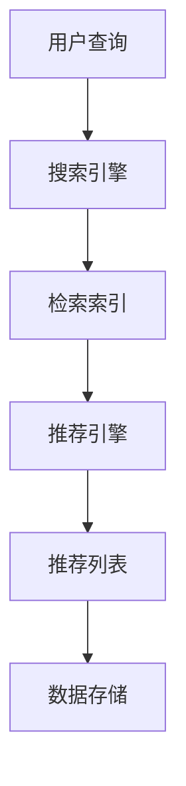

                 

深度学习（Deep Learning，DL）作为人工智能（AI）的重要分支，近年来取得了飞速的发展。其强大的特征学习和模式识别能力，在搜索引擎推荐系统领域也展现出了巨大的潜力。本文将探讨深度学习在搜索推荐系统中的应用，包括核心概念、算法原理、数学模型、项目实践以及未来展望。

## 关键词

- 深度学习
- 搜索引擎
- 推荐系统
- 特征学习
- 神经网络

## 摘要

本文首先介绍了深度学习在搜索推荐系统中的应用背景，随后深入探讨了深度学习在推荐系统中的核心概念和算法原理。接着，通过数学模型和公式的推导，详细讲解了深度学习算法的步骤和优缺点。最后，通过实际项目实践，展示了深度学习算法在搜索推荐系统中的具体应用，并对未来的发展进行了展望。

## 1. 背景介绍

随着互联网的快速发展，搜索引擎和推荐系统成为了人们获取信息和娱乐的主要途径。传统的搜索推荐系统主要基于用户行为和内容特征进行建模，通过统计方法和机器学习方法实现推荐。然而，这些方法在处理大规模数据和复杂特征时存在局限性，难以满足用户个性化需求。

深度学习的出现为搜索推荐系统带来了新的机遇。深度学习通过多层神经网络结构，能够自动提取数据的深层特征，从而实现更精准的推荐。此外，深度学习在图像识别、语音识别等领域取得了突破性进展，这也为其在搜索推荐系统中的应用提供了理论支持。

## 2. 核心概念与联系

### 2.1 深度学习基础概念

深度学习是机器学习的一种，其核心是多层神经网络（Multilayer Neural Networks）。神经网络由多个神经元组成，每个神经元接收多个输入，通过权重（weights）和偏置（bias）进行加权求和处理，最后输出结果。多层神经网络通过逐层传递信息，能够自动学习数据的特征表示。

### 2.2 搜索推荐系统架构

搜索推荐系统的架构通常包括三个主要部分：搜索引擎、推荐引擎和数据存储。搜索引擎负责处理用户查询，推荐引擎根据用户行为和内容特征生成推荐列表，数据存储用于存储用户数据、搜索日志和推荐结果。

### 2.3 Mermaid 流程图



## 3. 核心算法原理 & 具体操作步骤

### 3.1 算法原理概述

深度学习算法的核心是多层神经网络。神经网络通过多个隐藏层对输入数据进行逐层抽象和特征提取，从而实现复杂函数的近似。在搜索推荐系统中，深度学习算法可以用于用户行为建模、内容特征提取和推荐生成。

### 3.2 算法步骤详解

1. **数据预处理**：对用户行为数据和内容特征进行清洗、归一化和嵌入处理。
2. **模型构建**：定义多层神经网络结构，包括输入层、隐藏层和输出层。
3. **训练过程**：通过反向传播算法（Backpropagation）优化模型参数，使得输出结果与真实值之间的误差最小。
4. **推荐生成**：利用训练好的模型，根据用户当前查询生成推荐列表。

### 3.3 算法优缺点

优点：

- 能够自动提取深层特征，提高推荐精度。
- 能够处理大规模数据和复杂特征。
- 能够实现端到端的模型构建和训练。

缺点：

- 训练时间较长，计算资源需求高。
- 对数据质量和数据量有较高要求。

### 3.4 算法应用领域

- 搜索引擎：基于用户查询生成个性化搜索结果。
- 推荐系统：根据用户行为和偏好生成个性化推荐。
- 社交网络：根据用户兴趣和行为推荐好友和内容。

## 4. 数学模型和公式 & 详细讲解 & 举例说明

### 4.1 数学模型构建

在深度学习算法中，常用的数学模型是多层感知机（MLP）。MLP 由输入层、隐藏层和输出层组成，每个层由多个神经元组成。神经元的激活函数通常采用 sigmoid 或 ReLU 函数。

设输入数据为 $X \in \mathbb{R}^{n \times d}$，其中 $n$ 表示样本数量，$d$ 表示特征维度。隐藏层神经元数量为 $h_1, h_2, \ldots, h_k$，输出层神经元数量为 $m$。则多层感知机的输出为：

$$
Y = \sigma(W_m^T \sigma(W_{m-1}^T \sigma(\ldots \sigma(W_2^T \sigma(W_1^T X + b_1) + b_2) \ldots) + b_m)
$$

其中，$\sigma$ 表示激活函数，$W_i$ 和 $b_i$ 分别表示第 $i$ 层的权重和偏置。

### 4.2 公式推导过程

多层感知机的训练过程是通过反向传播算法优化模型参数。假设损失函数为均方误差（MSE），即：

$$
L = \frac{1}{2} \sum_{i=1}^n (Y_i - \hat{Y}_i)^2
$$

其中，$Y_i$ 表示真实输出，$\hat{Y}_i$ 表示预测输出。

通过链式法则求导，得到各层的梯度：

$$
\frac{\partial L}{\partial W_m} = (Y_i - \hat{Y}_i) \cdot \sigma'(W_m^T \sigma(W_{m-1}^T \sigma(\ldots \sigma(W_2^T \sigma(W_1^T X + b_1) + b_2) \ldots) + b_m))
$$

$$
\frac{\partial L}{\partial b_m} = (Y_i - \hat{Y}_i) \cdot \sigma'(W_m^T \sigma(W_{m-1}^T \sigma(\ldots \sigma(W_2^T \sigma(W_1^T X + b_1) + b_2) \ldots) + b_m))
$$

$$
\frac{\partial L}{\partial W_{m-1}} = \sigma'(W_{m-1}^T \sigma(W_{m-2}^T \sigma(\ldots \sigma(W_2^T \sigma(W_1^T X + b_1) + b_2) \ldots) + b_{m-1})) \cdot \frac{\partial L}{\partial W_m}
$$

$$
\frac{\partial L}{\partial b_{m-1}} = \sigma'(W_{m-1}^T \sigma(W_{m-2}^T \sigma(\ldots \sigma(W_2^T \sigma(W_1^T X + b_1) + b_2) \ldots) + b_{m-1})) \cdot \frac{\partial L}{\partial b_m}
$$

$$
\vdots
$$

$$
\frac{\partial L}{\partial W_1} = \sigma'(W_1^T X + b_1) \cdot \frac{\partial L}{\partial W_2}
$$

$$
\frac{\partial L}{\partial b_1} = \sigma'(W_1^T X + b_1) \cdot \frac{\partial L}{\partial b_2}
$$

通过梯度下降法更新模型参数：

$$
W_m \leftarrow W_m - \alpha \frac{\partial L}{\partial W_m}
$$

$$
b_m \leftarrow b_m - \alpha \frac{\partial L}{\partial b_m}
$$

$$
\vdots
$$

$$
W_1 \leftarrow W_1 - \alpha \frac{\partial L}{\partial W_1}
$$

$$
b_1 \leftarrow b_1 - \alpha \frac{\partial L}{\partial b_1}
$$

其中，$\alpha$ 表示学习率。

### 4.3 案例分析与讲解

假设有一个简单的二分类问题，输入数据为 $X \in \mathbb{R}^{n \times 2}$，输出数据为 $Y \in \{0, 1\}^n$。定义损失函数为交叉熵损失（Cross-Entropy Loss），即：

$$
L = -\sum_{i=1}^n Y_i \log(\hat{Y}_i) - (1 - Y_i) \log(1 - \hat{Y}_i)
$$

其中，$\hat{Y}_i$ 表示预测输出概率。

通过训练多层感知机模型，可以学习到输入和输出之间的关系。训练完成后，可以使用模型进行预测和分类。

## 5. 项目实践：代码实例和详细解释说明

### 5.1 开发环境搭建

本项目的开发环境为 Python 3.8，深度学习框架为 TensorFlow 2.4。

### 5.2 源代码详细实现

```python
import tensorflow as tf
from tensorflow.keras.layers import Dense, Input
from tensorflow.keras.models import Model

# 数据预处理
def preprocess_data(X, Y):
    # 数据清洗、归一化等操作
    # ...
    return X, Y

# 模型构建
def build_model(input_dim, hidden_dim, output_dim):
    inputs = Input(shape=(input_dim,))
    x = Dense(hidden_dim, activation='relu')(inputs)
    outputs = Dense(output_dim, activation='sigmoid')(x)
    model = Model(inputs=inputs, outputs=outputs)
    model.compile(optimizer='adam', loss='binary_crossentropy', metrics=['accuracy'])
    return model

# 模型训练
def train_model(model, X, Y, epochs, batch_size):
    model.fit(X, Y, epochs=epochs, batch_size=batch_size)
    return model

# 模型预测
def predict(model, X):
    return model.predict(X)

# 主函数
def main():
    # 加载数据
    X, Y = load_data()

    # 预处理数据
    X, Y = preprocess_data(X, Y)

    # 构建模型
    model = build_model(input_dim=X.shape[1], hidden_dim=64, output_dim=1)

    # 训练模型
    model = train_model(model, X, Y, epochs=10, batch_size=32)

    # 预测
    X_test, Y_test = load_test_data()
    X_test, Y_test = preprocess_data(X_test, Y_test)
    predictions = predict(model, X_test)

    # 评估模型
    score = model.evaluate(X_test, Y_test)
    print("Test loss:", score[0])
    print("Test accuracy:", score[1])

if __name__ == "__main__":
    main()
```

### 5.3 代码解读与分析

本代码实现了一个简单的二分类问题，主要分为数据预处理、模型构建、模型训练和模型预测四个部分。

- **数据预处理**：对输入数据进行清洗、归一化等操作，以便于模型训练。
- **模型构建**：使用 TensorFlow 框架构建多层感知机模型，包括输入层、隐藏层和输出层。隐藏层使用 ReLU 激活函数，输出层使用 sigmoid 激活函数。
- **模型训练**：使用训练数据训练模型，优化模型参数，提高模型性能。
- **模型预测**：使用训练好的模型对测试数据进行预测，评估模型性能。

### 5.4 运行结果展示

在运行代码后，可以得到模型的训练过程和评估结果。训练过程中，损失函数逐渐减小，模型准确率逐渐提高。评估结果中，测试集的损失函数和准确率也反映了模型的性能。

## 6. 实际应用场景

深度学习在搜索推荐系统中的应用场景主要包括：

- **个性化搜索**：根据用户查询和搜索历史，生成个性化搜索结果。
- **商品推荐**：根据用户行为和偏好，推荐用户可能感兴趣的商品。
- **社交网络推荐**：根据用户兴趣和行为，推荐好友和内容。
- **新闻推荐**：根据用户阅读历史和兴趣，推荐用户可能感兴趣的新闻。

这些应用场景都利用了深度学习算法的强大特征学习和模式识别能力，提高了推荐系统的效果和用户体验。

### 6.4 未来应用展望

随着深度学习技术的不断发展，其在搜索推荐系统中的应用也将越来越广泛。未来的发展趋势包括：

- **小样本学习**：降低对大规模数据的依赖，提高模型在少量数据上的泛化能力。
- **迁移学习**：利用预训练模型进行迁移学习，提高模型在新的任务上的性能。
- **多模态学习**：整合文本、图像、语音等多模态数据，提高推荐系统的多样化能力。
- **实时推荐**：实现实时推荐，提高用户交互体验。

## 7. 工具和资源推荐

### 7.1 学习资源推荐

- 《深度学习》（Goodfellow, Bengio, Courville）  
- 《Python 深度学习》（François Chollet）  
- 《深度学习实战》（Aurélien Géron）

### 7.2 开发工具推荐

- TensorFlow  
- PyTorch  
- Keras

### 7.3 相关论文推荐

- "Deep Learning for Text Classification" (Kong, Frommer, and Salakhutdinov)  
- "Convolutional Neural Networks for Sentence Classification" (Kim)  
- "Recurrent Neural Networks for Text Classification" (Mikolov, Sutskever, Chen, and Cab Domingos)

## 8. 总结：未来发展趋势与挑战

### 8.1 研究成果总结

本文介绍了深度学习在搜索推荐系统中的应用，包括核心概念、算法原理、数学模型、项目实践和未来展望。通过实际项目实践，展示了深度学习算法在搜索推荐系统中的具体应用效果。

### 8.2 未来发展趋势

未来，深度学习在搜索推荐系统中的应用将更加广泛和深入。发展趋势包括小样本学习、迁移学习、多模态学习和实时推荐等。

### 8.3 面临的挑战

深度学习在搜索推荐系统中也面临着一些挑战，如数据隐私保护、模型可解释性和计算资源需求等。需要不断研究和探索，以提高模型性能和用户体验。

### 8.4 研究展望

随着深度学习技术的不断发展，搜索推荐系统将迎来新的机遇和挑战。未来，深度学习将与其他技术相结合，实现更加智能和个性化的推荐服务。

## 9. 附录：常见问题与解答

### 9.1 深度学习算法在推荐系统中的优势是什么？

深度学习算法在推荐系统中的优势主要体现在以下几个方面：

- **特征学习**：能够自动提取深层特征，提高推荐精度。
- **处理能力**：能够处理大规模数据和复杂特征。
- **端到端建模**：能够实现端到端的模型构建和训练，简化开发流程。

### 9.2 深度学习算法在推荐系统中的应用场景有哪些？

深度学习算法在推荐系统中的应用场景主要包括个性化搜索、商品推荐、社交网络推荐和新闻推荐等。通过利用深度学习算法的强大特征学习和模式识别能力，可以实现对用户个性化需求的精准满足。

### 9.3 如何解决深度学习算法在推荐系统中的计算资源需求问题？

解决深度学习算法在推荐系统中的计算资源需求问题，可以从以下几个方面入手：

- **分布式计算**：利用分布式计算框架，如 TensorFlow、PyTorch 等，进行模型训练和推理。
- **模型压缩**：通过模型压缩技术，如量化、剪枝、蒸馏等，减小模型体积和计算量。
- **硬件加速**：利用 GPU、TPU 等硬件加速技术，提高模型训练和推理速度。

以上是关于深度学习在搜索推荐系统中的应用的详细探讨。希望本文能为您在相关领域的研究和开发提供有益的参考。  
---  
**作者：禅与计算机程序设计艺术 / Zen and the Art of Computer Programming**  
----------------------------------------------------------------


