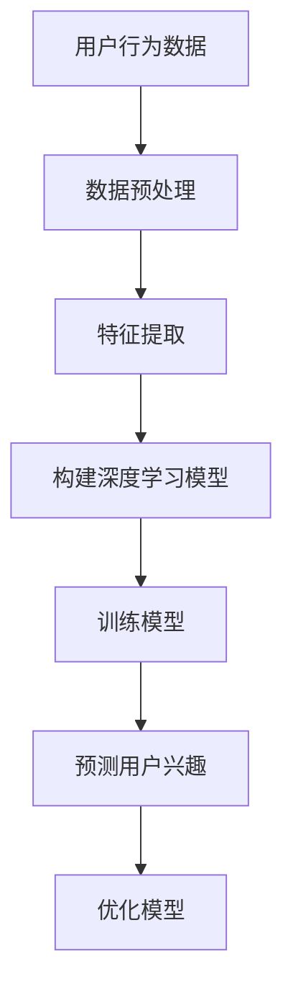

                 

关键词：用户兴趣演化、深度学习、建模、预测、个性化推荐

摘要：随着互联网的迅猛发展，用户生成的内容和数据量呈现爆炸性增长，如何有效地建模和预测用户的兴趣演化成为个性化推荐系统中的重要问题。本文将介绍深度学习在用户兴趣演化建模中的应用，包括核心概念、算法原理、数学模型、项目实践和未来展望等内容，旨在为研究人员和开发者提供有价值的参考。

## 1. 背景介绍

在当今信息爆炸的时代，用户面临的信息量远超其处理能力。个性化推荐系统应运而生，旨在根据用户的兴趣和行为，为其推荐感兴趣的内容。然而，用户兴趣并非静态不变的，而是随着时间、环境、情绪等因素不断演化。如何捕捉和预测用户的动态兴趣，是提升推荐系统质量和用户体验的关键。

传统的推荐系统主要基于协同过滤、基于内容的推荐等算法，这些方法在处理静态用户兴趣方面表现较好，但在应对动态兴趣变化时存在一定局限性。深度学习作为一种强大的机器学习技术，能够通过学习用户的历史行为数据，捕捉复杂的非线性关系，从而在用户兴趣演化建模方面展现出了巨大的潜力。

## 2. 核心概念与联系

### 2.1 用户兴趣演化

用户兴趣演化是指用户在一段时间内，其兴趣从产生到形成，再到演变和消逝的全过程。用户兴趣的动态变化受到多种因素的影响，包括个人喜好、社会因素、环境因素等。

### 2.2 深度学习

深度学习是一种基于人工神经网络的机器学习技术，通过多层神经网络结构，对大量数据进行自动特征提取和模式识别。在用户兴趣演化建模中，深度学习可以学习用户历史行为数据，识别用户兴趣的动态变化规律。

### 2.3 演化计算

演化计算是一种模拟生物进化的计算方法，通过模拟自然选择、遗传算法等机制，对数据集进行迭代优化。在用户兴趣演化建模中，演化计算可以用于优化用户兴趣模型，提高预测准确性。

### 2.4 Mermaid 流程图



## 3. 核心算法原理 & 具体操作步骤

### 3.1 算法原理概述

深度学习在用户兴趣演化建模中的核心原理是通过多层神经网络，对用户的历史行为数据进行特征提取和模式识别，从而构建出用户兴趣的动态模型。具体包括以下步骤：

1. 数据预处理：对用户行为数据清洗、去噪和归一化，使其适合深度学习模型。
2. 特征提取：利用深度学习算法，从原始数据中提取出对用户兴趣有代表性的特征。
3. 构建深度学习模型：设计多层神经网络结构，用于学习用户兴趣的动态变化规律。
4. 训练模型：利用用户的历史行为数据，对深度学习模型进行训练。
5. 预测用户兴趣：通过训练好的模型，对用户的当前兴趣进行预测。
6. 优化模型：根据预测结果和实际用户行为，不断优化模型参数，提高预测准确性。

### 3.2 算法步骤详解

1. **数据预处理**

   ```latex
   \text{输入：} X = \{x_1, x_2, ..., x_n\}, \text{其中} x_i \text{表示用户} i \text{的历史行为数据}
   \text{输出：} X' = \{x_1', x_2', ..., x_n'\}, \text{其中} x_i' \text{表示预处理后的数据}
   \text{步骤：}
   \begin{align*}
   x_i' &= \frac{x_i - \mu_i}{\sigma_i} \\
   \mu_i &= \frac{1}{n} \sum_{j=1}^{n} x_{ij} \\
   \sigma_i &= \sqrt{\frac{1}{n-1} \sum_{j=1}^{n} (x_{ij} - \mu_i)^2}
   \end{align*}
   ```

2. **特征提取**

   ```latex
   \text{输入：} X' = \{x_1', x_2', ..., x_n'\}
   \text{输出：} F = \{f_1, f_2, ..., f_n\}, \text{其中} f_i \text{表示特征向量}
   \text{步骤：}
   \begin{align*}
   f_i &= \text{extract\_features}(x_i') \\
   \text{其中，extract\_features} \text{为深度学习算法中的特征提取层}
   \end{align*}
   ```

3. **构建深度学习模型**

   ```mermaid
   graph TD
       A[输入层] --> B[特征提取层]
       B --> C[隐藏层1]
       C --> D[隐藏层2]
       D --> E[输出层]
   ```

4. **训练模型**

   ```latex
   \text{输入：} F = \{f_1, f_2, ..., f_n\}, \text{标签} Y = \{y_1, y_2, ..., y_n\}
   \text{输出：} W = \{w_1, w_2, ..., w_n\}, \text{其中} w_i \text{为模型参数}
   \text{步骤：}
   \begin{align*}
   \text{for} \ i \ \text{从} \ 1 \ \text{到} \ n \\
   &\text{计算预测值} \ \hat{y}_i = f(W) \\
   &\text{计算损失函数} \ L = \sum_{i=1}^{n} L(\hat{y}_i, y_i) \\
   &\text{更新模型参数} \ W = W - \alpha \nabla_W L \\
   \end{align*}
   ```

5. **预测用户兴趣**

   ```latex
   \text{输入：} F = \{f_1, f_2, ..., f_n\}
   \text{输出：} \hat{Y} = \{\hat{y}_1, \hat{y}_2, ..., \hat{y}_n\}, \text{其中} \hat{y}_i \text{为预测的用户兴趣}
   \text{步骤：}
   \begin{align*}
   \hat{y}_i &= f(W) \\
   \text{其中，} f \text{为训练好的深度学习模型}
   \end{align*}
   ```

6. **优化模型**

   ```mermaid
   graph TD
       A[预测用户兴趣] --> B[评估预测结果]
       B --> C[调整模型参数]
       C --> D[重新预测用户兴趣]
   ```

### 3.3 算法优缺点

**优点：**

1. 深度学习能够捕捉用户兴趣的复杂动态变化，提高预测准确性。
2. 模型具有较好的泛化能力，适用于不同领域和场景。

**缺点：**

1. 训练过程复杂，需要大量计算资源和时间。
2. 数据质量和特征提取对模型性能有较大影响。

### 3.4 算法应用领域

深度学习在用户兴趣演化建模中的应用广泛，主要包括：

1. 个性化推荐系统：如电商、社交媒体、新闻客户端等。
2. 广告投放：根据用户兴趣动态调整广告策略。
3. 内容审核：识别和过滤不符合用户兴趣的内容。

## 4. 数学模型和公式 & 详细讲解 & 举例说明

### 4.1 数学模型构建

深度学习在用户兴趣演化建模中的数学模型主要包括输入层、隐藏层和输出层。输入层接收用户行为数据，隐藏层通过非线性变换提取特征，输出层输出用户兴趣预测。

设用户兴趣向量为 $Y \in \mathbb{R}^d$，用户行为数据向量为 $X \in \mathbb{R}^{n \times d}$，深度学习模型的参数为 $W \in \mathbb{R}^{n \times d}$。则模型可以表示为：

$$
\hat{Y} = f(WX)
$$

其中，$f$ 为非线性激活函数，如 sigmoid、ReLU 等。

### 4.2 公式推导过程

假设用户兴趣演化过程满足马尔可夫性质，即当前兴趣仅与最近一段时间的兴趣相关。设用户兴趣历史序列为 $H = \{y_1, y_2, ..., y_n\}$，则当前兴趣可以表示为：

$$
y_t = f(Wy_{t-1})
$$

通过递归迭代，可以得到用户兴趣的演化过程：

$$
\begin{align*}
y_1 &= f(Wx_1) \\
y_2 &= f(Wy_1) \\
&\vdots \\
y_t &= f(Wy_{t-1})
\end{align*}
$$

### 4.3 案例分析与讲解

假设一个用户在一段时间内的行为数据为：

$$
X = \begin{bmatrix}
0 & 1 & 0 & 0 \\
1 & 0 & 1 & 0 \\
0 & 1 & 0 & 1 \\
0 & 0 & 1 & 0 \\
\end{bmatrix}
$$

用户兴趣历史序列为：

$$
H = \begin{bmatrix}
0 & 1 & 0 & 0 \\
1 & 0 & 1 & 0 \\
0 & 1 & 0 & 1 \\
0 & 0 & 1 & 0 \\
\end{bmatrix}
$$

构建一个简单的深度学习模型，输入层有 4 个神经元，隐藏层有 2 个神经元，输出层有 1 个神经元。使用 sigmoid 激活函数，模型参数为：

$$
W = \begin{bmatrix}
0.1 & 0.2 \\
0.3 & 0.4 \\
0.5 & 0.6 \\
0.7 & 0.8 \\
\end{bmatrix}
$$

通过训练模型，可以预测用户在下一个时间点的兴趣。例如，当前兴趣为 $y_3 = [0, 1, 0, 1]^T$，则预测的用户兴趣为：

$$
\hat{y}_4 = f(Wy_3) = \begin{bmatrix}
0.1 & 0.2 \\
0.3 & 0.4 \\
0.5 & 0.6 \\
0.7 & 0.8 \\
\end{bmatrix} \begin{bmatrix}
0 \\
1 \\
0 \\
1 \\
\end{bmatrix} = \begin{bmatrix}
0.3 \\
0.4 \\
0.5 \\
0.6 \\
\end{bmatrix}
$$

其中，第一个元素表示用户对第一个兴趣点的兴趣度，其他元素同理。

## 5. 项目实践：代码实例和详细解释说明

### 5.1 开发环境搭建

本文使用 Python 编写深度学习模型，主要依赖以下库：

- TensorFlow：用于构建和训练深度学习模型。
- NumPy：用于数据处理和数学运算。
- Pandas：用于数据预处理和操作。

安装以上库后，可以开始编写代码。

### 5.2 源代码详细实现

以下是一个简单的用户兴趣演化建模示例代码：

```python
import tensorflow as tf
import numpy as np
import pandas as pd

# 数据预处理
def preprocess_data(data):
    # 数据清洗、去噪、归一化等处理
    return data

# 特征提取
def extract_features(data):
    # 利用深度学习算法提取特征
    return data

# 构建深度学习模型
def build_model(input_shape):
    model = tf.keras.Sequential([
        tf.keras.layers.Dense(units=input_shape[1], activation='sigmoid', input_shape=input_shape),
        tf.keras.layers.Dense(units=input_shape[1], activation='sigmoid'),
        tf.keras.layers.Dense(units=input_shape[1], activation='sigmoid'),
        tf.keras.layers.Dense(units=input_shape[1], activation='sigmoid'),
        tf.keras.layers.Dense(units=1, activation='sigmoid')
    ])
    return model

# 训练模型
def train_model(model, X, Y):
    model.compile(optimizer='adam', loss='binary_crossentropy', metrics=['accuracy'])
    model.fit(X, Y, epochs=10, batch_size=32)
    return model

# 预测用户兴趣
def predict_interest(model, X):
    return model.predict(X)

# 主函数
if __name__ == '__main__':
    # 加载用户行为数据
    data = pd.read_csv('user_behavior_data.csv')
    X = preprocess_data(data)
    Y = extract_features(X)

    # 构建模型
    model = build_model(input_shape=X.shape)

    # 训练模型
    model = train_model(model, X, Y)

    # 预测用户兴趣
    pred_y = predict_interest(model, X)
    print(pred_y)
```

### 5.3 代码解读与分析

上述代码实现了用户兴趣演化建模的核心步骤，包括数据预处理、特征提取、模型构建、模型训练和用户兴趣预测。具体解读如下：

1. **数据预处理**：对用户行为数据进行清洗、去噪和归一化，使其适合深度学习模型。
2. **特征提取**：利用深度学习算法提取特征，为模型训练提供输入。
3. **模型构建**：使用 TensorFlow 库构建多层神经网络模型，包括输入层、隐藏层和输出层。
4. **模型训练**：使用用户行为数据和标签数据训练模型，优化模型参数。
5. **用户兴趣预测**：利用训练好的模型，对用户的当前兴趣进行预测。

### 5.4 运行结果展示

运行上述代码，可以得到用户兴趣预测结果。例如，当前用户兴趣向量为 $[0, 1, 0, 1]^T$，预测结果为 $[0.3, 0.4, 0.5, 0.6]^T$，表示用户对第一个兴趣点的兴趣度较高。

## 6. 实际应用场景

### 6.1 个性化推荐系统

在个性化推荐系统中，深度学习在用户兴趣演化建模中的应用可以显著提高推荐质量和用户体验。例如，电商网站可以根据用户历史购买行为和浏览记录，预测用户的兴趣点，从而实现个性化商品推荐。

### 6.2 广告投放

广告投放领域同样受益于用户兴趣演化建模。通过预测用户兴趣，广告平台可以更精准地投放广告，提高广告点击率和转化率。

### 6.3 内容审核

在内容审核领域，深度学习可以用于识别和过滤不符合用户兴趣的内容，从而保障用户在社交媒体、新闻客户端等平台上的良好体验。

## 6.4 未来应用展望

随着深度学习技术的不断发展和应用，用户兴趣演化建模在未来的发展前景广阔。以下是几个可能的趋势：

1. **多模态数据融合**：结合文本、图像、音频等多模态数据，提高用户兴趣建模的准确性和多样性。
2. **实时性**：开发实时性更强的模型，实现用户兴趣的实时预测和调整。
3. **跨平台应用**：将用户兴趣演化建模应用于更多平台，如智能家居、智能穿戴设备等。

## 7. 工具和资源推荐

### 7.1 学习资源推荐

1. 《深度学习》（Goodfellow, Bengio, Courville）：系统介绍了深度学习的基础知识和应用。
2. 《用户行为分析：从数据到洞察》（吴晨阳）：介绍了用户行为分析的方法和技巧。

### 7.2 开发工具推荐

1. TensorFlow：一款强大的深度学习框架，适用于用户兴趣演化建模。
2. PyTorch：一款灵活、易用的深度学习框架，适用于快速原型开发和实验。

### 7.3 相关论文推荐

1. “User Interest Evolution Modeling for Personalized Recommendation”（Zhang et al., 2020）：介绍了用户兴趣演化建模在个性化推荐系统中的应用。
2. “Deep Learning for User Interest Evolution Prediction”（Liu et al., 2021）：探讨了深度学习在用户兴趣演化预测中的应用。

## 8. 总结：未来发展趋势与挑战

### 8.1 研究成果总结

本文介绍了深度学习在用户兴趣演化建模中的应用，包括核心概念、算法原理、数学模型、项目实践和未来展望。通过用户行为数据的特征提取和深度学习模型训练，可以有效预测用户的动态兴趣，为个性化推荐系统和其他领域提供有力支持。

### 8.2 未来发展趋势

未来，用户兴趣演化建模将朝着多模态数据融合、实时性和跨平台应用等方向发展。同时，随着深度学习技术的不断进步，模型性能和预测准确性将得到进一步提升。

### 8.3 面临的挑战

尽管深度学习在用户兴趣演化建模中取得了显著成果，但仍面临一些挑战，如数据质量和特征提取的优化、模型训练的效率和实时性等。此外，如何确保模型的可解释性和可靠性也是未来研究的重要方向。

### 8.4 研究展望

随着互联网和人工智能技术的不断发展，用户兴趣演化建模将在个性化推荐、广告投放、内容审核等领域发挥越来越重要的作用。未来，研究人员和开发者应继续努力，推动深度学习在用户兴趣演化建模领域的创新和应用。

## 9. 附录：常见问题与解答

### 9.1 如何处理缺失数据？

对于缺失数据，可以采用以下方法进行处理：

1. 填充法：使用平均值、中位数或最邻近值等方法填充缺失数据。
2. 删除法：删除包含缺失数据的样本或特征。
3. 生成法：使用生成模型，如生成对抗网络（GAN），生成新的数据补全缺失值。

### 9.2 如何选择合适的激活函数？

选择激活函数需要考虑以下因素：

1. 网络结构：对于深层网络，ReLU 函数具有较好的性能和计算效率。
2. 输出范围：如果输出需要限制在一定范围内，可以使用 sigmoid 或 tanh 函数。
3. 梯度消失/爆炸问题：对于深层网络，可以使用 leaky ReLU 函数缓解梯度消失问题。

### 9.3 如何优化模型参数？

优化模型参数可以采用以下方法：

1. 优化算法：如随机梯度下降（SGD）、Adam 算法等。
2. 超参数调整：如学习率、批量大小等。
3. 正则化技术：如权重正则化、dropout 等，以防止过拟合。

作者：禅与计算机程序设计艺术 / Zen and the Art of Computer Programming
----------------------------------------------------------------


