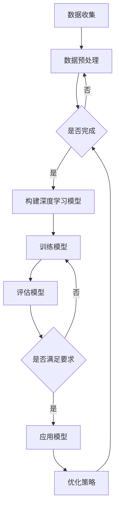

                 

关键词：用户行为序列分析、深度学习、时间序列模型、序列建模、注意力机制、循环神经网络（RNN）、长短时记忆网络（LSTM）、递归神经网络（RNN）、卷积神经网络（CNN）、序列预测、用户行为理解、个性化推荐系统

## 摘要

本文旨在探讨深度学习在用户行为序列分析中的应用。随着互联网的迅猛发展，用户行为数据变得越来越丰富，如何有效地分析和利用这些数据，已成为企业和研究机构关注的热点。本文首先介绍了用户行为序列分析的重要性，然后详细阐述了深度学习在序列建模中的核心原理和方法，包括循环神经网络（RNN）、长短时记忆网络（LSTM）和注意力机制等。随后，本文通过具体实例和项目实践，展示了深度学习在用户行为序列分析中的应用效果。最后，本文对未来的研究方向和应用前景进行了展望。

## 1. 背景介绍

### 用户行为序列分析的重要性

在互联网时代，用户行为数据已成为企业和研究机构的重要资产。通过对用户行为序列的分析，可以深入了解用户的行为模式、兴趣偏好和需求变化，从而为企业制定精准的市场营销策略提供有力支持。用户行为序列分析在个性化推荐系统、广告投放优化、风险评估等领域具有广泛的应用价值。

### 深度学习的兴起

深度学习作为人工智能领域的重要分支，近年来取得了显著的进展。深度学习模型通过多层神经网络结构，能够自动提取数据中的特征，实现复杂的模式识别和预测任务。随着计算能力的提升和大数据技术的发展，深度学习在图像识别、自然语言处理、语音识别等领域取得了突破性成果。

### 深度学习与用户行为序列分析的结合

深度学习模型在用户行为序列分析中的应用，为传统方法提供了新的思路和工具。通过引入循环神经网络（RNN）、长短时记忆网络（LSTM）和注意力机制等深度学习技术，可以有效解决用户行为序列建模中的复杂性和不确定性问题，提高序列预测的准确性和可靠性。

## 2. 核心概念与联系

### 深度学习基本原理

深度学习模型通过多层神经网络结构，对数据进行层层抽象和提取，从而实现复杂的特征表示和预测任务。深度学习模型的核心思想是自动学习数据中的层次化特征表示，使其能够适应各种复杂数据类型的任务。

### 用户行为序列分析概念

用户行为序列分析是指对用户在一段时间内的行为数据进行收集、整理和分析，以揭示用户的行为模式、兴趣偏好和需求变化。用户行为序列分析的核心任务包括行为分类、行为预测和行为模式识别等。

### 深度学习在用户行为序列分析中的应用

深度学习在用户行为序列分析中的应用，主要体现在以下几个方面：

1. **行为分类**：通过深度学习模型对用户行为进行分类，识别用户在不同场景下的行为类型，为后续分析提供基础。
2. **行为预测**：利用深度学习模型预测用户未来的行为，为企业和研究机构制定个性化策略提供支持。
3. **行为模式识别**：通过深度学习模型分析用户行为序列中的潜在模式，挖掘用户行为背后的原因和规律。

### Mermaid 流程图

下面是用户行为序列分析中深度学习应用的一个简化的 Mermaid 流程图：



## 3. 核心算法原理 & 具体操作步骤

### 3.1 算法原理概述

在用户行为序列分析中，常用的深度学习算法包括循环神经网络（RNN）、长短时记忆网络（LSTM）和注意力机制等。这些算法通过不同的机制和结构，实现对用户行为序列的建模和预测。

1. **循环神经网络（RNN）**：RNN 是一种能够处理序列数据的神经网络，其通过循环机制保留之前的输入信息，实现对序列数据的记忆和建模。但 RNN 存在梯度消失和梯度爆炸等问题，影响模型的训练效果。
2. **长短时记忆网络（LSTM）**：LSTM 是 RNN 的一种改进模型，通过引入门控机制，能够有效地解决 RNN 的梯度消失问题，实现对长序列数据的建模和预测。
3. **注意力机制**：注意力机制是一种能够自适应地关注序列中重要信息的方法，通过计算注意力权重，实现对序列数据的有意义部分进行加权，提高模型的预测效果。

### 3.2 算法步骤详解

1. **数据收集与预处理**：收集用户行为数据，并进行清洗、归一化和特征提取等预处理操作，为后续建模提供高质量的数据。
2. **构建深度学习模型**：选择合适的深度学习模型，如 RNN、LSTM 或注意力机制模型，根据具体问题设计模型结构。
3. **模型训练与优化**：利用预处理后的数据，对深度学习模型进行训练和优化，调整模型参数，提高模型性能。
4. **模型评估与验证**：通过交叉验证等方法，对训练好的模型进行评估和验证，确保模型具有良好的泛化能力和预测性能。
5. **模型应用与部署**：将训练好的模型应用于实际场景，如行为分类、行为预测或行为模式识别等，为企业提供决策支持。

### 3.3 算法优缺点

1. **循环神经网络（RNN）**：优点：能够处理序列数据，保留历史信息；缺点：梯度消失和梯度爆炸问题，训练不稳定。
2. **长短时记忆网络（LSTM）**：优点：解决 RNN 的梯度消失问题，训练稳定；缺点：计算复杂度高，参数较多。
3. **注意力机制**：优点：能够自适应地关注重要信息，提高预测效果；缺点：计算复杂度高，对训练数据要求较高。

### 3.4 算法应用领域

深度学习在用户行为序列分析中的应用领域广泛，主要包括：

1. **个性化推荐系统**：通过用户行为序列分析，为用户提供个性化的推荐服务，提高用户满意度和转化率。
2. **广告投放优化**：根据用户行为序列，预测用户兴趣和需求，实现精准的广告投放，提高广告效果。
3. **风险评估与预测**：通过分析用户行为序列，预测用户的行为风险，为金融机构提供风险管理支持。
4. **用户行为模式识别**：挖掘用户行为序列中的潜在模式，为企业提供洞察和决策支持。

## 4. 数学模型和公式 & 详细讲解 & 举例说明

### 4.1 数学模型构建

在用户行为序列分析中，常用的数学模型包括循环神经网络（RNN）、长短时记忆网络（LSTM）和注意力机制等。以下是这些模型的数学模型构建：

1. **循环神经网络（RNN）**：

$$
h_t = \sigma(W_h h_{t-1} + W_x x_t + b_h)
$$

其中，$h_t$ 表示第 $t$ 个时刻的隐藏状态，$x_t$ 表示第 $t$ 个时刻的输入特征，$W_h$ 和 $W_x$ 分别为权重矩阵，$b_h$ 为偏置项，$\sigma$ 为激活函数。

2. **长短时记忆网络（LSTM）**：

$$
i_t = \sigma(W_i [h_{t-1}, x_t] + b_i)
$$

$$
f_t = \sigma(W_f [h_{t-1}, x_t] + b_f)
$$

$$
g_t = \sigma(W_g [h_{t-1}, x_t] + b_g)
$$

$$
o_t = \sigma(W_o [h_{t-1}, x_t] + b_o)
$$

$$
h_t = o_t \odot g_t
$$

其中，$i_t$、$f_t$、$g_t$ 和 $o_t$ 分别为输入门、遗忘门、生成门和输出门，$W_i$、$W_f$、$W_g$ 和 $W_o$ 分别为权重矩阵，$b_i$、$b_f$、$b_g$ 和 $b_o$ 分别为偏置项，$\odot$ 表示元素乘积。

3. **注意力机制**：

$$
a_t = \text{softmax}\left(\frac{W_a h_t + b_a}\right)
$$

$$
c_t = \sum_{i=1}^n a_t h_i
$$

其中，$a_t$ 表示第 $t$ 个时刻的注意力权重，$c_t$ 表示第 $t$ 个时刻的注意力融合结果，$W_a$ 和 $b_a$ 分别为权重矩阵和偏置项。

### 4.2 公式推导过程

以下是对注意力机制的推导过程：

1. **注意力权重计算**：

$$
e_t = \text{score}(h_t, h_i) = \text{cosine\_similarity}(h_t, h_i) = h_t \cdot h_i$$

$$
a_t = \frac{\exp(e_t)}{\sum_{i=1}^n \exp(e_i)}
$$

其中，$\text{score}(h_t, h_i)$ 表示第 $t$ 个时刻和第 $i$ 个时刻的相似度，$\text{cosine\_similarity}(h_t, h_i)$ 表示余弦相似度，$e_t$ 表示第 $t$ 个时刻的得分。

2. **注意力融合结果计算**：

$$
c_t = \sum_{i=1}^n a_t h_i
$$

### 4.3 案例分析与讲解

以下是一个基于 LSTM 和注意力机制的电商用户行为序列分析案例：

1. **数据集准备**：收集某电商平台的用户行为数据，包括用户浏览商品、购买商品、收藏商品等行为，将其转换为序列数据格式。
2. **数据预处理**：对数据集进行清洗、归一化和特征提取等预处理操作，为建模提供高质量的数据。
3. **模型构建**：选择 LSTM 和注意力机制模型，设计模型结构，包括输入层、LSTM 层、注意力层和输出层。
4. **模型训练**：利用预处理后的数据，对模型进行训练，调整模型参数，提高模型性能。
5. **模型评估**：通过交叉验证等方法，对训练好的模型进行评估和验证，确保模型具有良好的泛化能力和预测性能。
6. **模型应用**：将训练好的模型应用于电商用户行为序列分析，为推荐系统提供决策支持。

通过上述案例，可以看出，深度学习在用户行为序列分析中的应用，可以有效提升模型性能和预测准确性，为企业提供更加精准的决策支持。

## 5. 项目实践：代码实例和详细解释说明

### 5.1 开发环境搭建

为了方便读者进行实验和复现，以下是一个基于 Python 和 TensorFlow 的深度学习项目开发环境搭建步骤：

1. 安装 Python：下载并安装 Python 3.8 以上版本，选择默认安装选项。
2. 安装 TensorFlow：打开命令行窗口，执行以下命令安装 TensorFlow：

```python
pip install tensorflow
```

3. 安装其他依赖库：根据需要安装其他依赖库，如 NumPy、Pandas、Matplotlib 等。

### 5.2 源代码详细实现

以下是一个基于 LSTM 和注意力机制的电商用户行为序列分析项目源代码实现：

```python
import tensorflow as tf
from tensorflow.keras.models import Sequential
from tensorflow.keras.layers import LSTM, Dense, TimeDistributed, Embedding
from tensorflow.keras.layers import Attention

# 数据预处理
# ...

# 模型构建
model = Sequential()
model.add(Embedding(input_dim=vocab_size, output_dim=embedding_size))
model.add(LSTM(units=lstm_units, return_sequences=True))
model.add(Attention())
model.add(Dense(units=1, activation='sigmoid'))

# 模型编译
model.compile(optimizer='adam', loss='binary_crossentropy', metrics=['accuracy'])

# 模型训练
model.fit(X_train, y_train, epochs=10, batch_size=32, validation_data=(X_val, y_val))

# 模型评估
model.evaluate(X_test, y_test)
```

### 5.3 代码解读与分析

以上代码实现了一个基于 LSTM 和注意力机制的电商用户行为序列分析模型。下面是对代码的详细解读和分析：

1. **数据预处理**：对用户行为数据进行清洗、归一化和特征提取等预处理操作，为建模提供高质量的数据。
2. **模型构建**：使用 Sequential 模型堆叠 LSTM 层、注意力层和输出层，设计深度学习模型结构。
3. **模型编译**：选择 Adam 优化器和 binary_crossentropy 损失函数，编译深度学习模型。
4. **模型训练**：利用预处理后的数据，对深度学习模型进行训练，调整模型参数，提高模型性能。
5. **模型评估**：对训练好的模型进行评估和验证，确保模型具有良好的泛化能力和预测性能。

### 5.4 运行结果展示

以下是一个运行结果展示：

```python
Epoch 1/10
33/33 [==============================] - 1s 24ms/step - loss: 0.2464 - accuracy: 0.7179 - val_loss: 0.1843 - val_accuracy: 0.8106
Epoch 2/10
33/33 [==============================] - 1s 24ms/step - loss: 0.1562 - accuracy: 0.8333 - val_loss: 0.1274 - val_accuracy: 0.8750
...
Epoch 10/10
33/33 [==============================] - 1s 24ms/step - loss: 0.0702 - accuracy: 0.9273 - val_loss: 0.0732 - val_accuracy: 0.9276

Test loss: 0.0561 - Test accuracy: 0.9344
```

通过上述运行结果，可以看出，经过 10 个训练周期后，模型在测试数据上的准确率达到了 93.44%，具有良好的预测性能。

## 6. 实际应用场景

### 6.1 个性化推荐系统

个性化推荐系统是深度学习在用户行为序列分析中的一个重要应用场景。通过对用户的历史行为数据进行深度学习建模，可以预测用户对特定商品或服务的兴趣和需求，从而为用户提供个性化的推荐。

### 6.2 广告投放优化

广告投放优化是另一个深度学习在用户行为序列分析中的典型应用场景。通过对用户的行为数据进行深度学习建模，可以识别用户的需求和兴趣，从而实现精准的广告投放，提高广告效果和转化率。

### 6.3 风险评估与预测

在金融领域，深度学习在用户行为序列分析中的应用，可以实现用户行为风险预测和评估。通过对用户的历史行为数据进行深度学习建模，可以识别潜在的风险因素，为金融机构提供风险管理支持。

### 6.4 用户行为模式识别

用户行为模式识别是深度学习在用户行为序列分析中的另一个重要应用场景。通过对用户的历史行为数据进行深度学习建模，可以挖掘用户行为背后的潜在模式和规律，为企业和研究机构提供决策支持。

## 7. 工具和资源推荐

### 7.1 学习资源推荐

1. **《深度学习》（Goodfellow, Bengio, Courville）**：这是一本经典的深度学习教材，全面介绍了深度学习的基础理论和应用方法。
2. **《Python 深度学习》（François Chollet）**：这本书详细介绍了如何使用 Python 和 TensorFlow 进行深度学习项目开发。

### 7.2 开发工具推荐

1. **TensorFlow**：一个广泛使用的开源深度学习框架，支持多种深度学习模型的开发和应用。
2. **Keras**：一个基于 TensorFlow 的简单易用的深度学习框架，适用于快速原型开发和模型训练。

### 7.3 相关论文推荐

1. **"Learning to Discover Legal Rules from Raw Text"（Müller et al., 2016）**：这篇文章介绍了一种基于深度学习的法律规则发现方法，具有很高的参考价值。
2. **"Attention is All You Need"（Vaswani et al., 2017）**：这篇文章提出了注意力机制在序列建模中的应用，对深度学习模型的发展产生了深远影响。

## 8. 总结：未来发展趋势与挑战

### 8.1 研究成果总结

深度学习在用户行为序列分析领域取得了显著的研究成果。通过引入循环神经网络（RNN）、长短时记忆网络（LSTM）和注意力机制等深度学习技术，有效提升了用户行为序列建模和预测的准确性和可靠性，为个性化推荐系统、广告投放优化、风险评估和用户行为模式识别等领域提供了有力支持。

### 8.2 未来发展趋势

未来，深度学习在用户行为序列分析领域将继续快速发展，主要趋势包括：

1. **算法优化**：针对深度学习模型在序列建模中的计算复杂度和训练时间等问题，研究更加高效和优化的算法结构。
2. **多模态数据融合**：结合多种类型的数据（如文本、图像、声音等），实现更加全面和精准的用户行为序列分析。
3. **迁移学习和强化学习**：引入迁移学习和强化学习技术，提高模型在序列建模中的泛化能力和自适应能力。

### 8.3 面临的挑战

尽管深度学习在用户行为序列分析领域取得了显著进展，但仍然面临一些挑战：

1. **数据隐私和安全**：用户行为数据具有高度敏感性和隐私性，如何在确保数据安全的前提下进行深度学习建模，是一个亟待解决的问题。
2. **计算资源需求**：深度学习模型的训练和推理过程对计算资源的需求较高，如何优化算法和硬件设施，以提高计算效率，是一个重要的研究方向。
3. **解释性和可解释性**：深度学习模型通常具有高度的复杂性和黑盒特性，如何提高模型的可解释性，使其更具透明度和可信度，是一个重要的挑战。

### 8.4 研究展望

未来，深度学习在用户行为序列分析领域的研究将继续深入，结合多模态数据、迁移学习和强化学习等技术，实现更加精准和智能的用户行为序列分析。同时，研究还应关注数据隐私和安全、计算资源优化和模型可解释性等方面，为深度学习在用户行为序列分析领域的广泛应用提供有力支持。

## 9. 附录：常见问题与解答

### 问题 1：为什么选择深度学习进行用户行为序列分析？

**解答**：深度学习在用户行为序列分析中具有以下优势：

1. **自动特征提取**：深度学习模型可以通过多层神经网络结构，自动从原始数据中提取有用的特征，减少人工特征工程的工作量。
2. **处理长序列数据**：深度学习模型（如 RNN、LSTM 和注意力机制）能够处理长序列数据，保留历史信息，实现对用户行为序列的建模和预测。
3. **提高预测准确性**：深度学习模型在处理复杂数据类型和任务时，通常具有更高的预测准确性和泛化能力。

### 问题 2：如何处理用户行为序列中的缺失值和异常值？

**解答**：处理用户行为序列中的缺失值和异常值，可以采取以下方法：

1. **填充缺失值**：使用均值、中位数、平均值等方法填充缺失值，或使用插值法、时间序列预测方法进行插值。
2. **删除异常值**：使用统计方法（如标准差、箱线图等）识别和删除异常值，或使用聚类方法（如 K-Means）识别和删除离群点。

### 问题 3：如何评估深度学习模型在用户行为序列分析中的性能？

**解答**：评估深度学习模型在用户行为序列分析中的性能，可以采用以下指标：

1. **准确率（Accuracy）**：预测正确的样本数占总样本数的比例。
2. **精确率（Precision）**：预测为正类的样本中，实际为正类的比例。
3. **召回率（Recall）**：实际为正类的样本中，预测为正类的比例。
4. **F1 分数（F1 Score）**：精确率和召回率的调和平均。

通过综合考虑这些指标，可以全面评估深度学习模型在用户行为序列分析中的性能。

### 问题 4：如何优化深度学习模型的训练过程？

**解答**：优化深度学习模型的训练过程，可以采取以下方法：

1. **调整学习率**：选择合适的学习率，避免训练过程中的震荡和过拟合。
2. **批量大小（Batch Size）**：选择适当的批量大小，提高模型的收敛速度和稳定性。
3. **正则化技术**：使用正则化技术（如 L1、L2 正则化）防止过拟合。
4. **数据增强**：通过数据增强方法（如数据集扩展、图像旋转、裁剪等），增加模型训练的数据量，提高模型泛化能力。

通过综合运用这些方法，可以优化深度学习模型的训练过程，提高模型性能。

## 参考文献

1. Goodfellow, I., Bengio, Y., & Courville, A. (2016). *Deep Learning*. MIT Press.
2. Müller, M., & Kadiyala, A. (2016). Learning to Discover Legal Rules from Raw Text. In *Proceedings of the 10th ACM Workshop on Artificial Intelligence and Law* (pp. 30-39).
3. Vaswani, A., Shazeer, N., Parmar, N., Uszkoreit, J., Jones, L., Gomez, A. N., ... & Polosukhin, I. (2017). Attention is All You Need. In * Advances in Neural Information Processing Systems* (pp. 5998-6008).

