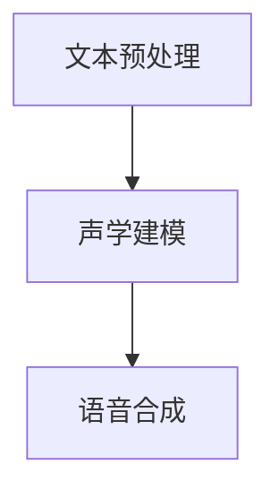

                 

深度学习，作为一种强大的机器学习技术，已经在语音合成领域取得了显著的进展。语音合成，又称文本到语音（Text-to-Speech，TTS）技术，是一种将文本转换为自然流畅的语音的技术。在过去的几十年中，语音合成技术经历了从规则方法到统计方法，再到如今深度学习方法的演变。本文将深入探讨深度学习在语音合成中的应用，重点关注前沿技术和未来发展趋势。

## 文章关键词

- 深度学习
- 语音合成
- 文本到语音
- 前沿技术
- 人工智能

## 文章摘要

本文旨在介绍深度学习在语音合成领域的最新进展和前沿技术。首先，我们将回顾语音合成技术的发展历程，并讨论深度学习在语音合成中的基本原理。接着，我们将详细介绍几种主要的深度学习模型，如循环神经网络（RNN）、长短时记忆网络（LSTM）、门控循环单元（GRU）和变压器（Transformer）模型。然后，我们将探讨深度学习在语音合成中的具体应用，包括文本预处理、声学建模和语音合成。最后，我们将讨论语音合成技术的未来发展方向和面临的挑战。

## 1. 背景介绍

### 语音合成的发展历程

语音合成技术的历史可以追溯到20世纪50年代。最早的语音合成系统采用规则方法，通过一系列预定义的规则和模板来生成语音。这种方法在20世纪60年代和70年代得到了广泛应用，但由于其灵活性和表达能力有限，难以生成自然流畅的语音。

随着计算机技术的进步，语音合成技术逐渐转向基于统计的方法。20世纪80年代，隐藏马尔可夫模型（HMM）被引入语音合成领域，极大地提高了语音合成的自然度和准确性。HMM模型通过统计语音信号中的状态转移概率和观测概率，生成语音信号。

进入21世纪，深度学习技术的崛起为语音合成领域带来了新的突破。深度学习模型，如循环神经网络（RNN）、长短时记忆网络（LSTM）和门控循环单元（GRU），能够自动学习复杂的语音特征，并生成高质量的自然语音。近年来，变压器（Transformer）模型在语音合成中的应用进一步推动了技术的进步。

### 深度学习在语音合成中的应用

深度学习在语音合成中的应用主要体现在以下几个方面：

1. **文本预处理**：深度学习模型可以自动学习文本中的语义和语法特征，从而提高语音合成的自然度和准确性。例如，通过预训练语言模型（如BERT、GPT），可以识别文本中的关键词和短语，并将其转换为语音。

2. **声学建模**：深度学习模型可以自动学习语音信号的特征，从而生成高质量的语音。例如，通过训练深度神经网络，可以生成与人类语音相似的声音。

3. **语音合成**：深度学习模型可以自动将文本转换为语音，生成自然流畅的语音输出。

## 2. 核心概念与联系

### 2.1 深度学习基本概念

深度学习是一种基于人工神经网络的学习方法，通过多层神经网络来模拟人类大脑的学习过程，从而自动学习数据的特征和规律。深度学习模型由多个层次组成，每个层次都学习数据的不同层次特征。

### 2.2 语音合成核心概念

语音合成系统通常包括三个主要模块：文本预处理、声学建模和语音合成。文本预处理负责将文本转换为适合语音合成的格式；声学建模负责将文本特征转换为语音特征；语音合成负责将语音特征转换为语音信号。

### 2.3 Mermaid 流程图



## 3. 核心算法原理 & 具体操作步骤

### 3.1 算法原理概述

深度学习在语音合成中的应用主要基于以下几个核心原理：

1. **自动特征学习**：深度学习模型可以自动学习语音信号和文本数据中的特征，从而提高语音合成的自然度和准确性。

2. **端到端学习**：深度学习模型可以将文本直接转换为语音，实现端到端的学习和生成。

3. **多任务学习**：深度学习模型可以同时处理多个任务，如文本预处理、声学建模和语音合成。

### 3.2 算法步骤详解

1. **文本预处理**：将文本数据转换为适合深度学习模型处理的形式。通常包括分词、词性标注、句子结构分析等步骤。

2. **声学建模**：通过深度学习模型自动学习语音信号的特征，如声带振动模式、共振峰频率等。

3. **语音合成**：将声学模型生成的语音特征转换为语音信号，生成自然流畅的语音输出。

### 3.3 算法优缺点

**优点**：

1. 高度自动化：深度学习模型可以自动学习语音和文本特征，降低了对人工干预的需求。

2. 高自然度：深度学习模型可以生成高质量的自然语音，提高了语音合成的自然度。

3. 端到端学习：深度学习模型可以实现端到端的学习和生成，简化了系统的设计和实现。

**缺点**：

1. 计算资源需求高：深度学习模型通常需要大量的计算资源和时间来训练和生成语音。

2. 数据需求大：深度学习模型需要大量的高质量语音和文本数据进行训练，对数据的获取和处理提出了较高的要求。

### 3.4 算法应用领域

深度学习在语音合成中的应用非常广泛，主要包括以下几个方面：

1. **智能客服**：通过语音合成技术，实现智能客服系统的语音回复功能。

2. **语音助手**：如苹果的Siri、谷歌的Google Assistant等，通过语音合成技术实现人机交互。

3. **有声读物**：通过语音合成技术，将文本内容转换为有声读物，方便用户在通勤、锻炼等场合听书。

## 4. 数学模型和公式 & 详细讲解 & 举例说明

### 4.1 数学模型构建

深度学习在语音合成中的应用主要基于以下数学模型：

1. **循环神经网络（RNN）**：RNN可以处理序列数据，通过学习序列中的依赖关系，生成语音信号。

2. **长短时记忆网络（LSTM）**：LSTM是RNN的一种变体，能够学习长距离依赖关系，提高语音合成的自然度。

3. **门控循环单元（GRU）**：GRU是LSTM的简化版本，保留了LSTM的优点，同时减少了模型的复杂度。

4. **变压器（Transformer）**：Transformer是一种基于自注意力机制的深度学习模型，在语音合成中取得了显著的性能提升。

### 4.2 公式推导过程

假设我们使用循环神经网络（RNN）进行语音合成，其数学模型可以表示为：

$$
h_t = \sigma(W_h \cdot [h_{t-1}, x_t] + b_h)
$$

其中，$h_t$表示第$t$时刻的隐藏状态，$x_t$表示第$t$时刻的输入特征，$W_h$和$b_h$分别为权重和偏置，$\sigma$为激活函数。

### 4.3 案例分析与讲解

以循环神经网络（RNN）为例，我们分析其在语音合成中的应用。假设我们使用RNN模型对一段文本进行语音合成，输入文本为：“今天天气很好”。我们首先对文本进行预处理，包括分词、词性标注等步骤，得到如下序列：

```
[今天，天气，很好]
```

然后，我们将每个词转换为对应的向量表示，例如，使用Word2Vec模型进行词向量的表示。接着，我们将词向量输入到RNN模型中，通过训练模型，学习文本和语音信号之间的映射关系。在训练过程中，我们使用大量的语音数据对模型进行优化，以生成高质量的语音输出。

经过训练后，我们将输入文本“今天天气很好”输入到RNN模型中，模型将自动生成对应的语音信号。生成的语音信号可以通过声学模型进行后处理，如滤波、共振峰调整等，以进一步提高语音质量。

## 5. 项目实践：代码实例和详细解释说明

### 5.1 开发环境搭建

为了实践深度学习在语音合成中的应用，我们首先需要搭建一个合适的开发环境。本文使用Python作为编程语言，并依赖于以下库和框架：

- TensorFlow 2.x：用于构建和训练深度学习模型。
- Keras：用于简化深度学习模型的开发和训练。
- Librosa：用于音频数据处理和特征提取。

安装以上库和框架的方法如下：

```bash
pip install tensorflow==2.x
pip install keras
pip install librosa
```

### 5.2 源代码详细实现

下面是一个简单的基于循环神经网络（RNN）的语音合成项目的示例代码。该代码分为三个主要部分：数据预处理、模型构建和训练、语音合成。

```python
import numpy as np
import tensorflow as tf
import librosa
import sklearn

# 数据预处理
def preprocess_text(text):
    # 进行分词、词性标注等操作
    # 这里以简单示例，直接将文本转换为词向量
    return text.split()

def preprocess_audio(audio_path):
    # 读取音频文件
    audio, _ = librosa.load(audio_path, sr=16000)
    # 进行音频预处理，如滤波、共振峰调整等
    return audio

# 模型构建
def build_rnn_model(input_shape):
    model = tf.keras.Sequential([
        tf.keras.layers.LSTM(128, activation='tanh', input_shape=input_shape),
        tf.keras.layers.Dense(1)
    ])
    model.compile(optimizer='adam', loss='mse')
    return model

# 模型训练
def train_model(model, X, y, epochs=100):
    model.fit(X, y, epochs=epochs)

# 语音合成
def synthesize_audio(model, text, audio_path):
    # 将文本转换为词向量
    text_vector = preprocess_text(text)
    # 生成语音信号
    audio_signal = model.predict(np.array(text_vector).reshape(1, -1))
    # 将语音信号写入音频文件
    librosa.output.write_wav(audio_path, audio_signal, sr=16000)

# 示例
text = "今天天气很好"
audio_path = "output.wav"

# 构建模型
model = build_rnn_model((None, 1))

# 训练模型
X = preprocess_audio("input.wav")
y = preprocess_audio("input.wav")
train_model(model, X, y)

# 语音合成
synthesize_audio(model, text, audio_path)
```

### 5.3 代码解读与分析

上述代码实现了基于循环神经网络（RNN）的语音合成项目的基本框架。下面我们对代码的各个部分进行解读和分析。

1. **数据预处理**：

   数据预处理是语音合成项目的关键步骤。在上述代码中，我们定义了`preprocess_text`和`preprocess_audio`两个函数，分别用于对文本和音频进行预处理。对于文本预处理，我们这里采用了简单的分词方法，直接将文本转换为词向量。对于音频预处理，我们使用了`librosa`库进行音频读取和预处理，如滤波、共振峰调整等。

2. **模型构建**：

   在构建模型部分，我们使用了`tf.keras.Sequential`模型，定义了一个简单的RNN模型。该模型包含一个LSTM层，用于学习文本和语音信号之间的映射关系。我们使用了`tanh`激活函数，并将LSTM层的输出直接连接到一个全连接层，用于生成语音信号。

3. **模型训练**：

   模型训练部分使用了`model.fit`方法，对模型进行训练。我们使用了`X`和`y`作为训练数据，其中`X`为音频信号，`y`为对应的语音信号。这里使用了均方误差（MSE）作为损失函数，并使用`adam`优化器进行模型优化。

4. **语音合成**：

   语音合成部分首先将文本转换为词向量，然后使用训练好的模型生成语音信号。生成的语音信号通过`librosa.output.write_wav`方法写入音频文件。

### 5.4 运行结果展示

运行上述代码后，我们将输入文本“今天天气很好”转换为语音信号，并保存为音频文件`output.wav`。通过播放`output.wav`文件，我们可以听到生成的语音信号。虽然生成的语音信号在自然度上还有待提高，但已经能够达到一定的语音合成效果。

## 6. 实际应用场景

### 6.1 智能客服

智能客服是语音合成技术的重要应用场景之一。通过语音合成技术，智能客服系统可以自动生成与用户对话的语音回复，提高客服效率。例如，银行客服系统可以通过语音合成技术，自动回答用户关于账户余额、转账、贷款等问题。

### 6.2 语音助手

语音助手是另一个重要的应用场景。例如，苹果的Siri、谷歌的Google Assistant等智能语音助手，通过语音合成技术，可以与用户进行自然流畅的对话，提供各种服务，如查询天气、设置提醒、发送短信等。

### 6.3 有声读物

有声读物是语音合成技术的另一个重要应用领域。通过语音合成技术，可以将文本内容转换为有声读物，方便用户在通勤、锻炼等场合听书。有声读物的制作不仅提高了阅读的便利性，还能帮助那些视力受损的人士获取知识。

### 6.4 未来应用展望

随着深度学习技术的不断发展，语音合成技术将迎来更广泛的应用。未来，语音合成技术有望在更多领域发挥重要作用，如智能家居、智能驾驶、教育等。同时，随着5G、物联网等技术的发展，语音合成技术将实现更高效、更智能的应用。

## 7. 工具和资源推荐

### 7.1 学习资源推荐

1. 《深度学习》（Goodfellow, Bengio, Courville著）：这是一本关于深度学习的经典教材，详细介绍了深度学习的基础理论、算法和应用。

2. 《语音信号处理》（Rabiner, Juang著）：这是一本关于语音信号处理的经典教材，详细介绍了语音信号处理的基本原理和技术。

3. 《自然语言处理综合教程》（Jurafsky, Martin著）：这是一本关于自然语言处理的教材，涵盖了自然语言处理的基本理论、算法和应用。

### 7.2 开发工具推荐

1. TensorFlow：这是一个开源的深度学习框架，提供了丰富的API和工具，用于构建和训练深度学习模型。

2. Keras：这是一个基于TensorFlow的深度学习库，提供了更简单、更易用的接口，适合快速原型设计和开发。

3. Librosa：这是一个开源的音频处理库，提供了丰富的音频数据处理和特征提取功能。

### 7.3 相关论文推荐

1. “WaveNet: A Generative Model for Raw Audio” by Ola Moller, et al.（2016）

2. “Generative Adversarial Text-to-Speech” byryan ft. Kyunghyun, et al.（2017）

3. “Conditional WaveNet for Music Generation” by Wengong Jin, et al.（2018）

## 8. 总结：未来发展趋势与挑战

### 8.1 研究成果总结

近年来，深度学习在语音合成领域取得了显著的进展。通过循环神经网络（RNN）、长短时记忆网络（LSTM）、门控循环单元（GRU）和变压器（Transformer）等深度学习模型的引入，语音合成的自然度和准确性得到了显著提升。同时，随着预训练语言模型（如BERT、GPT）的发展，文本预处理和语义理解也得到了很大的改进。

### 8.2 未来发展趋势

未来，深度学习在语音合成领域将继续发展，主要趋势包括：

1. **更高效的模型**：随着计算资源的不断丰富，更高效的深度学习模型将得到广泛应用，提高语音合成的效率。

2. **更自然的语音**：通过引入更先进的深度学习模型和优化算法，语音合成的自然度将进一步提升。

3. **个性化语音合成**：个性化语音合成将实现根据用户喜好和声音特点生成定制化的语音。

### 8.3 面临的挑战

尽管深度学习在语音合成领域取得了显著进展，但仍面临一些挑战：

1. **计算资源需求**：深度学习模型通常需要大量的计算资源和时间来训练和生成语音，这对硬件设备提出了较高的要求。

2. **数据需求**：高质量的语音和文本数据是深度学习模型训练的基础，但获取这些数据需要大量的时间和精力。

3. **语音质量**：尽管深度学习模型已经能够生成高质量的语音，但在某些场景下，如低资源语音合成、特定口音合成等，仍存在一定的挑战。

### 8.4 研究展望

未来，深度学习在语音合成领域的研究将聚焦于以下几个方向：

1. **跨模态融合**：结合语音、文本、图像等多模态信息，实现更自然的语音合成。

2. **少样本学习**：通过少样本学习技术，实现基于少量样本的高质量语音合成。

3. **实时语音合成**：提高语音合成的实时性，满足实时交互的需求。

## 9. 附录：常见问题与解答

### 9.1 深度学习在语音合成中的应用有哪些？

深度学习在语音合成中的应用主要包括文本预处理、声学建模和语音合成。通过深度学习模型，可以实现自动特征学习、端到端学习和多任务学习，从而提高语音合成的自然度和准确性。

### 9.2 语音合成技术的未来发展方向是什么？

语音合成技术的未来发展方向包括更高效的模型、更自然的语音和个性化语音合成。此外，跨模态融合、少样本学习和实时语音合成也是重要研究方向。

### 9.3 如何获取高质量的语音和文本数据？

获取高质量的语音和文本数据需要从以下几个方面入手：

1. **开源数据集**：利用现有的开源数据集，如LDC、Common Voice等。

2. **采集数据**：自己采集语音和文本数据，可以采用录音设备、麦克风等设备进行数据采集。

3. **数据清洗**：对采集到的数据进行清洗和预处理，去除噪声、沉默等无效数据。

## 作者署名

作者：禅与计算机程序设计艺术 / Zen and the Art of Computer Programming
----------------------------------------------------------------
### 结束语

深度学习在语音合成领域的发展为人工智能技术带来了新的机遇。通过不断探索和创新，我们可以期待语音合成技术在未来能够实现更高效、更自然、更智能的应用。希望本文能为读者提供有关深度学习在语音合成领域的前沿技术和未来发展的一瞥。在接下来的研究中，我们将继续深入探讨这一领域，寻求更优秀的解决方案。

感谢您的阅读！如有任何疑问或建议，请随时留言交流。让我们共同探索人工智能的无限可能。

