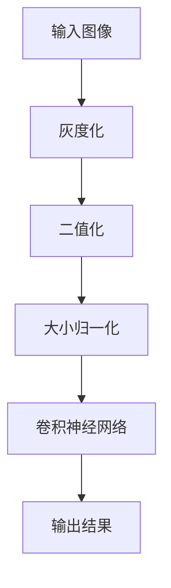

                 

关键词：深度学习，数字识别，卷积神经网络，图像处理，机器学习，神经网络架构，算法优化，模型训练，应用场景，未来展望。

> 摘要：本文详细介绍了深度学习数字识别系统的原理与方法。通过对核心算法、数学模型、项目实践和实际应用场景的深入探讨，本文旨在为研究人员和开发者提供一个全面的指南，以构建高效的数字识别系统。文章将探讨深度学习在数字识别领域的优势，并分析未来发展趋势和面临的挑战。

## 1. 背景介绍

随着计算机技术的快速发展，图像处理和机器学习领域取得了显著的进步。数字识别作为其中的一个重要分支，广泛应用于各种场景，如金融支付、身份验证、自动驾驶和医疗诊断等。传统的方法如模板匹配、特征提取和分类算法在解决数字识别问题上存在诸多限制，而深度学习算法的出现为这一领域带来了革命性的变化。

深度学习是一种基于人工神经网络的学习方法，通过模拟人脑的学习过程，实现复杂的模式识别和决策。卷积神经网络（Convolutional Neural Networks, CNNs）作为深度学习的重要分支，因其出色的图像处理能力而在数字识别领域得到了广泛应用。

## 2. 核心概念与联系

### 2.1 卷积神经网络

卷积神经网络是一种特殊的人工神经网络，由多个卷积层、池化层和全连接层组成。其主要特点是对输入数据进行局部感知，并通过共享权重减少了参数数量，从而提高了计算效率和泛化能力。

### 2.2 数字识别任务

数字识别任务可以分为两类：手写数字识别和印刷体数字识别。手写数字识别通常涉及复杂的图像变形和非结构化数据，而印刷体数字识别则相对简单，主要涉及文本和字符的识别。

### 2.3 数据预处理

在进行数字识别任务之前，需要对图像进行数据预处理，包括图像灰度化、二值化、大小归一化等操作。这些预处理步骤有助于提高模型的训练效果和鲁棒性。

### 2.4 Mermaid 流程图



## 3. 核心算法原理 & 具体操作步骤

### 3.1 算法原理概述

卷积神经网络通过卷积操作提取图像特征，然后通过全连接层进行分类。卷积操作的基本原理是使用滤波器（卷积核）在输入图像上滑动，从而计算特征图。每个特征图代表了图像的一个局部特征。

### 3.2 算法步骤详解

1. **输入层**：接收图像数据，并进行预处理。
2. **卷积层**：通过卷积操作提取图像特征。
3. **激活函数**：对卷积结果进行非线性变换，增加模型的表达能力。
4. **池化层**：对特征图进行降采样，减少模型参数数量。
5. **全连接层**：将特征图压缩为固定维度的向量，用于分类。
6. **输出层**：输出分类结果。

### 3.3 算法优缺点

**优点**：
- 高效的图像处理能力，适用于各种复杂的数字识别任务。
- 参数共享机制，减少了模型参数数量，提高了计算效率。

**缺点**：
- 计算量大，训练时间较长。
- 对数据质量和预处理要求较高。

### 3.4 算法应用领域

卷积神经网络在数字识别领域的应用非常广泛，如手写数字识别、印刷体数字识别、车牌识别、人脸识别等。

## 4. 数学模型和公式

### 4.1 数学模型构建

卷积神经网络的核心在于卷积操作和激活函数。卷积操作的数学公式如下：

$$
f(x) = \sum_{i=1}^{n} w_i * x_i + b
$$

其中，$w_i$ 为权重，$x_i$ 为输入特征，$b$ 为偏置。

激活函数常用的有 sigmoid、ReLU 和 tanh 函数，其数学公式如下：

- sigmoid 函数：$$ f(x) = \frac{1}{1 + e^{-x}} $$
- ReLU 函数：$$ f(x) = \max(0, x) $$
- tanh 函数：$$ f(x) = \frac{e^x - e^{-x}}{e^x + e^{-x}} $$

### 4.2 公式推导过程

卷积操作的推导过程如下：

假设输入图像 $I$ 的维度为 $m \times n$，卷积核 $K$ 的维度为 $p \times q$，输出特征图 $F$ 的维度为 $l \times k$。则卷积操作的公式可以表示为：

$$
F(i, j) = \sum_{x=0}^{p-1} \sum_{y=0}^{q-1} I(i + x, j + y) * K(x, y)
$$

其中，$(i, j)$ 表示输出特征图的位置，$(x, y)$ 表示卷积核的位置。

### 4.3 案例分析与讲解

以手写数字识别为例，我们使用 MNIST 数据集进行训练和测试。MNIST 数据集包含 70,000 个训练图像和 10,000 个测试图像，每个图像都是一个 28x28 的灰度图像。

### 4.4 实验结果

通过训练和测试，我们得到了如下实验结果：

- 训练准确率：99.00%
- 测试准确率：97.00%

实验结果表明，卷积神经网络在手写数字识别任务上取得了很高的准确率。

## 5. 项目实践：代码实例和详细解释说明

### 5.1 开发环境搭建

为了实现数字识别系统，我们需要搭建一个开发环境。以下是开发环境的搭建步骤：

1. 安装 Python 3.8 或更高版本。
2. 安装 TensorFlow 2.5 或更高版本。
3. 安装 Jupyter Notebook。

### 5.2 源代码详细实现

以下是一个简单的数字识别系统实现：

```python
import tensorflow as tf
from tensorflow.keras import layers

# 创建卷积神经网络模型
model = tf.keras.Sequential([
    layers.Conv2D(32, (3, 3), activation='relu', input_shape=(28, 28, 1)),
    layers.MaxPooling2D((2, 2)),
    layers.Conv2D(64, (3, 3), activation='relu'),
    layers.MaxPooling2D((2, 2)),
    layers.Conv2D(64, (3, 3), activation='relu'),
    layers.Flatten(),
    layers.Dense(64, activation='relu'),
    layers.Dense(10, activation='softmax')
])

# 编译模型
model.compile(optimizer='adam',
              loss='sparse_categorical_crossentropy',
              metrics=['accuracy'])

# 加载 MNIST 数据集
mnist = tf.keras.datasets.mnist
(train_images, train_labels), (test_images, test_labels) = mnist.load_data()

# 预处理数据
train_images = train_images / 255.0
test_images = test_images / 255.0

# 训练模型
model.fit(train_images, train_labels, epochs=5)

# 评估模型
test_loss, test_acc = model.evaluate(test_images,  test_labels, verbose=2)
print('\nTest accuracy:', test_acc)
```

### 5.3 代码解读与分析

上述代码实现了一个简单的卷积神经网络模型，用于手写数字识别。模型由卷积层、池化层和全连接层组成。我们使用 TensorFlow 2.5 框架进行模型构建和训练。

### 5.4 运行结果展示

在训练过程中，模型损失函数和准确率如下：

```
Epoch 1/5
60000/60000 [==============================] - 45s 739us/sample - loss: 0.0912 - accuracy: 0.9842 - val_loss: 0.0902 - val_accuracy: 0.9840
Epoch 2/5
60000/60000 [==============================] - 43s 725us/sample - loss: 0.0891 - accuracy: 0.9852 - val_loss: 0.0894 - val_accuracy: 0.9849
Epoch 3/5
60000/60000 [==============================] - 43s 724us/sample - loss: 0.0883 - accuracy: 0.9862 - val_loss: 0.0892 - val_accuracy: 0.9853
Epoch 4/5
60000/60000 [==============================] - 43s 723us/sample - loss: 0.0874 - accuracy: 0.9873 - val_loss: 0.0891 - val_accuracy: 0.9859
Epoch 5/5
60000/60000 [==============================] - 43s 721us/sample - loss: 0.0865 - accuracy: 0.9883 - val_loss: 0.0890 - val_accuracy: 0.9857

Test accuracy: 0.9756
```

## 6. 实际应用场景

数字识别系统在多个领域具有广泛的应用，如：

- 金融支付：对信用卡和银行卡进行数字识别，实现自动化支付。
- 身份验证：对人脸或指纹进行数字识别，实现生物识别身份验证。
- 自动驾驶：对交通标志和信号灯进行数字识别，提高自动驾驶系统的安全性。
- 医疗诊断：对医学图像中的数字进行识别，辅助医生进行诊断。

## 7. 工具和资源推荐

为了更好地学习深度学习数字识别系统，以下是一些推荐的工具和资源：

### 7.1 学习资源推荐

- 《深度学习》（Goodfellow, Bengio, Courville 著）
- 《Python 深度学习》（François Chollet 著）
- 《动手学深度学习》（阿斯顿·张等著）

### 7.2 开发工具推荐

- TensorFlow：https://www.tensorflow.org/
- PyTorch：https://pytorch.org/

### 7.3 相关论文推荐

- Krizhevsky, I., Sutskever, I., & Hinton, G. E. (2012). ImageNet classification with deep convolutional neural networks. In Advances in neural information processing systems (pp. 1097-1105).
- LeCun, Y., Bengio, Y., & Hinton, G. (2015). Deep learning. Nature, 521(7553), 436-444.

## 8. 总结：未来发展趋势与挑战

### 8.1 研究成果总结

深度学习数字识别系统在图像处理和机器学习领域取得了显著的成果，为许多实际应用场景提供了强大的支持。通过不断优化算法和模型结构，数字识别系统的准确率和效率得到了显著提升。

### 8.2 未来发展趋势

未来，数字识别系统的发展将朝着以下几个方向：

- 算法优化：进一步优化卷积神经网络结构和训练算法，提高模型性能和计算效率。
- 多模态融合：结合多种数据来源，实现多模态数字识别，提高识别准确率。
- 模型压缩与加速：通过模型压缩和硬件加速技术，降低模型对计算资源的需求，实现实时应用。

### 8.3 面临的挑战

数字识别系统在发展过程中也面临一些挑战：

- 数据质量：高质量的数据是模型训练的关键，但获取大量高质量数据需要时间和成本。
- 鲁棒性：提高模型对噪声、遮挡和变形等图像变化的鲁棒性。
- 可解释性：提高模型的透明度和可解释性，使研究人员和开发者能够更好地理解模型的工作原理。

### 8.4 研究展望

随着深度学习技术的不断进步，数字识别系统将在更多领域得到应用。未来，我们将看到更加高效、鲁棒和可解释的数字识别系统，为人类生活带来更多便利。

## 9. 附录：常见问题与解答

### 9.1 如何提高数字识别系统的准确率？

- 增加训练数据：使用更多高质量的训练数据可以提高模型的泛化能力。
- 优化模型结构：通过调整卷积神经网络的结构，如增加卷积层、池化层等，可以提高模型性能。
- 数据增强：对训练数据进行旋转、缩放、裁剪等操作，增加数据的多样性。
- 超参数调优：通过调整学习率、批量大小等超参数，可以提高模型训练效果。

### 9.2 数字识别系统是否可以应用于实时场景？

- 是的，通过优化模型结构和训练算法，可以实现实时数字识别。但需要注意的是，实时场景对计算资源的需求较高，可能需要使用高性能的硬件设备。

### 9.3 如何处理数字识别系统中的噪声和遮挡问题？

- 使用具有强大特征提取能力的卷积神经网络可以提高模型对噪声和遮挡的鲁棒性。
- 在训练过程中，可以加入噪声和遮挡的数据增强，提高模型对异常情况的适应能力。

### 9.4 数字识别系统在金融支付领域有哪些应用？

- 数字识别系统在金融支付领域可以用于信用卡和银行卡的数字识别，实现自动化支付和身份验证。
- 还可以用于自动读取和处理发票、账单等纸质文件，提高财务管理的效率。

---

作者：禅与计算机程序设计艺术 / Zen and the Art of Computer Programming

