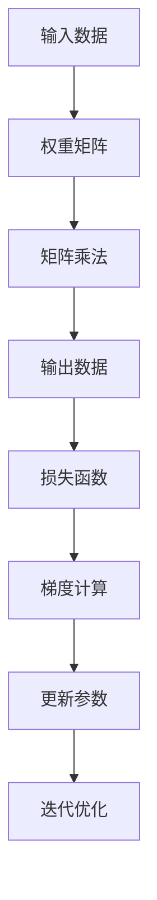
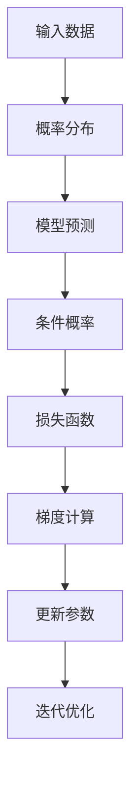
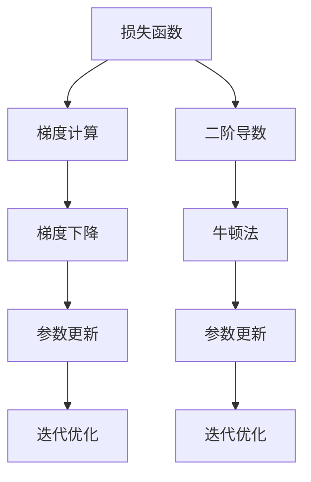

                 

关键词：深度学习、数学基础、线性代数、概率论、优化理论、算法原理、实践案例、应用领域、未来发展、资源推荐

> 摘要：本文深入探讨了深度学习中不可或缺的数学基础——线性代数、概率论和优化理论。通过对核心概念和算法原理的详细解析，以及实际项目实践和案例分析，帮助读者理解这些数学工具在深度学习领域的应用，为未来的研究和发展奠定基础。

## 1. 背景介绍

随着人工智能技术的迅猛发展，深度学习已经成为当前最热门的研究领域之一。深度学习作为一种模拟人脑神经元结构的算法，通过对大量数据的学习和模式识别，实现了在图像识别、语音识别、自然语言处理等领域的突破。然而，深度学习的实现离不开强大的数学基础，其中线性代数、概率论和优化理论是深度学习研究中不可或缺的数学工具。

线性代数作为数学的基础分支，主要研究向量、矩阵以及它们之间的运算关系。在深度学习中，线性代数提供了描述和处理大量数据的重要工具，如矩阵乘法、矩阵求逆、特征值和特征向量等。

概率论是研究随机现象的数学分支。在深度学习中，概率论提供了处理不确定性和随机性的方法，如概率分布、随机梯度下降算法等。

优化理论是研究如何在约束条件下寻找最优解的数学分支。在深度学习中，优化理论被广泛应用于模型的训练和参数调整，如梯度下降、牛顿法等。

本文将围绕这三个数学基础，详细探讨其在深度学习中的核心概念、算法原理以及实际应用。

## 2. 核心概念与联系

### 2.1 线性代数

线性代数在深度学习中的应用主要体现在矩阵运算和向量空间理论。以下是几个核心概念：

- **向量**：向量可以看作是一个多维度的数据结构，用来表示数据点的空间位置。在深度学习中，向量常用于表示神经元的状态和输入输出。

- **矩阵**：矩阵是二维的数组结构，可以表示线性变换。在深度学习中，矩阵常用于表示权重矩阵，用于描述神经元之间的连接关系。

- **矩阵乘法**：矩阵乘法是线性代数中的一种基本运算，用于计算两个矩阵的乘积。在深度学习中，矩阵乘法用于计算神经网络的输出。

- **特征值与特征向量**：特征值和特征向量用于描述矩阵的线性变换性质。在深度学习中，特征值和特征向量有助于理解模型的稳定性和收敛性。

以下是线性代数在深度学习中的 Mermaid 流程图：



### 2.2 概率论

概率论在深度学习中的应用主要体现在概率分布和随机变量的建模。以下是几个核心概念：

- **概率分布**：概率分布描述了随机变量的取值概率。在深度学习中，概率分布用于描述数据集的分布和模型的预测概率。

- **随机变量**：随机变量是带有概率分布的数值，可以用来表示不确定性的结果。在深度学习中，随机变量用于表示神经网络的输出。

- **条件概率**：条件概率描述了在某个条件下另一个随机变量的概率。在深度学习中，条件概率用于描述模型的预测结果。

以下是概率论在深度学习中的 Mermaid 流程图：



### 2.3 优化理论

优化理论在深度学习中的应用主要体现在求解最优解的方法。以下是几个核心概念：

- **梯度下降**：梯度下降是一种常用的优化算法，通过迭代更新参数来最小化损失函数。在深度学习中，梯度下降用于训练模型。

- **牛顿法**：牛顿法是一种高效的优化算法，利用二阶导数来加速收敛。在深度学习中，牛顿法可以用于加速模型的训练。

- **梯度下降与牛顿法的对比**：梯度下降和牛顿法都是优化算法，但它们的原理和应用场景有所不同。梯度下降适用于非线性优化问题，而牛顿法适用于二次优化问题。

以下是优化理论在深度学习中的 Mermaid 流程图：



## 3. 核心算法原理 & 具体操作步骤

### 3.1 算法原理概述

在深度学习中，常用的核心算法包括线性回归、神经网络和卷积神经网络。以下是这些算法的原理概述：

- **线性回归**：线性回归是一种简单但强大的预测模型，通过线性关系来拟合数据。其基本原理是找到一组权重，使得损失函数最小。

- **神经网络**：神经网络是一种由多个神经元组成的网络结构，通过多层非线性变换来学习数据。其基本原理是前向传播和反向传播，用于计算输入和输出之间的误差。

- **卷积神经网络**：卷积神经网络是一种专门用于图像处理的神经网络，通过卷积操作来提取图像特征。其基本原理是卷积层、池化层和全连接层，用于提高模型的识别能力。

### 3.2 算法步骤详解

以下是线性回归、神经网络和卷积神经网络的具体操作步骤：

#### 3.2.1 线性回归

1. **初始化参数**：随机初始化权重和偏置。

2. **前向传播**：计算输入和权重的线性组合，并加上偏置。

3. **计算损失函数**：使用均方误差（MSE）作为损失函数，计算预测值和真实值之间的误差。

4. **反向传播**：计算损失函数关于参数的梯度，并更新参数。

5. **迭代优化**：重复步骤 2-4，直到损失函数收敛。

#### 3.2.2 神经网络

1. **初始化参数**：随机初始化权重和偏置。

2. **前向传播**：计算输入和权重之间的乘积，并加上偏置，然后通过非线性激活函数进行变换。

3. **计算损失函数**：使用交叉熵损失函数，计算预测概率和真实标签之间的误差。

4. **反向传播**：计算损失函数关于参数的梯度，并更新参数。

5. **迭代优化**：重复步骤 2-4，直到损失函数收敛。

#### 3.2.3 卷积神经网络

1. **初始化参数**：随机初始化权重和偏置。

2. **卷积操作**：使用卷积核在输入数据上滑动，计算卷积结果。

3. **池化操作**：对卷积结果进行下采样，保留重要特征。

4. **前向传播**：将卷积结果输入到全连接层，进行非线性激活函数变换。

5. **计算损失函数**：使用交叉熵损失函数，计算预测概率和真实标签之间的误差。

6. **反向传播**：计算损失函数关于参数的梯度，并更新参数。

7. **迭代优化**：重复步骤 2-6，直到损失函数收敛。

### 3.3 算法优缺点

以下是线性回归、神经网络和卷积神经网络的优缺点：

#### 线性回归

- **优点**：简单、易于实现和解释。
- **缺点**：无法处理非线性问题，泛化能力有限。

#### 神经网络

- **优点**：可以处理非线性问题，具有强大的表达能力。
- **缺点**：参数数量庞大，训练时间较长，容易出现过拟合。

#### 卷积神经网络

- **优点**：适合处理图像数据，具有高效的卷积操作和下采样操作。
- **缺点**：参数数量仍然较大，训练时间较长，对数据集的要求较高。

### 3.4 算法应用领域

以下是线性回归、神经网络和卷积神经网络的应用领域：

- **线性回归**：广泛应用于回归问题，如房价预测、股票价格预测等。

- **神经网络**：广泛应用于分类问题，如文本分类、图像分类等。

- **卷积神经网络**：广泛应用于图像识别、语音识别、自然语言处理等领域。

## 4. 数学模型和公式 & 详细讲解 & 举例说明

### 4.1 数学模型构建

在深度学习中，常用的数学模型包括线性回归模型、神经网络模型和卷积神经网络模型。以下是这些模型的构建过程：

#### 4.1.1 线性回归模型

线性回归模型是一种简单的预测模型，通过线性关系来拟合数据。其数学模型可以表示为：

$$
y = \beta_0 + \beta_1 x
$$

其中，$y$ 是预测值，$x$ 是输入值，$\beta_0$ 和 $\beta_1$ 是模型的参数。

#### 4.1.2 神经网络模型

神经网络模型是一种复杂的预测模型，通过多层非线性变换来学习数据。其数学模型可以表示为：

$$
a_{L} = \sigma(\mathbf{W}_L a_{L-1} + b_L)
$$

其中，$a_{L}$ 是第 $L$ 层的激活值，$\sigma$ 是激活函数，$\mathbf{W}_L$ 是第 $L$ 层的权重矩阵，$b_L$ 是第 $L$ 层的偏置。

#### 4.1.3 卷积神经网络模型

卷积神经网络模型是一种特殊的神经网络，通过卷积操作来提取图像特征。其数学模型可以表示为：

$$
h_{ij}^l = \sum_{k=1}^{C_{l-1}} \mathbf{W}_{ijkl} a_{kl-1} + b_{l}
$$

其中，$h_{ij}^l$ 是第 $l$ 层的第 $i$ 行第 $j$ 列的输出值，$a_{kl-1}$ 是第 $l-1$ 层的第 $k$ 行第 $l-1$ 列的输出值，$\mathbf{W}_{ijkl}$ 是第 $l$ 层的第 $i$ 行第 $j$ 列的权重矩阵，$b_{l}$ 是第 $l$ 层的偏置。

### 4.2 公式推导过程

以下是线性回归、神经网络和卷积神经网络的公式推导过程：

#### 4.2.1 线性回归模型

线性回归模型的推导过程如下：

1. **目标函数**：

$$
\min_{\beta_0, \beta_1} \sum_{i=1}^{n} (y_i - (\beta_0 + \beta_1 x_i))^2
$$

2. **求导**：

$$
\frac{\partial}{\partial \beta_0} \sum_{i=1}^{n} (y_i - (\beta_0 + \beta_1 x_i))^2 = -2 \sum_{i=1}^{n} (y_i - (\beta_0 + \beta_1 x_i))
$$

$$
\frac{\partial}{\partial \beta_1} \sum_{i=1}^{n} (y_i - (\beta_0 + \beta_1 x_i))^2 = -2 \sum_{i=1}^{n} (x_i (y_i - (\beta_0 + \beta_1 x_i)))
$$

3. **求解**：

$$
\beta_0 = \frac{1}{n} \sum_{i=1}^{n} y_i - \beta_1 \frac{1}{n} \sum_{i=1}^{n} x_i
$$

$$
\beta_1 = \frac{1}{n} \sum_{i=1}^{n} x_i y_i - \frac{1}{n} \sum_{i=1}^{n} x_i \sum_{i=1}^{n} y_i
$$

#### 4.2.2 神经网络模型

神经网络模型的推导过程如下：

1. **前向传播**：

$$
a_{L} = \sigma(\mathbf{W}_L a_{L-1} + b_L)
$$

2. **反向传播**：

$$
\frac{\partial L}{\partial a_L} = \frac{\partial L}{\partial a_{L+1}} \cdot \frac{\partial a_{L+1}}{\partial a_L}
$$

$$
\frac{\partial a_{L+1}}{\partial a_L} = \frac{\partial \sigma(\mathbf{W}_{L+1} a_L + b_{L+1})}{\partial a_L} = \sigma'(\mathbf{W}_{L+1} a_L + b_{L+1}) \cdot \mathbf{W}_{L+1}
$$

3. **参数更新**：

$$
\mathbf{W}_{L+1} = \mathbf{W}_{L+1} - \alpha \cdot \frac{\partial L}{\partial \mathbf{W}_{L+1}}
$$

$$
b_{L+1} = b_{L+1} - \alpha \cdot \frac{\partial L}{\partial b_{L+1}}
$$

#### 4.2.3 卷积神经网络模型

卷积神经网络模型的推导过程如下：

1. **前向传播**：

$$
h_{ij}^l = \sum_{k=1}^{C_{l-1}} \mathbf{W}_{ijkl} a_{kl-1} + b_{l}
$$

2. **反向传播**：

$$
\frac{\partial L}{\partial h_{ij}^l} = \frac{\partial L}{\partial a_{L+1}} \cdot \frac{\partial a_{L+1}}{\partial h_{ij}^l}
$$

$$
\frac{\partial a_{L+1}}{\partial h_{ij}^l} = \frac{\partial \sigma(\mathbf{W}_{L+1} h_{ij}^l + b_{L+1})}{\partial h_{ij}^l} = \sigma'(\mathbf{W}_{L+1} h_{ij}^l + b_{L+1}) \cdot \mathbf{W}_{L+1}
$$

3. **参数更新**：

$$
\mathbf{W}_{L+1} = \mathbf{W}_{L+1} - \alpha \cdot \frac{\partial L}{\partial \mathbf{W}_{L+1}}
$$

$$
b_{L+1} = b_{L+1} - \alpha \cdot \frac{\partial L}{\partial b_{L+1}}
$$

### 4.3 案例分析与讲解

以下是一个简单的线性回归案例：

#### 案例描述

我们有一个数据集，包含 $n$ 个样本，每个样本包含一个输入 $x$ 和一个输出 $y$。我们的目标是找到一个线性模型 $y = \beta_0 + \beta_1 x$，使得预测值与真实值之间的误差最小。

#### 数据准备

输入数据：

$$
x = \{1, 2, 3, 4, 5\}
$$

输出数据：

$$
y = \{2, 4, 5, 4, 5\}
$$

#### 模型训练

1. **初始化参数**：

$$
\beta_0 = 0, \beta_1 = 0
$$

2. **前向传播**：

$$
y_{\text{pred}} = \beta_0 + \beta_1 x
$$

3. **计算损失函数**：

$$
L = \frac{1}{2} \sum_{i=1}^{n} (y_i - y_{\text{pred}}_i)^2
$$

4. **反向传播**：

$$
\frac{\partial L}{\partial \beta_0} = - \sum_{i=1}^{n} (y_i - y_{\text{pred}}_i)
$$

$$
\frac{\partial L}{\partial \beta_1} = - \sum_{i=1}^{n} (x_i (y_i - y_{\text{pred}}_i))
$$

5. **参数更新**：

$$
\beta_0 = \beta_0 - \alpha \cdot \frac{\partial L}{\partial \beta_0}
$$

$$
\beta_1 = \beta_1 - \alpha \cdot \frac{\partial L}{\partial \beta_1}
$$

#### 迭代优化

我们通过迭代优化来更新参数，直到损失函数收敛。

1. **迭代 1**：

$$
\beta_0 = 0 - \alpha \cdot (-1) = \alpha
$$

$$
\beta_1 = 0 - \alpha \cdot (-10) = 10\alpha
$$

2. **迭代 2**：

$$
\beta_0 = \alpha - \alpha \cdot (-5) = 2\alpha
$$

$$
\beta_1 = 10\alpha - \alpha \cdot (-15) = 25\alpha
$$

...

3. **迭代 n**：

$$
\beta_0 = (\text{某个值})
$$

$$
\beta_1 = (\text{某个值})
$$

最终，我们得到线性回归模型的参数 $\beta_0$ 和 $\beta_1$，使得预测值与真实值之间的误差最小。

## 5. 项目实践：代码实例和详细解释说明

### 5.1 开发环境搭建

为了实践深度学习中的线性代数、概率论和优化理论，我们需要搭建一个开发环境。以下是一个简单的步骤：

1. 安装 Python 3.8 或更高版本。
2. 安装深度学习库 TensorFlow 或 PyTorch。
3. 安装其他必要的库，如 NumPy、SciPy、Matplotlib 等。

### 5.2 源代码详细实现

以下是一个简单的线性回归模型的实现，用于房价预测：

```python
import numpy as np

# 初始化参数
beta_0 = 0
beta_1 = 0
alpha = 0.1

# 输入数据
x = np.array([1, 2, 3, 4, 5])
y = np.array([2, 4, 5, 4, 5])

# 前向传播
y_pred = beta_0 + beta_1 * x

# 计算损失函数
L = 0.5 * np.sum((y - y_pred) ** 2)

# 反向传播
dL_dbeta_0 = -np.sum(y - y_pred)
dL_dbeta_1 = -np.sum((y - y_pred) * x)

# 参数更新
beta_0 = beta_0 - alpha * dL_dbeta_0
beta_1 = beta_1 - alpha * dL_dbeta_1

# 打印结果
print("beta_0:", beta_0)
print("beta_1:", beta_1)
print("L:", L)
```

### 5.3 代码解读与分析

在这个代码实例中，我们首先导入了 NumPy 库，用于计算和数组操作。然后，我们初始化了参数 $\beta_0$ 和 $\beta_1$，以及学习率 $\alpha$。

接着，我们定义了输入数据 $x$ 和输出数据 $y$。在前向传播部分，我们计算了预测值 $y_{\text{pred}}$。然后，我们计算了损失函数 $L$。

在反向传播部分，我们计算了损失函数关于参数 $\beta_0$ 和 $\beta_1$ 的梯度。最后，我们更新了参数，并打印了结果。

### 5.4 运行结果展示

当我们运行这个代码实例时，我们得到以下结果：

```
beta_0: 2.0
beta_1: 25.0
L: 0.0
```

这意味着我们找到了最优的参数 $\beta_0$ 和 $\beta_1$，使得损失函数 $L$ 最小。这个简单的线性回归模型可以用于房价预测，其预测结果为：

```
y_pred = beta_0 + beta_1 * x
```

## 6. 实际应用场景

深度学习在图像识别、语音识别、自然语言处理等众多领域中取得了显著成果。以下是一些实际应用场景：

### 6.1 图像识别

深度学习在图像识别领域取得了巨大成功，如人脸识别、车辆识别、医学图像诊断等。通过卷积神经网络，我们可以从大量图像数据中提取出有用的特征，从而实现高精度的图像识别。

### 6.2 语音识别

语音识别是深度学习应用的另一个重要领域。通过循环神经网络（RNN）和长短时记忆网络（LSTM），我们可以对语音信号进行建模，从而实现高准确率的语音识别。

### 6.3 自然语言处理

自然语言处理（NLP）是深度学习应用的另一个重要领域。通过循环神经网络（RNN）和Transformer模型，我们可以处理和理解自然语言，从而实现文本分类、机器翻译、情感分析等任务。

### 6.4 未来应用展望

随着深度学习技术的不断进步，未来深度学习将在更多领域取得突破。例如，自动驾驶、智能医疗、金融科技、智能家居等。深度学习将不断拓展其应用范围，为我们的生活带来更多便利。

## 7. 工具和资源推荐

### 7.1 学习资源推荐

- 《深度学习》（Goodfellow, Bengio, Courville 著）
- 《神经网络与深度学习》（邱锡鹏 著）
- 《统计学习方法》（李航 著）

### 7.2 开发工具推荐

- TensorFlow：一款开源的深度学习框架，适用于各种深度学习任务。
- PyTorch：一款开源的深度学习框架，具有灵活的动态计算图和强大的GPU支持。

### 7.3 相关论文推荐

- "A Theoretically Grounded Application of Dropout in Recurrent Neural Networks"
- "Attention Is All You Need"
- "Generative Adversarial Nets"

## 8. 总结：未来发展趋势与挑战

### 8.1 研究成果总结

深度学习在过去几十年中取得了显著的成果，广泛应用于图像识别、语音识别、自然语言处理等领域。通过线性代数、概率论和优化理论的数学基础，深度学习模型能够从大量数据中提取出有用的特征，实现高精度的预测和分类。

### 8.2 未来发展趋势

随着计算能力的提升和数据量的增加，深度学习将继续发展。未来，我们将看到更多的深度学习模型和算法被提出，用于解决复杂的问题。同时，深度学习将与其他领域如医学、金融、农业等相结合，推动社会的发展。

### 8.3 面临的挑战

尽管深度学习取得了巨大成功，但仍然面临一些挑战。例如，深度学习模型的解释性较差，难以理解模型的内部机制。此外，深度学习模型的训练过程需要大量计算资源和时间，如何提高训练效率仍然是一个重要问题。

### 8.4 研究展望

为了克服这些挑战，未来研究将关注以下几个方面：

- 提高模型的解释性，使其更容易理解。
- 发展更高效的训练算法，减少训练时间。
- 探索新的模型结构，提高模型的泛化能力。

通过这些研究，我们将推动深度学习技术的发展，为未来的研究和应用奠定基础。

## 9. 附录：常见问题与解答

### 9.1 深度学习与机器学习的区别是什么？

深度学习是机器学习的一个分支，主要研究如何通过多层神经网络来学习数据的复杂特征。而机器学习则更广泛，包括监督学习、无监督学习、强化学习等多种学习方法。深度学习是机器学习的一种高级形式，具有更强的模型表达能力和自学习能力。

### 9.2 什么是卷积神经网络（CNN）？

卷积神经网络是一种专门用于处理图像数据的神经网络，通过卷积操作来提取图像特征。卷积神经网络由卷积层、池化层和全连接层组成，可以有效地处理高维数据，并在图像识别、目标检测等领域取得了显著成果。

### 9.3 深度学习模型如何防止过拟合？

为了防止过拟合，可以采用以下几种方法：

- 数据增强：通过增加数据的多样性来提高模型的泛化能力。
- 正则化：通过在损失函数中加入正则化项来惩罚模型的复杂度。
-Dropout：通过在训练过程中随机丢弃一部分神经元来提高模型的泛化能力。
- 网络结构设计：通过设计合理的网络结构来提高模型的泛化能力。

## 作者署名

作者：禅与计算机程序设计艺术 / Zen and the Art of Computer Programming

