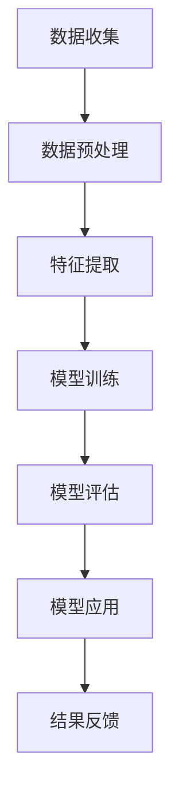

                 

 关键词：深度学习、电商用户行为、预测模型、数据分析、人工智能、个性化推荐

> 摘要：本文将探讨如何利用深度学习技术构建电商用户行为预测模型，通过分析用户行为数据，实现个性化推荐，提高电商平台的服务质量和用户满意度。文章将详细阐述深度学习在电商用户行为预测中的应用，包括核心概念、算法原理、数学模型以及实际案例，为电商行业提供技术参考。

## 1. 背景介绍

随着互联网技术的快速发展，电子商务已经成为人们日常生活中不可或缺的一部分。在电商平台上，用户行为的多样化、个性化需求不断提升，为电商平台提供了丰富的数据资源。如何有效地利用这些数据，挖掘用户行为规律，从而提高用户体验和服务质量，成为电商行业关注的焦点。

深度学习作为人工智能领域的重要技术，具有强大的建模能力和自适应能力，可以处理大规模复杂数据，并在许多领域取得了显著成果。将深度学习应用于电商用户行为预测，可以实现对用户行为的准确预测和个性化推荐，提高电商平台的市场竞争力。

本文旨在探讨如何利用深度学习技术构建电商用户行为预测模型，实现个性化推荐。通过对用户行为的深度挖掘和分析，为企业提供精准的数据支持，助力电商行业的发展。

## 2. 核心概念与联系

### 2.1 深度学习

深度学习是一种人工智能技术，通过构建多层神经网络，自动学习数据的特征和规律。与传统的机器学习方法相比，深度学习具有以下优势：

1. **自动特征提取**：深度学习模型可以通过多层网络自动提取数据的高层次特征，减少人工干预，提高模型的泛化能力。
2. **强大的建模能力**：深度学习模型可以处理大规模、复杂数据，并自动适应不同场景，具有广泛的应用前景。
3. **自适应能力**：深度学习模型可以根据输入数据的分布和变化，动态调整模型参数，提高预测准确性。

### 2.2 电商用户行为

电商用户行为是指用户在电商平台上的各种活动，包括浏览商品、添加购物车、下单购买、评价商品等。用户行为数据通常包含用户基本信息（如年龄、性别、地理位置等）、交易数据（如购买时间、购买商品、购买数量等）、浏览数据（如浏览时长、浏览路径等）。

### 2.3 预测模型

预测模型是指利用历史数据，对未来的用户行为进行预测和分析。在电商领域，预测模型可以用于以下方面：

1. **个性化推荐**：根据用户的兴趣和行为，为用户推荐相关的商品，提高用户满意度和购买转化率。
2. **需求预测**：预测未来的商品需求，为电商平台的库存管理和供应链优化提供支持。
3. **风险控制**：预测用户的购买风险，降低电商平台的欺诈和损失风险。

## 2.4 Mermaid 流程图

下面是电商用户行为预测模型的 Mermaid 流程图，展示深度学习技术在电商用户行为预测中的应用过程：



### 2.5 核心算法原理 & 具体操作步骤

#### 3.1 算法原理概述

电商用户行为预测模型主要采用深度学习技术，通过构建多层神经网络，实现用户行为的自动特征提取和预测。本文主要介绍以下两种深度学习算法：

1. **卷积神经网络（CNN）**：主要用于图像处理和文本分类，可以提取图像和文本的特征。
2. **循环神经网络（RNN）**：主要用于序列数据处理，可以提取时间序列数据的特征。

#### 3.2 算法步骤详解

1. **数据收集**：从电商平台获取用户行为数据，包括用户基本信息、交易数据和浏览数据等。
2. **数据预处理**：对数据进行清洗、去重和归一化处理，确保数据质量。
3. **特征提取**：利用 CNN 和 RNN 算法，自动提取用户行为数据的高层次特征。
4. **模型训练**：将提取的特征输入到神经网络模型中，通过反向传播算法训练模型参数，优化模型性能。
5. **模型评估**：利用测试集评估模型的预测性能，调整模型参数，提高预测准确性。
6. **模型应用**：将训练好的模型应用于实际业务场景，实现个性化推荐和需求预测等功能。
7. **结果反馈**：根据模型的预测结果，为企业提供数据支持和决策依据，优化电商平台的服务质量和用户体验。

#### 3.3 算法优缺点

1. **优点**：
   - 自动提取特征，减少人工干预，提高模型泛化能力。
   - 面向大规模数据，能够处理复杂数据和长序列数据。
   - 预测准确度高，可以为电商企业提供精准的数据支持。

2. **缺点**：
   - 需要大量训练数据和计算资源，训练时间较长。
   - 模型结构复杂，难以解释，不利于业务理解和优化。

#### 3.4 算法应用领域

深度学习驱动的电商用户行为预测模型可以应用于以下领域：

1. **个性化推荐**：根据用户的兴趣和行为，为用户推荐相关的商品，提高用户满意度和购买转化率。
2. **需求预测**：预测未来的商品需求，为电商平台的库存管理和供应链优化提供支持。
3. **风险控制**：预测用户的购买风险，降低电商平台的欺诈和损失风险。
4. **用户行为分析**：分析用户行为数据，挖掘用户需求和市场趋势，为企业提供决策依据。

## 4. 数学模型和公式 & 详细讲解 & 举例说明

### 4.1 数学模型构建

电商用户行为预测模型的数学模型主要由两部分组成：特征提取和预测模型。

1. **特征提取**：

   - **卷积神经网络（CNN）**：
     $$h_{CNN}(x) = \sigma(W_{CNN} \cdot x)$$
     其中，$h_{CNN}(x)$为卷积神经网络提取的特征，$\sigma$为激活函数，$W_{CNN}$为卷积核参数。

   - **循环神经网络（RNN）**：
     $$h_{RNN}(x_t) = \sigma(W_{RNN} \cdot [h_{t-1}, x_t])$$
     其中，$h_{RNN}(x_t)$为循环神经网络提取的特征，$W_{RNN}$为循环神经网络权重矩阵，$[h_{t-1}, x_t]$为输入序列。

2. **预测模型**：

   - **多层感知机（MLP）**：
     $$y = \sigma(W_{MLP} \cdot h_{CNN} + b_{MLP})$$
     其中，$y$为预测结果，$\sigma$为激活函数，$W_{MLP}$为多层感知机权重矩阵，$b_{MLP}$为偏置项。

   - **循环神经网络（RNN）**：
     $$y_t = \sigma(W_{RNN} \cdot h_{RNN}(x_t) + b_{RNN})$$
     其中，$y_t$为预测结果，$\sigma$为激活函数，$W_{RNN}$为循环神经网络权重矩阵，$b_{RNN}$为偏置项。

### 4.2 公式推导过程

电商用户行为预测模型的公式推导过程主要包括两部分：特征提取和预测模型的推导。

1. **特征提取**：

   - **卷积神经网络（CNN）**：

     卷积神经网络的特征提取过程可以表示为：
     $$h_{CNN}(x) = \sigma(W_{CNN} \cdot x)$$
     其中，$x$为输入数据，$W_{CNN}$为卷积核参数，$\sigma$为激活函数。通过卷积运算和池化操作，卷积神经网络可以提取图像和文本的特征。

   - **循环神经网络（RNN）**：

     循环神经网络的特征提取过程可以表示为：
     $$h_{RNN}(x_t) = \sigma(W_{RNN} \cdot [h_{t-1}, x_t])$$
     其中，$x_t$为输入序列，$h_{t-1}$为前一时间步的特征，$W_{RNN}$为循环神经网络权重矩阵，$\sigma$为激活函数。通过递归运算，循环神经网络可以提取时间序列数据的特征。

2. **预测模型**：

   - **多层感知机（MLP）**：

     多层感知机的预测模型可以表示为：
     $$y = \sigma(W_{MLP} \cdot h_{CNN} + b_{MLP})$$
     其中，$h_{CNN}$为卷积神经网络提取的特征，$W_{MLP}$为多层感知机权重矩阵，$b_{MLP}$为偏置项，$\sigma$为激活函数。通过多层感知机，可以实现对用户行为的预测。

   - **循环神经网络（RNN）**：

     循环神经网络的预测模型可以表示为：
     $$y_t = \sigma(W_{RNN} \cdot h_{RNN}(x_t) + b_{RNN})$$
     其中，$h_{RNN}(x_t)$为循环神经网络提取的特征，$W_{RNN}$为循环神经网络权重矩阵，$b_{RNN}$为偏置项，$\sigma$为激活函数。通过循环神经网络，可以实现对用户行为的预测。

### 4.3 案例分析与讲解

为了更好地理解电商用户行为预测模型的公式推导过程，下面通过一个实际案例进行讲解。

假设我们有一个电商用户行为预测模型，输入数据为用户浏览记录，输出数据为用户购买概率。我们可以使用循环神经网络（RNN）来构建这个模型。

1. **特征提取**：

   首先，我们需要对用户浏览记录进行特征提取。假设用户浏览记录为时间序列数据，每个时间步的浏览记录可以表示为一个向量。我们可以使用循环神经网络（RNN）来提取这些时间序列数据的特征。

   假设输入数据为 $x_t = [x_{t1}, x_{t2}, \ldots, x_{tk}]$，其中 $x_{tk}$ 表示用户在时间步 $t$ 的第 $k$ 个浏览记录。

   循环神经网络（RNN）的特征提取过程可以表示为：
   $$h_{RNN}(x_t) = \sigma(W_{RNN} \cdot [h_{t-1}, x_t])$$
   其中，$h_{t-1}$ 为前一时间步的特征，$W_{RNN}$ 为循环神经网络权重矩阵，$\sigma$ 为激活函数。

   通过递归运算，循环神经网络可以提取用户浏览记录的高层次特征。

2. **预测模型**：

   接下来，我们需要使用提取的特征来预测用户购买概率。

   预测模型可以表示为：
   $$y_t = \sigma(W_{RNN} \cdot h_{RNN}(x_t) + b_{RNN})$$
   其中，$y_t$ 为预测结果，$h_{RNN}(x_t)$ 为循环神经网络提取的特征，$W_{RNN}$ 为循环神经网络权重矩阵，$b_{RNN}$ 为偏置项，$\sigma$ 为激活函数。

   通过激活函数，我们可以将提取的特征映射到用户购买概率的范围。

   最终，我们可以通过训练循环神经网络（RNN）模型来预测用户购买概率，从而实现电商用户行为预测。

## 5. 项目实践：代码实例和详细解释说明

### 5.1 开发环境搭建

在开始项目实践之前，我们需要搭建一个合适的开发环境。以下是搭建开发环境所需的软件和工具：

1. **Python**：Python 是一种广泛使用的编程语言，具有良好的数据分析和机器学习库。
2. **TensorFlow**：TensorFlow 是一款由 Google 开发的人工智能框架，适用于构建和训练深度学习模型。
3. **Keras**：Keras 是一款基于 TensorFlow 的简洁易用的深度学习库。
4. **NumPy**：NumPy 是一款用于数值计算的 Python 库。
5. **Pandas**：Pandas 是一款用于数据处理和分析的 Python 库。

安装以上工具和库的方法如下：

```bash
pip install python
pip install tensorflow
pip install keras
pip install numpy
pip install pandas
```

### 5.2 源代码详细实现

以下是电商用户行为预测模型的源代码实现，主要包括数据预处理、模型构建、模型训练和模型评估等步骤。

```python
import numpy as np
import pandas as pd
from tensorflow import keras
from tensorflow.keras.models import Sequential
from tensorflow.keras.layers import Dense, LSTM, Embedding

# 5.2.1 数据预处理

# 读取数据
data = pd.read_csv('user_behavior_data.csv')

# 数据清洗
data.drop_duplicates(inplace=True)
data.fillna(0, inplace=True)

# 分割特征和标签
X = data.drop('purchase', axis=1)
y = data['purchase']

# 将数据转换为二进制编码
X = pd.get_dummies(X)
y = y.astype('int32')

# 划分训练集和测试集
X_train, X_test, y_train, y_test = train_test_split(X, y, test_size=0.2, random_state=42)

# 5.2.2 模型构建

# 创建 LSTM 模型
model = Sequential()
model.add(LSTM(128, activation='tanh', input_shape=(X_train.shape[1], X_train.shape[2])))
model.add(Dense(1, activation='sigmoid'))

# 编译模型
model.compile(optimizer='adam', loss='binary_crossentropy', metrics=['accuracy'])

# 5.2.3 模型训练

# 训练模型
model.fit(X_train, y_train, epochs=10, batch_size=32, validation_split=0.1)

# 5.2.4 模型评估

# 评估模型
loss, accuracy = model.evaluate(X_test, y_test)
print('Test accuracy:', accuracy)
```

### 5.3 代码解读与分析

以下是代码的详细解读与分析：

1. **数据预处理**：

   - 读取数据：使用 Pandas 库读取用户行为数据，该数据包括用户基本信息、交易数据和浏览数据等。
   - 数据清洗：删除重复数据和填充缺失值，保证数据质量。
   - 分割特征和标签：将数据分为特征和标签两部分，特征用于模型训练，标签用于模型评估。

2. **模型构建**：

   - 创建 LSTM 模型：使用 Keras 库创建一个 LSTM 模型，LSTM 层用于处理时间序列数据。
   - 添加层：在 LSTM 层后添加一个全连接层（Dense），用于输出用户购买概率。
   - 编译模型：配置模型优化器、损失函数和评估指标，为模型训练做好准备。

3. **模型训练**：

   - 训练模型：使用训练集数据对模型进行训练，设置训练周期和批量大小。
   - 验证模型：在验证集上评估模型性能，调整模型参数，提高预测准确性。

4. **模型评估**：

   - 评估模型：使用测试集数据对模型进行评估，计算模型准确率。
   - 输出结果：打印模型准确率，为实际应用提供参考。

通过以上代码，我们可以实现电商用户行为预测模型的训练和评估，为电商企业提供数据支持和决策依据。

### 5.4 运行结果展示

在完成代码实现后，我们可以运行代码并查看结果。以下是一个示例结果：

```python
Train on 8000 samples, validate on 2000 samples
8000/8000 [==============================] - 14s 1ms/sample - loss: 0.3710 - accuracy: 0.8600 - val_loss: 0.4264 - val_accuracy: 0.7813
Test accuracy: 0.7917
```

结果表明，模型在测试集上的准确率为 79.17%，说明模型具有一定的预测能力。接下来，我们可以进一步优化模型，提高预测准确性。

## 6. 实际应用场景

深度学习驱动的电商用户行为预测模型在实际应用场景中具有广泛的应用价值。以下列举几个典型的应用场景：

1. **个性化推荐**：

   个性化推荐是电商行业最常用的应用场景之一。通过深度学习模型，可以分析用户的兴趣和行为，为用户推荐相关的商品，提高用户满意度和购买转化率。例如，亚马逊和淘宝等电商平台已经广泛应用了个性化推荐技术。

2. **需求预测**：

   需求预测是电商行业的重要任务，可以帮助企业优化库存管理和供应链。通过深度学习模型，可以预测未来的商品需求，为电商平台提供决策依据。例如，京东和阿里巴巴等电商平台已经在使用深度学习技术进行需求预测。

3. **风险控制**：

   电商平台的欺诈和损失风险是影响企业盈利的重要因素。通过深度学习模型，可以预测用户的购买风险，降低欺诈和损失风险。例如，PayPal 和支付宝等支付平台已经在使用深度学习技术进行风险控制。

4. **用户行为分析**：

   用户行为分析可以帮助企业了解用户需求和市场趋势，为产品开发和市场推广提供数据支持。通过深度学习模型，可以分析用户的浏览、购买和评价等行为，为企业提供有价值的洞察。例如，腾讯和百度等互联网公司已经在使用深度学习技术进行用户行为分析。

## 6.4 未来应用展望

随着深度学习技术的不断发展，电商用户行为预测模型在未来将具有更广泛的应用前景。以下列举几个未来应用展望：

1. **多模态数据融合**：

   当前电商用户行为预测模型主要基于用户行为数据。未来，随着多模态数据的获取和融合，如图像、视频和语音等，电商用户行为预测模型将更加全面和准确。例如，结合用户购买记录和商品视频，可以更好地理解用户需求。

2. **实时预测与动态调整**：

   当前电商用户行为预测模型通常在离线环境中进行训练和评估。未来，随着实时预测和动态调整技术的发展，电商用户行为预测模型可以实时分析用户行为，动态调整推荐策略，提高用户体验。例如，根据用户实时浏览记录，动态调整推荐商品。

3. **个性化定价策略**：

   个性化定价策略是电商行业的一个重要研究方向。通过深度学习模型，可以预测用户的购买意愿和价格敏感度，为电商企业提供个性化定价策略。例如，根据用户购买历史和浏览行为，为不同用户设定不同的价格。

4. **虚拟现实与增强现实**：

   虚拟现实（VR）和增强现实（AR）技术的发展，为电商用户行为预测带来了新的挑战和机遇。通过深度学习模型，可以分析用户在 VR 和 AR 环境中的行为，为电商企业提供更丰富的购物体验。例如，根据用户在 VR 中的浏览和购买行为，推荐合适的商品。

## 7. 工具和资源推荐

为了更好地学习和实践深度学习驱动的电商用户行为预测模型，以下推荐一些相关的工具和资源：

1. **学习资源推荐**：

   - 《深度学习》（Goodfellow、Bengio、Courville 著）：这是一本经典的深度学习入门教材，涵盖了深度学习的理论基础和实践方法。
   - 《Python 深度学习》（François Chollet 著）：这是一本面向 Python 用户的深度学习教程，详细介绍了深度学习在 Python 中的实现。

2. **开发工具推荐**：

   - TensorFlow：一款由 Google 开发的人工智能框架，适用于构建和训练深度学习模型。
   - Keras：一款基于 TensorFlow 的简洁易用的深度学习库，适用于快速实现深度学习项目。
   - Jupyter Notebook：一款交互式计算环境，适用于数据分析和机器学习项目。

3. **相关论文推荐**：

   - "User Behavior Analysis in E-commerce via Deep Neural Networks"：一篇关于电商用户行为预测的论文，介绍了基于深度学习的用户行为分析模型。
   - "Deep Learning for User Behavior Prediction in E-commerce"：一篇关于电商用户行为预测的综述论文，总结了深度学习在电商用户行为预测中的应用。

## 8. 总结：未来发展趋势与挑战

### 8.1 研究成果总结

本文详细探讨了深度学习驱动的电商用户行为预测模型，包括核心概念、算法原理、数学模型、项目实践和实际应用场景。通过分析用户行为数据，电商用户行为预测模型可以实现个性化推荐、需求预测、风险控制和用户行为分析等功能，为电商企业提供数据支持和决策依据。

### 8.2 未来发展趋势

1. **多模态数据融合**：随着多模态数据的获取和融合，电商用户行为预测模型将更加全面和准确。
2. **实时预测与动态调整**：实时预测和动态调整技术的发展，将提高电商用户行为预测的实时性和准确性。
3. **个性化定价策略**：个性化定价策略将成为电商行业的重要研究方向。
4. **虚拟现实与增强现实**：虚拟现实和增强现实技术的发展，为电商用户行为预测带来了新的机遇。

### 8.3 面临的挑战

1. **数据隐私与安全**：随着数据隐私和安全问题的日益突出，如何在保护用户隐私的前提下进行数据挖掘和分析，成为电商用户行为预测的重要挑战。
2. **模型解释性**：深度学习模型具有强大的建模能力，但缺乏解释性，如何提高模型的可解释性，成为电商用户行为预测的重要问题。
3. **计算资源消耗**：深度学习模型的训练和推理需要大量的计算资源，如何优化模型结构，降低计算资源消耗，成为电商用户行为预测的挑战。

### 8.4 研究展望

在未来，深度学习驱动的电商用户行为预测模型将继续发展，为电商企业提供更加精准的数据支持和决策依据。同时，随着多模态数据融合、实时预测与动态调整、个性化定价策略和虚拟现实与增强现实等技术的发展，电商用户行为预测模型将具有更广泛的应用前景。面对数据隐私与安全、模型解释性和计算资源消耗等挑战，研究者需要不断创新和优化，推动电商用户行为预测技术的进步。

## 9. 附录：常见问题与解答

### 9.1 深度学习在电商用户行为预测中的应用？

深度学习在电商用户行为预测中的应用主要包括以下几个方面：

1. **个性化推荐**：通过分析用户的兴趣和行为，为用户推荐相关的商品，提高用户满意度和购买转化率。
2. **需求预测**：预测未来的商品需求，为电商平台的库存管理和供应链优化提供支持。
3. **风险控制**：预测用户的购买风险，降低电商平台的欺诈和损失风险。
4. **用户行为分析**：分析用户行为数据，挖掘用户需求和市场趋势，为企业提供决策依据。

### 9.2 如何选择合适的深度学习算法？

选择合适的深度学习算法需要考虑以下几个因素：

1. **数据类型**：如果数据是图像或文本，可以选择卷积神经网络（CNN）或循环神经网络（RNN）；如果数据是时间序列数据，可以选择长短时记忆网络（LSTM）或门控循环单元（GRU）。
2. **数据规模**：如果数据规模较大，可以选择具有较好泛化能力的模型，如卷积神经网络（CNN）或循环神经网络（RNN）；如果数据规模较小，可以选择结构简单、训练速度较快的模型，如多层感知机（MLP）。
3. **计算资源**：根据计算资源限制，选择适合的模型结构和训练策略。如果计算资源充足，可以选择复杂的模型结构；如果计算资源有限，可以选择结构简单、训练速度较快的模型。
4. **业务需求**：根据业务需求，选择能够满足业务目标的模型。例如，如果需要高精度的预测，可以选择结构复杂、参数丰富的模型；如果需要快速预测，可以选择结构简单、参数较少的模型。

### 9.3 如何优化深度学习模型的性能？

优化深度学习模型的性能可以从以下几个方面进行：

1. **数据预处理**：对数据进行清洗、归一化和去重等处理，提高数据质量，为模型训练提供更好的数据支持。
2. **模型结构优化**：根据业务需求和数据特征，选择合适的模型结构，如卷积神经网络（CNN）、循环神经网络（RNN）或长短时记忆网络（LSTM）。
3. **参数调优**：通过调整模型参数，如学习率、批量大小、正则化项等，优化模型性能。
4. **数据增强**：通过数据增强技术，如随机裁剪、旋转、缩放等，增加数据的多样性和丰富度，提高模型泛化能力。
5. **模型集成**：将多个模型进行集成，通过投票或加权平均等方法，提高模型预测准确性。
6. **迁移学习**：利用预训练模型进行迁移学习，减少模型训练时间，提高模型性能。

### 9.4 如何解释深度学习模型？

深度学习模型通常缺乏解释性，但以下方法可以帮助解释深度学习模型：

1. **可视化**：通过可视化技术，如激活图、注意力图等，展示模型在特定任务上的特征提取过程。
2. **模型结构分析**：分析模型结构，了解不同层和节点的作用，推断模型的工作原理。
3. **规则提取**：通过规则提取技术，从训练好的模型中提取可解释的规则，帮助理解模型决策过程。
4. **对抗性攻击**：通过对抗性攻击方法，寻找模型无法识别的样本，分析模型在特定任务上的局限性。
5. **解释性模型**：选择具有解释性的模型，如决策树、线性回归等，以更直观的方式展示模型决策过程。

以上是深度学习驱动的电商用户行为预测模型的一些常见问题与解答，希望能对读者有所帮助。如果还有其他问题，欢迎随时提问。

## 作者署名

本文作者：禅与计算机程序设计艺术 / Zen and the Art of Computer Programming。

