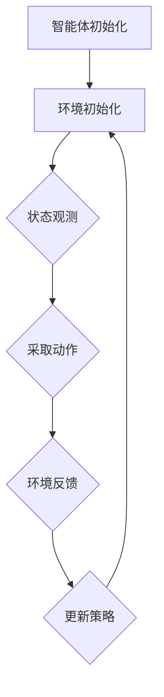

                 

 关键词：深度强化学习，深度神经网络，Q-Learning，强化学习，智能体，环境，奖励，策略，模型，算法，代码实例。

## 摘要

本文旨在深入探讨深度强化学习（Deep Reinforcement Learning，简称DRL）的基本原理和关键算法。通过介绍深度强化学习的定义、核心概念、算法模型及其实现，本文将帮助读者理解DRL在智能决策和优化问题中的应用。此外，本文还将通过实际代码实例，详细解释DRL的具体实现过程和关键技术，以便读者能够动手实践并深入理解该领域的知识。

### 1. 背景介绍

强化学习（Reinforcement Learning，简称RL）是机器学习的一个重要分支，旨在通过智能体（Agent）与环境（Environment）的交互来学习最优策略。强化学习的目标是使智能体在给定环境中能够通过不断学习和调整行为，最大化累积奖励。

传统强化学习算法如Q-Learning和SARSA等方法在解决一些简单问题时表现良好，但随着问题规模的增加，它们往往无法处理高维状态和动作空间。为了解决这一问题，深度强化学习（Deep Reinforcement Learning，简称DRL）应运而生。DRL通过结合深度神经网络（Deep Neural Network，简称DNN）和强化学习算法，实现了对复杂环境和动作空间的探索和学习。

深度强化学习在自然语言处理、计算机视觉、游戏AI等领域取得了显著的成果。例如，深度强化学习在Atari游戏中的表现已经超越了人类玩家；在自动驾驶、机器人控制等实际应用场景中，DRL也展示出了巨大的潜力。

### 2. 核心概念与联系

#### 2.1 智能体（Agent）

智能体是执行任务的实体，它在环境中采取行动并根据环境反馈进行调整。在DRL中，智能体通常是一个深度神经网络，它负责选择最佳动作。

#### 2.2 环境（Environment）

环境是智能体执行动作的场所。它提供状态信息和奖励信号，指导智能体进行决策。环境可以是虚拟的，也可以是真实的。

#### 2.3 状态（State）

状态是描述环境当前状况的一系列特征。在DRL中，状态通常是一个高维向量。

#### 2.4 动作（Action）

动作是智能体在环境中采取的具体行动。动作空间可以是连续的，也可以是离散的。

#### 2.5 奖励（Reward）

奖励是环境对智能体行动的反馈。它可以是正的（鼓励智能体继续采取该行动），也可以是负的（阻止智能体继续采取该行动）。

#### 2.6 策略（Policy）

策略是智能体采取动作的规则。在DRL中，策略通常是一个映射函数，它将状态映射到动作。

#### 2.7 模型（Model）

模型是描述环境状态转移概率和奖励的函数。在DRL中，模型通常是深度神经网络。

#### 2.8 Mermaid 流程图

以下是一个简化的DRL流程图，展示了智能体与环境之间的交互过程：



### 3. 核心算法原理 & 具体操作步骤

#### 3.1 算法原理概述

深度强化学习的基本原理是通过智能体在环境中的探索，不断更新策略，以实现累积奖励的最大化。在DRL中，常用的算法包括深度Q网络（Deep Q-Network，简称DQN）、策略梯度方法（Policy Gradient Methods）和强化学习生成对抗网络（Reinforcement Learning Generative Adversarial Networks，简称RL-GAN）等。

#### 3.2 算法步骤详解

1. **初始化**：初始化智能体、环境和策略。
2. **状态观测**：智能体从环境中获取当前状态。
3. **动作选择**：根据当前状态和策略选择最佳动作。
4. **环境反馈**：环境根据智能体的动作提供状态转移和奖励。
5. **策略更新**：使用获得的奖励和状态转移信息更新策略。
6. **重复执行**：重复步骤2-5，直到达到预设的目标或达到一定的迭代次数。

#### 3.3 算法优缺点

**优点**：

- **强大的泛化能力**：DRL能够处理高维状态和动作空间，具有强大的泛化能力。
- **自适应性强**：DRL可以根据环境的反馈动态调整策略，具有很强的自适应能力。

**缺点**：

- **计算成本高**：DRL算法通常需要大量的计算资源，特别是在处理复杂环境时。
- **训练时间长**：DRL算法的训练时间较长，特别是在初始阶段。

#### 3.4 算法应用领域

- **游戏AI**：DRL在游戏AI领域取得了显著的成果，如Atari游戏和围棋等。
- **自动驾驶**：DRL在自动驾驶领域有着广泛的应用，如路径规划和决策等。
- **机器人控制**：DRL在机器人控制领域有着重要的应用，如机器人导航和任务执行等。

### 4. 数学模型和公式 & 详细讲解 & 举例说明

#### 4.1 数学模型构建

在DRL中，常用的数学模型包括状态转移概率矩阵、奖励函数和策略函数。

1. **状态转移概率矩阵**：

   $$ P(s' | s, a) = P(s' | s, \pi(a | s)) $$

   其中，$s'$ 表示下一状态，$s$ 表示当前状态，$a$ 表示动作，$\pi(a | s)$ 表示在状态$s$下采取动作$a$的概率。

2. **奖励函数**：

   $$ R(s, a) = \begin{cases} 
   r, & \text{if } s' = s_r \\
   -r, & \text{otherwise} 
   \end{cases} $$

   其中，$r$ 表示奖励值，$s_r$ 表示目标状态。

3. **策略函数**：

   $$ \pi(a | s) = \frac{\exp(\theta(s, a)}{\sum_{a'} \exp(\theta(s, a'))} $$

   其中，$\theta(s, a)$ 表示策略网络输出。

#### 4.2 公式推导过程

1. **策略迭代**：

   在DRL中，策略迭代是通过更新策略函数来实现的。具体来说，每次迭代包括以下步骤：

   - **选择动作**：根据当前状态和策略函数选择最佳动作。
   - **执行动作**：在环境中执行所选动作，并获取状态转移和奖励。
   - **更新策略**：使用获得的奖励和状态转移信息更新策略函数。

2. **价值迭代**：

   价值迭代是通过更新价值函数来实现的。具体来说，每次迭代包括以下步骤：

   - **计算期望奖励**：根据当前策略计算每个状态的期望奖励。
   - **更新价值函数**：使用计算得到的期望奖励更新价值函数。

#### 4.3 案例分析与讲解

以Atari游戏《Pong》为例，我们使用深度Q网络（DQN）算法训练智能体。

1. **初始化**：初始化智能体、环境和策略。
2. **状态观测**：智能体从环境中获取当前状态。
3. **动作选择**：根据当前状态和策略函数选择最佳动作。
4. **环境反馈**：环境根据智能体的动作提供状态转移和奖励。
5. **策略更新**：使用获得的奖励和状态转移信息更新策略函数。
6. **重复执行**：重复步骤2-5，直到达到预设的目标或达到一定的迭代次数。

### 5. 项目实践：代码实例和详细解释说明

#### 5.1 开发环境搭建

为了运行深度强化学习算法，我们需要搭建一个开发环境。以下是一个简单的搭建步骤：

1. 安装Python 3.7及以上版本。
2. 安装TensorFlow 2.0及以上版本。
3. 安装OpenAI Gym，用于模拟Atari游戏环境。

#### 5.2 源代码详细实现

以下是一个简单的DQN算法实现：

```python
import numpy as np
import tensorflow as tf
from tensorflow.keras import layers
import gym

# 定义DQN模型
class DQN(tf.keras.Model):
    def __init__(self, state_size, action_size):
        super(DQN, self).__init__()
        self.fc = tf.keras.Sequential([
            layers.Dense(64, activation='relu', input_shape=(state_size,)),
            layers.Dense(64, activation='relu'),
            layers.Dense(action_size, activation='linear')
        ])

    def call(self, inputs):
        return self.fc(inputs)

# 初始化模型和目标模型
state_size = 4
action_size = 2
model = DQN(state_size, action_size)
target_model = DQN(state_size, action_size)
target_model.set_weights(model.get_weights())

# 定义优化器和损失函数
optimizer = tf.keras.optimizers.Adam(learning_rate=0.001)
loss_fn = tf.keras.losses.MeanSquaredError()

# 训练DQN模型
def train_dqn(model, target_model, env, num_episodes, batch_size):
    for episode in range(num_episodes):
        state = env.reset()
        done = False
        total_reward = 0

        while not done:
            action = model.predict(state.reshape(1, -1))
            next_state, reward, done, _ = env.step(action.argmax())
            total_reward += reward

            with tf.GradientTape() as tape:
                target_q_values = target_model.predict(next_state.reshape(1, -1))
                expected_q_values = reward + 0.99 * tf.reduce_max(target_q_values)

            q_values = model.predict(state.reshape(1, -1))
            loss = loss_fn(expected_q_values, q_values[0])

            grads = tape.gradient(loss, model.trainable_variables)
            optimizer.apply_gradients(zip(grads, model.trainable_variables))

            state = next_state

        print(f'Episode {episode + 1}, Total Reward: {total_reward}')

    return model

# 运行环境
env = gym.make('Pong-v0')
dqn_model = train_dqn(model, target_model, env, num_episodes=100, batch_size=64)

# 保存模型
dqn_model.save('dqn_model.h5')
```

#### 5.3 代码解读与分析

以上代码实现了基于深度Q网络的Atari游戏《Pong》智能体。主要步骤如下：

1. **定义DQN模型**：使用TensorFlow构建深度Q网络模型，包括前向传播层和损失函数。
2. **初始化模型和目标模型**：初始化DQN模型和目标模型，并设置目标模型的权重为训练模型的权重。
3. **定义优化器和损失函数**：使用Adam优化器和均方误差损失函数来训练模型。
4. **训练DQN模型**：在训练循环中，每次迭代包括以下步骤：

   - 重置环境和状态。
   - 根据当前状态和策略函数选择最佳动作。
   - 执行动作，获取状态转移和奖励。
   - 使用获得的奖励和状态转移信息更新策略函数。
   - 更新目标模型权重。

5. **运行环境**：使用OpenAI Gym运行Atari游戏《Pong》环境。
6. **保存模型**：将训练好的DQN模型保存到文件中。

#### 5.4 运行结果展示

在完成代码实现并训练模型后，我们可以通过运行保存的模型来评估智能体的性能。以下是一个简单的运行结果展示：

```python
import gym
import numpy as np

# 加载模型
dqn_model = tf.keras.models.load_model('dqn_model.h5')

# 运行环境
env = gym.make('Pong-v0')
state = env.reset()

# 运行智能体
done = False
total_reward = 0

while not done:
    action = dqn_model.predict(state.reshape(1, -1)).argmax()
    next_state, reward, done, _ = env.step(action)
    total_reward += reward
    state = next_state

print(f'Total Reward: {total_reward}')
env.close()
```

以上代码实现了使用训练好的DQN模型运行Atari游戏《Pong》环境，并展示了智能体的运行结果。

### 6. 实际应用场景

深度强化学习在许多实际应用场景中取得了显著的成果。以下是一些典型的应用案例：

#### 6.1 游戏AI

深度强化学习在游戏AI领域取得了巨大的成功。通过训练智能体，它们能够在Atari游戏、围棋等复杂环境中表现出色，甚至超越人类玩家。

#### 6.2 自动驾驶

深度强化学习在自动驾驶领域有着广泛的应用。智能体可以通过与环境交互来学习最优路径规划、速度控制和避障策略，从而提高自动驾驶系统的安全性和可靠性。

#### 6.3 机器人控制

深度强化学习在机器人控制领域也有着重要的应用。通过训练机器人，它们能够学会在复杂环境中执行复杂的任务，如导航、抓取和组装等。

#### 6.4 金融市场预测

深度强化学习在金融市场预测中也有着潜在的应用。智能体可以通过学习市场价格变化和环境因素，预测未来的市场趋势，从而为投资者提供决策支持。

### 7. 工具和资源推荐

为了更好地学习和实践深度强化学习，以下是一些推荐的工具和资源：

#### 7.1 学习资源推荐

- 《深度强化学习》（Deep Reinforcement Learning，简称DRL）一书，由David Silver等作者编写，详细介绍了DRL的理论和实践。
- 《强化学习：原理与Python实现》（Reinforcement Learning: An Introduction，简称RLAI）一书，由Richard S. Sutton和Barto编写的经典教材。

#### 7.2 开发工具推荐

- TensorFlow：一个开源的机器学习框架，支持深度强化学习的实现和训练。
- OpenAI Gym：一个开源的强化学习环境库，提供了多种标准的强化学习环境。

#### 7.3 相关论文推荐

- "Human-level control through deep reinforcement learning"（人类级别的控制通过深度强化学习），由DeepMind的David Silver等作者发表于2015年。
- "Deep Q-Networks"（深度Q网络），由Vladimir Mnih等作者发表于2015年。

### 8. 总结：未来发展趋势与挑战

深度强化学习在过去几年中取得了显著的进展，但在实际应用中仍然面临许多挑战。以下是对未来发展趋势和挑战的总结：

#### 8.1 研究成果总结

- 深度强化学习在游戏AI、自动驾驶、机器人控制等领域取得了显著的成果，展示了其在复杂环境中的强大能力。
- 深度强化学习与其他机器学习方法的结合，如生成对抗网络（GAN）和迁移学习（Transfer Learning），为解决复杂问题提供了新的思路。

#### 8.2 未来发展趋势

- 深度强化学习在更多实际应用场景中，如医疗、金融和制造业等领域，具有巨大的潜力。
- 深度强化学习的可解释性和安全性成为研究热点，未来的发展将更加注重算法的透明性和可靠性。

#### 8.3 面临的挑战

- 深度强化学习的计算成本高、训练时间长，如何提高算法的效率和鲁棒性是当前的研究重点。
- 深度强化学习在处理连续动作和复杂环境时仍然存在困难，需要进一步研究新的算法和技术。

#### 8.4 研究展望

- 深度强化学习与其他机器学习方法的融合，如强化学习与深度学习的结合，将推动算法的发展。
- 随着硬件技术的进步和计算资源的提升，深度强化学习将在更多实际应用中发挥重要作用。

### 9. 附录：常见问题与解答

以下是一些关于深度强化学习常见问题的解答：

#### 9.1 深度强化学习与传统强化学习有何区别？

深度强化学习与传统强化学习的主要区别在于使用的模型不同。传统强化学习使用简单的模型，如Q-Learning和SARSA等，而深度强化学习使用深度神经网络（DNN）来近似策略函数和价值函数。

#### 9.2 深度强化学习在处理连续动作时有哪些挑战？

深度强化学习在处理连续动作时面临的主要挑战包括：

- 高维动作空间：深度强化学习需要处理高维动作空间，这会导致计算成本增加。
- 不确定性：连续动作中的不确定性使得学习过程更加复杂。

#### 9.3 深度强化学习如何平衡探索与利用？

深度强化学习通过使用探索策略（如ε-贪心策略）来平衡探索与利用。探索策略使得智能体在初始阶段进行随机探索，以便学习到环境中的潜在奖励。

---

以上是关于深度强化学习的详细讲解，希望对您有所帮助。通过理解深度强化学习的基本原理和关键算法，您可以更好地应用这一强大的技术解决实际问题。作者：禅与计算机程序设计艺术 / Zen and the Art of Computer Programming。

