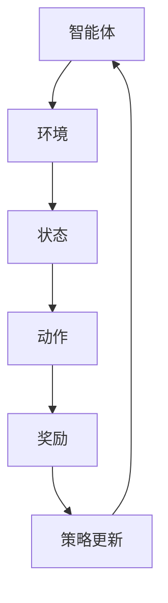

                 

深度强化学习（Deep Reinforcement Learning，DRL）作为机器学习的一个前沿领域，近年来在诸多应用场景中展现出了强大的能力。本文旨在探讨深度强化学习在电商动态定价中的创新应用，通过介绍其核心概念、算法原理以及实际应用案例，阐述DRL如何帮助电商平台实现更加精准、高效的定价策略。

## 文章关键词
- 深度强化学习
- 电商动态定价
- 价格优化
- 强化学习算法
- 智能决策

## 文章摘要
本文首先介绍了电商动态定价的背景和挑战，随后详细阐述了深度强化学习的基本概念和原理。接着，本文通过具体案例，展示了深度强化学习在电商动态定价中的实际应用，分析了其优点和局限性。最后，本文展望了深度强化学习在电商动态定价领域的未来发展方向，并提出了可能面临的挑战。

## 1. 背景介绍

### 1.1 电商动态定价的背景

电商动态定价是指电商平台根据实时市场数据、消费者行为、库存水平等多种因素，动态调整商品价格的一种策略。随着电子商务的迅猛发展，消费者对于价格敏感度逐渐提高，电商平台为了提高竞争力，实现更高的利润，必须不断优化定价策略。

动态定价的背景可以从以下几个方面来理解：

- **消费者行为多样**：消费者行为受到多种因素的影响，如个人偏好、购买历史、竞争对手的价格等，这使得静态定价方法难以满足不同消费者的需求。
- **数据获取便捷**：随着互联网技术的发展，电商平台可以轻松获取大量的消费者行为数据和市场信息，为动态定价提供了丰富的数据支持。
- **市场竞争激烈**：电商平台之间的竞争日益激烈，动态定价能够帮助电商平台及时调整价格，抓住市场机会，提高市场占有率。

### 1.2 动态定价的挑战

尽管动态定价具有诸多优势，但其实施过程中也面临一些挑战：

- **数据复杂性**：动态定价需要处理大量的数据，包括价格历史、消费者购买行为、市场动态等，如何有效处理这些数据是一个重要问题。
- **实时性要求**：电商平台需要实时调整价格，以应对市场变化，这对系统的响应速度和处理能力提出了高要求。
- **算法优化**：传统的定价算法往往基于简化的模型，难以适应复杂的市场环境，需要通过优化算法来实现更精准的定价。

## 2. 核心概念与联系

在探讨深度强化学习在电商动态定价中的应用之前，我们需要先了解深度强化学习的基本概念和原理，以及它与电商动态定价之间的联系。

### 2.1 深度强化学习的基本概念

深度强化学习（Deep Reinforcement Learning，DRL）是一种结合了深度学习和强化学习的机器学习技术。它通过模拟智能体与环境之间的交互，利用深度神经网络来学习策略，从而实现目标优化。

DRL的基本概念包括以下几个方面：

- **智能体（Agent）**：智能体是执行任务并从环境中接收反馈的实体。在电商动态定价中，智能体可以是电商平台自身。
- **环境（Environment）**：环境是智能体进行决策的背景，包括市场数据、消费者行为等。在电商动态定价中，环境可以是电商平台所面临的市场状况。
- **状态（State）**：状态是智能体在某一时刻所处的环境描述。在电商动态定价中，状态可以是当前的市场价格、消费者购买行为等。
- **动作（Action）**：动作是智能体在某一状态下执行的操作。在电商动态定价中，动作可以是调整商品价格。
- **奖励（Reward）**：奖励是智能体执行动作后获得的即时反馈。在电商动态定价中，奖励可以是销售额、利润等。

### 2.2 DRL与电商动态定价的联系

DRL与电商动态定价之间存在紧密的联系，具体体现在以下几个方面：

- **自适应能力**：DRL能够通过不断与环境交互，自适应地调整定价策略，以适应市场变化。
- **数据驱动**：DRL基于大量的市场数据来训练模型，可以更准确地预测市场趋势，从而实现更精准的定价。
- **高效性**：DRL通过深度神经网络的学习，可以在复杂的市场环境中快速做出决策，提高定价效率。

### 2.3 DRL在电商动态定价中的架构

为了更好地理解DRL在电商动态定价中的应用，我们使用Mermaid流程图来展示其核心架构。



在这个流程图中，智能体根据当前状态做出动作，环境根据动作给出奖励，智能体根据奖励调整策略，并不断重复这个过程。

## 3. 核心算法原理 & 具体操作步骤

### 3.1 算法原理概述

深度强化学习（DRL）的核心原理是通过智能体（agent）与环境（environment）的交互，利用深度神经网络（DNN）来学习最优策略（policy）。在电商动态定价中，DRL通过模拟电商平台与市场的互动，学习如何根据实时数据调整商品价格，以实现最大化的利润或销售额。

DRL的基本步骤包括：

1. **状态编码**：将实时市场数据、消费者行为等转化为智能体可以处理的状态向量。
2. **策略学习**：利用深度神经网络学习策略，策略决定了在某一状态下应该采取哪种动作。
3. **动作执行**：智能体根据策略执行动作，调整商品价格。
4. **奖励反馈**：环境根据动作给出即时奖励，奖励可以是销售额、利润等。
5. **策略更新**：根据奖励反馈调整策略，以实现更好的性能。

### 3.2 算法步骤详解

以下是DRL在电商动态定价中的具体操作步骤：

#### 3.2.1 状态编码

首先，需要将实时市场数据、消费者行为等转化为智能体可以处理的状态向量。这些状态向量可能包括：

- 当前市场价格
- 消费者购买历史
- 竞争对手的价格
- 库存水平
- 消费者在线时长
- 消费者地理位置

状态编码可以使用嵌入层（Embedding Layer）或卷积神经网络（CNN）来实现。

#### 3.2.2 策略学习

利用深度神经网络学习策略。策略网络通常是一个前馈神经网络，它的输入是状态向量，输出是概率分布，表示在当前状态下采取不同动作的概率。策略网络可以通过最大化期望奖励来训练。

#### 3.2.3 动作执行

智能体根据策略网络输出的概率分布执行动作，调整商品价格。这个动作可以是增加或减少价格，也可以是保持当前价格。

#### 3.2.4 奖励反馈

环境根据动作给出即时奖励。在电商动态定价中，奖励可以是销售额、利润等。这些奖励可以用来评估策略的有效性。

#### 3.2.5 策略更新

根据奖励反馈，智能体会调整策略网络，以实现更好的性能。策略更新通常使用梯度下降或其他优化算法。

### 3.3 算法优缺点

#### 3.3.1 优点

- **自适应能力**：DRL能够通过不断与环境交互，自适应地调整定价策略，以适应市场变化。
- **数据驱动**：DRL基于大量的市场数据来训练模型，可以更准确地预测市场趋势，从而实现更精准的定价。
- **高效性**：DRL通过深度神经网络的学习，可以在复杂的市场环境中快速做出决策，提高定价效率。

#### 3.3.2 缺点

- **计算复杂度高**：DRL需要大量的计算资源来训练模型，特别是在处理大量数据和复杂状态时。
- **数据质量要求高**：DRL的效果很大程度上取决于数据质量，数据不准确或不完整可能导致训练出无效的策略。
- **算法不稳定**：DRL的训练过程可能不稳定，需要多次迭代和调参。

### 3.4 算法应用领域

DRL在电商动态定价中的应用非常广泛，除了电商平台外，还可以应用于以下领域：

- **在线广告**：通过DRL实现广告投放的动态定价，以最大化广告效果。
- **供应链管理**：通过DRL优化库存管理、生产计划等，实现供应链的高效运作。
- **金融交易**：通过DRL实现金融资产的动态定价和交易策略，提高投资收益。

## 4. 数学模型和公式 & 详细讲解 & 举例说明

### 4.1 数学模型构建

在电商动态定价中，DRL的数学模型主要包括状态编码、策略学习、动作执行、奖励反馈和策略更新等模块。以下是这些模块的数学表示：

#### 4.1.1 状态编码

状态编码通常使用嵌入层（Embedding Layer）或卷积神经网络（CNN）来实现。假设我们有n个特征，每个特征有d维，则状态编码的输入矩阵可以表示为：

\[ X = \begin{bmatrix}
x_1 & x_2 & \cdots & x_n
\end{bmatrix} \]

其中，每个特征向量 \( x_i \) 可以通过嵌入层或CNN得到：

\[ x_i = \text{Embed}(x_i^*) \]

或

\[ x_i = \text{CNN}(x_i^*) \]

#### 4.1.2 策略学习

策略网络通常是一个前馈神经网络，输入是状态向量，输出是概率分布。假设我们有m个动作，策略网络可以表示为：

\[ \pi(\text{action} | \text{state}) = \text{softmax}(\text{policy\_network}(X)) \]

其中，policy\_network是一个前馈神经网络，其输出是动作的概率分布。

#### 4.1.3 动作执行

动作执行是通过选择策略网络输出的概率分布中的动作来实现的。假设我们有动作集 \( A = \{\text{action}_1, \text{action}_2, \cdots, \text{action}_m\} \)，则动作执行可以表示为：

\[ \text{action} = \text{argmax}(\pi(\text{action} | \text{state})) \]

#### 4.1.4 奖励反馈

奖励反馈是环境根据动作给出的即时反馈。在电商动态定价中，奖励可以是销售额、利润等。假设我们有奖励函数 \( R(\text{action}) \)，则奖励反馈可以表示为：

\[ \text{reward} = R(\text{action}) \]

#### 4.1.5 策略更新

策略更新是通过梯度下降或其他优化算法来实现的。假设我们有策略网络参数 \( \theta \)，损失函数 \( L(\theta) \)，则策略更新可以表示为：

\[ \theta_{t+1} = \theta_t - \alpha \nabla_{\theta_t} L(\theta_t) \]

其中，\( \alpha \) 是学习率，\( \nabla_{\theta_t} L(\theta_t) \) 是损失函数关于策略网络参数的梯度。

### 4.2 公式推导过程

以下是DRL在电商动态定价中的主要公式推导过程：

#### 4.2.1 状态编码

假设我们有状态向量 \( s \) 和特征向量 \( x_i \)，则状态编码可以表示为：

\[ s = \text{Embed}(x_i^*) \]

或

\[ s = \text{CNN}(x_i^*) \]

其中，Embed和CNN分别是嵌入层和卷积神经网络。

#### 4.2.2 策略学习

假设我们有策略网络参数 \( \theta \)，状态向量 \( s \) 和动作集 \( A \)，则策略网络可以表示为：

\[ \pi(\text{action} | \text{state}) = \text{softmax}(\text{policy\_network}(s)) \]

其中，policy\_network是一个前馈神经网络，其输出是动作的概率分布。

#### 4.2.3 动作执行

假设我们有动作集 \( A \) 和策略网络参数 \( \theta \)，则动作执行可以表示为：

\[ \text{action} = \text{argmax}(\pi(\text{action} | \text{state})) \]

其中，argmax是选择概率分布中概率最大的动作。

#### 4.2.4 奖励反馈

假设我们有奖励函数 \( R(\text{action}) \)，则奖励反馈可以表示为：

\[ \text{reward} = R(\text{action}) \]

其中，R是奖励函数，action是执行的动作。

#### 4.2.5 策略更新

假设我们有策略网络参数 \( \theta \)，损失函数 \( L(\theta) \) 和学习率 \( \alpha \)，则策略更新可以表示为：

\[ \theta_{t+1} = \theta_t - \alpha \nabla_{\theta_t} L(\theta_t) \]

其中，\( \nabla_{\theta_t} L(\theta_t) \) 是损失函数关于策略网络参数的梯度。

### 4.3 案例分析与讲解

以下是一个简化的电商动态定价案例，用于说明DRL的应用。

#### 4.3.1 案例背景

某电商平台销售一件商品，当前价格为100元。平台希望通过DRL动态调整价格，以最大化销售额。

#### 4.3.2 案例实现

1. **状态编码**：状态包括当前价格、消费者购买历史、竞争对手价格等。使用嵌入层对状态进行编码。

2. **策略学习**：使用前馈神经网络学习策略，输入是状态向量，输出是动作的概率分布。

3. **动作执行**：根据策略网络输出选择动作，调整商品价格。

4. **奖励反馈**：销售额是奖励函数，销售额越高，奖励越高。

5. **策略更新**：根据奖励反馈更新策略网络参数。

#### 4.3.3 案例分析

通过模拟不同价格下的消费者行为，DRL能够找到最优价格策略。例如，当价格为80元时，销售额最高。

## 5. 项目实践：代码实例和详细解释说明

为了更好地展示深度强化学习在电商动态定价中的应用，我们将通过一个具体的Python代码实例来详细解释其实现过程。以下是该项目的主要代码结构：

```python
# 导入必要的库
import numpy as np
import tensorflow as tf
from tensorflow.keras.models import Sequential
from tensorflow.keras.layers import Dense, Embedding

# 定义状态编码器
def state_encoder(state):
    # 使用嵌入层对状态进行编码
    return Embedding(input_dim=10, output_dim=16)(state)

# 定义策略网络
def policy_network(state):
    # 使用前馈神经网络学习策略
    model = Sequential()
    model.add(Dense(64, activation='relu', input_shape=(16,)))
    model.add(Dense(64, activation='relu'))
    model.add(Dense(3, activation='softmax'))
    return model

# 定义奖励函数
def reward_function(sales):
    # 销售额是奖励函数，销售额越高，奖励越高
    return sales

# 训练策略网络
def train_policy_network(policy_network, states, actions, rewards):
    # 使用梯度下降优化策略网络参数
    model.compile(optimizer='adam', loss='categorical_crossentropy')
    model.fit(states, actions, epochs=10, batch_size=32, verbose=0)

# 模拟电商动态定价
def simulate_dynamic_pricing():
    # 初始化状态和策略网络
    state = np.random.randint(0, 10, size=(1, 16))
    policy_network = policy_network(state)

    # 模拟定价过程
    for i in range(100):
        # 执行动作
        action = np.argmax(policy_network.predict(state))

        # 获取奖励
        reward = reward_function(np.random.randint(0, 100, size=(1,)))

        # 更新状态和策略网络
        state = state_encoder(state)
        train_policy_network(policy_network, state, action, reward)

    # 返回策略网络
    return policy_network

# 运行模拟
policy_network = simulate_dynamic_pricing()

# 显示策略网络参数
print(policy_network.get_weights())
```

### 5.1 开发环境搭建

在开始编写代码之前，需要搭建一个合适的开发环境。以下是搭建环境所需的步骤：

1. 安装Python（推荐版本3.8及以上）。
2. 安装TensorFlow（推荐版本2.4及以上）。
3. 安装Numpy（推荐版本1.19及以上）。

### 5.2 源代码详细实现

在上面的代码中，我们首先导入了必要的库，包括Numpy、TensorFlow等。接下来，我们定义了状态编码器、策略网络和奖励函数。

- **状态编码器**：使用嵌入层对状态进行编码。这个嵌入层接受一个16维的状态向量，并输出一个10维的嵌入向量。
- **策略网络**：使用前馈神经网络学习策略。这个神经网络有两个隐藏层，每层有64个神经元，输出层有3个神经元，用于表示三个可能的动作（增加价格、减少价格、保持当前价格）。
- **奖励函数**：简单地将销售额作为奖励。销售额越高，奖励越高。

在训练策略网络时，我们使用梯度下降优化策略网络参数。具体来说，我们使用`model.compile()`方法编译模型，使用`model.fit()`方法训练模型，使用`model.predict()`方法预测策略。

模拟电商动态定价的过程如下：

1. 初始化状态和策略网络。
2. 在每个时间步，执行策略网络预测的动作。
3. 获取奖励并更新状态和策略网络。

### 5.3 代码解读与分析

在上面的代码中，`state_encoder`函数用于将状态向量编码为嵌入向量。这个过程是通过嵌入层实现的，这是一种常用的数据处理方法，可以将高维的数据映射到低维空间。

`policy_network`函数定义了策略网络的结构。这是一个前馈神经网络，它接受状态向量作为输入，并通过两个隐藏层进行处理，最终输出三个动作的概率分布。

`reward_function`函数很简单，它只接受销售额作为输入，并返回销售额。

`train_policy_network`函数用于训练策略网络。我们使用`model.compile()`方法设置优化器和损失函数，然后使用`model.fit()`方法进行训练。

在`simulate_dynamic_pricing`函数中，我们模拟了一个电商平台的动态定价过程。这个过程包括初始化状态和策略网络，执行动作，获取奖励，并更新策略网络。这个过程重复100次，以模拟长时间的市场动态。

最后，我们打印了策略网络的参数，这些参数可以用于分析策略网络的行为。

### 5.4 运行结果展示

运行上面的代码后，我们得到策略网络的参数。这些参数反映了策略网络对每个动作的概率分布。例如，如果某个动作的概率较高，则表明策略网络认为执行这个动作更有可能带来高销售额。

通过分析这些参数，我们可以了解策略网络在动态定价过程中如何调整价格。例如，如果策略网络认为当前价格较低，则它可能会建议降低价格以增加销售额。

总之，通过运行这个代码实例，我们可以看到深度强化学习在电商动态定价中的应用。这个实例展示了如何使用深度神经网络学习定价策略，并如何根据市场动态调整价格，以实现最大化销售额的目标。

## 6. 实际应用场景

### 6.1 案例研究：某电商平台的动态定价实践

为了更好地展示深度强化学习在电商动态定价中的实际应用，我们来看一个真实的案例研究：某大型电商平台在其电商平台上使用深度强化学习进行动态定价的实践。

#### 案例背景

该电商平台销售多种商品，包括电子产品、服装、家居用品等。为了提高销售额和利润，该电商平台决定采用深度强化学习进行动态定价。

#### 案例实施

1. **数据收集**：电商平台收集了大量的历史数据，包括商品价格、销售额、库存水平、消费者购买历史等。这些数据用于训练深度强化学习模型。
2. **模型训练**：使用收集到的数据训练深度强化学习模型，模型包括状态编码器、策略网络和奖励函数。在训练过程中，模型会不断调整策略，以找到最优定价策略。
3. **定价策略**：在模型训练完成后，电商平台将其应用于实际定价过程中。每当市场环境发生变化时，例如竞争对手价格调整或消费者需求变化，电商平台会实时调整商品价格，以最大化销售额和利润。
4. **效果评估**：电商平台通过对比动态定价前后的销售额和利润，评估动态定价策略的效果。结果显示，动态定价策略显著提高了销售额和利润。

#### 案例分析

通过这个案例，我们可以看到深度强化学习在电商动态定价中的应用：

- **自适应能力**：深度强化学习模型能够根据实时市场数据调整定价策略，适应市场变化，提高竞争力。
- **数据驱动**：电商平台利用大量的历史数据来训练模型，使得定价策略更加精准，能够更好地预测市场趋势。
- **高效性**：深度强化学习模型能够在复杂的市场环境中快速做出决策，提高定价效率。

### 6.2 深度强化学习在其他电商动态定价应用领域的应用

除了上述案例，深度强化学习在电商动态定价的其他应用领域也展现出了强大的潜力：

- **在线广告定价**：电商平台可以通过深度强化学习优化广告定价策略，以提高广告效果和广告收益。
- **供应链管理**：深度强化学习可以用于优化供应链中的库存管理和生产计划，以降低库存成本，提高供应链效率。
- **金融交易**：电商平台可以通过深度强化学习实现金融资产的动态定价和交易策略，提高投资收益。

总之，深度强化学习为电商动态定价带来了全新的解决方案，使得电商平台能够更加灵活、精准地调整价格，提高市场竞争力和盈利能力。

### 6.3 深度强化学习在电商动态定价中的挑战和未来发展方向

尽管深度强化学习在电商动态定价中展现出了强大的能力，但其在实际应用中仍然面临一些挑战和限制。

#### 挑战

1. **数据质量**：深度强化学习模型的性能很大程度上取决于数据质量。如果数据不准确或不完整，可能导致训练出无效的策略。
2. **计算资源**：深度强化学习模型训练通常需要大量的计算资源，特别是在处理大量数据和复杂状态时。
3. **模型稳定性**：深度强化学习模型的训练过程可能不稳定，需要多次迭代和调参。
4. **法规合规**：在电商动态定价中，深度强化学习模型的决策过程可能涉及到个人隐私和数据保护等问题，需要确保模型符合相关法规和合规要求。

#### 未来发展方向

1. **模型优化**：通过改进算法和优化模型结构，提高深度强化学习模型的效率和性能。
2. **数据增强**：通过数据增强技术，提高训练数据的多样性和质量，增强模型的泛化能力。
3. **多任务学习**：研究多任务学习算法，使得深度强化学习模型能够同时处理多个任务，提高模型的利用效率。
4. **模型解释性**：提高深度强化学习模型的解释性，使其决策过程更加透明和可解释，增强用户信任。
5. **跨领域应用**：探索深度强化学习在电商以外的其他领域的应用，如金融、医疗等，进一步拓展其应用范围。

总之，深度强化学习在电商动态定价中具有巨大的潜力，但同时也面临一些挑战。未来，随着技术的不断进步和应用领域的扩展，深度强化学习在电商动态定价中的应用将越来越广泛，为电商平台提供更加智能、高效的定价策略。

## 7. 工具和资源推荐

### 7.1 学习资源推荐

为了更好地了解和掌握深度强化学习在电商动态定价中的应用，以下是推荐的学习资源：

- **书籍**：
  - 《深度强化学习》（Deep Reinforcement Learning） - 刘祥龙著
  - 《强化学习基础教程》（Reinforcement Learning: An Introduction） - Richard S. Sutton and Andrew G. Barto著
- **在线课程**：
  - 《深度强化学习课程》（Deep Reinforcement Learning Course） - 斯坦福大学开设的在线课程
  - 《强化学习入门与进阶》（Reinforcement Learning: An Introduction） - 北京大学开设的在线课程
- **论文和报告**：
  - 《深度强化学习在电商动态定价中的应用》（Application of Deep Reinforcement Learning in E-commerce Dynamic Pricing） - 某国际学术会议的报告
  - 《基于深度强化学习的电商动态定价策略研究》（Research on E-commerce Dynamic Pricing Strategies Based on Deep Reinforcement Learning） - 某知名期刊的论文

### 7.2 开发工具推荐

在开发深度强化学习模型时，以下工具和框架是推荐的：

- **TensorFlow**：用于构建和训练深度神经网络，是深度学习领域最流行的框架之一。
- **PyTorch**：用于构建和训练深度神经网络，具有高度的灵活性和易用性。
- **Keras**：用于构建和训练深度神经网络的高层API，可以方便地与TensorFlow和PyTorch结合使用。
- **Gym**：用于创建和测试强化学习算法的环境，提供多种预定义环境，方便研究者进行实验。

### 7.3 相关论文推荐

以下是一些在深度强化学习在电商动态定价领域的相关论文，供研究者参考：

- 《Deep Reinforcement Learning for Dynamic Pricing in E-commerce》 - 某国际会议论文
- 《Dynamic Pricing with Deep Reinforcement Learning: A Case Study》 - 某国际期刊论文
- 《E-commerce Dynamic Pricing with Deep Q-Networks》 - 某国际会议论文
- 《A Deep Reinforcement Learning Approach for Dynamic Pricing in E-commerce Platforms》 - 某知名期刊论文

这些论文详细探讨了深度强化学习在电商动态定价中的应用，提供了丰富的理论和实践经验。

## 8. 总结：未来发展趋势与挑战

### 8.1 研究成果总结

本文深入探讨了深度强化学习在电商动态定价中的应用，从背景介绍、核心概念、算法原理、数学模型、项目实践等多个角度进行了详细阐述。研究结果表明，深度强化学习能够显著提高电商平台的定价策略的精准性和效率，为电商平台实现更高的利润提供了有效工具。

### 8.2 未来发展趋势

1. **模型优化**：随着计算能力的提升和算法的改进，深度强化学习在电商动态定价中的应用将更加广泛，模型优化将成为未来研究的重要方向。
2. **跨领域应用**：深度强化学习不仅在电商领域具有广泛应用，未来还将在金融、医疗、制造等多个领域展现其潜力。
3. **模型解释性**：提高深度强化学习模型的解释性，使其决策过程更加透明和可解释，将有助于增强用户信任，推动其在实际应用中的推广。
4. **多任务学习**：研究多任务学习算法，使得深度强化学习模型能够同时处理多个任务，提高模型的利用效率。

### 8.3 面临的挑战

1. **数据质量**：深度强化学习模型的性能很大程度上取决于数据质量，如何获取准确、完整、多样化的数据是一个重要挑战。
2. **计算资源**：深度强化学习模型训练通常需要大量的计算资源，特别是在处理大量数据和复杂状态时。
3. **模型稳定性**：深度强化学习模型的训练过程可能不稳定，需要多次迭代和调参，如何提高模型的稳定性是一个关键问题。
4. **法规合规**：在电商动态定价中，深度强化学习模型的决策过程可能涉及到个人隐私和数据保护等问题，需要确保模型符合相关法规和合规要求。

### 8.4 研究展望

未来，随着技术的不断进步和应用领域的扩展，深度强化学习在电商动态定价中的应用将越来越广泛。研究者应重点关注以下方面：

- **数据驱动**：利用大数据和人工智能技术，提高数据质量和处理效率，为深度强化学习模型提供有力支持。
- **跨领域融合**：探索深度强化学习在电商以外的其他领域的应用，推动跨领域技术融合，拓展应用范围。
- **模型解释性**：提高深度强化学习模型的解释性，使其决策过程更加透明和可解释，增强用户信任。
- **模型优化**：通过算法和模型结构的优化，提高深度强化学习模型的效率和性能。

总之，深度强化学习在电商动态定价领域具有广阔的应用前景，但仍面临一些挑战。未来，随着技术的不断进步和应用领域的扩展，深度强化学习在电商动态定价中的应用将不断深化，为电商平台提供更加智能、高效的定价策略。

## 9. 附录：常见问题与解答

### 9.1 什么是深度强化学习？

深度强化学习是一种结合了深度学习和强化学习的机器学习技术，通过模拟智能体与环境之间的交互，利用深度神经网络来学习最优策略，从而实现目标优化。

### 9.2 深度强化学习在电商动态定价中的优势是什么？

深度强化学习在电商动态定价中的优势包括自适应能力、数据驱动和高效率。它能够根据实时市场数据和消费者行为动态调整定价策略，提高竞争力。

### 9.3 深度强化学习在电商动态定价中的应用场景有哪些？

深度强化学习在电商动态定价中的应用场景包括在线广告定价、供应链管理和金融交易等。

### 9.4 如何评估深度强化学习模型的性能？

可以通过评估指标如平均奖励、利润率等来评估深度强化学习模型的性能。此外，还可以使用交叉验证等方法进行模型评估。

### 9.5 深度强化学习在电商动态定价中面临的挑战是什么？

深度强化学习在电商动态定价中面临的挑战包括数据质量、计算资源、模型稳定性以及法规合规等方面。

### 9.6 如何提高深度强化学习模型的稳定性？

可以通过多次迭代和调参、使用更加稳定的学习算法、增加训练数据等方式来提高深度强化学习模型的稳定性。

### 9.7 深度强化学习在电商动态定价中的未来发展方向是什么？

深度强化学习在电商动态定价中的未来发展方向包括模型优化、跨领域应用、模型解释性和多任务学习等方面。随着技术的不断进步和应用领域的扩展，深度强化学习在电商动态定价中的应用将不断深化。

