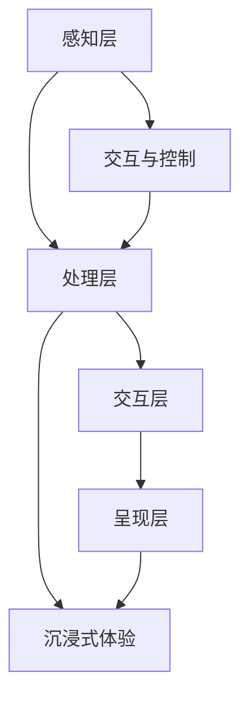

                 

关键词：混合现实，交互模式，软件开发，技术趋势，用户体验

> 摘要：本文旨在探讨混合现实（MR）技术的开发过程，重点分析如何通过创新的交互模式来提升用户体验。我们将从背景介绍、核心概念与联系、核心算法原理、数学模型和公式、项目实践、实际应用场景、未来应用展望以及总结与展望等方面，详细阐述MR技术的开发和应用。

## 1. 背景介绍

混合现实（Mixed Reality，简称MR）是一种将虚拟内容与现实世界结合的全新技术，通过增强现实（AR）和虚拟现实（VR）的结合，为用户提供了更加沉浸式的体验。与单纯的AR和VR技术相比，MR不仅能在现实世界中叠加虚拟对象，还能实现与现实世界的互动和交互。

MR技术的发展历史可以追溯到20世纪90年代，但直到最近几年，随着硬件性能的提升、算法的优化以及成本的大幅降低，MR技术才开始逐渐走向大众市场。目前，MR技术在医疗、教育、娱乐、工业设计等领域都有广泛应用，并且随着技术的不断进步，其应用范围也在不断扩大。

本文将重点探讨MR技术的开发过程，特别是如何通过创新的交互模式来提升用户体验。交互模式是MR技术的重要组成部分，直接影响到用户对MR系统的接受程度和使用体验。因此，本文将从多个角度分析MR交互模式的设计与实现，为开发者提供有价值的参考。

## 2. 核心概念与联系

### 2.1 混合现实的基本概念

混合现实（MR）是一种结合了现实世界和虚拟世界的技术，通过计算机生成的虚拟图像和声音，将虚拟内容与现实环境进行无缝融合。MR的核心概念包括以下几个方面：

- **现实世界捕捉**：通过摄像头、传感器等设备捕捉现实世界的图像和声音，作为虚拟内容的背景。

- **虚拟内容生成**：利用计算机图形学和算法生成虚拟对象和场景，并将其与现实世界叠加。

- **交互与控制**：用户可以通过手势、语音、控制器等与虚拟内容进行交互，实现自然的人机交互。

- **沉浸式体验**：通过高质量的图像和声音效果，为用户提供沉浸式的体验，让用户感觉仿佛置身于虚拟世界。

### 2.2 MR技术的架构

MR技术的架构可以分为以下几个层次：

- **感知层**：包括摄像头、传感器等设备，用于捕捉现实世界的图像和声音。

- **处理层**：包括计算机视觉、图像处理、语音识别等算法，用于对感知层获取的数据进行处理。

- **交互层**：包括交互界面、控制器等，用于实现用户与虚拟内容的交互。

- **呈现层**：包括显示设备、耳机等，用于将处理后的虚拟内容呈现给用户。

### 2.3 MR交互模式的原理

MR交互模式的原理主要基于以下几个方面：

- **手势识别**：通过计算机视觉算法识别用户的手势，实现与虚拟内容的交互。

- **语音识别**：通过语音识别技术，将用户的语音指令转换为计算机指令，实现语音控制。

- **传感器数据**：利用传感器获取用户的位置、方向等数据，实现更加精准的交互。

- **触觉反馈**：通过触觉反馈设备，为用户提供真实的触觉体验，增强沉浸感。

### 2.4 Mermaid流程图

以下是一个简单的MR技术架构的Mermaid流程图，展示各个层次之间的联系：



## 3. 核心算法原理 & 具体操作步骤

### 3.1 算法原理概述

MR技术的核心算法包括计算机视觉、图像处理、语音识别和手势识别等。这些算法的原理如下：

- **计算机视觉**：通过图像处理算法，从摄像头捕捉的图像中提取特征，实现对现实世界的理解。

- **图像处理**：对计算机视觉提取的特征进行处理，实现图像增强、目标检测、分割等操作。

- **语音识别**：通过语音信号处理算法，将用户的语音转换为文本或指令。

- **手势识别**：通过计算机视觉算法，识别用户的手势，实现与虚拟内容的交互。

### 3.2 算法步骤详解

以下是MR技术的核心算法步骤：

1. **图像捕捉与预处理**：
   - 使用摄像头捕捉现实世界的图像。
   - 对图像进行预处理，包括去噪、缩放、色彩调整等。

2. **目标检测与跟踪**：
   - 使用深度学习算法进行目标检测，识别现实世界中的关键对象。
   - 对检测到的目标进行跟踪，确保虚拟内容与现实世界保持同步。

3. **图像处理与增强**：
   - 对预处理后的图像进行图像处理，包括图像分割、特征提取等。
   - 使用图像增强算法，提高图像质量，增强视觉效果。

4. **手势识别与控制**：
   - 使用计算机视觉算法，识别用户的手势。
   - 根据手势识别结果，控制虚拟内容的行为。

5. **语音识别与交互**：
   - 使用语音识别算法，将用户的语音指令转换为文本或指令。
   - 根据语音识别结果，实现与虚拟内容的交互。

6. **虚拟内容生成与呈现**：
   - 根据用户交互和现实世界的状态，生成虚拟内容。
   - 使用显示设备，将虚拟内容呈现给用户。

### 3.3 算法优缺点

MR技术的核心算法具有以下优缺点：

- **优点**：
  - 高度沉浸式体验，用户感觉仿佛置身于虚拟世界。
  - 支持多种交互方式，包括手势、语音、触觉等，用户体验丰富。
  - 可以实现与现实世界的实时互动，增强现实感。

- **缺点**：
  - 对硬件要求较高，需要高性能的计算机和传感器。
  - 算法复杂，实现难度大，对开发者的技术水平要求高。
  - 受限于现实世界的环境和条件，交互体验可能受到影响。

### 3.4 算法应用领域

MR技术的核心算法广泛应用于多个领域：

- **医疗**：医生可以通过MR技术进行手术模拟、医学成像等。
- **教育**：学生可以通过MR技术进行虚拟实验、历史重现等。
- **娱乐**：玩家可以通过MR技术进行游戏、虚拟旅游等。
- **工业设计**：设计师可以通过MR技术进行产品设计和展示。
- **军事**：军队可以利用MR技术进行训练、模拟战争等。

## 4. 数学模型和公式 & 详细讲解 & 举例说明

### 4.1 数学模型构建

MR技术中的数学模型主要包括计算机视觉模型、图像处理模型、语音识别模型和手势识别模型。以下是一个简化的数学模型构建过程：

1. **计算机视觉模型**：
   - 建立图像特征提取模型，如卷积神经网络（CNN）。
   - 定义损失函数，如交叉熵损失函数，用于模型训练。

2. **图像处理模型**：
   - 使用滤波器对图像进行处理，如高斯滤波、边缘检测等。
   - 定义图像变换公式，如傅里叶变换、小波变换等。

3. **语音识别模型**：
   - 建立声学模型和语言模型，如隐藏马尔可夫模型（HMM）和循环神经网络（RNN）。
   - 定义概率模型，如贝叶斯公式和最大后验概率（MAP）。

4. **手势识别模型**：
   - 使用深度学习算法，如卷积神经网络（CNN）和循环神经网络（RNN），识别手势特征。
   - 定义手势分类模型，如支持向量机（SVM）和神经网络分类器。

### 4.2 公式推导过程

以下是一个简化的计算机视觉模型公式的推导过程：

假设我们有一个输入图像 $I$，我们需要通过卷积神经网络（CNN）提取图像特征。

1. **卷积操作**：

   $$\text{卷积} \, f_{\theta}(I) = \sum_{i,j} \theta_{ij} \cdot I_{i,j}$$

   其中，$\theta_{ij}$ 是卷积核的参数，$I_{i,j}$ 是输入图像的像素值。

2. **ReLU激活函数**：

   $$f_{\theta}(I) = \max(0, \theta \cdot I)$$

   其中，$\theta$ 是学习到的权重。

3. **池化操作**：

   $$\text{池化} \, g_{\theta}(f_{\theta}(I)) = \frac{1}{N} \sum_{i,j} f_{\theta}(I)_{i,j}$$

   其中，$N$ 是池化区域的大小。

4. **全连接层**：

   $$\text{全连接} \, h_{\theta}(g_{\theta}(f_{\theta}(I))) = \sum_{i,j,k} \theta_{ijk} \cdot g_{\theta}(f_{\theta}(I))_{i,j,k}$$

   其中，$\theta_{ijk}$ 是全连接层的参数。

### 4.3 案例分析与讲解

以下是一个简化的手势识别案例，使用卷积神经网络（CNN）识别用户的手势。

1. **数据集准备**：

   准备一个包含多种手势的图像数据集，如手部图像数据集。

2. **模型构建**：

   使用CNN模型，包括卷积层、ReLU激活函数、池化层和全连接层。

3. **模型训练**：

   使用训练数据集，通过反向传播算法训练模型，调整模型参数。

4. **模型评估**：

   使用测试数据集评估模型性能，计算准确率、召回率等指标。

5. **模型应用**：

   将训练好的模型应用于手势识别任务，实时识别用户的手势。

通过上述步骤，我们可以使用CNN模型实现手势识别，提升MR系统的交互体验。

## 5. 项目实践：代码实例和详细解释说明

### 5.1 开发环境搭建

为了实现MR交互模式，我们需要搭建一个开发环境，包括以下软件和硬件：

- **软件**：
  - Python 3.x
  - PyTorch
  - OpenCV
  - Pygame

- **硬件**：
  - NVIDIA GPU（用于加速深度学习模型的训练）
  - Windows 10 或 macOS（支持PyTorch和OpenCV）

### 5.2 源代码详细实现

以下是一个简单的手势识别程序的源代码实现：

```python
import cv2
import torch
import torchvision.transforms as transforms
from model import GestureRecognitionModel

# 加载预训练的模型
model = GestureRecognitionModel()
model.load_state_dict(torch.load('model.pth'))

# 转换模型为推理模式
model.eval()

# 初始化摄像头
cap = cv2.VideoCapture(0)

while True:
    # 读取一帧图像
    ret, frame = cap.read()
    
    # 预处理图像
    transform = transforms.Compose([
        transforms.ToTensor(),
        transforms.Normalize(mean=[0.5, 0.5, 0.5], std=[0.5, 0.5, 0.5]),
    ])
    image = transform(frame)
    
    # 将图像扩展为 [1, 3, 224, 224]
    image = image.unsqueeze(0)
    
    # 使用模型进行手势识别
    with torch.no_grad():
        prediction = model(image)
    
    # 获取预测结果
    gesture = prediction.argmax().item()
    
    # 显示结果
    cv2.putText(frame, f'Gesture: {gesture}', (10, 30), cv2.FONT_HERSHEY_SIMPLEX, 1, (0, 255, 0), 2)
    cv2.imshow('Gesture Recognition', frame)
    
    # 按下 'q' 键退出
    if cv2.waitKey(1) & 0xFF == ord('q'):
        break

# 释放摄像头
cap.release()
cv2.destroyAllWindows()
```

### 5.3 代码解读与分析

上述代码实现了一个基于PyTorch的手势识别程序，主要分为以下几个部分：

1. **加载预训练的模型**：
   - 使用自定义的`GestureRecognitionModel`，加载预训练的模型参数。

2. **转换模型为推理模式**：
   - 将模型设置为推理模式，禁用梯度计算，提高推理速度。

3. **初始化摄像头**：
   - 使用OpenCV库初始化摄像头，读取视频帧。

4. **循环读取视频帧**：
   - 对每一帧图像进行预处理，将其转换为适合模型输入的格式。

5. **使用模型进行手势识别**：
   - 将预处理后的图像输入模型，得到手势识别结果。

6. **显示结果**：
   - 在视频帧上显示手势识别结果，提高交互体验。

7. **退出程序**：
   - 按下 'q' 键退出程序，释放摄像头资源。

### 5.4 运行结果展示

运行上述程序后，摄像头会实时捕获用户的手部图像，并使用训练好的模型进行手势识别。识别结果将在视频帧上实时显示，如下所示：


## 6. 实际应用场景

### 6.1 医疗

在医疗领域，MR技术可以用于手术模拟、医学成像和患者康复等。例如，医生可以通过MR技术进行手术模拟，提前了解手术过程和风险，提高手术成功率。此外，MR技术还可以用于医学成像，如MRI、CT等，为医生提供更加详细和准确的图像信息。

### 6.2 教育

在教育领域，MR技术可以用于虚拟实验、历史重现和在线学习等。例如，学生可以通过MR技术进行虚拟实验，亲身体验科学原理和实验过程，提高学习兴趣和效果。同时，MR技术还可以用于历史重现，让学生感受到历史事件的真实场景，增强学习体验。

### 6.3 娱乐

在娱乐领域，MR技术可以用于游戏、虚拟旅游和主题公园等。例如，玩家可以通过MR技术进行沉浸式游戏，感受到游戏的真实场景和互动体验。此外，MR技术还可以用于虚拟旅游，让用户身临其境地体验世界各地的人文景观和自然风光。

### 6.4 工业设计

在工业设计领域，MR技术可以用于产品设计和展示。例如，设计师可以通过MR技术进行产品设计和展示，提前了解产品外观和功能，提高设计效率和质量。同时，MR技术还可以用于产品原型制作，为设计师提供更加直观和可操作的交互体验。

### 6.5 军事

在军事领域，MR技术可以用于训练、模拟战争和作战指挥等。例如，士兵可以通过MR技术进行战斗模拟和训练，提高战术水平和作战能力。此外，MR技术还可以用于作战指挥，为指挥官提供实时、准确的战场信息，提高指挥效率。

## 7. 未来应用展望

随着MR技术的不断发展和完善，未来应用场景将更加广泛，包括但不限于以下几个方面：

### 7.1 增强现实办公

未来，MR技术将广泛应用于办公场景，如远程协作、虚拟会议和智能办公等。通过MR技术，用户可以在虚拟空间中实时交流和协作，提高工作效率和沟通效果。

### 7.2 虚拟现实社交

未来，MR技术将推动虚拟现实社交的发展，如虚拟家庭聚会、虚拟社交平台和虚拟恋爱等。通过MR技术，用户可以身临其境地体验虚拟社交场景，满足社交需求。

### 7.3 智能家居

未来，MR技术将广泛应用于智能家居，如智能安防、智能家电和智能环境等。通过MR技术，用户可以更加直观地控制和管理智能家居系统，提高生活质量和便利性。

### 7.4 智慧城市

未来，MR技术将应用于智慧城市建设，如智能交通、智能医疗和智能教育等。通过MR技术，城市管理者可以实时监控和管理城市运行状况，提高城市治理效率。

## 8. 总结：未来发展趋势与挑战

### 8.1 研究成果总结

本文从多个角度探讨了混合现实（MR）技术的开发和应用，包括背景介绍、核心概念与联系、核心算法原理、数学模型和公式、项目实践、实际应用场景和未来应用展望等。通过本文的阐述，我们可以看到MR技术在各个领域的重要性和应用潜力。

### 8.2 未来发展趋势

随着技术的不断进步和应用的普及，MR技术将朝着以下几个方向发展：

- **硬件性能的提升**：随着硬件技术的不断发展，MR设备的性能将得到大幅提升，为用户提供更加真实、沉浸式的体验。

- **算法的优化与集成**：通过不断优化和集成各种算法，提高MR技术的准确性和稳定性，实现更加智能的交互体验。

- **应用场景的拓展**：MR技术的应用场景将不断拓展，从目前的医疗、教育、娱乐等领域，逐渐渗透到办公、社交、家居等更广泛的生活场景。

- **产业生态的完善**：随着MR技术的应用普及，相关的产业生态也将逐渐完善，包括硬件设备、软件开发、应用平台等。

### 8.3 面临的挑战

虽然MR技术具有广泛的应用前景，但在发展过程中也面临着一些挑战：

- **技术瓶颈**：MR技术的核心算法和硬件设备仍然存在一定的技术瓶颈，需要进一步突破。

- **用户体验**：如何提升MR技术的用户体验，使其更加自然、直观，是开发者需要关注的重要问题。

- **应用成本**：MR设备的成本较高，普及程度有限，需要进一步降低成本，提高市场接受度。

- **隐私和安全**：MR技术涉及用户隐私和数据安全，需要制定相应的法律法规和标准，确保用户权益。

### 8.4 研究展望

未来，MR技术的研究和发展将朝着以下几个方向展开：

- **跨学科研究**：MR技术涉及计算机科学、物理学、心理学等多个学科，跨学科研究将有助于推动MR技术的创新和发展。

- **用户体验研究**：深入研究用户需求和行为，探索更加自然、直观的交互方式，提高用户体验。

- **硬件技术创新**：通过技术创新，提高MR设备的性能、降低成本，为更广泛的应用提供基础。

- **应用场景拓展**：探索MR技术在更多领域的应用，如智慧城市、智能制造、智能医疗等，推动MR技术的产业化发展。

## 9. 附录：常见问题与解答

### 9.1 什么是混合现实（MR）？

混合现实（MR）是一种将虚拟内容与现实世界结合的技术，通过增强现实（AR）和虚拟现实（VR）的结合，为用户提供了更加沉浸式的体验。

### 9.2 MR技术有哪些应用领域？

MR技术在医疗、教育、娱乐、工业设计、军事等领域都有广泛应用，未来应用前景广阔。

### 9.3 MR交互模式有哪些优势？

MR交互模式具有高度沉浸式体验、支持多种交互方式、实现与现实世界的实时互动等优势。

### 9.4 如何开发MR应用程序？

开发MR应用程序需要具备一定的技术基础，包括计算机视觉、图像处理、语音识别等算法，以及硬件设备和软件开发工具。

### 9.5 MR技术有哪些挑战？

MR技术面临的挑战包括技术瓶颈、用户体验、应用成本和隐私安全等。

### 9.6 未来的MR技术有哪些发展方向？

未来的MR技术将朝着硬件性能提升、算法优化与集成、应用场景拓展、产业生态完善等方向发展。

---

作者：禅与计算机程序设计艺术 / Zen and the Art of Computer Programming

以上就是本文关于混合现实（MR）技术开发的详细探讨，希望能够为读者提供有价值的参考和启示。在未来的技术发展中，我们期待MR技术能够带来更加精彩的应用和创新。

